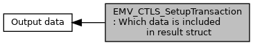

[Macros](#define-members)

Contents of the output in <a href="group___d_e_f___f_l_o_w___o_u_t_p_u_t.md#ab08da8ecbb047104d0c58e6f0ea141ee">EMV_CTLS_STARTRES_STRUCT::T_DF61_Info_Received_Data</a>, <a href="group___f_u_n_c___f_l_o_w.md#ga1a86c76dcf8fec6e97ead6cf8f2717ff">EMV_CTLS_SetupTransaction()</a> [More\...](#details)

Collaboration diagram for EMV_CTLS_SetupTransaction: Which data is included in result struct:

|  |  |
|----|----|
| Macros |  |
| #define  | [OUTPUT_CTLS_SEL_TXN_INFO](#ga92a2b1c47094479574095371e07bbf59)   0x01 |
|   | B1b1: <a href="group___d_e_f___f_l_o_w___o_u_t_p_u_t.md#a4c3b4d68baeb7717fc9788908b491929">EMV_CTLS_STARTRES_STRUCT::TxnInformation</a>. [More\...](#ga92a2b1c47094479574095371e07bbf59)  |

## DetailedDescription {#detailed-description}

Contents of the output in <a href="group___d_e_f___f_l_o_w___o_u_t_p_u_t.md#ab08da8ecbb047104d0c58e6f0ea141ee">EMV_CTLS_STARTRES_STRUCT::T_DF61_Info_Received_Data</a>, <a href="group___f_u_n_c___f_l_o_w.md#ga1a86c76dcf8fec6e97ead6cf8f2717ff">EMV_CTLS_SetupTransaction()</a>

## MacroDefinition Documentation {#macro-definition-documentation}

## OUTPUT_CTLS_SEL_TXN_INFO 

#define OUTPUT_CTLS_SEL_TXN_INFO   0x01

B1b1: <a href="group___d_e_f___f_l_o_w___o_u_t_p_u_t.md#a4c3b4d68baeb7717fc9788908b491929">EMV_CTLS_STARTRES_STRUCT::TxnInformation</a>.
