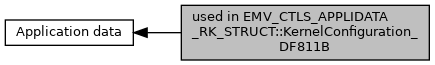

[Macros](#define-members)

Collaboration diagram for used in EMV_CTLS_APPLIDATA_RK_STRUCT::KernelConfiguration_DF811B:

|  |  |
|----|----|
| Macros |  |
| #define  | [EMV_CTLS_RK_CFG_ONDEVCVM](#gaecd4639fe1b2ea19a109e4306f24b8c8)   0x20 |
|   | On Device Cardholder Verification Support. [More\...](#gaecd4639fe1b2ea19a109e4306f24b8c8)  |

## DetailedDescription {#detailed-description}

## MacroDefinition Documentation {#macro-definition-documentation}

## EMV_CTLS_RK_CFG_ONDEVCVM 

#define EMV_CTLS_RK_CFG_ONDEVCVM   0x20

On Device Cardholder Verification Support.
