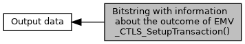

[Macros](#define-members)

Contents of <a href="group___d_e_f___f_l_o_w___o_u_t_p_u_t.md#a4c3b4d68baeb7717fc9788908b491929">EMV_CTLS_STARTRES_STRUCT::TxnInformation</a>, <a href="group___f_u_n_c___f_l_o_w.md#ga1a86c76dcf8fec6e97ead6cf8f2717ff">EMV_CTLS_SetupTransaction()</a> [More\...](#details)

Collaboration diagram for Bitstring with information about the outcome of EMV_CTLS_SetupTransaction():

|  |  |
|----|----|
| Macros |  |
| #define  | [EMV_CTLS_SETUPTRX_RES_CHKSUM_DIFF](#gadea17b2c441630f446077aecc543d4c4)   0x01 |
|   | B1b1: Checksum of configuration files changed, call of <a href="group___f_u_n_c___c_o_n_f.md#gaa5352e4331b8fd16eaa02b1bbb7027c2">EMV_CTLS_ApplyConfiguration()</a> may be needed. [More\...](#gadea17b2c441630f446077aecc543d4c4)  |

## DetailedDescription {#detailed-description}

Contents of <a href="group___d_e_f___f_l_o_w___o_u_t_p_u_t.md#a4c3b4d68baeb7717fc9788908b491929">EMV_CTLS_STARTRES_STRUCT::TxnInformation</a>, <a href="group___f_u_n_c___f_l_o_w.md#ga1a86c76dcf8fec6e97ead6cf8f2717ff">EMV_CTLS_SetupTransaction()</a>

## MacroDefinition Documentation {#macro-definition-documentation}

## EMV_CTLS_SETUPTRX_RES_CHKSUM_DIFF 

#define EMV_CTLS_SETUPTRX_RES_CHKSUM_DIFF   0x01

B1b1: Checksum of configuration files changed, call of <a href="group___f_u_n_c___c_o_n_f.md#gaa5352e4331b8fd16eaa02b1bbb7027c2">EMV_CTLS_ApplyConfiguration()</a> may be needed.
