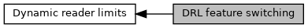

[Macros](#define-members)

Values for VISA and Amex DRL features which can be switched on and off. [More\...](#details)

Collaboration diagram for DRL feature switching:

|  |  |
|----|----|
| Macros |  |
| #define  | [VISA_DRL_DISABLE_ZERO_AMOUNT_CHECK](#ga12ec383641cfec38120306a3c8b32e56)   0x01 |
|   | b1: bit set: VISA: Disable the Zero Amount Check for this DRL entry (Visa default is on) [More\...](#ga12ec383641cfec38120306a3c8b32e56)  |
| #define  | [VISA_DRL_ENABLE_STATUS_CHECK](#ga2db98c4e380461a5394133a050a09851)   0x02 |
|   | b2: bit set: VISA: Enable the Status Check for this DRL entry (Visa default is off) [More\...](#ga2db98c4e380461a5394133a050a09851)  |
| #define  | [VISA_AMEX_DRL_DISABLE_FLOOR_LIMIT_CHECK](#ga5385adc1ae127ed1e5fa41f18aaa0b09)   0x20 |
|   | b6: bit set: AMEX and VISA: Disable the floor limit Check for this DRL entry (Default is on) [More\...](#ga5385adc1ae127ed1e5fa41f18aaa0b09)  |
| #define  | [VISA_AMEX_DRL_DISABLE_TRANS_LIMIT_CHECK](#ga7dab75a40d8700958668700f4291285b)   0x40 |
|   | b7: bit set: AMEX and VISA: Disable the transaction limit Check for this DRL entry (Default is on) [More\...](#ga7dab75a40d8700958668700f4291285b)  |
| #define  | [VISA_AMEX_DRL_DISABLE_CV_LIMIT_CHECK](#gaacea127ca1a6798446fc3cbcc17ada87)   0x80 |
|   | b8: bit set: AMEX and VISA: Disable the cardholder verification limit Check for this DRL entry (Default is on) [More\...](#gaacea127ca1a6798446fc3cbcc17ada87)  |

## DetailedDescription {#detailed-description}

Values for VISA and Amex DRL features which can be switched on and off.

## MacroDefinition Documentation {#macro-definition-documentation}

## VISA_AMEX_DRL_DISABLE_CV_LIMIT_CHECK 

#define VISA_AMEX_DRL_DISABLE_CV_LIMIT_CHECK   0x80

b8: bit set: AMEX and VISA: Disable the cardholder verification limit Check for this DRL entry (Default is on)

## VISA_AMEX_DRL_DISABLE_FLOOR_LIMIT_CHECK 

#define VISA_AMEX_DRL_DISABLE_FLOOR_LIMIT_CHECK   0x20

b6: bit set: AMEX and VISA: Disable the floor limit Check for this DRL entry (Default is on)

## VISA_AMEX_DRL_DISABLE_TRANS_LIMIT_CHECK 

#define VISA_AMEX_DRL_DISABLE_TRANS_LIMIT_CHECK   0x40

b7: bit set: AMEX and VISA: Disable the transaction limit Check for this DRL entry (Default is on)

## VISA_DRL_DISABLE_ZERO_AMOUNT_CHECK 

#define VISA_DRL_DISABLE_ZERO_AMOUNT_CHECK   0x01

b1: bit set: VISA: Disable the Zero Amount Check for this DRL entry (Visa default is on)

## VISA_DRL_ENABLE_STATUS_CHECK 

#define VISA_DRL_ENABLE_STATUS_CHECK   0x02

b2: bit set: VISA: Enable the Status Check for this DRL entry (Visa default is off)
