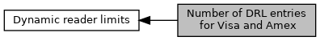

[Macros](#define-members)

For VISA and Amex: How many DRL entries are possible. [More\...](#details)

Collaboration diagram for Number of DRL entries for Visa and Amex:

|  |  |
|----|----|
| Macros |  |
| #define  | [EMV_ADK_DRL_ENTRIES_VISA](#ga4b25a3b0f01a081c9c1a6add56e94284)   4 |
|   | Maximal number of entries in <a href="group___d_e_f___c_o_n_f___a_p_p_l_i.md#a125164cdd7dd17625739afaed890ac0f">EMV_CTLS_APPLIDATA_VK_STRUCT::VisaDRLParams_FFAB01</a> supported for VFI-Reader configuration. [More\...](#ga4b25a3b0f01a081c9c1a6add56e94284)  |
| #define  | [EMV_ADK_DRL_ENTRIES_AMEX](#ga34516e6287cdcb0a372196096d612134)   16 |
|   | Maximal number of entries in <a href="group___d_e_f___c_o_n_f___a_p_p_l_i.md#adb7925c29affa71ae450ef807bd07e85">EMV_CTLS_APPLIDATA_AK_STRUCT::AmexDRLParams_FFAB01</a>. [More\...](#ga34516e6287cdcb0a372196096d612134)  |

## DetailedDescription {#detailed-description}

For VISA and Amex: How many DRL entries are possible.

## MacroDefinition Documentation {#macro-definition-documentation}

## EMV_ADK_DRL_ENTRIES_AMEX 

#define EMV_ADK_DRL_ENTRIES_AMEX   16

Maximal number of entries in <a href="group___d_e_f___c_o_n_f___a_p_p_l_i.md#adb7925c29affa71ae450ef807bd07e85">EMV_CTLS_APPLIDATA_AK_STRUCT::AmexDRLParams_FFAB01</a>.

## EMV_ADK_DRL_ENTRIES_VISA 

#define EMV_ADK_DRL_ENTRIES_VISA   4

Maximal number of entries in <a href="group___d_e_f___c_o_n_f___a_p_p_l_i.md#a125164cdd7dd17625739afaed890ac0f">EMV_CTLS_APPLIDATA_VK_STRUCT::VisaDRLParams_FFAB01</a> supported for VFI-Reader configuration.
