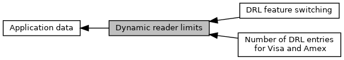

[Modules](#groups)

Collaboration diagram for Dynamic reader limits:

|  |  |
|----|----|
| Modules |  |
|   | <a href="group___d_r_l___f_e_a_t_u_r_e___s_w_i_t_c_h_s.md">DRL feature switching</a> |
|   | Values for VISA and Amex DRL features which can be switched on and off.  |
|   | <a href="group___d_r_l___m_a_x___e_n_t_r_i_e_s.md">Number of DRL entries for Visa and Amex</a> |
|   | For VISA and Amex: How many DRL entries are possible.  |

## DetailedDescription {#detailed-description}
