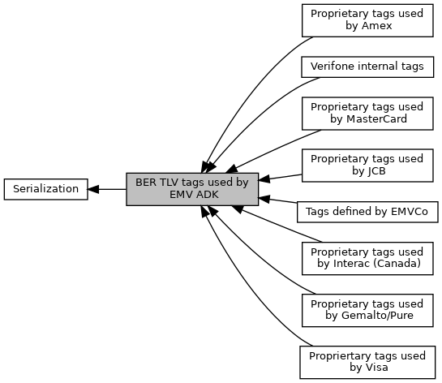

[Modules](#groups)

Collaboration diagram for BER TLV tags used by EMV ADK:

|  |  |
|----|----|
| Modules |  |
|   | <a href="group___e_m_v_c_o___t_a_g_s.md">Tags defined by EMVCo</a> |
|   | <a href="group___v_i_s_a___t_a_g_s.md">Propriertary tags used by Visa</a> |
|   | see \[Visa_Card\], page A-63  |
|   | <a href="group___m_c___t_a_g_s.md">Proprietary tags used by MasterCard</a> |
|   | see \[MC_FA\], page 7-78  |
|   | <a href="group___j_k___t_a_g_s.md">Proprietary tags used by JCB</a> |
|   | <a href="group___i_n_t_e_r_a_c___t_a_g_s.md">Proprietary tags used by Interac (Canada)</a> |
|   | <a href="group___e_x_p_r_e_s_s_p_a_y___t_a_g_s.md">Proprietary tags used by Amex</a> |
|   | <a href="group___g_e_m_a_l_t_o___t_a_g_s.md">Proprietary tags used by Gemalto/Pure</a> |
|   | <a href="group___v_e_r_i___t_a_g_s.md">Verifone internal tags</a> |
|   | There are many data objects, which do not have an EMVCo defined tags. For usage of TLV interface it\'s necessary to define internal tags.  |

## DetailedDescription {#detailed-description}
