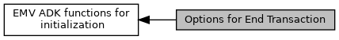

[Macros](#define-members)

Meaning of <a href="group___v_e_r_i___p_r_i_m___t_a_g_s__3_b_y_t_e.md#ga7809d602c4a9b6f1d35eac38754011fc">TAG_DF8F0A_EXIT_OPTIONS</a>, see also <a href="group___f_u_n_c___f_l_o_w.md#gaa7aed3c7f0c3ac0f26cc46efff422dd9">EMV_CTLS_EndTransaction()</a> [More\...](#details)

Collaboration diagram for Options for End Transaction:

|  |  |
|----|----|
| Macros |  |
| #define  | [END_TXN_CTLS_NO_LEDS_OFF](#gab52354d12038996994c3ff59597eb1fd)   0x01 |
|   | No LEDs off. [More\...](#gab52354d12038996994c3ff59597eb1fd)  |

## DetailedDescription {#detailed-description}

Meaning of <a href="group___v_e_r_i___p_r_i_m___t_a_g_s__3_b_y_t_e.md#ga7809d602c4a9b6f1d35eac38754011fc">TAG_DF8F0A_EXIT_OPTIONS</a>, see also <a href="group___f_u_n_c___f_l_o_w.md#gaa7aed3c7f0c3ac0f26cc46efff422dd9">EMV_CTLS_EndTransaction()</a>

## MacroDefinition Documentation {#macro-definition-documentation}

## END_TXN_CTLS_NO_LEDS_OFF 

#define END_TXN_CTLS_NO_LEDS_OFF   0x01

No LEDs off.
