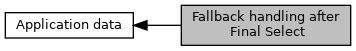

[Macros](#define-members)

DF18, see <a href="group___d_e_f___c_o_n_f___a_p_p_l_i.md#a9d0d4cedf99a248f40af087fdfa40b51">EMV_CT_APPLIDATA_STRUCT::uc_FallBack_Handling</a>. [More\...](#details)

Collaboration diagram for Fallback handling after Final Select:

|  |  |
|----|----|
| Macros |  |
| #define  | [FB_DEFAULT_EMVCO](#ga08667940126100a6e23c7bfefcbcf3cc)   0x00 |
|   | Fallback handling like described by EMVCo. [More\...](#ga08667940126100a6e23c7bfefcbcf3cc)  |
| #define  | [FB_GERMAN_POS_SPEC](#gabad71f7d9fd5a4875f7806317632ba87)   0x01 |
|   | Fallback handling according to German spec. Additional specification is done by <a href="group___s_p_e_c_i_a_l___t_r_x_s.md#ga9415cd28524e3d7ddf572591090e92a4">EMV_ADK_FALLBACK_AFTER_CVM_NO</a> and <a href="group___s_p_e_c_i_a_l___t_r_x_s.md#gaf275cc990cffcb01ac21d09d97303089">EMV_ADK_FALLBACK_AFTER_CVM_YES</a>. [More\...](#gabad71f7d9fd5a4875f7806317632ba87)  |
| #define  | [FB_NO_UNATTENDED_FALLB](#gaca4468d50f8e9a2fbcded608eb8767fb)   0x80 |
|   | Unattended terminal: Fallback forbidden. [More\...](#gaca4468d50f8e9a2fbcded608eb8767fb)  |

## DetailedDescription {#detailed-description}

DF18, see <a href="group___d_e_f___c_o_n_f___a_p_p_l_i.md#a9d0d4cedf99a248f40af087fdfa40b51">EMV_CT_APPLIDATA_STRUCT::uc_FallBack_Handling</a>.

## MacroDefinition Documentation {#macro-definition-documentation}

## FB_DEFAULT_EMVCO 

#define FB_DEFAULT_EMVCO   0x00

Fallback handling like described by EMVCo.

## FB_GERMAN_POS_SPEC 

#define FB_GERMAN_POS_SPEC   0x01

Fallback handling according to German spec. Additional specification is done by <a href="group___s_p_e_c_i_a_l___t_r_x_s.md#ga9415cd28524e3d7ddf572591090e92a4">EMV_ADK_FALLBACK_AFTER_CVM_NO</a> and <a href="group___s_p_e_c_i_a_l___t_r_x_s.md#gaf275cc990cffcb01ac21d09d97303089">EMV_ADK_FALLBACK_AFTER_CVM_YES</a>.

## FB_NO_UNATTENDED_FALLB 

#define FB_NO_UNATTENDED_FALLB   0x80

Unattended terminal: Fallback forbidden.
