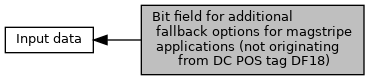

[Macros](#define-members)

for use in `fallbackMsrOptions` of <a href="group___a_d_k___t_r_x___e_x_e_c.md#ga58431469c9e1e41d6e419cbc246fd4bb">EMV_CT_SELECT_TYPE</a> [More\...](#details)

Collaboration diagram for Bit field for additional fallback options for magstripe applications (not originating from DC POS tag DF18):

|  |  |
|----|----|
| Macros |  |
| #define  | [FB_OPT_CASHBACK](#ga8b9bbf3db1ef94942cae97ff866b037b)   0x01 |
|   | fallback magstripe application supports payment with cash back [More\...](#ga8b9bbf3db1ef94942cae97ff866b037b)  |

## DetailedDescription {#detailed-description}

for use in `fallbackMsrOptions` of <a href="group___a_d_k___t_r_x___e_x_e_c.md#ga58431469c9e1e41d6e419cbc246fd4bb">EMV_CT_SELECT_TYPE</a>

## MacroDefinition Documentation {#macro-definition-documentation}

## FB_OPT_CASHBACK 

#define FB_OPT_CASHBACK   0x01

fallback magstripe application supports payment with cash back
