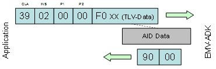
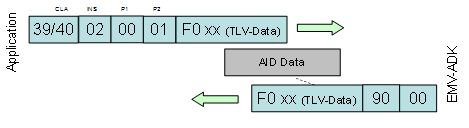
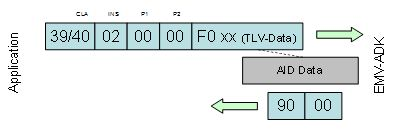
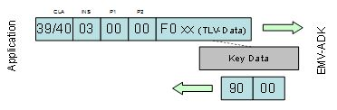

[Functions](#func-members)

Collaboration diagram for EMV ADK functions for configuration:

|  |  |
|----|----|
| Functions |  |
| <a href="_e_m_v___c_t_l_s___interface_8h.md#a0c075561565f443dd054da7871da8462">DLL_CLC</a> <a href="group___a_d_k___r_e_t___c_o_d_e.md#gaa5ed8ecc7a31f36a8927e6e258187810">EMV_ADK_INFO</a>  | [EMV_CTLS_MapVirtualTerminal](#ga6fbd51a31dd89f11d137adab3ed4d733) (<a href="group___v_i_r_t_u_a_l_t_e_r_m_m_a_p___m_o_d_e.md#ga8549dc337b3e6382af882edd8a4ef5dc">EMV_ADK_VIRTUALTERMMAP_TYPE</a> VirtualTermMapType, unsigned char \*TLVSwitchValue, unsigned int TLVBufLen, unsigned char VirtualTerminal) |
|   | Changes the Virtual Terminal Map. [More\...](#ga6fbd51a31dd89f11d137adab3ed4d733)  |
| <a href="_e_m_v___c_t_l_s___interface_8h.md#a0c075561565f443dd054da7871da8462">DLL_CLC</a> <a href="group___a_d_k___r_e_t___c_o_d_e.md#gaa5ed8ecc7a31f36a8927e6e258187810">EMV_ADK_INFO</a>  | [EMV_CTLS_StoreCAPKey](#ga3e03f6dd283e873cbcd6b8e4bb78f09a) (<a href="group___a_p_p_l_i___c_o_n_f___m_o_d_e.md#gadcf8867daf908d411db4651db09aaa54">EMV_ADK_HANDLE_RECORD_TYPE</a> eHandleCAPKeyType, const <a href="group___d_e_f___c_a_r_d___c_o_n_f.md#ga29fb30f218cea136b382fedf85650300">EMV_CTLS_CAPKEY_TYPE</a> \*pxKeyData) |
|   | Stores the specified CAP key. [More\...](#ga3e03f6dd283e873cbcd6b8e4bb78f09a)  |
| <a href="_e_m_v___c_t_l_s___interface_8h.md#a0c075561565f443dd054da7871da8462">DLL_CLC</a> <a href="group___a_d_k___r_e_t___c_o_d_e.md#gaa5ed8ecc7a31f36a8927e6e258187810">EMV_ADK_INFO</a>  | [EMV_CTLS_ReadCAPKeys](#gacaf6e34b74f3c446ca7f877223cf4724) (<a href="group___d_e_f___c_a_r_d___c_o_n_f.md#ga0bc19981bd2520ebd2fb7b58a70dde6b">EMV_CTLS_CAPREAD_TYPE</a> \*pxKeyData, unsigned char \*pucMaxnum) |
|   | Reads CAP keys. [More\...](#gacaf6e34b74f3c446ca7f877223cf4724)  |
| <a href="_e_m_v___c_t_l_s___interface_8h.md#a0c075561565f443dd054da7871da8462">DLL_CLC</a> <a href="group___a_d_k___r_e_t___c_o_d_e.md#gaa5ed8ecc7a31f36a8927e6e258187810">EMV_ADK_INFO</a>  | [EMV_CTLS_GetCAPKeyInfo](#gad761386cccb09d610cd9aad49e29a7d7) (<a href="group___d_e_f___c_a_r_d___c_o_n_f.md#ga0bc19981bd2520ebd2fb7b58a70dde6b">EMV_CTLS_CAPREAD_TYPE</a> \*pxKeyData, unsigned capacity, unsigned offset, unsigned \*numberRead, unsigned \*numberConfigured) |
|   | Reads CAP keys. [More\...](#gad761386cccb09d610cd9aad49e29a7d7)  |
| <a href="_e_m_v___c_t_l_s___interface_8h.md#a0c075561565f443dd054da7871da8462">DLL_CLC</a> <a href="group___a_d_k___r_e_t___c_o_d_e.md#gaa5ed8ecc7a31f36a8927e6e258187810">EMV_ADK_INFO</a>  | [EMV_CTLS_SetTermData](#gac5ce9781bba083028538f9e77c2d58f3) (<a href="group___d_e_f___c_o_n_f___t_e_r_m.md#gaf6a1624499c8eb3e1f914ba5cfc72b2e">EMV_CTLS_TERMDATA_TYPE</a> \*pxTermData) |
|   | set terminal specific data and perform verification and saving of data [More\...](#gac5ce9781bba083028538f9e77c2d58f3)  |
| <a href="_e_m_v___c_t_l_s___interface_8h.md#a0c075561565f443dd054da7871da8462">DLL_CLC</a> <a href="group___a_d_k___r_e_t___c_o_d_e.md#gaa5ed8ecc7a31f36a8927e6e258187810">EMV_ADK_INFO</a>  | [EMV_CTLS_GetTermData](#gad690d9dec1818d4ffc7db35c12c3b610) (<a href="group___d_e_f___c_o_n_f___t_e_r_m.md#gaf6a1624499c8eb3e1f914ba5cfc72b2e">EMV_CTLS_TERMDATA_TYPE</a> \*pxTermData) |
|   | get configured terminal data [More\...](#gad690d9dec1818d4ffc7db35c12c3b610)  |
| <a href="_e_m_v___c_t_l_s___interface_8h.md#a0c075561565f443dd054da7871da8462">DLL_CLC</a> <a href="group___a_d_k___r_e_t___c_o_d_e.md#gaa5ed8ecc7a31f36a8927e6e258187810">EMV_ADK_INFO</a>  | [EMV_CTLS_SetAppliDataSchemeSpecific](#gadc7f2eba5fd3e941d0ddb65a936a0776) (<a href="group___a_p_p_l_i___c_o_n_f___m_o_d_e.md#gadcf8867daf908d411db4651db09aaa54">EMV_ADK_HANDLE_RECORD_TYPE</a> eHandleAppliType, <a href="_e_m_v___c_t_l_s___interface_8h.md#a25ffa91f872706fea760a3c2e76464f8">EMV_CTLS_APPLI_KERNEL_TYPE</a> \*pxAID, <a href="group___d_e_f___c_o_n_f___a_p_p_l_i.md#ga6632685219259930248b2c7aa2186f66">EMV_CTLS_APPLIDATA_SCHEME_SPECIFIC_TYPE</a> \*pxAppliData) |
|   | Set application specific data and perform verification and saving of data. [More\...](#gadc7f2eba5fd3e941d0ddb65a936a0776)  |
| <a href="_e_m_v___c_t_l_s___interface_8h.md#a0c075561565f443dd054da7871da8462">DLL_CLC</a> <a href="group___a_d_k___r_e_t___c_o_d_e.md#gaa5ed8ecc7a31f36a8927e6e258187810">EMV_ADK_INFO</a>  | [EMV_CTLS_GetAppliDataSchemeSpecific](#gae76efd9464ef90029a0dddb8d845d4d8) (<a href="group___r_e_a_d___a_p_p_l_i___t_y_p_e.md#ga10b4ef6968ff77acaf7f70ff9d95ad03">EMV_ADK_READAPPLI_TYPE</a> eReadAppliType, <a href="_e_m_v___c_t_l_s___interface_8h.md#a25ffa91f872706fea760a3c2e76464f8">EMV_CTLS_APPLI_KERNEL_TYPE</a> \*pxAID, <a href="group___d_e_f___c_o_n_f___a_p_p_l_i.md#ga6632685219259930248b2c7aa2186f66">EMV_CTLS_APPLIDATA_SCHEME_SPECIFIC_TYPE</a> \*pxAppliData) |
|   | Get configured application data. [More\...](#gae76efd9464ef90029a0dddb8d845d4d8)  |
| <a href="_e_m_v___c_t_l_s___interface_8h.md#a0c075561565f443dd054da7871da8462">DLL_CLC</a> <a href="group___a_d_k___r_e_t___c_o_d_e.md#gaa5ed8ecc7a31f36a8927e6e258187810">EMV_ADK_INFO</a>  | [EMV_CTLS_ApplyConfiguration](#gaa5352e4331b8fd16eaa02b1bbb7027c2) (unsigned long options) |
|   | Transfer the stored configuration to reader. [More\...](#gaa5352e4331b8fd16eaa02b1bbb7027c2)  |
| <a href="_e_m_v___c_t___interface_8h.md#aba0ead6baeabe51c5f4fe870feb9ec16">DLL_CTC</a> <a href="group___a_d_k___r_e_t___c_o_d_e.md#gaa5ed8ecc7a31f36a8927e6e258187810">EMV_ADK_INFO</a>  | [EMV_CT_MapVirtualTerminal](#gab5d29810043af901c08736d4e9337353) (<a href="group___v_i_r_t_u_a_l_t_e_r_m_m_a_p___m_o_d_e.md#ga8549dc337b3e6382af882edd8a4ef5dc">EMV_ADK_VIRTUALTERMMAP_TYPE</a> VirtualTermMapType, unsigned char \*TLVSwitchValue, unsigned int TLVBufLen, unsigned char VirtualTerminal) |
|   | Changes the Virtual Terminal Map. [More\...](#gab5d29810043af901c08736d4e9337353)  |
| <a href="_e_m_v___c_t___interface_8h.md#aba0ead6baeabe51c5f4fe870feb9ec16">DLL_CTC</a> <a href="group___a_d_k___r_e_t___c_o_d_e.md#gaa5ed8ecc7a31f36a8927e6e258187810">EMV_ADK_INFO</a>  | [EMV_CT_StoreCAPKey](#gade5b2bbc6ab46c4b7d9efa991b696ad2) (<a href="group___a_p_p_l_i___c_o_n_f___m_o_d_e.md#gadcf8867daf908d411db4651db09aaa54">EMV_ADK_HANDLE_RECORD_TYPE</a> eHandleCAPKeyType, const <a href="group___d_e_f___c_a_r_d___c_o_n_f.md#gaec114225658dc96eade72d72c1a7ca58">EMV_CT_CAPKEY_TYPE</a> \*pxKeyData) |
|   | Stores the specified CAP key. [More\...](#gade5b2bbc6ab46c4b7d9efa991b696ad2)  |
| <a href="_e_m_v___c_t___interface_8h.md#aba0ead6baeabe51c5f4fe870feb9ec16">DLL_CTC</a> <a href="group___a_d_k___r_e_t___c_o_d_e.md#gaa5ed8ecc7a31f36a8927e6e258187810">EMV_ADK_INFO</a>  | [EMV_CT_ReadCAPKeys](#ga429a19bcd6b86ff1f165ff681ae6c79a) (<a href="group___d_e_f___c_a_r_d___c_o_n_f.md#ga1d17166f51e2bc35511368552eab687a">EMV_CT_CAPREAD_TYPE</a> \*pxKeyData, unsigned char \*pucMaxnum) |
|   | Reads CAP keys. [More\...](#ga429a19bcd6b86ff1f165ff681ae6c79a)  |
| <a href="_e_m_v___c_t___interface_8h.md#aba0ead6baeabe51c5f4fe870feb9ec16">DLL_CTC</a> <a href="group___a_d_k___r_e_t___c_o_d_e.md#gaa5ed8ecc7a31f36a8927e6e258187810">EMV_ADK_INFO</a>  | [EMV_CT_GetCAPKeyInfo](#ga597af0018e1df21cfbd7e52fd4756c9a) (<a href="group___d_e_f___c_a_r_d___c_o_n_f.md#ga1d17166f51e2bc35511368552eab687a">EMV_CT_CAPREAD_TYPE</a> \*pxKeyInfo, unsigned capacity, unsigned offset, unsigned \*received, unsigned \*configured) |
|   | Reads CAP key information. [More\...](#ga597af0018e1df21cfbd7e52fd4756c9a)  |
| <a href="_e_m_v___c_t___interface_8h.md#aba0ead6baeabe51c5f4fe870feb9ec16">DLL_CTC</a> <a href="group___a_d_k___r_e_t___c_o_d_e.md#gaa5ed8ecc7a31f36a8927e6e258187810">EMV_ADK_INFO</a>  | [EMV_CT_SetTermData](#ga351c2deba9865081c314d818463f20c9) (<a href="group___d_e_f___c_o_n_f___t_e_r_m.md#gafdbb8cf654b659b9830896a7f82e5e24">EMV_CT_TERMDATA_TYPE</a> \*pxTermData) |
|   | Set terminal specific data and perform verification and saving of data. [More\...](#ga351c2deba9865081c314d818463f20c9)  |
| <a href="_e_m_v___c_t___interface_8h.md#aba0ead6baeabe51c5f4fe870feb9ec16">DLL_CTC</a> <a href="group___a_d_k___r_e_t___c_o_d_e.md#gaa5ed8ecc7a31f36a8927e6e258187810">EMV_ADK_INFO</a>  | [EMV_CT_GetTermData](#ga954c82bc82203115b10fcab356df0079) (<a href="group___d_e_f___c_o_n_f___t_e_r_m.md#gafdbb8cf654b659b9830896a7f82e5e24">EMV_CT_TERMDATA_TYPE</a> \*pxTermData) |
|   | Get configured terminal data. [More\...](#ga954c82bc82203115b10fcab356df0079)  |
| <a href="_e_m_v___c_t___interface_8h.md#aba0ead6baeabe51c5f4fe870feb9ec16">DLL_CTC</a> <a href="group___a_d_k___r_e_t___c_o_d_e.md#gaa5ed8ecc7a31f36a8927e6e258187810">EMV_ADK_INFO</a>  | [EMV_CT_SetAppliData](#ga73ca1735defbb65a1aae2ead1de70233) (<a href="group___a_p_p_l_i___c_o_n_f___m_o_d_e.md#gadcf8867daf908d411db4651db09aaa54">EMV_ADK_HANDLE_RECORD_TYPE</a> eHandleAppliType, <a href="_e_m_v___c_t___interface_8h.md#ae836cd33e4343219ad6106a383afd876">EMV_CT_APPLI_TYPE</a> \*pxAID, <a href="group___d_e_f___c_o_n_f___a_p_p_l_i.md#gaa8587e7da8f3e6d6dc3c4b1e803ce1b3">EMV_CT_APPLIDATA_TYPE</a> \*pxAppliData) |
|   | Set application specific data and perform verification and saving of data. Has to be called once per application (Visa, MasterCard, \...). [More\...](#ga73ca1735defbb65a1aae2ead1de70233)  |
| <a href="_e_m_v___c_t___interface_8h.md#aba0ead6baeabe51c5f4fe870feb9ec16">DLL_CTC</a> <a href="group___a_d_k___r_e_t___c_o_d_e.md#gaa5ed8ecc7a31f36a8927e6e258187810">EMV_ADK_INFO</a>  | [EMV_CT_GetAppliData](#ga363163e375895b7d3ad03ace5df5d0d3) (<a href="group___r_e_a_d___a_p_p_l_i___t_y_p_e.md#ga10b4ef6968ff77acaf7f70ff9d95ad03">EMV_ADK_READAPPLI_TYPE</a> eReadAppliType, <a href="_e_m_v___c_t___interface_8h.md#ae836cd33e4343219ad6106a383afd876">EMV_CT_APPLI_TYPE</a> \*pxAID, <a href="group___d_e_f___c_o_n_f___a_p_p_l_i.md#gaa8587e7da8f3e6d6dc3c4b1e803ce1b3">EMV_CT_APPLIDATA_TYPE</a> \*pxAppliData) |
|   | Get configured application data Has to be called once per application (Visa, MasterCard, \...). [More\...](#ga363163e375895b7d3ad03ace5df5d0d3)  |
| <a href="_e_m_v___c_t___interface_8h.md#aba0ead6baeabe51c5f4fe870feb9ec16">DLL_CTC</a> <a href="group___a_d_k___r_e_t___c_o_d_e.md#gaa5ed8ecc7a31f36a8927e6e258187810">EMV_ADK_INFO</a>  | [EMV_CT_ApplyConfiguration](#ga3170974cb7a73a9dec8f881295cc1cac) (unsigned long options) |
|   | Write configuration to files. [More\...](#ga3170974cb7a73a9dec8f881295cc1cac)  |
| <a href="_e_m_v___c_t___interface_8h.md#aba0ead6baeabe51c5f4fe870feb9ec16">DLL_CTC</a> unsigned char  | [EMV_CT_LED](#gaa7a875eed1a49cff8fdf70c81100be2f) (unsigned char ucLedId, unsigned char ucLedState, unsigned char ucLedColor, unsigned long ulTimeoutMs) |
|   | Control the Smart Card Reader LEDs. [More\...](#gaa7a875eed1a49cff8fdf70c81100be2f)  |

## DetailedDescription {#detailed-description}

## FunctionDocumentation {#function-documentation}

## EMV_CT_ApplyConfiguration() 

<a href="_e_m_v___c_t___interface_8h.md#aba0ead6baeabe51c5f4fe870feb9ec16">DLL_CTC</a> <a href="group___a_d_k___r_e_t___c_o_d_e.md#gaa5ed8ecc7a31f36a8927e6e258187810">EMV_ADK_INFO</a> EMV_CT_ApplyConfiguration

Write configuration to files.

This function writes the configuration to file system if <a href="group___c_t_i_n_i_t___o_p_t_i_o_n_s.md#gab256e2810f51ed6cc87ea9d5536b7e1e">EMV_CT_INIT_OPT_CONFIG_MODE</a> was set. If <a href="group___c_t_i_n_i_t___o_p_t_i_o_n_s.md#gab256e2810f51ed6cc87ea9d5536b7e1e">EMV_CT_INIT_OPT_CONFIG_MODE</a> was not set, this function returns EMV_ADK_NO_EXEC and does nothing.

Explanation in programmers guide: <a href="pg_emv_contact_users_guide.md#subsec_emv_ct_virt_term_map">Virtual terminal mapping table</a>

### Author

GSS R&D Germany

**Parameters**

\[in\] **options** RFUTLV tag TAG_DF8F0F_APPLYCONFIG_OPTIONS

### Returns

<a href="group___a_d_k___r_e_t___c_o_d_e.md#ga1456bb13b42906927f8a8942169b62e7">EMV_ADK_OK</a>: success
<a href="group___a_d_k___r_e_t___c_o_d_e.md#gab0e8158b5e7019f0da44c5cbc37bae3d">EMV_ADK_INTERNAL</a>: internal communication problem, illegal file content, memory allocation
<a href="group___a_d_k___r_e_t___c_o_d_e.md#ga4837e54c589150debdef49afb8f9b5db">EMV_ADK_TLV_BUILD_ERR</a>: TLV processing problem
<a href="group___a_d_k___r_e_t___c_o_d_e.md#ga3a1d800696b9d7a86c0e39068d3fde57">EMV_ADK_NOT_ALLOWED</a>: concurrent call or not allowed within callback
<a href="group___a_d_k___r_e_t___c_o_d_e.md#ga19d5dde29e85ada4f706ca65644df705">EMV_ADK_SAVE_ERROR</a>: TermData/AppliData/CapKeys/Hotlist/VirtTermMap file persistence problem
<a href="group___a_d_k___r_e_t___c_o_d_e.md#ga7ffea44a30b0451d393487eae4035b4e">EMV_ADK_NO_EXEC</a>: maximum number of configurable AIDs exceeded
**Serialization:**

\[unsupported block\] Class: <a href="group___a_d_k___t_r_a_n_s_p_o_r_t___t_a_g_s.md#ga7ca54f43b657f0cc8b1ad98ecf60491f">CLA_EMV</a>, Instruction: <a href="group___a_d_k___t_r_a_n_s_p_o_r_t___t_a_g_s.md#ga523b4877cb4ce370ff00f343a16cc021">INS_APPLY_CFG</a>

## EMV_CT_GetAppliData() 

<a href="_e_m_v___c_t___interface_8h.md#aba0ead6baeabe51c5f4fe870feb9ec16">DLL_CTC</a> <a href="group___a_d_k___r_e_t___c_o_d_e.md#gaa5ed8ecc7a31f36a8927e6e258187810">EMV_ADK_INFO</a> EMV_CT_GetAppliData

Get configured application data
Has to be called once per application (Visa, MasterCard, \...).

Explanation in programmers guide: <a href="pg_emv_contact_users_guide.md#anchor_emv_ct_configure_application_data">Configure Application Data</a>

### Author

GSS R&D Germany

**Parameters**

\[in\] **eReadAppliType** See Defines for type of read application data modeTLV tag TAG_HANDLE_APPLI_TYPE \[in,out\] **pxAID** AID, see EMV_CT_APPLI_STRUCTTLV tag TAG_4F_APP_ID \[out\] **pxAppliData** Application data, see EMV_CT_APPLIDATA_STRUCT

### Returns

<a href="group___a_d_k___r_e_t___c_o_d_e.md#ga1456bb13b42906927f8a8942169b62e7">EMV_ADK_OK</a>: success
<a href="group___a_d_k___r_e_t___c_o_d_e.md#gab0e8158b5e7019f0da44c5cbc37bae3d">EMV_ADK_INTERNAL</a>: internal communication problem, illegal file content, memory allocation
<a href="group___a_d_k___r_e_t___c_o_d_e.md#ga4837e54c589150debdef49afb8f9b5db">EMV_ADK_TLV_BUILD_ERR</a>: TLV processing problem
<a href="group___a_d_k___r_e_t___c_o_d_e.md#ga89c11346e5e636e7c9d42c6a772674bf">EMV_ADK_PARAM</a>: bad pxTermData input param
<a href="group___a_d_k___r_e_t___c_o_d_e.md#ga3a1d800696b9d7a86c0e39068d3fde57">EMV_ADK_NOT_ALLOWED</a>: concurrent call or not allowed within callback
<a href="group___a_d_k___r_e_t___c_o_d_e.md#gaa385b17c04a9c6bbc0093a7ccfc3b11a">EMV_ADK_READ_ERROR</a>: AppliData file corruption
**Serialization:**

\[unsupported block\] Class: <a href="group___a_d_k___t_r_a_n_s_p_o_r_t___t_a_g_s.md#ga7ca54f43b657f0cc8b1ad98ecf60491f">CLA_EMV</a>, Instruction: <a href="group___a_d_k___t_r_a_n_s_p_o_r_t___t_a_g_s.md#ga6795399515af157c4fb02c2141290935">INS_APPLI_CFG</a>, P2: <a href="group___a_d_k___t_r_a_n_s_p_o_r_t___t_a_g_s.md#ga2a2911f7e67d626c4c5f4ec1bd69dff6">P2_GET</a>

## EMV_CT_GetCAPKeyInfo() 

<a href="_e_m_v___c_t___interface_8h.md#aba0ead6baeabe51c5f4fe870feb9ec16">DLL_CTC</a> <a href="group___a_d_k___r_e_t___c_o_d_e.md#gaa5ed8ecc7a31f36a8927e6e258187810">EMV_ADK_INFO</a> EMV_CT_GetCAPKeyInfo

Reads CAP key information.

### Author

GSS R&D Germany

Explanation in programmers guide: <a href="pg_emv_contact_users_guide.md#anchor_emv_ct_configure_cap_keys">Configure CAP Keys</a>

**Parameters**

\[out\] **pxKeyInfo** CAP key info data (buffer length at least 7 times capacity)see EMV_CT_CAPREAD_STRUCTTLV tag TAG_ISO_DATA \[in\] **capacity** number of keys that can be stored in pxKeyInfoTLV tag TAG_KEY_NUMBER \[in\] **offset** for reading the key list in several chunksTLV tag TAG_DF3B_PARAMETER_1 \[out\] **received** number of data sets stored to pxKeyInfo \[out\] **configured** number of configured keysTLV tag TAG_KEY_NUMBER

### Returns

<a href="group___a_d_k___r_e_t___c_o_d_e.md#ga1456bb13b42906927f8a8942169b62e7">EMV_ADK_OK</a>: success
<a href="group___a_d_k___r_e_t___c_o_d_e.md#ga89c11346e5e636e7c9d42c6a772674bf">EMV_ADK_PARAM</a>: bad pxKeyData or pucMaxnum input params
<a href="group___a_d_k___r_e_t___c_o_d_e.md#gab0e8158b5e7019f0da44c5cbc37bae3d">EMV_ADK_INTERNAL</a>: internal communication problem, illegal file content, memory allocation
<a href="group___a_d_k___r_e_t___c_o_d_e.md#ga4837e54c589150debdef49afb8f9b5db">EMV_ADK_TLV_BUILD_ERR</a>: TLV processing problem
<a href="group___a_d_k___r_e_t___c_o_d_e.md#ga3a1d800696b9d7a86c0e39068d3fde57">EMV_ADK_NOT_ALLOWED</a>: concurrent call or not allowed within callback
<a href="group___a_d_k___r_e_t___c_o_d_e.md#gaa385b17c04a9c6bbc0093a7ccfc3b11a">EMV_ADK_READ_ERROR</a>: CapKeys file corruption


Currently maximum number of CAP keys to be stored is 512.


**Serialization:** As this command uses the same class and instruction as [EMV_CT_ReadCAPKeys()](#ga429a19bcd6b86ff1f165ff681ae6c79a "Reads CAP keys.") the presence of parameter offset marks the support of compressed response format. Legacy frameworks will ignore this parameter and return key info in TLV format.
**Request**
Class: <a href="group___a_d_k___t_r_a_n_s_p_o_r_t___t_a_g_s.md#ga7ca54f43b657f0cc8b1ad98ecf60491f">CLA_EMV</a>, Instruction: <a href="group___a_d_k___t_r_a_n_s_p_o_r_t___t_a_g_s.md#ga6f9fe9144b546c050a5cfdd516c26b01">INS_CAPKEY_CFG</a>, P2: <a href="group___a_d_k___t_r_a_n_s_p_o_r_t___t_a_g_s.md#ga2a2911f7e67d626c4c5f4ec1bd69dff6">P2_GET</a>
capacity <a href="group___v_e_r_i___p_r_i_m___t_a_g_s.md#ga59feef5f17f1c83a7a519e4d5857319d">TAG_KEY_NUMBER</a>, up to 255, for more a loop is required
offset <a href="group___v_e_r_i___p_r_i_m___t_a_g_s.md#gaeaaf508a20730c94b9be9320a9bdb17a">TAG_DF3B_PARAMETER_1</a>, length 2
**Response**
configured <a href="group___v_e_r_i___p_r_i_m___t_a_g_s.md#ga59feef5f17f1c83a7a519e4d5857319d">TAG_KEY_NUMBER</a>, length 2 indicates compressed format, legacy framework will send length 1
key info <a href="group___v_e_r_i___p_r_i_m___t_a_g_s.md#ga1b30281b8c35ec19eff77088f39e3cc4">TAG_ISO_DATA</a> sequence of RID, index and key length up to given capacity, data length is 7 times number of keys info blocks while the number of blocks is min(capacity, number of stored keys - offset)

## EMV_CT_GetTermData() 

<a href="_e_m_v___c_t___interface_8h.md#aba0ead6baeabe51c5f4fe870feb9ec16">DLL_CTC</a> <a href="group___a_d_k___r_e_t___c_o_d_e.md#gaa5ed8ecc7a31f36a8927e6e258187810">EMV_ADK_INFO</a> EMV_CT_GetTermData

Get configured terminal data.

Explanation in programmers guide: <a href="pg_emv_contact_users_guide.md#anchor_emv_ct_configure_terminal_data">Configure Terminal Data</a>

### Author

GSS R&D Germany

**Parameters**

\[out\] **pxTermData** Terminal data (EMV_CT_TERMDATA_STRUCT)

### Returns

<a href="group___a_d_k___r_e_t___c_o_d_e.md#ga1456bb13b42906927f8a8942169b62e7">EMV_ADK_OK</a>: success
<a href="group___a_d_k___r_e_t___c_o_d_e.md#gab0e8158b5e7019f0da44c5cbc37bae3d">EMV_ADK_INTERNAL</a>: internal communication problem, illegal file content, memory allocation
<a href="group___a_d_k___r_e_t___c_o_d_e.md#ga4837e54c589150debdef49afb8f9b5db">EMV_ADK_TLV_BUILD_ERR</a>: TLV processing problem
<a href="group___a_d_k___r_e_t___c_o_d_e.md#ga89c11346e5e636e7c9d42c6a772674bf">EMV_ADK_PARAM</a>: bad pxTermData input param
<a href="group___a_d_k___r_e_t___c_o_d_e.md#ga3a1d800696b9d7a86c0e39068d3fde57">EMV_ADK_NOT_ALLOWED</a>: concurrent call or not allowed within callback
<a href="group___a_d_k___r_e_t___c_o_d_e.md#gaa385b17c04a9c6bbc0093a7ccfc3b11a">EMV_ADK_READ_ERROR</a>: TermData file corruption
**Serialization:**

\[unsupported block\] Class: <a href="group___a_d_k___t_r_a_n_s_p_o_r_t___t_a_g_s.md#ga7ca54f43b657f0cc8b1ad98ecf60491f">CLA_EMV</a>, Instruction: <a href="group___a_d_k___t_r_a_n_s_p_o_r_t___t_a_g_s.md#gaf2a42e0a1c524294cde7ae3ed4c9c45f">INS_TERM_CFG</a>, P2: <a href="group___a_d_k___t_r_a_n_s_p_o_r_t___t_a_g_s.md#ga2a2911f7e67d626c4c5f4ec1bd69dff6">P2_GET</a>

## EMV_CT_LED() 

<a href="_e_m_v___c_t___interface_8h.md#aba0ead6baeabe51c5f4fe870feb9ec16">DLL_CTC</a> unsigned char EMV_CT_LED

Control the Smart Card Reader LEDs.

### Author

GSS R&D Germany

**Parameters**

\[in\] **ucLedId** Id of the LEDTLV tag TAG_DF3B_PARAMETER_1 \[in\] **ucLedState** State of the LED (e.g. CONTACT_LED_ON)TLV tag TAG_DF3C_PARAMETER_2 \[in\] **ucLedColor** Color (e.g. CONTACT_LED_COLOR_RED)TLV tag TAG_DF3D_PARAMETER_3 \[in\] **ulTimeoutMs** Timeout in millisecondsTLV tag TAG_DF19_PARAMETER_4

### Returns

`0` \... okay
`!=0` \... error

## EMV_CT_MapVirtualTerminal() 

<a href="_e_m_v___c_t___interface_8h.md#aba0ead6baeabe51c5f4fe870feb9ec16">DLL_CTC</a> <a href="group___a_d_k___r_e_t___c_o_d_e.md#gaa5ed8ecc7a31f36a8927e6e258187810">EMV_ADK_INFO</a> EMV_CT_MapVirtualTerminal

Changes the Virtual Terminal Map.

Explanation in programmers guide: <a href="pg_emv_contact_users_guide.md#subsec_emv_ct_virt_term_map">Virtual terminal mapping table</a>

### Author

GSS R&D Germany

**Parameters**

\[in\] **VirtualTermMapType** Mode, see Defines for type of virtual terminal mapTLV tag: TAG_DF3B_PARAMETER_1 \[in\] **TLVSwitchValue** TLV buffer containing switch criteria. Must contain tag TAG_9C_TRANS_TYPE and/or tag TAG_5F2A_TRANS_CURRENCY, all other tags are currently ignored.TLV tag TAG_DF3C_PARAMETER_2 \[in\] **TLVBufLen** Length of TLV bufferTLV tag TAG_DF3C_PARAMETER_2 \[in\] **VirtualTerminal** Virtual Terminal (non-zero) that is selected if switch criteria match.TLV tag TAG_DF3D_PARAMETER_3

### Returns

<a href="group___a_d_k___r_e_t___c_o_d_e.md#ga1456bb13b42906927f8a8942169b62e7">EMV_ADK_OK</a>: success
<a href="group___a_d_k___r_e_t___c_o_d_e.md#gab0e8158b5e7019f0da44c5cbc37bae3d">EMV_ADK_INTERNAL</a>: internal communication problem, illegal file content, memory allocation
<a href="group___a_d_k___r_e_t___c_o_d_e.md#ga4837e54c589150debdef49afb8f9b5db">EMV_ADK_TLV_BUILD_ERR</a>: TLV processing problem
<a href="group___a_d_k___r_e_t___c_o_d_e.md#ga3a1d800696b9d7a86c0e39068d3fde57">EMV_ADK_NOT_ALLOWED</a>: concurrent call or not allowed within callback
**Serialization:** Class: <a href="group___a_d_k___t_r_a_n_s_p_o_r_t___t_a_g_s.md#ga7ca54f43b657f0cc8b1ad98ecf60491f">CLA_EMV</a>, Instruction: <a href="group___a_d_k___t_r_a_n_s_p_o_r_t___t_a_g_s.md#ga12fb1f55ae937a04c8385a5c6974ac1b">INS_VIRT_CFG</a>

## EMV_CT_ReadCAPKeys() 

<a href="_e_m_v___c_t___interface_8h.md#aba0ead6baeabe51c5f4fe870feb9ec16">DLL_CTC</a> <a href="group___a_d_k___r_e_t___c_o_d_e.md#gaa5ed8ecc7a31f36a8927e6e258187810">EMV_ADK_INFO</a> EMV_CT_ReadCAPKeys

Reads CAP keys.

### Author

GSS R&D Germany

Explanation in programmers guide: <a href="pg_emv_contact_users_guide.md#anchor_emv_ct_configure_cap_keys">Configure CAP Keys</a> Due to serialisation buffer limitation the maximum number of read keys is 100, [EMV_CT_GetCAPKeyInfo()](#ga597af0018e1df21cfbd7e52fd4756c9a "Reads CAP key information.") is without this restriction.

**Parameters**

\[out\] **pxKeyData** CAP key data, min(\*pucMaxnum, number of stored CAP keys, 100) are written to output buffersee EMV_CT_CAPREAD_STRUCT \[in,out\] **pucMaxnum** Input: maximum number of CAP keys to write to pxKeyData; output: number of CAP keys stored in fileTLV tag TAG_KEY_NUMBER

### Returns

<a href="group___a_d_k___r_e_t___c_o_d_e.md#ga1456bb13b42906927f8a8942169b62e7">EMV_ADK_OK</a>: success
<a href="group___a_d_k___r_e_t___c_o_d_e.md#ga89c11346e5e636e7c9d42c6a772674bf">EMV_ADK_PARAM</a>: bad pxKeyData or pucMaxnum input params
<a href="group___a_d_k___r_e_t___c_o_d_e.md#gab0e8158b5e7019f0da44c5cbc37bae3d">EMV_ADK_INTERNAL</a>: internal communication problem, illegal file content, memory allocation
<a href="group___a_d_k___r_e_t___c_o_d_e.md#ga4837e54c589150debdef49afb8f9b5db">EMV_ADK_TLV_BUILD_ERR</a>: TLV processing problem
<a href="group___a_d_k___r_e_t___c_o_d_e.md#ga3a1d800696b9d7a86c0e39068d3fde57">EMV_ADK_NOT_ALLOWED</a>: concurrent call or not allowed within callback
<a href="group___a_d_k___r_e_t___c_o_d_e.md#gaa385b17c04a9c6bbc0093a7ccfc3b11a">EMV_ADK_READ_ERROR</a>: CapKeys file corruption


Currently maximum number of CAP keys to be stored is 512.
**Serialization:** \[unsupported block\] Class: <a href="group___a_d_k___t_r_a_n_s_p_o_r_t___t_a_g_s.md#ga7ca54f43b657f0cc8b1ad98ecf60491f">CLA_EMV</a>, Instruction: <a href="group___a_d_k___t_r_a_n_s_p_o_r_t___t_a_g_s.md#ga6f9fe9144b546c050a5cfdd516c26b01">INS_CAPKEY_CFG</a>, P2: <a href="group___a_d_k___t_r_a_n_s_p_o_r_t___t_a_g_s.md#ga2a2911f7e67d626c4c5f4ec1bd69dff6">P2_GET</a>


## EMV_CT_SetAppliData() 

<a href="_e_m_v___c_t___interface_8h.md#aba0ead6baeabe51c5f4fe870feb9ec16">DLL_CTC</a> <a href="group___a_d_k___r_e_t___c_o_d_e.md#gaa5ed8ecc7a31f36a8927e6e258187810">EMV_ADK_INFO</a> EMV_CT_SetAppliData

Set application specific data and perform verification and saving of data.
Has to be called once per application (Visa, MasterCard, \...).

Explanation in programmers guide: <a href="pg_emv_contact_users_guide.md#anchor_emv_ct_configure_application_data">Configure Application Data</a>

### Author

GSS R&D Germany

**Parameters**

\[in\] **eHandleAppliType** See Modes of application data and CAP key settingTLV tag TAG_HANDLE_APPLI_TYPE \[in\] **pxAID** AID (up to n-times for AIDs with same configuration), see EMV_CT_APPLI_STRUCTTLV tag TAG_4F_APP_ID \[in\] **pxAppliData** Application data, see EMV_CT_APPLIDATA_STRUCT

### Returns

<a href="group___a_d_k___r_e_t___c_o_d_e.md#ga1456bb13b42906927f8a8942169b62e7">EMV_ADK_OK</a>: success
<a href="group___a_d_k___r_e_t___c_o_d_e.md#ga89c11346e5e636e7c9d42c6a772674bf">EMV_ADK_PARAM</a>: illegal handle type or pointer
<a href="group___a_d_k___r_e_t___c_o_d_e.md#ga4837e54c589150debdef49afb8f9b5db">EMV_ADK_TLV_BUILD_ERR</a>: TLV processing problem
<a href="group___a_d_k___r_e_t___c_o_d_e.md#gab0e8158b5e7019f0da44c5cbc37bae3d">EMV_ADK_INTERNAL</a>: internal communication problem, illegal file content, memory allocation
<a href="group___a_d_k___r_e_t___c_o_d_e.md#ga3a1d800696b9d7a86c0e39068d3fde57">EMV_ADK_NOT_ALLOWED</a>: concurrent call or not allowed within callback
<a href="group___a_d_k___r_e_t___c_o_d_e.md#gaa385b17c04a9c6bbc0093a7ccfc3b11a">EMV_ADK_READ_ERROR</a>: file corruption
<a href="group___a_d_k___r_e_t___c_o_d_e.md#ga19d5dde29e85ada4f706ca65644df705">EMV_ADK_SAVE_ERROR</a>: persistence problem
<a href="group___a_d_k___r_e_t___c_o_d_e.md#ga7ffea44a30b0451d393487eae4035b4e">EMV_ADK_NO_EXEC</a>: if number of configurable AIDs is a limit

**Serialization:**

Class: <a href="group___a_d_k___t_r_a_n_s_p_o_r_t___t_a_g_s.md#ga7ca54f43b657f0cc8b1ad98ecf60491f">CLA_EMV</a>, Instruction: <a href="group___a_d_k___t_r_a_n_s_p_o_r_t___t_a_g_s.md#ga6795399515af157c4fb02c2141290935">INS_APPLI_CFG</a>, P2: <a href="group___a_d_k___t_r_a_n_s_p_o_r_t___t_a_g_s.md#gaf0ba91f2a3df6af70463601679417fd4">P2_SET</a>

## EMV_CT_SetTermData() 

<a href="_e_m_v___c_t___interface_8h.md#aba0ead6baeabe51c5f4fe870feb9ec16">DLL_CTC</a> <a href="group___a_d_k___r_e_t___c_o_d_e.md#gaa5ed8ecc7a31f36a8927e6e258187810">EMV_ADK_INFO</a> EMV_CT_SetTermData

Set terminal specific data and perform verification and saving of data.

Explanation in programmers guide: <a href="pg_emv_contact_users_guide.md#anchor_emv_ct_configure_terminal_data">Configure Terminal Data</a>

### Author

GSS R&D Germany

**Parameters**

\[in\] **pxTermData** Terminal data (EMV_CT_TERMDATA_STRUCT)

### Returns

<a href="group___a_d_k___r_e_t___c_o_d_e.md#ga1456bb13b42906927f8a8942169b62e7">EMV_ADK_OK</a>: success
<a href="group___a_d_k___r_e_t___c_o_d_e.md#gab0e8158b5e7019f0da44c5cbc37bae3d">EMV_ADK_INTERNAL</a>: internal communication problem, illegal file content, memory allocation
<a href="group___a_d_k___r_e_t___c_o_d_e.md#ga4837e54c589150debdef49afb8f9b5db">EMV_ADK_TLV_BUILD_ERR</a>: TLV processing problem
<a href="group___a_d_k___r_e_t___c_o_d_e.md#ga89c11346e5e636e7c9d42c6a772674bf">EMV_ADK_PARAM</a>: bad pxTermData input param
<a href="group___a_d_k___r_e_t___c_o_d_e.md#ga3a1d800696b9d7a86c0e39068d3fde57">EMV_ADK_NOT_ALLOWED</a>: concurrent call or not allowed within callback
<a href="group___a_d_k___r_e_t___c_o_d_e.md#ga19d5dde29e85ada4f706ca65644df705">EMV_ADK_SAVE_ERROR</a>: TermData file persistence problem
**Serialization:**

\[unsupported block\] Class: <a href="group___a_d_k___t_r_a_n_s_p_o_r_t___t_a_g_s.md#ga7ca54f43b657f0cc8b1ad98ecf60491f">CLA_EMV</a>, Instruction: <a href="group___a_d_k___t_r_a_n_s_p_o_r_t___t_a_g_s.md#gaf2a42e0a1c524294cde7ae3ed4c9c45f">INS_TERM_CFG</a>, P2: <a href="group___a_d_k___t_r_a_n_s_p_o_r_t___t_a_g_s.md#gaf0ba91f2a3df6af70463601679417fd4">P2_SET</a>

## EMV_CT_StoreCAPKey() 

<a href="_e_m_v___c_t___interface_8h.md#aba0ead6baeabe51c5f4fe870feb9ec16">DLL_CTC</a> <a href="group___a_d_k___r_e_t___c_o_d_e.md#gaa5ed8ecc7a31f36a8927e6e258187810">EMV_ADK_INFO</a> EMV_CT_StoreCAPKey

Stores the specified CAP key.

Explanation in programmers guide: <a href="pg_emv_contact_users_guide.md#anchor_emv_ct_configure_cap_keys">Configure CAP Keys</a>

### Author

GSS R&D Germany

**Parameters**

\[in\] **eHandleCAPKeyType** Mode of CAP key setting, see Modes of application data and CAP key setting (Note: Multiple records are not supported)TLV tag TAG_HANDLE_APPLI_TYPE \[in\] **pxKeyData** All the data of the key that needs storing, see EMV_CT_CAPKEY_STRUCT

### Returns

<a href="group___a_d_k___r_e_t___c_o_d_e.md#ga1456bb13b42906927f8a8942169b62e7">EMV_ADK_OK</a>: success
<a href="group___a_d_k___r_e_t___c_o_d_e.md#ga89c11346e5e636e7c9d42c6a772674bf">EMV_ADK_PARAM</a>: invalid input param pxKeyData
<a href="group___a_d_k___r_e_t___c_o_d_e.md#gab0e8158b5e7019f0da44c5cbc37bae3d">EMV_ADK_INTERNAL</a>: internal communication problem, illegal file content, memory allocation
<a href="group___a_d_k___r_e_t___c_o_d_e.md#ga4837e54c589150debdef49afb8f9b5db">EMV_ADK_TLV_BUILD_ERR</a>: TLV processing problem
<a href="group___a_d_k___r_e_t___c_o_d_e.md#ga3a1d800696b9d7a86c0e39068d3fde57">EMV_ADK_NOT_ALLOWED</a>: concurrent call or not allowed within callback
<a href="group___a_d_k___r_e_t___c_o_d_e.md#ga19d5dde29e85ada4f706ca65644df705">EMV_ADK_SAVE_ERROR</a>: CapKeys file persistence problem
**Serialization:**

\[unsupported block\] Class: <a href="group___a_d_k___t_r_a_n_s_p_o_r_t___t_a_g_s.md#ga7ca54f43b657f0cc8b1ad98ecf60491f">CLA_EMV</a>, Instruction: <a href="group___a_d_k___t_r_a_n_s_p_o_r_t___t_a_g_s.md#ga6f9fe9144b546c050a5cfdd516c26b01">INS_CAPKEY_CFG</a>, P2: <a href="group___a_d_k___t_r_a_n_s_p_o_r_t___t_a_g_s.md#gaf0ba91f2a3df6af70463601679417fd4">P2_SET</a>

## EMV_CTLS_ApplyConfiguration() 

<a href="_e_m_v___c_t_l_s___interface_8h.md#a0c075561565f443dd054da7871da8462">DLL_CLC</a> <a href="group___a_d_k___r_e_t___c_o_d_e.md#gaa5ed8ecc7a31f36a8927e6e258187810">EMV_ADK_INFO</a> EMV_CTLS_ApplyConfiguration

Transfer the stored configuration to reader.

Only functional in context of VFI reader.
On velocity solution this function writes the configuration to file system if <a href="group___c_l_i_n_i_t___o_p_t_i_o_n_s.md#ga1c8e49286494443e871880f3c168dd13">EMV_CTLS_INIT_OPT_CONFIG_MODE</a> was set.

Explanation in programmers guide: <a href="pg_emv_contactless_users_guide.md#anchor_emv_ctls_configure_ctls_application_data">Configure CTLS Application data</a>

### Author

GSS R&D Germany

**Parameters**

\[in\] **options** Configuration options, see Options how to apply configuration (VFI reader only)TLV tag TAG_DF8F0F_APPLYCONFIG_OPTIONS

### Returns

<a href="group___a_d_k___r_e_t___c_o_d_e.md#ga1456bb13b42906927f8a8942169b62e7">EMV_ADK_OK</a>: success
<a href="group___a_d_k___r_e_t___c_o_d_e.md#gab0e8158b5e7019f0da44c5cbc37bae3d">EMV_ADK_INTERNAL</a>: internal communication problem, illegal file content, memory allocation
<a href="group___a_d_k___r_e_t___c_o_d_e.md#gaa385b17c04a9c6bbc0093a7ccfc3b11a">EMV_ADK_READ_ERROR</a>: TermData/AppliData/CapKeys/Hotlist/VirtTermMap file corruption@ <a href="group___a_d_k___r_e_t___c_o_d_e.md#ga19d5dde29e85ada4f706ca65644df705">EMV_ADK_SAVE_ERROR</a>: TermData/AppliData/CapKeys/Hotlist/VirtTermMap file persistence problem
<a href="group___a_d_k___r_e_t___c_o_d_e.md#ga7c824fdc6135c521a5d9bfc1a2a71c85">EMV_ADK_VIRTTERMMAP_WRONG_INIT</a>: virtual terminal map init has failed
<a href="group___a_d_k___r_e_t___c_o_d_e.md#ga4837e54c589150debdef49afb8f9b5db">EMV_ADK_TLV_BUILD_ERR</a>: TLV processing problem
<a href="group___a_d_k___r_e_t___c_o_d_e.md#ga3a1d800696b9d7a86c0e39068d3fde57">EMV_ADK_NOT_ALLOWED</a>: concurrent call or not allowed within callback
**Serialization:**

\[unsupported block\] Class: <a href="group___a_d_k___t_r_a_n_s_p_o_r_t___t_a_g_s.md#ga7ca54f43b657f0cc8b1ad98ecf60491f">CLA_EMV</a> or <a href="group___a_d_k___t_r_a_n_s_p_o_r_t___t_a_g_s.md#ga43723b2d17804e3934b43e370aa96e31">CLA_EMV_ALT</a>, Instruction: <a href="group___a_d_k___t_r_a_n_s_p_o_r_t___t_a_g_s.md#ga523b4877cb4ce370ff00f343a16cc021">INS_APPLY_CFG</a>

## EMV_CTLS_GetAppliDataSchemeSpecific() 

<a href="_e_m_v___c_t_l_s___interface_8h.md#a0c075561565f443dd054da7871da8462">DLL_CLC</a> <a href="group___a_d_k___r_e_t___c_o_d_e.md#gaa5ed8ecc7a31f36a8927e6e258187810">EMV_ADK_INFO</a> EMV_CTLS_GetAppliDataSchemeSpecific

Get configured application data.

This function can only be used if init option <a href="group___c_l_i_n_i_t___o_p_t_i_o_n_s.md#ga6e8e1a00ac01882fa8cc29b74a1d3ac4">EMV_CTLS_INIT_OPT_NEW_CFG_INTF</a> was set.

### Warning

struct members of type <a href="_e_m_v___c_t_l_s___interface_8h.md#a72d9f02bd046a1c2bf3590be2bca6a26">EMV_CTLS_DATA_TYPE</a> are allocated within libEMV_CTLS_Client. The next call to this function as well as a call to Exit Framework will invalidate the data pointers of the first result. For the same reason, this function is not thread-safe

Transport tags used in serialization: <a href="group___a_d_k___t_r_a_n_s_p_o_r_t___t_a_g_s.md#ga7ca54f43b657f0cc8b1ad98ecf60491f">CLA_EMV</a> <a href="group___a_d_k___t_r_a_n_s_p_o_r_t___t_a_g_s.md#ga6795399515af157c4fb02c2141290935">INS_APPLI_CFG</a> <a href="group___a_d_k___t_r_a_n_s_p_o_r_t___t_a_g_s.md#ga2a2911f7e67d626c4c5f4ec1bd69dff6">P2_GET</a>

### Author

GSS R&D Germany

**Parameters**

\[in\] **eReadAppliType** \... see Defines for type of read application data mode \[in,out\] **pxAID** \... AID, see EMV_CTLS_APPLI_STRUCT \[out\] **pxAppliData** \... application data, see EMV_CTLS_APPLIDATA_SCHEME_SPECIFIC_STRUCT

### Returns

<a href="group___a_d_k___r_e_t___c_o_d_e.md#ga1456bb13b42906927f8a8942169b62e7">EMV_ADK_OK</a>: success
<a href="group___a_d_k___r_e_t___c_o_d_e.md#ga89c11346e5e636e7c9d42c6a772674bf">EMV_ADK_PARAM</a>: bad eReadAppliType input param
<a href="group___a_d_k___r_e_t___c_o_d_e.md#ga4837e54c589150debdef49afb8f9b5db">EMV_ADK_TLV_BUILD_ERR</a>: TLV processing problem
<a href="group___a_d_k___r_e_t___c_o_d_e.md#gab0e8158b5e7019f0da44c5cbc37bae3d">EMV_ADK_INTERNAL</a>: internal communication problem, illegal file content, memory allocation
<a href="group___a_d_k___r_e_t___c_o_d_e.md#ga3a1d800696b9d7a86c0e39068d3fde57">EMV_ADK_NOT_ALLOWED</a>: concurrent call or not allowed within callback
<a href="group___a_d_k___r_e_t___c_o_d_e.md#gaa385b17c04a9c6bbc0093a7ccfc3b11a">EMV_ADK_READ_ERROR</a>: AppliData file corruption

**<a href="deprecated.md#_deprecated000056">Deprecated:</a>** <a href="group___a_d_k___r_e_t___c_o_d_e.md#ga40078f8164a34afef771e922a935a5e7">EMV_ADK_NOT_ALLOWED_WRONG_CFG_INTF</a>: wrong configuration function

**Serialization:**

Class: <a href="group___a_d_k___t_r_a_n_s_p_o_r_t___t_a_g_s.md#ga7ca54f43b657f0cc8b1ad98ecf60491f">CLA_EMV</a> or <a href="group___a_d_k___t_r_a_n_s_p_o_r_t___t_a_g_s.md#ga43723b2d17804e3934b43e370aa96e31">CLA_EMV_ALT</a>, Instruction: <a href="group___a_d_k___t_r_a_n_s_p_o_r_t___t_a_g_s.md#ga6795399515af157c4fb02c2141290935">INS_APPLI_CFG</a>, P2: <a href="group___a_d_k___t_r_a_n_s_p_o_r_t___t_a_g_s.md#ga2a2911f7e67d626c4c5f4ec1bd69dff6">P2_GET</a>

## EMV_CTLS_GetCAPKeyInfo() 

<a href="_e_m_v___c_t_l_s___interface_8h.md#a0c075561565f443dd054da7871da8462">DLL_CLC</a> <a href="group___a_d_k___r_e_t___c_o_d_e.md#gaa5ed8ecc7a31f36a8927e6e258187810">EMV_ADK_INFO</a> EMV_CTLS_GetCAPKeyInfo

Reads CAP keys.

Explanation in programmers guide: <a href="pg_emv_contactless_users_guide.md#anchor_emv_ctls_configure_ctls_cap_keys">Configure CTLS CAP Keys</a>

### Author

GSS R&D Germany

**Parameters**

\[out\] **pxKeyData** CAP key info data (buffer length at least 7 times capacity)see EMV_CTLS_CAPREAD_STRUCTTLV tag TAG_ISO_DATA \[in\] **capacity** number of keys that can be stored in pxKeyInfoTLV tag TAG_KEY_NUMBER \[in\] **offset** for reading the key list in several chunksTLV tag TAG_DF3B_PARAMETER_1 \[out\] **numberRead** number of data sets stored to pxKeyInfo \[out\] **numberConfigured** number of configured keysTLV tag TAG_KEY_NUMBER

### Returns

<a href="group___a_d_k___r_e_t___c_o_d_e.md#ga1456bb13b42906927f8a8942169b62e7">EMV_ADK_OK</a>: success
<a href="group___a_d_k___r_e_t___c_o_d_e.md#ga89c11346e5e636e7c9d42c6a772674bf">EMV_ADK_PARAM</a>: bad pxKeyData input param
<a href="group___a_d_k___r_e_t___c_o_d_e.md#ga4837e54c589150debdef49afb8f9b5db">EMV_ADK_TLV_BUILD_ERR</a>: TLV processing problem
<a href="group___a_d_k___r_e_t___c_o_d_e.md#gab0e8158b5e7019f0da44c5cbc37bae3d">EMV_ADK_INTERNAL</a>: Cless Cfg data not init or memory allocation problem
<a href="group___a_d_k___r_e_t___c_o_d_e.md#ga3a1d800696b9d7a86c0e39068d3fde57">EMV_ADK_NOT_ALLOWED</a>: concurrent call or not allowed within callback
<a href="group___a_d_k___r_e_t___c_o_d_e.md#gaa385b17c04a9c6bbc0093a7ccfc3b11a">EMV_ADK_READ_ERROR</a>: CapKeys file corruption


Currently maximum number of CAP keys to be stored is 512.


**Serialization:** As this command uses the same class and instruction as [EMV_CTLS_ReadCAPKeys()](#gacaf6e34b74f3c446ca7f877223cf4724 "Reads CAP keys.") the presence of parameter offset marks the support of compressed response format. Legacy frameworks will ignore this parameter and return key info in TLV format.
**Request** Class: <a href="group___a_d_k___t_r_a_n_s_p_o_r_t___t_a_g_s.md#ga7ca54f43b657f0cc8b1ad98ecf60491f">CLA_EMV</a> or <a href="group___a_d_k___t_r_a_n_s_p_o_r_t___t_a_g_s.md#ga43723b2d17804e3934b43e370aa96e31">CLA_EMV_ALT</a>, Instruction: <a href="group___a_d_k___t_r_a_n_s_p_o_r_t___t_a_g_s.md#ga6f9fe9144b546c050a5cfdd516c26b01">INS_CAPKEY_CFG</a>, P2: <a href="group___a_d_k___t_r_a_n_s_p_o_r_t___t_a_g_s.md#ga2a2911f7e67d626c4c5f4ec1bd69dff6">P2_GET</a>
capacity <a href="group___v_e_r_i___p_r_i_m___t_a_g_s.md#ga59feef5f17f1c83a7a519e4d5857319d">TAG_KEY_NUMBER</a>, up to 255, for more a loop is required
offset <a href="group___v_e_r_i___p_r_i_m___t_a_g_s.md#gaeaaf508a20730c94b9be9320a9bdb17a">TAG_DF3B_PARAMETER_1</a>, length 2
**Response**
configured <a href="group___v_e_r_i___p_r_i_m___t_a_g_s.md#ga59feef5f17f1c83a7a519e4d5857319d">TAG_KEY_NUMBER</a>, length 2 indicates compressed format, legacy framework will send length 1
key info <a href="group___v_e_r_i___p_r_i_m___t_a_g_s.md#ga1b30281b8c35ec19eff77088f39e3cc4">TAG_ISO_DATA</a> sequence of RID, index and key length up to given capacity, data length is 7 times number of keys info blocks while the number of blocks is min(capacity, number of stored keys - offset)

## EMV_CTLS_GetTermData() 

<a href="_e_m_v___c_t_l_s___interface_8h.md#a0c075561565f443dd054da7871da8462">DLL_CLC</a> <a href="group___a_d_k___r_e_t___c_o_d_e.md#gaa5ed8ecc7a31f36a8927e6e258187810">EMV_ADK_INFO</a> EMV_CTLS_GetTermData

get configured terminal data

Explanation in programmers guide: <a href="pg_emv_contactless_users_guide.md#anchor_emv_ctls_configure_ctls_terminal_data">Configure CTLS Terminal data</a>

### Author

GSS R&D Germany

**Parameters**

\[out\] **pxTermData** \... terminal data, see EMV_CTLS_TERMDATA_STRUCT

### Returns

<a href="group___a_d_k___r_e_t___c_o_d_e.md#ga1456bb13b42906927f8a8942169b62e7">EMV_ADK_OK</a>: success
<a href="group___a_d_k___r_e_t___c_o_d_e.md#ga89c11346e5e636e7c9d42c6a772674bf">EMV_ADK_PARAM</a>: bad pxTermData input param
<a href="group___a_d_k___r_e_t___c_o_d_e.md#ga4837e54c589150debdef49afb8f9b5db">EMV_ADK_TLV_BUILD_ERR</a>: TLV processing problem
<a href="group___a_d_k___r_e_t___c_o_d_e.md#gab0e8158b5e7019f0da44c5cbc37bae3d">EMV_ADK_INTERNAL</a>: Cless Cfg data not init or memory allocation problem
<a href="group___a_d_k___r_e_t___c_o_d_e.md#ga3a1d800696b9d7a86c0e39068d3fde57">EMV_ADK_NOT_ALLOWED</a>: concurrent call or not allowed within callback
<a href="group___a_d_k___r_e_t___c_o_d_e.md#gaa385b17c04a9c6bbc0093a7ccfc3b11a">EMV_ADK_READ_ERROR</a>: TermData file corruption
**Serialization:**

\[unsupported block\] Class: <a href="group___a_d_k___t_r_a_n_s_p_o_r_t___t_a_g_s.md#ga7ca54f43b657f0cc8b1ad98ecf60491f">CLA_EMV</a> or <a href="group___a_d_k___t_r_a_n_s_p_o_r_t___t_a_g_s.md#ga43723b2d17804e3934b43e370aa96e31">CLA_EMV_ALT</a>, Instruction: <a href="group___a_d_k___t_r_a_n_s_p_o_r_t___t_a_g_s.md#gaf2a42e0a1c524294cde7ae3ed4c9c45f">INS_TERM_CFG</a>, P2: <a href="group___a_d_k___t_r_a_n_s_p_o_r_t___t_a_g_s.md#ga2a2911f7e67d626c4c5f4ec1bd69dff6">P2_GET</a>

## EMV_CTLS_MapVirtualTerminal() 

<a href="_e_m_v___c_t_l_s___interface_8h.md#a0c075561565f443dd054da7871da8462">DLL_CLC</a> <a href="group___a_d_k___r_e_t___c_o_d_e.md#gaa5ed8ecc7a31f36a8927e6e258187810">EMV_ADK_INFO</a> EMV_CTLS_MapVirtualTerminal

Changes the Virtual Terminal Map.

Explanation in programmers guide: <a href="pg_emv_contactless_users_guide.md#subsec_emv_ctls_virt_term_map">Virtual terminal mapping table</a>

### Author

GSS R&D Germany

**Parameters**

\[in\] **VirtualTermMapType** mode, see Defines for type of virtual terminal mapTLV tag: TAG_DF3B_PARAMETER_1 \[in\] **TLVSwitchValue** TLV buffer containing switch criteria. Must contain tag TAG_9C_TRANS_TYPE and/or tag TAG_5F2A_TRANS_CURRENCY, all other tags are currently ignored.Restriction for VFI reader: Only EMVCo transaction types are supported (EMV_ADK_TRAN_TYPE_GOODS_SERVICE, EMV_ADK_TRAN_TYPE_CASH, EMV_ADK_TRAN_TYPE_CASHBACK, EMV_ADK_TRAN_TYPE_MANUAL_CASH, EMV_ADK_TRAN_TYPE_REFUND)TLV tag: TAG_DF3C_PARAMETER_2 \[in\] **TLVBufLen** Length of TLV bufferTLV tag: TAG_DF3C_PARAMETER_2 \[in\] **VirtualTerminal** Virtual Terminal that is selected if switch criteria match.TLV tag: TAG_DF3D_PARAMETER_3

### Returns

<a href="group___a_d_k___r_e_t___c_o_d_e.md#ga1456bb13b42906927f8a8942169b62e7">EMV_ADK_OK</a>: success
<a href="group___a_d_k___r_e_t___c_o_d_e.md#ga89c11346e5e636e7c9d42c6a772674bf">EMV_ADK_PARAM</a>: bad VirtualTermMapType, TLVSwitchValue or TLVBufLen input param
<a href="group___a_d_k___r_e_t___c_o_d_e.md#ga4837e54c589150debdef49afb8f9b5db">EMV_ADK_TLV_BUILD_ERR</a>: TLV processing problem
<a href="group___a_d_k___r_e_t___c_o_d_e.md#gab0e8158b5e7019f0da44c5cbc37bae3d">EMV_ADK_INTERNAL</a>: Cless Cfg data not init or memory allocation problem
<a href="group___a_d_k___r_e_t___c_o_d_e.md#ga3a1d800696b9d7a86c0e39068d3fde57">EMV_ADK_NOT_ALLOWED</a>: concurrent call or not allowed within callback
<a href="group___a_d_k___r_e_t___c_o_d_e.md#gaa385b17c04a9c6bbc0093a7ccfc3b11a">EMV_ADK_READ_ERROR</a>: VirtTermMap file corruption@ <a href="group___a_d_k___r_e_t___c_o_d_e.md#ga19d5dde29e85ada4f706ca65644df705">EMV_ADK_SAVE_ERROR</a>: VirtTermMap file persistence problem
**Serialization:** Class: <a href="group___a_d_k___t_r_a_n_s_p_o_r_t___t_a_g_s.md#ga7ca54f43b657f0cc8b1ad98ecf60491f">CLA_EMV</a>, Instruction: <a href="group___a_d_k___t_r_a_n_s_p_o_r_t___t_a_g_s.md#ga12fb1f55ae937a04c8385a5c6974ac1b">INS_VIRT_CFG</a>

## EMV_CTLS_ReadCAPKeys() 

<a href="_e_m_v___c_t_l_s___interface_8h.md#a0c075561565f443dd054da7871da8462">DLL_CLC</a> <a href="group___a_d_k___r_e_t___c_o_d_e.md#gaa5ed8ecc7a31f36a8927e6e258187810">EMV_ADK_INFO</a> EMV_CTLS_ReadCAPKeys

Reads CAP keys.

Explanation in programmers guide: <a href="pg_emv_contactless_users_guide.md#anchor_emv_ctls_configure_ctls_cap_keys">Configure CTLS CAP Keys</a> Due to serialisation buffer limitation the maximum number of read keys is 100. [EMV_CTLS_GetCAPKeyInfo()](#gad761386cccb09d610cd9aad49e29a7d7 "Reads CAP keys.") is without this restriction.

### Author

GSS R&D Germany

**Parameters**

\[out\] **pxKeyData** CAP key data, min(\*pucMaxnum, number of stored CAP key, 100) are written are written to output buffersee EMV_CTLS_CAPREAD_STRUCT \[in,out\] **pucMaxnum** input: maximum number of CAP keys to write to pxKeyData; output: number of CAP keys stored in fileTLV tag TAG_KEY_NUMBER


Currently maximum number of CAP keys to be stored is 512. **Serialization:** \[unsupported block\] Class: <a href="group___a_d_k___t_r_a_n_s_p_o_r_t___t_a_g_s.md#ga7ca54f43b657f0cc8b1ad98ecf60491f">CLA_EMV</a> or <a href="group___a_d_k___t_r_a_n_s_p_o_r_t___t_a_g_s.md#ga43723b2d17804e3934b43e370aa96e31">CLA_EMV_ALT</a>, Instruction: <a href="group___a_d_k___t_r_a_n_s_p_o_r_t___t_a_g_s.md#ga6f9fe9144b546c050a5cfdd516c26b01">INS_CAPKEY_CFG</a>, P2: <a href="group___a_d_k___t_r_a_n_s_p_o_r_t___t_a_g_s.md#ga2a2911f7e67d626c4c5f4ec1bd69dff6">P2_GET</a>


### Returns

<a href="group___a_d_k___r_e_t___c_o_d_e.md#ga1456bb13b42906927f8a8942169b62e7">EMV_ADK_OK</a>: success
<a href="group___a_d_k___r_e_t___c_o_d_e.md#ga89c11346e5e636e7c9d42c6a772674bf">EMV_ADK_PARAM</a>: bad pxKeyData or pucMaxnum input param
<a href="group___a_d_k___r_e_t___c_o_d_e.md#ga4837e54c589150debdef49afb8f9b5db">EMV_ADK_TLV_BUILD_ERR</a>: TLV processing problem
<a href="group___a_d_k___r_e_t___c_o_d_e.md#gab0e8158b5e7019f0da44c5cbc37bae3d">EMV_ADK_INTERNAL</a>: Cless Cfg data not init or memory allocation problem
<a href="group___a_d_k___r_e_t___c_o_d_e.md#ga3a1d800696b9d7a86c0e39068d3fde57">EMV_ADK_NOT_ALLOWED</a>: concurrent call or not allowed within callback
<a href="group___a_d_k___r_e_t___c_o_d_e.md#gaa385b17c04a9c6bbc0093a7ccfc3b11a">EMV_ADK_READ_ERROR</a>: CapKeys file corruption

## EMV_CTLS_SetAppliDataSchemeSpecific() 

<a href="_e_m_v___c_t_l_s___interface_8h.md#a0c075561565f443dd054da7871da8462">DLL_CLC</a> <a href="group___a_d_k___r_e_t___c_o_d_e.md#gaa5ed8ecc7a31f36a8927e6e258187810">EMV_ADK_INFO</a> EMV_CTLS_SetAppliDataSchemeSpecific

Set application specific data and perform verification and saving of data.

This function can only be used if init option <a href="group___c_l_i_n_i_t___o_p_t_i_o_n_s.md#ga6e8e1a00ac01882fa8cc29b74a1d3ac4">EMV_CTLS_INIT_OPT_NEW_CFG_INTF</a> was set.
Has to be called once per application/kernel combination (Visa, MasterCard, \...).
Restriction for VFI reader:
Max. number allowed is 10 system AIDs + 10 user AIDs
System AIDs are: MasterCard, Maestro, Visa, Discover, Amex, Visa electron, VPAY, PBOC, Visa Interlink, Interac

### Author

GSS R&D Germany

**Parameters**

\[in\] **eHandleAppliType** \... see Modes of application data and CAP key settingTLV tag TAG_HANDLE_APPLI_TYPE \[in\] **pxAID** \... AID/kernel combination, key for this configuration set, see EMV_CTLS_APPLI_KERNEL_STRUCT \[in\] **pxAppliData** \... application data, see EMV_CTLS_APPLIDATA_SCHEME_SPECIFIC_STRUCT

### Returns

<a href="group___a_d_k___r_e_t___c_o_d_e.md#ga1456bb13b42906927f8a8942169b62e7">EMV_ADK_OK</a>: success
<a href="group___a_d_k___r_e_t___c_o_d_e.md#ga89c11346e5e636e7c9d42c6a772674bf">EMV_ADK_PARAM</a>: illegal handle type or pointer
<a href="group___a_d_k___r_e_t___c_o_d_e.md#ga4837e54c589150debdef49afb8f9b5db">EMV_ADK_TLV_BUILD_ERR</a>: TLV processing problem
<a href="group___a_d_k___r_e_t___c_o_d_e.md#gab0e8158b5e7019f0da44c5cbc37bae3d">EMV_ADK_INTERNAL</a>: internal communication problem, illegal file content, memory allocation
<a href="group___a_d_k___r_e_t___c_o_d_e.md#ga3a1d800696b9d7a86c0e39068d3fde57">EMV_ADK_NOT_ALLOWED</a>: concurrent call or not allowed within callback
<a href="group___a_d_k___r_e_t___c_o_d_e.md#gaa385b17c04a9c6bbc0093a7ccfc3b11a">EMV_ADK_READ_ERROR</a>: file corruption
<a href="group___a_d_k___r_e_t___c_o_d_e.md#ga19d5dde29e85ada4f706ca65644df705">EMV_ADK_SAVE_ERROR</a>: persistence problem
<a href="group___a_d_k___r_e_t___c_o_d_e.md#ga7ffea44a30b0451d393487eae4035b4e">EMV_ADK_NO_EXEC</a>: if number of configurable AIDs is a limit

**<a href="deprecated.md#_deprecated000055">Deprecated:</a>** <a href="group___a_d_k___r_e_t___c_o_d_e.md#ga40078f8164a34afef771e922a935a5e7">EMV_ADK_NOT_ALLOWED_WRONG_CFG_INTF</a>: wrong configuration function

**Serialization:**

Class: <a href="group___a_d_k___t_r_a_n_s_p_o_r_t___t_a_g_s.md#ga7ca54f43b657f0cc8b1ad98ecf60491f">CLA_EMV</a> or <a href="group___a_d_k___t_r_a_n_s_p_o_r_t___t_a_g_s.md#ga43723b2d17804e3934b43e370aa96e31">CLA_EMV_ALT</a>, Instruction: <a href="group___a_d_k___t_r_a_n_s_p_o_r_t___t_a_g_s.md#ga6795399515af157c4fb02c2141290935">INS_APPLI_CFG</a>, P2: <a href="group___a_d_k___t_r_a_n_s_p_o_r_t___t_a_g_s.md#gaf0ba91f2a3df6af70463601679417fd4">P2_SET</a>

## EMV_CTLS_SetTermData() 

<a href="_e_m_v___c_t_l_s___interface_8h.md#a0c075561565f443dd054da7871da8462">DLL_CLC</a> <a href="group___a_d_k___r_e_t___c_o_d_e.md#gaa5ed8ecc7a31f36a8927e6e258187810">EMV_ADK_INFO</a> EMV_CTLS_SetTermData

set terminal specific data and perform verification and saving of data

Explanation in programmers guide: <a href="pg_emv_contactless_users_guide.md#anchor_emv_ctls_configure_ctls_terminal_data">Configure CTLS Terminal data</a>

### Author

GSS R&D Germany

**Parameters**

\[in\] **pxTermData** \... terminal data, see EMV_CTLS_TERMDATA_STRUCT

### Returns

<a href="group___a_d_k___r_e_t___c_o_d_e.md#ga1456bb13b42906927f8a8942169b62e7">EMV_ADK_OK</a>: success
<a href="group___a_d_k___r_e_t___c_o_d_e.md#ga89c11346e5e636e7c9d42c6a772674bf">EMV_ADK_PARAM</a>: bad pxTermData input param
<a href="group___a_d_k___r_e_t___c_o_d_e.md#ga4837e54c589150debdef49afb8f9b5db">EMV_ADK_TLV_BUILD_ERR</a>: TLV processing problem
<a href="group___a_d_k___r_e_t___c_o_d_e.md#gab0e8158b5e7019f0da44c5cbc37bae3d">EMV_ADK_INTERNAL</a>: Cless Cfg data not init or memory allocation problem
<a href="group___a_d_k___r_e_t___c_o_d_e.md#ga3a1d800696b9d7a86c0e39068d3fde57">EMV_ADK_NOT_ALLOWED</a>: concurrent call or not allowed within callback
<a href="group___a_d_k___r_e_t___c_o_d_e.md#gaa385b17c04a9c6bbc0093a7ccfc3b11a">EMV_ADK_READ_ERROR</a>: TermData file corruption
<a href="group___a_d_k___r_e_t___c_o_d_e.md#ga19d5dde29e85ada4f706ca65644df705">EMV_ADK_SAVE_ERROR</a>: TermData file persistence problem
**Serialization:**

\[unsupported block\] Class: <a href="group___a_d_k___t_r_a_n_s_p_o_r_t___t_a_g_s.md#ga7ca54f43b657f0cc8b1ad98ecf60491f">CLA_EMV</a> or <a href="group___a_d_k___t_r_a_n_s_p_o_r_t___t_a_g_s.md#ga43723b2d17804e3934b43e370aa96e31">CLA_EMV_ALT</a>, Instruction: <a href="group___a_d_k___t_r_a_n_s_p_o_r_t___t_a_g_s.md#gaf2a42e0a1c524294cde7ae3ed4c9c45f">INS_TERM_CFG</a>, P2: <a href="group___a_d_k___t_r_a_n_s_p_o_r_t___t_a_g_s.md#gaf0ba91f2a3df6af70463601679417fd4">P2_SET</a>

## EMV_CTLS_StoreCAPKey() 

<a href="_e_m_v___c_t_l_s___interface_8h.md#a0c075561565f443dd054da7871da8462">DLL_CLC</a> <a href="group___a_d_k___r_e_t___c_o_d_e.md#gaa5ed8ecc7a31f36a8927e6e258187810">EMV_ADK_INFO</a> EMV_CTLS_StoreCAPKey

Stores the specified CAP key.

Explanation in programmers guide: <a href="pg_emv_contactless_users_guide.md#anchor_emv_ctls_configure_ctls_cap_keys">Configure CTLS CAP Keys</a>

### Author

GSS R&D Germany

**Parameters**

\[in\] **eHandleCAPKeyType** Mode of CAP key setting, see Modes of application data and CAP key settingTLV tag TAG_HANDLE_APPLI_TYPE (Note: Multiple records are not supported) \[in\] **pxKeyData** All the data of the key that needs storing, see EMV_CTLS_CAPKEY_STRUCT

**Serialization:**

Class: <a href="group___a_d_k___t_r_a_n_s_p_o_r_t___t_a_g_s.md#ga7ca54f43b657f0cc8b1ad98ecf60491f">CLA_EMV</a> or <a href="group___a_d_k___t_r_a_n_s_p_o_r_t___t_a_g_s.md#ga43723b2d17804e3934b43e370aa96e31">CLA_EMV_ALT</a>, Instruction: <a href="group___a_d_k___t_r_a_n_s_p_o_r_t___t_a_g_s.md#ga6f9fe9144b546c050a5cfdd516c26b01">INS_CAPKEY_CFG</a>, P2: <a href="group___a_d_k___t_r_a_n_s_p_o_r_t___t_a_g_s.md#gaf0ba91f2a3df6af70463601679417fd4">P2_SET</a>

### Returns

<a href="group___a_d_k___r_e_t___c_o_d_e.md#ga1456bb13b42906927f8a8942169b62e7">EMV_ADK_OK</a>: success
<a href="group___a_d_k___r_e_t___c_o_d_e.md#ga89c11346e5e636e7c9d42c6a772674bf">EMV_ADK_PARAM</a>: bad eHandleCAPKeyType or pxKeyData input param
<a href="group___a_d_k___r_e_t___c_o_d_e.md#ga4837e54c589150debdef49afb8f9b5db">EMV_ADK_TLV_BUILD_ERR</a>: TLV processing problem
<a href="group___a_d_k___r_e_t___c_o_d_e.md#gab0e8158b5e7019f0da44c5cbc37bae3d">EMV_ADK_INTERNAL</a>: Cless Cfg data not init or memory allocation problem
<a href="group___a_d_k___r_e_t___c_o_d_e.md#ga3a1d800696b9d7a86c0e39068d3fde57">EMV_ADK_NOT_ALLOWED</a>: concurrent call or not allowed within callback
<a href="group___a_d_k___r_e_t___c_o_d_e.md#ga7ffea44a30b0451d393487eae4035b4e">EMV_ADK_NO_EXEC</a>: maximum number of capkeys exceeded
<a href="group___a_d_k___r_e_t___c_o_d_e.md#gaa385b17c04a9c6bbc0093a7ccfc3b11a">EMV_ADK_READ_ERROR</a>: CapKeys file corruption
<a href="group___a_d_k___r_e_t___c_o_d_e.md#ga19d5dde29e85ada4f706ca65644df705">EMV_ADK_SAVE_ERROR</a>: CapKeys file persistence problem

