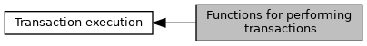

[Data Structures](#nested-classes) \| [Typedefs](#typedef-members) \| [Functions](#func-members)

Collaboration diagram for Functions for performing transactions:

|  |  |
|----|----|
| Data Structures |  |
| struct   | [EMV_CTLS_CANDIDATE_DATA_STRUCT](#struct_e_m_v___c_t_l_s___c_a_n_d_i_d_a_t_e___d_a_t_a___s_t_r_u_c_t) |
|   | Candidate list additional data. [More\...](#struct_e_m_v___c_t_l_s___c_a_n_d_i_d_a_t_e___d_a_t_a___s_t_r_u_c_t)  |

|  |  |
|----|----|
| Typedefs |  |
| typedef struct [EMV_CTLS_CANDIDATE_DATA_STRUCT](#struct_e_m_v___c_t_l_s___c_a_n_d_i_d_a_t_e___d_a_t_a___s_t_r_u_c_t)  | [EMV_CTLS_CANDIDATE_DATA_TYPE](#gaa5b2c1b07fd779960790f10a52352869) |
|   | Candidate list additional data. [More\...](#gaa5b2c1b07fd779960790f10a52352869)  |

|  |  |
|----|----|
| Functions |  |
| <a href="_e_m_v___c_t_l_s___interface_8h.md#a0c075561565f443dd054da7871da8462">DLL_CLC</a> <a href="group___a_d_k___r_e_t___c_o_d_e.md#gaa5ed8ecc7a31f36a8927e6e258187810">EMV_ADK_INFO</a>  | [EMV_CTLS_SetupTransaction](#ga1a86c76dcf8fec6e97ead6cf8f2717ff) (<a href="group___d_e_f___f_l_o_w___i_n_p_u_t.md#gacc76bf526bd4c060620bd6fd81e77a3b">EMV_CTLS_START_TYPE</a> \*pxStartInput, <a href="group___d_e_f___f_l_o_w___o_u_t_p_u_t.md#ga2dce20509b74f876a52aa2e6fc42ec6b">EMV_CTLS_STARTRES_TYPE</a> \*pxStartRes) |
|   | Set up a CTLS EMV transaction. [More\...](#ga1a86c76dcf8fec6e97ead6cf8f2717ff)  |
| <a href="_e_m_v___c_t_l_s___interface_8h.md#a0c075561565f443dd054da7871da8462">DLL_CLC</a> <a href="group___a_d_k___r_e_t___c_o_d_e.md#gaa5ed8ecc7a31f36a8927e6e258187810">EMV_ADK_INFO</a>  | [EMV_CTLS_ContinueOffline](#gaf23f6f87fe90619810470fad7d11f321) (<a href="group___d_e_f___f_l_o_w___o_u_t_p_u_t.md#ga0d11e77342658b02a027f9493e10b70a">EMV_CTLS_TRANSRES_TYPE</a> \*pxTransRes) |
|   | CTLS EMV transaction (offline part \... including 1st cryptogram, depends on CTLS scheme) [More\...](#gaf23f6f87fe90619810470fad7d11f321)  |
| <a href="_e_m_v___c_t_l_s___interface_8h.md#a0c075561565f443dd054da7871da8462">DLL_CLC</a> <a href="group___a_d_k___r_e_t___c_o_d_e.md#gaa5ed8ecc7a31f36a8927e6e258187810">EMV_ADK_INFO</a>  | [EMV_CTLS_ContinueOfflineExt](#gabb14366b95c72086719f894d09027e84) (<a href="group___d_e_f___f_l_o_w___i_n_p_u_t.md#gadf960925e57bbb7c2cba692f4553adcd">EMV_CTLS_CONT_OFFL_TYPE</a> \*pxContOfflInput, <a href="group___d_e_f___f_l_o_w___o_u_t_p_u_t.md#ga0d11e77342658b02a027f9493e10b70a">EMV_CTLS_TRANSRES_TYPE</a> \*pxTransRes) |
|   | Like EMV_CTLS_ContinueOffline but with input parameter. [More\...](#gabb14366b95c72086719f894d09027e84)  |
| <a href="_e_m_v___c_t_l_s___interface_8h.md#a0c075561565f443dd054da7871da8462">DLL_CLC</a> <a href="group___a_d_k___r_e_t___c_o_d_e.md#gaa5ed8ecc7a31f36a8927e6e258187810">EMV_ADK_INFO</a>  | [EMV_CTLS_ContinueOnline](#ga297b6843994afaa2e7a6f5e0e4a8af3e) (<a href="group___d_e_f___f_l_o_w___i_n_p_u_t.md#ga778c9baaa08a647c7aa57ac0ab39ad82">EMV_CTLS_HOST_TYPE</a> \*pxOnlineInput, <a href="group___d_e_f___f_l_o_w___o_u_t_p_u_t.md#ga0d11e77342658b02a027f9493e10b70a">EMV_CTLS_TRANSRES_TYPE</a> \*pxTransRes) |
|   | EMV transaction (handling of host response including 2nd cryptogram) [More\...](#ga297b6843994afaa2e7a6f5e0e4a8af3e)  |
| <a href="_e_m_v___c_t_l_s___interface_8h.md#a0c075561565f443dd054da7871da8462">DLL_CLC</a> <a href="group___a_d_k___r_e_t___c_o_d_e.md#gaa5ed8ecc7a31f36a8927e6e258187810">EMV_ADK_INFO</a>  | [EMV_CTLS_fetchTxnTags](#ga8c9f0640ed818c3dc19da528f5f0b406) (unsigned long options, unsigned long \*requestedTags, unsigned short noOfRequestedTags, unsigned char \*tlvBuffer, unsigned short bufferLength, unsigned short \*tlvDataLength) |
|   | Fetch one or several tags at the end of the transaction. [More\...](#ga8c9f0640ed818c3dc19da528f5f0b406)  |
| <a href="_e_m_v___c_t_l_s___interface_8h.md#a0c075561565f443dd054da7871da8462">DLL_CLC</a> <a href="group___a_d_k___r_e_t___c_o_d_e.md#gaa5ed8ecc7a31f36a8927e6e258187810">EMV_ADK_INFO</a>  | [EMV_CTLS_fetchTxnDOL](#ga41af1fb74c44d7e154ee5ee774ec9460) (unsigned long options, const unsigned char \*DOL, unsigned dolLen, unsigned char \*buffer, unsigned bufferSize, unsigned \*dataLength) |
|   | Retrieve formatted transaction data at the end of the transaction. [More\...](#ga41af1fb74c44d7e154ee5ee774ec9460)  |
| <a href="_e_m_v___c_t_l_s___interface_8h.md#a0c075561565f443dd054da7871da8462">DLL_CLC</a> <a href="group___a_d_k___r_e_t___c_o_d_e.md#gaa5ed8ecc7a31f36a8927e6e258187810">EMV_ADK_INFO</a>  | [EMV_CTLS_EndTransaction](#gaa7aed3c7f0c3ac0f26cc46efff422dd9) (unsigned long options) |
|   | End transaction. [More\...](#gaa7aed3c7f0c3ac0f26cc46efff422dd9)  |
| <a href="_e_m_v___c_t_l_s___interface_8h.md#a0c075561565f443dd054da7871da8462">DLL_CLC</a> unsigned char  | [EMV_CTLS_CardRemoval](#gaf9ca19bc9d77bfe1dfec28c030b18059) (long timeoutMillis) |
|   | Wait until contactless card removed or timeout. [More\...](#gaf9ca19bc9d77bfe1dfec28c030b18059)  |
| <a href="_e_m_v___c_t_l_s___interface_8h.md#a0c075561565f443dd054da7871da8462">DLL_CLC</a> unsigned char  | [EMV_CTLS_Break](#ga2b4820be53959b56fb7f672bd54f4e63) (void) |
|   | Universal break command **Velocity: Only required when using <a href="group___d_e_f___f_l_o_w___i_n_p_u_t.md#a55288d912bcb810932a421b632af84aa">EMV_CTLS_START_STRUCT::ServerPollTimeout</a> != 0.** **VFI-Reader: Always required** [More\...](#ga2b4820be53959b56fb7f672bd54f4e63)  |
| <a href="_e_m_v___c_t_l_s___interface_8h.md#a0c075561565f443dd054da7871da8462">DLL_CLC</a> <a href="group___a_d_k___r_e_t___c_o_d_e.md#gaa5ed8ecc7a31f36a8927e6e258187810">EMV_ADK_INFO</a>  | [EMV_CTLS_GetCandidateData](#gab1600b67271771658ce682b9cfeb660e) ([EMV_CTLS_CANDIDATE_DATA_TYPE](#gaa5b2c1b07fd779960790f10a52352869) \*candidateData) |
|   | Get additional candidate information for reducing and resorting the mutual candidate list. [More\...](#gab1600b67271771658ce682b9cfeb660e)  |
| <a href="_e_m_v___c_t_l_s___interface_8h.md#a0c075561565f443dd054da7871da8462">DLL_CLC</a> <a href="group___a_d_k___r_e_t___c_o_d_e.md#gaa5ed8ecc7a31f36a8927e6e258187810">EMV_ADK_INFO</a>  | [EMV_CTLS_GetCandidateDataMax](#ga1f8deee09dd25406d1779cdeb33fdd60) ([EMV_CTLS_CANDIDATE_DATA_TYPE](#gaa5b2c1b07fd779960790f10a52352869) \*candidateData, unsigned maxCandidates) |
|   | Get additional candidate information for reducing and resorting the mutual candidate list. [More\...](#ga1f8deee09dd25406d1779cdeb33fdd60)  |
| void  | [EMV_CTLS_Disconnect](#ga6455193dd87247fc50cab29f410e7e06) (unsigned char options) |
|   | Disconnect from EMV server. [More\...](#ga6455193dd87247fc50cab29f410e7e06)  |
| void  | [EMV_CTLS_SetClientMode](#ga539b903c1b51eeb98dd660d3d88095a7) (enum <a href="_e_m_v___common___interface_8h.md#aa5ecae39726aadf1805b96849d3d28f5">EMV_CLIENT_MODE</a> mode) |
|   | Switch to client mode. [More\...](#ga539b903c1b51eeb98dd660d3d88095a7)  |
| enum <a href="_e_m_v___common___interface_8h.md#aa5ecae39726aadf1805b96849d3d28f5">EMV_CLIENT_MODE</a>  | [EMV_CTLS_GetClientMode](#ga8b21722ef2dcc6d06c4b3c947200b6c8) () |
|   | Query the client mode. [More\...](#ga8b21722ef2dcc6d06c4b3c947200b6c8)  |
| void  | [EMV_CTLS_SetCallback](#gab60c67c1d2b40c6aebbe5a2aad88e0f8) (<a href="group___t_l_v___c_a_l_l_b_c_k.md#ga6557e914101768d67635ca44e54362ab">EMV_CTLS_CALLBACK_FnT</a> EMV_Callback, void \*context) |
|   | Set Callback Function and activate Callback <a href="class_thread.md">Thread</a>. [More\...](#gab60c67c1d2b40c6aebbe5a2aad88e0f8)  |
| unsigned long  | [EMV_CTLS_GetInitOptions](#ga297309e3cacb1ff58b5c3101b27782ec) (void) |
|   | Getter to Init Options from EMV_CTLS_Init_Framework. [More\...](#ga297309e3cacb1ff58b5c3101b27782ec)  |
| unsigned  | [EMV_CTLS_GetSdiSW12](#ga2e8f70069fd23dad84c4ea6bce6a5ac7) () |
|   | Access SDI status word. [More\...](#ga2e8f70069fd23dad84c4ea6bce6a5ac7)  |
| <a href="_e_m_v___c_t___interface_8h.md#aba0ead6baeabe51c5f4fe870feb9ec16">DLL_CTC</a> <a href="group___a_d_k___r_e_t___c_o_d_e.md#gaa5ed8ecc7a31f36a8927e6e258187810">EMV_ADK_INFO</a>  | [EMV_CT_StartTransaction](#gac13472c2a4aea6475fe7bb52627e97eb) (<a href="group___a_d_k___t_r_x___e_x_e_c.md#ga58431469c9e1e41d6e419cbc246fd4bb">EMV_CT_SELECT_TYPE</a> \*pxSelectInput, <a href="group___a_d_k___t_r_x___e_x_e_c.md#ga7e8a721d6043e021fcc24b36f2aca33f">EMV_CT_SELECTRES_TYPE</a> \*pxSelectRes) |
|   | EMV Application Selection. [More\...](#gac13472c2a4aea6475fe7bb52627e97eb)  |
| <a href="_e_m_v___c_t___interface_8h.md#aba0ead6baeabe51c5f4fe870feb9ec16">DLL_CTC</a> <a href="group___a_d_k___r_e_t___c_o_d_e.md#gaa5ed8ecc7a31f36a8927e6e258187810">EMV_ADK_INFO</a>  | [EMV_CT_GetCandidateData](#gac8f6430c652d6dad621ca3c0cf367346) (<a href="group___a_d_k___t_r_x___e_x_e_c.md#ga27bfe240213c6d19faa79f347c30715e">EMV_CT_CANDIDATE_DATA_TYPE</a> \*candidateData) |
|   | Get additional candidate information for reducing, resorting or displaying the mutual candidate list. [More\...](#gac8f6430c652d6dad621ca3c0cf367346)  |
| <a href="_e_m_v___c_t___interface_8h.md#aba0ead6baeabe51c5f4fe870feb9ec16">DLL_CTC</a> <a href="group___a_d_k___r_e_t___c_o_d_e.md#gaa5ed8ecc7a31f36a8927e6e258187810">EMV_ADK_INFO</a>  | [EMV_CT_ContinueOffline](#ga8be6df6babc587a19f63f284b2a6f006) (<a href="group___a_d_k___t_r_x___e_x_e_c.md#gae6382746c700031a73d619e7bda2c5af">EMV_CT_TRANSAC_TYPE</a> \*pxTransactionInput, <a href="group___a_d_k___t_r_x___e_x_e_c.md#ga3361b4c859aae10793dce6803138150f">EMV_CT_TRANSRES_TYPE</a> \*pxTransRes) |
|   | EMV transaction (offline part including 1st cryptogram) [More\...](#ga8be6df6babc587a19f63f284b2a6f006)  |
| <a href="_e_m_v___c_t___interface_8h.md#aba0ead6baeabe51c5f4fe870feb9ec16">DLL_CTC</a> <a href="group___a_d_k___r_e_t___c_o_d_e.md#gaa5ed8ecc7a31f36a8927e6e258187810">EMV_ADK_INFO</a>  | [EMV_CT_ContinueOnline](#ga42f570d2b8e66841ab9e8de7736e92d4) (<a href="group___a_d_k___t_r_x___e_x_e_c.md#ga87fb8729a9792ab70bdae526f3a938c2">EMV_CT_HOST_TYPE</a> \*pxOnlineInput, <a href="group___a_d_k___t_r_x___e_x_e_c.md#ga3361b4c859aae10793dce6803138150f">EMV_CT_TRANSRES_TYPE</a> \*pxTransRes) |
|   | EMV transaction (handling of host response including 2nd cryptogram) [More\...](#ga42f570d2b8e66841ab9e8de7736e92d4)  |
| <a href="_e_m_v___c_t___interface_8h.md#aba0ead6baeabe51c5f4fe870feb9ec16">DLL_CTC</a> <a href="group___a_d_k___r_e_t___c_o_d_e.md#gaa5ed8ecc7a31f36a8927e6e258187810">EMV_ADK_INFO</a>  | [EMV_CT_fetchTxnTags](#gab005fdec183a0c8fef18ae677cce6dc5) (unsigned long options, unsigned long \*requestedTags, unsigned short noOfRequestedTags, unsigned char \*tlvBuffer, unsigned short bufferLength, unsigned short \*tlvDataLength) |
|   | Fetch one or several tags at the end of the transaction. [More\...](#gab005fdec183a0c8fef18ae677cce6dc5)  |
| <a href="_e_m_v___c_t___interface_8h.md#aba0ead6baeabe51c5f4fe870feb9ec16">DLL_CTC</a> <a href="group___a_d_k___r_e_t___c_o_d_e.md#gaa5ed8ecc7a31f36a8927e6e258187810">EMV_ADK_INFO</a>  | [EMV_CT_fetchTxnDOL](#ga1af2b496d37337cff4fb8b9407ed933d) (unsigned long options, const unsigned char \*DOL, unsigned dolLen, unsigned char \*buffer, unsigned bufferSize, unsigned \*dataLength) |
|   | Retrieve formatted transaction data at the end of the transaction. [More\...](#ga1af2b496d37337cff4fb8b9407ed933d)  |
| <a href="_e_m_v___c_t___interface_8h.md#aba0ead6baeabe51c5f4fe870feb9ec16">DLL_CTC</a> <a href="group___a_d_k___r_e_t___c_o_d_e.md#gaa5ed8ecc7a31f36a8927e6e258187810">EMV_ADK_INFO</a>  | [EMV_CT_updateTxnTags](#gad3dd36d27d5fa94d3f302dc4a4546b70) (unsigned long options, unsigned char \*tlvBuffer, unsigned short bufferLength) |
|   | Update one or several kernel tags during transaction. [More\...](#gad3dd36d27d5fa94d3f302dc4a4546b70)  |
| <a href="_e_m_v___c_t___interface_8h.md#aba0ead6baeabe51c5f4fe870feb9ec16">DLL_CTC</a> <a href="group___a_d_k___r_e_t___c_o_d_e.md#gaa5ed8ecc7a31f36a8927e6e258187810">EMV_ADK_INFO</a>  | [EMV_CT_CheckSupportedAID](#gad55c11dd44dbba66d6fefeb48b01a9e4) (const <a href="_e_m_v___c_t___interface_8h.md#ae836cd33e4343219ad6106a383afd876">EMV_CT_APPLI_TYPE</a> \*aid, unsigned char ASI, const unsigned char \*defaultLabel, <a href="group___a_d_k___t_r_x___e_x_e_c.md#struct_e_m_v___c_t___cand_list_type">EMV_CT_CandListType</a> \*pCandList, unsigned char MaxCand, unsigned char \*pCandidateCount, unsigned short \*sw12, const unsigned char \*adtCardTagList) |
|   | Do List Of Application processing for a single terminal AID. [More\...](#gad55c11dd44dbba66d6fefeb48b01a9e4)  |
| <a href="_e_m_v___c_t___interface_8h.md#aba0ead6baeabe51c5f4fe870feb9ec16">DLL_CTC</a> <a href="group___a_d_k___r_e_t___c_o_d_e.md#gaa5ed8ecc7a31f36a8927e6e258187810">EMV_ADK_INFO</a>  | [EMV_CT_EndTransaction](#gaec319989542c7681715566de387d7f69) (unsigned long options) |
|   | End transaction. [More\...](#gaec319989542c7681715566de387d7f69)  |
| <a href="_e_m_v___c_t___interface_8h.md#aba0ead6baeabe51c5f4fe870feb9ec16">DLL_CTC</a> unsigned char  | [EMV_CT_Send_PIN_Offline](#ga895cb054c344d011e9e3c6acc4aadafe) (unsigned char \*pucPINResultData) |
|   | Send entered (offline) PIN to chip card for verification. [More\...](#ga895cb054c344d011e9e3c6acc4aadafe)  |
| void  | [EMV_CT_Disconnect](#ga9d88559e5ab793338241d554dbcfcf81) (void) |
|   | Disconnect from EMV server. [More\...](#ga9d88559e5ab793338241d554dbcfcf81)  |
| void  | [EMV_CT_SetClientMode](#ga2204cedafe3383303c043852f3ceebb9) (enum <a href="_e_m_v___common___interface_8h.md#aa5ecae39726aadf1805b96849d3d28f5">EMV_CLIENT_MODE</a> mode) |
|   | Switch to Client-Server mode. [More\...](#ga2204cedafe3383303c043852f3ceebb9)  |
| enum <a href="_e_m_v___common___interface_8h.md#aa5ecae39726aadf1805b96849d3d28f5">EMV_CLIENT_MODE</a>  | [EMV_CT_GetClientMode](#ga3dfeec9544bea2b365ef31fbaf3b81e2) () |
|   | Query the client mode. [More\...](#ga3dfeec9544bea2b365ef31fbaf3b81e2)  |
| void  | [EMV_CT_SetCallback](#gae51e43ae5d6598d3350458286925aba9) (<a href="adk__emv__contactless__programmers__guide_8dox.md#a591fd0f380cd390007ce78b47be923c4">EMV_CT_CALLBACK_FnT</a> EMV_Callback, void \*context) |
|   | Set Callback Function and activate Callback <a href="class_thread.md">Thread</a>. [More\...](#gae51e43ae5d6598d3350458286925aba9)  |
| unsigned long  | [EMV_CT_GetInitOptions](#gad050ccbed4f332f10f2a081991c3203d) (void) |
|   | Getter to Init Options from EMV_CT_Init_Framework. [More\...](#gad050ccbed4f332f10f2a081991c3203d)  |
| unsigned  | [EMV_CT_GetSdiSW12](#ga584e4aff7e4e384a3442e904b9098305) () |
|   | Access SDI status word. [More\...](#ga584e4aff7e4e384a3442e904b9098305)  |

## DetailedDescription {#detailed-description}

------------------------------------------------------------------------

## DataStructure Documentation {#data-structure-documentation}

## EMV_CTLS_CANDIDATE_DATA_STRUCT 

struct EMV_CTLS_CANDIDATE_DATA_STRUCT

Candidate list additional data.

To be used in conjunction with AID list in combo candidates callback <a href="group___c_b_c_k___f_c_t___t_a_g_s.md#ga2ef5c305dbfcabbea00a6d9e3c544547">TAG_BF12_CBK_MODIFY_CAND</a>
See also [EMV_CTLS_GetCandidateData()](#gab1600b67271771658ce682b9cfeb660e "Get additional candidate information for reducing and resorting the mutual candidate list.")

| Data Fields |  |  |
|----|----|----|
| unsigned char | API | tag \'87\' application priority indicator |
| unsigned char | BIC\[12\] | tag \'5F54\' Bank identification code (an 8 or 11, terminated by \'0\') |
| unsigned char | country2\[2\] | tag \'5F55\' Issuer Country Code (a2) |
| unsigned char | country3\[3\] | tag \'5F56\' Issuer Country Code (a3) |
| unsigned char | disc\[1+50\] | discretionary data, content of tag 73, first byte is length |
| unsigned char | IBAN\[35\] | tag \'5F53\' International bank account (an ..34, terminated by \'0\') |
| unsigned char | IIN\[4\] | tag \'42\'/\'9F0C\' issuer identification number (n6 or n8, padded from right with 0xff like PAN), 0xff if absent |
| unsigned char | len9F06 | for determining the terminal candidate (\'9F06\') in case of \"AID chain\" and partial select |
| unsigned char | selData\[1+<a href="_e_m_v___c_t_l_s___interface_8h.md#a2f744c59b2af196fe39ce7281c584563">EMV_CTLS_SUPPORTED_SIZE_9F0A</a>\] | Application Selection Registered Proprietary Data (9F0A), Bulletin No. 175, first byte length. |

## TypedefDocumentation {#typedef-documentation}

## EMV_CTLS_CANDIDATE_DATA_TYPE 

typedef struct [EMV_CTLS_CANDIDATE_DATA_STRUCT](#struct_e_m_v___c_t_l_s___c_a_n_d_i_d_a_t_e___d_a_t_a___s_t_r_u_c_t) [EMV_CTLS_CANDIDATE_DATA_TYPE](#gaa5b2c1b07fd779960790f10a52352869)

Candidate list additional data.

To be used in conjunction with AID list in combo candidates callback <a href="group___c_b_c_k___f_c_t___t_a_g_s.md#ga2ef5c305dbfcabbea00a6d9e3c544547">TAG_BF12_CBK_MODIFY_CAND</a>
See also [EMV_CTLS_GetCandidateData()](#gab1600b67271771658ce682b9cfeb660e "Get additional candidate information for reducing and resorting the mutual candidate list.")

## FunctionDocumentation {#function-documentation}

## EMV_CT_CheckSupportedAID() 

<a href="_e_m_v___c_t___interface_8h.md#aba0ead6baeabe51c5f4fe870feb9ec16">DLL_CTC</a> <a href="group___a_d_k___r_e_t___c_o_d_e.md#gaa5ed8ecc7a31f36a8927e6e258187810">EMV_ADK_INFO</a> EMV_CT_CheckSupportedAID

Do List Of Application processing for a single terminal AID.

Only recommended for experienced users.

### Author

GSS R&D Germany

**Parameters**

\[in\] **aid** Terminal AID(\'9F 06\')TLV tag TAG_4F_APP_ID \[in\] **ASI** Application selection indicator 0=exact, 1=partialTLV tag TAG_DF20_ASI \[in\] **defaultLabel** Optional: default application labelTLV tag TAG_50_APP_LABEL \[out\] **pCandList** Buffer for candidates foundTLV tag TAG_CAND_LIST \[in\] **MaxCand** Number items that can be stored to pCandList buffer, \[1 .. EMV_CT_COMMON_CANDS\]not serialized on TLV interface \[out\] **pCandidateCount** Number of candidates foundTLV interface: number of iterations of TAG_CAND_LIST \[out\] **sw12** Optional: status word return by card, \'0000\' for communication problemTLV tag TAG_DF3C_PARAMETER_2 \[in\] **adtCardTagList** Additional card tags list for Additional Tag Store configuration:1 byte overall list length + n \* (tag (1-4 bytes) + type (1 byte) + minimal length (1 byte) + maximal length (1 byte)).If null pointer the framework\'s standard ADT card tag list will be used, if list length is 0 no additional card tags are put to the Addtional Tag Store configuration.Types are according L2 kernel interface: 1 binary, 2 numeric, 3 np, 4 date, 5 an, 6 ans.TLV tag TAG_DF2C_ADD_TAGS_CRD

### Returns

<a href="group___a_d_k___r_e_t___c_o_d_e.md#ga1456bb13b42906927f8a8942169b62e7">EMV_ADK_OK</a> (EMVL2_AUTO_SELECT, EMVL2_NOT_SELECTED)
<a href="group___a_d_k___r_e_t___c_o_d_e.md#gab2bd25812bbdf301a668a2b1c07f63d9">EMV_ADK_BADAPP</a> (EMVL2_NON_EMV)
<a href="group___a_d_k___r_e_t___c_o_d_e.md#ga14713da8fe0512c8700f524279d2e573">EMV_ADK_NOAPP</a> (EMVL2_MAG_STRIPE)
<a href="group___a_d_k___r_e_t___c_o_d_e.md#ga1dfbf84d77767d546775d51566cb9b3d">EMV_ADK_CARD_BLOCKED</a> (EMVL2_ICC_BLOCKED)
<a href="group___a_d_k___r_e_t___c_o_d_e.md#gab48a793910e1f71ce30d16a19f6af3e8">EMV_ADK_APP_BLOCKED</a> (EMVL2_DF_BLOCKED, \'62 83\')
<a href="group___a_d_k___r_e_t___c_o_d_e.md#gacf4f664d525a588d4a4e549002e454cd">EMV_ADK_CARDERR_FORMAT</a> (EMVL2_MNDTY_DATA)
<a href="group___a_d_k___r_e_t___c_o_d_e.md#ga89c11346e5e636e7c9d42c6a772674bf">EMV_ADK_PARAM</a> (EMVL2_BAD_PARAM)
<a href="group___a_d_k___r_e_t___c_o_d_e.md#ga2e738502a536ed7190406ce0e7c6916d">EMV_ADK_NO_CARD</a> (EMVL2_FAIL + missing card)
<a href="group___a_d_k___r_e_t___c_o_d_e.md#ga5f6c47c1042b70f3753191850219e745">EMV_ADK_FALLBACK</a> (EMVL2_FAIL + card in)

## EMV_CT_ContinueOffline() 

<a href="_e_m_v___c_t___interface_8h.md#aba0ead6baeabe51c5f4fe870feb9ec16">DLL_CTC</a> <a href="group___a_d_k___r_e_t___c_o_d_e.md#gaa5ed8ecc7a31f36a8927e6e258187810">EMV_ADK_INFO</a> EMV_CT_ContinueOffline

EMV transaction (offline part including 1st cryptogram)

Explanation in programmers guide: <a href="pg_emv_contact_users_guide.md#anchor_emv_ct_continue_a_transaction__offline_part">Continue a Transaction Offline Part</a>

### Author

GSS R&D Germany

**Parameters**

\[in\] **pxTransactionInput** Transaction data, see EMV_CT_TRANSAC_STRUCT \[out\] **pxTransRes** Transaction result data, see EMV_CT_TRANSRES_STRUCT

### Returns

<a href="group___a_d_k___r_e_t___c_o_d_e.md#ga493578e3e0e9112d42d209b783fe1f60">EMV_ADK_ARQC</a>: transaction must go online
<a href="group___a_d_k___r_e_t___c_o_d_e.md#ga555e8c267be8402d0b540253a991e1ee">EMV_ADK_TC</a>: transaction is offline approved
<a href="group___a_d_k___r_e_t___c_o_d_e.md#ga5f6c47c1042b70f3753191850219e745">EMV_ADK_FALLBACK</a>: depending on domestic specification a fallback to magstripe may be allowed
<a href="group___a_d_k___r_e_t___c_o_d_e.md#ga1456bb13b42906927f8a8942169b62e7">EMV_ADK_OK</a>: card data read successfully (only possible for transaction types <a href="group___t_r_a_n_s___t_y_p_e_s.md#gaf341bd2190b00ce5ee3a8acf6d5311ab">EMV_ADK_TRAN_TYPE_REFUND</a>, <a href="group___t_r_a_n_s___t_y_p_e_s.md#gae61beb9da6b52b6cd03016917eb12458">EMV_ADK_TRAN_TYPE_MANUAL_REVERSAL</a>, <a href="group___t_r_a_n_s___t_y_p_e_s.md#ga6e2455446afc284d8e8acd527f37ba37">EMV_ADK_TRAN_TYPE_BUCHUNG_B</a>, <a href="group___t_r_a_n_s___t_y_p_e_s.md#gaaafcb81dbdff99313d10b53166a3033f">EMV_ADK_TRAN_TYPE_BUCHUNG_A</a>)
<a href="group___a_d_k___r_e_t___c_o_d_e.md#ga956701431c0cef09072c040d816e5d7b">EMV_ADK_AAC</a>: transaction is offline declined
<a href="group___a_d_k___r_e_t___c_o_d_e.md#ga43a6dcc45fcf91c2ef8e73afc38ea121">EMV_ADK_AAR</a>: referral is to be performed
<a href="group___a_d_k___r_e_t___c_o_d_e.md#gab0e8158b5e7019f0da44c5cbc37bae3d">EMV_ADK_INTERNAL</a>: internal communication problem, illegal file content, memory allocation
<a href="group___a_d_k___r_e_t___c_o_d_e.md#ga89c11346e5e636e7c9d42c6a772674bf">EMV_ADK_PARAM</a>: bad pxTransactionInput or pxTransRes input params
<a href="group___a_d_k___r_e_t___c_o_d_e.md#ga7045deba09a19eea4f7df8881a08b807">EMV_ADK_ABORT</a>:
`1`) Transaction aborted by customer at different stages
`2`) DCC requested but transaction must be restarted
`3`) CDCVM Card not yet enrolled (DPAS)
`4`) Card removed at final select stage, during a referral or during GET DATA PTC (70) command
`5`) Fallback not allowed
`6`) Any error at final select stage in a transaction repetition
`7`) No more available technologies to perform a transaction in case of fallback
`8`) ICC did not answer with valid AAC
`9`) 1st Cryptogram returns \"Service not allowed\"
`10`) CDA failure at GENAC1 (NO GENAC2 needed)
`11`) Unkown cryptogram result and AAC has been requested
`12`) Inconsistent Track2 data against PAN and Exp Date when checks enabled
`13`) Aborted or timed-out enforced online-pin
`14`) Domestic local checks requested abort
`15`) Calling application tried to change amount or currency
`16`) Failing writing DCC callbacks changed tag values
`17`) Bad application during repetition transaction at GPO stage
`18`) AIP does not support Cardholder Verification at GPO stage
`19`) Terminal or Application does not support Cash
`20`) Terminal or Application does not support Cashback
`21`) Customer application requested transaction abort in reentrance mode after GPO
<a href="group___a_d_k___r_e_t___c_o_d_e.md#ga23fcc197f78dfa83f4c93f97faaa729e">EMV_ADK_CVM</a>: user abort during PIN input
**Serialization:**

\[unsupported block\] Class: <a href="group___a_d_k___t_r_a_n_s_p_o_r_t___t_a_g_s.md#ga7ca54f43b657f0cc8b1ad98ecf60491f">CLA_EMV</a>, Instruction: <a href="group___a_d_k___t_r_a_n_s_p_o_r_t___t_a_g_s.md#ga153f7430e35ff29a88b352f6bc3f2e93">INS_TRANSAC</a>
Callbacks: <a href="group___a_d_k___t_r_a_n_s_p_o_r_t___t_a_g_s.md#ga975cd4206f0b6b238b340178ad792c78">EMV_CT_CLA_CBCK_REQ</a>, <a href="group___a_d_k___t_r_a_n_s_p_o_r_t___t_a_g_s.md#ga0fe23ca596d2bf6ff3d483c6eb6a63ea">EMV_CT_CLA_CBCK_RESP</a>

## EMV_CT_ContinueOnline() 

<a href="_e_m_v___c_t___interface_8h.md#aba0ead6baeabe51c5f4fe870feb9ec16">DLL_CTC</a> <a href="group___a_d_k___r_e_t___c_o_d_e.md#gaa5ed8ecc7a31f36a8927e6e258187810">EMV_ADK_INFO</a> EMV_CT_ContinueOnline

EMV transaction (handling of host response including 2nd cryptogram)

Explanation in programmers guide: <a href="pg_emv_contact_users_guide.md#anchor_emv_ct_continue_a_transaction__online_part">Continue a Transaction Online Part</a>

### Author

GSS R&D Germany

**Parameters**

\[in\] **pxOnlineInput** Data of host response, see EMV_CT_HOST_STRUCT \[out\] **pxTransRes** Result data, see EMV_CT_TRANSRES_STRUCT

### Returns

<a href="group___a_d_k___r_e_t___c_o_d_e.md#ga555e8c267be8402d0b540253a991e1ee">EMV_ADK_TC</a>: transaction is online approved
<a href="group___a_d_k___r_e_t___c_o_d_e.md#ga956701431c0cef09072c040d816e5d7b">EMV_ADK_AAC</a>: transaction is online declined
<a href="group___a_d_k___r_e_t___c_o_d_e.md#ga7045deba09a19eea4f7df8881a08b807">EMV_ADK_ABORT</a>: transaction is aborted by customer
<a href="group___a_d_k___r_e_t___c_o_d_e.md#ga1c45091db79e3fb0564afd1c0fde9820">EMV_ADK_ONLINE_PIN_RETRY</a>: online PIN reentered (PIN check)
<a href="group___a_d_k___r_e_t___c_o_d_e.md#ga23fcc197f78dfa83f4c93f97faaa729e">EMV_ADK_CVM</a>: user abort during PIN input
<a href="group___a_d_k___r_e_t___c_o_d_e.md#gab0e8158b5e7019f0da44c5cbc37bae3d">EMV_ADK_INTERNAL</a>: internal communication problem, illegal file content, memory allocation
<a href="group___a_d_k___r_e_t___c_o_d_e.md#ga89c11346e5e636e7c9d42c6a772674bf">EMV_ADK_PARAM</a>: bad pxOnlineInput or pxTransRes input param
<a href="group___a_d_k___r_e_t___c_o_d_e.md#ga5db7ec54114a9799fb2f75892215ad0a">EMV_ADK_CARDERR</a>: error while writing Data Storage Containers (DPAS)
**Serialization:**

\[unsupported block\] Class: <a href="group___a_d_k___t_r_a_n_s_p_o_r_t___t_a_g_s.md#ga7ca54f43b657f0cc8b1ad98ecf60491f">CLA_EMV</a>, Instruction: <a href="group___a_d_k___t_r_a_n_s_p_o_r_t___t_a_g_s.md#ga6deba1f9808c46b51e95b93128f80233">INS_ONLINE</a>

## EMV_CT_Disconnect() 

void EMV_CT_Disconnect

Disconnect from EMV server.

Since the EMV server handles only one client this function needs to be called if the EMV control shall be handed over to different client process. Note: This function has no effect, if not yet connected or not using the client/server libaray.

### Author

GSS R&D Germany

## EMV_CT_EndTransaction() 

<a href="_e_m_v___c_t___interface_8h.md#aba0ead6baeabe51c5f4fe870feb9ec16">DLL_CTC</a> <a href="group___a_d_k___r_e_t___c_o_d_e.md#gaa5ed8ecc7a31f36a8927e6e258187810">EMV_ADK_INFO</a> EMV_CT_EndTransaction

End transaction.

### Author

GSS R&D Germany

**Parameters**

\[in\] **options** Options, reserved for future useTLV tag TAG_DF3B_PARAMETER_1

### Returns

<a href="group___a_d_k___r_e_t___c_o_d_e.md#ga1456bb13b42906927f8a8942169b62e7">EMV_ADK_OK</a>: success
<a href="group___a_d_k___r_e_t___c_o_d_e.md#ga3a1d800696b9d7a86c0e39068d3fde57">EMV_ADK_NOT_ALLOWED</a>: concurrent call or not allowed within callback
<a href="group___a_d_k___r_e_t___c_o_d_e.md#gab0e8158b5e7019f0da44c5cbc37bae3d">EMV_ADK_INTERNAL</a>: internal communication problem, illegal file content, memory allocation
**Serialization:** Class: <a href="group___a_d_k___t_r_a_n_s_p_o_r_t___t_a_g_s.md#ga7ca54f43b657f0cc8b1ad98ecf60491f">CLA_EMV</a>, Instruction: <a href="group___a_d_k___t_r_a_n_s_p_o_r_t___t_a_g_s.md#ga2fae6a4de2eb26c2c5d30d475ccc19c5">INS_END_TRX</a>

## EMV_CT_fetchTxnDOL() 

<a href="_e_m_v___c_t___interface_8h.md#aba0ead6baeabe51c5f4fe870feb9ec16">DLL_CTC</a> <a href="group___a_d_k___r_e_t___c_o_d_e.md#gaa5ed8ecc7a31f36a8927e6e258187810">EMV_ADK_INFO</a> EMV_CT_fetchTxnDOL

Retrieve formatted transaction data at the end of the transaction.

Like [EMV_CT_fetchTxnTags](#gab005fdec183a0c8fef18ae677cce6dc5) but take a DOL and return pure data. The return buffer is filled with requested data, each with exact requested data length. The tag\'s data type is analysed and type specific truncation and padding is applied. If a tag\'s type is unknown, binary is assumed. If the tag is unknown or no data available, \'00\' bytes are padded. If the requested data length is greater than the available data length, then numeric data is padded with leading \'00\' and compressed numeric is padded with trailing \'FF\'. Other types are padded right with trailing \'00\'. If the requested data length is smaller than the available data length, then numeric values are cut at front and others at the end.

Transport tags used in serialisation: <a href="group___a_d_k___t_r_a_n_s_p_o_r_t___t_a_g_s.md#ga7ca54f43b657f0cc8b1ad98ecf60491f">CLA_EMV</a> <a href="group___a_d_k___t_r_a_n_s_p_o_r_t___t_a_g_s.md#gac3d226ab26f6649ab60a7412dde79bef">INS_FETCH_DOL</a>

### Author

GSS R&D Germany

**Parameters**

\[in\] **options** Options: None, reserved for future useTLV tag TAG_DF3B_PARAMETER_1 \[in\] **DOL** Data Object List = sequence of BER-TLV Tag+Length pairsTLV tag TAG_DF3C_PARAMETER_2 \[in\] **dolLen** Length of DOL \[bytes\]TLV tag TAG_DF3C_PARAMETER_2 \[in,out\] **buffer** Result data bufferTLV tag TAG_ISO_DATA \[in\] **bufferSize** Size of result data buffer \[bytes\]TLV tag TAG_DF3D_PARAMETER_3 \[out\] **dataLength** Result data length = sum of all lengths in the DOL (in case of success)TLV tag TAG_ISO_DATA

### Returns

<a href="group___a_d_k___r_e_t___c_o_d_e.md#ga1456bb13b42906927f8a8942169b62e7">EMV_ADK_OK</a>: success
<a href="group___a_d_k___r_e_t___c_o_d_e.md#ga89c11346e5e636e7c9d42c6a772674bf">EMV_ADK_PARAM</a>: bad DOL, buffer or bufferSize input params
<a href="group___a_d_k___r_e_t___c_o_d_e.md#ga4837e54c589150debdef49afb8f9b5db">EMV_ADK_TLV_BUILD_ERR</a>: processing problem
<a href="group___a_d_k___r_e_t___c_o_d_e.md#ga3a1d800696b9d7a86c0e39068d3fde57">EMV_ADK_NOT_ALLOWED</a>: concurrent call or not allowed within callback
<a href="group___a_d_k___r_e_t___c_o_d_e.md#gab0e8158b5e7019f0da44c5cbc37bae3d">EMV_ADK_INTERNAL</a>: internal communication problem, illegal file content, memory allocation

## EMV_CT_fetchTxnTags() 

<a href="_e_m_v___c_t___interface_8h.md#aba0ead6baeabe51c5f4fe870feb9ec16">DLL_CTC</a> <a href="group___a_d_k___r_e_t___c_o_d_e.md#gaa5ed8ecc7a31f36a8927e6e258187810">EMV_ADK_INFO</a> EMV_CT_fetchTxnTags

Fetch one or several tags at the end of the transaction.

While ContinueOffline and ContinueOnline provide the most common / generic tags, which are necessary for application handling in a readable way (structure), this may not fulfill all local requirements. This function offers to read any proprietary, extended or application specific tag, which is additionally (next to the generic ones) required by the application. Calling this function is optional, however it may provide benefit for single tags as well as for tag combinations, which will be provided in a TLV stream (e.g. needed for BMP 55) instead of structure data, which is preferable for receipt printing or offline storage.

Explanation in programmers guide: <a href="pg_emv_contact_users_guide.md#anchor_emv_ct_fetching_additional_tags">Fetching Additional Tags</a>

### Author

GSS R&D Germany

**Parameters**

\[in\] **options** Options, see Options for fetching TLV dataTLV tag TAG_DF3B_PARAMETER_1 \[in\] **requestedTags** Requested tagsTLV tag TAG_DF3C_PARAMETER_2 \[in\] **noOfRequestedTags** Number of requested tagsTLV tag TAG_DF3C_PARAMETER_2 \[in,out\] **tlvBuffer** Buffer for TLV output, allocated by calling applicationnot serialized on TLV interface \[in\] **bufferLength** Number of bytes allocated for tlvBuffernot serialized on TLV interface \[out\] **tlvDataLength** Number of bytes written to tlvBuffernot serialized on TLV interface

### Returns

<a href="group___a_d_k___r_e_t___c_o_d_e.md#ga1456bb13b42906927f8a8942169b62e7">EMV_ADK_OK</a>: success
<a href="group___a_d_k___r_e_t___c_o_d_e.md#ga89c11346e5e636e7c9d42c6a772674bf">EMV_ADK_PARAM</a>: bad requestedTags, tlvBuffer or tlvDataLength input params
<a href="group___a_d_k___r_e_t___c_o_d_e.md#ga4837e54c589150debdef49afb8f9b5db">EMV_ADK_TLV_BUILD_ERR</a>: processing problem
<a href="group___a_d_k___r_e_t___c_o_d_e.md#ga3a1d800696b9d7a86c0e39068d3fde57">EMV_ADK_NOT_ALLOWED</a>: concurrent call or not allowed within callback
<a href="group___a_d_k___r_e_t___c_o_d_e.md#gab0e8158b5e7019f0da44c5cbc37bae3d">EMV_ADK_INTERNAL</a>: internal communication problem, illegal file content, memory allocation

## EMV_CT_GetCandidateData() 

<a href="_e_m_v___c_t___interface_8h.md#aba0ead6baeabe51c5f4fe870feb9ec16">DLL_CTC</a> <a href="group___a_d_k___r_e_t___c_o_d_e.md#gaa5ed8ecc7a31f36a8927e6e258187810">EMV_ADK_INFO</a> EMV_CT_GetCandidateData

Get additional candidate information for reducing, resorting or displaying the mutual candidate list.

This function is optionally called after EMV_CT_StartTransaction (reentrance mode) or within the reduce candidates callback. It retrieves additional information for all mutual candidates. The output list array length must be at least the number of mutual candidates which is less or equal <a href="_e_m_v___c_t___interface_8h.md#a73aac817e0b96c40ce27ad8b87a5b2e2">EMV_CT_COMMON_CANDS</a>.

### Author

GSS R&D Germany

**Parameters**

\[out\] **candidateData** Extended candidate data, see EMV_CT_CANDIDATE_DATA_STRUCT

### Returns

<a href="group___a_d_k___r_e_t___c_o_d_e.md#ga1456bb13b42906927f8a8942169b62e7">EMV_ADK_OK</a>: success

**Serialization:** Class: <a href="group___a_d_k___t_r_a_n_s_p_o_r_t___t_a_g_s.md#ga7ca54f43b657f0cc8b1ad98ecf60491f">CLA_EMV</a>, Instruction: <a href="group___a_d_k___t_r_a_n_s_p_o_r_t___t_a_g_s.md#ga365fd99d486ce39e53c107e46de14ee5">INS_CND_DATA</a>

## EMV_CT_GetClientMode() 

enum <a href="_e_m_v___common___interface_8h.md#aa5ecae39726aadf1805b96849d3d28f5">EMV_CLIENT_MODE</a> EMV_CT_GetClientMode

Query the client mode.

The static client library needs to know if SDI client processing is to be done

### Returns

EMV_CLIENT_MODE_SDI or other enum value

### Author

GSS R&D Germany

## EMV_CT_GetInitOptions() 

unsigned long EMV_CT_GetInitOptions

Getter to Init Options from EMV_CT_Init_Framework.

### Returns

\[in\] options, in case of IPC with Two Piece Solution this is device specific

### Author

GSS R&D Germany

## EMV_CT_GetSdiSW12() 

unsigned EMV_CT_GetSdiSW12

Access SDI status word.

This getter is intended for the case that an SDI error code is mapped to an EMV ADK return value but SDI status word is of interest.

### Returns

last SDI status word, 0 if not applicable

## EMV_CT_Send_PIN_Offline() 

<a href="_e_m_v___c_t___interface_8h.md#aba0ead6baeabe51c5f4fe870feb9ec16">DLL_CTC</a> unsigned char EMV_CT_Send_PIN_Offline

Send entered (offline) PIN to chip card for verification.

Calling application displays \"Please enter PIN\" dialog. It also manages the PIN entry with help of the vault.
But sending the PIN to the card for verification must be done by EMV ADK, because

- EMV ADK will store the PIN result internally for further processing.
- It must be assured that the same process sends the PIN to the ICC, which might be a problem otherwise, e.g. when running in a client-server environment or different tasks or event handlers \...

Explanation in programmers guide: <a href="pg_emv_contact_users_guide.md#anchor_emv_ct_send_emv_pin_to_smart_card">Send EMV PIN to Smart Card</a>

### Author

GSS R&D Germany

**Parameters**

\[out\] **pucPINResultData** PIN result data (2 bytes with status word SW12)9000 = PIN correct; 63Cn = PIN wrong (n = number of tries left)TLV tag TAG_ISO_DATA

### Returns

see <a href="group___s_m_a_r_t___s_t_a_t_u_s.md">Smart status</a>, additionally possible:
<a href="group___a_d_k___r_e_t___c_o_d_e.md#ga4837e54c589150debdef49afb8f9b5db">EMV_ADK_TLV_BUILD_ERR</a>: processing problem
<a href="group___a_d_k___r_e_t___c_o_d_e.md#ga3a1d800696b9d7a86c0e39068d3fde57">EMV_ADK_NOT_ALLOWED</a>: concurrent call or not allowed within callback
<a href="group___a_d_k___r_e_t___c_o_d_e.md#gab0e8158b5e7019f0da44c5cbc37bae3d">EMV_ADK_INTERNAL</a>: internal communication problem, illegal file content, memory allocation

## EMV_CT_SetCallback() 

void EMV_CT_SetCallback

Set Callback Function and activate Callback <a href="class_thread.md">Thread</a>.

**Parameters**

\[in\] **EMV_Callback** call back function pointer, may by NULL \[in\] **context** context data pointer which will be passed back with the call back

### Author

GSS R&D Germany

## EMV_CT_SetClientMode() 

void EMV_CT_SetClientMode

Switch to Client-Server mode.

There is only one static client library that uses the EMV framework library by default. Alternatively it can connect via IPC to an EMV server. A thrird mode - the gateway mode - can be used if there shall be only one channel for both, contact and contactless.

### Author

GSS R&D Germany

## EMV_CT_StartTransaction() 

<a href="_e_m_v___c_t___interface_8h.md#aba0ead6baeabe51c5f4fe870feb9ec16">DLL_CTC</a> <a href="group___a_d_k___r_e_t___c_o_d_e.md#gaa5ed8ecc7a31f36a8927e6e258187810">EMV_ADK_INFO</a> EMV_CT_StartTransaction

EMV Application Selection.

Explanation in programmers guide: <a href="pg_emv_contact_users_guide.md#anchor_emv_ct_starting_a_transaction">Starting a Transaction</a>

### Author

GSS R&D Germany

**Parameters**

\[in\] **pxSelectInput** Transaction specific data, see EMV_CT_SELECT_STRUCT \[out\] **pxSelectRes** Additional (error) info, see EMV_CT_SELECTRES_STRUCT

### Returns

<a href="group___a_d_k___r_e_t___c_o_d_e.md#ga1456bb13b42906927f8a8942169b62e7">EMV_ADK_OK</a>: success
<a href="group___a_d_k___r_e_t___c_o_d_e.md#ga89c11346e5e636e7c9d42c6a772674bf">EMV_ADK_PARAM</a>: bad pxSelectInput or pxSelectRes input params
<a href="group___a_d_k___r_e_t___c_o_d_e.md#ga4837e54c589150debdef49afb8f9b5db">EMV_ADK_TLV_BUILD_ERR</a>: TLV processing problem
<a href="group___a_d_k___r_e_t___c_o_d_e.md#ga3a1d800696b9d7a86c0e39068d3fde57">EMV_ADK_NOT_ALLOWED</a>: concurrent call or not allowed within callback
<a href="group___a_d_k___r_e_t___c_o_d_e.md#gab0e8158b5e7019f0da44c5cbc37bae3d">EMV_ADK_INTERNAL</a>: internal communication problem, illegal file content, memory allocation
<a href="group___a_d_k___r_e_t___c_o_d_e.md#ga14713da8fe0512c8700f524279d2e573">EMV_ADK_NOAPP</a>: no supported apps (mag stripe to be performed)
<a href="group___a_d_k___r_e_t___c_o_d_e.md#ga5f6c47c1042b70f3753191850219e745">EMV_ADK_FALLBACK</a>:
`1`) Internal error during application selection (both PSE or non-PSE)
`2`) Empty candidate list with not empty MID list
`3`) Transport error while building candidate list
`4`) Final select failed
<a href="group___a_d_k___r_e_t___c_o_d_e.md#gab2bd25812bbdf301a668a2b1c07f63d9">EMV_ADK_BADAPP</a>:
`1`) Application is blocked at final select stage, but further candidates are available
`2`) Final select failed, but further candidates are available
<a href="group___a_d_k___r_e_t___c_o_d_e.md#ga7045deba09a19eea4f7df8881a08b807">EMV_ADK_ABORT</a>:
`1`) Transaction abort is forced at application level in Reentrance mode
`2`) Empty candidate list, maximum number of configurable AIDs exceeded or problem while building candidate list in Reentrance mode
<a href="group___a_d_k___r_e_t___c_o_d_e.md#gab48a793910e1f71ce30d16a19f6af3e8">EMV_ADK_APP_BLOCKED</a>: no MID list and the only application is blocked
**Serialization:**

\[unsupported block\] Class: <a href="group___a_d_k___t_r_a_n_s_p_o_r_t___t_a_g_s.md#ga7ca54f43b657f0cc8b1ad98ecf60491f">CLA_EMV</a>, Instruction: <a href="group___a_d_k___t_r_a_n_s_p_o_r_t___t_a_g_s.md#gaef01811fe4398a2410cb8a841f623bd3">INS_SELECT</a>
Callbacks: <a href="group___a_d_k___t_r_a_n_s_p_o_r_t___t_a_g_s.md#ga975cd4206f0b6b238b340178ad792c78">EMV_CT_CLA_CBCK_REQ</a>, <a href="group___a_d_k___t_r_a_n_s_p_o_r_t___t_a_g_s.md#ga0fe23ca596d2bf6ff3d483c6eb6a63ea">EMV_CT_CLA_CBCK_RESP</a>

## EMV_CT_updateTxnTags() 

<a href="_e_m_v___c_t___interface_8h.md#aba0ead6baeabe51c5f4fe870feb9ec16">DLL_CTC</a> <a href="group___a_d_k___r_e_t___c_o_d_e.md#gaa5ed8ecc7a31f36a8927e6e258187810">EMV_ADK_INFO</a> EMV_CT_updateTxnTags

Update one or several kernel tags during transaction.

This update is restricted to certain (not protected) EMV L2 kernel tags, if there is a need to change these tags during the transaction temporarily and for this transaction only but not for the general configuration. Use carefully.


Application configuration update for the running transaction can also be done by calling <a href="group___f_u_n_c___c_o_n_f.md#ga73ca1735defbb65a1aae2ead1de70233">EMV_CT_SetAppliData()</a> with option <a href="group___a_p_p_l_i___c_o_n_f___m_o_d_e.md#ga9014b9bb4c7b8ebf61ee98a26a7666ce">EMV_ADK_TEMP_UPDATE</a>.


These tags are allowed to change:

- <a href="group___e_m_v_c_o___t_a_g_s.md#ga15500b26a3968d2936b031cca37b93f2">TAG_42_ISSUER_ID</a>
- <a href="group___e_m_v_c_o___t_a_g_s.md#ga15ecfca134c05f49a0ce50d5f0692355">TAG_5F50_ISSUER_URL</a>
- <a href="group___e_m_v_c_o___t_a_g_s.md#ga4c1beabb09d7dd5929f0947c3451378c">TAG_5F53_IBAN</a>
- TAG_5F54_BIC
- <a href="group___e_m_v_c_o___t_a_g_s.md#ga4a6770ebf323f538a78c12c78f3db783">TAG_5F55_ISSUER_COUNTRY_2</a>
- <a href="group___e_m_v_c_o___t_a_g_s.md#gad5bedd694cd7c7658a9bdc865f542a50">TAG_5F56_ISSUER_COUNTRY_3</a>
- 0x9F4D
- <a href="group___e_m_v_c_o___t_a_g_s.md#ga93aecd9e60fdb7fc4ab5a00fffee031b">TAG_91_ISS_AUTH_DATA</a> (<a href="group___a_d_k___t_r_x___e_x_e_c.md#a9c0d8eae37200d205013e0a17f2d2ff1">EMV_CT_HOST_STRUCT::AuthData</a>)
- <a href="group___e_m_v_c_o___t_a_g_s.md#gaab4cf8e32535962270e6219bcbc08194">TAG_9F01_ACQ_ID</a>
- <a href="group___e_m_v_c_o___t_a_g_s.md#ga9d809ba2d6c28d0989f1bbffffe35a45">TAG_9F1D_TRM_RISK_MNGT_DATA</a>
- <a href="group___e_m_v_c_o___t_a_g_s.md#gac3a7de1661225ab41a4529b68d1fda71">TAG_9F4E_TAC_MERCHANTLOC</a>
- <a href="group___e_m_v_c_o___t_a_g_s.md#ga1edb578c8df9ce5a55b3204cda45d198">TAG_9F1E_IFD_SERIAL_NB</a> (<a href="group___d_e_f___c_o_n_f___t_e_r_m.md#a67d893f7b2cd705d266455f171ff7657">EMV_CT_TERMDATA_STRUCT::IFDSerialNumber</a>)
- <a href="group___e_m_v_c_o___t_a_g_s.md#ga41481cf04242a0ba441c87f6a1569639">TAG_9F15_MERCH_CATEG_CODE</a> (<a href="group___d_e_f___c_o_n_f___a_p_p_l_i.md#aadaaf73921101bb812f90ec7c4a9d5dd">EMV_CT_APPLIDATA_STRUCT::BrKey</a>)
- <a href="group___e_m_v_c_o___t_a_g_s.md#ga184ccaaef50ada9988bfd4af37b8c9fb">TAG_9F16_MERCHANT_ID</a> (<a href="group___d_e_f___c_o_n_f___a_p_p_l_i.md#a3e3c059a7e2f459a449ab7e746046cf7">EMV_CT_APPLIDATA_STRUCT::MerchIdent</a>)
- <a href="group___e_m_v_c_o___t_a_g_s.md#gab275fa140f8e21bda8e1d0bdafe47602">TAG_9F1B_TRM_FLOOR_LIMIT</a> (<a href="group___d_e_f___c_o_n_f___a_p_p_l_i.md#ac5fb4232c2d98685b61df7884ccfbaf5">EMV_CT_APPLIDATA_STRUCT::FloorLimit</a>)
- <a href="group___e_m_v_c_o___t_a_g_s.md#ga52532bf55c516d8055dcba4695fdc159">TAG_9F39_POS_ENTRY_MODE</a> (<a href="group___d_e_f___c_o_n_f___a_p_p_l_i.md#a9cec52ed8e47c79a53adb21646bf136e">EMV_CT_APPLIDATA_STRUCT::POS_EntryMode</a>)
- <a href="group___e_m_v_c_o___t_a_g_s.md#ga64f401e453e74b4ff1f727aa7cc449ac">TAG_9F1C_TRM_ID</a> (<a href="group___d_e_f___c_o_n_f___t_e_r_m.md#a9f0b41880fba4d452b3b9e7b4170a2e1">EMV_CT_TERMDATA_STRUCT::TermIdent</a>)
- <a href="group___e_m_v_c_o___t_a_g_s.md#gad3ec876483505eb23aad4e1b210653f5">TAG_9F33_TRM_CAPABILITIES</a> (<a href="group___d_e_f___c_o_n_f___a_p_p_l_i.md#a7ac173f4a1d9a3845a18af806ee8bb31">EMV_CT_APPLIDATA_STRUCT::App_TermCap</a>)
- <a href="group___e_m_v_c_o___t_a_g_s.md#gace5b4ef50a58d29b2f5296c2c17273c9">TAG_9F35_TRM_TYPE</a> (<a href="group___d_e_f___c_o_n_f___a_p_p_l_i.md#ae3ea58006297dfb1045a9ff86831112e">EMV_CT_APPLIDATA_STRUCT::App_TermTyp</a>)
- <a href="group___e_m_v_c_o___t_a_g_s.md#ga5670c7d223a0af749d5b8b251e32f870">TAG_9F40_ADD_TRM_CAP</a> (<a href="group___d_e_f___c_o_n_f___a_p_p_l_i.md#aa137395f6cc0b7618d9fec892c3c8b00">EMV_CT_APPLIDATA_STRUCT::App_TermAddCap</a>)
- <a href="group___e_m_v_c_o___t_a_g_s.md#ga9b8dc8671fc9d3af99aefdf59659cd67">TAG_9A_TRANS_DATE</a> (<a href="group___a_d_k___t_r_x___e_x_e_c.md#a775d3e156bcce4f815658cbaca54de4f">EMV_CT_PAYMENT_STRUCT::Date</a>)
- <a href="group___e_m_v_c_o___t_a_g_s.md#ga4064d8681a4f0a40f4a3bf304f2a0902">TAG_9C_TRANS_TYPE</a> (<a href="group___a_d_k___t_r_x___e_x_e_c.md#ae9357fb5fbb42943ac347ea3b2cd4d6a">EMV_CT_SELECT_STRUCT::TransType</a>)
- <a href="group___e_m_v_c_o___t_a_g_s.md#ga680a68f0ce959ac674f997968145a09c">TAG_9F21_TRANS_TIME</a> (<a href="group___a_d_k___t_r_x___e_x_e_c.md#ab2e402d904a352a99a517cf77ed2d875">EMV_CT_PAYMENT_STRUCT::Time</a>)
- <a href="group___e_m_v_c_o___t_a_g_s.md#gab382a6fa7762c3e7589ad7cf877d77fc">TAG_9F41_TRANS_SEQUENCE_NB</a> (<a href="group___a_d_k___t_r_x___e_x_e_c.md#abe3243bfe7a5470e7218711c199bddc7">EMV_CT_PAYMENT_STRUCT::TransCount</a>)
- <a href="group___e_m_v_c_o___t_a_g_s.md#ga369ab2cc83e9b220bdfa79753f1f3962">TAG_5F2A_TRANS_CURRENCY</a> (<a href="group___a_d_k___t_r_x___e_x_e_c.md#ae1f191741d0c4b9351e7f52d69b20d73">EMV_CT_PAYMENT_STRUCT::CurrencyTrans</a>)
- <a href="group___e_m_v_c_o___t_a_g_s.md#ga134c61ae2787b93c5def5bbf929f7cb4">TAG_5F36_TRANS_CURRENCY_EXP</a> (<a href="group___a_d_k___t_r_x___e_x_e_c.md#aaa3e0774e163e148c88b989c3ada3b76">EMV_CT_PAYMENT_STRUCT::ExpTrans</a>)
- <a href="group___e_m_v_c_o___t_a_g_s.md#ga6952b55733eff49c55768a6f7802f9e4">TAG_9F02_NUM_AMOUNT_AUTH</a> (<a href="group___a_d_k___t_r_x___e_x_e_c.md#a30d37bb81b40a6e53cb3081ee862ddef">EMV_CT_PAYMENT_STRUCT::Amount</a>)
- <a href="group___e_m_v_c_o___t_a_g_s.md#gaccc339b2226ade4b5ab935624377f800">TAG_9F03_NUM_AMOUNT_OTHER</a> (<a href="group___a_d_k___t_r_x___e_x_e_c.md#aa3226314fccbb9ce083892654db4c0a4">EMV_CT_PAYMENT_STRUCT::Cashback_Amount</a>)
- <a href="group___e_m_v_c_o___t_a_g_s.md#ga27bef53c14c4970b64ff44e4e78d20ba">TAG_8A_AUTH_RESP_CODE</a> (<a href="group___a_d_k___t_r_x___e_x_e_c.md#a50f253cd97f2612f2d5abe02959e130f">EMV_CT_HOST_STRUCT::AuthResp</a>)
- <a href="group___e_m_v_c_o___t_a_g_s.md#ga3227240d53824d37d80b5f5a254daf2a">TAG_95_TVR</a> (just setting of bits allowed)
- <a href="group___t_l_v___c_b_c_k___t_l_v.md#gab01e518c4b6844e4e0a4c256993a82c7">TAG_DFD003_STORED_AMOUNT</a>
- <a href="group___v_e_r_i___c_o_n_s_t_r___t_a_g_s.md#ga6ac06f1d6d42a5e163c1be8d5323e7d6">TAG_CAND_LIST</a> (<a href="group___a_d_k___t_r_x___e_x_e_c.md#ad45fa4ce538993473540188bd35612b3">EMV_CT_SELECTRES_STRUCT::T_BF04_Candidates</a>)
- All proprietary tags configured by <a href="group___d_e_f___c_o_n_f___a_p_p_l_i.md#ad7a6039ab1aa91113c012eab4293d664">EMV_CT_APPLIDATA_STRUCT::Additional_Tags_TRM</a>

### Author

GSS R&D Germany

**Parameters**

\[in\] **options** Options, see Options for updating TLV dataTLV tag TAG_DF3B_PARAMETER_1 \[in\] **tlvBuffer** Pointer to TLV dataTLV tag TAG_DF3C_PARAMETER_2 \[in\] **bufferLength** Size of tlvBufferTLV tag TAG_DF3C_PARAMETER_2

### Returns

<a href="group___a_d_k___r_e_t___c_o_d_e.md#ga1456bb13b42906927f8a8942169b62e7">EMV_ADK_OK</a>: success
<a href="group___a_d_k___r_e_t___c_o_d_e.md#ga89c11346e5e636e7c9d42c6a772674bf">EMV_ADK_PARAM</a>: bad tlvBuffer input param
<a href="group___a_d_k___r_e_t___c_o_d_e.md#ga4837e54c589150debdef49afb8f9b5db">EMV_ADK_TLV_BUILD_ERR</a>: processing problem
<a href="group___a_d_k___r_e_t___c_o_d_e.md#ga3a1d800696b9d7a86c0e39068d3fde57">EMV_ADK_NOT_ALLOWED</a>: concurrent call or not allowed within callback
<a href="group___a_d_k___r_e_t___c_o_d_e.md#gab0e8158b5e7019f0da44c5cbc37bae3d">EMV_ADK_INTERNAL</a>: internal communication problem, illegal file content, memory allocation

## EMV_CTLS_Break() 

<a href="_e_m_v___c_t_l_s___interface_8h.md#a0c075561565f443dd054da7871da8462">DLL_CLC</a> unsigned char EMV_CTLS_Break

Universal break command
**Velocity: Only required when using <a href="group___d_e_f___f_l_o_w___i_n_p_u_t.md#a55288d912bcb810932a421b632af84aa">EMV_CTLS_START_STRUCT::ServerPollTimeout</a> != 0.**
**VFI-Reader: Always required**

Transport tags used for serialization: <a href="group___a_d_k___t_r_a_n_s_p_o_r_t___t_a_g_s.md#ga7ca54f43b657f0cc8b1ad98ecf60491f">CLA_EMV</a> <a href="group___a_d_k___t_r_a_n_s_p_o_r_t___t_a_g_s.md#ga319c151884f9cdcd12fb3c7e3ec244bd">INS_BREAK</a>

<a href="pg_emv_contactless_users_guide.md#anchor_emv_ctls_cancel_detect_break">Explanation in programmers guide</a>

### Author

GSS R&D Germany

### Returns

<a href="group___a_d_k___r_e_t___c_o_d_e.md#ga1456bb13b42906927f8a8942169b62e7">EMV_ADK_OK</a>: success
<a href="group___a_d_k___r_e_t___c_o_d_e.md#ga3a1d800696b9d7a86c0e39068d3fde57">EMV_ADK_NOT_ALLOWED</a>: function not allowed in a concurrent call or not allowed within callback

## EMV_CTLS_CardRemoval() 

<a href="_e_m_v___c_t_l_s___interface_8h.md#a0c075561565f443dd054da7871da8462">DLL_CLC</a> unsigned char EMV_CTLS_CardRemoval

Wait until contactless card removed or timeout.

Transport tags used for serialization: <a href="group___a_d_k___t_r_a_n_s_p_o_r_t___t_a_g_s.md#ga5bba87bf3fef52692566815cace38934">CLA_CRD</a> <a href="group___a_d_k___t_r_a_n_s_p_o_r_t___t_a_g_s.md#gab7f57823771b2c97055b030f09228548">INS_ICC_REMOVAL</a>

Note: The detection is only possible if there was a preceeding call of <a href="group___f_u_n_c___i_c_c.md#gadd0716253a50b2791ac4e2a1627d1e8d">EMV_CTLS_SmartPowerOff()</a> with <a href="group___a_d_k___i_c_c___o_p_t_i_o_n.md#ga70426bf6406f63e706db4dddfdd7c868">EMV_CTLS_DETECT_REMOVAL</a> or <a href="group___d_e_f___f_l_o_w___g_l_o_b.md#ga1ca36e437fe85a3cf8b3322004b2b154">EMV_CTLS_FLOW_GLOB_START_REMOVAL_DETECTION_1</a> is enabled by the application flow capabilities.

### Author

GSS R&D Germany

**Parameters**

\[in\] **timeoutMillis** maximal blocking time in milli seconds (maximum is 60 seconds)

### Returns

`1` \... card still present
`0` \... card removed or removal detection not activated
additionally possible:
<a href="group___a_d_k___r_e_t___c_o_d_e.md#ga4837e54c589150debdef49afb8f9b5db">EMV_ADK_TLV_BUILD_ERR</a>: TLV processing problem
<a href="group___a_d_k___r_e_t___c_o_d_e.md#gab0e8158b5e7019f0da44c5cbc37bae3d">EMV_ADK_INTERNAL</a>: internal communication problem, illegal file content, memory allocation
<a href="group___a_d_k___r_e_t___c_o_d_e.md#ga3a1d800696b9d7a86c0e39068d3fde57">EMV_ADK_NOT_ALLOWED</a>: function not allowed in a concurrent call or not allowed within callback

## EMV_CTLS_ContinueOffline() 

<a href="_e_m_v___c_t_l_s___interface_8h.md#a0c075561565f443dd054da7871da8462">DLL_CLC</a> <a href="group___a_d_k___r_e_t___c_o_d_e.md#gaa5ed8ecc7a31f36a8927e6e258187810">EMV_ADK_INFO</a> EMV_CTLS_ContinueOffline

CTLS EMV transaction (offline part \... including 1st cryptogram, depends on CTLS scheme)

Transport tags used in serialization: <a href="group___a_d_k___t_r_a_n_s_p_o_r_t___t_a_g_s.md#ga7ca54f43b657f0cc8b1ad98ecf60491f">CLA_EMV</a> <a href="group___a_d_k___t_r_a_n_s_p_o_r_t___t_a_g_s.md#ga153f7430e35ff29a88b352f6bc3f2e93">INS_TRANSAC</a>

<a href="pg_emv_contactless_users_guide.md#anchor_emv_ctls_continue_a_transaction__offline_part">Explanation in programmers guide</a>

### Author

GSS R&D Germany

**Parameters**

\[out\] **pxTransRes** \... transaction result data (see EMV_CTLS_TRANSRES_STRUCT)

### Returns

<a href="group___a_d_k___r_e_t___c_o_d_e.md#ga493578e3e0e9112d42d209b783fe1f60">EMV_ADK_ARQC</a>: Transaction must go online
<a href="group___a_d_k___r_e_t___c_o_d_e.md#ga555e8c267be8402d0b540253a991e1ee">EMV_ADK_TC</a>: Transaction is offline approved
<a href="group___a_d_k___r_e_t___c_o_d_e.md#ga1456bb13b42906927f8a8942169b62e7">EMV_ADK_OK</a>: Card data read successfully (only possible for transaction types <a href="group___t_r_a_n_s___t_y_p_e_s.md#gaf341bd2190b00ce5ee3a8acf6d5311ab">EMV_ADK_TRAN_TYPE_REFUND</a>, <a href="group___t_r_a_n_s___t_y_p_e_s.md#gae61beb9da6b52b6cd03016917eb12458">EMV_ADK_TRAN_TYPE_MANUAL_REVERSAL</a>, <a href="group___t_r_a_n_s___t_y_p_e_s.md#ga6e2455446afc284d8e8acd527f37ba37">EMV_ADK_TRAN_TYPE_BUCHUNG_B</a>, <a href="group___t_r_a_n_s___t_y_p_e_s.md#gaaafcb81dbdff99313d10b53166a3033f">EMV_ADK_TRAN_TYPE_BUCHUNG_A</a>)
<a href="group___a_d_k___r_e_t___c_o_d_e.md#ga0ea2dfe4133a48c8ba1c2c6f083456b2">EMV_ADK_CANCELLED</a>: Transaction cancelled - CLTI_Break has been called
<a href="group___a_d_k___r_e_t___c_o_d_e.md#ga5a816be637c4bea49241c5adb1251921">EMV_ADK_CARD_LOG_LOG_OK</a>: Card Log has been read succesfully (only PBOC at the moment)
<a href="group___a_d_k___r_e_t___c_o_d_e.md#ga58557878ed94f8e27c606a675afdd5e6">EMV_ADK_CTLS_LOW_BATTERY</a>: Battery low on V240, V210, V400m, V200t, e285, e280, e265 or e355
<a href="group___a_d_k___r_e_t___c_o_d_e.md#gabe41cb42142b83678146fe6ee1547152">EMV_ADK_TOO_MANY_TAPS</a>: Too many taps have been done (only Interac at the moment)
<a href="group___a_d_k___r_e_t___c_o_d_e.md#ga3175b735efc182d22c99accc1fe86a96">EMV_ADK_CAN_NOT_PROCESS</a>: Try another card or use chip (only Interac at the moment)
<a href="group___a_d_k___r_e_t___c_o_d_e.md#ga1d74ac7463ef972f6fb458bdade5cfd8">EMV_ADK_USE_ANOTHER_CTLS_CARD</a>: Try another card (only Discover at the moment)
<a href="group___a_d_k___r_e_t___c_o_d_e.md#gab7ba6c5087c4dbeb0d5c99312c38ab49">EMV_ADK_USE_OTHER_TERMINAL</a>: Use another terminal to perform transaction (only Interac at the moment)
<a href="group___a_d_k___r_e_t___c_o_d_e.md#ga9c3ffa7ae38648dda00a7f3d65775d2f">EMV_ADK_FALLBACK_CHIP_ONLY</a>: Switch interface to contact
<a href="group___a_d_k___r_e_t___c_o_d_e.md#ga3a1d800696b9d7a86c0e39068d3fde57">EMV_ADK_NOT_ALLOWED</a>: Function not allowed in case of concurrent call or not allowed within callback
<a href="group___a_d_k___r_e_t___c_o_d_e.md#ga4ea6891b4dd6c0d8d8703b8654453cbf">EMV_ADK_CTLS_NOT_AVAILABLE</a>: CTLS Hardware not detected
<a href="group___a_d_k___r_e_t___c_o_d_e.md#ga9d45b7eb80fa296f2932eef3ffe1bd8a">EMV_ADK_CEILING_LIMIT</a>: Transaction amount above a contactless ceiling limit
<a href="group___a_d_k___r_e_t___c_o_d_e.md#ga96d411b44e6e9da54f7645925d49450c">EMV_ADK_CTLS_RETAP_SAME</a>: Try to retap the same card
<a href="group___a_d_k___r_e_t___c_o_d_e.md#ga5ac7394992bf95374fa70bc6a86298f4">EMV_ADK_CTLS_DOMESTIC_APP</a>: Domestic application selected successfully
<a href="group___a_d_k___r_e_t___c_o_d_e.md#ga2e738502a536ed7190406ce0e7c6916d">EMV_ADK_NO_CARD</a>: Card not present
<a href="group___a_d_k___r_e_t___c_o_d_e.md#ga14713da8fe0512c8700f524279d2e573">EMV_ADK_NOAPP</a>: No matching apps, Terminal Ceiling Limit Exceeded (EPAL Australia) or Transaction Ceiling Limit Exceeded
<a href="group___a_d_k___r_e_t___c_o_d_e.md#ga7ffea44a30b0451d393487eae4035b4e">EMV_ADK_NO_EXEC</a>: EMV processing flow control error
<a href="group___a_d_k___r_e_t___c_o_d_e.md#ga956701431c0cef09072c040d816e5d7b">EMV_ADK_AAC</a>: Transaction is declined
<a href="group___a_d_k___r_e_t___c_o_d_e.md#ga89c11346e5e636e7c9d42c6a772674bf">EMV_ADK_PARAM</a>: Error while fetching txn tags
<a href="group___a_d_k___r_e_t___c_o_d_e.md#ga7045deba09a19eea4f7df8881a08b807">EMV_ADK_ABORT</a>:
`1`) Comm error during application selection callback
`2`) Calling application returned error code FE
`3`) No Contactless TXN performed on CL reader
`4`) GET DATA/PUT DATA transaction finished FAIL (only Gemalto at the moment)
`5`) Unknown kernel during kernel activation
<a href="group___a_d_k___r_e_t___c_o_d_e.md#gab0e8158b5e7019f0da44c5cbc37bae3d">EMV_ADK_INTERNAL</a>: Error reading terminal data, internal communication problem, illegal file content, memory allocation fail
<a href="group___a_d_k___r_e_t___c_o_d_e.md#ga4837e54c589150debdef49afb8f9b5db">EMV_ADK_TLV_BUILD_ERR</a>: TLV processing problem
<a href="group___a_d_k___r_e_t___c_o_d_e.md#ga5f6c47c1042b70f3753191850219e745">EMV_ADK_FALLBACK</a>: Try another interface
<a href="group___a_d_k___r_e_t___c_o_d_e.md#gae6c14e614a295de7546c3311fe157186">EMV_ADK_2_CTLS_CARDS</a>: 2 cards detected in field
<a href="group___a_d_k___r_e_t___c_o_d_e.md#gaf213d2b31adbe9f1e124292da4e2d4fe">EMV_ADK_TXN_CTLS_L1_ERR</a>: Any L1 error identified
<a href="group___a_d_k___r_e_t___c_o_d_e.md#ga2a847e1e4db9a2b11008f0df23abbcd6">EMV_ADK_TXN_CTLS_MOBILE</a>: Explicit mobile retapping
<a href="group___a_d_k___r_e_t___c_o_d_e.md#ga4f8a5311a9bbc3494c299411622c78be">EMV_ADK_TXN_CTLS_EMPTY_LIST</a>: Nothing configured for CTLS
<a href="group___a_d_k___r_e_t___c_o_d_e.md#gabd933d2fe0912fe347e1c872333d2e3d">EMV_ADK_TXN_CTLS_EMV_USE_OTHER_CARD</a>: Try another card, only in case CT is not configured
<a href="group___a_d_k___r_e_t___c_o_d_e.md#gad4f43a6192069315fd85563505616d8d">EMV_ADK_CTLS_DOMESTIC_ONLY_NOT_READABLE</a>: Fail to select domestic application
<a href="group___a_d_k___r_e_t___c_o_d_e.md#gab0311c0ec011b5d79651a56a8eb5f35c">EMV_ADK_CONTINUE</a>: Passthrough mode activated (due to gxContactlessTxnPara.passthroughCardTypes)
<a href="group___a_d_k___r_e_t___c_o_d_e.md#ga863ac8601603cfa61ef0d6d794742ded">EMV_ADK_NOT_ACCEPTED</a>: Bad FFI - Payment Type Not Accepted (only Interac at the moment)
<a href="group___a_d_k___r_e_t___c_o_d_e.md#ga526c9428888487636a2f61b14533b0c4">EMV_ADK_CTLS_OFFLINE_PIN</a>: CTLS offline PIN required (only Girocard at the moment)

VFI reader only: <a href="group___a_d_k___r_e_t___c_o_d_e.md#ga1dacd808ce3e0d37daea5d3162e4f5ce">EMV_ADK_READER_CMD_NOT_ALLOWED</a>

## EMV_CTLS_ContinueOfflineExt() 

<a href="_e_m_v___c_t_l_s___interface_8h.md#a0c075561565f443dd054da7871da8462">DLL_CLC</a> <a href="group___a_d_k___r_e_t___c_o_d_e.md#gaa5ed8ecc7a31f36a8927e6e258187810">EMV_ADK_INFO</a> EMV_CTLS_ContinueOfflineExt

Like EMV_CTLS_ContinueOffline but with input parameter.

### Author

GSS R&D Germany

**Parameters**

\[in\] **pxContOfflInput** \... Input parameter for special use cases (see EMV_CTLS_CONT_OFFL_STRUCT) \[out\] **pxTransRes** \... transaction result data (see EMV_CTLS_TRANSRES_STRUCT)

### Returns

<a href="group___a_d_k___r_e_t___c_o_d_e.md#ga493578e3e0e9112d42d209b783fe1f60">EMV_ADK_ARQC</a>: Transaction must go online
<a href="group___a_d_k___r_e_t___c_o_d_e.md#ga555e8c267be8402d0b540253a991e1ee">EMV_ADK_TC</a>: Transaction is offline approved
<a href="group___a_d_k___r_e_t___c_o_d_e.md#ga1456bb13b42906927f8a8942169b62e7">EMV_ADK_OK</a>: Card data read successfully (only possible for transaction types <a href="group___t_r_a_n_s___t_y_p_e_s.md#gaf341bd2190b00ce5ee3a8acf6d5311ab">EMV_ADK_TRAN_TYPE_REFUND</a>, <a href="group___t_r_a_n_s___t_y_p_e_s.md#gae61beb9da6b52b6cd03016917eb12458">EMV_ADK_TRAN_TYPE_MANUAL_REVERSAL</a>, <a href="group___t_r_a_n_s___t_y_p_e_s.md#ga6e2455446afc284d8e8acd527f37ba37">EMV_ADK_TRAN_TYPE_BUCHUNG_B</a>, <a href="group___t_r_a_n_s___t_y_p_e_s.md#gaaafcb81dbdff99313d10b53166a3033f">EMV_ADK_TRAN_TYPE_BUCHUNG_A</a>)
<a href="group___a_d_k___r_e_t___c_o_d_e.md#ga0ea2dfe4133a48c8ba1c2c6f083456b2">EMV_ADK_CANCELLED</a>: Transaction cancelled - CLTI_Break has been called
<a href="group___a_d_k___r_e_t___c_o_d_e.md#ga5a816be637c4bea49241c5adb1251921">EMV_ADK_CARD_LOG_LOG_OK</a>: Card Log has been read succesfully (only PBOC at the moment)
<a href="group___a_d_k___r_e_t___c_o_d_e.md#ga58557878ed94f8e27c606a675afdd5e6">EMV_ADK_CTLS_LOW_BATTERY</a>: Battery low on V240, V210, V400m, V200t, e285, e280, e265 or e355
<a href="group___a_d_k___r_e_t___c_o_d_e.md#gabe41cb42142b83678146fe6ee1547152">EMV_ADK_TOO_MANY_TAPS</a>: Too many taps have been done (only Interac at the moment)
<a href="group___a_d_k___r_e_t___c_o_d_e.md#ga3175b735efc182d22c99accc1fe86a96">EMV_ADK_CAN_NOT_PROCESS</a>: Try another card or use chip (only Interac at the moment)
<a href="group___a_d_k___r_e_t___c_o_d_e.md#ga1d74ac7463ef972f6fb458bdade5cfd8">EMV_ADK_USE_ANOTHER_CTLS_CARD</a>: Try another card (only Discover at the moment)
<a href="group___a_d_k___r_e_t___c_o_d_e.md#gab7ba6c5087c4dbeb0d5c99312c38ab49">EMV_ADK_USE_OTHER_TERMINAL</a>: Use another terminal to perform transaction (only Interac at the moment)
<a href="group___a_d_k___r_e_t___c_o_d_e.md#ga9c3ffa7ae38648dda00a7f3d65775d2f">EMV_ADK_FALLBACK_CHIP_ONLY</a>: Switch interface to contact
<a href="group___a_d_k___r_e_t___c_o_d_e.md#ga3a1d800696b9d7a86c0e39068d3fde57">EMV_ADK_NOT_ALLOWED</a>: Function not allowed in case of concurrent call or not allowed within callback
<a href="group___a_d_k___r_e_t___c_o_d_e.md#ga4ea6891b4dd6c0d8d8703b8654453cbf">EMV_ADK_CTLS_NOT_AVAILABLE</a>: CTLS Hardware not detected
<a href="group___a_d_k___r_e_t___c_o_d_e.md#ga9d45b7eb80fa296f2932eef3ffe1bd8a">EMV_ADK_CEILING_LIMIT</a>: Transaction amount above a contactless ceiling limit
<a href="group___a_d_k___r_e_t___c_o_d_e.md#ga96d411b44e6e9da54f7645925d49450c">EMV_ADK_CTLS_RETAP_SAME</a>: Try to retap the same card
<a href="group___a_d_k___r_e_t___c_o_d_e.md#ga5ac7394992bf95374fa70bc6a86298f4">EMV_ADK_CTLS_DOMESTIC_APP</a>: Domestic application selected successfully
<a href="group___a_d_k___r_e_t___c_o_d_e.md#ga2e738502a536ed7190406ce0e7c6916d">EMV_ADK_NO_CARD</a>: Card not present
<a href="group___a_d_k___r_e_t___c_o_d_e.md#ga14713da8fe0512c8700f524279d2e573">EMV_ADK_NOAPP</a>: No matching apps, Terminal Ceiling Limit Exceeded (EPAL Australia) or Transaction Ceiling Limit Exceeded
<a href="group___a_d_k___r_e_t___c_o_d_e.md#ga7ffea44a30b0451d393487eae4035b4e">EMV_ADK_NO_EXEC</a>: EMV processing flow control error
<a href="group___a_d_k___r_e_t___c_o_d_e.md#ga956701431c0cef09072c040d816e5d7b">EMV_ADK_AAC</a>: Transaction is declined
<a href="group___a_d_k___r_e_t___c_o_d_e.md#ga89c11346e5e636e7c9d42c6a772674bf">EMV_ADK_PARAM</a>: Error while fetching txn tags
<a href="group___a_d_k___r_e_t___c_o_d_e.md#ga7045deba09a19eea4f7df8881a08b807">EMV_ADK_ABORT</a>:
`1`) Comm error during application selection callback
`2`) Calling application returned error code FE in CandidateListCallback
`3`) No Contactless TXN performed on CL reader
`4`) GET DATA/PUT DATA transaction finished FAIL (only Gemalto at the moment)
`5`) Unknown kernel during kernel activation
<a href="group___a_d_k___r_e_t___c_o_d_e.md#gab0e8158b5e7019f0da44c5cbc37bae3d">EMV_ADK_INTERNAL</a>: Error reading terminal data, internal communication problem, illegal file content, memory allocation fail
<a href="group___a_d_k___r_e_t___c_o_d_e.md#ga4837e54c589150debdef49afb8f9b5db">EMV_ADK_TLV_BUILD_ERR</a>: TLV processing problem
<a href="group___a_d_k___r_e_t___c_o_d_e.md#ga5f6c47c1042b70f3753191850219e745">EMV_ADK_FALLBACK</a>: Try another interface
<a href="group___a_d_k___r_e_t___c_o_d_e.md#gae6c14e614a295de7546c3311fe157186">EMV_ADK_2_CTLS_CARDS</a>: 2 cards detected in field
<a href="group___a_d_k___r_e_t___c_o_d_e.md#gaf213d2b31adbe9f1e124292da4e2d4fe">EMV_ADK_TXN_CTLS_L1_ERR</a>: Any L1 error identified
<a href="group___a_d_k___r_e_t___c_o_d_e.md#ga2a847e1e4db9a2b11008f0df23abbcd6">EMV_ADK_TXN_CTLS_MOBILE</a>: Explicit mobile retapping
<a href="group___a_d_k___r_e_t___c_o_d_e.md#ga4f8a5311a9bbc3494c299411622c78be">EMV_ADK_TXN_CTLS_EMPTY_LIST</a>: Nothing configured for CTLS
<a href="group___a_d_k___r_e_t___c_o_d_e.md#gabd933d2fe0912fe347e1c872333d2e3d">EMV_ADK_TXN_CTLS_EMV_USE_OTHER_CARD</a>: Try another card, only in case CT is not configured
<a href="group___a_d_k___r_e_t___c_o_d_e.md#gad4f43a6192069315fd85563505616d8d">EMV_ADK_CTLS_DOMESTIC_ONLY_NOT_READABLE</a>: Fail to select domestic application
<a href="group___a_d_k___r_e_t___c_o_d_e.md#gab0311c0ec011b5d79651a56a8eb5f35c">EMV_ADK_CONTINUE</a>: Passthrough mode activated (due to gxContactlessTxnPara.passthroughCardTypes)
<a href="group___a_d_k___r_e_t___c_o_d_e.md#ga863ac8601603cfa61ef0d6d794742ded">EMV_ADK_NOT_ACCEPTED</a>: Bad FFI - Payment Type Not Accepted (only Interac at the moment)
<a href="group___a_d_k___r_e_t___c_o_d_e.md#ga526c9428888487636a2f61b14533b0c4">EMV_ADK_CTLS_OFFLINE_PIN</a>: CTLS offline PIN required (only Girocard at the moment)

VFI reader only: <a href="group___a_d_k___r_e_t___c_o_d_e.md#ga1dacd808ce3e0d37daea5d3162e4f5ce">EMV_ADK_READER_CMD_NOT_ALLOWED</a>

## EMV_CTLS_ContinueOnline() 

<a href="_e_m_v___c_t_l_s___interface_8h.md#a0c075561565f443dd054da7871da8462">DLL_CLC</a> <a href="group___a_d_k___r_e_t___c_o_d_e.md#gaa5ed8ecc7a31f36a8927e6e258187810">EMV_ADK_INFO</a> EMV_CTLS_ContinueOnline

EMV transaction (handling of host response including 2nd cryptogram)

Transport tags used in serialization: <a href="group___a_d_k___t_r_a_n_s_p_o_r_t___t_a_g_s.md#ga7ca54f43b657f0cc8b1ad98ecf60491f">CLA_EMV</a> <a href="group___a_d_k___t_r_a_n_s_p_o_r_t___t_a_g_s.md#ga6deba1f9808c46b51e95b93128f80233">INS_ONLINE</a>

<a href="pg_emv_contactless_users_guide.md#anchor_emv_ctls_continue_a_transaction__online_part">Explanation in programmers guide</a>

### Author

GSS R&D Germany

**Parameters**

\[in\] **pxOnlineInput** \... data of host response (see EMV_CTLS_HOST_STRUCT) \[out\] **pxTransRes** \... result data (see EMV_CTLS_TRANSRES_STRUCT)

### Returns

<a href="group___a_d_k___r_e_t___c_o_d_e.md#ga555e8c267be8402d0b540253a991e1ee">EMV_ADK_TC</a>: transaction is online approved
<a href="group___a_d_k___r_e_t___c_o_d_e.md#ga956701431c0cef09072c040d816e5d7b">EMV_ADK_AAC</a>: transaction is online declined
<a href="group___a_d_k___r_e_t___c_o_d_e.md#ga2e738502a536ed7190406ce0e7c6916d">EMV_ADK_NO_CARD</a>: Card not present
<a href="group___a_d_k___r_e_t___c_o_d_e.md#gae6c14e614a295de7546c3311fe157186">EMV_ADK_2_CTLS_CARDS</a>:2 cards detected in field
<a href="group___a_d_k___r_e_t___c_o_d_e.md#gaf213d2b31adbe9f1e124292da4e2d4fe">EMV_ADK_TXN_CTLS_L1_ERR</a>: L1 error despite several internal silent retries
<a href="group___a_d_k___r_e_t___c_o_d_e.md#ga96d411b44e6e9da54f7645925d49450c">EMV_ADK_CTLS_RETAP_SAME</a>: L1 error after long tap
<a href="group___a_d_k___r_e_t___c_o_d_e.md#ga7045deba09a19eea4f7df8881a08b807">EMV_ADK_ABORT</a>:
`1`) Comm error during application selection callback
`2`) Calling application returned error code FE in CandidateListCallback
`3`) No Contactless TXN performed on CL reader
`4`) Memory allocation fail while fetching DOLs
`5`) When switching to other interface is not allowed after UnableToGoOnline (only AMEX at the moment)
`6`) GET DATA/PUT DATA transaction finished FAIL (only Gemalto at the moment)
<a href="group___a_d_k___r_e_t___c_o_d_e.md#ga89c11346e5e636e7c9d42c6a772674bf">EMV_ADK_PARAM</a>: error while fetching txn tags
<a href="group___a_d_k___r_e_t___c_o_d_e.md#gab0e8158b5e7019f0da44c5cbc37bae3d">EMV_ADK_INTERNAL</a>: internal communication problem, illegal file content, memory allocation, main ADK contactless context not init
<a href="group___a_d_k___r_e_t___c_o_d_e.md#ga5f6c47c1042b70f3753191850219e745">EMV_ADK_FALLBACK</a>: Strong Customer Authentication requirement

VFI reader only: <a href="group___a_d_k___r_e_t___c_o_d_e.md#ga7ffea44a30b0451d393487eae4035b4e">EMV_ADK_NO_EXEC</a>, Vertex only: <a href="group___a_d_k___r_e_t___c_o_d_e.md#gae6c14e614a295de7546c3311fe157186">EMV_ADK_2_CTLS_CARDS</a>

## EMV_CTLS_Disconnect() 

void EMV_CTLS_Disconnect

Disconnect from EMV server.

Since the EMV server handles only one client this function needs to be called if the EMV control shall be handed over to different client process. Note: This function has no effect, if not yet connected or not using the client/server library.

**Parameters**

\[in\] **options** RFU

### Author

GSS R&D Germany

## EMV_CTLS_EndTransaction() 

<a href="_e_m_v___c_t_l_s___interface_8h.md#a0c075561565f443dd054da7871da8462">DLL_CLC</a> <a href="group___a_d_k___r_e_t___c_o_d_e.md#gaa5ed8ecc7a31f36a8927e6e258187810">EMV_ADK_INFO</a> EMV_CTLS_EndTransaction

End transaction.

This function has to be called at the end of each transactions. It takes care that everything is cleaned up properly, wiped and subcomponents are deinitialized as needed.

### Author

GSS R&D Germany

Transport tags used in serialization: <a href="group___a_d_k___t_r_a_n_s_p_o_r_t___t_a_g_s.md#ga7ca54f43b657f0cc8b1ad98ecf60491f">CLA_EMV</a> <a href="group___a_d_k___t_r_a_n_s_p_o_r_t___t_a_g_s.md#ga2fae6a4de2eb26c2c5d30d475ccc19c5">INS_END_TRX</a>

**Parameters**

\[in\] **options** \... Options, bit set of Options for End Transaction

### Returns

<a href="group___a_d_k___r_e_t___c_o_d_e.md#ga1456bb13b42906927f8a8942169b62e7">EMV_ADK_OK</a>: success
<a href="group___a_d_k___r_e_t___c_o_d_e.md#ga4837e54c589150debdef49afb8f9b5db">EMV_ADK_TLV_BUILD_ERR</a>: TLV processing problem
<a href="group___a_d_k___r_e_t___c_o_d_e.md#gab0e8158b5e7019f0da44c5cbc37bae3d">EMV_ADK_INTERNAL</a>: main ADK contactless context not init
<a href="group___a_d_k___r_e_t___c_o_d_e.md#ga3a1d800696b9d7a86c0e39068d3fde57">EMV_ADK_NOT_ALLOWED</a>: function not allowed in a concurrent call or not allowed within callback

## EMV_CTLS_fetchTxnDOL() 

<a href="_e_m_v___c_t_l_s___interface_8h.md#a0c075561565f443dd054da7871da8462">DLL_CLC</a> <a href="group___a_d_k___r_e_t___c_o_d_e.md#gaa5ed8ecc7a31f36a8927e6e258187810">EMV_ADK_INFO</a> EMV_CTLS_fetchTxnDOL

Retrieve formatted transaction data at the end of the transaction.

Like [EMV_CTLS_fetchTxnTags](#ga8c9f0640ed818c3dc19da528f5f0b406) but take a DOL and return pure data. The return buffer is filled with requested data, each with exact requested data length. The tag\'s data type is analysed and type specific truncation and padding is applied. If a tag\'s type is unknown, binary is assumed. If the tag is unknown or no data available, \'00\' bytes are padded. If the requested data length is greater than the available data length, then numeric data is padded with leading \'00\' and compressed numeric is padded with trailing \'FF\'. Other types are padded right with trailing \'00\'. If the requested data length is smaller than the available data length, then numeric values are cut at front and others at the end.

Transport tags used in serialization: <a href="group___a_d_k___t_r_a_n_s_p_o_r_t___t_a_g_s.md#ga7ca54f43b657f0cc8b1ad98ecf60491f">CLA_EMV</a> <a href="group___a_d_k___t_r_a_n_s_p_o_r_t___t_a_g_s.md#gac3d226ab26f6649ab60a7412dde79bef">INS_FETCH_DOL</a>

### Author

GSS R&D Germany

**Parameters**

\[in\] **options** \... Options: None, reserved for future use \[in\] **DOL** \... Data Object List = sequence of BER-TLV Tag+Length pairs \[in\] **dolLen** \... length of DOL \[bytes\] \[in,out\] **buffer** \... result data buffer \[in\] **bufferSize** \... size of result data buffer \[bytes\] \[out\] **dataLength** \... result data length = sum of all lengths in the DOL (in case of success)

### Returns

<a href="group___a_d_k___r_e_t___c_o_d_e.md#ga1456bb13b42906927f8a8942169b62e7">EMV_ADK_OK</a>: success
<a href="group___a_d_k___r_e_t___c_o_d_e.md#ga89c11346e5e636e7c9d42c6a772674bf">EMV_ADK_PARAM</a>:
`1`) bufferSize param size not big enough to contain requested data
`2`) DOL not found <a href="group___a_d_k___r_e_t___c_o_d_e.md#ga4837e54c589150debdef49afb8f9b5db">EMV_ADK_TLV_BUILD_ERR</a>: TLV processing problem
<a href="group___a_d_k___r_e_t___c_o_d_e.md#gab0e8158b5e7019f0da44c5cbc37bae3d">EMV_ADK_INTERNAL</a>: main ADK contactless context not init

## EMV_CTLS_fetchTxnTags() 

<a href="_e_m_v___c_t_l_s___interface_8h.md#a0c075561565f443dd054da7871da8462">DLL_CLC</a> <a href="group___a_d_k___r_e_t___c_o_d_e.md#gaa5ed8ecc7a31f36a8927e6e258187810">EMV_ADK_INFO</a> EMV_CTLS_fetchTxnTags

Fetch one or several tags at the end of the transaction.

While ContinueOffline and ContinueOnline provide the most common / generic tags, which are necessary for application handling in a readable way (structure), this may not fulfill all local requirements. This function offers to read any proprietary, extended or application specific tag, which is additionally (next to the generic ones) required by the application. Calling this function is optional, however it may provide benefit for single tags as well as for tag combinations, which will be provided in a TLV stream (e.g. needed for BMP 55) instead of structure data, which is preferable for receipt printing or offline storage.


There are special cases when kernel provides tags non-complient with BER-TLV standard. It is still possible to request such tags (like when requesting tag 0x76 as non-constructed tag). These tags will be returned wrapped in another constructed tag. For more details please refer here: <a href="group___v_e_r_i___l1___d_u_m_p___t_a_g_s.md#ga5be59a67b2c113ac80266893f157bad1">TAG_DFDE01_KERNEL_PRIVATE_NON_BER</a>


Transport tags used in serialization: <a href="group___a_d_k___t_r_a_n_s_p_o_r_t___t_a_g_s.md#ga7ca54f43b657f0cc8b1ad98ecf60491f">CLA_EMV</a> <a href="group___a_d_k___t_r_a_n_s_p_o_r_t___t_a_g_s.md#ga108262bd90a9b17cfd6e0c3c15094c01">INS_FETCH_TAG</a>

<a href="pg_emv_contactless_users_guide.md#anchor_emv_ctls_fetching_additional_tags">Explanation in programmers guide</a>

### Author

GSS R&D Germany

**Parameters**

\[in\] **options** \... Options, see Options for fetching TLV data \[in\] **requestedTags** \... requested tags \[in\] **noOfRequestedTags** \... number of requested tags \[in,out\] **tlvBuffer** \... buffer for TLV output, allocated by calling application \[in\] **bufferLength** \... number of bytes allocated for tlvBuffer \[out\] **tlvDataLength** \... number of bytes written to tlvBuffer

### Returns

<a href="group___a_d_k___r_e_t___c_o_d_e.md#ga1456bb13b42906927f8a8942169b62e7">EMV_ADK_OK</a>: success
<a href="group___a_d_k___r_e_t___c_o_d_e.md#ga89c11346e5e636e7c9d42c6a772674bf">EMV_ADK_PARAM</a>: error while fetching txn tags
<a href="group___a_d_k___r_e_t___c_o_d_e.md#ga4837e54c589150debdef49afb8f9b5db">EMV_ADK_TLV_BUILD_ERR</a>: TLV processing problem
<a href="group___a_d_k___r_e_t___c_o_d_e.md#gab0e8158b5e7019f0da44c5cbc37bae3d">EMV_ADK_INTERNAL</a>: main ADK contactless context not init

## EMV_CTLS_GetCandidateData() 

<a href="_e_m_v___c_t_l_s___interface_8h.md#a0c075561565f443dd054da7871da8462">DLL_CLC</a> <a href="group___a_d_k___r_e_t___c_o_d_e.md#gaa5ed8ecc7a31f36a8927e6e258187810">EMV_ADK_INFO</a> EMV_CTLS_GetCandidateData

Get additional candidate information for reducing and resorting the mutual candidate list.

This function can be called within the reduces candidates callback (<a href="group___c_b_c_k___f_c_t___t_a_g_s.md#ga2ef5c305dbfcabbea00a6d9e3c544547">TAG_BF12_CBK_MODIFY_CAND</a>). See also [EMV_CTLS_GetCandidateDataMax()](#ga1f8deee09dd25406d1779cdeb33fdd60 "Get additional candidate information for reducing and resorting the mutual candidate list.") which allows to receive more than <a href="_e_m_v___c_t_l_s___interface_8h.md#a4c52ed8a3957e26bca0076f6b8a97139">EMV_CTLS_ADDTAG_COMBOS</a> sets of candidate data.

### Author

GSS R&D Germany

**Parameters**

\[out\] **candidateData** Extended candidate data, see EMV_CTLS_CANDIDATE_DATA_STRUCTNumber of elements must be EMV_CTLS_ADDTAG_COMBOS

### Returns

<a href="group___a_d_k___r_e_t___c_o_d_e.md#ga1456bb13b42906927f8a8942169b62e7">EMV_ADK_OK</a>: success
<a href="group___a_d_k___r_e_t___c_o_d_e.md#ga89c11346e5e636e7c9d42c6a772674bf">EMV_ADK_PARAM</a>: candidateData bad param
<a href="group___a_d_k___r_e_t___c_o_d_e.md#ga4837e54c589150debdef49afb8f9b5db">EMV_ADK_TLV_BUILD_ERR</a>: TLV processing problem
<a href="group___a_d_k___r_e_t___c_o_d_e.md#gab0e8158b5e7019f0da44c5cbc37bae3d">EMV_ADK_INTERNAL</a>: internal communication problem, illegal file content, memory allocation
<a href="group___a_d_k___r_e_t___c_o_d_e.md#ga7ffea44a30b0451d393487eae4035b4e">EMV_ADK_NO_EXEC</a>:
`1`) Combo count is 0
`2`) Failed to parse PPSE response

**Serialization:** Class: <a href="group___a_d_k___t_r_a_n_s_p_o_r_t___t_a_g_s.md#ga7ca54f43b657f0cc8b1ad98ecf60491f">CLA_EMV</a>, Instruction: <a href="group___a_d_k___t_r_a_n_s_p_o_r_t___t_a_g_s.md#ga365fd99d486ce39e53c107e46de14ee5">INS_CND_DATA</a>

## EMV_CTLS_GetCandidateDataMax() 

<a href="_e_m_v___c_t_l_s___interface_8h.md#a0c075561565f443dd054da7871da8462">DLL_CLC</a> <a href="group___a_d_k___r_e_t___c_o_d_e.md#gaa5ed8ecc7a31f36a8927e6e258187810">EMV_ADK_INFO</a> EMV_CTLS_GetCandidateDataMax

Get additional candidate information for reducing and resorting the mutual candidate list.

This function can be called within the reduces candidates callback (<a href="group___c_b_c_k___f_c_t___t_a_g_s.md#ga2ef5c305dbfcabbea00a6d9e3c544547">TAG_BF12_CBK_MODIFY_CAND</a>). Same functionality as [EMV_CTLS_GetCandidateData()](#gab1600b67271771658ce682b9cfeb660e "Get additional candidate information for reducing and resorting the mutual candidate list.") but allows to receive more than <a href="_e_m_v___c_t_l_s___interface_8h.md#a4c52ed8a3957e26bca0076f6b8a97139">EMV_CTLS_ADDTAG_COMBOS</a> sets of candidate data.

### Author

GSS R&D Germany

**Parameters**

\[out\] **candidateData** Extended candidate data, see EMV_CTLS_CANDIDATE_DATA_STRUCTNumber of elements must be EMV_CTLS_ADDTAG_COMBOS \[in\] **maxCandidates** Number of candidates that fit to the buffer ..255

### Returns

<a href="group___a_d_k___r_e_t___c_o_d_e.md#ga1456bb13b42906927f8a8942169b62e7">EMV_ADK_OK</a>, <a href="group___a_d_k___r_e_t___c_o_d_e.md#ga89c11346e5e636e7c9d42c6a772674bf">EMV_ADK_PARAM</a>, <a href="group___a_d_k___r_e_t___c_o_d_e.md#ga4837e54c589150debdef49afb8f9b5db">EMV_ADK_TLV_BUILD_ERR</a>, <a href="group___a_d_k___r_e_t___c_o_d_e.md#gab0e8158b5e7019f0da44c5cbc37bae3d">EMV_ADK_INTERNAL</a>, <a href="group___a_d_k___r_e_t___c_o_d_e.md#ga7ffea44a30b0451d393487eae4035b4e">EMV_ADK_NO_EXEC</a>

**Serialization:** Class: <a href="group___a_d_k___t_r_a_n_s_p_o_r_t___t_a_g_s.md#ga7ca54f43b657f0cc8b1ad98ecf60491f">CLA_EMV</a>, Instruction: <a href="group___a_d_k___t_r_a_n_s_p_o_r_t___t_a_g_s.md#ga365fd99d486ce39e53c107e46de14ee5">INS_CND_DATA</a>

## EMV_CTLS_GetClientMode() 

enum <a href="_e_m_v___common___interface_8h.md#aa5ecae39726aadf1805b96849d3d28f5">EMV_CLIENT_MODE</a> EMV_CTLS_GetClientMode

Query the client mode.

The static client library needs to know if SDI client processing is to be done

### Returns

EMV_CLIENT_MODE_SDI or other enum value

### Author

GSS R&D Germany

## EMV_CTLS_GetInitOptions() 

unsigned long EMV_CTLS_GetInitOptions

Getter to Init Options from EMV_CTLS_Init_Framework.

### Author

GSS R&D Germany

### Returns

Options which were set by <a href="group___f_u_n_c___i_n_i_t.md#ga63240773908b46180eeec866ef33f93f">EMV_CTLS_Init_Framework()</a>

## EMV_CTLS_GetSdiSW12() 

unsigned EMV_CTLS_GetSdiSW12

Access SDI status word.

This getter is intended for the case that an SDI error code is mapped to an EMV ADK return value but SDI status word is of interest.

### Returns

last SDI status word, 0 if not applicable

## EMV_CTLS_SetCallback() 

void EMV_CTLS_SetCallback

Set Callback Function and activate Callback <a href="class_thread.md">Thread</a>.

**Parameters**

\[in\] **EMV_Callback** callback function pointer, may be NULL \[in\] **context** context data pointer which will be passed back with the callback

### Author

GSS R&D Germany

## EMV_CTLS_SetClientMode() 

void EMV_CTLS_SetClientMode

Switch to client mode.

There is only one static client library that uses the EMV framework library by default. Alternatively it can connect via IPC to an EMV server. A third mode - the gateway mode - can be used if there shall be only one channel for both, contact and contactless.

**Parameters**

\[in\] **mode** see EMV_CLIENT_MODE

### Author

GSS R&D Germany

## EMV_CTLS_SetupTransaction() 

<a href="_e_m_v___c_t_l_s___interface_8h.md#a0c075561565f443dd054da7871da8462">DLL_CLC</a> <a href="group___a_d_k___r_e_t___c_o_d_e.md#gaa5ed8ecc7a31f36a8927e6e258187810">EMV_ADK_INFO</a> EMV_CTLS_SetupTransaction

Set up a CTLS EMV transaction.

Transport tags used in serialization: <a href="group___a_d_k___t_r_a_n_s_p_o_r_t___t_a_g_s.md#ga7ca54f43b657f0cc8b1ad98ecf60491f">CLA_EMV</a> <a href="group___a_d_k___t_r_a_n_s_p_o_r_t___t_a_g_s.md#gaef01811fe4398a2410cb8a841f623bd3">INS_SELECT</a>

<a href="pg_emv_contactless_users_guide.md#anchor_emv_ctls_setup_a_transaction">Explanation in programmers guide</a>

### Author

GSS R&D Germany

**Parameters**

\[in\] **pxStartInput** \... transaction specific data (see EMV_CTLS_START_STRUCT) \[out\] **pxStartRes** \... additional (error) info (see EMV_CTLS_STARTRES_STRUCT)

### Returns

<a href="group___a_d_k___r_e_t___c_o_d_e.md#ga1456bb13b42906927f8a8942169b62e7">EMV_ADK_OK</a>: success
<a href="group___a_d_k___r_e_t___c_o_d_e.md#gab0e8158b5e7019f0da44c5cbc37bae3d">EMV_ADK_INTERNAL</a>: internal communication problem, illegal file content, memory allocation, main ADK contactless context not init
<a href="group___a_d_k___r_e_t___c_o_d_e.md#ga89c11346e5e636e7c9d42c6a772674bf">EMV_ADK_PARAM</a>:
`1`) contactless transaction params init failed
`2`) bad currency or bad exponent given <a href="group___a_d_k___r_e_t___c_o_d_e.md#ga9d45b7eb80fa296f2932eef3ffe1bd8a">EMV_ADK_CEILING_LIMIT</a>: transaction amount above a contactless ceiling limit
<a href="group___a_d_k___r_e_t___c_o_d_e.md#ga4837e54c589150debdef49afb8f9b5db">EMV_ADK_TLV_BUILD_ERR</a>: TLV processing problem
<a href="group___a_d_k___r_e_t___c_o_d_e.md#ga4ea6891b4dd6c0d8d8703b8654453cbf">EMV_ADK_CTLS_NOT_AVAILABLE</a>: CTLS Hardware not detected
<a href="group___a_d_k___r_e_t___c_o_d_e.md#ga7c824fdc6135c521a5d9bfc1a2a71c85">EMV_ADK_VIRTTERMMAP_WRONG_INIT</a>: virtual terminal map init has failed
<a href="group___a_d_k___r_e_t___c_o_d_e.md#gaa385b17c04a9c6bbc0093a7ccfc3b11a">EMV_ADK_READ_ERROR</a>: TermData/AppliData/CapKeys/Hotlist/VirtTermMap file corruption
<a href="group___a_d_k___r_e_t___c_o_d_e.md#ga14713da8fe0512c8700f524279d2e573">EMV_ADK_NOAPP</a>: no matching apps, Terminal Ceiling Limit Exceeded (EPAL Australia) or Transaction Ceiling Limit Exceeded

VFI reader only: <a href="group___a_d_k___r_e_t___c_o_d_e.md#ga7045deba09a19eea4f7df8881a08b807">EMV_ADK_ABORT</a>: configuration files were changed after CTLS init and corresponding CLTRXOP_STOP_ON_CHKSUM_DIFF txn option is enabled
<a href="group___a_d_k___r_e_t___c_o_d_e.md#ga1dacd808ce3e0d37daea5d3162e4f5ce">EMV_ADK_READER_CMD_NOT_ALLOWED</a> <a href="group___a_d_k___r_e_t___c_o_d_e.md#ga7ffea44a30b0451d393487eae4035b4e">EMV_ADK_NO_EXEC</a>
