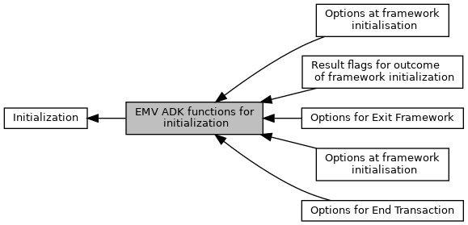
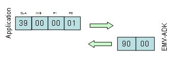
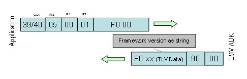

[Modules](#groups) \| [Macros](#define-members) \| [Functions](#func-members)

Collaboration diagram for EMV ADK functions for initialization:

|  |  |
|----|----|
| Modules |  |
|   | <a href="group___e_x_i_t___f_w___o_p_t_i_o_n_s.md">Options for Exit Framework</a> |
|   | Meaning of <a href="group___v_e_r_i___p_r_i_m___t_a_g_s__3_b_y_t_e.md#ga7809d602c4a9b6f1d35eac38754011fc">TAG_DF8F0A_EXIT_OPTIONS</a>, see also [EMV_CTLS_Exit_Framework_extended()](#ga8b752de3c5de067e225dd1f09eabdf35 "Kernel deactivation with options.")  |
|   | <a href="group___e_n_d___t_x_n___o_p_t_i_o_n_s.md">Options for End Transaction</a> |
|   | Meaning of <a href="group___v_e_r_i___p_r_i_m___t_a_g_s__3_b_y_t_e.md#ga7809d602c4a9b6f1d35eac38754011fc">TAG_DF8F0A_EXIT_OPTIONS</a>, see also <a href="group___f_u_n_c___f_l_o_w.md#gaa7aed3c7f0c3ac0f26cc46efff422dd9">EMV_CTLS_EndTransaction()</a>  |
|   | <a href="group___c_l_i_n_i_t___o_p_t_i_o_n_s.md">Options at framework initialisation</a> |
|   | Flags used in [EMV_CTLS_Init_Framework](#ga63240773908b46180eeec866ef33f93f).  |
|   | <a href="group___c_l_i_n_i_t___r_e_s_u_l_t___f_l_a_g_s.md">Result flags for outcome of framework initialization</a> |
|   | Flags used in [EMV_CTLS_Init_Framework](#ga63240773908b46180eeec866ef33f93f).  |
|   | <a href="group___c_t_i_n_i_t___o_p_t_i_o_n_s.md">Options at framework initialisation</a> |
|   | Flags used in parameter `options` in [EMV_CT_Init_Framework](#ga514e39585c5a6b79632ac317593ff592).  |

|  |  |
|----|----|
| Macros |  |
| #define  | [EMV_CTLS_Init_Framework](#ga63240773908b46180eeec866ef33f93f)(numberOfAIDs, EMV_Callback, externalData, options, ulResult)   <a href="_e_m_v___c_t_l_s___interface_8h.md#ac4ae1d801145cc64eec121700a8929ae">EMV_CTLS_Init_Framework_Client</a>(EMV_CTLS_FRAMEWORK_VERSION, (numberOfAIDs), (EMV_Callback), (externalData), (options),(ulResult)) |
|   | Initialize EMV ADK. [More\...](#ga63240773908b46180eeec866ef33f93f)  |
| #define  | [EMV_CT_Init_Framework](#ga514e39585c5a6b79632ac317593ff592)(numberOfAIDs, EMV_Callback, externalData, options)   <a href="_e_m_v___c_t___interface_8h.md#aa32731a2b868db59639385b8853170e4">EMV_CT_Init_Framework_Client</a>(EMV_CT_FRAMEWORK_VERSION, (numberOfAIDs), (EMV_Callback), (externalData), (options)) |
|   | Initialize EMV ADK. [More\...](#ga514e39585c5a6b79632ac317593ff592)  |

|  |  |
|----|----|
| Functions |  |
| <a href="_e_m_v___c_t_l_s___interface_8h.md#a0c075561565f443dd054da7871da8462">DLL_CLC</a> void  | [EMV_CTLS_Exit_Framework](#gafe86c6980355b69b6a650af0bffcb7ed) (void) |
|   | Kernel deactivation. [More\...](#gafe86c6980355b69b6a650af0bffcb7ed)  |
| <a href="_e_m_v___c_t_l_s___interface_8h.md#a0c075561565f443dd054da7871da8462">DLL_CLC</a> void  | [EMV_CTLS_Exit_Framework_extended](#ga8b752de3c5de067e225dd1f09eabdf35) (unsigned char options) |
|   | Kernel deactivation with options. [More\...](#ga8b752de3c5de067e225dd1f09eabdf35)  |
| const <a href="_e_m_v___c_t_l_s___interface_8h.md#a0c075561565f443dd054da7871da8462">DLL_CLC</a> char \*  | [EMV_CTLS_CLIENT_GetVersion](#gad8b44045043e962fcd25a669f4a817eb) (void) |
|   | Get contactless client version. [More\...](#gad8b44045043e962fcd25a669f4a817eb)  |
| const <a href="_e_m_v___c_t_l_s___interface_8h.md#a0c075561565f443dd054da7871da8462">DLL_CLC</a> char \*  | [EMV_CTLS_FRAMEWORK_GetVersion](#ga986ef3db0e4168cb9dc3868b06cea0d5) (void) |
|   | Get contactless framework version. [More\...](#ga986ef3db0e4168cb9dc3868b06cea0d5)  |
| <a href="_e_m_v___c_t___interface_8h.md#aba0ead6baeabe51c5f4fe870feb9ec16">DLL_CTC</a> void  | [EMV_CT_Exit_Framework](#gaad2d6cdd1249528199d5dc969e48b43c) (void) |
|   | Kernel deactivation. [More\...](#gaad2d6cdd1249528199d5dc969e48b43c)  |
| <a href="_e_m_v___c_t___interface_8h.md#aba0ead6baeabe51c5f4fe870feb9ec16">DLL_CTC</a> void  | [EMV_CT_Exit_Framework_extended](#ga151d98c3faeb382103f4bd9ae6b5b708) (unsigned char options) |
|   | Kernel deactivation. [More\...](#ga151d98c3faeb382103f4bd9ae6b5b708)  |
| const <a href="_e_m_v___c_t___interface_8h.md#aba0ead6baeabe51c5f4fe870feb9ec16">DLL_CTC</a> char \*  | [EMV_CT_CLIENT_GetVersion](#ga732afcde31cd447a8221c0d19a1463b3) (void) |
|   | Get contact client version. [More\...](#ga732afcde31cd447a8221c0d19a1463b3)  |
| const <a href="_e_m_v___c_t___interface_8h.md#aba0ead6baeabe51c5f4fe870feb9ec16">DLL_CTC</a> char \*  | [EMV_CT_FRAMEWORK_GetVersion](#ga36754df7722826d8264b5a00f7455312) (void) |
|   | Get contact framework version. [More\...](#ga36754df7722826d8264b5a00f7455312)  |

## DetailedDescription {#detailed-description}

## MacroDefinition Documentation {#macro-definition-documentation}

## EMV_CT_Init_Framework 

#define EMV_CT_Init_Framework

Initialize EMV ADK.

Explanation in programmers guide: <a href="pg_emv_contact_users_guide.md#anchor_emv_ct_initialize_emv_framework">Initialize EMV Framework</a>

Transport tags used for serialization: <a href="group___a_d_k___t_r_a_n_s_p_o_r_t___t_a_g_s.md#ga7ca54f43b657f0cc8b1ad98ecf60491f">CLA_EMV</a> <a href="group___a_d_k___t_r_a_n_s_p_o_r_t___t_a_g_s.md#gaffb63d3b2d98277221a603a0a6c48fff">INS_INIT</a> <a href="group___a_d_k___t_r_a_n_s_p_o_r_t___t_a_g_s.md#gaf0ba91f2a3df6af70463601679417fd4">P2_SET</a>

### Author

GSS R&D Germany

**Parameters**

\[in\] **numberOfAIDs** Number of AIDsDefault: EMV_ADK_DEFAULT_AIDSUPP, max.: EMV_ADK_LIMIT_AIDSUPPTLV tag: TAG_DF3B_PARAMETER_1 \[in\] **EMV_Callback** Function pointer for callback (see EMV_CT_CALLBACK_FnT)Not serialized to TLV interface. \[in\] **externalData** Application data pointer, is transmitted unchanged to callback function EMV_CT_CALLBACK_FnTNot serialized to TLV interface. \[in\] **options** Flags for framework initialisation, allowed values see Options at framework initialisationTLV tag: TAG_DF3C_PARAMETER_2

### Returns

<a href="group___a_d_k___r_e_t___c_o_d_e.md#ga1456bb13b42906927f8a8942169b62e7">EMV_ADK_OK</a>`:` success
<a href="group___a_d_k___r_e_t___c_o_d_e.md#gab0e8158b5e7019f0da44c5cbc37bae3d">EMV_ADK_INTERNAL</a>`:` internal communication problem, illegal file content, memory allocation
<a href="group___a_d_k___r_e_t___c_o_d_e.md#ga89c11346e5e636e7c9d42c6a772674bf">EMV_ADK_PARAM</a>`:` interface version mismatch or buffer overflow
<a href="group___a_d_k___r_e_t___c_o_d_e.md#ga4837e54c589150debdef49afb8f9b5db">EMV_ADK_TLV_BUILD_ERR</a>`:` TLV processing problem
<a href="group___a_d_k___r_e_t___c_o_d_e.md#ga3a1d800696b9d7a86c0e39068d3fde57">EMV_ADK_NOT_ALLOWED</a>`:` concurrent call or not allowed within callback

## EMV_CTLS_Init_Framework 

#define EMV_CTLS_Init_Framework

Initialize EMV ADK.

Transport tags used in serialization: <a href="group___a_d_k___t_r_a_n_s_p_o_r_t___t_a_g_s.md#ga7ca54f43b657f0cc8b1ad98ecf60491f">CLA_EMV</a> <a href="group___a_d_k___t_r_a_n_s_p_o_r_t___t_a_g_s.md#gaffb63d3b2d98277221a603a0a6c48fff">INS_INIT</a> <a href="group___a_d_k___t_r_a_n_s_p_o_r_t___t_a_g_s.md#gaf0ba91f2a3df6af70463601679417fd4">P2_SET</a>

<a href="pg_emv_contactless_users_guide.md#anchor_emv_ctls_initialize_ctls_emv_framework">Explanation in programmers guide</a>

### Author

GSS R&D Germany

**Parameters**

\[in\] **numberOfAIDs** \... number of AIDsTLV tag TAG_DF3B_PARAMETER_1 \[in\] **EMV_Callback** \... function pointer for callback (see EMV_CTLS_CALLBACK_FnT)no TLV tag, because it\'s not serialized \[in\] **externalData** \... Application data pointer, is transmitted unchanged to callback function EMV_CTLS_CALLBACK_FnTno TLV tag, because it\'s not serialized \[in\] **options** \... flags for framework initialisation, allowed values see Options at framework initialisationTLV tag TAG_DF3C_PARAMETER_2 \[out\] **ulResult** \... bitstring with information flags about the outcome, see Result flags for outcome of framework initializationTLV tag TAG_DF8F0C_INIT_RESULT_FLAGS. Can be NULL.

### Returns

<a href="group___a_d_k___r_e_t___c_o_d_e.md#ga1456bb13b42906927f8a8942169b62e7">EMV_ADK_OK</a>: success
<a href="group___a_d_k___r_e_t___c_o_d_e.md#ga89c11346e5e636e7c9d42c6a772674bf">EMV_ADK_PARAM</a>: interface version mismatch
<a href="group___a_d_k___r_e_t___c_o_d_e.md#gab0e8158b5e7019f0da44c5cbc37bae3d">EMV_ADK_INTERNAL</a>: internal communication problem, illegal file content, memory allocation
<a href="group___a_d_k___r_e_t___c_o_d_e.md#ga4837e54c589150debdef49afb8f9b5db">EMV_ADK_TLV_BUILD_ERR</a> TLV: processing problem
<a href="group___a_d_k___r_e_t___c_o_d_e.md#ga3a1d800696b9d7a86c0e39068d3fde57">EMV_ADK_NOT_ALLOWED</a>: concurrent call or not allowed within callback
<a href="group___a_d_k___r_e_t___c_o_d_e.md#ga4ea6891b4dd6c0d8d8703b8654453cbf">EMV_ADK_CTLS_NOT_AVAILABLE</a>: CTLS not present on terminal
<a href="group___a_d_k___r_e_t___c_o_d_e.md#ga7045deba09a19eea4f7df8881a08b807">EMV_ADK_ABORT</a>: insufficient memory to allocate main ADK context
<a href="group___a_d_k___r_e_t___c_o_d_e.md#ga7ffea44a30b0451d393487eae4035b4e">EMV_ADK_NO_EXEC</a>: insufficient memory to allocate other internal structs or empty desired/allowed kernel list
<a href="group___a_d_k___r_e_t___c_o_d_e.md#ga19d5dde29e85ada4f706ca65644df705">EMV_ADK_SAVE_ERROR</a>: TermData/AppliData/CapKeys/Hotlist/VirtTermMap file persistence problem
<a href="group___a_d_k___r_e_t___c_o_d_e.md#gaa385b17c04a9c6bbc0093a7ccfc3b11a">EMV_ADK_READ_ERROR</a>: TermData/AppliData/CapKeys/Hotlist/VirtTermMap or emv desired/allowed file corruption

## FunctionDocumentation {#function-documentation}

## EMV_CT_CLIENT_GetVersion() 

const <a href="_e_m_v___c_t___interface_8h.md#aba0ead6baeabe51c5f4fe870feb9ec16">DLL_CTC</a> char\* EMV_CT_CLIENT_GetVersion

Get contact client version.

### Author

GSS R&D Germany

### Returns

Client version as zero-terminated C-String

## EMV_CT_Exit_Framework() 

<a href="_e_m_v___c_t___interface_8h.md#aba0ead6baeabe51c5f4fe870feb9ec16">DLL_CTC</a> void EMV_CT_Exit_Framework

Kernel deactivation.

Explanation in programmers guide: <a href="pg_emv_contact_users_guide.md#anchor_emv_ct_initialize_emv_framework">Initialize EMV Framework</a>

### Author

GSS R&D Germany

**Serialization:**

Class: <a href="group___a_d_k___t_r_a_n_s_p_o_r_t___t_a_g_s.md#ga7ca54f43b657f0cc8b1ad98ecf60491f">CLA_EMV</a>, Instruction: <a href="group___a_d_k___t_r_a_n_s_p_o_r_t___t_a_g_s.md#gaffb63d3b2d98277221a603a0a6c48fff">INS_INIT</a>, P2: <a href="group___a_d_k___t_r_a_n_s_p_o_r_t___t_a_g_s.md#ga2a2911f7e67d626c4c5f4ec1bd69dff6">P2_GET</a>

## EMV_CT_Exit_Framework_extended() 

<a href="_e_m_v___c_t___interface_8h.md#aba0ead6baeabe51c5f4fe870feb9ec16">DLL_CTC</a> void EMV_CT_Exit_Framework_extended

Kernel deactivation.

Explanation in programmers guide: <a href="pg_emv_contact_users_guide.md#anchor_emv_ct_initialize_emv_framework">Initialize EMV Framework</a>

### Author

GSS R&D Germany

**Parameters**

\[in\] **options** Bitset of Options for Exit FrameworkTLV tag TAG_DF8F0A_EXIT_OPTIONS

**Serialization:**

Class: <a href="group___a_d_k___t_r_a_n_s_p_o_r_t___t_a_g_s.md#ga7ca54f43b657f0cc8b1ad98ecf60491f">CLA_EMV</a>, Instruction: <a href="group___a_d_k___t_r_a_n_s_p_o_r_t___t_a_g_s.md#gaffb63d3b2d98277221a603a0a6c48fff">INS_INIT</a>, P2: <a href="group___a_d_k___t_r_a_n_s_p_o_r_t___t_a_g_s.md#ga2a2911f7e67d626c4c5f4ec1bd69dff6">P2_GET</a>

## EMV_CT_FRAMEWORK_GetVersion() 

const <a href="_e_m_v___c_t___interface_8h.md#aba0ead6baeabe51c5f4fe870feb9ec16">DLL_CTC</a> char\* EMV_CT_FRAMEWORK_GetVersion

Get contact framework version.

### Author

GSS R&D Germany

### Returns

Framework version as zero-terminated C-String
TLV tag: <a href="group___v_e_r_i___p_r_i_m___t_a_g_s.md#ga6f8f8ac35965ec091b3d1a3f4a4efe8d">TAG_DF11_LIB_VERSION</a>

**Serialization:**

Class: <a href="group___a_d_k___t_r_a_n_s_p_o_r_t___t_a_g_s.md#ga7ca54f43b657f0cc8b1ad98ecf60491f">CLA_EMV</a>, Instruction: <a href="group___a_d_k___t_r_a_n_s_p_o_r_t___t_a_g_s.md#ga45cf078d40876821a8c2d6c997b117e7">INS_GET_VER</a>, P2: <a href="group___a_d_k___t_r_a_n_s_p_o_r_t___t_a_g_s.md#ga2a2911f7e67d626c4c5f4ec1bd69dff6">P2_GET</a>

## EMV_CTLS_CLIENT_GetVersion() 

const <a href="_e_m_v___c_t_l_s___interface_8h.md#a0c075561565f443dd054da7871da8462">DLL_CLC</a> char\* EMV_CTLS_CLIENT_GetVersion

Get contactless client version.

### Author

GSS R&D Germany

### Returns

Client version as C-string

## EMV_CTLS_Exit_Framework() 

<a href="_e_m_v___c_t_l_s___interface_8h.md#a0c075561565f443dd054da7871da8462">DLL_CLC</a> void EMV_CTLS_Exit_Framework

Kernel deactivation.

Transport tags used in serialization: <a href="group___a_d_k___t_r_a_n_s_p_o_r_t___t_a_g_s.md#ga7ca54f43b657f0cc8b1ad98ecf60491f">CLA_EMV</a> <a href="group___a_d_k___t_r_a_n_s_p_o_r_t___t_a_g_s.md#gaffb63d3b2d98277221a603a0a6c48fff">INS_INIT</a> <a href="group___a_d_k___t_r_a_n_s_p_o_r_t___t_a_g_s.md#ga2a2911f7e67d626c4c5f4ec1bd69dff6">P2_GET</a>

<a href="pg_emv_contactless_users_guide.md#anchor_emv_ctls_initialize_ctls_emv_framework">Explanation in programmers guide</a>

### Author

GSS R&D Germany


this function calls [EMV_CTLS_Exit_Framework_extended](#ga8b752de3c5de067e225dd1f09eabdf35 "Kernel deactivation with options.") (0)


## EMV_CTLS_Exit_Framework_extended() 

<a href="_e_m_v___c_t_l_s___interface_8h.md#a0c075561565f443dd054da7871da8462">DLL_CLC</a> void EMV_CTLS_Exit_Framework_extended

Kernel deactivation with options.

Transport tags used in serialization: <a href="group___a_d_k___t_r_a_n_s_p_o_r_t___t_a_g_s.md#ga7ca54f43b657f0cc8b1ad98ecf60491f">CLA_EMV</a> <a href="group___a_d_k___t_r_a_n_s_p_o_r_t___t_a_g_s.md#gaffb63d3b2d98277221a603a0a6c48fff">INS_INIT</a> <a href="group___a_d_k___t_r_a_n_s_p_o_r_t___t_a_g_s.md#ga2a2911f7e67d626c4c5f4ec1bd69dff6">P2_GET</a>

### Author

GSS R&D Germany

**Parameters**

\[in\] **options** Bitset of Options for Exit Framework

## EMV_CTLS_FRAMEWORK_GetVersion() 

const <a href="_e_m_v___c_t_l_s___interface_8h.md#a0c075561565f443dd054da7871da8462">DLL_CLC</a> char\* EMV_CTLS_FRAMEWORK_GetVersion

Get contactless framework version.

### Author

GSS R&D Germany

**Serialization:**

Class: <a href="group___a_d_k___t_r_a_n_s_p_o_r_t___t_a_g_s.md#ga7ca54f43b657f0cc8b1ad98ecf60491f">CLA_EMV</a>, Instruction: <a href="group___a_d_k___t_r_a_n_s_p_o_r_t___t_a_g_s.md#ga45cf078d40876821a8c2d6c997b117e7">INS_GET_VER</a>, P2: <a href="group___a_d_k___t_r_a_n_s_p_o_r_t___t_a_g_s.md#ga2a2911f7e67d626c4c5f4ec1bd69dff6">P2_GET</a>

### Returns

Framework version as C-string
