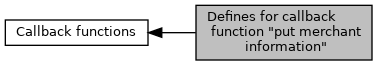

[Macros](#define-members) \| [Typedefs](#typedef-members)

In order to show the merchant additional information on a system with two displays, \'information flashes\' can be sent to the terminal during payment processing. This allows the merchant to alert the customer to confirming the amount or entering the PIN as required.
see <a href="adk__emv__contactless__programmers__guide_8dox.md#a591fd0f380cd390007ce78b47be923c4">EMV_CT_CALLBACK_FnT</a> (<a href="group___c_b_c_k___f_c_t___t_a_g_s.md#gaf8eeceb6363ca4e9b124d67334c09f57">TAG_BF01_CBK_MERCHINFO</a>) [More\...](#details)

Collaboration diagram for Defines for callback function \"put merchant information\":

|  |  |
|----|----|
| Macros |  |
| #define  | [eEMVMerCustSelApp](#ga92a91480d386cbc459c1b0a9d5efa3c8)   0 |
|   | Customer has to select Application, not used anymore. [More\...](#ga92a91480d386cbc459c1b0a9d5efa3c8)  |
| #define  | [eEMVMerConfAmount](#ga2b7628c4331907741bd44b67ccbaae1a)   1 |
|   | Customer has to confirm amount. [More\...](#ga2b7628c4331907741bd44b67ccbaae1a)  |
| #define  | [eEMVMerCrdhldVerif](#gab3fd51c1cb0ca797580f6635ef44276b)   2 |
|   | EMV step \"Cardholder Verification\" will be started. [More\...](#gab3fd51c1cb0ca797580f6635ef44276b)  |
| #define  | [eEMVMerReadAppData](#ga322e5af777fcd826a43cabd502877e16)   3 |
|   | EMV step \"Read Application Data\" will be started. [More\...](#ga322e5af777fcd826a43cabd502877e16)  |
| #define  | [eEMVMerOffAuth](#ga4d213be2d5a688d4b3f3b692bedf190f)   4 |
|   | EMV step \"Offline Data Authentication\" will be started. [More\...](#ga4d213be2d5a688d4b3f3b692bedf190f)  |
| #define  | [eEMVMer1stGAC](#gaaa61dde998d29bce6435f852f3a7ec8d)   5 |
|   | 1st GENERATE AC will be done [More\...](#gaaa61dde998d29bce6435f852f3a7ec8d)  |
| #define  | [eEMVMer2ndGAC](#gafb62897461019543202defbd3d4231fa)   6 |
|   | 2nd GENERATE AC will be done [More\...](#gafb62897461019543202defbd3d4231fa)  |
| #define  | [eEMVMerSelect](#ga1b3bb8258a238ebfdc06b165e68fd132)   7 |
|   | \"Application Selection\" is finished [More\...](#ga1b3bb8258a238ebfdc06b165e68fd132)  |
| #define  | [eEMVMerPINProgress](#ga21f052d4ba0f1a5b292331ae1f4d4d5b)   8 |
|   | Input of PIN in progress, not used anymore. [More\...](#ga21f052d4ba0f1a5b292331ae1f4d4d5b)  |
| #define  | [eEMVMerCustConf](#gaa9cbf421a5e8ac4216da4f49dd654dcc)   9 |
|   | Wait for customer confirmation, not used anymore. [More\...](#gaa9cbf421a5e8ac4216da4f49dd654dcc)  |
| #define  | [eEMVMerPINInput](#gab830a7d247d68d0e32880edf1b16e08d)   10 |
|   | Customer is asked for PIN entry. [More\...](#gab830a7d247d68d0e32880edf1b16e08d)  |
| #define  | [eEMVMerLangSelect](#ga75b0cf1ca7dd63d1449948e789163cd7)   11 |
|   | Customer has to select language. [More\...](#ga75b0cf1ca7dd63d1449948e789163cd7)  |
| #define  | [eEMVMerCustLang](#ga7a0c0b31ef3ae1cb505123478b7a5f9b)   0x80 |
|   | customer language selected = 0x80 + language ID (e.g. EMV_LANG_ITALIAN) [More\...](#ga7a0c0b31ef3ae1cb505123478b7a5f9b)  |

|  |  |
|----|----|
| Typedefs |  |
| typedef unsigned char  | [EMV_ADK_MerchantInfo](#ga148ac478aee8b4d199c94f412b67875a) |

## DetailedDescription {#detailed-description}

In order to show the merchant additional information on a system with two displays, \'information flashes\' can be sent to the terminal during payment processing. This allows the merchant to alert the customer to confirming the amount or entering the PIN as required.
see <a href="adk__emv__contactless__programmers__guide_8dox.md#a591fd0f380cd390007ce78b47be923c4">EMV_CT_CALLBACK_FnT</a> (<a href="group___c_b_c_k___f_c_t___t_a_g_s.md#gaf8eeceb6363ca4e9b124d67334c09f57">TAG_BF01_CBK_MERCHINFO</a>)

## MacroDefinition Documentation {#macro-definition-documentation}

## eEMVMer1stGAC 

#define eEMVMer1stGAC   5

1st GENERATE AC will be done

## eEMVMer2ndGAC 

#define eEMVMer2ndGAC   6

2nd GENERATE AC will be done

## eEMVMerConfAmount 

#define eEMVMerConfAmount   1

Customer has to confirm amount.

## eEMVMerCrdhldVerif 

#define eEMVMerCrdhldVerif   2

EMV step \"Cardholder Verification\" will be started.

## eEMVMerCustConf 

#define eEMVMerCustConf   9

Wait for customer confirmation, not used anymore.

## eEMVMerCustLang 

#define eEMVMerCustLang   0x80

customer language selected = 0x80 + language ID (e.g. EMV_LANG_ITALIAN)

## eEMVMerCustSelApp 

#define eEMVMerCustSelApp   0

Customer has to select Application, not used anymore.

## eEMVMerLangSelect 

#define eEMVMerLangSelect   11

Customer has to select language.

## eEMVMerOffAuth 

#define eEMVMerOffAuth   4

EMV step \"Offline Data Authentication\" will be started.

## eEMVMerPINInput 

#define eEMVMerPINInput   10

Customer is asked for PIN entry.

## eEMVMerPINProgress 

#define eEMVMerPINProgress   8

Input of PIN in progress, not used anymore.

## eEMVMerReadAppData 

#define eEMVMerReadAppData   3

EMV step \"Read Application Data\" will be started.

## eEMVMerSelect 

#define eEMVMerSelect   7

\"Application Selection\" is finished

## TypedefDocumentation {#typedef-documentation}

## EMV_ADK_MerchantInfo 

typedef unsigned char [EMV_ADK_MerchantInfo](#ga148ac478aee8b4d199c94f412b67875a)

