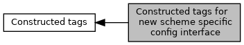

[Macros](#define-members)

Collaboration diagram for Constructed tags for new scheme specific config interface:

|  |  |
|----|----|
| Macros |  |
| #define  | [TAG_FFAB01_DRL_PARAMETER](#ga6da72379bdf0faa5dfcec68ec4dd4510)   0xFFAB01 |

## DetailedDescription {#detailed-description}

Used in functions <a href="group___f_u_n_c___c_o_n_f.md#gadc7f2eba5fd3e941d0ddb65a936a0776">EMV_CTLS_SetAppliDataSchemeSpecific()</a>/EMV_CTLS_GetAppliDataSchemeSpecific

## MacroDefinition Documentation {#macro-definition-documentation}

## TAG_FFAB01_DRL_PARAMETER 

#define TAG_FFAB01_DRL_PARAMETER   0xFFAB01

