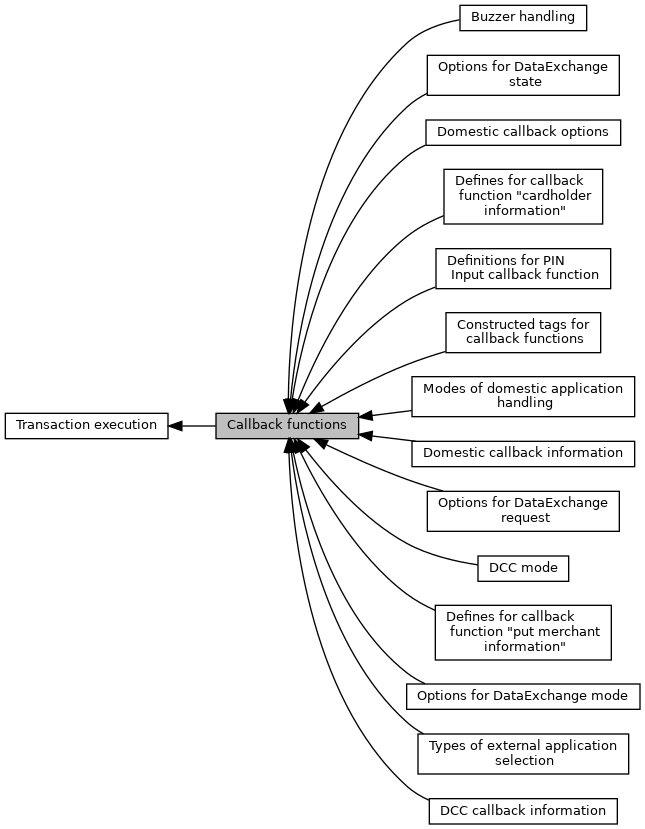

[Modules](#groups) \| [Macros](#define-members) \| [Typedefs](#typedef-members)

Callback function to be implemented in the same entity as EMV ADK. [More\...](#details)

Collaboration diagram for Callback functions:

|  |  |
|----|----|
| Modules |  |
|   | <a href="group___c_b_c_k___d_e___r_e_q_u_e_s_t.md">Options for DataExchange request</a> |
|   | Used in [EMV_CTLS_CALLBACK_FnT](#ga6557e914101768d67635ca44e54362ab), <a href="group___c_b_c_k___f_c_t___t_a_g_s.md#ga32719fcef354a44723c8b6561716f5bd">TAG_BF0E_CBK_DATA_EXCHANGE</a>, <a href="group___t_l_v___c_b_c_k.md#ga39a89f82a43d278d55f4a30ef988428d">TAG_DF8F58_DE_REQUEST</a>.  |
|   | <a href="group___c_b_c_k___d_e___s_t_a_t_e.md">Options for DataExchange state</a> |
|   | Used in [EMV_CTLS_CALLBACK_FnT](#ga6557e914101768d67635ca44e54362ab), <a href="group___c_b_c_k___f_c_t___t_a_g_s.md#ga32719fcef354a44723c8b6561716f5bd">TAG_BF0E_CBK_DATA_EXCHANGE</a>, <a href="group___t_l_v___c_b_c_k.md#ga350252d0754af29e65491c61efafd681">TAG_DF8F59_DE_STATE</a>.  |
|   | <a href="group___c_b_c_k___d_e___m_o_d_e.md">Options for DataExchange mode</a> |
|   | Used in [EMV_CTLS_CALLBACK_FnT](#ga6557e914101768d67635ca44e54362ab), <a href="group___c_b_c_k___f_c_t___t_a_g_s.md#ga32719fcef354a44723c8b6561716f5bd">TAG_BF0E_CBK_DATA_EXCHANGE</a>, <a href="group___t_l_v___c_b_c_k.md#gaa5adbd002c7e040e248be3fb7fe7f5ad">TAG_DF8F5A_DE_MODE</a>.  |
|   | <a href="group___c_b_c_k___f_c_t___t_a_g_s.md">Constructed tags for callback functions</a> |
|   | Used in [EMV_CTLS_CALLBACK_FnT](#ga6557e914101768d67635ca44e54362ab).  |
|   | <a href="group___a_d_k___b_u_z_z_e_r.md">Buzzer handling</a> |
|   | Defines given in callback <a href="group___c_b_c_k___f_c_t___t_a_g_s.md#ga805fd29bb45bbc706fefd6533ee3c69f">TAG_BF19_CTLS_CBK_BEEP</a>.  |
|   | <a href="group___a_d_k___p_i_n___p_a_r_a_m.md">Definitions for PIN Input callback function</a> |
|   | See <a href="adk__emv__contactless__programmers__guide_8dox.md#a591fd0f380cd390007ce78b47be923c4">EMV_CT_CALLBACK_FnT</a> (<a href="group___c_b_c_k___f_c_t___t_a_g_s.md#gadc9d6fed84456455586fb621722ae922">TAG_BF08_CBK_PIN</a>)  |
|   | <a href="group___d_c_c___m_o_d_e.md">DCC mode</a> |
|   | Used to carry decision given back by <a href="adk__emv__contactless__programmers__guide_8dox.md#a591fd0f380cd390007ce78b47be923c4">EMV_CT_CALLBACK_FnT</a> (<a href="adk__emv__contactless__programmers__guide_8dox.md#af335a870e9d2f299c848f76b843907f7">TAG_BF07_CBK_DCC</a>) TLV tag <a href="group___t_l_v___c_b_c_k___t_l_v.md#ga866150b1aa87d89f0783c4dd4eeb3d59">TAG_DF7D_CBK_DCC_CHECK</a>.  |
|   | <a href="group___m_e_r_c_h___i_n_f_o.md">Defines for callback function "put merchant information"</a> |
|   | In order to show the merchant additional information on a system with two displays, \'information flashes\' can be sent to the terminal during payment processing. This allows the merchant to alert the customer to confirming the amount or entering the PIN as required. see <a href="adk__emv__contactless__programmers__guide_8dox.md#a591fd0f380cd390007ce78b47be923c4">EMV_CT_CALLBACK_FnT</a> (<a href="group___c_b_c_k___f_c_t___t_a_g_s.md#gaf8eeceb6363ca4e9b124d67334c09f57">TAG_BF01_CBK_MERCHINFO</a>)  |
|   | <a href="group___c_a_r_d_h_o_l_d_e_r___i_n_f_o.md">Defines for callback function "cardholder information"</a> |
|   | In order to show the cardholder additional information, e.g. wrong PIN, last PIN try, another app is selected, \... see <a href="adk__emv__contactless__programmers__guide_8dox.md#a591fd0f380cd390007ce78b47be923c4">EMV_CT_CALLBACK_FnT</a> (<a href="group___c_b_c_k___f_c_t___t_a_g_s.md#ga03bf78609c19ba9c07772fcd74d8c1f1">TAG_BF09_CBK_CARDHOLDERINFO</a>)  |
|   | <a href="group___d_e_f___c_b_k___s_e_l.md">Types of external application selection</a> |
|   | Used as input for callback function \"Application Selection\" \--\> ReduceCandidateList() (`ucSelector`).  |
|   | <a href="group___d_e_f___c_b_k___d_o_m_a_p_p.md">Modes of domestic application handling</a> |
|   | Used as return <a href="group___t_l_v___c_b_c_k___t_l_v.md#gaa554c75ed30b7eeb73ff2a981b8878eb">TAG_DF7E_CBK_DOM_APP_RES</a> for <a href="adk__emv__contactless__programmers__guide_8dox.md#a591fd0f380cd390007ce78b47be923c4">EMV_CT_CALLBACK_FnT</a> <a href="adk__emv__contactless__programmers__guide_8dox.md#afd0adcc12331559863dd65d8f7558645">TAG_BF05_CBK_DOM_APPS</a>.  |
|   | <a href="group___c_b_c_k___d_o_m___o_p_t_i_o_n.md">Domestic callback options</a> |
|   | Calling application may set some options for further transaction processing.  |
|   | <a href="group___c_b_c_k___d_o_m___i_n_f_o.md">Domestic callback information</a> |
|   | Information flags for <a href="group___v_e_r_i___p_r_i_m___t_a_g_s.md#ga8f31676739de9253f1192a44eadaa19a">TAG_DF5C_DOM_INFO</a> in <a href="adk__emv__contactless__programmers__guide_8dox.md#a591fd0f380cd390007ce78b47be923c4">EMV_CT_CALLBACK_FnT</a> (<a href="adk__emv__contactless__programmers__guide_8dox.md#ac82fa7e4064512e71e63fd647b817d97">TAG_BF06_CBK_LOCAL_CHECKS</a>)  |
|   | <a href="group___c_b_c_k___d_c_c___i_n_f_o.md">DCC callback information</a> |
|   | Information flags for calling application.  |

|  |  |
|----|----|
| Macros |  |
| #define  | [EMV_CTLS_CALLBACK_STACK_SIZE](#gab83b6cd59e38e79162f08a0b1628935d)   0xC000 |

|  |  |
|----|----|
| Typedefs |  |
| typedef void()  | [EMV_CTLS_CALLBACK_Func](#ga8099f858729a6abaca5890d8631d547a)(unsigned char \*pucSend, unsigned short sSendSize, unsigned char \*pucReceive, unsigned short \*psReceiveSize, void \*externalData) |
|   | Common callback function: send/receive TLV stream to/from calling application. [More\...](#ga8099f858729a6abaca5890d8631d547a)  |
| typedef [EMV_CTLS_CALLBACK_Func](#ga8099f858729a6abaca5890d8631d547a) \*  | [EMV_CTLS_CALLBACK_FnT](#ga6557e914101768d67635ca44e54362ab) |
|   | pointer to [EMV_CTLS_CALLBACK_Func](#ga8099f858729a6abaca5890d8631d547a "Common callback function: send/receive TLV stream to/from calling application.") [More\...](#ga6557e914101768d67635ca44e54362ab)  |
| typedef void(\*  | [EMV_CT_CALLBACK_FnT](#ga3ff52ae040bd291d348e505e057f02ef)) (unsigned char \*pucSend, unsigned short sSendSize, unsigned char \*pucReceive, unsigned short \*psReceiveSize, void \*externalData) |
|   | Common callback function: send/receive TLV stream to/from calling application. [More\...](#ga3ff52ae040bd291d348e505e057f02ef)  |

## DetailedDescription {#detailed-description}

Callback function to be implemented in the same entity as EMV ADK.

## MacroDefinition Documentation {#macro-definition-documentation}

## EMV_CTLS_CALLBACK_STACK_SIZE 

#define EMV_CTLS_CALLBACK_STACK_SIZE   0xC000

**<a href="deprecated.md#_deprecated000070">Deprecated:</a>** avaiable stack-size in [EMV_CTLS_CALLBACK_Func](#ga8099f858729a6abaca5890d8631d547a "Common callback function: send/receive TLV stream to/from calling application.") (verix-only)

## TypedefDocumentation {#typedef-documentation}

## EMV_CT_CALLBACK_FnT 

typedef void(\* EMV_CT_CALLBACK_FnT) (unsigned char \*pucSend, unsigned short sSendSize, unsigned char \*pucReceive, unsigned short \*psReceiveSize, void \*externalData)

Common callback function: send/receive TLV stream to/from calling application.

Explanation in programmers guide: <a href="pg_emv_contact_users_guide.md#subsubsec_emv_ct_transaction_callback_command">Transaction Callbacks</a>

### Author

GSS R&D Germany

Tags for transport layer:

- Callback function request: ` 91 01 ` (<a href="group___a_d_k___t_r_a_n_s_p_o_r_t___t_a_g_s.md#ga975cd4206f0b6b238b340178ad792c78">EMV_CT_CLA_CBCK_REQ</a>, <a href="group___a_d_k___t_r_a_n_s_p_o_r_t___t_a_g_s.md#gace07d6cfd34efe7b0e594324c4e1b303">INS_CBCK_FCT</a>)
- Data for card reader: ` 91 02 ` (<a href="group___a_d_k___t_r_a_n_s_p_o_r_t___t_a_g_s.md#ga975cd4206f0b6b238b340178ad792c78">EMV_CT_CLA_CBCK_REQ</a>, <a href="group___a_d_k___t_r_a_n_s_p_o_r_t___t_a_g_s.md#gac530d3a642a780e6430f2a9fd1f57dce">INS_CBCK_CRD</a>)
- Trace output: ` 91 FF ` (<a href="group___a_d_k___t_r_a_n_s_p_o_r_t___t_a_g_s.md#ga975cd4206f0b6b238b340178ad792c78">EMV_CT_CLA_CBCK_REQ</a>, <a href="group___a_d_k___t_r_a_n_s_p_o_r_t___t_a_g_s.md#gacf7e3a366c458c27e002776330e84cbb">INS_CBCK_TRACE</a>)
- Response: ` 92 ` (<a href="group___a_d_k___t_r_a_n_s_p_o_r_t___t_a_g_s.md#ga0fe23ca596d2bf6ff3d483c6eb6a63ea">EMV_CT_CLA_CBCK_RESP</a>)

Tags found in `pucSend` determine which callback function is meant, see <a href="group___c_b_c_k___f_c_t___t_a_g_s.md">Constructed tags for callback functions</a>

**Parameters**

\[in\] **pucSend** \... TLV stream to send to calling application \[in\] **sSendSize** \... length of TLV stream to send to calling application \[out\] **pucReceive** \... TLV stream received from calling application \[in,out\] **psReceiveSize** \... input: size of buffer pucReceive points to; output: size of TLV stream received from calling application \[out\] **externalData** application data pointer, which was put in EMV_CT_Init_Framework()

## EMV_CTLS_CALLBACK_FnT 

typedef [EMV_CTLS_CALLBACK_Func](#ga8099f858729a6abaca5890d8631d547a)\* [EMV_CTLS_CALLBACK_FnT](#ga6557e914101768d67635ca44e54362ab)

pointer to [EMV_CTLS_CALLBACK_Func](#ga8099f858729a6abaca5890d8631d547a "Common callback function: send/receive TLV stream to/from calling application.")

## EMV_CTLS_CALLBACK_Func 

typedef void() EMV_CTLS_CALLBACK_Func(unsigned char \*pucSend, unsigned short sSendSize, unsigned char \*pucReceive, unsigned short \*psReceiveSize, void \*externalData)

Common callback function: send/receive TLV stream to/from calling application.

Tags found in `pucSend` determine which callback function is meant: <a href="group___c_b_c_k___f_c_t___t_a_g_s.md">Constructed tags for callback functions</a>

Explanation in programmers guide: <a href="pg_emv_contactless_users_guide.md#subsec_emv_ctls_transaction_callbacks">Transaction Callbacks</a>

Tags for transport layer:

- Callback function request: ` 91 01 ` (<a href="group___a_d_k___t_r_a_n_s_p_o_r_t___t_a_g_s.md#ga3824324397d1922e125aa46661a6b2ee">EMV_CTLS_CLA_CBCK_REQ</a>, <a href="group___a_d_k___t_r_a_n_s_p_o_r_t___t_a_g_s.md#gace07d6cfd34efe7b0e594324c4e1b303">INS_CBCK_FCT</a>)
- Trace output: ` 91 FF ` (<a href="group___a_d_k___t_r_a_n_s_p_o_r_t___t_a_g_s.md#ga3824324397d1922e125aa46661a6b2ee">EMV_CTLS_CLA_CBCK_REQ</a>, <a href="group___a_d_k___t_r_a_n_s_p_o_r_t___t_a_g_s.md#gacf7e3a366c458c27e002776330e84cbb">INS_CBCK_TRACE</a>)
- Response: ` 92 ` (<a href="group___a_d_k___t_r_a_n_s_p_o_r_t___t_a_g_s.md#ga01497e2819acf0fcac29d6d3e3a46956">EMV_CTLS_CLA_CBCK_RESP</a>)

**Parameters**

\[in\] **pucSend** TLV stream to send to calling application \[in\] **sSendSize** Length of TLV stream to send to calling application \[out\] **pucReceive** TLV stream received from calling application \[in,out\] **psReceiveSize** Input: size of buffer pucReceive points to; output: size of TLV stream received from calling application \[out\] **externalData** Application data pointer, which was put in EMV_CTLS_Init_Framework()
