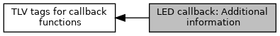

[Macros](#define-members)

Additional information for LED switching, used for <a href="group___t_l_v___c_b_c_k.md#ga49b42df1c0b4c78b9e954b1c24aa8e3d">TAG_DF8F60_LED_ADD_INFO</a>. [More\...](#details)

Collaboration diagram for LED callback: Additional information:

|  |  |
|----|----|
| Macros |  |
| #define  | [CBCK_LED_ADD_INFO_DONT_TRACE](#gacdd5936384668992cd4a8e21cd835495)   0x01 |
|   | Don\'t trace this callback in client interface trace, reason: e.g. LED blinking would fill trace buffer with needless information. [More\...](#gacdd5936384668992cd4a8e21cd835495)  |

## DetailedDescription {#detailed-description}

Additional information for LED switching, used for <a href="group___t_l_v___c_b_c_k.md#ga49b42df1c0b4c78b9e954b1c24aa8e3d">TAG_DF8F60_LED_ADD_INFO</a>.

## MacroDefinition Documentation {#macro-definition-documentation}

## CBCK_LED_ADD_INFO_DONT_TRACE 

#define CBCK_LED_ADD_INFO_DONT_TRACE   0x01

Don\'t trace this callback in client interface trace, reason: e.g. LED blinking would fill trace buffer with needless information.
