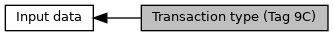

[Macros](#define-members)

According to ISO 8583 - Annex A: Processing Code, Position 1 + 2. [More\...](#details)

Collaboration diagram for Transaction type (Tag 9C):

|  |  |
|----|----|
| Macros |  |
| #define  | [EMV_ADK_TRAN_TYPE_GOODS_SERVICE](#ga9641f6f9edd014d72d3011013c9f2c1c)   0x00 |
|   | Goods and services. [More\...](#ga9641f6f9edd014d72d3011013c9f2c1c)  |
| #define  | [EMV_ADK_TRAN_TYPE_CASH](#ga07981ed86c15f8a4f97bf1ceddece20a)   0x01 |
|   | Cash advance. [More\...](#ga07981ed86c15f8a4f97bf1ceddece20a)  |
| #define  | [EMV_ADK_TRAN_TYPE_CASHBACK](#gac5f44598edf676cdfefe97189e67b043)   0x09 |
|   | Cashback (payment with cash hand out) [More\...](#gac5f44598edf676cdfefe97189e67b043)  |
| #define  | [EMV_ADK_TRAN_TYPE_VISA_QUASI_CASH](#gad2463fa57381109ecae6edecd922a8c4)   0x11 |
|   | Quasi Cash as defined by Visa, VCPS 2.2 (only output, transaction to be started as cash) [More\...](#gad2463fa57381109ecae6edecd922a8c4)  |
| #define  | [EMV_ADK_TRAN_TYPE_MANUAL_CASH](#gaaaff2a2a52533142208e47b486c962a4)   0x12 |
|   | manual cash (PP3 testcase) [More\...](#gaaaff2a2a52533142208e47b486c962a4)  |
| #define  | [EMV_ADK_TRAN_TYPE_MASTERCARD_CASH](#ga3db75cbf58899ee5f717540b65615e53)   0x17 |
|   | Cash for MasterCard (only output, transaction to be started as cash) [More\...](#ga3db75cbf58899ee5f717540b65615e53)  |
| #define  | [EMV_ADK_TRAN_TYPE_REFUND](#gaf341bd2190b00ce5ee3a8acf6d5311ab)   0x20 |
|   | Refund. [More\...](#gaf341bd2190b00ce5ee3a8acf6d5311ab)  |
| #define  | [EMV_ADK_TRAN_TYPE_AMEX_PREAUTH](#gae7c6629294ae36267bfa128f4b25b434)   0x30 |
|   | Pre-Authorization for Amex (only output) [More\...](#gae7c6629294ae36267bfa128f4b25b434)  |
| #define  | [EMV_ADK_TRAN_TYPE_INTERNAL_LIMIT](#ga1558c972336a0796488676fc4322afe5)   0x99 |
| #define  | [EMV_ADK_TRAN_TYPE_INIT_RESERVATION_A](#ga627576793b48b221be2b730980fbd249)   0xF0 |
|   | Reservation variant a (without partial reversal) [More\...](#ga627576793b48b221be2b730980fbd249)  |
| #define  | [EMV_ADK_TRAN_TYPE_INCREMENT_A](#gae4dfcb64069c00ea212290887d63d39b)   0xF1 |
|   | Reservation increment variant a. [More\...](#gae4dfcb64069c00ea212290887d63d39b)  |
| #define  | [EMV_ADK_TRAN_TYPE_ERHOEHUNG_A](#ga59de01a90c7963b985a913853e5279e8)   [EMV_ADK_TRAN_TYPE_INCREMENT_A](#gae4dfcb64069c00ea212290887d63d39b) |
| #define  | [EMV_ADK_TRAN_TYPE_BOOKING_A](#gac3058be0feb5e6f647dfb653cb110e77)   0xF2 |
|   | Booking (reservation) [More\...](#gac3058be0feb5e6f647dfb653cb110e77)  |
| #define  | [EMV_ADK_TRAN_TYPE_BUCHUNG_A](#gaaafcb81dbdff99313d10b53166a3033f)   [EMV_ADK_TRAN_TYPE_BOOKING_A](#gac3058be0feb5e6f647dfb653cb110e77) |
| #define  | [EMV_ADK_TRAN_TYPE_INIT_RESERVATION_B](#ga9a4143056a3510f541555b4412ebe24b)   0xF3 |
|   | Reservation variant b (with partial reversal) [More\...](#ga9a4143056a3510f541555b4412ebe24b)  |
| #define  | [EMV_ADK_TRAN_TYPE_INCREMENT_B](#gaef5a04977330d6ec069bf2564719c018)   0xF4 |
|   | Reservation increment variant a. [More\...](#gaef5a04977330d6ec069bf2564719c018)  |
| #define  | [EMV_ADK_TRAN_TYPE_ERHOEHUNG_B](#gacb17e1ae8eb000921640de0c48365d49)   [EMV_ADK_TRAN_TYPE_INCREMENT_B](#gaef5a04977330d6ec069bf2564719c018) |
| #define  | [EMV_ADK_TRAN_TYPE_BOOKING_B](#ga14ae8daf8dd6168067160e79dd63aa36)   0xF5 |
|   | Booking (reservation) [More\...](#ga14ae8daf8dd6168067160e79dd63aa36)  |
| #define  | [EMV_ADK_TRAN_TYPE_BUCHUNG_B](#ga6e2455446afc284d8e8acd527f37ba37)   [EMV_ADK_TRAN_TYPE_BOOKING_B](#ga14ae8daf8dd6168067160e79dd63aa36) |
| #define  | [EMV_ADK_TRAN_TYPE_TIP](#ga12c06bd005321a960ce0dbc67bfae76a)   0xE0 |
|   | Tip (gratuity) - Transaction forced online and marked as initial transaction for tip follow-up. [More\...](#ga12c06bd005321a960ce0dbc67bfae76a)  |
| #define  | [EMV_ADK_TRAN_TYPE_MANUAL_REVERSAL](#gae61beb9da6b52b6cd03016917eb12458)   0xD0 |
|   | Manual reversal. [More\...](#gae61beb9da6b52b6cd03016917eb12458)  |
| #define  | [EMV_ADK_TRAN_TYPE_APPROVAL_PHONE](#gaf9627230628de0ff86cb534e385654f1)   0xD1 |
|   | Approval by phone. [More\...](#gaf9627230628de0ff86cb534e385654f1)  |
| #define  | [EMV_ADK_TRAN_TYPE_READ_CARD_LOG](#ga10f4233c84dcf3c6602d29f97fffcb54)   0xD2 |
|   | Try to read the card log (CUP CTLS feature) [More\...](#ga10f4233c84dcf3c6602d29f97fffcb54)  |
| #define  | [EMV_ADK_TRAN_TYPE_READ_CARD_DATA](#gae0e3dc5d03cdc24cd8767d6f372c8cc4)   0xD3 |
|   | Read card transaction for retrieval of special tags defined by applications flow capabilities. [More\...](#gae0e3dc5d03cdc24cd8767d6f372c8cc4)  |
| #define  | [EMV_ADK_TRAN_TYPE_TRANSIT](#gab5f15e4e41cdc579aaf9e237b128531c)   0xD4 |
|   | Card Validation, e.g. Visa VCKTS mode. [More\...](#gab5f15e4e41cdc579aaf9e237b128531c)  |
| #define  | [EMV_ADK_TRAN_TYPE_REPEAT_ONLINE_PIN](#ga14164fd8bf698557140067c50bcf7709)   0xC0 |
|   | Transaction repetition after wrong online PIN entry. [More\...](#ga14164fd8bf698557140067c50bcf7709)  |
| #define  | [EMV_ADK_TRAN_TYPE_REPEAT_AMOUNT_CHANGE](#gac505daa3b605ab4a797b9b84296fb1a4)   0xB0 |
|   | Contact only: Transaction repetition after amount change (requirement detected in <a href="adk__emv__contactless__programmers__guide_8dox.md#ac82fa7e4064512e71e63fd647b817d97">TAG_BF06_CBK_LOCAL_CHECKS</a>). Examples: domestic TIP (Austria) or cashback (Sweden). [More\...](#gac505daa3b605ab4a797b9b84296fb1a4)  |
| #define  | [EMV_ADK_TRAN_TYPE_REPEAT_TRX_INTERCEPT](#ga82cd8d9a5c42444fa1461d5afc5a311a)   0xA0 |
|   | Contact only: Transaction repetition after CR request (requirement detected in <a href="adk__emv__contactless__programmers__guide_8dox.md#ac82fa7e4064512e71e63fd647b817d97">TAG_BF06_CBK_LOCAL_CHECKS</a>, <a href="adk__emv__contactless__programmers__guide_8dox.md#a24620bac9d70ac65d32489a717944433">DOM_OPTION_TRX_INTERCEPT</a>). Examples: CR was asked after reading the PAN (Austria EPA). not used for contactless. [More\...](#ga82cd8d9a5c42444fa1461d5afc5a311a)  |
| #define  | [EMV_ADK_TRAN_TYPE_REPEAT_TRX_DCC](#gab5feff09cef349422fc3210c1ab21bd8)   0xA1 |
|   | Contact only: Transaction repetition after DCC handling. Shall be used after break at <a href="adk__emv__contactless__programmers__guide_8dox.md#af335a870e9d2f299c848f76b843907f7">TAG_BF07_CBK_DCC</a>. [More\...](#gab5feff09cef349422fc3210c1ab21bd8)  |

## DetailedDescription {#detailed-description}

According to ISO 8583 - Annex A: Processing Code, Position 1 + 2.

Used as input for `TransType` in EMV_CT_SELECT_TYPE / EMV_CTLS_START_TYPE And output <a href="group___a_d_k___t_r_x___e_x_e_c.md#a89e1907a3fb369ef96d8ae2de716acad">EMV_CT_TRANSRES_STRUCT::T_9C_TransType</a> As the transaction type is defined as BCD, we will use the range A0-FF for special transactions. E.g. a reservation is 0xF0 (limitations of application selection are considered) and will be resetted to 0x00 as soon as internally needed.
Allowed transaction types are configured with <a href="group___s_p_e_c_i_a_l___t_r_x_s.md">Defines for special transaction configuration</a>

## MacroDefinition Documentation {#macro-definition-documentation}

## EMV_ADK_TRAN_TYPE_AMEX_PREAUTH 

#define EMV_ADK_TRAN_TYPE_AMEX_PREAUTH   0x30

Pre-Authorization for Amex (only output)

Used towards card and in <a href="group___a_d_k___t_r_x___e_x_e_c.md#a89e1907a3fb369ef96d8ae2de716acad">EMV_CT_TRANSRES_STRUCT::T_9C_TransType</a>
in case <a href="group___a_p_p___f_l_o_w___c_a_p_s.md#gae14fcda0b3386fb802c3f17ec5ac9d89">TRANSACTION_TYPE_30_FOR_PREAUTH</a>
is set and [EMV_ADK_TRAN_TYPE_INIT_RESERVATION_A](#ga627576793b48b221be2b730980fbd249 "Reservation variant a (without partial reversal)") or [EMV_ADK_TRAN_TYPE_INIT_RESERVATION_B](#ga9a4143056a3510f541555b4412ebe24b "Reservation variant b (with partial reversal)") is used

## EMV_ADK_TRAN_TYPE_APPROVAL_PHONE 

#define EMV_ADK_TRAN_TYPE_APPROVAL_PHONE   0xD1

Approval by phone.

## EMV_ADK_TRAN_TYPE_BOOKING_A 

#define EMV_ADK_TRAN_TYPE_BOOKING_A   0xF2

Booking (reservation)

## EMV_ADK_TRAN_TYPE_BOOKING_B 

#define EMV_ADK_TRAN_TYPE_BOOKING_B   0xF5

Booking (reservation)

## EMV_ADK_TRAN_TYPE_BUCHUNG_A 

#define EMV_ADK_TRAN_TYPE_BUCHUNG_A   [EMV_ADK_TRAN_TYPE_BOOKING_A](#gac3058be0feb5e6f647dfb653cb110e77)

**<a href="deprecated.md#_deprecated000156">Deprecated:</a>** use [EMV_ADK_TRAN_TYPE_BOOKING_A](#gac3058be0feb5e6f647dfb653cb110e77)

## EMV_ADK_TRAN_TYPE_BUCHUNG_B 

#define EMV_ADK_TRAN_TYPE_BUCHUNG_B   [EMV_ADK_TRAN_TYPE_BOOKING_B](#ga14ae8daf8dd6168067160e79dd63aa36)

**<a href="deprecated.md#_deprecated000158">Deprecated:</a>** use [EMV_ADK_TRAN_TYPE_BOOKING_B](#ga14ae8daf8dd6168067160e79dd63aa36)

## EMV_ADK_TRAN_TYPE_CASH 

#define EMV_ADK_TRAN_TYPE_CASH   0x01

Cash advance.

## EMV_ADK_TRAN_TYPE_CASHBACK 

#define EMV_ADK_TRAN_TYPE_CASHBACK   0x09

Cashback (payment with cash hand out)

## EMV_ADK_TRAN_TYPE_ERHOEHUNG_A 

#define EMV_ADK_TRAN_TYPE_ERHOEHUNG_A   [EMV_ADK_TRAN_TYPE_INCREMENT_A](#gae4dfcb64069c00ea212290887d63d39b)

**<a href="deprecated.md#_deprecated000155">Deprecated:</a>** use [EMV_ADK_TRAN_TYPE_INCREMENT_A](#gae4dfcb64069c00ea212290887d63d39b)

## EMV_ADK_TRAN_TYPE_ERHOEHUNG_B 

#define EMV_ADK_TRAN_TYPE_ERHOEHUNG_B   [EMV_ADK_TRAN_TYPE_INCREMENT_B](#gaef5a04977330d6ec069bf2564719c018)

**<a href="deprecated.md#_deprecated000157">Deprecated:</a>** use [EMV_ADK_TRAN_TYPE_INCREMENT_B](#gaef5a04977330d6ec069bf2564719c018)

## EMV_ADK_TRAN_TYPE_GOODS_SERVICE 

#define EMV_ADK_TRAN_TYPE_GOODS_SERVICE   0x00

Goods and services.

## EMV_ADK_TRAN_TYPE_INCREMENT_A 

#define EMV_ADK_TRAN_TYPE_INCREMENT_A   0xF1

Reservation increment variant a.

## EMV_ADK_TRAN_TYPE_INCREMENT_B 

#define EMV_ADK_TRAN_TYPE_INCREMENT_B   0xF4

Reservation increment variant a.

## EMV_ADK_TRAN_TYPE_INIT_RESERVATION_A 

#define EMV_ADK_TRAN_TYPE_INIT_RESERVATION_A   0xF0

Reservation variant a (without partial reversal)

## EMV_ADK_TRAN_TYPE_INIT_RESERVATION_B 

#define EMV_ADK_TRAN_TYPE_INIT_RESERVATION_B   0xF3

Reservation variant b (with partial reversal)

## EMV_ADK_TRAN_TYPE_INTERNAL_LIMIT 

#define EMV_ADK_TRAN_TYPE_INTERNAL_LIMIT   0x99

## EMV_ADK_TRAN_TYPE_MANUAL_CASH 

#define EMV_ADK_TRAN_TYPE_MANUAL_CASH   0x12

manual cash (PP3 testcase)

## EMV_ADK_TRAN_TYPE_MANUAL_REVERSAL 

#define EMV_ADK_TRAN_TYPE_MANUAL_REVERSAL   0xD0

Manual reversal.

## EMV_ADK_TRAN_TYPE_MASTERCARD_CASH 

#define EMV_ADK_TRAN_TYPE_MASTERCARD_CASH   0x17

Cash for MasterCard (only output, transaction to be started as cash)

Used towards card and in <a href="group___a_d_k___t_r_x___e_x_e_c.md#a89e1907a3fb369ef96d8ae2de716acad">EMV_CT_TRANSRES_STRUCT::T_9C_TransType</a>
in case <a href="group___a_p_p___f_l_o_w___c_a_p_s.md#ga1f725b084f3a2c3bb96f88682d9771b7">TRANSACTION_TYPE_17_FOR_CASH</a>
is set and cash transaction (as given in <a href="group___d_e_f___c_o_n_f___a_p_p_l_i.md#aaf06c0171381243a268293449aac83a3">EMV_CT_APPLIDATA_STRUCT::TxnTypesCash</a>)

## EMV_ADK_TRAN_TYPE_READ_CARD_DATA 

#define EMV_ADK_TRAN_TYPE_READ_CARD_DATA   0xD3

Read card transaction for retrieval of special tags defined by applications flow capabilities.

## EMV_ADK_TRAN_TYPE_READ_CARD_LOG 

#define EMV_ADK_TRAN_TYPE_READ_CARD_LOG   0xD2

Try to read the card log (CUP CTLS feature)

## EMV_ADK_TRAN_TYPE_REFUND 

#define EMV_ADK_TRAN_TYPE_REFUND   0x20

Refund.

## EMV_ADK_TRAN_TYPE_REPEAT_AMOUNT_CHANGE 

#define EMV_ADK_TRAN_TYPE_REPEAT_AMOUNT_CHANGE   0xB0

Contact only: Transaction repetition after amount change (requirement detected in <a href="adk__emv__contactless__programmers__guide_8dox.md#ac82fa7e4064512e71e63fd647b817d97">TAG_BF06_CBK_LOCAL_CHECKS</a>).
Examples: domestic TIP (Austria) or cashback (Sweden).

## EMV_ADK_TRAN_TYPE_REPEAT_ONLINE_PIN 

#define EMV_ADK_TRAN_TYPE_REPEAT_ONLINE_PIN   0xC0

Transaction repetition after wrong online PIN entry.

## EMV_ADK_TRAN_TYPE_REPEAT_TRX_DCC 

#define EMV_ADK_TRAN_TYPE_REPEAT_TRX_DCC   0xA1

Contact only: Transaction repetition after DCC handling. Shall be used after break at <a href="adk__emv__contactless__programmers__guide_8dox.md#af335a870e9d2f299c848f76b843907f7">TAG_BF07_CBK_DCC</a>.

## EMV_ADK_TRAN_TYPE_REPEAT_TRX_INTERCEPT 

#define EMV_ADK_TRAN_TYPE_REPEAT_TRX_INTERCEPT   0xA0

Contact only: Transaction repetition after CR request (requirement detected in <a href="adk__emv__contactless__programmers__guide_8dox.md#ac82fa7e4064512e71e63fd647b817d97">TAG_BF06_CBK_LOCAL_CHECKS</a>, <a href="adk__emv__contactless__programmers__guide_8dox.md#a24620bac9d70ac65d32489a717944433">DOM_OPTION_TRX_INTERCEPT</a>).
Examples: CR was asked after reading the PAN (Austria EPA).
not used for contactless.

## EMV_ADK_TRAN_TYPE_TIP 

#define EMV_ADK_TRAN_TYPE_TIP   0xE0

Tip (gratuity) - Transaction forced online and marked as initial transaction for tip follow-up.

## EMV_ADK_TRAN_TYPE_TRANSIT 

#define EMV_ADK_TRAN_TYPE_TRANSIT   0xD4

Card Validation, e.g. Visa VCKTS mode.

## EMV_ADK_TRAN_TYPE_VISA_QUASI_CASH 

#define EMV_ADK_TRAN_TYPE_VISA_QUASI_CASH   0x11

Quasi Cash as defined by Visa, VCPS 2.2 (only output, transaction to be started as cash)
