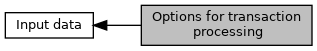

[Macros](#define-members)

Defines for <a href="group___a_d_k___t_r_x___e_x_e_c.md#ac9ddf19e79cf70f6331fdb822fdf1d4f">EMV_CT_SELECT_STRUCT::TxnOptions</a>, <a href="group___a_d_k___t_r_x___e_x_e_c.md#ac9ddf19e79cf70f6331fdb822fdf1d4f">EMV_CT_TRANSAC_STRUCT::TxnOptions</a>, <a href="group___a_d_k___t_r_x___e_x_e_c.md#ac9ddf19e79cf70f6331fdb822fdf1d4f">EMV_CT_HOST_STRUCT::TxnOptions</a>. [More\...](#details)

Collaboration diagram for Options for transaction processing:

|  |  |
|----|----|
| Macros |  |
| #define  | [EMV_CT_SELOP_CBCK_APPLI_SEL](#gaab785578dcd744eb56754e0be88d63c3)   0x01 |
|   | B1b1: Callback function for customer application selection <a href="adk__emv__contactless__programmers__guide_8dox.md#a591fd0f380cd390007ce78b47be923c4">EMV_CT_CALLBACK_FnT</a> (<a href="group___c_b_c_k___f_c_t___t_a_g_s.md#gababcd780ecf1c9d400ecfde024d910fe">TAG_BF04_CBK_REDUCE_CAND</a>) will be generated, if there are several application possible. Depends on <a href="group___t_x_n___s_t_e_p_s.md#gaddc20bcb42b1a9a5ec97e7514f2d4504">MS_RETURN_CALLBACKS</a>, <a href="group___a_d_k___t_r_x___e_x_e_c.md#a8718e6f6b475c9e4b2bbbe8030e0ee6f">EMV_CT_APPS_SELECT_STRUCT::ucCardholderConfirmation</a>. [More\...](#gaab785578dcd744eb56754e0be88d63c3)  |
| #define  | [EMV_CT_SELOP_RESERV_ALLOW_B_ON_A](#gafd6620501e88ce7edf4aa584ee0151b6)   0x02 |
|   | B1b2: allow reservation type B even in case only type A is activated via configuration (see <a href="group___s_p_e_c_i_a_l___t_r_x_s.md">Defines for special transaction configuration</a>) [More\...](#gafd6620501e88ce7edf4aa584ee0151b6)  |
| #define  | [EMV_CT_SELOP_CBCK_DOMESTIC_APPS](#gaac4024c63ae6e2d9e8919089801d65dd)   0x04 |
|   | B1b3: Activate callback function for cross check if a domestic app remains in the candidate list or not (<a href="adk__emv__contactless__programmers__guide_8dox.md#a591fd0f380cd390007ce78b47be923c4">EMV_CT_CALLBACK_FnT</a> (<a href="group___c_b_c_k___f_c_t___t_a_g_s.md#gafd0adcc12331559863dd65d8f7558645">TAG_BF05_CBK_DOM_APPS</a>)) Depends on <a href="group___t_x_n___s_t_e_p_s.md#gaddc20bcb42b1a9a5ec97e7514f2d4504">MS_RETURN_CALLBACKS</a>. [More\...](#gaac4024c63ae6e2d9e8919089801d65dd)  |
| #define  | [EMV_CT_SELOP_ADDALL](#gaaa8736d021f077fce38f8337f0860f3a)   0x08 |
|   | B1b4: Add all PSE applications to the candidate list (Cartes Bancaires - France) [More\...](#gaaa8736d021f077fce38f8337f0860f3a)  |
| #define  | [EMV_CT_SELOP_ADDBLO](#gaa07dad984f2e97c498dfcc01a63c7ec0)   0x10 |
|   | B1b5: Add blocked LOA applications to the candidate list (Interac - Canada) [More\...](#gaa07dad984f2e97c498dfcc01a63c7ec0)  |
| #define  | [EMV_CT_NO_LONGEST_AID_MATCH](#ga80468b37019369b2b265c16d15350876)   0x20 |
|   | B1b6: Do not perform the longest AID match (technical nonsense but needed for a few domestic certifications) [More\...](#ga80468b37019369b2b265c16d15350876)  |
| #define  | [EMV_CT_ALLOW_BLOCKED](#ga83110c966e16c9c01117fa848c502e1e)   0x40 |
|   | B1b7: Allow blocked application to be processed (in Bank controlled terminals to enable script processing to unblock blocked cards) [More\...](#ga83110c966e16c9c01117fa848c502e1e)  |
| #define  | [EMV_CT_SELOP_REMOVEALL_BUT_EXCLUDED](#ga4aa574972cad5f04f5547af700f21805)   0x80 |
|   | B1b8: Remove all candidates from terminal list except those which are contained in excluded AID list. This allows transactions restricted to one, two or three AIDs without terminal reconfiguration. [More\...](#ga4aa574972cad5f04f5547af700f21805)  |
| #define  | [EMV_CT_TRXOP_PIN_BYPASS_NO_SUBSEQUENT](#gaf460da399146017f2c2792ddf0559430)   0x01 |
|   | B2b1: If PIN bypass is supported it usually is for subsequent PIN entries, too. However some ICS (even if minor change) may announce no subsequent PIN Bypass, so you can configure here. [More\...](#gaf460da399146017f2c2792ddf0559430)  |
| #define  | [EMV_CT_TRXOP_MULTIPLE_RANDOM_NUMBERS](#ga32476627563a64adc5073f9cb9d0acf5)   0x02 |
|   | B2b2: Create a new value for 9F37, each time a random number is requested by the ICC. Per default one random number per transaction is generated. It is recommended to use multiple random numbers for security reasons. [More\...](#ga32476627563a64adc5073f9cb9d0acf5)  |
| #define  | [EMV_CT_TRXOP_DCC_CALLBACK](#ga37fe06e4949f5a341274dbe45c208b84)   0x04 |
| #define  | [EMV_CT_TRXOP_DCC_CALLBACK_ALWAYS](#ga8507bff64333d12639114aa6b18feb07)   0x08 |
|   | B2b4: DCC callback function <a href="adk__emv__contactless__programmers__guide_8dox.md#a591fd0f380cd390007ce78b47be923c4">EMV_CT_CALLBACK_FnT</a> (<a href="group___c_b_c_k___f_c_t___t_a_g_s.md#gaf335a870e9d2f299c848f76b843907f7">TAG_BF07_CBK_DCC</a>) will be called always. Depends on <a href="group___t_x_n___s_t_e_p_s.md#gaddc20bcb42b1a9a5ec97e7514f2d4504">MS_RETURN_CALLBACKS</a> and <a href="group___a_p_p___f_l_o_w___c_a_p_s.md#gab46cea653620bce1d34685cb1ab851d9">DCC_CHECK</a>. [More\...](#ga8507bff64333d12639114aa6b18feb07)  |
| #define  | [EMV_CT_TRXOP_NO_FALLBACK_AFTER_CVM](#gab5d354020b753e4fb9029e961fb36f1d)   0x10 |
|   | B2b5: Despite fallback after CVM allowed by application configuration stop transaction with card error. This is required in case of separate readers if mag. stripe has not been read prior to chip. [More\...](#gab5d354020b753e4fb9029e961fb36f1d)  |
| #define  | [EMV_CT_TRXOP_AMOUNT_CONF](#gab7245d9aa5ebca9d6947cfe8af8717d1)   0x20 |
|   | B2b6: The callback for the amount confirmation <a href="adk__emv__contactless__programmers__guide_8dox.md#a591fd0f380cd390007ce78b47be923c4">EMV_CT_CALLBACK_FnT</a> (<a href="group___c_b_c_k___f_c_t___t_a_g_s.md#ga626da7fbed5c5a9a5563cf0b9d45a4a4">TAG_BF02_CBK_AMOUNTCONF</a>) will be generated, e.g. to be deactivated if terminal is unattended. Invoking this callback depends on <a href="group___a_p_p___f_l_o_w___c_a_p_s.md#ga646066dcb5ff2196f23e81697ece0fa0">EMV_CT_CONF_AMOUNT_PIN</a>, <a href="group___a_p_p___f_l_o_w___c_a_p_s.md#ga4edf2c5ac7045ec648b60ad31aee30d5">REFUND_CONFIRM_AMOUNT</a>, <a href="group___a_p_p___f_l_o_w___c_a_p_s.md#ga8285318caacc7779fb5856347821f002">EMV_CT_AMOUNT_CONFIRM_ON_SIGNATURE</a>, <a href="group___t_x_n___s_t_e_p_s.md#gaddc20bcb42b1a9a5ec97e7514f2d4504">MS_RETURN_CALLBACKS</a>. [More\...](#gab7245d9aa5ebca9d6947cfe8af8717d1)  |
| #define  | [EMV_CT_TRXOP_ENFORCE_PIN](#gab0a54a9f76ab9912ab499357eaa3189e)   0x40 |
|   | B2b7: Austrian (EPA) domestic feature: force PIN usage In case no PIN entry was done during Cardholder Verification: EMV ADK will force online PIN entry, that is flag bit <a href="group___s_t_a_t_u_s___i_n_f_o.md#gad65bcb7485b33d671da3acadc03ce784">EMV_ADK_SI_ONLINE_PIN_REQUIRED</a> in <a href="group___a_d_k___t_r_x___e_x_e_c.md#a89b6ee4a99c6f75514d803b0098aa2ed">EMV_CT_TRANSRES_STRUCT::StatusInfo</a>. [More\...](#gab0a54a9f76ab9912ab499357eaa3189e)  |
| #define  | [EMV_CT_TRXOP_FALLBACK_GOODSERVICE](#gae50854b31f1a4727af3ec85cb3272760)   0x80 |
|   | B2b8: German domestic feature: Execute cash transaction with transaction type \"Goods & Services\" (in case application\'s background system does not support cash) [More\...](#gae50854b31f1a4727af3ec85cb3272760)  |
| #define  | [EMV_CT_TRXOP_MERCHINFO_CALLBACK](#gab687ffddde3bcdd5b299b6ffd5411338)   0x01 |
|   | B3b1: The callback for the intermediate merchant information will be generated (<a href="adk__emv__contactless__programmers__guide_8dox.md#a591fd0f380cd390007ce78b47be923c4">EMV_CT_CALLBACK_FnT</a> <a href="group___c_b_c_k___f_c_t___t_a_g_s.md#gaf8eeceb6363ca4e9b124d67334c09f57">TAG_BF01_CBK_MERCHINFO</a>) Depends on <a href="group___t_x_n___s_t_e_p_s.md#gaddc20bcb42b1a9a5ec97e7514f2d4504">MS_RETURN_CALLBACKS</a>. [More\...](#gab687ffddde3bcdd5b299b6ffd5411338)  |
| #define  | [EMV_CT_TRXOP_RND_CALLBACK](#ga6abd07279b04c5fd38bb58edc02d2f78)   0x02 |
|   | B3b2: Use own random number generator instead of OS one (not recommended but for debug purposes useful), only for velocity kernel, see <a href="group___c_b_c_k___f_c_t___t_a_g_s.md#ga8da23b41b13c8e47e14f5976422cf4a1">TAG_BF13_CBK_RND</a>. [More\...](#ga6abd07279b04c5fd38bb58edc02d2f78)  |
| #define  | [EMV_CT_TRXOP_HOTLST_LOG_CALLBACK](#gae29197978a50277b7ebbcb8c3890be9d)   0x04 |
|   | B3b3: The callback for the transaction log / hotlist will be generated <a href="adk__emv__contactless__programmers__guide_8dox.md#a591fd0f380cd390007ce78b47be923c4">EMV_CT_CALLBACK_FnT</a> (<a href="group___c_b_c_k___f_c_t___t_a_g_s.md#ga7db951ffee1aa377131cd752468145a4">TAG_BF03_CBK_LOG_HOTLIST</a>) Depends on the AID parameters <a href="group___a_p_p___f_l_o_w___c_a_p_s.md#gad94a1aceb2a0229425243ca4327e2070">TRANSACTION_LOG</a> and <a href="group___a_p_p___f_l_o_w___c_a_p_s.md#ga1c2ca65e5df29a89ba04a0ae398a7b6a">BLACKLIST</a>, and on <a href="group___t_x_n___s_t_e_p_s.md#gaddc20bcb42b1a9a5ec97e7514f2d4504">MS_RETURN_CALLBACKS</a>. [More\...](#gae29197978a50277b7ebbcb8c3890be9d)  |
| #define  | [EMV_CT_TRXOP_LOCAL_CHCK_CALLBACK](#gab25c0778e85a9cc2c72c33cd0616bf89)   0x08 |
|   | B3b4: The callback for the domestic and local checks will be generated <a href="adk__emv__contactless__programmers__guide_8dox.md#a591fd0f380cd390007ce78b47be923c4">EMV_CT_CALLBACK_FnT</a> (<a href="group___c_b_c_k___f_c_t___t_a_g_s.md#gafd0adcc12331559863dd65d8f7558645">TAG_BF05_CBK_DOM_APPS</a>) Depends on the AID parameter <a href="group___a_p_p___f_l_o_w___c_a_p_s.md#ga6bef1f7d609844cde9f398ca3de81925">EMV_CT_DOMESTIC_CHECK</a> and on <a href="group___t_x_n___s_t_e_p_s.md#gaddc20bcb42b1a9a5ec97e7514f2d4504">MS_RETURN_CALLBACKS</a>. [More\...](#gab25c0778e85a9cc2c72c33cd0616bf89)  |
| #define  | [EMV_CT_TRXOP_CARDHINFO_CALLBACK](#gafe4002b35de58d1aca8e329a348052e6)   0x10 |
|   | B3b5: The callback for the intermediate cardholder information will be generated <a href="adk__emv__contactless__programmers__guide_8dox.md#a591fd0f380cd390007ce78b47be923c4">EMV_CT_CALLBACK_FnT</a> (<a href="group___c_b_c_k___f_c_t___t_a_g_s.md#ga03bf78609c19ba9c07772fcd74d8c1f1">TAG_BF09_CBK_CARDHOLDERINFO</a>) Depends on <a href="group___t_x_n___s_t_e_p_s.md#gaddc20bcb42b1a9a5ec97e7514f2d4504">MS_RETURN_CALLBACKS</a>. [More\...](#gafe4002b35de58d1aca8e329a348052e6)  |
| #define  | [EMV_CT_TRXOP_EARLY_PIN_ENTRY](#ga151fe5a57d565d50dc33f3de94fff5fc)   0x20 |
|   | B3b6: Early PIN entry. PIN entry is done (by application) in parallel to steps \"Read application data\" and \"Offline data authentication\". Depends on [EMV_CT_TRXOP_DELAYED_EARLY_PIN](#ga84bb3d58ce74ec4f0010342be6c31c55 "B3b7: Delayed early PIN entry.   PIN entry is done (by application) after callback "local checks" (EM..."). If set: Application starts PIN entry after GPO, in callback \"merchant info - start read record\" (<a href="adk__emv__contactless__programmers__guide_8dox.md#a591fd0f380cd390007ce78b47be923c4">EMV_CT_CALLBACK_FnT</a> <a href="group___c_b_c_k___f_c_t___t_a_g_s.md#gaf8eeceb6363ca4e9b124d67334c09f57">TAG_BF01_CBK_MERCHINFO</a> with <a href="group___m_e_r_c_h___i_n_f_o.md#ga322e5af777fcd826a43cabd502877e16">eEMVMerReadAppData</a>) [More\...](#ga151fe5a57d565d50dc33f3de94fff5fc)  |
| #define  | [EMV_CT_TRXOP_DELAYED_EARLY_PIN](#ga84bb3d58ce74ec4f0010342be6c31c55)   0x40 |
|   | B3b7: Delayed early PIN entry. PIN entry is done (by application) after callback \"local checks\" (<a href="adk__emv__contactless__programmers__guide_8dox.md#a591fd0f380cd390007ce78b47be923c4">EMV_CT_CALLBACK_FnT</a> with <a href="group___c_b_c_k___f_c_t___t_a_g_s.md#gac82fa7e4064512e71e63fd647b817d97">TAG_BF06_CBK_LOCAL_CHECKS</a>). Precondition: [EMV_CT_TRXOP_EARLY_PIN_ENTRY](#ga151fe5a57d565d50dc33f3de94fff5fc "B3b6: Early PIN entry.   PIN entry is done (by application) in parallel to steps "Read application da...") is active. [More\...](#ga84bb3d58ce74ec4f0010342be6c31c55)  |
| #define  | [EMV_CT_TRXOP_KERNEL_PARSE_UNKNOWN_TLV](#gacbb9593e910c0b54c0ac72638e235693)   0x80 |
|   | B3b8: Let the kernel parse and store unknown TLV templates so that unknown tags can be retrieved by EMV_CT_fetchTxnTags. Precondition is that those tags are configured in the additional tag store (Additional_Tags_CRD) [More\...](#gacbb9593e910c0b54c0ac72638e235693)  |
| #define  | [EMV_CT_SELOP_NO_UTF8](#gade4aa691ae49dc65a56a21a07ad85bf1)   0x01 |
|   | B4b1: Omit UTF-8 converted application labels in application selection callback <a href="group___c_b_c_k___f_c_t___t_a_g_s.md#gababcd780ecf1c9d400ecfde024d910fe">TAG_BF04_CBK_REDUCE_CAND</a>. [More\...](#gade4aa691ae49dc65a56a21a07ad85bf1)  |
| #define  | [EMV_CT_TRXOP_NO_UTF8](#ga1ec3abeedb29210a9e70e643df93c2d2)   0x01 |
|   | B4b1: Omit UTF-8 converted application labels in amount confirmation and PIN input callback functions (<a href="group___c_b_c_k___f_c_t___t_a_g_s.md#ga626da7fbed5c5a9a5563cf0b9d45a4a4">TAG_BF02_CBK_AMOUNTCONF</a>, <a href="group___c_b_c_k___f_c_t___t_a_g_s.md#gadc9d6fed84456455586fb621722ae922">TAG_BF08_CBK_PIN</a>) [More\...](#ga1ec3abeedb29210a9e70e643df93c2d2)  |
| #define  | [EMV_CT_TRXOP_TIP_AMOUNT_ZERO](#ga81c8c3c4139ee2680bd56889434e4a81)   0x02 |
|   | B4b2: Card holder confirmed zero amount within tip amount input dialog. In case of TIP setting DF22 position 4 = 3 the transaction shall not be made suitable for a tip follow-up. [More\...](#ga81c8c3c4139ee2680bd56889434e4a81)  |
| #define  | [EMV_CT_TRXOP_NO_CHECK_BB_PADDING](#ga3216300de39251f0ef1606d85a0a90fd)   0x04 |
|   | B4b3: Omit check for BB padding in card data authentication certificates - This check is obliged in some regions but not generally by EMVCo. [More\...](#ga3216300de39251f0ef1606d85a0a90fd)  |
| #define  | [EMV_CT_TRXOP_NO_CHECK_DDLEN](#ga7f0301eb86735885a24d5830c2b82d90)   0x08 |
|   | B4b4: Omit check if dynamic data length in card data authentication certificates is too big. [More\...](#ga7f0301eb86735885a24d5830c2b82d90)  |
| #define  | [ONL_OPTS_LAST_PIN_TRY](#ga702fafaf6ff1b19d7d3ce40426e9ea47)   0x01 |
|   | B5b1 : Host detected \"last PIN try\" for online PIN. [More\...](#ga702fafaf6ff1b19d7d3ce40426e9ea47)  |
| #define  | [EMV_CT_TRXOP_PERFORM_ISS_ACQ_CVM](#gaeb40759f3a7af92242e054bbb058d8a7)   0x02 |
|   | B5b2 : For Custom CVM processing. This flag is not used so far, but might be needed one day. For instance on Custom CVM a PIN input callback with PIN mode <a href="group___a_d_k___p_i_n___i_n_p_u_t.md#ga370e1133a282c765ec9f12605b172e3a">EMV_CT_CVM_CUSTOM</a> is sent under the same condition as a PIN input callback. [More\...](#gaeb40759f3a7af92242e054bbb058d8a7)  |
| #define  | [EMV_CT_TRXOP_WRITE_DS_OFFLINE_TXN](#ga12c04d6976c6f9f7f5d8bf58a32d0d73)   0x08 |
|   | B5b4 : Write data storage data for offline transactions. Relevant only by Continue Online. When this option is set, EMV_CTLS_ContinueOnline will only write the DS data and will not perform the kernel online processing. [More\...](#ga12c04d6976c6f9f7f5d8bf58a32d0d73)  |
| #define  | [EMV_CT_TRXOP_FORCE_TACIAC_DEFAULT](#ga57c0557acfe8908d64194c2d0dccfa32)   0x10 |
|   | B5b5 : After Host Connection: Force TAC IAC Default processing even the host was reached, e.g. service provider host is available and returns valid AC but the issuer host was not reached for cryptogram verification. [More\...](#ga57c0557acfe8908d64194c2d0dccfa32)  |
| #define  | [EMV_CT_SELOP_WEEK_PRIORITY_APPS](#ga5132fd21d8102b5d29a282ec52582d6f)   0x20 |
|   | B5b6 : Ignore priority applications that are not part of the terminal candidate list. [More\...](#ga5132fd21d8102b5d29a282ec52582d6f)  |
| #define  | [EMV_CT_CUST_APPLI_SELECTION_PERFORMED](#gaa03c9899e766c13e9ec167cbaeab6faa)   0x40 |
|   | B5b7 : This is a possibility that allows the app to indicate that a customer application selection has been performed. If this is set, the callback / Reentrance for candidate selection will be even called if only one candidate is left. This is to inform the customer that the prior selected application was withdrawn from the candidate list after customer confirmation. In this special case a single candidate must not be selected automatically. [More\...](#gaa03c9899e766c13e9ec167cbaeab6faa)  |
| #define  | [EMV_CT_SELOP_DETECT_EMPTY_LIST](#ga588b8a05778297a7f42312b762fccec2)   0x80 |
|   | B5b8 : Without this bit in case of card error and in case of no common candidate <a href="group___a_d_k___r_e_t___c_o_d_e.md#ga5f6c47c1042b70f3753191850219e745">EMV_ADK_FALLBACK</a> is returned for backwards compatibility. If enabled, the second case results in return code <a href="group___a_d_k___r_e_t___c_o_d_e.md#ga321bbf465c50cf89772989dec678ae60">EMV_ADK_TXN_EMPTY_LIST</a>. [More\...](#ga588b8a05778297a7f42312b762fccec2)  |

## DetailedDescription {#detailed-description}

Defines for <a href="group___a_d_k___t_r_x___e_x_e_c.md#ac9ddf19e79cf70f6331fdb822fdf1d4f">EMV_CT_SELECT_STRUCT::TxnOptions</a>, <a href="group___a_d_k___t_r_x___e_x_e_c.md#ac9ddf19e79cf70f6331fdb822fdf1d4f">EMV_CT_TRANSAC_STRUCT::TxnOptions</a>, <a href="group___a_d_k___t_r_x___e_x_e_c.md#ac9ddf19e79cf70f6331fdb822fdf1d4f">EMV_CT_HOST_STRUCT::TxnOptions</a>.

## MacroDefinition Documentation {#macro-definition-documentation}

## EMV_CT_ALLOW_BLOCKED 

#define EMV_CT_ALLOW_BLOCKED   0x40

B1b7: Allow blocked application to be processed (in Bank controlled terminals to enable script processing to unblock blocked cards)

## EMV_CT_CUST_APPLI_SELECTION_PERFORMED 

#define EMV_CT_CUST_APPLI_SELECTION_PERFORMED   0x40

B5b7 : This is a possibility that allows the app to indicate that a customer application selection has been performed. If this is set, the callback / Reentrance for candidate selection will be even called if only one candidate is left. This is to inform the customer that the prior selected application was withdrawn from the candidate list after customer confirmation. In this special case a single candidate must not be selected automatically.

## EMV_CT_NO_LONGEST_AID_MATCH 

#define EMV_CT_NO_LONGEST_AID_MATCH   0x20

B1b6: Do not perform the longest AID match (technical nonsense but needed for a few domestic certifications)

## EMV_CT_SELOP_ADDALL 

#define EMV_CT_SELOP_ADDALL   0x08

B1b4: Add all PSE applications to the candidate list (Cartes Bancaires - France)

## EMV_CT_SELOP_ADDBLO 

#define EMV_CT_SELOP_ADDBLO   0x10

B1b5: Add blocked LOA applications to the candidate list (Interac - Canada)

## EMV_CT_SELOP_CBCK_APPLI_SEL 

#define EMV_CT_SELOP_CBCK_APPLI_SEL   0x01

B1b1: Callback function for customer application selection <a href="adk__emv__contactless__programmers__guide_8dox.md#a591fd0f380cd390007ce78b47be923c4">EMV_CT_CALLBACK_FnT</a> (<a href="group___c_b_c_k___f_c_t___t_a_g_s.md#gababcd780ecf1c9d400ecfde024d910fe">TAG_BF04_CBK_REDUCE_CAND</a>) will be generated, if there are several application possible.
Depends on <a href="group___t_x_n___s_t_e_p_s.md#gaddc20bcb42b1a9a5ec97e7514f2d4504">MS_RETURN_CALLBACKS</a>, <a href="group___a_d_k___t_r_x___e_x_e_c.md#a8718e6f6b475c9e4b2bbbe8030e0ee6f">EMV_CT_APPS_SELECT_STRUCT::ucCardholderConfirmation</a>.

## EMV_CT_SELOP_CBCK_DOMESTIC_APPS 

#define EMV_CT_SELOP_CBCK_DOMESTIC_APPS   0x04

B1b3: Activate callback function for cross check if a domestic app remains in the candidate list or not (<a href="adk__emv__contactless__programmers__guide_8dox.md#a591fd0f380cd390007ce78b47be923c4">EMV_CT_CALLBACK_FnT</a> (<a href="group___c_b_c_k___f_c_t___t_a_g_s.md#gafd0adcc12331559863dd65d8f7558645">TAG_BF05_CBK_DOM_APPS</a>))
Depends on <a href="group___t_x_n___s_t_e_p_s.md#gaddc20bcb42b1a9a5ec97e7514f2d4504">MS_RETURN_CALLBACKS</a>.

## EMV_CT_SELOP_DETECT_EMPTY_LIST 

#define EMV_CT_SELOP_DETECT_EMPTY_LIST   0x80

B5b8 : Without this bit in case of card error and in case of no common candidate <a href="group___a_d_k___r_e_t___c_o_d_e.md#ga5f6c47c1042b70f3753191850219e745">EMV_ADK_FALLBACK</a> is returned for backwards compatibility. If enabled, the second case results in return code <a href="group___a_d_k___r_e_t___c_o_d_e.md#ga321bbf465c50cf89772989dec678ae60">EMV_ADK_TXN_EMPTY_LIST</a>.

## EMV_CT_SELOP_NO_UTF8 

#define EMV_CT_SELOP_NO_UTF8   0x01

B4b1: Omit UTF-8 converted application labels in application selection callback <a href="group___c_b_c_k___f_c_t___t_a_g_s.md#gababcd780ecf1c9d400ecfde024d910fe">TAG_BF04_CBK_REDUCE_CAND</a>.

## EMV_CT_SELOP_REMOVEALL_BUT_EXCLUDED 

#define EMV_CT_SELOP_REMOVEALL_BUT_EXCLUDED   0x80

B1b8: Remove all candidates from terminal list except those which are contained in excluded AID list. This allows transactions restricted to one, two or three AIDs without terminal reconfiguration.

## EMV_CT_SELOP_RESERV_ALLOW_B_ON_A 

#define EMV_CT_SELOP_RESERV_ALLOW_B_ON_A   0x02

B1b2: allow reservation type B even in case only type A is activated via configuration (see <a href="group___s_p_e_c_i_a_l___t_r_x_s.md">Defines for special transaction configuration</a>)

## EMV_CT_SELOP_WEEK_PRIORITY_APPS 

#define EMV_CT_SELOP_WEEK_PRIORITY_APPS   0x20

B5b6 : Ignore priority applications that are not part of the terminal candidate list.

## EMV_CT_TRXOP_AMOUNT_CONF 

#define EMV_CT_TRXOP_AMOUNT_CONF   0x20

B2b6: The callback for the amount confirmation <a href="adk__emv__contactless__programmers__guide_8dox.md#a591fd0f380cd390007ce78b47be923c4">EMV_CT_CALLBACK_FnT</a> (<a href="group___c_b_c_k___f_c_t___t_a_g_s.md#ga626da7fbed5c5a9a5563cf0b9d45a4a4">TAG_BF02_CBK_AMOUNTCONF</a>) will be generated, e.g. to be deactivated if terminal is unattended.
Invoking this callback depends on <a href="group___a_p_p___f_l_o_w___c_a_p_s.md#ga646066dcb5ff2196f23e81697ece0fa0">EMV_CT_CONF_AMOUNT_PIN</a>, <a href="group___a_p_p___f_l_o_w___c_a_p_s.md#ga4edf2c5ac7045ec648b60ad31aee30d5">REFUND_CONFIRM_AMOUNT</a>, <a href="group___a_p_p___f_l_o_w___c_a_p_s.md#ga8285318caacc7779fb5856347821f002">EMV_CT_AMOUNT_CONFIRM_ON_SIGNATURE</a>, <a href="group___t_x_n___s_t_e_p_s.md#gaddc20bcb42b1a9a5ec97e7514f2d4504">MS_RETURN_CALLBACKS</a>.

## EMV_CT_TRXOP_CARDHINFO_CALLBACK 

#define EMV_CT_TRXOP_CARDHINFO_CALLBACK   0x10

B3b5: The callback for the intermediate cardholder information will be generated <a href="adk__emv__contactless__programmers__guide_8dox.md#a591fd0f380cd390007ce78b47be923c4">EMV_CT_CALLBACK_FnT</a> (<a href="group___c_b_c_k___f_c_t___t_a_g_s.md#ga03bf78609c19ba9c07772fcd74d8c1f1">TAG_BF09_CBK_CARDHOLDERINFO</a>)
Depends on <a href="group___t_x_n___s_t_e_p_s.md#gaddc20bcb42b1a9a5ec97e7514f2d4504">MS_RETURN_CALLBACKS</a>.

## EMV_CT_TRXOP_DCC_CALLBACK 

#define EMV_CT_TRXOP_DCC_CALLBACK   0x04

B2b3: DCC callback function <a href="adk__emv__contactless__programmers__guide_8dox.md#a591fd0f380cd390007ce78b47be923c4">EMV_CT_CALLBACK_FnT</a> (<a href="group___c_b_c_k___f_c_t___t_a_g_s.md#gaf335a870e9d2f299c848f76b843907f7">TAG_BF07_CBK_DCC</a>) will be invoked.
Callback is only invoked if DCC is allowed (transaction amount was not yet used in PDOL or amount confirmation) resp. limit conversion is needed (transaction and configuration currency difference).
Depends on <a href="group___t_x_n___s_t_e_p_s.md#gaddc20bcb42b1a9a5ec97e7514f2d4504">MS_RETURN_CALLBACKS</a> and <a href="group___a_p_p___f_l_o_w___c_a_p_s.md#gab46cea653620bce1d34685cb1ab851d9">DCC_CHECK</a>.

## EMV_CT_TRXOP_DCC_CALLBACK_ALWAYS 

#define EMV_CT_TRXOP_DCC_CALLBACK_ALWAYS   0x08

B2b4: DCC callback function <a href="adk__emv__contactless__programmers__guide_8dox.md#a591fd0f380cd390007ce78b47be923c4">EMV_CT_CALLBACK_FnT</a> (<a href="group___c_b_c_k___f_c_t___t_a_g_s.md#gaf335a870e9d2f299c848f76b843907f7">TAG_BF07_CBK_DCC</a>) will be called always.
Depends on <a href="group___t_x_n___s_t_e_p_s.md#gaddc20bcb42b1a9a5ec97e7514f2d4504">MS_RETURN_CALLBACKS</a> and <a href="group___a_p_p___f_l_o_w___c_a_p_s.md#gab46cea653620bce1d34685cb1ab851d9">DCC_CHECK</a>.

## EMV_CT_TRXOP_DELAYED_EARLY_PIN 

#define EMV_CT_TRXOP_DELAYED_EARLY_PIN   0x40

B3b7: Delayed early PIN entry.
PIN entry is done (by application) after callback \"local checks\" (<a href="adk__emv__contactless__programmers__guide_8dox.md#a591fd0f380cd390007ce78b47be923c4">EMV_CT_CALLBACK_FnT</a> with <a href="group___c_b_c_k___f_c_t___t_a_g_s.md#gac82fa7e4064512e71e63fd647b817d97">TAG_BF06_CBK_LOCAL_CHECKS</a>).
Precondition: [EMV_CT_TRXOP_EARLY_PIN_ENTRY](#ga151fe5a57d565d50dc33f3de94fff5fc "B3b6: Early PIN entry.   PIN entry is done (by application) in parallel to steps "Read application da...") is active.

## EMV_CT_TRXOP_EARLY_PIN_ENTRY 

#define EMV_CT_TRXOP_EARLY_PIN_ENTRY   0x20

B3b6: Early PIN entry.
PIN entry is done (by application) in parallel to steps \"Read application data\" and \"Offline data authentication\".
Depends on [EMV_CT_TRXOP_DELAYED_EARLY_PIN](#ga84bb3d58ce74ec4f0010342be6c31c55 "B3b7: Delayed early PIN entry.   PIN entry is done (by application) after callback "local checks" (EM...").
If set: Application starts PIN entry after GPO, in callback \"merchant info - start read record\" (<a href="adk__emv__contactless__programmers__guide_8dox.md#a591fd0f380cd390007ce78b47be923c4">EMV_CT_CALLBACK_FnT</a> <a href="group___c_b_c_k___f_c_t___t_a_g_s.md#gaf8eeceb6363ca4e9b124d67334c09f57">TAG_BF01_CBK_MERCHINFO</a> with <a href="group___m_e_r_c_h___i_n_f_o.md#ga322e5af777fcd826a43cabd502877e16">eEMVMerReadAppData</a>)

## EMV_CT_TRXOP_ENFORCE_PIN 

#define EMV_CT_TRXOP_ENFORCE_PIN   0x40

B2b7: Austrian (EPA) domestic feature: force PIN usage
In case no PIN entry was done during Cardholder Verification: EMV ADK will force online PIN entry, that is flag bit <a href="group___s_t_a_t_u_s___i_n_f_o.md#gad65bcb7485b33d671da3acadc03ce784">EMV_ADK_SI_ONLINE_PIN_REQUIRED</a> in <a href="group___a_d_k___t_r_x___e_x_e_c.md#a89b6ee4a99c6f75514d803b0098aa2ed">EMV_CT_TRANSRES_STRUCT::StatusInfo</a>.

## EMV_CT_TRXOP_FALLBACK_GOODSERVICE 

#define EMV_CT_TRXOP_FALLBACK_GOODSERVICE   0x80

B2b8: German domestic feature: Execute cash transaction with transaction type \"Goods & Services\" (in case application\'s background system does not support cash)

## EMV_CT_TRXOP_FORCE_TACIAC_DEFAULT 

#define EMV_CT_TRXOP_FORCE_TACIAC_DEFAULT   0x10

B5b5 : After Host Connection: Force TAC IAC Default processing even the host was reached, e.g. service provider host is available and returns valid AC but the issuer host was not reached for cryptogram verification.

## EMV_CT_TRXOP_HOTLST_LOG_CALLBACK 

#define EMV_CT_TRXOP_HOTLST_LOG_CALLBACK   0x04

B3b3: The callback for the transaction log / hotlist will be generated <a href="adk__emv__contactless__programmers__guide_8dox.md#a591fd0f380cd390007ce78b47be923c4">EMV_CT_CALLBACK_FnT</a> (<a href="group___c_b_c_k___f_c_t___t_a_g_s.md#ga7db951ffee1aa377131cd752468145a4">TAG_BF03_CBK_LOG_HOTLIST</a>)
Depends on the AID parameters <a href="group___a_p_p___f_l_o_w___c_a_p_s.md#gad94a1aceb2a0229425243ca4327e2070">TRANSACTION_LOG</a> and <a href="group___a_p_p___f_l_o_w___c_a_p_s.md#ga1c2ca65e5df29a89ba04a0ae398a7b6a">BLACKLIST</a>, and on <a href="group___t_x_n___s_t_e_p_s.md#gaddc20bcb42b1a9a5ec97e7514f2d4504">MS_RETURN_CALLBACKS</a>.

## EMV_CT_TRXOP_KERNEL_PARSE_UNKNOWN_TLV 

#define EMV_CT_TRXOP_KERNEL_PARSE_UNKNOWN_TLV   0x80

B3b8: Let the kernel parse and store unknown TLV templates so that unknown tags can be retrieved by EMV_CT_fetchTxnTags. Precondition is that those tags are configured in the additional tag store (Additional_Tags_CRD)

## EMV_CT_TRXOP_LOCAL_CHCK_CALLBACK 

#define EMV_CT_TRXOP_LOCAL_CHCK_CALLBACK   0x08

B3b4: The callback for the domestic and local checks will be generated <a href="adk__emv__contactless__programmers__guide_8dox.md#a591fd0f380cd390007ce78b47be923c4">EMV_CT_CALLBACK_FnT</a> (<a href="group___c_b_c_k___f_c_t___t_a_g_s.md#gafd0adcc12331559863dd65d8f7558645">TAG_BF05_CBK_DOM_APPS</a>)
Depends on the AID parameter <a href="group___a_p_p___f_l_o_w___c_a_p_s.md#ga6bef1f7d609844cde9f398ca3de81925">EMV_CT_DOMESTIC_CHECK</a> and on <a href="group___t_x_n___s_t_e_p_s.md#gaddc20bcb42b1a9a5ec97e7514f2d4504">MS_RETURN_CALLBACKS</a>.

## EMV_CT_TRXOP_MERCHINFO_CALLBACK 

#define EMV_CT_TRXOP_MERCHINFO_CALLBACK   0x01

B3b1: The callback for the intermediate merchant information will be generated (<a href="adk__emv__contactless__programmers__guide_8dox.md#a591fd0f380cd390007ce78b47be923c4">EMV_CT_CALLBACK_FnT</a> <a href="group___c_b_c_k___f_c_t___t_a_g_s.md#gaf8eeceb6363ca4e9b124d67334c09f57">TAG_BF01_CBK_MERCHINFO</a>)
Depends on <a href="group___t_x_n___s_t_e_p_s.md#gaddc20bcb42b1a9a5ec97e7514f2d4504">MS_RETURN_CALLBACKS</a>.

## EMV_CT_TRXOP_MULTIPLE_RANDOM_NUMBERS 

#define EMV_CT_TRXOP_MULTIPLE_RANDOM_NUMBERS   0x02

B2b2: Create a new value for 9F37, each time a random number is requested by the ICC. Per default one random number per transaction is generated. It is recommended to use multiple random numbers for security reasons.

## EMV_CT_TRXOP_NO_CHECK_BB_PADDING 

#define EMV_CT_TRXOP_NO_CHECK_BB_PADDING   0x04

B4b3: Omit check for BB padding in card data authentication certificates - This check is obliged in some regions but not generally by EMVCo.

## EMV_CT_TRXOP_NO_CHECK_DDLEN 

#define EMV_CT_TRXOP_NO_CHECK_DDLEN   0x08

B4b4: Omit check if dynamic data length in card data authentication certificates is too big.

## EMV_CT_TRXOP_NO_FALLBACK_AFTER_CVM 

#define EMV_CT_TRXOP_NO_FALLBACK_AFTER_CVM   0x10

B2b5: Despite fallback after CVM allowed by application configuration stop transaction with card error. This is required in case of separate readers if mag. stripe has not been read prior to chip.

## EMV_CT_TRXOP_NO_UTF8 

#define EMV_CT_TRXOP_NO_UTF8   0x01

B4b1: Omit UTF-8 converted application labels in amount confirmation and PIN input callback functions (<a href="group___c_b_c_k___f_c_t___t_a_g_s.md#ga626da7fbed5c5a9a5563cf0b9d45a4a4">TAG_BF02_CBK_AMOUNTCONF</a>, <a href="group___c_b_c_k___f_c_t___t_a_g_s.md#gadc9d6fed84456455586fb621722ae922">TAG_BF08_CBK_PIN</a>)

## EMV_CT_TRXOP_PERFORM_ISS_ACQ_CVM 

#define EMV_CT_TRXOP_PERFORM_ISS_ACQ_CVM   0x02

B5b2 : For Custom CVM processing. This flag is not used so far, but might be needed one day. For instance on Custom CVM a PIN input callback with PIN mode <a href="group___a_d_k___p_i_n___i_n_p_u_t.md#ga370e1133a282c765ec9f12605b172e3a">EMV_CT_CVM_CUSTOM</a> is sent under the same condition as a PIN input callback.

## EMV_CT_TRXOP_PIN_BYPASS_NO_SUBSEQUENT 

#define EMV_CT_TRXOP_PIN_BYPASS_NO_SUBSEQUENT   0x01

B2b1: If PIN bypass is supported it usually is for subsequent PIN entries, too. However some ICS (even if minor change) may announce no subsequent PIN Bypass, so you can configure here.

## EMV_CT_TRXOP_RND_CALLBACK 

#define EMV_CT_TRXOP_RND_CALLBACK   0x02

B3b2: Use own random number generator instead of OS one (not recommended but for debug purposes useful), only for velocity kernel, see <a href="group___c_b_c_k___f_c_t___t_a_g_s.md#ga8da23b41b13c8e47e14f5976422cf4a1">TAG_BF13_CBK_RND</a>.

**<a href="deprecated.md#_deprecated000144">Deprecated:</a>** not supported anymore

## EMV_CT_TRXOP_TIP_AMOUNT_ZERO 

#define EMV_CT_TRXOP_TIP_AMOUNT_ZERO   0x02

B4b2: Card holder confirmed zero amount within tip amount input dialog. In case of TIP setting DF22 position 4 = 3 the transaction shall not be made suitable for a tip follow-up.

## EMV_CT_TRXOP_WRITE_DS_OFFLINE_TXN 

#define EMV_CT_TRXOP_WRITE_DS_OFFLINE_TXN   0x08

B5b4 : Write data storage data for offline transactions. Relevant only by Continue Online. When this option is set, EMV_CTLS_ContinueOnline will only write the DS data and will not perform the kernel online processing.

## ONL_OPTS_LAST_PIN_TRY 

#define ONL_OPTS_LAST_PIN_TRY   0x01

B5b1 : Host detected \"last PIN try\" for online PIN.
