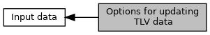

[Macros](#define-members)

`options` for <a href="group___f_u_n_c___f_l_o_w.md#gad3dd36d27d5fa94d3f302dc4a4546b70">EMV_CT_updateTxnTags()</a> [More\...](#details)

Collaboration diagram for Options for updating TLV data:

|  |  |
|----|----|
| Macros |  |
| #define  | [EMV_ADK_UPDATETAGS_ERROR_ON_NOT_ALLOWED_TAG](#gae7bb655952bbdcc1dd6c3ce90bde9f49)   (1 \<\< 0) |
|   | return error <a href="group___a_d_k___r_e_t___c_o_d_e.md#ga89c11346e5e636e7c9d42c6a772674bf">EMV_ADK_PARAM</a> if one or several tags are not allowed to be updated. If bit is not set, not allowed tags will be silently ignored. [More\...](#gae7bb655952bbdcc1dd6c3ce90bde9f49)  |

## DetailedDescription {#detailed-description}

`options` for <a href="group___f_u_n_c___f_l_o_w.md#gad3dd36d27d5fa94d3f302dc4a4546b70">EMV_CT_updateTxnTags()</a>

## MacroDefinition Documentation {#macro-definition-documentation}

## EMV_ADK_UPDATETAGS_ERROR_ON_NOT_ALLOWED_TAG 

#define EMV_ADK_UPDATETAGS_ERROR_ON_NOT_ALLOWED_TAG   (1 \<\< 0)

return error <a href="group___a_d_k___r_e_t___c_o_d_e.md#ga89c11346e5e636e7c9d42c6a772674bf">EMV_ADK_PARAM</a> if one or several tags are not allowed to be updated. If bit is not set, not allowed tags will be silently ignored.
