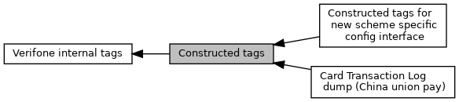

[Modules](#groups) \| [Macros](#define-members)

Collaboration diagram for Constructed tags:

|  |  |
|----|----|
| Modules |  |
|   | <a href="group___v_e_r_i___c_o_n_s_t_r___t_a_g_s___c_a_r_d___l_o_g.md">Card Transaction Log dump (China union pay)</a> |
|   | <a href="group___t_a_g_s___n_e_w___c_f_g___i_n_t_f___c_o_n_s_t_r.md">Constructed tags for new scheme specific config interface</a> |

|  |  |
|----|----|
| Macros |  |
| #define  | [TAG_E2_FORMAT_B](#gafc9636e2e6f07e6711a527883900e61c)   0xE2 |
|   | Format: Binary. [More\...](#gafc9636e2e6f07e6711a527883900e61c)  |
| #define  | [TAG_E3_FORMAT_N](#ga921898c1164e3bcb44ca2a78bd28bf5a)   0xE3 |
|   | Format: Numeric. [More\...](#ga921898c1164e3bcb44ca2a78bd28bf5a)  |
| #define  | [TAG_E4_FORMAT_CN](#ga6b04aad1b0a3d5fe14fc86f12b6ca2c6)   0xE4 |
|   | Format: Compressed Numeric. [More\...](#ga6b04aad1b0a3d5fe14fc86f12b6ca2c6)  |
| #define  | [TAG_E5_FORMAT_A](#gab684ebc7f6bfb422d1af2d1985563014)   0xE5 |
|   | Format: Alphabetic. [More\...](#gab684ebc7f6bfb422d1af2d1985563014)  |
| #define  | [TAG_E6_FORMAT_AN](#ga6beb5c015ec1d897ac240bafe1ed9a53)   0xE6 |
|   | Format: Alpha Numeric. [More\...](#ga6beb5c015ec1d897ac240bafe1ed9a53)  |
| #define  | [TAG_E7_FORMAT_ANS](#gaebdbe25c32f1af5298ac17278c9af80a)   0xE7 |
|   | Format: Alphanumeric Special data elements. [More\...](#gaebdbe25c32f1af5298ac17278c9af80a)  |
| #define  | [TAG_F0_EMV_TEMPLATE](#ga08c17dcb68a90b0a1916a713c3d33219)   0xF0 |
|   | All BER TLV streams are packed in this tag. [More\...](#ga08c17dcb68a90b0a1916a713c3d33219)  |
| #define  | [TAG_DOM_CHIP](#ga4867cbd479109dca0043fac71180f63e)   0xFF01 |
|   | Contact only: Domestic chip applications. [More\...](#ga4867cbd479109dca0043fac71180f63e)  |
| #define  | [TAG_FALLBACK_MSR](#ga6d9fe9c9623eb1558647e7c5913e11a5)   0xFF02 |
|   | Contact only: MSR data. [More\...](#ga6d9fe9c9623eb1558647e7c5913e11a5)  |
| #define  | [TAG_CAND_LIST](#ga6ac06f1d6d42a5e163c1be8d5323e7d6)   0xFF03 |
|   | Contact only: Candidate list. [More\...](#ga6ac06f1d6d42a5e163c1be8d5323e7d6)  |
| #define  | [TAG_KEY](#ga9808b602dc1ad05f05054f288e80099e)   0xFF04 |
|   | CAP keys, usd to enclose data of <a href="group___d_e_f___c_a_r_d___c_o_n_f.md#struct_e_m_v___c_t_l_s___c_a_p_r_e_a_d___s_t_r_u_c_t">EMV_CTLS_CAPREAD_STRUCT</a>. [More\...](#ga9808b602dc1ad05f05054f288e80099e)  |
| #define  | [TAG_HOTLIST](#ga0f16662930e6aee415115b531fcefa47)   0xFF05 |
|   | Hot list, used as <a href="group___d_e_f___c_o_n_f___t_e_r_m.md#ad0009ae39ab506b4158d8002d4b33da5">EMV_CTLS_TERMDATA_STRUCT::Hotlist</a>. [More\...](#ga0f16662930e6aee415115b531fcefa47)  |
| #define  | [TAG_FF10_DE_DET_DATA](#ga8cba9e04a32675f7ed16d81f3af7ebed)   0xFF10 |
|   | DataExchange, constructed tag for DET data, used in <a href="group___t_l_v___c_a_l_l_b_c_k.md#ga6557e914101768d67635ca44e54362ab">EMV_CTLS_CALLBACK_FnT</a>, <a href="group___c_b_c_k___f_c_t___t_a_g_s.md#ga32719fcef354a44723c8b6561716f5bd">TAG_BF0E_CBK_DATA_EXCHANGE</a>. [More\...](#ga8cba9e04a32675f7ed16d81f3af7ebed)  |
| #define  | [TAG_EXCLUDE_COMBO](#ga13bc9955418fefffabd468d2608411c5)   0xFF69 |
|   | used to serialise data from <a href="group___d_e_f___f_l_o_w___i_n_p_u_t.md#ad87415ec2bcc2e988462d432a46f8065">EMV_CTLS_APPS_SELECT_TYPE::ExcludeCombos</a> [More\...](#ga13bc9955418fefffabd468d2608411c5)  |
| #define  | [TAG_FF8F13_SIGNAL_MSG](#gafbd7dbf0777c05e3767966068ce6d1a7)   0xFF8F13 |
|   | PayPass 3, tag for reading list of User Interface Request Signals with <a href="group___f_u_n_c___f_l_o_w.md#ga8c9f0640ed818c3dc19da528f5f0b406">EMV_CTLS_fetchTxnTags</a>. [More\...](#gafbd7dbf0777c05e3767966068ce6d1a7)  |
| #define  | [TAG_FF8F14_SIGNAL_OUT](#ga338143e80bd209946f38173c58585d8f)   0xFF8F14 |
|   | PayPass 3, tag for reading list of Outcome Signals with <a href="group___f_u_n_c___f_l_o_w.md#ga8c9f0640ed818c3dc19da528f5f0b406">EMV_CTLS_fetchTxnTags</a>. [More\...](#ga338143e80bd209946f38173c58585d8f)  |
| #define  | [TAG_FF8013_SIGNAL_MSG](#ga21557a8556930c9e5b4c372ab421b5a4)   [TAG_FF8F13_SIGNAL_MSG](#gafbd7dbf0777c05e3767966068ce6d1a7) |
| #define  | [TAG_FF8014_SIGNAL_OUT](#gac96efced4e96c5919ea42bdddd2252a4)   [TAG_FF8F14_SIGNAL_OUT](#ga338143e80bd209946f38173c58585d8f) |
| #define  | [TAG_E2_FORMAT_B](#gafc9636e2e6f07e6711a527883900e61c)   0xE2 |
|   | Data objects with format \"b\" Used for EMV_CT_APPLIDATA_STRUCT::Additional_Tags. [More\...](#gafc9636e2e6f07e6711a527883900e61c)  |
| #define  | [TAG_E3_FORMAT_N](#ga921898c1164e3bcb44ca2a78bd28bf5a)   0xE3 |
|   | Data objects with format \"n\" Used for EMV_CT_APPLIDATA_STRUCT::Additional_Tags. [More\...](#ga921898c1164e3bcb44ca2a78bd28bf5a)  |
| #define  | [TAG_E4_FORMAT_CN](#ga6b04aad1b0a3d5fe14fc86f12b6ca2c6)   0xE4 |
|   | Data objects with format \"cn\" Used for EMV_CT_APPLIDATA_STRUCT::Additional_Tags. [More\...](#ga6b04aad1b0a3d5fe14fc86f12b6ca2c6)  |
| #define  | [TAG_E5_FORMAT_A](#gab684ebc7f6bfb422d1af2d1985563014)   0xE5 |
|   | Data objects with format \"a\" Used for EMV_CT_APPLIDATA_STRUCT::Additional_Tags. [More\...](#gab684ebc7f6bfb422d1af2d1985563014)  |
| #define  | [TAG_E6_FORMAT_AN](#ga6beb5c015ec1d897ac240bafe1ed9a53)   0xE6 |
|   | Data objects with format \"an\" Used for EMV_CT_APPLIDATA_STRUCT::Additional_Tags. [More\...](#ga6beb5c015ec1d897ac240bafe1ed9a53)  |
| #define  | [TAG_E7_FORMAT_ANS](#gaebdbe25c32f1af5298ac17278c9af80a)   0xE7 |
|   | Data objects with format \"ans\" Used for EMV_CT_APPLIDATA_STRUCT::Additional_Tags. [More\...](#gaebdbe25c32f1af5298ac17278c9af80a)  |
| #define  | [TAG_F0_EMV_TEMPLATE](#ga08c17dcb68a90b0a1916a713c3d33219)   0xF0 |
|   | All BER TLV streams are packed in this tag. [More\...](#ga08c17dcb68a90b0a1916a713c3d33219)  |
| #define  | [TAG_DOM_CHIP](#ga4867cbd479109dca0043fac71180f63e)   0xFF01 |
|   | constructed tag for domestic chip applications [More\...](#ga4867cbd479109dca0043fac71180f63e)  |
| #define  | [TAG_FALLBACK_MSR](#ga6d9fe9c9623eb1558647e7c5913e11a5)   0xFF02 |
|   | constructed tag for MSR data [More\...](#ga6d9fe9c9623eb1558647e7c5913e11a5)  |
| #define  | [TAG_CAND_LIST](#ga6ac06f1d6d42a5e163c1be8d5323e7d6)   0xFF03 |
|   | constructed tag for candidate list, used for EMV_CT_CANDIDATE_TYPE, <a href="group___a_d_k___t_r_x___e_x_e_c.md#struct_e_m_v___c_t___cand_list_type">EMV_CT_CandListType</a> and within EMV_CT_updateTxnTags [More\...](#ga6ac06f1d6d42a5e163c1be8d5323e7d6)  |
| #define  | [TAG_KEY](#ga9808b602dc1ad05f05054f288e80099e)   0xFF04 |
|   | constructed tag for CAP keys [More\...](#ga9808b602dc1ad05f05054f288e80099e)  |

## DetailedDescription {#detailed-description}

## MacroDefinition Documentation {#macro-definition-documentation}

## TAG_CAND_LIST\[1/2\]  {#tag_cand_list-12}

#define TAG_CAND_LIST   0xFF03

constructed tag for candidate list, used for EMV_CT_CANDIDATE_TYPE, <a href="group___a_d_k___t_r_x___e_x_e_c.md#struct_e_m_v___c_t___cand_list_type">EMV_CT_CandListType</a> and within EMV_CT_updateTxnTags

## TAG_CAND_LIST\[2/2\]  {#tag_cand_list-22}

#define TAG_CAND_LIST   0xFF03

Contact only: Candidate list.

## TAG_DOM_CHIP\[1/2\]  {#tag_dom_chip-12}

#define TAG_DOM_CHIP   0xFF01

constructed tag for domestic chip applications

## TAG_DOM_CHIP\[2/2\]  {#tag_dom_chip-22}

#define TAG_DOM_CHIP   0xFF01

Contact only: Domestic chip applications.

## TAG_E2_FORMAT_B\[1/2\]  {#tag_e2_format_b-12}

#define TAG_E2_FORMAT_B   0xE2

Data objects with format \"b\"
Used for EMV_CT_APPLIDATA_STRUCT::Additional_Tags.

## TAG_E2_FORMAT_B\[2/2\]  {#tag_e2_format_b-22}

#define TAG_E2_FORMAT_B   0xE2

Format: Binary.

## TAG_E3_FORMAT_N\[1/2\]  {#tag_e3_format_n-12}

#define TAG_E3_FORMAT_N   0xE3

Data objects with format \"n\"
Used for EMV_CT_APPLIDATA_STRUCT::Additional_Tags.

## TAG_E3_FORMAT_N\[2/2\]  {#tag_e3_format_n-22}

#define TAG_E3_FORMAT_N   0xE3

Format: Numeric.

## TAG_E4_FORMAT_CN\[1/2\]  {#tag_e4_format_cn-12}

#define TAG_E4_FORMAT_CN   0xE4

Data objects with format \"cn\"
Used for EMV_CT_APPLIDATA_STRUCT::Additional_Tags.

## TAG_E4_FORMAT_CN\[2/2\]  {#tag_e4_format_cn-22}

#define TAG_E4_FORMAT_CN   0xE4

Format: Compressed Numeric.

## TAG_E5_FORMAT_A\[1/2\]  {#tag_e5_format_a-12}

#define TAG_E5_FORMAT_A   0xE5

Data objects with format \"a\"
Used for EMV_CT_APPLIDATA_STRUCT::Additional_Tags.

## TAG_E5_FORMAT_A\[2/2\]  {#tag_e5_format_a-22}

#define TAG_E5_FORMAT_A   0xE5

Format: Alphabetic.

## TAG_E6_FORMAT_AN\[1/2\]  {#tag_e6_format_an-12}

#define TAG_E6_FORMAT_AN   0xE6

Data objects with format \"an\"
Used for EMV_CT_APPLIDATA_STRUCT::Additional_Tags.

## TAG_E6_FORMAT_AN\[2/2\]  {#tag_e6_format_an-22}

#define TAG_E6_FORMAT_AN   0xE6

Format: Alpha Numeric.

## TAG_E7_FORMAT_ANS\[1/2\]  {#tag_e7_format_ans-12}

#define TAG_E7_FORMAT_ANS   0xE7

Data objects with format \"ans\"
Used for EMV_CT_APPLIDATA_STRUCT::Additional_Tags.

## TAG_E7_FORMAT_ANS\[2/2\]  {#tag_e7_format_ans-22}

#define TAG_E7_FORMAT_ANS   0xE7

Format: Alphanumeric Special data elements.

Contain a single character per byte. The permitted characters and their coding are shown in the Common Character Set table in \[EMV 4.3 Book 4\], Annex B.
There is one exception: The permitted characters for Application Preferred Name are the non-control characters defined in the ISO/IEC 8859 part designated in the Issuer Code Table Index associated with the Application Preferred Name.

## TAG_EXCLUDE_COMBO 

#define TAG_EXCLUDE_COMBO   0xFF69

used to serialise data from <a href="group___d_e_f___f_l_o_w___i_n_p_u_t.md#ad87415ec2bcc2e988462d432a46f8065">EMV_CTLS_APPS_SELECT_TYPE::ExcludeCombos</a>

## TAG_F0_EMV_TEMPLATE\[1/2\]  {#tag_f0_emv_template-12}

#define TAG_F0_EMV_TEMPLATE   0xF0

All BER TLV streams are packed in this tag.

## TAG_F0_EMV_TEMPLATE\[2/2\]  {#tag_f0_emv_template-22}

#define TAG_F0_EMV_TEMPLATE   0xF0

All BER TLV streams are packed in this tag.

## TAG_FALLBACK_MSR\[1/2\]  {#tag_fallback_msr-12}

#define TAG_FALLBACK_MSR   0xFF02

constructed tag for MSR data

## TAG_FALLBACK_MSR\[2/2\]  {#tag_fallback_msr-22}

#define TAG_FALLBACK_MSR   0xFF02

Contact only: MSR data.

## TAG_FF10_DE_DET_DATA 

#define TAG_FF10_DE_DET_DATA   0xFF10

DataExchange, constructed tag for DET data, used in <a href="group___t_l_v___c_a_l_l_b_c_k.md#ga6557e914101768d67635ca44e54362ab">EMV_CTLS_CALLBACK_FnT</a>, <a href="group___c_b_c_k___f_c_t___t_a_g_s.md#ga32719fcef354a44723c8b6561716f5bd">TAG_BF0E_CBK_DATA_EXCHANGE</a>.

## TAG_FF8013_SIGNAL_MSG 

#define TAG_FF8013_SIGNAL_MSG   [TAG_FF8F13_SIGNAL_MSG](#gafbd7dbf0777c05e3767966068ce6d1a7)

**<a href="deprecated.md#_deprecated000009">Deprecated:</a>** use [TAG_FF8F13_SIGNAL_MSG](#gafbd7dbf0777c05e3767966068ce6d1a7 "PayPass 3, tag for reading list of User Interface Request Signals with EMV_CTLS_fetchTxnTags.") instead

## TAG_FF8014_SIGNAL_OUT 

#define TAG_FF8014_SIGNAL_OUT   [TAG_FF8F14_SIGNAL_OUT](#ga338143e80bd209946f38173c58585d8f)

**<a href="deprecated.md#_deprecated000010">Deprecated:</a>** use [TAG_FF8F14_SIGNAL_OUT](#ga338143e80bd209946f38173c58585d8f "PayPass 3, tag for reading list of Outcome Signals with EMV_CTLS_fetchTxnTags.") instead

## TAG_FF8F13_SIGNAL_MSG 

#define TAG_FF8F13_SIGNAL_MSG   0xFF8F13

PayPass 3, tag for reading list of User Interface Request Signals with <a href="group___f_u_n_c___f_l_o_w.md#ga8c9f0640ed818c3dc19da528f5f0b406">EMV_CTLS_fetchTxnTags</a>.

## TAG_FF8F14_SIGNAL_OUT 

#define TAG_FF8F14_SIGNAL_OUT   0xFF8F14

PayPass 3, tag for reading list of Outcome Signals with <a href="group___f_u_n_c___f_l_o_w.md#ga8c9f0640ed818c3dc19da528f5f0b406">EMV_CTLS_fetchTxnTags</a>.

## TAG_HOTLIST 

#define TAG_HOTLIST   0xFF05

Hot list, used as <a href="group___d_e_f___c_o_n_f___t_e_r_m.md#ad0009ae39ab506b4158d8002d4b33da5">EMV_CTLS_TERMDATA_STRUCT::Hotlist</a>.

## TAG_KEY\[1/2\]  {#tag_key-12}

#define TAG_KEY   0xFF04

constructed tag for CAP keys

## TAG_KEY\[2/2\]  {#tag_key-22}

#define TAG_KEY   0xFF04

CAP keys, usd to enclose data of <a href="group___d_e_f___c_a_r_d___c_o_n_f.md#struct_e_m_v___c_t_l_s___c_a_p_r_e_a_d___s_t_r_u_c_t">EMV_CTLS_CAPREAD_STRUCT</a>.
