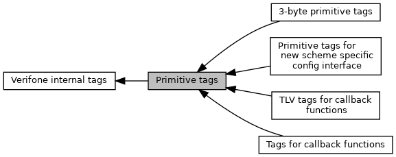

[Modules](#groups) \| [Macros](#define-members)

Collaboration diagram for Primitive tags:

|  |  |
|----|----|
| Modules |  |
|   | <a href="group___t_l_v___c_b_c_k.md">TLV tags for callback functions</a> |
|   | Used in function EMV_CallbackFunction()  |
|   | <a href="group___t_a_g_s___n_e_w___c_f_g___i_n_t_f___p_r_i_m.md">Primitive tags for new scheme specific config interface</a> |
|   | Used in functions <a href="group___f_u_n_c___c_o_n_f.md#gadc7f2eba5fd3e941d0ddb65a936a0776">EMV_CTLS_SetAppliDataSchemeSpecific()</a>/EMV_CTLS_GetAppliDataSchemeSpecific.  |
|   | <a href="group___t_l_v___c_b_c_k___t_l_v.md">Tags for callback functions</a> |
|   | Used in function <a href="adk__emv__contactless__programmers__guide_8dox.md#a591fd0f380cd390007ce78b47be923c4">EMV_CT_CALLBACK_FnT</a>.  |
|   | <a href="group___v_e_r_i___p_r_i_m___t_a_g_s__3_b_y_t_e.md">3-byte primitive tags</a> |
|   | For all unsigned long variables in functional interface, please use 4 byte in the serialization.  |

|  |  |
|----|----|
| Macros |  |
| #define  | [TAG_ISO_DATA](#ga1b30281b8c35ec19eff77088f39e3cc4)   0xDF01 |
|   | Tag for ISO data. [More\...](#ga1b30281b8c35ec19eff77088f39e3cc4)  |
| #define  | [TAG_TRACE](#gaee4e6d6b052dc25dce9ae63c41589ddd)   0xDF02 |
|   | Tag for trace data. [More\...](#gaee4e6d6b052dc25dce9ae63c41589ddd)  |
| #define  | [TAG_KEY_NUMBER](#ga59feef5f17f1c83a7a519e4d5857319d)   0xDF03 |
|   | CAP Key Number of Keys, 1 byte 0\...255. [More\...](#ga59feef5f17f1c83a7a519e4d5857319d)  |
| #define  | [TAG_DF04_AID](#ga939333f4c5c2e500beb9b06d6939fb23)   0xDF04 |
|   | AID in <a href="_e_m_v___c_t_l_s___interface_8h.md#struct_e_m_v___c_t_l_s___a_p_p_l_i___s_t_r_u_c_t">EMV_CTLS_APPLI_STRUCT</a>, TRM_SetAppliData(), TRM_GetAppliData(), TRM_SelAppli(), TRM_ReduceCandidateList() [More\...](#ga939333f4c5c2e500beb9b06d6939fb23)  |
| #define  | [TAG_DF05_BUILD_APPLILIST](#gac04d740e116d581a24faa0380290a295)   0xDF05 |
|   | not applicable for CTLS [More\...](#gac04d740e116d581a24faa0380290a295)  |
| #define  | [TAG_DF06_CARDREADER_NUM](#ga587dd4015878756c25a1d9ffebf0d1c5)   0xDF06 |
|   | L1 reader options `ucOptions` in <a href="group___f_u_n_c___i_c_c.md#gafbcdb0278723b9629eb7c12532119e2d">EMV_CTLS_SmartISO()</a> [More\...](#ga587dd4015878756c25a1d9ffebf0d1c5)  |
| #define  | [TAG_DF07_UNCRIT_SCR](#ga8533e1a9308749a3662b9303eb1c2bb3)   0xDF07 |
|   | Script results of uncritical scripts in response to <a href="group___f_u_n_c___f_l_o_w.md#ga297b6843994afaa2e7a6f5e0e4a8af3e">EMV_CTLS_ContinueOnline()</a> <a href="group___d_e_f___f_l_o_w___o_u_t_p_u_t.md#a68c7b5761f3919b25c16e80b0b89551e">EMV_CTLS_TRANSRES_STRUCT::ScriptResults</a>. [More\...](#ga8533e1a9308749a3662b9303eb1c2bb3)  |
| #define  | [TAG_DF08_CRIT_SCR](#ga16d3cf0ff996313b8a4bfa9457273e44)   0xDF08 |
|   | Script results of uncritical scripts `Future` use. [More\...](#ga16d3cf0ff996313b8a4bfa9457273e44)  |
| #define  | [TAG_KEY_INDEX](#ga7b2bdd988a89e21cd04afe12a30c0ddf)   0xDF09 |
|   | CAP Key Index `Tag`, `Struct`, `XML` Reference: TLV tag [TAG_KEY_INDEX](#ga7b2bdd988a89e21cd04afe12a30c0ddf "CAP Key Index  Tag, Struct, XML Reference:   TLV tag TAG_KEY_INDEX,   Index in EMV_CTLS_CAPKEY_STRUCT..."), Index in <a href="group___d_e_f___c_a_r_d___c_o_n_f.md#ac24ea04d0a0218723498d1632c6875a9">EMV_CTLS_CAPKEY_STRUCT::Index</a>, XML Tag: <a href="group___a_d_k___x_m_l___t_a_g_s.md#ga2564b8002f03295e157b242ad2efa950">XML_TAG_CAP_KEYS_INDEX</a>. [More\...](#ga7b2bdd988a89e21cd04afe12a30c0ddf)  |
| #define  | [TAG_KEY_RID](#ga0c86b48955a7de5b01796ece1dd8157b)   0xDF0A |
|   | CAP Key RID `Tag`, `Struct`, `XML` Reference: TLV tag [TAG_KEY_RID](#ga0c86b48955a7de5b01796ece1dd8157b "CAP Key RID  Tag, Struct, XML Reference:   TLV tag TAG_KEY_RID,   RID in EMV_CTLS_CAPKEY_STRUCT::RID,..."), RID in <a href="group___d_e_f___c_a_r_d___c_o_n_f.md#a7d507a69b2eb69015b1ced0f4c4d47fd">EMV_CTLS_CAPKEY_STRUCT::RID</a>, XML Tag: <a href="group___a_d_k___x_m_l___t_a_g_s.md#ga2acfa293c67d4c30b81f26f1fc51f677">XML_TAG_CAP_KEYS_RID</a>. [More\...](#ga0c86b48955a7de5b01796ece1dd8157b)  |
| #define  | [TAG_KEY_KEY](#gaf84423fc102deeb813ec75aa301facca)   0xDF0B |
|   | CAP Key Modulus `Tag`, `Struct`, `XML` Reference: TLV tag [TAG_KEY_KEY](#gaf84423fc102deeb813ec75aa301facca "CAP Key Modulus  Tag, Struct, XML Reference:   TLV tag TAG_KEY_KEY,   Key in EMV_CTLS_CAPKEY_STRUCT::..."), Key in <a href="group___d_e_f___c_a_r_d___c_o_n_f.md#a0a3543353678a64e265f8d5a817c52db">EMV_CTLS_CAPKEY_STRUCT::Key</a>, XML Tag: <a href="group___a_d_k___x_m_l___t_a_g_s.md#ga151215aa136d44cb12e3ea1d392c744f">XML_TAG_CAP_KEYS_KEY</a>. [More\...](#gaf84423fc102deeb813ec75aa301facca)  |
| #define  | [TAG_KEY_HASH](#gac037a26b7d73563286fb125d59f1265d)   0xDF0C |
|   | CAP Key Hash `Tag`, `Struct`, `XML` Reference: TLV tag [TAG_KEY_HASH](#gac037a26b7d73563286fb125d59f1265d "CAP Key Hash  Tag, Struct, XML Reference:   TLV tag TAG_KEY_HASH,   Hash in EMV_CTLS_CAPKEY_STRUCT::H..."), Hash in <a href="group___d_e_f___c_a_r_d___c_o_n_f.md#aa04067e88f6cfe9465c0a92f7233ebee">EMV_CTLS_CAPKEY_STRUCT::Hash</a>, XML Tag: <a href="group___a_d_k___x_m_l___t_a_g_s.md#gad6a0497d2964a67cec810ea12c8279a1">XML_TAG_CAP_KEYS_HASH</a>. [More\...](#gac037a26b7d73563286fb125d59f1265d)  |
| #define  | [TAG_KEY_EXPONENT](#ga3301dc858f4033e7100dae7d71a7e1e0)   0xDF0D |
|   | CAP Key Exponent `Tag`, `Struct`, `XML` Reference: TLV tag [TAG_KEY_EXPONENT](#ga3301dc858f4033e7100dae7d71a7e1e0 "CAP Key Exponent  Tag, Struct, XML Reference:   TLV tag TAG_KEY_EXPONENT,   Exponent in EMV_CTLS_CAPK..."), Exponent in <a href="group___d_e_f___c_a_r_d___c_o_n_f.md#a65d7fb542cdae2f7104b266bbe3ac9b2">EMV_CTLS_CAPKEY_STRUCT::Exponent</a>, XML Tag: <a href="group___a_d_k___x_m_l___t_a_g_s.md#ga19533a461456afae8eb33ee784fd361b">XML_TAG_CAP_KEYS_EXPONENT</a>. [More\...](#ga3301dc858f4033e7100dae7d71a7e1e0)  |
| #define  | [TAG_KEY_CRL](#gae92f2b4a70d0c2217bdcc751106477d1)   0xDF0E |
|   | CAP Key Certification Revocation List `Tag`, `Struct`, `XML` Reference: TLV tag [TAG_KEY_CRL](#gae92f2b4a70d0c2217bdcc751106477d1 "CAP Key Certification Revocation List  Tag, Struct, XML Reference:   TLV tag TAG_KEY_CRL,..."), RevocEntries in <a href="group___d_e_f___c_a_r_d___c_o_n_f.md#aad05155fcd539c313f48260d8ebd2f76">EMV_CTLS_CAPKEY_STRUCT::RevocEntries</a>, XML Tag: <a href="group___a_d_k___x_m_l___t_a_g_s.md#ga1e433908dd992082b5a252f39d60f45d">XML_TAG_CAP_KEYS_REVOC_LIST</a>. [More\...](#gae92f2b4a70d0c2217bdcc751106477d1)  |
| #define  | [TAG_DF10_MSR_CVM_BELOW](#gac366ac5482a497d729c843acd15338bc)   0xDF10 |
| #define  | [TAG_DF11_LIB_VERSION](#ga6f8f8ac35965ec091b3d1a3f4a4efe8d)   0xDF11 |
|   | Library version given back from <a href="group___f_u_n_c___c_o_n_f.md#gad690d9dec1818d4ffc7db35c12c3b610">EMV_CTLS_GetTermData()</a> `Tag`, `Struct`, `XML` Reference: TLV tag [TAG_DF11_LIB_VERSION](#ga6f8f8ac35965ec091b3d1a3f4a4efe8d "Library version given back from EMV_CTLS_GetTermData()  Tag, Struct, XML Reference:   TLV tag TAG_DF1..."), FrameworkVersion in <a href="group___d_e_f___c_o_n_f___t_e_r_m.md#a15d10a5c739bb6c45d9d0bf3f40c0021">EMV_CTLS_TERMDATA_STRUCT::FrameworkVersion</a>, XML Tag: <a href="group___a_d_k___x_m_l___t_a_g_s.md#ga7466ea82a873f9b06da23f703c800a17">XML_TAG_TERMDATA_FRAMEWORK_VERSION</a>. [More\...](#ga6f8f8ac35965ec091b3d1a3f4a4efe8d)  |
| #define  | [TAG_DF12_CHECKSUM](#gaf795532d38b6fd7fe5e4b9aeeda03a58)   0xDF12 |
|   | EMVCo checksum given back from <a href="group___f_u_n_c___c_o_n_f.md#gad690d9dec1818d4ffc7db35c12c3b610">EMV_CTLS_GetTermData()</a> `Tag`, `Struct`, `XML` Reference: TLV tag [TAG_DF12_CHECKSUM](#gaf795532d38b6fd7fe5e4b9aeeda03a58 "EMVCo checksum given back from EMV_CTLS_GetTermData()  Tag, Struct, XML Reference:   TLV tag TAG_DF12..."), XML Tag: <a href="group___a_d_k___x_m_l___t_a_g_s.md#ga0fea1088c31e410280b94828e0c7444a">XML_TAG_APPLIDATA_CHKSUM_ASCII_KERNEL</a>. [More\...](#gaf795532d38b6fd7fe5e4b9aeeda03a58)  |
| #define  | [TAG_DF13_TERM_PARAM](#ga8d1957a446ea91132fb417a0d8d0cd87)   0xDF13 |
| #define  | [TAG_DF14_ADD_TAGS_RES](#ga3b649f2c9db2c72312623c1e45857243)   0xDF14 |
|   | additional tag list requested for result data <a href="group___d_e_f___f_l_o_w___i_n_p_u_t.md#ac99d6e6b09a0e3fcbe4d2ec8336a30e2">EMV_CTLS_PAYMENT_STRUCT::Additional_Result_Tags</a> [More\...](#ga3b649f2c9db2c72312623c1e45857243)  |
| #define  | [TAG_DF15_OFFL_ONLY_PROCESS](#gaa32dcaf965a2b7811278930e36be20af)   0xDF15 |
| #define  | [TAG_KEY_KEYLEN](#gaae9648dee8748715de2de847955929f5)   0xDF16 |
|   | CAP Key key length `Struct`, `XML` Reference: KeyLen in <a href="group___d_e_f___c_a_r_d___c_o_n_f.md#aeb6f1a41fb682dc06cfdc1d0c1bef18f">EMV_CTLS_CAPKEY_STRUCT::KeyLen</a>, XML Tag: <a href="group___a_d_k___x_m_l___t_a_g_s.md#ga94a87250bc33e6e85a09285f832fbfd9">XML_TAG_CAP_KEYS_KEYLEN</a>. [More\...](#gaae9648dee8748715de2de847955929f5)  |
| #define  | [TAG_DF17_FALLBACK_MIDS](#gab4411c93fc374647cf05eac373bd9752)   0xDF17 |
| #define  | [TAG_DF18_FALLABCK](#gaa606116b376f0e89c618e5477bb1e351)   0xDF18 |
| #define  | [TAG_DF19_PARAMETER_4](#gaf19333fd4e33f5bb3092c61ea2c72ab1)   0xDF19 |
|   | universal tag no. 4 [More\...](#gaf19333fd4e33f5bb3092c61ea2c72ab1)  |
| #define  | [TAG_DF1C_SPECIAL_TRX](#gab6d44f4c0940dd6d574a03820b2673dc)   0xDF1C |
| #define  | [TAG_DF1D_PRIO_APPLI](#ga932e21a3b1b113c5eafd8abd4715bab4)   0xDF1D |
| #define  | [TAG_DF20_ASI](#ga3ec6eef8ef2baf5298bba904c5339614)   0xDF20 |
| #define  | [TAG_DF21_TAC_DENIAL](#ga313084d02966bb6075d6a07b5e227ac3)   0xDF21 |
|   | <a href="group___d_e_f___f_l_o_w___o_u_t_p_u_t.md#ab4a00313a90f392f78eb7517a136aae6">EMV_CTLS_TRANSRES_STRUCT::TACDenial</a>. [More\...](#ga313084d02966bb6075d6a07b5e227ac3)  |
| #define  | [TAG_DF21_TAC_ABLEHNUNG](#ga0648261008c103074456b3c4bc431a66)   [TAG_DF21_TAC_DENIAL](#ga313084d02966bb6075d6a07b5e227ac3) |
| #define  | [TAG_DF22_TAC_ONLINE](#ga8300df6d32eb040757cce4594db2eea8)   0xDF22 |
|   | <a href="group___d_e_f___f_l_o_w___o_u_t_p_u_t.md#a71a391d7f8da7dc0e5be8b97c14447da">EMV_CTLS_TRANSRES_STRUCT::TACOnline</a>. [More\...](#ga8300df6d32eb040757cce4594db2eea8)  |
| #define  | [TAG_DF23_TAC_DEFAULT](#ga588b92246f48302d61cc055baf122dda)   0xDF23 |
|   | <a href="group___d_e_f___f_l_o_w___o_u_t_p_u_t.md#a6ce1deed9d23bcc207bfb582f59cac6b">EMV_CTLS_TRANSRES_STRUCT::TACDefault</a>. [More\...](#ga588b92246f48302d61cc055baf122dda)  |
| #define  | [TAG_DF24_THRESHHOLD](#gab925ead3cc4b76ac55df0d4238c9f951)   0xDF24 |
| #define  | [TAG_DF25_MAXPERCENT_ONL](#gacf7f922e89e073e7b095468414b8afbd)   0xDF25 |
| #define  | [TAG_DF26_PERCENT_ONL](#ga76bc46fd4f87330d2ae8424900702e23)   0xDF26 |
| #define  | [TAG_DF27_DEFAULT_TDOL](#ga10531a229294794d67f4d817ae2e7bac)   0xDF27 |
| #define  | [TAG_DF28_DEFAULT_DDOL](#ga3fcfb3993a3c7ff601286499651bca9a)   0xDF28 |
| #define  | [TAG_DF29_ADD_TAGS](#gabe548a652e3c1ccbb0c36443f0cab24e)   0xDF29 |
| #define  | [TAG_DF2B_APP_FLOW_CAP](#ga732d040746d77b79e9ab53e4ab4abcf6)   0xDF2B |
| #define  | [TAG_DF2C_ADD_TAGS_CRD](#ga6dfa73e43cd6f1a0a956d8a20d42efeb)   0xDF2C |
| #define  | [TAG_DF2D_EMV_APPLI](#ga85a1fd825ffae412a17f45249da1bc69)   0xDF2D |
| #define  | [TAG_DF2E_CVM_NOT_SUPP](#ga3a9cba27229ecde4c3c6231eaf09e591)   0xDF2E |
| #define  | [TAG_DF2F_MSR_CVM_ABOVE](#ga67a2d34dfcf36745bf34b583c9214dbd)   0xDF2F |
| #define  | [TAG_DF30_RETAP_FIELD_OFF](#ga07ce453c8d3d7aca1eced9c7bf7d41ac)   0xDF30 |
| #define  | [TAG_DF32_MC_BALANCE_8104](#gaa0b1f60a25e66ad57498ff4cf8087265)   0xDF32 |
|   | see <a href="group___d_e_f___f_l_o_w___o_u_t_p_u_t.md#aaa2b980589b22306e765e0d5a78d99be">EMV_CTLS_TRANSRES_STRUCT::T_DF8104_CL_MC_BALANCE</a> [More\...](#gaa0b1f60a25e66ad57498ff4cf8087265)  |
| #define  | [TAG_DF33_APPLICATION_TAG_50](#ga868fb249cebb757046f377182b9d46ed)   0xDF33 |
|   | EMV_CTLS_STARTRES_STRUCT::T_50_ApplicationName. [More\...](#ga868fb249cebb757046f377182b9d46ed)  |
| #define  | [TAG_DF36_TRX_OPTIONS](#ga4708bfcc3ca0a498c047c169783a056b)   0xDF36 |
|   | EMV_CTLS_TRANSAC_STRUCT::TxnOptions. [More\...](#ga4708bfcc3ca0a498c047c169783a056b)  |
| #define  | [TAG_DF38_MC_BALANCE_8105](#gaaa299fe425a7bc683473ae8677ed1e57)   0xDF38 |
|   | see <a href="group___d_e_f___f_l_o_w___o_u_t_p_u_t.md#a22bf7f2806cda0300c9e8a4c31338468">EMV_CTLS_TRANSRES_STRUCT::T_DF8105_CL_MC_BALANCE</a> [More\...](#gaaa299fe425a7bc683473ae8677ed1e57)  |
| #define  | [TAG_DF3A_FB_MSR_OPTIONS](#ga800d7deb190d6781ea1eb1fa5cec3795)   0xDF3A |
|   | EMV_CTLS_APPS_SELECT_STRUCT::xFallback_MS (partially, together with [TAG_DF4C_FALLB_MSR_APPLI](#gadb3f10d235a704d3432c6c40b81ed6b2 "not used in CTLS environment")) [More\...](#ga800d7deb190d6781ea1eb1fa5cec3795)  |
| #define  | [TAG_DF3A_ADD_TRM_CAP_EXT](#ga9c54250ab313a2fa165a42e89fa51945)   0xDF3A |
|   | <a href="group___d_e_f___c_o_n_f___a_p_p_l_i.md#aa067675fcb990973520ebd4bd342fa91">EMV_CTLS_APPLIDATA_RK_STRUCT::AdditionalTerminalCapabilitiesExt_DF3A</a>: Rupay Additional Terminal Capabilities Extension. [More\...](#ga9c54250ab313a2fa165a42e89fa51945)  |
| #define  | [TAG_DF3B_PARAMETER_1](#gaeaaf508a20730c94b9be9320a9bdb17a)   0xDF3B |
|   | universal tag no. 1 used for `numberOfAIDs` in <a href="group___f_u_n_c___i_n_i_t.md#ga63240773908b46180eeec866ef33f93f">EMV_CTLS_Init_Framework()</a>, respectively EMV_CTLS_Init_FrameworkClient() Also used for `VirtualTermMapType` in <a href="group___f_u_n_c___c_o_n_f.md#ga6fbd51a31dd89f11d137adab3ed4d733">EMV_CTLS_MapVirtualTerminal()</a> [More\...](#gaeaaf508a20730c94b9be9320a9bdb17a)  |
| #define  | [TAG_DF3C_PARAMETER_2](#ga2357897b9b2f5cab4c56a5b156200ca8)   0xDF3C |
|   | universal tag no. 2 used for options in <a href="group___f_u_n_c___i_n_i_t.md#ga63240773908b46180eeec866ef33f93f">EMV_CTLS_Init_Framework()</a>, respectively EMV_CTLS_Init_FrameworkClient() Also used for `TLVSwitchValue` in <a href="group___f_u_n_c___c_o_n_f.md#ga6fbd51a31dd89f11d137adab3ed4d733">EMV_CTLS_MapVirtualTerminal()</a> [More\...](#ga2357897b9b2f5cab4c56a5b156200ca8)  |
| #define  | [TAG_DF3D_PARAMETER_3](#ga891364abb9fd6c61edcefaeb0b8abbcc)   0xDF3D |
|   | universal tag no. 3 Used for `VirtualTerminal` in <a href="group___f_u_n_c___c_o_n_f.md#ga6fbd51a31dd89f11d137adab3ed4d733">EMV_CTLS_MapVirtualTerminal()</a> [More\...](#ga891364abb9fd6c61edcefaeb0b8abbcc)  |
| #define  | [TAG_DF40_FORCE_ONLINE](#ga70504501885c69d7a6df4bbd00a74b89)   0xDF40 |
|   | <a href="group___d_e_f___f_l_o_w___i_n_p_u_t.md#ac9379ba99fde04b446f004946e00cb7f">EMV_CTLS_PAYMENT_STRUCT::Force_Online</a>. [More\...](#ga70504501885c69d7a6df4bbd00a74b89)  |
| #define  | [TAG_DF42_STATUS](#ga119e82bf38d864a4b81d6e45d74f358d)   0xDF42 |
|   | <a href="group___d_e_f___f_l_o_w___o_u_t_p_u_t.md#a89b6ee4a99c6f75514d803b0098aa2ed">EMV_CTLS_TRANSRES_STRUCT::StatusInfo</a>, also used for EMV results in callback <a href="group___c_b_c_k___f_c_t___t_a_g_s.md#ga62e41db8f2248fd9a247ace09c1e0f7f">TAG_BF15_CBK_CARD_TAPPED</a>. [More\...](#ga119e82bf38d864a4b81d6e45d74f358d)  |
| #define  | [TAG_DF44_CHIP_CVM_BELOW](#ga7f5ce5adb04e1c935c14a9209c2f8047)   0xDF44 |
| #define  | [TAG_DF45_CHIP_TXN_LIFETIME](#ga2f3d255a6713647ec32024a3891fd1fc)   0xDF45 |
| #define  | [TAG_DF46_CHIP_TXN_NO](#gaa22621264d6647ac4d4a6aecd325e4a6)   0xDF46 |
| #define  | [TAG_DF48_ONLINE_SWITCH](#gaf10dd5509a29ca7e5672d7e0939eebe1)   0xDF48 |
|   | <a href="group___d_e_f___f_l_o_w___i_n_p_u_t.md#a21582d26b3baf84a6bf36e1597415195">EMV_CTLS_PAYMENT_STRUCT::Online_Switch</a>. [More\...](#gaf10dd5509a29ca7e5672d7e0939eebe1)  |
| #define  | [TAG_DF49_CEIL_LIMIT_MOBILE](#ga12f39c6e1d54541b5d23d852fc54a59e)   0xDF49 |
| #define  | [TAG_DF4B_DOM_CHIP_APPLI](#ga80f8fc374cf46a9ba5b8a27fc645d6f9)   0xDF4B |
|   | not used in CTLS environment [More\...](#ga80f8fc374cf46a9ba5b8a27fc645d6f9)  |
| #define  | [TAG_DF4C_FALLB_MSR_APPLI](#gadb3f10d235a704d3432c6c40b81ed6b2)   0xDF4C |
|   | not used in CTLS environment [More\...](#gadb3f10d235a704d3432c6c40b81ed6b2)  |
| #define  | [TAG_DF4D_CARD_CONF](#ga92f5f6794e1b18489123f3890ef2a24e)   0xDF4D |
|   | not used in CTLS environment [More\...](#ga92f5f6794e1b18489123f3890ef2a24e)  |
| #define  | [TAG_DF4E_PASSTROUGH](#ga70eceb1aeba6231a9b6eba210a07f043)   0xDF4E |
|   | EMV_CTLS_START_STRUCT::passtroughCardTypes. [More\...](#ga70eceb1aeba6231a9b6eba210a07f043)  |
| #define  | [TAG_DF4F_CARDTYPE](#gaccafa2f2bd67f5f75801004aa29fd02b)   0xDF4F |
|   | <a href="group___d_e_f___f_l_o_w___o_u_t_p_u_t.md#a0e43dc3092a4111fb7a44508a16676fa">EMV_CTLS_TRANSRES_STRUCT::ctlsCardType</a>. [More\...](#gaccafa2f2bd67f5f75801004aa29fd02b)  |
| #define  | [TAG_DF50_ONL_RES](#ga21ffca50e278b9b2973627d048730006)   0xDF50 |
|   | <a href="group___d_e_f___f_l_o_w___i_n_p_u_t.md#aa5f1fe97be1fb8a9c85bf53e241c4b7e">EMV_CTLS_HOST_STRUCT::OnlineResult</a>. [More\...](#ga21ffca50e278b9b2973627d048730006)  |
| #define  | [TAG_DF52_AUTH_DATA_CLESS](#gac95e1b554b209bd2c9202986341689c9)   0xDF52 |
|   | <a href="group___d_e_f___f_l_o_w___i_n_p_u_t.md#a3e5fe321afd3d5b2db35d2d2bcdc800e">EMV_CTLS_HOST_STRUCT::AuthData</a>, duplicated by [TAG_DF52_TRM_NOCVM_LIMIT](#ga3bfb98b307995cefd6d6c715531bb9ce "MIR configuration: Terminal Floor Limit, EMV_CTLS_APPLIDATA_MR_STRUCT::TerminalNoCVMLimit_DF52   Dupl..."). [More\...](#gac95e1b554b209bd2c9202986341689c9)  |
| #define  | [TAG_DF54_SCRIPT_CLESS](#ga364687434d234d550142475d63ddacf8)   0xDF54 |
|   | EMV_CTLS_HOST_STRUCT::LenScript and <a href="group___d_e_f___f_l_o_w___i_n_p_u_t.md#afd420a16596fd515042c455eaf81dbc5">EMV_CTLS_HOST_STRUCT::ScriptData</a> Duplicated by [TAG_DF54_TRM_CTLS_LIMIT_CDCVM](#ga729abdd1acc5d0d5693bd0071cf84ffb "MIR configuration: Terminal Floor Limit, EMV_CTLS_APPLIDATA_MR_STRUCT::TerminalContactlessLimitCDCVM_..."). [More\...](#ga364687434d234d550142475d63ddacf8)  |
| #define  | [TAG_DF55_AC_SWITCH_IF](#gaaacf1630f97fbc07f7caadba71d533db)   0xDF55 |
|   | <a href="group___d_e_f___f_l_o_w___i_n_p_u_t.md#a37473dcadabfbafff56a7180afba0e30">EMV_CTLS_HOST_STRUCT::AuthResp_SwitchInterface</a>, duplicated by [TAG_DF55_TRM_TPM_CAPABILITIES](#gaa8699891579c92d5f94f9b4ecb5bfd00 "MIR configuration: Terminal Floor Limit, EMV_CTLS_APPLIDATA_MR_STRUCT::TerminalTPMCapabilities_DF55  ..."). [More\...](#gaaacf1630f97fbc07f7caadba71d533db)  |
| #define  | [TAG_DF56_AC_ONLINE_PIN](#ga07192a963c709df36dec32613a3e5e81)   0xDF56 |
|   | <a href="group___d_e_f___f_l_o_w___i_n_p_u_t.md#a319a55d188b9bc5e6c1698638169f0d0">EMV_CTLS_HOST_STRUCT::AuthResp_OnlinePIN</a>, duplicated by [TAG_DF56_TRANSACTION_RECOVERY_LIMIT](#gab9aeb6926d2b56dd0803b57cb8221c2d "MIR configuration: Terminal Floor Limit, EMV_CTLS_APPLIDATA_MR_STRUCT::TransactionRecoveryLimit_DF56 ..."). [More\...](#ga07192a963c709df36dec32613a3e5e81)  |
| #define  | [TAG_DF57_AC_ADD_OK_CLESS](#ga72b7b15faece90d7601ca9c5697f0d4d)   0xDF57 |
|   | <a href="group___d_e_f___f_l_o_w___i_n_p_u_t.md#a7732f5779810f1f81941cda574764137">EMV_CTLS_HOST_STRUCT::AuthResp_Positive</a>. [More\...](#ga72b7b15faece90d7601ca9c5697f0d4d)  |
| #define  | [TAG_DF5D_CL_MAGSTRIPE_T2](#ga82e4aee2afd1697ee6dc7e268c7c3774)   0xDF5D |
|   | reserved for CTLS magstripe data, duplicated to DF5E [More\...](#ga82e4aee2afd1697ee6dc7e268c7c3774)  |
| #define  | [TAG_DF5E_CL_MAGSTRIPE_T2](#ga06bae8054588b8ee4199225c35766228)   0xDF5E |
|   | contactless magstripe data in <a href="group___d_e_f___f_l_o_w___o_u_t_p_u_t.md#struct_e_m_v___c_t_l_s___t_r_a_n_s_r_e_s___s_t_r_u_c_t">EMV_CTLS_TRANSRES_STRUCT</a> [More\...](#ga06bae8054588b8ee4199225c35766228)  |
| #define  | [TAG_DF5F_ADD_APP_VERSION](#ga1711621294dec8693e50c73502873cb8)   0xDF5F |
|   | see <a href="group___d_e_f___c_o_n_f___a_p_p_l_i.md#a88b324674895d7548b40c7d597cdf84d">EMV_CT_APPLIDATA_STRUCT::Additional_Versions_No</a> [More\...](#ga1711621294dec8693e50c73502873cb8)  |
| #define  | [TAG_DF41_TRANSACTION_RECOVERY_CNTR](#ga7d90711c100776189f4cfa5331084120)   0xDF41 |
|   | MIR private kernel tag: Transaction Recovery Counter (TRC), can be used in <a href="group___f_u_n_c___f_l_o_w.md#ga8c9f0640ed818c3dc19da528f5f0b406">EMV_CTLS_fetchTxnTags()</a> [More\...](#ga7d90711c100776189f4cfa5331084120)  |
| #define  | [TAG_DF51_TRM_FLOOR_LIMIT](#ga4dd15e9ee3a30a6777961d6fdf59df84)   0xDF51 |
|   | MIR configuration: Terminal Floor Limit, <a href="group___d_e_f___c_o_n_f___a_p_p_l_i.md#a74e27e1b76b0bd686b3a781d75c62d8b">EMV_CTLS_APPLIDATA_MR_STRUCT::TerminalFloorLimit_DF51</a>. [More\...](#ga4dd15e9ee3a30a6777961d6fdf59df84)  |
| #define  | [TAG_DF52_TRM_NOCVM_LIMIT](#ga3bfb98b307995cefd6d6c715531bb9ce)   0xDF52 |
|   | MIR configuration: Terminal Floor Limit, <a href="group___d_e_f___c_o_n_f___a_p_p_l_i.md#a8b07f4d4d545a9f208a534028a536300">EMV_CTLS_APPLIDATA_MR_STRUCT::TerminalNoCVMLimit_DF52</a> Duplicated by [TAG_DF52_AUTH_DATA_CLESS](#gac95e1b554b209bd2c9202986341689c9 "EMV_CTLS_HOST_STRUCT::AuthData, duplicated by TAG_DF52_TRM_NOCVM_LIMIT."). [More\...](#ga3bfb98b307995cefd6d6c715531bb9ce)  |
| #define  | [TAG_DF53_TRM_CTLS_LIMIT_NON_CDCVM](#ga8bbe0e0821128b275e0839b729ac88e9)   0xDF53 |
|   | MIR configuration: Terminal Floor Limit, <a href="group___d_e_f___c_o_n_f___a_p_p_l_i.md#a002ee8e4ab4ea2a88f81832a19039f59">EMV_CTLS_APPLIDATA_MR_STRUCT::TerminalContactlessLimitNonCDCVM_DF53</a>. [More\...](#ga8bbe0e0821128b275e0839b729ac88e9)  |
| #define  | [TAG_DF54_TRM_CTLS_LIMIT_CDCVM](#ga729abdd1acc5d0d5693bd0071cf84ffb)   0xDF54 |
|   | MIR configuration: Terminal Floor Limit, <a href="group___d_e_f___c_o_n_f___a_p_p_l_i.md#a23cc0c55ff19d5ed96f407d7d358e69c">EMV_CTLS_APPLIDATA_MR_STRUCT::TerminalContactlessLimitCDCVM_DF54</a> Duplicated by [TAG_DF54_SCRIPT_CLESS](#ga364687434d234d550142475d63ddacf8 "EMV_CTLS_HOST_STRUCT::LenScript and EMV_CTLS_HOST_STRUCT::ScriptData   Duplicated by TAG_DF54_TRM_CTL..."). [More\...](#ga729abdd1acc5d0d5693bd0071cf84ffb)  |
| #define  | [TAG_DF55_TRM_TPM_CAPABILITIES](#gaa8699891579c92d5f94f9b4ecb5bfd00)   0xDF55 |
|   | MIR configuration: Terminal Floor Limit, <a href="group___d_e_f___c_o_n_f___a_p_p_l_i.md#a62356837c0aca2e30fa7012244c4d0a0">EMV_CTLS_APPLIDATA_MR_STRUCT::TerminalTPMCapabilities_DF55</a> Duplicated by [TAG_DF55_AC_SWITCH_IF](#gaaacf1630f97fbc07f7caadba71d533db "EMV_CTLS_HOST_STRUCT::AuthResp_SwitchInterface, duplicated by TAG_DF55_TRM_TPM_CAPABILITIES."). [More\...](#gaa8699891579c92d5f94f9b4ecb5bfd00)  |
| #define  | [TAG_DF56_TRANSACTION_RECOVERY_LIMIT](#gab9aeb6926d2b56dd0803b57cb8221c2d)   0xDF56 |
|   | MIR configuration: Terminal Floor Limit, <a href="group___d_e_f___c_o_n_f___a_p_p_l_i.md#ac36341c56813c028334361fcec6aea8e">EMV_CTLS_APPLIDATA_MR_STRUCT::TransactionRecoveryLimit_DF56</a> Duplicated by [TAG_DF56_AC_ONLINE_PIN](#ga07192a963c709df36dec32613a3e5e81 "EMV_CTLS_HOST_STRUCT::AuthResp_OnlinePIN, duplicated by TAG_DF56_TRANSACTION_RECOVERY_LIMIT."). [More\...](#gab9aeb6926d2b56dd0803b57cb8221c2d)  |
| #define  | [TAG_DF60_VELOCITY_ORIG_IDX](#ga3a1054eb544cd6bec61e05af08f8fbe0)   0xDF60 |
|   | original candidate index in the list of application before it was presented to the Velocity kernel for applications selection (The kernel changes the order of the list according to different \"priority\" / \"partial select\" rules, the index keeps the refrence to the original candidate list [More\...](#ga3a1054eb544cd6bec61e05af08f8fbe0)  |
| #define  | [TAG_DF61_INF_REC_DATA](#gaf8265103f3ade5067370ac85ec83cd4d)   0xDF61 |
|   | in <a href="group___d_e_f___f_l_o_w___o_u_t_p_u_t.md#ab08da8ecbb047104d0c58e6f0ea141ee">EMV_CTLS_STARTRES_STRUCT::T_DF61_Info_Received_Data</a>, in <a href="group___d_e_f___f_l_o_w___o_u_t_p_u_t.md#ab08da8ecbb047104d0c58e6f0ea141ee">EMV_CTLS_TRANSRES_STRUCT::T_DF61_Info_Received_Data</a> [More\...](#gaf8265103f3ade5067370ac85ec83cd4d)  |
| #define  | [TAG_DF62_BUZZER_VOLUME](#gac3f64e7a2f4fc6ae2911cf8809aa97de)   0xDF62 |
|   | Buzzer Volume, <a href="group___d_e_f___c_o_n_f___t_e_r_m.md#a93d1982261d2afed6ce0b169b9f89541">EMV_CTLS_TERMDATA_STRUCT::BeepVolume</a>. [More\...](#gac3f64e7a2f4fc6ae2911cf8809aa97de)  |
| #define  | [TAG_DF63_VELOCITY_EP_PRB](#ga9fa431f39dfd3f302d379995a919dc41)   0xDF63 |
|   | processing result bitmap from the Entry point kernel [More\...](#ga9fa431f39dfd3f302d379995a919dc41)  |
| #define  | [TAG_DF64_KERNEL_DEBUG](#gab0562bc9dcc3f6bb022244484d01db88)   0xDF64 |
|   | <a href="group___d_e_f___f_l_o_w___o_u_t_p_u_t.md#a558a9d3945e1233063c57d26a329ad55">EMV_CTLS_TRANSRES_STRUCT::T_DF64_KernelDebugData</a>. [More\...](#gab0562bc9dcc3f6bb022244484d01db88)  |
| #define  | [TAG_KERNEL_VERSION](#ga67a162b9d0b04eff880450e857dafb37)   0xDF65 |
|   | kernel version, see <a href="group___d_e_f___c_o_n_f___t_e_r_m.md#a75c365e8a1aca8672ee83242dfb3fe42">EMV_CTLS_TERMDATA_STRUCT::KernelVersion</a> [More\...](#ga67a162b9d0b04eff880450e857dafb37)  |
| #define  | [TAG_HANDLE_APPLI_TYPE](#ga922c89b4319a58b5df3533a54dd21cc7)   0xDF66 |
|   | Configuration mode for applications and CAP keys, see <a href="group___a_p_p_l_i___c_o_n_f___m_o_d_e.md">Modes of application data and CAP key setting</a> Used in EMV_CTLS_SetAppliData(), EMV_CTLS_GetAppliData(), <a href="group___f_u_n_c___c_o_n_f.md#ga3e03f6dd283e873cbcd6b8e4bb78f09a">EMV_CTLS_StoreCAPKey()</a> [More\...](#ga922c89b4319a58b5df3533a54dd21cc7)  |
| #define  | [TAG_SUPP_LANG](#ga52707e76d2602d822429e98d653933c3)   0xDF67 |
|   | supported languages, see <a href="group___d_e_f___c_o_n_f___t_e_r_m.md#a9d2672ac7a65bb39a13e450b4cb4737b">EMV_CTLS_TERMDATA_STRUCT::SuppLang</a> [More\...](#ga52707e76d2602d822429e98d653933c3)  |
| #define  | [TAG_ATR](#gab1407242b600fb767fd9fba4cbee2221)   0xDF68 |
|   | not used in CTLS environment [More\...](#gab1407242b600fb767fd9fba4cbee2221)  |
| #define  | [TAG_EXCLUDE_AID](#ga8eb31891ddfb2ca9e4fd313c3a5064cc)   0xDF69 |
|   | AIDs to exclude from the configuration list for this transaction, <a href="group___d_e_f___f_l_o_w___i_n_p_u_t.md#a8c1843ea36091b75459472cb4077e61e">EMV_CTLS_APPS_SELECT_STRUCT::ExcludeEmvAIDs</a>. [More\...](#ga8eb31891ddfb2ca9e4fd313c3a5064cc)  |
| #define  | [TAG_EMV_CONFORM](#ga927fb2eed14e8ae18b90305ea57cd212)   0xDF6A |
|   | not used in CTLS environment [More\...](#ga927fb2eed14e8ae18b90305ea57cd212)  |
| #define  | [TAG_DF6B_TRACK1_EQUIVALENT](#gaeb8b8324d774ddd6e29561549f84cc42)   0xDF6B |
|   | Track 1 Equivalent Data, ASCII ..79 characters (=76 w/ or w/o start/end sentinal, LRC) [More\...](#gaeb8b8324d774ddd6e29561549f84cc42)  |
| #define  | [TAG_DF6C_CONFIG_ID](#ga6397f8ce7519d090f487f868cc154275)   0xDF6C |
|   | Unique id generated when terminal configuration has changed and the option <a href="group___c_l_i_n_i_t___o_p_t_i_o_n_s.md#gaa12baf9ad86666879d0a0e53edc835cc">EMV_CTLS_INIT_OPT_EPP_MASTER</a> is set. [More\...](#ga6397f8ce7519d090f487f868cc154275)  |
| #define  | [TAG_DF6D_TRY_AGAIN_LIMIT](#ga27032ebc43b42c7d230e78a6a7831bb1)   0xDF6D |
|   | <a href="group___d_e_f___c_o_n_f___a_p_p_l_i.md#ab96b5ddc67e3ecf968b1d2896d8a2d8a">EMV_CTLS_APPLIDATA_IK_STRUCT::TryAgainLimit_DF6D</a>. [More\...](#ga27032ebc43b42c7d230e78a6a7831bb1)  |
| #define  | [TAG_DF6D_MODEL_NAME](#ga3d5162b18f5b8293537de011db1de4b3)   0xDF6D |
|   | Model included in <a href="group___f_u_n_c___c_o_n_f.md#ga954c82bc82203115b10fcab356df0079">EMV_CT_GetTermData()</a> and <a href="group___f_u_n_c___c_o_n_f.md#gad690d9dec1818d4ffc7db35c12c3b610">EMV_CTLS_GetTermData()</a> derived for use with emv-desired.xml and emv-allowed.xml. [More\...](#ga3d5162b18f5b8293537de011db1de4b3)  |
| #define  | [TAG_DF6E_CONFIG_DESIRED](#gabb7361708c2b96909151124f76e2c294)   0xDF6E |
|   | Desired L2 kernel list to be sent from EPP master with <a href="group___f_u_n_c___c_o_n_f.md#ga351c2deba9865081c314d818463f20c9">EMV_CT_SetTermData()</a> and <a href="group___f_u_n_c___c_o_n_f.md#gac5ce9781bba083028538f9e77c2d58f3">EMV_CTLS_SetTermData()</a> [More\...](#gabb7361708c2b96909151124f76e2c294)  |
| #define  | [TAG_DF6E_ADDITIONAL_UI_INFO](#ga98c97d3f0c1e4c324c37971b6d90bc7b)   0xDF6E |
|   | Tag for reading Interac additional UI info from Interac kernel via <a href="group___f_u_n_c___f_l_o_w.md#ga8c9f0640ed818c3dc19da528f5f0b406">EMV_CTLS_fetchTxnTags()</a> (mapped to TAG_IK0A) [More\...](#ga98c97d3f0c1e4c324c37971b6d90bc7b)  |
| #define  | [TAG_DF6F_L1DRIVER_VERSION](#ga1a279b58a27d0cc9146e89c6106035dc)   0xDF6F |
|   | L1 driver version given back from <a href="group___f_u_n_c___c_o_n_f.md#gad690d9dec1818d4ffc7db35c12c3b610">EMV_CTLS_GetTermData()</a> `Tag`, `Struct`, `XML` Reference: TLV tag [TAG_DF6F_L1DRIVER_VERSION](#ga1a279b58a27d0cc9146e89c6106035dc "L1 driver version given back from EMV_CTLS_GetTermData()  Tag, Struct, XML Reference:   TLV tag TAG_D..."), L1DriverVersion in <a href="group___d_e_f___c_o_n_f___t_e_r_m.md#a534424c16f043292e2b4bf000b07ead3">EMV_CTLS_TERMDATA_STRUCT::L1DriverVersion</a>, XML Tag: <a href="group___a_d_k___x_m_l___t_a_g_s.md#ga1027f53b9fdf8329597f1a18fe49a316">XML_TAG_TERMDATA_L1DRIVER_VERSION</a>. [More\...](#ga1a279b58a27d0cc9146e89c6106035dc)  |
| #define  | [TAG_DFD002_APPNAME_CHOSEN](#ga6da91676c24b73c6264fa4868ce80114)   0xDFD002 |
|   | chosen application name based on the combination 9F12, 9F11, 50, application default name, up to 16 byte ASCII string [More\...](#ga6da91676c24b73c6264fa4868ce80114)  |
| #define  | [TAG_DFD003_Kernel_ID](#ga4638f726fef86334fe54d19d3b18713e)   0xDFD003 |
|   | chosen (Velocity) kernel ID based on the EP processing in combination with probable domestic processing, 3 byte binary according to the EMVCo specified kernel ID [More\...](#ga4638f726fef86334fe54d19d3b18713e)  |
| #define  | [TAG_DFD004_TANSPARENT_SEND](#ga1b29521cbdfd1bcdf13a91464033dc66)   0xDFD004 |
|   | for <a href="group___f_u_n_c___i_c_c.md#ga91409ddd42bd277e1be3157f6c3bd445">EMV_CTLS_TransparentSend</a> [More\...](#ga1b29521cbdfd1bcdf13a91464033dc66)  |
| #define  | [TAG_DFD005_TANSPARENT_RECEIVE](#ga82ac11d0a4096bddada6983aecb5a52d)   0xDFD005 |
|   | for <a href="group___f_u_n_c___i_c_c.md#ga13fd81242d6f2012ffade242f069a7f0">EMV_CTLS_TransparentReceive</a> [More\...](#ga82ac11d0a4096bddada6983aecb5a52d)  |
| #define  | [TAG_DFD006_BEEP_FREQ_SUCCESS](#gac4d4fa824c7ddadf3c1b83ea682c991c)   0xDFD006 |
|   | <a href="group___d_e_f___c_o_n_f___t_e_r_m.md#a82bafc9160b85144ec5a62a8ae28e49f">EMV_CTLS_TERMDATA_STRUCT::BeepFrequencySuccess</a>. [More\...](#gac4d4fa824c7ddadf3c1b83ea682c991c)  |
| #define  | [TAG_DFD007_BEEP_FREQ_ALERT](#ga637b56c5915d91922ad0a6b03316baeb)   0xDFD007 |
|   | <a href="group___d_e_f___c_o_n_f___t_e_r_m.md#a2d2a207c6b103e0f8e9b21301150c5a6">EMV_CTLS_TERMDATA_STRUCT::BeepFrequencyAlert</a>. [More\...](#ga637b56c5915d91922ad0a6b03316baeb)  |
| #define  | [TAG_DFD008_SECOND_TAP_DELAY](#ga4026965f91b1424004ecd2b376349c78)   0xDFD008 |
|   | <a href="group___d_e_f___c_o_n_f___t_e_r_m.md#a7c7bd56336bc0c080bab48db9a1aa2a3">EMV_CTLS_TERMDATA_STRUCT::SecondTapDelay</a>. [More\...](#ga4026965f91b1424004ecd2b376349c78)  |
| #define  | [TAG_DFD009_HOST_COMM_TIMEOUT](#ga5abfcf66eecc5c5eb457ef24d01a6ea2)   0xDFD009 |
|   | <a href="group___d_e_f___c_o_n_f___t_e_r_m.md#a5296f4f7b31fa3553a4fb502be8bccde">EMV_CTLS_TERMDATA_STRUCT::HostCommunicationTimeout</a>. [More\...](#ga5abfcf66eecc5c5eb457ef24d01a6ea2)  |
| #define  | [TAG_ISO_DATA](#ga1b30281b8c35ec19eff77088f39e3cc4)   0xDF01 |
|   | Tag for ISO data. [More\...](#ga1b30281b8c35ec19eff77088f39e3cc4)  |
| #define  | [TAG_TRACE](#gaee4e6d6b052dc25dce9ae63c41589ddd)   0xDF02 |
|   | Tag for trace data. [More\...](#gaee4e6d6b052dc25dce9ae63c41589ddd)  |
| #define  | [TAG_KEY_NUMBER](#ga59feef5f17f1c83a7a519e4d5857319d)   0xDF03 |
|   | CAP Key Number of Keys, 1 byte 0\...255. [More\...](#ga59feef5f17f1c83a7a519e4d5857319d)  |
| #define  | [TAG_DF04_AID](#ga939333f4c5c2e500beb9b06d6939fb23)   0xDF04 |
|   | used for <a href="group___a_d_k___t_r_x___e_x_e_c.md#aac77c93f15db4cc050d669a9bb637950">EMV_CT_CANDIDATE_STRUCT::candidate</a>, AID in <a href="_e_m_v___c_t___interface_8h.md#struct_e_m_v___c_t___a_p_p_l_i___s_t_r_u_c_t">EMV_CT_APPLI_STRUCT</a>, TRM_GetAppliData(), TRM_SelAppli(), TRM_ReduceCandidateList() [More\...](#ga939333f4c5c2e500beb9b06d6939fb23)  |
| #define  | [TAG_DF05_BUILD_APPLILIST](#gac04d740e116d581a24faa0380290a295)   0xDF05 |
|   | <a href="group___a_d_k___t_r_x___e_x_e_c.md#a50ed6530cd7bb4e149f0068a07c65dc5">EMV_CT_SELECT_STRUCT::InitTXN_Buildlist</a>. [More\...](#gac04d740e116d581a24faa0380290a295)  |
| #define  | [TAG_DF06_CARDREADER_NUM](#ga587dd4015878756c25a1d9ffebf0d1c5)   0xDF06 |
|   | L1 reader options `ucOptions` in <a href="group___f_u_n_c___i_c_c.md#ga728923e6e6be8867cf954b7c8d4414d5">EMV_CT_SmartISO()</a> [More\...](#ga587dd4015878756c25a1d9ffebf0d1c5)  |
| #define  | [TAG_DF07_UNCRIT_SCR](#ga8533e1a9308749a3662b9303eb1c2bb3)   0xDF07 |
|   | Script results of uncritical scripts in response to <a href="group___f_u_n_c___f_l_o_w.md#ga42f570d2b8e66841ab9e8de7736e92d4">EMV_CT_ContinueOnline()</a> <a href="group___a_d_k___t_r_x___e_x_e_c.md#a417f9968c3b4dc520fcb789d4b9d66d0">EMV_CT_SRCRIPTRES_TYPE::ScriptUnCritResult</a>. [More\...](#ga8533e1a9308749a3662b9303eb1c2bb3)  |
| #define  | [TAG_DF08_CRIT_SCR](#ga16d3cf0ff996313b8a4bfa9457273e44)   0xDF08 |
|   | Script results of critical scripts in response to <a href="group___f_u_n_c___f_l_o_w.md#ga42f570d2b8e66841ab9e8de7736e92d4">EMV_CT_ContinueOnline()</a> <a href="group___a_d_k___t_r_x___e_x_e_c.md#a3d3f1827bcce20060ccc4413b3a12f40">EMV_CT_SRCRIPTRES_TYPE::ScriptCritResult</a>. [More\...](#ga16d3cf0ff996313b8a4bfa9457273e44)  |
| #define  | [TAG_KEY_INDEX](#ga7b2bdd988a89e21cd04afe12a30c0ddf)   0xDF09 |
|   | CAP Key Index `Tag`, `Struct`, `XML` Reference: TLV tag [TAG_KEY_INDEX](#ga7b2bdd988a89e21cd04afe12a30c0ddf "CAP Key Index  Tag, Struct, XML Reference:   TLV tag TAG_KEY_INDEX,   Index in EMV_CT_CAPKEY_STRUCT::..."), Index in <a href="group___d_e_f___c_a_r_d___c_o_n_f.md#ac24ea04d0a0218723498d1632c6875a9">EMV_CT_CAPKEY_STRUCT::Index</a>, XML Tag: <a href="group___a_d_k___x_m_l___t_a_g_s.md#ga2564b8002f03295e157b242ad2efa950">XML_TAG_CAP_KEYS_INDEX</a>. [More\...](#ga7b2bdd988a89e21cd04afe12a30c0ddf)  |
| #define  | [TAG_KEY_RID](#ga0c86b48955a7de5b01796ece1dd8157b)   0xDF0A |
|   | CAP Key RID `Tag`, `Struct`, `XML` Reference: TLV tag [TAG_KEY_RID](#ga0c86b48955a7de5b01796ece1dd8157b "CAP Key RID  Tag, Struct, XML Reference:   TLV tag TAG_KEY_RID,   RID in EMV_CT_CAPKEY_STRUCT::RID,..."), RID in <a href="group___d_e_f___c_a_r_d___c_o_n_f.md#a7d507a69b2eb69015b1ced0f4c4d47fd">EMV_CT_CAPKEY_STRUCT::RID</a>, XML Tag: <a href="group___a_d_k___x_m_l___t_a_g_s.md#ga2acfa293c67d4c30b81f26f1fc51f677">XML_TAG_CAP_KEYS_RID</a>. [More\...](#ga0c86b48955a7de5b01796ece1dd8157b)  |
| #define  | [TAG_KEY_KEY](#gaf84423fc102deeb813ec75aa301facca)   0xDF0B |
|   | CAP Key Modulus `Tag`, `Struct`, `XML` Reference: TLV tag [TAG_KEY_KEY](#gaf84423fc102deeb813ec75aa301facca "CAP Key Modulus  Tag, Struct, XML Reference:   TLV tag TAG_KEY_KEY,   Key in EMV_CT_CAPKEY_STRUCT::Ke..."), Key in <a href="group___d_e_f___c_a_r_d___c_o_n_f.md#a0a3543353678a64e265f8d5a817c52db">EMV_CT_CAPKEY_STRUCT::Key</a>, XML Tag: <a href="group___a_d_k___x_m_l___t_a_g_s.md#ga151215aa136d44cb12e3ea1d392c744f">XML_TAG_CAP_KEYS_KEY</a>. [More\...](#gaf84423fc102deeb813ec75aa301facca)  |
| #define  | [TAG_KEY_HASH](#gac037a26b7d73563286fb125d59f1265d)   0xDF0C |
|   | CAP Key Hash `Tag`, `Struct`, `XML` Reference: TLV tag [TAG_KEY_HASH](#gac037a26b7d73563286fb125d59f1265d "CAP Key Hash  Tag, Struct, XML Reference:   TLV tag TAG_KEY_HASH,   Hash in EMV_CT_CAPKEY_STRUCT::Has..."), Hash in <a href="group___d_e_f___c_a_r_d___c_o_n_f.md#aa04067e88f6cfe9465c0a92f7233ebee">EMV_CT_CAPKEY_STRUCT::Hash</a>, XML Tag: <a href="group___a_d_k___x_m_l___t_a_g_s.md#gad6a0497d2964a67cec810ea12c8279a1">XML_TAG_CAP_KEYS_HASH</a>. [More\...](#gac037a26b7d73563286fb125d59f1265d)  |
| #define  | [TAG_KEY_EXPONENT](#ga3301dc858f4033e7100dae7d71a7e1e0)   0xDF0D |
|   | CAP Key Exponent `Tag`, `Struct`, `XML` Reference: TLV tag [TAG_KEY_EXPONENT](#ga3301dc858f4033e7100dae7d71a7e1e0 "CAP Key Exponent  Tag, Struct, XML Reference:   TLV tag TAG_KEY_EXPONENT,   Exponent in EMV_CT_CAPKEY..."), Exponent in <a href="group___d_e_f___c_a_r_d___c_o_n_f.md#a65d7fb542cdae2f7104b266bbe3ac9b2">EMV_CT_CAPKEY_STRUCT::Exponent</a>, XML Tag: <a href="group___a_d_k___x_m_l___t_a_g_s.md#ga19533a461456afae8eb33ee784fd361b">XML_TAG_CAP_KEYS_EXPONENT</a>. [More\...](#ga3301dc858f4033e7100dae7d71a7e1e0)  |
| #define  | [TAG_KEY_CRL](#gae92f2b4a70d0c2217bdcc751106477d1)   0xDF0E |
|   | CAP Key Certification Revocation List `Tag`, `Struct`, `XML` Reference: TLV tag [TAG_KEY_CRL](#gae92f2b4a70d0c2217bdcc751106477d1 "CAP Key Certification Revocation List  Tag, Struct, XML Reference:   TLV tag TAG_KEY_CRL,..."), RevocEntries in <a href="group___d_e_f___c_a_r_d___c_o_n_f.md#aad05155fcd539c313f48260d8ebd2f76">EMV_CT_CAPKEY_STRUCT::RevocEntries</a>, XML Tag: <a href="group___a_d_k___x_m_l___t_a_g_s.md#ga1e433908dd992082b5a252f39d60f45d">XML_TAG_CAP_KEYS_REVOC_LIST</a>. [More\...](#gae92f2b4a70d0c2217bdcc751106477d1)  |
| #define  | [TAG_DF11_LIB_VERSION](#ga6f8f8ac35965ec091b3d1a3f4a4efe8d)   0xDF11 |
|   | Library version given back from <a href="group___f_u_n_c___c_o_n_f.md#ga954c82bc82203115b10fcab356df0079">EMV_CT_GetTermData()</a> `Tag`, `Struct`, `XML` Reference: TLV tag [TAG_DF11_LIB_VERSION](#ga6f8f8ac35965ec091b3d1a3f4a4efe8d "Library version given back from EMV_CT_GetTermData()  Tag, Struct, XML Reference:   TLV tag TAG_DF11_..."), FrameworkVersion in <a href="group___d_e_f___c_o_n_f___t_e_r_m.md#a15d10a5c739bb6c45d9d0bf3f40c0021">EMV_CT_TERMDATA_STRUCT::FrameworkVersion</a>, XML Tag: <a href="group___a_d_k___x_m_l___t_a_g_s.md#ga7466ea82a873f9b06da23f703c800a17">XML_TAG_TERMDATA_FRAMEWORK_VERSION</a>. [More\...](#ga6f8f8ac35965ec091b3d1a3f4a4efe8d)  |
| #define  | [TAG_DF12_CHECKSUM](#gaf795532d38b6fd7fe5e4b9aeeda03a58)   0xDF12 |
|   | EMVCo checksum given back from <a href="group___f_u_n_c___c_o_n_f.md#ga954c82bc82203115b10fcab356df0079">EMV_CT_GetTermData()</a> `Tag`, `Struct`, `XML` Reference: TLV tag [TAG_DF12_CHECKSUM](#gaf795532d38b6fd7fe5e4b9aeeda03a58 "EMVCo checksum given back from EMV_CT_GetTermData()  Tag, Struct, XML Reference:   TLV tag TAG_DF12_C..."), ChksumASCIIEMVCO in <a href="group___d_e_f___c_o_n_f___a_p_p_l_i.md#ae6aab5905479e56d87c421779d57b603">EMV_CT_APPLIDATA_STRUCT::ChksumASCIIEMVCO</a>, XML Tag: <a href="group___a_d_k___x_m_l___t_a_g_s.md#ga9916553d54022e9ff269b4d9e82f7658">XML_TAG_APPLIDATA_CHKSUM_ASCII_EMVCO</a>. [More\...](#gaf795532d38b6fd7fe5e4b9aeeda03a58)  |
| #define  | [TAG_DF13_TERM_PARAM](#ga8d1957a446ea91132fb417a0d8d0cd87)   0xDF13 |
|   | used for <a href="group___d_e_f___c_o_n_f___a_p_p_l_i.md#a906f3a211340298f467942b94e57010e">EMV_CT_APPLIDATA_STRUCT::Chksum_Params</a> [More\...](#ga8d1957a446ea91132fb417a0d8d0cd87)  |
| #define  | [TAG_DF14_ADD_TAGS_RES](#ga3b649f2c9db2c72312623c1e45857243)   0xDF14 |
| #define  | [TAG_DF15_OFFL_ONLY_PROCESS](#gaa32dcaf965a2b7811278930e36be20af)   0xDF15 |
|   | used for EMV_CT_APPLIDATA_STRUCT::ucAC_before_after [More\...](#gaa32dcaf965a2b7811278930e36be20af)  |
| #define  | [TAG_KEY_KEYLEN](#gaae9648dee8748715de2de847955929f5)   0xDF16 |
|   | CAP Key key length `Struct`, `XML` Reference: KeyLen in <a href="group___d_e_f___c_a_r_d___c_o_n_f.md#aeb6f1a41fb682dc06cfdc1d0c1bef18f">EMV_CT_CAPKEY_STRUCT::KeyLen</a>, XML Tag: <a href="group___a_d_k___x_m_l___t_a_g_s.md#ga94a87250bc33e6e85a09285f832fbfd9">XML_TAG_CAP_KEYS_KEYLEN</a>. [More\...](#gaae9648dee8748715de2de847955929f5)  |
| #define  | [TAG_DF17_FALLBACK_MIDS](#gab4411c93fc374647cf05eac373bd9752)   0xDF17 |
|   | used for <a href="group___d_e_f___c_o_n_f___a_p_p_l_i.md#afe1309924816c148ef5665647e4b3f53">EMV_CT_APPLIDATA_STRUCT::tucFallbackMIDs</a> [More\...](#gab4411c93fc374647cf05eac373bd9752)  |
| #define  | [TAG_DF18_FALLABCK](#gaa606116b376f0e89c618e5477bb1e351)   0xDF18 |
|   | tag for <a href="group___d_e_f___c_o_n_f___a_p_p_l_i.md#a9d0d4cedf99a248f40af087fdfa40b51">EMV_CT_APPLIDATA_STRUCT::uc_FallBack_Handling</a> [More\...](#gaa606116b376f0e89c618e5477bb1e351)  |
| #define  | [TAG_DF19_PARAMETER_4](#gaf19333fd4e33f5bb3092c61ea2c72ab1)   0xDF19 |
|   | RFU. [More\...](#gaf19333fd4e33f5bb3092c61ea2c72ab1)  |
| #define  | [TAG_DF1C_SPECIAL_TRX](#gab6d44f4c0940dd6d574a03820b2673dc)   0xDF1C |
|   | tag for <a href="group___d_e_f___c_o_n_f___a_p_p_l_i.md#ab10831fed2998962919365d261912869">EMV_CT_APPLIDATA_STRUCT::xuc_Special_TRX</a> [More\...](#gab6d44f4c0940dd6d574a03820b2673dc)  |
| #define  | [TAG_DF1D_PRIO_APPLI](#ga932e21a3b1b113c5eafd8abd4715bab4)   0xDF1D |
|   | each element of <a href="group___d_e_f___c_o_n_f___a_p_p_l_i.md#aafdd60748ec764b0398657d3a87e0d19">EMV_CT_APPLIDATA_STRUCT::xAIDPrio</a> is packed in this tag [More\...](#ga932e21a3b1b113c5eafd8abd4715bab4)  |
| #define  | [TAG_DF20_ASI](#ga3ec6eef8ef2baf5298bba904c5339614)   0xDF20 |
|   | used for <a href="group___d_e_f___c_o_n_f___a_p_p_l_i.md#a2000688e48cdadee86eb401946a71785">EMV_CT_APPLIDATA_STRUCT::ASI</a>, <a href="group___a_d_k___t_r_x___e_x_e_c.md#af42b69931936623d5f7be16828a20921">EMV_CT_DOM_CHIP_STRUCT::ucASI</a> [More\...](#ga3ec6eef8ef2baf5298bba904c5339614)  |
| #define  | [TAG_DF21_TAC_DENIAL](#ga313084d02966bb6075d6a07b5e227ac3)   0xDF21 |
|   | see <a href="group___d_e_f___c_o_n_f___a_p_p_l_i.md#ab4a00313a90f392f78eb7517a136aae6">EMV_CT_APPLIDATA_STRUCT::TACDenial</a> and <a href="group___a_d_k___t_r_x___e_x_e_c.md#struct_e_m_v___c_t___t_r_a_n_s_r_e_s___s_t_r_u_c_t">EMV_CT_TRANSRES_STRUCT</a> also used for callback <a href="adk__emv__contactless__programmers__guide_8dox.md#a591fd0f380cd390007ce78b47be923c4">EMV_CT_CALLBACK_FnT</a> (<a href="adk__emv__contactless__programmers__guide_8dox.md#afd0adcc12331559863dd65d8f7558645">TAG_BF05_CBK_DOM_APPS</a>) [More\...](#ga313084d02966bb6075d6a07b5e227ac3)  |
| #define  | [TAG_DF21_TAC_ABLEHNUNG](#ga0648261008c103074456b3c4bc431a66)   [TAG_DF21_TAC_DENIAL](#ga313084d02966bb6075d6a07b5e227ac3) |
| #define  | [TAG_DF22_TAC_ONLINE](#ga8300df6d32eb040757cce4594db2eea8)   0xDF22 |
|   | see <a href="group___d_e_f___c_o_n_f___a_p_p_l_i.md#a71a391d7f8da7dc0e5be8b97c14447da">EMV_CT_APPLIDATA_STRUCT::TACOnline</a> and <a href="group___a_d_k___t_r_x___e_x_e_c.md#struct_e_m_v___c_t___t_r_a_n_s_r_e_s___s_t_r_u_c_t">EMV_CT_TRANSRES_STRUCT</a> also used for callback <a href="adk__emv__contactless__programmers__guide_8dox.md#a591fd0f380cd390007ce78b47be923c4">EMV_CT_CALLBACK_FnT</a> (<a href="adk__emv__contactless__programmers__guide_8dox.md#afd0adcc12331559863dd65d8f7558645">TAG_BF05_CBK_DOM_APPS</a>) [More\...](#ga8300df6d32eb040757cce4594db2eea8)  |
| #define  | [TAG_DF23_TAC_DEFAULT](#ga588b92246f48302d61cc055baf122dda)   0xDF23 |
|   | see <a href="group___d_e_f___c_o_n_f___a_p_p_l_i.md#a6ce1deed9d23bcc207bfb582f59cac6b">EMV_CT_APPLIDATA_STRUCT::TACDefault</a> and <a href="group___a_d_k___t_r_x___e_x_e_c.md#struct_e_m_v___c_t___t_r_a_n_s_r_e_s___s_t_r_u_c_t">EMV_CT_TRANSRES_STRUCT</a> also used for callback <a href="adk__emv__contactless__programmers__guide_8dox.md#a591fd0f380cd390007ce78b47be923c4">EMV_CT_CALLBACK_FnT</a> (<a href="adk__emv__contactless__programmers__guide_8dox.md#afd0adcc12331559863dd65d8f7558645">TAG_BF05_CBK_DOM_APPS</a>) [More\...](#ga588b92246f48302d61cc055baf122dda)  |
| #define  | [TAG_DF24_THRESHHOLD](#gab925ead3cc4b76ac55df0d4238c9f951)   0xDF24 |
|   | see <a href="group___d_e_f___c_o_n_f___a_p_p_l_i.md#a0ff73036f6d3329cc1e8858761af2653">EMV_CT_APPLIDATA_STRUCT::Threshhold</a> also used for callback <a href="adk__emv__contactless__programmers__guide_8dox.md#a591fd0f380cd390007ce78b47be923c4">EMV_CT_CALLBACK_FnT</a> (<a href="adk__emv__contactless__programmers__guide_8dox.md#af335a870e9d2f299c848f76b843907f7">TAG_BF07_CBK_DCC</a>) [More\...](#gab925ead3cc4b76ac55df0d4238c9f951)  |
| #define  | [TAG_DF25_MAXPERCENT_ONL](#gacf7f922e89e073e7b095468414b8afbd)   0xDF25 |
|   | see <a href="group___d_e_f___c_o_n_f___a_p_p_l_i.md#ae06a2f3428cf719f7fc1523a2e2b9fce">EMV_CT_APPLIDATA_STRUCT::MaxTargetPercentage</a> [More\...](#gacf7f922e89e073e7b095468414b8afbd)  |
| #define  | [TAG_DF26_PERCENT_ONL](#ga76bc46fd4f87330d2ae8424900702e23)   0xDF26 |
|   | see <a href="group___d_e_f___c_o_n_f___a_p_p_l_i.md#accfd8d6023e6718726e1a736e0d54e8f">EMV_CT_APPLIDATA_STRUCT::TargetPercentage</a> [More\...](#ga76bc46fd4f87330d2ae8424900702e23)  |
| #define  | [TAG_DF27_DEFAULT_TDOL](#ga10531a229294794d67f4d817ae2e7bac)   0xDF27 |
|   | see <a href="group___d_e_f___c_o_n_f___a_p_p_l_i.md#a9741f7d86efbb9dc20f687b6cad55f4c">EMV_CT_APPLIDATA_STRUCT::Default_TDOL</a> [More\...](#ga10531a229294794d67f4d817ae2e7bac)  |
| #define  | [TAG_DF28_DEFAULT_DDOL](#ga3fcfb3993a3c7ff601286499651bca9a)   0xDF28 |
|   | see <a href="group___d_e_f___c_o_n_f___a_p_p_l_i.md#a27e03203f154c52be3abc2db49842a93">EMV_CT_APPLIDATA_STRUCT::Default_DDOL</a> [More\...](#ga3fcfb3993a3c7ff601286499651bca9a)  |
| #define  | [TAG_DF29_ADD_TAGS](#gabe548a652e3c1ccbb0c36443f0cab24e)   0xDF29 |
|   | see <a href="group___d_e_f___c_o_n_f___a_p_p_l_i.md#ad7a6039ab1aa91113c012eab4293d664">EMV_CT_APPLIDATA_STRUCT::Additional_Tags_TRM</a> [More\...](#gabe548a652e3c1ccbb0c36443f0cab24e)  |
| #define  | [TAG_DF2A_DUTY_TAGS](#ga5bbea3e13a9e17f2227d3756a0c8665b)   0xDF2A |
|   | see EMV_CT_APPLIDATA_STRUCT::Taglist [More\...](#ga5bbea3e13a9e17f2227d3756a0c8665b)  |
| #define  | [TAG_DF2B_APP_FLOW_CAP](#ga732d040746d77b79e9ab53e4ab4abcf6)   0xDF2B |
|   | see <a href="group___d_e_f___c_o_n_f___a_p_p_l_i.md#a760a1211f0f7f2df285879a21e2fa9d8">EMV_CT_APPLIDATA_STRUCT::App_FlowCap</a> [More\...](#ga732d040746d77b79e9ab53e4ab4abcf6)  |
| #define  | [TAG_DF2C_ADD_TAGS_CRD](#ga6dfa73e43cd6f1a0a956d8a20d42efeb)   0xDF2C |
|   | see <a href="group___d_e_f___c_o_n_f___a_p_p_l_i.md#acd89bdbc00f19a23befec2eed0ff7b00">EMV_CT_APPLIDATA_STRUCT::Additional_Tags_CRD</a> [More\...](#ga6dfa73e43cd6f1a0a956d8a20d42efeb)  |
| #define  | [TAG_DF2D_EMV_APPLI](#ga85a1fd825ffae412a17f45249da1bc69)   0xDF2D |
|   | see <a href="group___d_e_f___c_o_n_f___a_p_p_l_i.md#a04624c8cc1358b3d029f8c77a930c0c6">EMV_CT_APPLIDATA_STRUCT::EMV_Application</a> [More\...](#ga85a1fd825ffae412a17f45249da1bc69)  |
| #define  | [TAG_DF2E_CVM_NOT_SUPP](#ga3a9cba27229ecde4c3c6231eaf09e591)   0xDF2E |
|   | see <a href="group___d_e_f___c_o_n_f___a_p_p_l_i.md#a0cc466b7328ef1933036d1372ba99b00">EMV_CT_APPLIDATA_STRUCT::AIP_CVM_not_supported</a> [More\...](#ga3a9cba27229ecde4c3c6231eaf09e591)  |
| #define  | [TAG_DF2F_CVM_CUSTOM](#gae344911761717940db3f2e07f3e6363a)   0xDF2F |
|   | see <a href="group___d_e_f___c_o_n_f___a_p_p_l_i.md#afbad69449ba81d43f2d6a43309443bc6">EMV_CT_APPLIDATA_STRUCT::Customer_CVM</a> [More\...](#gae344911761717940db3f2e07f3e6363a)  |
| #define  | [TAG_DF30_LANG](#gadc58d877552c00f1f6b2586500bccf1b)   0xDF30 |
|   | see customer language index (<a href="group___t_f___l_a_n_g_u_a_g_e_s.md">Known languages</a>), format is like in <a href="group___a_d_k___t_r_x___e_x_e_c.md#a65d6b236583a3e4c90bef5c7043069a6">EMV_CT_PAYMENT_STRUCT::PreSelected_Language</a> [More\...](#gadc58d877552c00f1f6b2586500bccf1b)  |
| #define  | [TAG_DF31_TEXT_NUM](#ga2beb9a714e710507de77fa7d6ba7b342)   0xDF31 |
|   | text index, format is like in <a href="group___a_d_k___t_r_x___e_x_e_c.md#a3f81899cf94ac8087ae118d0a74bd5a7">EMV_CT_SELECTRES_STRUCT::T_DF63_DisplayText</a> [More\...](#ga2beb9a714e710507de77fa7d6ba7b342)  |
| #define  | [TAG_DF33_APPLICATION_TAG_50](#ga868fb249cebb757046f377182b9d46ed)   0xDF33 |
|   | <a href="group___a_d_k___t_r_x___e_x_e_c.md#a9ceca12ea3832abf7776d72645b86686">EMV_CT_SELECTRES_STRUCT::T_50_ApplicationName</a>. [More\...](#ga868fb249cebb757046f377182b9d46ed)  |
| #define  | [TAG_DF34_AMOUNT_CONF](#ga82b093b1f1011b311976571a3ea67eb7)   0xDF34 |
|   | EMV_CT_TRANSAC_STRUCT::uc_AmountConfirmation. [More\...](#ga82b093b1f1011b311976571a3ea67eb7)  |
| #define  | [TAG_DF36_TRX_OPTIONS](#ga4708bfcc3ca0a498c047c169783a056b)   0xDF36 |
|   | EMV_CT_TRANSAC_STRUCT::tucTxnOptions. [More\...](#ga4708bfcc3ca0a498c047c169783a056b)  |
| #define  | [TAG_DF37_TRX_STEPS](#ga7c085311c88756309e91779d5731ff72)   0xDF37 |
|   | <a href="group___a_d_k___t_r_x___e_x_e_c.md#a07d050602c00dc417b16d40db60c6de4">EMV_CT_TRANSAC_STRUCT::TxnSteps</a>. [More\...](#ga7c085311c88756309e91779d5731ff72)  |
| #define  | [TAG_DF39_DCC_CBCK_INFO](#gaee093e3ed52127c68f1d09588512ee24)   0xDF39 |
|   | <a href="adk__emv__contactless__programmers__guide_8dox.md#a591fd0f380cd390007ce78b47be923c4">EMV_CT_CALLBACK_FnT</a> (<a href="adk__emv__contactless__programmers__guide_8dox.md#af335a870e9d2f299c848f76b843907f7">TAG_BF07_CBK_DCC</a>) [More\...](#gaee093e3ed52127c68f1d09588512ee24)  |
| #define  | [TAG_DF3A_FB_MSR_OPTIONS](#ga800d7deb190d6781ea1eb1fa5cec3795)   0xDF3A |
|   | <a href="group___a_d_k___t_r_x___e_x_e_c.md#a0ce15f8ce270bd4f01e39c8c8dd5953b">EMV_CT_APPS_SELECT_STRUCT::xFallback_MS</a> (partially, together with [TAG_DF4C_FALLB_MSR_APPLI](#gadb3f10d235a704d3432c6c40b81ed6b2 "EMV_CT_APPS_SELECT_STRUCT::countFallbackMS and EMV_CT_APPS_SELECT_STRUCT::xFallback_MS,...")) [More\...](#ga800d7deb190d6781ea1eb1fa5cec3795)  |
| #define  | [TAG_DF3B_PARAMETER_1](#gaeaaf508a20730c94b9be9320a9bdb17a)   0xDF3B |
|   | RFU. [More\...](#gaeaaf508a20730c94b9be9320a9bdb17a)  |
| #define  | [TAG_DF3C_PARAMETER_2](#ga2357897b9b2f5cab4c56a5b156200ca8)   0xDF3C |
|   | RFU. [More\...](#ga2357897b9b2f5cab4c56a5b156200ca8)  |
| #define  | [TAG_DF3C_EXT_LOGGING_DATA](#gafb6b59bb9c65dfef56ec7a36753e2eb9)   0xDF3C |
|   | Extended Logging data for DPAS Connect. [More\...](#gafb6b59bb9c65dfef56ec7a36753e2eb9)  |
| #define  | [TAG_DF3D_PARAMETER_3](#ga891364abb9fd6c61edcefaeb0b8abbcc)   0xDF3D |
|   | RFU. [More\...](#ga891364abb9fd6c61edcefaeb0b8abbcc)  |
| #define  | [TAG_DF3E_CDA_PROC](#ga26b711050e9aefc38b967f67dffa6619)   0xDF3E |
|   | EMV_CT_APPLIDATA_STRUCT::uc_CDA_Processing. [More\...](#ga26b711050e9aefc38b967f67dffa6619)  |
| #define  | [TAG_DF40_FORCE_ONLINE](#ga70504501885c69d7a6df4bbd00a74b89)   0xDF40 |
|   | EMV_CT_SELECT_STRUCT::Force_Online. [More\...](#ga70504501885c69d7a6df4bbd00a74b89)  |
| #define  | [TAG_DF41_PIN_BYPASS](#gade39b36895af55804c1fd7793695292a)   0xDF41 |
|   | If <a href="group___a_p_p___f_l_o_w___c_a_p_s.md#ga1b11ddaf81867095dd71695d2c8223c7">PIN_BYPASS</a> was configured in <a href="group___d_e_f___c_o_n_f___a_p_p_l_i.md#a760a1211f0f7f2df285879a21e2fa9d8">EMV_CT_APPLIDATA_STRUCT::App_FlowCap</a>: This tag is given by EMV ADK in PIN entry callback (<a href="adk__emv__contactless__programmers__guide_8dox.md#a591fd0f380cd390007ce78b47be923c4">EMV_CT_CALLBACK_FnT</a> with <a href="group___c_b_c_k___f_c_t___t_a_g_s.md#gadc9d6fed84456455586fb621722ae922">TAG_BF08_CBK_PIN</a>). [More\...](#gade39b36895af55804c1fd7793695292a)  |
| #define  | [TAG_DF42_STATUS](#ga119e82bf38d864a4b81d6e45d74f358d)   0xDF42 |
|   | <a href="group___a_d_k___t_r_x___e_x_e_c.md#a89b6ee4a99c6f75514d803b0098aa2ed">EMV_CT_TRANSRES_STRUCT::StatusInfo</a>. [More\...](#ga119e82bf38d864a4b81d6e45d74f358d)  |
| #define  | [TAG_DF43_FORCE_ACCEPT](#gab2dfae5c97a8a992eaec019302dd61c2)   0xDF43 |
|   | EMV_CT_SELECT_STRUCT::Force_Acceptance. [More\...](#gab2dfae5c97a8a992eaec019302dd61c2)  |
| #define  | [TAG_DF45_NO_DIR_SELECT](#gad5e010491bb76a4f05d0b293d065bdae)   0xDF45 |
|   | EMV_CT_SELECT_STRUCT::No_DirectorySelect. [More\...](#gad5e010491bb76a4f05d0b293d065bdae)  |
| #define  | [TAG_DF47_PRIOR_LANG_SEL](#gab7f8b68f86756d317cddaf2a05ce79b5)   0xDF47 |
|   | EMV_CT_SELECT_STRUCT::PreSelected_Language and EMV_CT_TRANSAC_STRUCT::PreSelected_Language. [More\...](#gab7f8b68f86756d317cddaf2a05ce79b5)  |
| #define  | [TAG_DF48_ONLINE_SWITCH](#gaf10dd5509a29ca7e5672d7e0939eebe1)   0xDF48 |
|   | EMV_CT_SELECT_STRUCT::Online_Switch. [More\...](#gaf10dd5509a29ca7e5672d7e0939eebe1)  |
| #define  | [TAG_DF49_APL_SEC_LIMIT](#ga773accbac8ce408209a6e2e58d5370de)   0xDF49 |
|   | <a href="group___d_e_f___c_o_n_f___a_p_p_l_i.md#afa6752c96d0046c68e76710aee5a070f">EMV_CT_APPLIDATA_STRUCT::Security_Limit</a>, limit below which other terminal capabilties apply (optional) [More\...](#ga773accbac8ce408209a6e2e58d5370de)  |
| #define  | [TAG_DF4A_APL_SEC_CAPS](#gad704c3335371f34032189ddcfa98c9d9)   0xDF4A |
|   | <a href="group___d_e_f___c_o_n_f___a_p_p_l_i.md#aef46aa8782c04a197abd81f77dc5c8ed">EMV_CT_APPLIDATA_STRUCT::Capabilities_belowLimit</a>, terminal capabilties below the security limit (optio. [More\...](#gad704c3335371f34032189ddcfa98c9d9)  |
| #define  | [TAG_DF4B_DOM_CHIP_APPLI](#ga80f8fc374cf46a9ba5b8a27fc645d6f9)   0xDF4B |
|   | EMV_CT_SELECT_STRUCT::countDomesticChip. [More\...](#ga80f8fc374cf46a9ba5b8a27fc645d6f9)  |
| #define  | [TAG_DF4C_FALLB_MSR_APPLI](#gadb3f10d235a704d3432c6c40b81ed6b2)   0xDF4C |
|   | <a href="group___a_d_k___t_r_x___e_x_e_c.md#afc03bd4acdbf2ecf08cf25237e1c0672">EMV_CT_APPS_SELECT_STRUCT::countFallbackMS</a> and <a href="group___a_d_k___t_r_x___e_x_e_c.md#a0ce15f8ce270bd4f01e39c8c8dd5953b">EMV_CT_APPS_SELECT_STRUCT::xFallback_MS</a>, <a href="group___a_d_k___t_r_x___e_x_e_c.md#afc03bd4acdbf2ecf08cf25237e1c0672">EMV_CT_SELECTRES_STRUCT::countFallbackMS</a> and <a href="group___a_d_k___t_r_x___e_x_e_c.md#a0ce15f8ce270bd4f01e39c8c8dd5953b">EMV_CT_SELECTRES_STRUCT::xFallback_MS</a> (partially, together with [TAG_DF3A_FB_MSR_OPTIONS](#ga800d7deb190d6781ea1eb1fa5cec3795 "EMV_CT_APPS_SELECT_STRUCT::xFallback_MS (partially, together with TAG_DF4C_FALLB_MSR_APPLI)")) [More\...](#gadb3f10d235a704d3432c6c40b81ed6b2)  |
| #define  | [TAG_DF4D_CARD_CONF](#ga92f5f6794e1b18489123f3890ef2a24e)   0xDF4D |
|   | EMV_CT_SELECT_STRUCT::ucCardholderConfirmation. [More\...](#ga92f5f6794e1b18489123f3890ef2a24e)  |
| #define  | [TAG_DF4E_PDOL_INFO](#ga24fa368180bc47e2de671612ff7e352a)   0xDF4E |
|   | EMV_CT_SELECT_STRUCT::PDOL_tags. [More\...](#ga24fa368180bc47e2de671612ff7e352a)  |
| #define  | [TAG_DF50_ONL_RES](#ga21ffca50e278b9b2973627d048730006)   0xDF50 |
|   | <a href="group___a_d_k___t_r_x___e_x_e_c.md#aa5f1fe97be1fb8a9c85bf53e241c4b7e">EMV_CT_HOST_STRUCT::OnlineResult</a>. [More\...](#ga21ffca50e278b9b2973627d048730006)  |
| #define  | [TAG_DF51_ISS_REF_RES](#ga5a9c76df1f593106f328cbd2d6a2753d)   0xDF51 |
|   | <a href="group___a_d_k___t_r_x___e_x_e_c.md#a21f9d40183d72a1462d5152cf00f3b23">EMV_CT_HOST_STRUCT::Result_referral</a>. [More\...](#ga5a9c76df1f593106f328cbd2d6a2753d)  |
| #define  | [TAG_DF52_AUTH_DATA](#ga5dc0690e7dd888f982c2551dcfcf78ed)   0xDF52 |
|   | <a href="group___a_d_k___t_r_x___e_x_e_c.md#aff51a4f2d77f5fbff6f94ee3f018139b">EMV_CT_HOST_STRUCT::LenAuth</a> and <a href="group___a_d_k___t_r_x___e_x_e_c.md#a9c0d8eae37200d205013e0a17f2d2ff1">EMV_CT_HOST_STRUCT::AuthData</a>. [More\...](#ga5dc0690e7dd888f982c2551dcfcf78ed)  |
| #define  | [TAG_DF53_SCRIPT_CRIT](#ga6d123e21d40312eb49591fad17a052d3)   0xDF53 |
|   | <a href="group___a_d_k___t_r_x___e_x_e_c.md#a0979a9055eee5fafca56ef64345130af">EMV_CT_HOST_STRUCT::LenScriptCrit</a> and <a href="group___a_d_k___t_r_x___e_x_e_c.md#aebdbfdfe3e9b08ddae10d62d723c25f5">EMV_CT_HOST_STRUCT::ScriptCritData</a>. [More\...](#ga6d123e21d40312eb49591fad17a052d3)  |
| #define  | [TAG_DF54_SCRIPT_UNCRIT](#gaad2f99ea7e9d6b31aee49e8adf672b88)   0xDF54 |
|   | <a href="group___a_d_k___t_r_x___e_x_e_c.md#af8b45a6f6579a84f6b601474fb5cb98c">EMV_CT_HOST_STRUCT::LenScriptUnCrit</a> and <a href="group___a_d_k___t_r_x___e_x_e_c.md#a3ef982ce26d673b8463978645a76962e">EMV_CT_HOST_STRUCT::ScriptUnCritData</a>. [More\...](#gaad2f99ea7e9d6b31aee49e8adf672b88)  |
| #define  | [TAG_DF55_AC_ISS_REF](#ga6d9c67d40cc1b504e72538b1a04447ac)   0xDF55 |
|   | <a href="group___a_d_k___t_r_x___e_x_e_c.md#adf1d52bf324a6262866da8d78e5619f0">EMV_CT_HOST_STRUCT::AuthResp_Referral</a>. [More\...](#ga6d9c67d40cc1b504e72538b1a04447ac)  |
| #define  | [TAG_DF56_AC_WRONG_PIN](#gacc339a100c0449884d3237a73f82e588)   0xDF56 |
|   | <a href="group___a_d_k___t_r_x___e_x_e_c.md#a4a45b2dc93e569bfabd0a5ec3188a706">EMV_CT_HOST_STRUCT::AuthResp_Wrong_PIN</a>. [More\...](#gacc339a100c0449884d3237a73f82e588)  |
| #define  | [TAG_DF57_AC_ADD_OK](#ga221837ea5dc20ace2bc0413d59ef316e)   0xDF57 |
|   | <a href="group___a_d_k___t_r_x___e_x_e_c.md#a159e8303937fe013eee7c00aebc17483">EMV_CT_HOST_STRUCT::AuthResp_Positive</a>. [More\...](#ga221837ea5dc20ace2bc0413d59ef316e)  |
| #define  | [TAG_DF5A_DS_WRITE_DATA](#gac0f918d9ca358388b188d8f5fe1899ec)   0xDF5A |
|   | EMV_CT_HOST_STRUCT::DataStorageWriteData. [More\...](#gac0f918d9ca358388b188d8f5fe1899ec)  |
| #define  | [TAG_DF59_OFFL_PIN_ERRORS](#ga2716b255b2f1fb0756493461a688091f)   0xDF59 |
|   | Number of wrong PIN entries (only in case of offline PIN!!!) <a href="group___a_d_k___t_r_x___e_x_e_c.md#a984e4c593ad907f1c110657f73dd6437">EMV_CT_TRANSRES_STRUCT::T_DF59_Offl_PIN_errors</a>. [More\...](#ga2716b255b2f1fb0756493461a688091f)  |
| #define  | [TAG_DF5B_DCC_PROHIBIT](#ga6295466514899cd71991d081038ca021)   0xDF5B |
|   | <a href="adk__emv__contactless__programmers__guide_8dox.md#a591fd0f380cd390007ce78b47be923c4">EMV_CT_CALLBACK_FnT</a> (<a href="adk__emv__contactless__programmers__guide_8dox.md#ac82fa7e4064512e71e63fd647b817d97">TAG_BF06_CBK_LOCAL_CHECKS</a>) [More\...](#ga6295466514899cd71991d081038ca021)  |
| #define  | [TAG_DF5C_DOM_INFO](#ga8f31676739de9253f1192a44eadaa19a)   0xDF5C |
|   | <a href="adk__emv__contactless__programmers__guide_8dox.md#a591fd0f380cd390007ce78b47be923c4">EMV_CT_CALLBACK_FnT</a> (<a href="adk__emv__contactless__programmers__guide_8dox.md#ac82fa7e4064512e71e63fd647b817d97">TAG_BF06_CBK_LOCAL_CHECKS</a>) [More\...](#ga8f31676739de9253f1192a44eadaa19a)  |
| #define  | [TAG_DF5D_DOM_OPTION](#gaf0830fa6ef53350bbe99ac9efcf38055)   0xDF5D |
|   | <a href="adk__emv__contactless__programmers__guide_8dox.md#a591fd0f380cd390007ce78b47be923c4">EMV_CT_CALLBACK_FnT</a> (<a href="adk__emv__contactless__programmers__guide_8dox.md#ac82fa7e4064512e71e63fd647b817d97">TAG_BF06_CBK_LOCAL_CHECKS</a>) [More\...](#gaf0830fa6ef53350bbe99ac9efcf38055)  |
| #define  | [TAG_DF5F_ADD_APP_VERSION](#ga1711621294dec8693e50c73502873cb8)   0xDF5F |
|   | see <a href="group___d_e_f___c_o_n_f___a_p_p_l_i.md#a88b324674895d7548b40c7d597cdf84d">EMV_CT_APPLIDATA_STRUCT::Additional_Versions_No</a> [More\...](#ga1711621294dec8693e50c73502873cb8)  |
| #define  | [TAG_DF60_VELOCITY_ORIG_IDX](#ga3a1054eb544cd6bec61e05af08f8fbe0)   0xDF60 |
|   | original candidate index in the list of application before it was presented to the Velocity kernel for applications selection (The kernel changes the order of the list according to different \"priority\" / \"partial select\" rules, the index keeps the refrence to the original candidate list [More\...](#ga3a1054eb544cd6bec61e05af08f8fbe0)  |
| #define  | [TAG_DF61_INF_REC_DATA](#gaf8265103f3ade5067370ac85ec83cd4d)   0xDF61 |
|   | <a href="group___a_d_k___t_r_x___e_x_e_c.md#ab08da8ecbb047104d0c58e6f0ea141ee">EMV_CT_SELECTRES_STRUCT::T_DF61_Info_Received_Data</a>, <a href="group___a_d_k___t_r_x___e_x_e_c.md#ab08da8ecbb047104d0c58e6f0ea141ee">EMV_CT_TRANSRES_STRUCT::T_DF61_Info_Received_Data</a>. [More\...](#gaf8265103f3ade5067370ac85ec83cd4d)  |
| #define  | [TAG_DF62_ERROR_DATA](#gaeb2dd44504d8d8b44412163431a53644)   0xDF62 |
|   | Transaction error information according to \"Fehlerkennung\" (German ZKA specification) <a href="group___a_d_k___t_r_x___e_x_e_c.md#ab039fd7178746c8616263dae202cde7b">EMV_CT_SELECTRES_STRUCT::T_DF62_ErrorData</a> and <a href="group___a_d_k___t_r_x___e_x_e_c.md#ab039fd7178746c8616263dae202cde7b">EMV_CT_TRANSRES_STRUCT::T_DF62_ErrorData</a>. [More\...](#gaeb2dd44504d8d8b44412163431a53644)  |
| #define  | [TAG_DF62_APPLI_SELECT_FLAG](#ga370bbfc060791c853bb6c8c959363faa)   0xDF62u |
|   | Application Selection Flag (\'DF62\', Interac, Canada), <a href="group___a_d_k___t_r_x___e_x_e_c.md#a43f76d681e0ea674bedebe4182b8d895">EMV_CT_CANDIDATE_DATA_STRUCT::DF62_ASF</a>. [More\...](#ga370bbfc060791c853bb6c8c959363faa)  |
| #define  | [TAG_DF63_DISPLAY_TEXT](#gac7979115c8352c8dcac4481c5b638f81)   0xDF63 |
|   | <a href="group___a_d_k___t_r_x___e_x_e_c.md#a3f81899cf94ac8087ae118d0a74bd5a7">EMV_CT_SELECTRES_STRUCT::T_DF63_DisplayText</a> and <a href="group___a_d_k___t_r_x___e_x_e_c.md#a3f81899cf94ac8087ae118d0a74bd5a7">EMV_CT_TRANSRES_STRUCT::T_DF63_DisplayText</a>. [More\...](#gac7979115c8352c8dcac4481c5b638f81)  |
| #define  | [TAG_DF64_KERNEL_DEBUG](#gab0562bc9dcc3f6bb022244484d01db88)   0xDF64 |
|   | <a href="group___a_d_k___t_r_x___e_x_e_c.md#a5d30443bc2f23ca5b8e38843f5c9c9e3">EMV_CT_TRANSRES_STRUCT::T_DF64_KernelDebugData</a>. [More\...](#gab0562bc9dcc3f6bb022244484d01db88)  |
| #define  | [TAG_KERNEL_VERSION](#ga67a162b9d0b04eff880450e857dafb37)   0xDF65 |
|   | Kernel version (<a href="group___d_e_f___c_o_n_f___t_e_r_m.md#a808cb5cde9cf6ac837ef81977f4a751c">EMV_CT_TERMDATA_STRUCT::KernelVersion</a>) [More\...](#ga67a162b9d0b04eff880450e857dafb37)  |
| #define  | [TAG_HANDLE_APPLI_TYPE](#ga922c89b4319a58b5df3533a54dd21cc7)   0xDF66 |
|   | Configuration mode for applications <a href="group___a_p_p_l_i___c_o_n_f___m_o_d_e.md">Modes of application data and CAP key setting</a>, see `eHandleCAPKeyType` in call of <a href="group___f_u_n_c___c_o_n_f.md#gade5b2bbc6ab46c4b7d9efa991b696ad2">EMV_CT_StoreCAPKey()</a> [More\...](#ga922c89b4319a58b5df3533a54dd21cc7)  |
| #define  | [TAG_SUPP_LANG](#ga52707e76d2602d822429e98d653933c3)   0xDF67 |
|   | Supported languages (<a href="group___d_e_f___c_o_n_f___t_e_r_m.md#a9d2672ac7a65bb39a13e450b4cb4737b">EMV_CT_TERMDATA_STRUCT::SuppLang</a>) [More\...](#ga52707e76d2602d822429e98d653933c3)  |
| #define  | [TAG_ATR](#gab1407242b600fb767fd9fba4cbee2221)   0xDF68 |
|   | Answer to Reset from ICC (`EMV_CT_SmartReset` in call of <a href="group___f_u_n_c___i_c_c.md#gaa63515431ea6f33b113fa7af5562db11">EMV_CT_SmartReset()</a>), n byte binary. [More\...](#gab1407242b600fb767fd9fba4cbee2221)  |
| #define  | [TAG_EXCLUDE_AID](#ga8eb31891ddfb2ca9e4fd313c3a5064cc)   0xDF69 |
|   | AIDs to exclude from the configuration list for this transaction (<a href="group___a_d_k___t_r_x___e_x_e_c.md#a58e0122d8211771ecfc3b84680d7992d">EMV_CT_APPS_SELECT_STRUCT::ExcludeEmvAIDs</a> inside <a href="group___a_d_k___t_r_x___e_x_e_c.md#a8753a5e6226c6aae1dbd68db619d9cc0">EMV_CT_SELECT_STRUCT::SEL_Data</a>) [More\...](#ga8eb31891ddfb2ca9e4fd313c3a5064cc)  |
| #define  | [TAG_EMV_CONFORM](#ga927fb2eed14e8ae18b90305ea57cd212)   0xDF6A |
|   | EMV compliant app or not (e.g. domestic app) <a href="group___a_d_k___t_r_x___e_x_e_c.md#a57a915aa7287d1ad330e41ae8103e877">EMV_CT_DOM_CHIP_STRUCT::uc_EMVConformSelect</a>. [More\...](#ga927fb2eed14e8ae18b90305ea57cd212)  |
| #define  | [TAG_L1DRIVER_VERSION](#gac1ea086216b81ee8ac8b78f2fbe15daa)   0xDF6B |
|   | L1 driver version given back from <a href="group___f_u_n_c___c_o_n_f.md#ga954c82bc82203115b10fcab356df0079">EMV_CT_GetTermData()</a> `Tag`, `Struct`, `XML` Reference: TLV tag [TAG_L1DRIVER_VERSION](#gac1ea086216b81ee8ac8b78f2fbe15daa "L1 driver version given back from EMV_CT_GetTermData()  Tag, Struct, XML Reference:   TLV tag TAG_L1D..."), L1DriverVersion in <a href="group___d_e_f___c_o_n_f___t_e_r_m.md#a534424c16f043292e2b4bf000b07ead3">EMV_CT_TERMDATA_STRUCT::L1DriverVersion</a>, XML Tag: <a href="group___a_d_k___x_m_l___t_a_g_s.md#ga1027f53b9fdf8329597f1a18fe49a316">XML_TAG_TERMDATA_L1DRIVER_VERSION</a>. [More\...](#gac1ea086216b81ee8ac8b78f2fbe15daa)  |
| #define  | [TAG_CONFIG_ID](#ga81e62193751233a890a34097d42a9a80)   0xDF6C |
|   | Unique id generated when terminal configuration has changed and the option <a href="group___c_t_i_n_i_t___o_p_t_i_o_n_s.md#ga052005c388a903245d2162edc4720da5">EMV_CT_INIT_OPT_EPP_MASTER</a> is set. [More\...](#ga81e62193751233a890a34097d42a9a80)  |
| #define  | [TAG_DF6D_MODEL_NAME](#ga3d5162b18f5b8293537de011db1de4b3)   0xDF6D |
|   | Model included in <a href="group___f_u_n_c___c_o_n_f.md#ga954c82bc82203115b10fcab356df0079">EMV_CT_GetTermData()</a> and <a href="group___f_u_n_c___c_o_n_f.md#gad690d9dec1818d4ffc7db35c12c3b610">EMV_CTLS_GetTermData()</a> derived for use with emv-desired.xml and emv-allowed.xml. [More\...](#ga3d5162b18f5b8293537de011db1de4b3)  |
| #define  | [TAG_DF6E_CONFIG_DESIRED](#gabb7361708c2b96909151124f76e2c294)   0xDF6E |
|   | Desired L2 kernel list. [More\...](#gabb7361708c2b96909151124f76e2c294)  |
| #define  | [TAG_DF6F_SB308_FLAG](#gae4ae3d27836d4d82c28240ff6f55a852)   0xDF6F |
|   | 1 byte, any value \> 0 enables Specification Bulletin in L2 kernel 7.0.4 on Titus. XML Tag: XML_TAG_TERMDATA_SB308_FLAG On other platforms the SB308 status can by read with this tag in the response of EMV_CT_SerGetTermData. [More\...](#gae4ae3d27836d4d82c28240ff6f55a852)  |
| #define  | [TAG_DF8F01_MANI_CANDLIST](#ga2583b264f4cd8af50a26980088295702)   0xDF8F01 |
|   | Modified candidate list (only valid in reentrance mode using the candidate list manipulation option <a href="group___a_d_k___t_r_x___e_x_e_c.md#a4fe0d7ada26ddf2370e623d67a5f00d4">EMV_CT_APPS_SELECT_STRUCT::ModifiedCandidates</a> inside <a href="group___a_d_k___t_r_x___e_x_e_c.md#a8753a5e6226c6aae1dbd68db619d9cc0">EMV_CT_SELECT_STRUCT::SEL_Data</a>) [More\...](#ga2583b264f4cd8af50a26980088295702)  |

## DetailedDescription {#detailed-description}

## MacroDefinition Documentation {#macro-definition-documentation}

## TAG_ATR\[1/2\]  {#tag_atr-12}

#define TAG_ATR   0xDF68

Answer to Reset from ICC (`EMV_CT_SmartReset` in call of <a href="group___f_u_n_c___i_c_c.md#gaa63515431ea6f33b113fa7af5562db11">EMV_CT_SmartReset()</a>), n byte binary.

## TAG_ATR\[2/2\]  {#tag_atr-22}

#define TAG_ATR   0xDF68

not used in CTLS environment

## TAG_CONFIG_ID 

#define TAG_CONFIG_ID   0xDF6C

Unique id generated when terminal configuration has changed and the option <a href="group___c_t_i_n_i_t___o_p_t_i_o_n_s.md#ga052005c388a903245d2162edc4720da5">EMV_CT_INIT_OPT_EPP_MASTER</a> is set.

## TAG_DF04_AID\[1/2\]  {#tag_df04_aid-12}

#define TAG_DF04_AID   0xDF04

used for <a href="group___a_d_k___t_r_x___e_x_e_c.md#aac77c93f15db4cc050d669a9bb637950">EMV_CT_CANDIDATE_STRUCT::candidate</a>, AID in <a href="_e_m_v___c_t___interface_8h.md#struct_e_m_v___c_t___a_p_p_l_i___s_t_r_u_c_t">EMV_CT_APPLI_STRUCT</a>, TRM_GetAppliData(), TRM_SelAppli(), TRM_ReduceCandidateList()

## TAG_DF04_AID\[2/2\]  {#tag_df04_aid-22}

#define TAG_DF04_AID   0xDF04

AID in <a href="_e_m_v___c_t_l_s___interface_8h.md#struct_e_m_v___c_t_l_s___a_p_p_l_i___s_t_r_u_c_t">EMV_CTLS_APPLI_STRUCT</a>, TRM_SetAppliData(), TRM_GetAppliData(), TRM_SelAppli(), TRM_ReduceCandidateList()

## TAG_DF05_BUILD_APPLILIST\[1/2\]  {#tag_df05_build_applilist-12}

#define TAG_DF05_BUILD_APPLILIST   0xDF05

<a href="group___a_d_k___t_r_x___e_x_e_c.md#a50ed6530cd7bb4e149f0068a07c65dc5">EMV_CT_SELECT_STRUCT::InitTXN_Buildlist</a>.

## TAG_DF05_BUILD_APPLILIST\[2/2\]  {#tag_df05_build_applilist-22}

#define TAG_DF05_BUILD_APPLILIST   0xDF05

not applicable for CTLS

## TAG_DF06_CARDREADER_NUM\[1/2\]  {#tag_df06_cardreader_num-12}

#define TAG_DF06_CARDREADER_NUM   0xDF06

L1 reader options
`ucOptions` in <a href="group___f_u_n_c___i_c_c.md#ga728923e6e6be8867cf954b7c8d4414d5">EMV_CT_SmartISO()</a>

## TAG_DF06_CARDREADER_NUM\[2/2\]  {#tag_df06_cardreader_num-22}

#define TAG_DF06_CARDREADER_NUM   0xDF06

L1 reader options
`ucOptions` in <a href="group___f_u_n_c___i_c_c.md#gafbcdb0278723b9629eb7c12532119e2d">EMV_CTLS_SmartISO()</a>

## TAG_DF07_UNCRIT_SCR\[1/2\]  {#tag_df07_uncrit_scr-12}

#define TAG_DF07_UNCRIT_SCR   0xDF07

Script results of uncritical scripts in response to <a href="group___f_u_n_c___f_l_o_w.md#ga42f570d2b8e66841ab9e8de7736e92d4">EMV_CT_ContinueOnline()</a>
<a href="group___a_d_k___t_r_x___e_x_e_c.md#a417f9968c3b4dc520fcb789d4b9d66d0">EMV_CT_SRCRIPTRES_TYPE::ScriptUnCritResult</a>.

## TAG_DF07_UNCRIT_SCR\[2/2\]  {#tag_df07_uncrit_scr-22}

#define TAG_DF07_UNCRIT_SCR   0xDF07

Script results of uncritical scripts in response to <a href="group___f_u_n_c___f_l_o_w.md#ga297b6843994afaa2e7a6f5e0e4a8af3e">EMV_CTLS_ContinueOnline()</a>
<a href="group___d_e_f___f_l_o_w___o_u_t_p_u_t.md#a68c7b5761f3919b25c16e80b0b89551e">EMV_CTLS_TRANSRES_STRUCT::ScriptResults</a>.

## TAG_DF08_CRIT_SCR\[1/2\]  {#tag_df08_crit_scr-12}

#define TAG_DF08_CRIT_SCR   0xDF08

Script results of critical scripts in response to <a href="group___f_u_n_c___f_l_o_w.md#ga42f570d2b8e66841ab9e8de7736e92d4">EMV_CT_ContinueOnline()</a>
<a href="group___a_d_k___t_r_x___e_x_e_c.md#a3d3f1827bcce20060ccc4413b3a12f40">EMV_CT_SRCRIPTRES_TYPE::ScriptCritResult</a>.

## TAG_DF08_CRIT_SCR\[2/2\]  {#tag_df08_crit_scr-22}

#define TAG_DF08_CRIT_SCR   0xDF08

Script results of uncritical scripts
`Future` use.

## TAG_DF10_MSR_CVM_BELOW 

#define TAG_DF10_MSR_CVM_BELOW   0xDF10

**<a href="deprecated.md#_deprecated000011">Deprecated:</a>** Was used in old config interface

## TAG_DF11_LIB_VERSION\[1/2\]  {#tag_df11_lib_version-12}

#define TAG_DF11_LIB_VERSION   0xDF11

Library version given back from <a href="group___f_u_n_c___c_o_n_f.md#ga954c82bc82203115b10fcab356df0079">EMV_CT_GetTermData()</a>
`Tag`, `Struct`, `XML` Reference:
TLV tag [TAG_DF11_LIB_VERSION](#ga6f8f8ac35965ec091b3d1a3f4a4efe8d "Library version given back from EMV_CT_GetTermData()  Tag, Struct, XML Reference:   TLV tag TAG_DF11_..."),
FrameworkVersion in <a href="group___d_e_f___c_o_n_f___t_e_r_m.md#a15d10a5c739bb6c45d9d0bf3f40c0021">EMV_CT_TERMDATA_STRUCT::FrameworkVersion</a>,
XML Tag: <a href="group___a_d_k___x_m_l___t_a_g_s.md#ga7466ea82a873f9b06da23f703c800a17">XML_TAG_TERMDATA_FRAMEWORK_VERSION</a>.

## TAG_DF11_LIB_VERSION\[2/2\]  {#tag_df11_lib_version-22}

#define TAG_DF11_LIB_VERSION   0xDF11

Library version given back from <a href="group___f_u_n_c___c_o_n_f.md#gad690d9dec1818d4ffc7db35c12c3b610">EMV_CTLS_GetTermData()</a>
`Tag`, `Struct`, `XML` Reference:
TLV tag [TAG_DF11_LIB_VERSION](#ga6f8f8ac35965ec091b3d1a3f4a4efe8d "Library version given back from EMV_CTLS_GetTermData()  Tag, Struct, XML Reference:   TLV tag TAG_DF1..."),
FrameworkVersion in <a href="group___d_e_f___c_o_n_f___t_e_r_m.md#a15d10a5c739bb6c45d9d0bf3f40c0021">EMV_CTLS_TERMDATA_STRUCT::FrameworkVersion</a>,
XML Tag: <a href="group___a_d_k___x_m_l___t_a_g_s.md#ga7466ea82a873f9b06da23f703c800a17">XML_TAG_TERMDATA_FRAMEWORK_VERSION</a>.

## TAG_DF12_CHECKSUM\[1/2\]  {#tag_df12_checksum-12}

#define TAG_DF12_CHECKSUM   0xDF12

EMVCo checksum given back from <a href="group___f_u_n_c___c_o_n_f.md#ga954c82bc82203115b10fcab356df0079">EMV_CT_GetTermData()</a>
`Tag`, `Struct`, `XML` Reference:
TLV tag [TAG_DF12_CHECKSUM](#gaf795532d38b6fd7fe5e4b9aeeda03a58 "EMVCo checksum given back from EMV_CT_GetTermData()  Tag, Struct, XML Reference:   TLV tag TAG_DF12_C..."),
ChksumASCIIEMVCO in <a href="group___d_e_f___c_o_n_f___a_p_p_l_i.md#ae6aab5905479e56d87c421779d57b603">EMV_CT_APPLIDATA_STRUCT::ChksumASCIIEMVCO</a>,
XML Tag: <a href="group___a_d_k___x_m_l___t_a_g_s.md#ga9916553d54022e9ff269b4d9e82f7658">XML_TAG_APPLIDATA_CHKSUM_ASCII_EMVCO</a>.

## TAG_DF12_CHECKSUM\[2/2\]  {#tag_df12_checksum-22}

#define TAG_DF12_CHECKSUM   0xDF12

EMVCo checksum given back from <a href="group___f_u_n_c___c_o_n_f.md#gad690d9dec1818d4ffc7db35c12c3b610">EMV_CTLS_GetTermData()</a>
`Tag`, `Struct`, `XML` Reference:
TLV tag [TAG_DF12_CHECKSUM](#gaf795532d38b6fd7fe5e4b9aeeda03a58 "EMVCo checksum given back from EMV_CTLS_GetTermData()  Tag, Struct, XML Reference:   TLV tag TAG_DF12..."),
XML Tag: <a href="group___a_d_k___x_m_l___t_a_g_s.md#ga0fea1088c31e410280b94828e0c7444a">XML_TAG_APPLIDATA_CHKSUM_ASCII_KERNEL</a>.

## TAG_DF13_TERM_PARAM\[1/2\]  {#tag_df13_term_param-12}

#define TAG_DF13_TERM_PARAM   0xDF13

used for <a href="group___d_e_f___c_o_n_f___a_p_p_l_i.md#a906f3a211340298f467942b94e57010e">EMV_CT_APPLIDATA_STRUCT::Chksum_Params</a>

## TAG_DF13_TERM_PARAM\[2/2\]  {#tag_df13_term_param-22}

#define TAG_DF13_TERM_PARAM   0xDF13

**<a href="deprecated.md#_deprecated000012">Deprecated:</a>** Was used in old config interface

## TAG_DF14_ADD_TAGS_RES\[1/2\]  {#tag_df14_add_tags_res-12}

#define TAG_DF14_ADD_TAGS_RES   0xDF14

**<a href="deprecated.md#_deprecated000139">Deprecated:</a>** Don\'t use <a href="group___a_d_k___t_r_x___e_x_e_c.md#abd31d434ee96e0662b86d4ef82017e33">EMV_CT_PAYMENT_STRUCT::Additional_Result_Tags</a> anymore. Use <a href="group___f_u_n_c___f_l_o_w.md#gab005fdec183a0c8fef18ae677cce6dc5">EMV_CT_fetchTxnTags()</a> instead.

## TAG_DF14_ADD_TAGS_RES\[2/2\]  {#tag_df14_add_tags_res-22}

#define TAG_DF14_ADD_TAGS_RES   0xDF14

additional tag list requested for result data
<a href="group___d_e_f___f_l_o_w___i_n_p_u_t.md#ac99d6e6b09a0e3fcbe4d2ec8336a30e2">EMV_CTLS_PAYMENT_STRUCT::Additional_Result_Tags</a>

## TAG_DF15_OFFL_ONLY_PROCESS\[1/2\]  {#tag_df15_offl_only_process-12}

#define TAG_DF15_OFFL_ONLY_PROCESS   0xDF15

used for EMV_CT_APPLIDATA_STRUCT::ucAC_before_after

## TAG_DF15_OFFL_ONLY_PROCESS\[2/2\]  {#tag_df15_offl_only_process-22}

#define TAG_DF15_OFFL_ONLY_PROCESS   0xDF15

**<a href="deprecated.md#_deprecated000013">Deprecated:</a>** Was used in old config interface

## TAG_DF17_FALLBACK_MIDS\[1/2\]  {#tag_df17_fallback_mids-12}

#define TAG_DF17_FALLBACK_MIDS   0xDF17

used for <a href="group___d_e_f___c_o_n_f___a_p_p_l_i.md#afe1309924816c148ef5665647e4b3f53">EMV_CT_APPLIDATA_STRUCT::tucFallbackMIDs</a>

## TAG_DF17_FALLBACK_MIDS\[2/2\]  {#tag_df17_fallback_mids-22}

#define TAG_DF17_FALLBACK_MIDS   0xDF17

**<a href="deprecated.md#_deprecated000014">Deprecated:</a>** Was used in old config interface

## TAG_DF18_FALLABCK\[1/2\]  {#tag_df18_fallabck-12}

#define TAG_DF18_FALLABCK   0xDF18

tag for <a href="group___d_e_f___c_o_n_f___a_p_p_l_i.md#a9d0d4cedf99a248f40af087fdfa40b51">EMV_CT_APPLIDATA_STRUCT::uc_FallBack_Handling</a>

## TAG_DF18_FALLABCK\[2/2\]  {#tag_df18_fallabck-22}

#define TAG_DF18_FALLABCK   0xDF18

**<a href="deprecated.md#_deprecated000015">Deprecated:</a>** Was used in old config interface

## TAG_DF19_PARAMETER_4\[1/2\]  {#tag_df19_parameter_4-12}

#define TAG_DF19_PARAMETER_4   0xDF19

RFU.

## TAG_DF19_PARAMETER_4\[2/2\]  {#tag_df19_parameter_4-22}

#define TAG_DF19_PARAMETER_4   0xDF19

universal tag no. 4

## TAG_DF1C_SPECIAL_TRX\[1/2\]  {#tag_df1c_special_trx-12}

#define TAG_DF1C_SPECIAL_TRX   0xDF1C

tag for <a href="group___d_e_f___c_o_n_f___a_p_p_l_i.md#ab10831fed2998962919365d261912869">EMV_CT_APPLIDATA_STRUCT::xuc_Special_TRX</a>

## TAG_DF1C_SPECIAL_TRX\[2/2\]  {#tag_df1c_special_trx-22}

#define TAG_DF1C_SPECIAL_TRX   0xDF1C

**<a href="deprecated.md#_deprecated000016">Deprecated:</a>** Was used in old config interface

## TAG_DF1D_PRIO_APPLI\[1/2\]  {#tag_df1d_prio_appli-12}

#define TAG_DF1D_PRIO_APPLI   0xDF1D

each element of <a href="group___d_e_f___c_o_n_f___a_p_p_l_i.md#aafdd60748ec764b0398657d3a87e0d19">EMV_CT_APPLIDATA_STRUCT::xAIDPrio</a> is packed in this tag

## TAG_DF1D_PRIO_APPLI\[2/2\]  {#tag_df1d_prio_appli-22}

#define TAG_DF1D_PRIO_APPLI   0xDF1D

**<a href="deprecated.md#_deprecated000017">Deprecated:</a>** Was used in old config interface

## TAG_DF20_ASI\[1/2\]  {#tag_df20_asi-12}

#define TAG_DF20_ASI   0xDF20

used for <a href="group___d_e_f___c_o_n_f___a_p_p_l_i.md#a2000688e48cdadee86eb401946a71785">EMV_CT_APPLIDATA_STRUCT::ASI</a>, <a href="group___a_d_k___t_r_x___e_x_e_c.md#af42b69931936623d5f7be16828a20921">EMV_CT_DOM_CHIP_STRUCT::ucASI</a>

## TAG_DF20_ASI\[2/2\]  {#tag_df20_asi-22}

#define TAG_DF20_ASI   0xDF20

**<a href="deprecated.md#_deprecated000018">Deprecated:</a>** Was used in old config interface

## TAG_DF21_TAC_ABLEHNUNG\[1/2\]  {#tag_df21_tac_ablehnung-12}

#define TAG_DF21_TAC_ABLEHNUNG   [TAG_DF21_TAC_DENIAL](#ga313084d02966bb6075d6a07b5e227ac3)

**<a href="deprecated.md#_deprecated000140">Deprecated:</a>** use [TAG_DF21_TAC_DENIAL](#ga313084d02966bb6075d6a07b5e227ac3) instead

## TAG_DF21_TAC_ABLEHNUNG\[2/2\]  {#tag_df21_tac_ablehnung-22}

#define TAG_DF21_TAC_ABLEHNUNG   [TAG_DF21_TAC_DENIAL](#ga313084d02966bb6075d6a07b5e227ac3)

**<a href="deprecated.md#_deprecated000019">Deprecated:</a>** use [TAG_DF21_TAC_DENIAL](#ga313084d02966bb6075d6a07b5e227ac3) instead

## TAG_DF21_TAC_DENIAL\[1/2\]  {#tag_df21_tac_denial-12}

#define TAG_DF21_TAC_DENIAL   0xDF21

see <a href="group___d_e_f___c_o_n_f___a_p_p_l_i.md#ab4a00313a90f392f78eb7517a136aae6">EMV_CT_APPLIDATA_STRUCT::TACDenial</a> and <a href="group___a_d_k___t_r_x___e_x_e_c.md#struct_e_m_v___c_t___t_r_a_n_s_r_e_s___s_t_r_u_c_t">EMV_CT_TRANSRES_STRUCT</a>
also used for callback <a href="adk__emv__contactless__programmers__guide_8dox.md#a591fd0f380cd390007ce78b47be923c4">EMV_CT_CALLBACK_FnT</a> (<a href="adk__emv__contactless__programmers__guide_8dox.md#afd0adcc12331559863dd65d8f7558645">TAG_BF05_CBK_DOM_APPS</a>)

## TAG_DF21_TAC_DENIAL\[2/2\]  {#tag_df21_tac_denial-22}

#define TAG_DF21_TAC_DENIAL   0xDF21

<a href="group___d_e_f___f_l_o_w___o_u_t_p_u_t.md#ab4a00313a90f392f78eb7517a136aae6">EMV_CTLS_TRANSRES_STRUCT::TACDenial</a>.

## TAG_DF22_TAC_ONLINE\[1/2\]  {#tag_df22_tac_online-12}

#define TAG_DF22_TAC_ONLINE   0xDF22

see <a href="group___d_e_f___c_o_n_f___a_p_p_l_i.md#a71a391d7f8da7dc0e5be8b97c14447da">EMV_CT_APPLIDATA_STRUCT::TACOnline</a> and <a href="group___a_d_k___t_r_x___e_x_e_c.md#struct_e_m_v___c_t___t_r_a_n_s_r_e_s___s_t_r_u_c_t">EMV_CT_TRANSRES_STRUCT</a>
also used for callback <a href="adk__emv__contactless__programmers__guide_8dox.md#a591fd0f380cd390007ce78b47be923c4">EMV_CT_CALLBACK_FnT</a> (<a href="adk__emv__contactless__programmers__guide_8dox.md#afd0adcc12331559863dd65d8f7558645">TAG_BF05_CBK_DOM_APPS</a>)

## TAG_DF22_TAC_ONLINE\[2/2\]  {#tag_df22_tac_online-22}

#define TAG_DF22_TAC_ONLINE   0xDF22

<a href="group___d_e_f___f_l_o_w___o_u_t_p_u_t.md#a71a391d7f8da7dc0e5be8b97c14447da">EMV_CTLS_TRANSRES_STRUCT::TACOnline</a>.

## TAG_DF23_TAC_DEFAULT\[1/2\]  {#tag_df23_tac_default-12}

#define TAG_DF23_TAC_DEFAULT   0xDF23

see <a href="group___d_e_f___c_o_n_f___a_p_p_l_i.md#a6ce1deed9d23bcc207bfb582f59cac6b">EMV_CT_APPLIDATA_STRUCT::TACDefault</a> and <a href="group___a_d_k___t_r_x___e_x_e_c.md#struct_e_m_v___c_t___t_r_a_n_s_r_e_s___s_t_r_u_c_t">EMV_CT_TRANSRES_STRUCT</a>
also used for callback <a href="adk__emv__contactless__programmers__guide_8dox.md#a591fd0f380cd390007ce78b47be923c4">EMV_CT_CALLBACK_FnT</a> (<a href="adk__emv__contactless__programmers__guide_8dox.md#afd0adcc12331559863dd65d8f7558645">TAG_BF05_CBK_DOM_APPS</a>)

## TAG_DF23_TAC_DEFAULT\[2/2\]  {#tag_df23_tac_default-22}

#define TAG_DF23_TAC_DEFAULT   0xDF23

<a href="group___d_e_f___f_l_o_w___o_u_t_p_u_t.md#a6ce1deed9d23bcc207bfb582f59cac6b">EMV_CTLS_TRANSRES_STRUCT::TACDefault</a>.

## TAG_DF24_THRESHHOLD\[1/2\]  {#tag_df24_threshhold-12}

#define TAG_DF24_THRESHHOLD   0xDF24

see <a href="group___d_e_f___c_o_n_f___a_p_p_l_i.md#a0ff73036f6d3329cc1e8858761af2653">EMV_CT_APPLIDATA_STRUCT::Threshhold</a>
also used for callback <a href="adk__emv__contactless__programmers__guide_8dox.md#a591fd0f380cd390007ce78b47be923c4">EMV_CT_CALLBACK_FnT</a> (<a href="adk__emv__contactless__programmers__guide_8dox.md#af335a870e9d2f299c848f76b843907f7">TAG_BF07_CBK_DCC</a>)

## TAG_DF24_THRESHHOLD\[2/2\]  {#tag_df24_threshhold-22}

#define TAG_DF24_THRESHHOLD   0xDF24

**<a href="deprecated.md#_deprecated000020">Deprecated:</a>** Was used in old config interface

## TAG_DF25_MAXPERCENT_ONL\[1/2\]  {#tag_df25_maxpercent_onl-12}

#define TAG_DF25_MAXPERCENT_ONL   0xDF25

see <a href="group___d_e_f___c_o_n_f___a_p_p_l_i.md#ae06a2f3428cf719f7fc1523a2e2b9fce">EMV_CT_APPLIDATA_STRUCT::MaxTargetPercentage</a>

## TAG_DF25_MAXPERCENT_ONL\[2/2\]  {#tag_df25_maxpercent_onl-22}

#define TAG_DF25_MAXPERCENT_ONL   0xDF25

**<a href="deprecated.md#_deprecated000021">Deprecated:</a>** Was used in old config interface

## TAG_DF26_PERCENT_ONL\[1/2\]  {#tag_df26_percent_onl-12}

#define TAG_DF26_PERCENT_ONL   0xDF26

see <a href="group___d_e_f___c_o_n_f___a_p_p_l_i.md#accfd8d6023e6718726e1a736e0d54e8f">EMV_CT_APPLIDATA_STRUCT::TargetPercentage</a>

## TAG_DF26_PERCENT_ONL\[2/2\]  {#tag_df26_percent_onl-22}

#define TAG_DF26_PERCENT_ONL   0xDF26

**<a href="deprecated.md#_deprecated000022">Deprecated:</a>** Was used in old config interface

## TAG_DF27_DEFAULT_TDOL\[1/2\]  {#tag_df27_default_tdol-12}

#define TAG_DF27_DEFAULT_TDOL   0xDF27

see <a href="group___d_e_f___c_o_n_f___a_p_p_l_i.md#a9741f7d86efbb9dc20f687b6cad55f4c">EMV_CT_APPLIDATA_STRUCT::Default_TDOL</a>

## TAG_DF27_DEFAULT_TDOL\[2/2\]  {#tag_df27_default_tdol-22}

#define TAG_DF27_DEFAULT_TDOL   0xDF27

**<a href="deprecated.md#_deprecated000023">Deprecated:</a>** Was used in old config interface

## TAG_DF28_DEFAULT_DDOL\[1/2\]  {#tag_df28_default_ddol-12}

#define TAG_DF28_DEFAULT_DDOL   0xDF28

see <a href="group___d_e_f___c_o_n_f___a_p_p_l_i.md#a27e03203f154c52be3abc2db49842a93">EMV_CT_APPLIDATA_STRUCT::Default_DDOL</a>

## TAG_DF28_DEFAULT_DDOL\[2/2\]  {#tag_df28_default_ddol-22}

#define TAG_DF28_DEFAULT_DDOL   0xDF28

**<a href="deprecated.md#_deprecated000024">Deprecated:</a>** Was used in old config interface

## TAG_DF29_ADD_TAGS\[1/2\]  {#tag_df29_add_tags-12}

#define TAG_DF29_ADD_TAGS   0xDF29

see <a href="group___d_e_f___c_o_n_f___a_p_p_l_i.md#ad7a6039ab1aa91113c012eab4293d664">EMV_CT_APPLIDATA_STRUCT::Additional_Tags_TRM</a>

## TAG_DF29_ADD_TAGS\[2/2\]  {#tag_df29_add_tags-22}

#define TAG_DF29_ADD_TAGS   0xDF29

**<a href="deprecated.md#_deprecated000025">Deprecated:</a>** Was used in old config interface

## TAG_DF2A_DUTY_TAGS 

#define TAG_DF2A_DUTY_TAGS   0xDF2A

see EMV_CT_APPLIDATA_STRUCT::Taglist

## TAG_DF2B_APP_FLOW_CAP\[1/2\]  {#tag_df2b_app_flow_cap-12}

#define TAG_DF2B_APP_FLOW_CAP   0xDF2B

see <a href="group___d_e_f___c_o_n_f___a_p_p_l_i.md#a760a1211f0f7f2df285879a21e2fa9d8">EMV_CT_APPLIDATA_STRUCT::App_FlowCap</a>

## TAG_DF2B_APP_FLOW_CAP\[2/2\]  {#tag_df2b_app_flow_cap-22}

#define TAG_DF2B_APP_FLOW_CAP   0xDF2B

**<a href="deprecated.md#_deprecated000026">Deprecated:</a>** Was used in old config interface

## TAG_DF2C_ADD_TAGS_CRD\[1/2\]  {#tag_df2c_add_tags_crd-12}

#define TAG_DF2C_ADD_TAGS_CRD   0xDF2C

see <a href="group___d_e_f___c_o_n_f___a_p_p_l_i.md#acd89bdbc00f19a23befec2eed0ff7b00">EMV_CT_APPLIDATA_STRUCT::Additional_Tags_CRD</a>

## TAG_DF2C_ADD_TAGS_CRD\[2/2\]  {#tag_df2c_add_tags_crd-22}

#define TAG_DF2C_ADD_TAGS_CRD   0xDF2C

**<a href="deprecated.md#_deprecated000027">Deprecated:</a>** Was used in old config interface

## TAG_DF2D_EMV_APPLI\[1/2\]  {#tag_df2d_emv_appli-12}

#define TAG_DF2D_EMV_APPLI   0xDF2D

see <a href="group___d_e_f___c_o_n_f___a_p_p_l_i.md#a04624c8cc1358b3d029f8c77a930c0c6">EMV_CT_APPLIDATA_STRUCT::EMV_Application</a>

## TAG_DF2D_EMV_APPLI\[2/2\]  {#tag_df2d_emv_appli-22}

#define TAG_DF2D_EMV_APPLI   0xDF2D

**<a href="deprecated.md#_deprecated000028">Deprecated:</a>** Was used in old config interface

## TAG_DF2E_CVM_NOT_SUPP\[1/2\]  {#tag_df2e_cvm_not_supp-12}

#define TAG_DF2E_CVM_NOT_SUPP   0xDF2E

see <a href="group___d_e_f___c_o_n_f___a_p_p_l_i.md#a0cc466b7328ef1933036d1372ba99b00">EMV_CT_APPLIDATA_STRUCT::AIP_CVM_not_supported</a>

## TAG_DF2E_CVM_NOT_SUPP\[2/2\]  {#tag_df2e_cvm_not_supp-22}

#define TAG_DF2E_CVM_NOT_SUPP   0xDF2E

**<a href="deprecated.md#_deprecated000029">Deprecated:</a>** Was used in old config interface

## TAG_DF2F_CVM_CUSTOM 

#define TAG_DF2F_CVM_CUSTOM   0xDF2F

see <a href="group___d_e_f___c_o_n_f___a_p_p_l_i.md#afbad69449ba81d43f2d6a43309443bc6">EMV_CT_APPLIDATA_STRUCT::Customer_CVM</a>

## TAG_DF2F_MSR_CVM_ABOVE 

#define TAG_DF2F_MSR_CVM_ABOVE   0xDF2F

**<a href="deprecated.md#_deprecated000030">Deprecated:</a>** Was used in old config interface

## TAG_DF30_LANG 

#define TAG_DF30_LANG   0xDF30

see customer language index (<a href="group___t_f___l_a_n_g_u_a_g_e_s.md">Known languages</a>), format is like in <a href="group___a_d_k___t_r_x___e_x_e_c.md#a65d6b236583a3e4c90bef5c7043069a6">EMV_CT_PAYMENT_STRUCT::PreSelected_Language</a>

## TAG_DF30_RETAP_FIELD_OFF 

#define TAG_DF30_RETAP_FIELD_OFF   0xDF30

**<a href="deprecated.md#_deprecated000031">Deprecated:</a>** Was used in old config interface

## TAG_DF31_TEXT_NUM 

#define TAG_DF31_TEXT_NUM   0xDF31

text index, format is like in <a href="group___a_d_k___t_r_x___e_x_e_c.md#a3f81899cf94ac8087ae118d0a74bd5a7">EMV_CT_SELECTRES_STRUCT::T_DF63_DisplayText</a>

## TAG_DF32_MC_BALANCE_8104 

#define TAG_DF32_MC_BALANCE_8104   0xDF32

see <a href="group___d_e_f___f_l_o_w___o_u_t_p_u_t.md#aaa2b980589b22306e765e0d5a78d99be">EMV_CTLS_TRANSRES_STRUCT::T_DF8104_CL_MC_BALANCE</a>

## TAG_DF33_APPLICATION_TAG_50\[1/2\]  {#tag_df33_application_tag_50-12}

#define TAG_DF33_APPLICATION_TAG_50   0xDF33

<a href="group___a_d_k___t_r_x___e_x_e_c.md#a9ceca12ea3832abf7776d72645b86686">EMV_CT_SELECTRES_STRUCT::T_50_ApplicationName</a>.

## TAG_DF33_APPLICATION_TAG_50\[2/2\]  {#tag_df33_application_tag_50-22}

#define TAG_DF33_APPLICATION_TAG_50   0xDF33

EMV_CTLS_STARTRES_STRUCT::T_50_ApplicationName.

## TAG_DF34_AMOUNT_CONF 

#define TAG_DF34_AMOUNT_CONF   0xDF34

EMV_CT_TRANSAC_STRUCT::uc_AmountConfirmation.

## TAG_DF36_TRX_OPTIONS\[1/2\]  {#tag_df36_trx_options-12}

#define TAG_DF36_TRX_OPTIONS   0xDF36

EMV_CT_TRANSAC_STRUCT::tucTxnOptions.

## TAG_DF36_TRX_OPTIONS\[2/2\]  {#tag_df36_trx_options-22}

#define TAG_DF36_TRX_OPTIONS   0xDF36

EMV_CTLS_TRANSAC_STRUCT::TxnOptions.

## TAG_DF37_TRX_STEPS 

#define TAG_DF37_TRX_STEPS   0xDF37

<a href="group___a_d_k___t_r_x___e_x_e_c.md#a07d050602c00dc417b16d40db60c6de4">EMV_CT_TRANSAC_STRUCT::TxnSteps</a>.

## TAG_DF38_MC_BALANCE_8105 

#define TAG_DF38_MC_BALANCE_8105   0xDF38

see <a href="group___d_e_f___f_l_o_w___o_u_t_p_u_t.md#a22bf7f2806cda0300c9e8a4c31338468">EMV_CTLS_TRANSRES_STRUCT::T_DF8105_CL_MC_BALANCE</a>

## TAG_DF39_DCC_CBCK_INFO 

#define TAG_DF39_DCC_CBCK_INFO   0xDF39

<a href="adk__emv__contactless__programmers__guide_8dox.md#a591fd0f380cd390007ce78b47be923c4">EMV_CT_CALLBACK_FnT</a> (<a href="adk__emv__contactless__programmers__guide_8dox.md#af335a870e9d2f299c848f76b843907f7">TAG_BF07_CBK_DCC</a>)

## TAG_DF3A_ADD_TRM_CAP_EXT 

#define TAG_DF3A_ADD_TRM_CAP_EXT   0xDF3A

<a href="group___d_e_f___c_o_n_f___a_p_p_l_i.md#aa067675fcb990973520ebd4bd342fa91">EMV_CTLS_APPLIDATA_RK_STRUCT::AdditionalTerminalCapabilitiesExt_DF3A</a>: Rupay Additional Terminal Capabilities Extension.

## TAG_DF3A_FB_MSR_OPTIONS\[1/2\]  {#tag_df3a_fb_msr_options-12}

#define TAG_DF3A_FB_MSR_OPTIONS   0xDF3A

<a href="group___a_d_k___t_r_x___e_x_e_c.md#a0ce15f8ce270bd4f01e39c8c8dd5953b">EMV_CT_APPS_SELECT_STRUCT::xFallback_MS</a> (partially, together with [TAG_DF4C_FALLB_MSR_APPLI](#gadb3f10d235a704d3432c6c40b81ed6b2 "EMV_CT_APPS_SELECT_STRUCT::countFallbackMS and EMV_CT_APPS_SELECT_STRUCT::xFallback_MS,..."))

## TAG_DF3A_FB_MSR_OPTIONS\[2/2\]  {#tag_df3a_fb_msr_options-22}

#define TAG_DF3A_FB_MSR_OPTIONS   0xDF3A

EMV_CTLS_APPS_SELECT_STRUCT::xFallback_MS (partially, together with [TAG_DF4C_FALLB_MSR_APPLI](#gadb3f10d235a704d3432c6c40b81ed6b2 "not used in CTLS environment"))

## TAG_DF3B_PARAMETER_1\[1/2\]  {#tag_df3b_parameter_1-12}

#define TAG_DF3B_PARAMETER_1   0xDF3B

RFU.

## TAG_DF3B_PARAMETER_1\[2/2\]  {#tag_df3b_parameter_1-22}

#define TAG_DF3B_PARAMETER_1   0xDF3B

universal tag no. 1
used for `numberOfAIDs` in <a href="group___f_u_n_c___i_n_i_t.md#ga63240773908b46180eeec866ef33f93f">EMV_CTLS_Init_Framework()</a>, respectively EMV_CTLS_Init_FrameworkClient()
Also used for `VirtualTermMapType` in <a href="group___f_u_n_c___c_o_n_f.md#ga6fbd51a31dd89f11d137adab3ed4d733">EMV_CTLS_MapVirtualTerminal()</a>

## TAG_DF3C_EXT_LOGGING_DATA 

#define TAG_DF3C_EXT_LOGGING_DATA   0xDF3C

Extended Logging data for DPAS Connect.

## TAG_DF3C_PARAMETER_2\[1/2\]  {#tag_df3c_parameter_2-12}

#define TAG_DF3C_PARAMETER_2   0xDF3C

RFU.

## TAG_DF3C_PARAMETER_2\[2/2\]  {#tag_df3c_parameter_2-22}

#define TAG_DF3C_PARAMETER_2   0xDF3C

universal tag no. 2
used for options in <a href="group___f_u_n_c___i_n_i_t.md#ga63240773908b46180eeec866ef33f93f">EMV_CTLS_Init_Framework()</a>, respectively EMV_CTLS_Init_FrameworkClient()
Also used for `TLVSwitchValue` in <a href="group___f_u_n_c___c_o_n_f.md#ga6fbd51a31dd89f11d137adab3ed4d733">EMV_CTLS_MapVirtualTerminal()</a>

## TAG_DF3D_PARAMETER_3\[1/2\]  {#tag_df3d_parameter_3-12}

#define TAG_DF3D_PARAMETER_3   0xDF3D

RFU.

## TAG_DF3D_PARAMETER_3\[2/2\]  {#tag_df3d_parameter_3-22}

#define TAG_DF3D_PARAMETER_3   0xDF3D

universal tag no. 3
Used for `VirtualTerminal` in <a href="group___f_u_n_c___c_o_n_f.md#ga6fbd51a31dd89f11d137adab3ed4d733">EMV_CTLS_MapVirtualTerminal()</a>

## TAG_DF3E_CDA_PROC 

#define TAG_DF3E_CDA_PROC   0xDF3E

EMV_CT_APPLIDATA_STRUCT::uc_CDA_Processing.

## TAG_DF40_FORCE_ONLINE\[1/2\]  {#tag_df40_force_online-12}

#define TAG_DF40_FORCE_ONLINE   0xDF40

EMV_CT_SELECT_STRUCT::Force_Online.

## TAG_DF40_FORCE_ONLINE\[2/2\]  {#tag_df40_force_online-22}

#define TAG_DF40_FORCE_ONLINE   0xDF40

<a href="group___d_e_f___f_l_o_w___i_n_p_u_t.md#ac9379ba99fde04b446f004946e00cb7f">EMV_CTLS_PAYMENT_STRUCT::Force_Online</a>.

## TAG_DF41_PIN_BYPASS 

#define TAG_DF41_PIN_BYPASS   0xDF41

If <a href="group___a_p_p___f_l_o_w___c_a_p_s.md#ga1b11ddaf81867095dd71695d2c8223c7">PIN_BYPASS</a> was configured in <a href="group___d_e_f___c_o_n_f___a_p_p_l_i.md#a760a1211f0f7f2df285879a21e2fa9d8">EMV_CT_APPLIDATA_STRUCT::App_FlowCap</a>: This tag is given by EMV ADK in PIN entry callback (<a href="adk__emv__contactless__programmers__guide_8dox.md#a591fd0f380cd390007ce78b47be923c4">EMV_CT_CALLBACK_FnT</a> with <a href="group___c_b_c_k___f_c_t___t_a_g_s.md#gadc9d6fed84456455586fb621722ae922">TAG_BF08_CBK_PIN</a>).

## TAG_DF41_TRANSACTION_RECOVERY_CNTR 

#define TAG_DF41_TRANSACTION_RECOVERY_CNTR   0xDF41

MIR private kernel tag: Transaction Recovery Counter (TRC), can be used in <a href="group___f_u_n_c___f_l_o_w.md#ga8c9f0640ed818c3dc19da528f5f0b406">EMV_CTLS_fetchTxnTags()</a>

## TAG_DF42_STATUS\[1/2\]  {#tag_df42_status-12}

#define TAG_DF42_STATUS   0xDF42

<a href="group___a_d_k___t_r_x___e_x_e_c.md#a89b6ee4a99c6f75514d803b0098aa2ed">EMV_CT_TRANSRES_STRUCT::StatusInfo</a>.

## TAG_DF42_STATUS\[2/2\]  {#tag_df42_status-22}

#define TAG_DF42_STATUS   0xDF42

<a href="group___d_e_f___f_l_o_w___o_u_t_p_u_t.md#a89b6ee4a99c6f75514d803b0098aa2ed">EMV_CTLS_TRANSRES_STRUCT::StatusInfo</a>, also used for EMV results in callback <a href="group___c_b_c_k___f_c_t___t_a_g_s.md#ga62e41db8f2248fd9a247ace09c1e0f7f">TAG_BF15_CBK_CARD_TAPPED</a>.

## TAG_DF43_FORCE_ACCEPT 

#define TAG_DF43_FORCE_ACCEPT   0xDF43

EMV_CT_SELECT_STRUCT::Force_Acceptance.

## TAG_DF44_CHIP_CVM_BELOW 

#define TAG_DF44_CHIP_CVM_BELOW   0xDF44

**<a href="deprecated.md#_deprecated000032">Deprecated:</a>** Was used in old config interface

## TAG_DF45_CHIP_TXN_LIFETIME 

#define TAG_DF45_CHIP_TXN_LIFETIME   0xDF45

**<a href="deprecated.md#_deprecated000033">Deprecated:</a>** Was used in old config interface

## TAG_DF45_NO_DIR_SELECT 

#define TAG_DF45_NO_DIR_SELECT   0xDF45

EMV_CT_SELECT_STRUCT::No_DirectorySelect.

## TAG_DF46_CHIP_TXN_NO 

#define TAG_DF46_CHIP_TXN_NO   0xDF46

**<a href="deprecated.md#_deprecated000034">Deprecated:</a>** Was used in old config interface

## TAG_DF47_PRIOR_LANG_SEL 

#define TAG_DF47_PRIOR_LANG_SEL   0xDF47

EMV_CT_SELECT_STRUCT::PreSelected_Language and EMV_CT_TRANSAC_STRUCT::PreSelected_Language.

## TAG_DF48_ONLINE_SWITCH\[1/2\]  {#tag_df48_online_switch-12}

#define TAG_DF48_ONLINE_SWITCH   0xDF48

EMV_CT_SELECT_STRUCT::Online_Switch.

## TAG_DF48_ONLINE_SWITCH\[2/2\]  {#tag_df48_online_switch-22}

#define TAG_DF48_ONLINE_SWITCH   0xDF48

<a href="group___d_e_f___f_l_o_w___i_n_p_u_t.md#a21582d26b3baf84a6bf36e1597415195">EMV_CTLS_PAYMENT_STRUCT::Online_Switch</a>.

## TAG_DF49_APL_SEC_LIMIT 

#define TAG_DF49_APL_SEC_LIMIT   0xDF49

<a href="group___d_e_f___c_o_n_f___a_p_p_l_i.md#afa6752c96d0046c68e76710aee5a070f">EMV_CT_APPLIDATA_STRUCT::Security_Limit</a>, limit below which other terminal capabilties apply (optional)

## TAG_DF49_CEIL_LIMIT_MOBILE 

#define TAG_DF49_CEIL_LIMIT_MOBILE   0xDF49

**<a href="deprecated.md#_deprecated000035">Deprecated:</a>** Was used in old config interface

## TAG_DF4A_APL_SEC_CAPS 

#define TAG_DF4A_APL_SEC_CAPS   0xDF4A

<a href="group___d_e_f___c_o_n_f___a_p_p_l_i.md#aef46aa8782c04a197abd81f77dc5c8ed">EMV_CT_APPLIDATA_STRUCT::Capabilities_belowLimit</a>, terminal capabilties below the security limit (optio.

## TAG_DF4B_DOM_CHIP_APPLI\[1/2\]  {#tag_df4b_dom_chip_appli-12}

#define TAG_DF4B_DOM_CHIP_APPLI   0xDF4B

EMV_CT_SELECT_STRUCT::countDomesticChip.

## TAG_DF4B_DOM_CHIP_APPLI\[2/2\]  {#tag_df4b_dom_chip_appli-22}

#define TAG_DF4B_DOM_CHIP_APPLI   0xDF4B

not used in CTLS environment

## TAG_DF4C_FALLB_MSR_APPLI\[1/2\]  {#tag_df4c_fallb_msr_appli-12}

#define TAG_DF4C_FALLB_MSR_APPLI   0xDF4C

<a href="group___a_d_k___t_r_x___e_x_e_c.md#afc03bd4acdbf2ecf08cf25237e1c0672">EMV_CT_APPS_SELECT_STRUCT::countFallbackMS</a> and <a href="group___a_d_k___t_r_x___e_x_e_c.md#a0ce15f8ce270bd4f01e39c8c8dd5953b">EMV_CT_APPS_SELECT_STRUCT::xFallback_MS</a>, <a href="group___a_d_k___t_r_x___e_x_e_c.md#afc03bd4acdbf2ecf08cf25237e1c0672">EMV_CT_SELECTRES_STRUCT::countFallbackMS</a> and <a href="group___a_d_k___t_r_x___e_x_e_c.md#a0ce15f8ce270bd4f01e39c8c8dd5953b">EMV_CT_SELECTRES_STRUCT::xFallback_MS</a> (partially, together with [TAG_DF3A_FB_MSR_OPTIONS](#ga800d7deb190d6781ea1eb1fa5cec3795 "EMV_CT_APPS_SELECT_STRUCT::xFallback_MS (partially, together with TAG_DF4C_FALLB_MSR_APPLI)"))

## TAG_DF4C_FALLB_MSR_APPLI\[2/2\]  {#tag_df4c_fallb_msr_appli-22}

#define TAG_DF4C_FALLB_MSR_APPLI   0xDF4C

not used in CTLS environment

## TAG_DF4D_CARD_CONF\[1/2\]  {#tag_df4d_card_conf-12}

#define TAG_DF4D_CARD_CONF   0xDF4D

EMV_CT_SELECT_STRUCT::ucCardholderConfirmation.

## TAG_DF4D_CARD_CONF\[2/2\]  {#tag_df4d_card_conf-22}

#define TAG_DF4D_CARD_CONF   0xDF4D

not used in CTLS environment

## TAG_DF4E_PASSTROUGH 

#define TAG_DF4E_PASSTROUGH   0xDF4E

EMV_CTLS_START_STRUCT::passtroughCardTypes.

## TAG_DF4E_PDOL_INFO 

#define TAG_DF4E_PDOL_INFO   0xDF4E

EMV_CT_SELECT_STRUCT::PDOL_tags.

## TAG_DF4F_CARDTYPE 

#define TAG_DF4F_CARDTYPE   0xDF4F

<a href="group___d_e_f___f_l_o_w___o_u_t_p_u_t.md#a0e43dc3092a4111fb7a44508a16676fa">EMV_CTLS_TRANSRES_STRUCT::ctlsCardType</a>.

## TAG_DF50_ONL_RES\[1/2\]  {#tag_df50_onl_res-12}

#define TAG_DF50_ONL_RES   0xDF50

<a href="group___a_d_k___t_r_x___e_x_e_c.md#aa5f1fe97be1fb8a9c85bf53e241c4b7e">EMV_CT_HOST_STRUCT::OnlineResult</a>.

## TAG_DF50_ONL_RES\[2/2\]  {#tag_df50_onl_res-22}

#define TAG_DF50_ONL_RES   0xDF50

<a href="group___d_e_f___f_l_o_w___i_n_p_u_t.md#aa5f1fe97be1fb8a9c85bf53e241c4b7e">EMV_CTLS_HOST_STRUCT::OnlineResult</a>.

## TAG_DF51_ISS_REF_RES 

#define TAG_DF51_ISS_REF_RES   0xDF51

<a href="group___a_d_k___t_r_x___e_x_e_c.md#a21f9d40183d72a1462d5152cf00f3b23">EMV_CT_HOST_STRUCT::Result_referral</a>.

## TAG_DF51_TRM_FLOOR_LIMIT 

#define TAG_DF51_TRM_FLOOR_LIMIT   0xDF51

MIR configuration: Terminal Floor Limit, <a href="group___d_e_f___c_o_n_f___a_p_p_l_i.md#a74e27e1b76b0bd686b3a781d75c62d8b">EMV_CTLS_APPLIDATA_MR_STRUCT::TerminalFloorLimit_DF51</a>.

## TAG_DF52_AUTH_DATA 

#define TAG_DF52_AUTH_DATA   0xDF52

<a href="group___a_d_k___t_r_x___e_x_e_c.md#aff51a4f2d77f5fbff6f94ee3f018139b">EMV_CT_HOST_STRUCT::LenAuth</a> and <a href="group___a_d_k___t_r_x___e_x_e_c.md#a9c0d8eae37200d205013e0a17f2d2ff1">EMV_CT_HOST_STRUCT::AuthData</a>.

## TAG_DF52_AUTH_DATA_CLESS 

#define TAG_DF52_AUTH_DATA_CLESS   0xDF52

<a href="group___d_e_f___f_l_o_w___i_n_p_u_t.md#a3e5fe321afd3d5b2db35d2d2bcdc800e">EMV_CTLS_HOST_STRUCT::AuthData</a>, duplicated by [TAG_DF52_TRM_NOCVM_LIMIT](#ga3bfb98b307995cefd6d6c715531bb9ce "MIR configuration: Terminal Floor Limit, EMV_CTLS_APPLIDATA_MR_STRUCT::TerminalNoCVMLimit_DF52   Dupl...").

## TAG_DF52_TRM_NOCVM_LIMIT 

#define TAG_DF52_TRM_NOCVM_LIMIT   0xDF52

MIR configuration: Terminal Floor Limit, <a href="group___d_e_f___c_o_n_f___a_p_p_l_i.md#a8b07f4d4d545a9f208a534028a536300">EMV_CTLS_APPLIDATA_MR_STRUCT::TerminalNoCVMLimit_DF52</a>
Duplicated by [TAG_DF52_AUTH_DATA_CLESS](#gac95e1b554b209bd2c9202986341689c9 "EMV_CTLS_HOST_STRUCT::AuthData, duplicated by TAG_DF52_TRM_NOCVM_LIMIT.").

## TAG_DF53_SCRIPT_CRIT 

#define TAG_DF53_SCRIPT_CRIT   0xDF53

<a href="group___a_d_k___t_r_x___e_x_e_c.md#a0979a9055eee5fafca56ef64345130af">EMV_CT_HOST_STRUCT::LenScriptCrit</a> and <a href="group___a_d_k___t_r_x___e_x_e_c.md#aebdbfdfe3e9b08ddae10d62d723c25f5">EMV_CT_HOST_STRUCT::ScriptCritData</a>.

## TAG_DF53_TRM_CTLS_LIMIT_NON_CDCVM 

#define TAG_DF53_TRM_CTLS_LIMIT_NON_CDCVM   0xDF53

MIR configuration: Terminal Floor Limit, <a href="group___d_e_f___c_o_n_f___a_p_p_l_i.md#a002ee8e4ab4ea2a88f81832a19039f59">EMV_CTLS_APPLIDATA_MR_STRUCT::TerminalContactlessLimitNonCDCVM_DF53</a>.

## TAG_DF54_SCRIPT_CLESS 

#define TAG_DF54_SCRIPT_CLESS   0xDF54

EMV_CTLS_HOST_STRUCT::LenScript and <a href="group___d_e_f___f_l_o_w___i_n_p_u_t.md#afd420a16596fd515042c455eaf81dbc5">EMV_CTLS_HOST_STRUCT::ScriptData</a>
Duplicated by [TAG_DF54_TRM_CTLS_LIMIT_CDCVM](#ga729abdd1acc5d0d5693bd0071cf84ffb "MIR configuration: Terminal Floor Limit, EMV_CTLS_APPLIDATA_MR_STRUCT::TerminalContactlessLimitCDCVM_...").

## TAG_DF54_SCRIPT_UNCRIT 

#define TAG_DF54_SCRIPT_UNCRIT   0xDF54

<a href="group___a_d_k___t_r_x___e_x_e_c.md#af8b45a6f6579a84f6b601474fb5cb98c">EMV_CT_HOST_STRUCT::LenScriptUnCrit</a> and <a href="group___a_d_k___t_r_x___e_x_e_c.md#a3ef982ce26d673b8463978645a76962e">EMV_CT_HOST_STRUCT::ScriptUnCritData</a>.

## TAG_DF54_TRM_CTLS_LIMIT_CDCVM 

#define TAG_DF54_TRM_CTLS_LIMIT_CDCVM   0xDF54

MIR configuration: Terminal Floor Limit, <a href="group___d_e_f___c_o_n_f___a_p_p_l_i.md#a23cc0c55ff19d5ed96f407d7d358e69c">EMV_CTLS_APPLIDATA_MR_STRUCT::TerminalContactlessLimitCDCVM_DF54</a>
Duplicated by [TAG_DF54_SCRIPT_CLESS](#ga364687434d234d550142475d63ddacf8 "EMV_CTLS_HOST_STRUCT::LenScript and EMV_CTLS_HOST_STRUCT::ScriptData   Duplicated by TAG_DF54_TRM_CTL...").

## TAG_DF55_AC_ISS_REF 

#define TAG_DF55_AC_ISS_REF   0xDF55

<a href="group___a_d_k___t_r_x___e_x_e_c.md#adf1d52bf324a6262866da8d78e5619f0">EMV_CT_HOST_STRUCT::AuthResp_Referral</a>.

## TAG_DF55_AC_SWITCH_IF 

#define TAG_DF55_AC_SWITCH_IF   0xDF55

<a href="group___d_e_f___f_l_o_w___i_n_p_u_t.md#a37473dcadabfbafff56a7180afba0e30">EMV_CTLS_HOST_STRUCT::AuthResp_SwitchInterface</a>, duplicated by [TAG_DF55_TRM_TPM_CAPABILITIES](#gaa8699891579c92d5f94f9b4ecb5bfd00 "MIR configuration: Terminal Floor Limit, EMV_CTLS_APPLIDATA_MR_STRUCT::TerminalTPMCapabilities_DF55  ...").

## TAG_DF55_TRM_TPM_CAPABILITIES 

#define TAG_DF55_TRM_TPM_CAPABILITIES   0xDF55

MIR configuration: Terminal Floor Limit, <a href="group___d_e_f___c_o_n_f___a_p_p_l_i.md#a62356837c0aca2e30fa7012244c4d0a0">EMV_CTLS_APPLIDATA_MR_STRUCT::TerminalTPMCapabilities_DF55</a>
Duplicated by [TAG_DF55_AC_SWITCH_IF](#gaaacf1630f97fbc07f7caadba71d533db "EMV_CTLS_HOST_STRUCT::AuthResp_SwitchInterface, duplicated by TAG_DF55_TRM_TPM_CAPABILITIES.").

## TAG_DF56_AC_ONLINE_PIN 

#define TAG_DF56_AC_ONLINE_PIN   0xDF56

<a href="group___d_e_f___f_l_o_w___i_n_p_u_t.md#a319a55d188b9bc5e6c1698638169f0d0">EMV_CTLS_HOST_STRUCT::AuthResp_OnlinePIN</a>, duplicated by [TAG_DF56_TRANSACTION_RECOVERY_LIMIT](#gab9aeb6926d2b56dd0803b57cb8221c2d "MIR configuration: Terminal Floor Limit, EMV_CTLS_APPLIDATA_MR_STRUCT::TransactionRecoveryLimit_DF56 ...").

## TAG_DF56_AC_WRONG_PIN 

#define TAG_DF56_AC_WRONG_PIN   0xDF56

<a href="group___a_d_k___t_r_x___e_x_e_c.md#a4a45b2dc93e569bfabd0a5ec3188a706">EMV_CT_HOST_STRUCT::AuthResp_Wrong_PIN</a>.

## TAG_DF56_TRANSACTION_RECOVERY_LIMIT 

#define TAG_DF56_TRANSACTION_RECOVERY_LIMIT   0xDF56

MIR configuration: Terminal Floor Limit, <a href="group___d_e_f___c_o_n_f___a_p_p_l_i.md#ac36341c56813c028334361fcec6aea8e">EMV_CTLS_APPLIDATA_MR_STRUCT::TransactionRecoveryLimit_DF56</a>
Duplicated by [TAG_DF56_AC_ONLINE_PIN](#ga07192a963c709df36dec32613a3e5e81 "EMV_CTLS_HOST_STRUCT::AuthResp_OnlinePIN, duplicated by TAG_DF56_TRANSACTION_RECOVERY_LIMIT.").

## TAG_DF57_AC_ADD_OK 

#define TAG_DF57_AC_ADD_OK   0xDF57

<a href="group___a_d_k___t_r_x___e_x_e_c.md#a159e8303937fe013eee7c00aebc17483">EMV_CT_HOST_STRUCT::AuthResp_Positive</a>.

## TAG_DF57_AC_ADD_OK_CLESS 

#define TAG_DF57_AC_ADD_OK_CLESS   0xDF57

<a href="group___d_e_f___f_l_o_w___i_n_p_u_t.md#a7732f5779810f1f81941cda574764137">EMV_CTLS_HOST_STRUCT::AuthResp_Positive</a>.

## TAG_DF59_OFFL_PIN_ERRORS 

#define TAG_DF59_OFFL_PIN_ERRORS   0xDF59

Number of wrong PIN entries (only in case of offline PIN!!!) <a href="group___a_d_k___t_r_x___e_x_e_c.md#a984e4c593ad907f1c110657f73dd6437">EMV_CT_TRANSRES_STRUCT::T_DF59_Offl_PIN_errors</a>.

## TAG_DF5A_DS_WRITE_DATA 

#define TAG_DF5A_DS_WRITE_DATA   0xDF5A

EMV_CT_HOST_STRUCT::DataStorageWriteData.

## TAG_DF5B_DCC_PROHIBIT 

#define TAG_DF5B_DCC_PROHIBIT   0xDF5B

<a href="adk__emv__contactless__programmers__guide_8dox.md#a591fd0f380cd390007ce78b47be923c4">EMV_CT_CALLBACK_FnT</a> (<a href="adk__emv__contactless__programmers__guide_8dox.md#ac82fa7e4064512e71e63fd647b817d97">TAG_BF06_CBK_LOCAL_CHECKS</a>)

## TAG_DF5C_DOM_INFO 

#define TAG_DF5C_DOM_INFO   0xDF5C

<a href="adk__emv__contactless__programmers__guide_8dox.md#a591fd0f380cd390007ce78b47be923c4">EMV_CT_CALLBACK_FnT</a> (<a href="adk__emv__contactless__programmers__guide_8dox.md#ac82fa7e4064512e71e63fd647b817d97">TAG_BF06_CBK_LOCAL_CHECKS</a>)

## TAG_DF5D_CL_MAGSTRIPE_T2 

#define TAG_DF5D_CL_MAGSTRIPE_T2   0xDF5D

reserved for CTLS magstripe data, duplicated to DF5E

## TAG_DF5D_DOM_OPTION 

#define TAG_DF5D_DOM_OPTION   0xDF5D

<a href="adk__emv__contactless__programmers__guide_8dox.md#a591fd0f380cd390007ce78b47be923c4">EMV_CT_CALLBACK_FnT</a> (<a href="adk__emv__contactless__programmers__guide_8dox.md#ac82fa7e4064512e71e63fd647b817d97">TAG_BF06_CBK_LOCAL_CHECKS</a>)

## TAG_DF5E_CL_MAGSTRIPE_T2 

#define TAG_DF5E_CL_MAGSTRIPE_T2   0xDF5E

contactless magstripe data in <a href="group___d_e_f___f_l_o_w___o_u_t_p_u_t.md#struct_e_m_v___c_t_l_s___t_r_a_n_s_r_e_s___s_t_r_u_c_t">EMV_CTLS_TRANSRES_STRUCT</a>

## TAG_DF5F_ADD_APP_VERSION\[1/2\]  {#tag_df5f_add_app_version-12}

#define TAG_DF5F_ADD_APP_VERSION   0xDF5F

see <a href="group___d_e_f___c_o_n_f___a_p_p_l_i.md#a88b324674895d7548b40c7d597cdf84d">EMV_CT_APPLIDATA_STRUCT::Additional_Versions_No</a>

## TAG_DF5F_ADD_APP_VERSION\[2/2\]  {#tag_df5f_add_app_version-22}

#define TAG_DF5F_ADD_APP_VERSION   0xDF5F

see <a href="group___d_e_f___c_o_n_f___a_p_p_l_i.md#a88b324674895d7548b40c7d597cdf84d">EMV_CT_APPLIDATA_STRUCT::Additional_Versions_No</a>

## TAG_DF60_VELOCITY_ORIG_IDX\[1/2\]  {#tag_df60_velocity_orig_idx-12}

#define TAG_DF60_VELOCITY_ORIG_IDX   0xDF60

original candidate index in the list of application before it was presented to the Velocity kernel for applications selection (The kernel changes the order of the list according to different \"priority\" / \"partial select\" rules, the index keeps the refrence to the original candidate list

## TAG_DF60_VELOCITY_ORIG_IDX\[2/2\]  {#tag_df60_velocity_orig_idx-22}

#define TAG_DF60_VELOCITY_ORIG_IDX   0xDF60

original candidate index in the list of application before it was presented to the Velocity kernel for applications selection (The kernel changes the order of the list according to different \"priority\" / \"partial select\" rules, the index keeps the refrence to the original candidate list

## TAG_DF61_INF_REC_DATA\[1/2\]  {#tag_df61_inf_rec_data-12}

#define TAG_DF61_INF_REC_DATA   0xDF61

<a href="group___a_d_k___t_r_x___e_x_e_c.md#ab08da8ecbb047104d0c58e6f0ea141ee">EMV_CT_SELECTRES_STRUCT::T_DF61_Info_Received_Data</a>, <a href="group___a_d_k___t_r_x___e_x_e_c.md#ab08da8ecbb047104d0c58e6f0ea141ee">EMV_CT_TRANSRES_STRUCT::T_DF61_Info_Received_Data</a>.

## TAG_DF61_INF_REC_DATA\[2/2\]  {#tag_df61_inf_rec_data-22}

#define TAG_DF61_INF_REC_DATA   0xDF61

in <a href="group___d_e_f___f_l_o_w___o_u_t_p_u_t.md#ab08da8ecbb047104d0c58e6f0ea141ee">EMV_CTLS_STARTRES_STRUCT::T_DF61_Info_Received_Data</a>, in <a href="group___d_e_f___f_l_o_w___o_u_t_p_u_t.md#ab08da8ecbb047104d0c58e6f0ea141ee">EMV_CTLS_TRANSRES_STRUCT::T_DF61_Info_Received_Data</a>

## TAG_DF62_APPLI_SELECT_FLAG 

#define TAG_DF62_APPLI_SELECT_FLAG   0xDF62u

Application Selection Flag (\'DF62\', Interac, Canada), <a href="group___a_d_k___t_r_x___e_x_e_c.md#a43f76d681e0ea674bedebe4182b8d895">EMV_CT_CANDIDATE_DATA_STRUCT::DF62_ASF</a>.

## TAG_DF62_BUZZER_VOLUME 

#define TAG_DF62_BUZZER_VOLUME   0xDF62

Buzzer Volume, <a href="group___d_e_f___c_o_n_f___t_e_r_m.md#a93d1982261d2afed6ce0b169b9f89541">EMV_CTLS_TERMDATA_STRUCT::BeepVolume</a>.

## TAG_DF62_ERROR_DATA 

#define TAG_DF62_ERROR_DATA   0xDF62

Transaction error information according to \"Fehlerkennung\" (German ZKA specification)
<a href="group___a_d_k___t_r_x___e_x_e_c.md#ab039fd7178746c8616263dae202cde7b">EMV_CT_SELECTRES_STRUCT::T_DF62_ErrorData</a> and <a href="group___a_d_k___t_r_x___e_x_e_c.md#ab039fd7178746c8616263dae202cde7b">EMV_CT_TRANSRES_STRUCT::T_DF62_ErrorData</a>.

## TAG_DF63_DISPLAY_TEXT 

#define TAG_DF63_DISPLAY_TEXT   0xDF63

<a href="group___a_d_k___t_r_x___e_x_e_c.md#a3f81899cf94ac8087ae118d0a74bd5a7">EMV_CT_SELECTRES_STRUCT::T_DF63_DisplayText</a> and <a href="group___a_d_k___t_r_x___e_x_e_c.md#a3f81899cf94ac8087ae118d0a74bd5a7">EMV_CT_TRANSRES_STRUCT::T_DF63_DisplayText</a>.

## TAG_DF63_VELOCITY_EP_PRB 

#define TAG_DF63_VELOCITY_EP_PRB   0xDF63

processing result bitmap from the Entry point kernel

## TAG_DF64_KERNEL_DEBUG\[1/2\]  {#tag_df64_kernel_debug-12}

#define TAG_DF64_KERNEL_DEBUG   0xDF64

<a href="group___a_d_k___t_r_x___e_x_e_c.md#a5d30443bc2f23ca5b8e38843f5c9c9e3">EMV_CT_TRANSRES_STRUCT::T_DF64_KernelDebugData</a>.

## TAG_DF64_KERNEL_DEBUG\[2/2\]  {#tag_df64_kernel_debug-22}

#define TAG_DF64_KERNEL_DEBUG   0xDF64

<a href="group___d_e_f___f_l_o_w___o_u_t_p_u_t.md#a558a9d3945e1233063c57d26a329ad55">EMV_CTLS_TRANSRES_STRUCT::T_DF64_KernelDebugData</a>.

## TAG_DF6B_TRACK1_EQUIVALENT 

#define TAG_DF6B_TRACK1_EQUIVALENT   0xDF6B

Track 1 Equivalent Data, ASCII ..79 characters (=76 w/ or w/o start/end sentinal, LRC)

## TAG_DF6C_CONFIG_ID 

#define TAG_DF6C_CONFIG_ID   0xDF6C

Unique id generated when terminal configuration has changed and the option <a href="group___c_l_i_n_i_t___o_p_t_i_o_n_s.md#gaa12baf9ad86666879d0a0e53edc835cc">EMV_CTLS_INIT_OPT_EPP_MASTER</a> is set.

## TAG_DF6D_MODEL_NAME\[1/2\]  {#tag_df6d_model_name-12}

#define TAG_DF6D_MODEL_NAME   0xDF6D

Model included in <a href="group___f_u_n_c___c_o_n_f.md#ga954c82bc82203115b10fcab356df0079">EMV_CT_GetTermData()</a> and <a href="group___f_u_n_c___c_o_n_f.md#gad690d9dec1818d4ffc7db35c12c3b610">EMV_CTLS_GetTermData()</a> derived for use with emv-desired.xml and emv-allowed.xml.

## TAG_DF6D_MODEL_NAME\[2/2\]  {#tag_df6d_model_name-22}

#define TAG_DF6D_MODEL_NAME   0xDF6D

Model included in <a href="group___f_u_n_c___c_o_n_f.md#ga954c82bc82203115b10fcab356df0079">EMV_CT_GetTermData()</a> and <a href="group___f_u_n_c___c_o_n_f.md#gad690d9dec1818d4ffc7db35c12c3b610">EMV_CTLS_GetTermData()</a> derived for use with emv-desired.xml and emv-allowed.xml.

## TAG_DF6D_TRY_AGAIN_LIMIT 

#define TAG_DF6D_TRY_AGAIN_LIMIT   0xDF6D

<a href="group___d_e_f___c_o_n_f___a_p_p_l_i.md#ab96b5ddc67e3ecf968b1d2896d8a2d8a">EMV_CTLS_APPLIDATA_IK_STRUCT::TryAgainLimit_DF6D</a>.

## TAG_DF6E_ADDITIONAL_UI_INFO 

#define TAG_DF6E_ADDITIONAL_UI_INFO   0xDF6E

Tag for reading Interac additional UI info from Interac kernel via <a href="group___f_u_n_c___f_l_o_w.md#ga8c9f0640ed818c3dc19da528f5f0b406">EMV_CTLS_fetchTxnTags()</a> (mapped to TAG_IK0A)

## TAG_DF6E_CONFIG_DESIRED\[1/2\]  {#tag_df6e_config_desired-12}

#define TAG_DF6E_CONFIG_DESIRED   0xDF6E

Desired L2 kernel list.

## TAG_DF6E_CONFIG_DESIRED\[2/2\]  {#tag_df6e_config_desired-22}

#define TAG_DF6E_CONFIG_DESIRED   0xDF6E

Desired L2 kernel list to be sent from EPP master with <a href="group___f_u_n_c___c_o_n_f.md#ga351c2deba9865081c314d818463f20c9">EMV_CT_SetTermData()</a> and <a href="group___f_u_n_c___c_o_n_f.md#gac5ce9781bba083028538f9e77c2d58f3">EMV_CTLS_SetTermData()</a>

## TAG_DF6F_L1DRIVER_VERSION 

#define TAG_DF6F_L1DRIVER_VERSION   0xDF6F

L1 driver version given back from <a href="group___f_u_n_c___c_o_n_f.md#gad690d9dec1818d4ffc7db35c12c3b610">EMV_CTLS_GetTermData()</a>
`Tag`, `Struct`, `XML` Reference:
TLV tag [TAG_DF6F_L1DRIVER_VERSION](#ga1a279b58a27d0cc9146e89c6106035dc "L1 driver version given back from EMV_CTLS_GetTermData()  Tag, Struct, XML Reference:   TLV tag TAG_D..."),
L1DriverVersion in <a href="group___d_e_f___c_o_n_f___t_e_r_m.md#a534424c16f043292e2b4bf000b07ead3">EMV_CTLS_TERMDATA_STRUCT::L1DriverVersion</a>,
XML Tag: <a href="group___a_d_k___x_m_l___t_a_g_s.md#ga1027f53b9fdf8329597f1a18fe49a316">XML_TAG_TERMDATA_L1DRIVER_VERSION</a>.

## TAG_DF6F_SB308_FLAG 

#define TAG_DF6F_SB308_FLAG   0xDF6F

1 byte, any value \> 0 enables Specification Bulletin in L2 kernel 7.0.4 on Titus.
XML Tag: XML_TAG_TERMDATA_SB308_FLAG
On other platforms the SB308 status can by read with this tag in the response of EMV_CT_SerGetTermData.

## TAG_DF8F01_MANI_CANDLIST 

#define TAG_DF8F01_MANI_CANDLIST   0xDF8F01

Modified candidate list (only valid in reentrance mode using the candidate list manipulation option <a href="group___a_d_k___t_r_x___e_x_e_c.md#a4fe0d7ada26ddf2370e623d67a5f00d4">EMV_CT_APPS_SELECT_STRUCT::ModifiedCandidates</a> inside <a href="group___a_d_k___t_r_x___e_x_e_c.md#a8753a5e6226c6aae1dbd68db619d9cc0">EMV_CT_SELECT_STRUCT::SEL_Data</a>)

## TAG_DFD002_APPNAME_CHOSEN 

#define TAG_DFD002_APPNAME_CHOSEN   0xDFD002

chosen application name based on the combination 9F12, 9F11, 50, application default name, up to 16 byte ASCII string

## TAG_DFD003_Kernel_ID 

#define TAG_DFD003_Kernel_ID   0xDFD003

chosen (Velocity) kernel ID based on the EP processing in combination with probable domestic processing, 3 byte binary according to the EMVCo specified kernel ID

## TAG_DFD004_TANSPARENT_SEND 

#define TAG_DFD004_TANSPARENT_SEND   0xDFD004

for <a href="group___f_u_n_c___i_c_c.md#ga91409ddd42bd277e1be3157f6c3bd445">EMV_CTLS_TransparentSend</a>

## TAG_DFD005_TANSPARENT_RECEIVE 

#define TAG_DFD005_TANSPARENT_RECEIVE   0xDFD005

for <a href="group___f_u_n_c___i_c_c.md#ga13fd81242d6f2012ffade242f069a7f0">EMV_CTLS_TransparentReceive</a>

## TAG_DFD006_BEEP_FREQ_SUCCESS 

#define TAG_DFD006_BEEP_FREQ_SUCCESS   0xDFD006

<a href="group___d_e_f___c_o_n_f___t_e_r_m.md#a82bafc9160b85144ec5a62a8ae28e49f">EMV_CTLS_TERMDATA_STRUCT::BeepFrequencySuccess</a>.

## TAG_DFD007_BEEP_FREQ_ALERT 

#define TAG_DFD007_BEEP_FREQ_ALERT   0xDFD007

<a href="group___d_e_f___c_o_n_f___t_e_r_m.md#a2d2a207c6b103e0f8e9b21301150c5a6">EMV_CTLS_TERMDATA_STRUCT::BeepFrequencyAlert</a>.

## TAG_DFD008_SECOND_TAP_DELAY 

#define TAG_DFD008_SECOND_TAP_DELAY   0xDFD008

<a href="group___d_e_f___c_o_n_f___t_e_r_m.md#a7c7bd56336bc0c080bab48db9a1aa2a3">EMV_CTLS_TERMDATA_STRUCT::SecondTapDelay</a>.

## TAG_DFD009_HOST_COMM_TIMEOUT 

#define TAG_DFD009_HOST_COMM_TIMEOUT   0xDFD009

<a href="group___d_e_f___c_o_n_f___t_e_r_m.md#a5296f4f7b31fa3553a4fb502be8bccde">EMV_CTLS_TERMDATA_STRUCT::HostCommunicationTimeout</a>.

## TAG_EMV_CONFORM\[1/2\]  {#tag_emv_conform-12}

#define TAG_EMV_CONFORM   0xDF6A

EMV compliant app or not (e.g. domestic app)
<a href="group___a_d_k___t_r_x___e_x_e_c.md#a57a915aa7287d1ad330e41ae8103e877">EMV_CT_DOM_CHIP_STRUCT::uc_EMVConformSelect</a>.

## TAG_EMV_CONFORM\[2/2\]  {#tag_emv_conform-22}

#define TAG_EMV_CONFORM   0xDF6A

not used in CTLS environment

## TAG_EXCLUDE_AID\[1/2\]  {#tag_exclude_aid-12}

#define TAG_EXCLUDE_AID   0xDF69

AIDs to exclude from the configuration list for this transaction (<a href="group___a_d_k___t_r_x___e_x_e_c.md#a58e0122d8211771ecfc3b84680d7992d">EMV_CT_APPS_SELECT_STRUCT::ExcludeEmvAIDs</a> inside <a href="group___a_d_k___t_r_x___e_x_e_c.md#a8753a5e6226c6aae1dbd68db619d9cc0">EMV_CT_SELECT_STRUCT::SEL_Data</a>)

## TAG_EXCLUDE_AID\[2/2\]  {#tag_exclude_aid-22}

#define TAG_EXCLUDE_AID   0xDF69

AIDs to exclude from the configuration list for this transaction, <a href="group___d_e_f___f_l_o_w___i_n_p_u_t.md#a8c1843ea36091b75459472cb4077e61e">EMV_CTLS_APPS_SELECT_STRUCT::ExcludeEmvAIDs</a>.

## TAG_HANDLE_APPLI_TYPE\[1/2\]  {#tag_handle_appli_type-12}

#define TAG_HANDLE_APPLI_TYPE   0xDF66

Configuration mode for applications <a href="group___a_p_p_l_i___c_o_n_f___m_o_d_e.md">Modes of application data and CAP key setting</a>, see `eHandleCAPKeyType` in call of <a href="group___f_u_n_c___c_o_n_f.md#gade5b2bbc6ab46c4b7d9efa991b696ad2">EMV_CT_StoreCAPKey()</a>

## TAG_HANDLE_APPLI_TYPE\[2/2\]  {#tag_handle_appli_type-22}

#define TAG_HANDLE_APPLI_TYPE   0xDF66

Configuration mode for applications and CAP keys, see <a href="group___a_p_p_l_i___c_o_n_f___m_o_d_e.md">Modes of application data and CAP key setting</a>
Used in EMV_CTLS_SetAppliData(), EMV_CTLS_GetAppliData(), <a href="group___f_u_n_c___c_o_n_f.md#ga3e03f6dd283e873cbcd6b8e4bb78f09a">EMV_CTLS_StoreCAPKey()</a>

## TAG_ISO_DATA\[1/2\]  {#tag_iso_data-12}

#define TAG_ISO_DATA   0xDF01

Tag for ISO data.

## TAG_ISO_DATA\[2/2\]  {#tag_iso_data-22}

#define TAG_ISO_DATA   0xDF01

Tag for ISO data.

## TAG_KERNEL_VERSION\[1/2\]  {#tag_kernel_version-12}

#define TAG_KERNEL_VERSION   0xDF65

Kernel version (<a href="group___d_e_f___c_o_n_f___t_e_r_m.md#a808cb5cde9cf6ac837ef81977f4a751c">EMV_CT_TERMDATA_STRUCT::KernelVersion</a>)

## TAG_KERNEL_VERSION\[2/2\]  {#tag_kernel_version-22}

#define TAG_KERNEL_VERSION   0xDF65

kernel version, see <a href="group___d_e_f___c_o_n_f___t_e_r_m.md#a75c365e8a1aca8672ee83242dfb3fe42">EMV_CTLS_TERMDATA_STRUCT::KernelVersion</a>

## TAG_KEY_CRL\[1/2\]  {#tag_key_crl-12}

#define TAG_KEY_CRL   0xDF0E

CAP Key Certification Revocation List
`Tag`, `Struct`, `XML` Reference:
TLV tag [TAG_KEY_CRL](#gae92f2b4a70d0c2217bdcc751106477d1 "CAP Key Certification Revocation List  Tag, Struct, XML Reference:   TLV tag TAG_KEY_CRL,..."),
RevocEntries in <a href="group___d_e_f___c_a_r_d___c_o_n_f.md#aad05155fcd539c313f48260d8ebd2f76">EMV_CT_CAPKEY_STRUCT::RevocEntries</a>,
XML Tag: <a href="group___a_d_k___x_m_l___t_a_g_s.md#ga1e433908dd992082b5a252f39d60f45d">XML_TAG_CAP_KEYS_REVOC_LIST</a>.

## TAG_KEY_CRL\[2/2\]  {#tag_key_crl-22}

#define TAG_KEY_CRL   0xDF0E

CAP Key Certification Revocation List
`Tag`, `Struct`, `XML` Reference:
TLV tag [TAG_KEY_CRL](#gae92f2b4a70d0c2217bdcc751106477d1 "CAP Key Certification Revocation List  Tag, Struct, XML Reference:   TLV tag TAG_KEY_CRL,..."),
RevocEntries in <a href="group___d_e_f___c_a_r_d___c_o_n_f.md#aad05155fcd539c313f48260d8ebd2f76">EMV_CTLS_CAPKEY_STRUCT::RevocEntries</a>,
XML Tag: <a href="group___a_d_k___x_m_l___t_a_g_s.md#ga1e433908dd992082b5a252f39d60f45d">XML_TAG_CAP_KEYS_REVOC_LIST</a>.

## TAG_KEY_EXPONENT\[1/2\]  {#tag_key_exponent-12}

#define TAG_KEY_EXPONENT   0xDF0D

CAP Key Exponent
`Tag`, `Struct`, `XML` Reference:
TLV tag [TAG_KEY_EXPONENT](#ga3301dc858f4033e7100dae7d71a7e1e0 "CAP Key Exponent  Tag, Struct, XML Reference:   TLV tag TAG_KEY_EXPONENT,   Exponent in EMV_CT_CAPKEY..."),
Exponent in <a href="group___d_e_f___c_a_r_d___c_o_n_f.md#a65d7fb542cdae2f7104b266bbe3ac9b2">EMV_CT_CAPKEY_STRUCT::Exponent</a>,
XML Tag: <a href="group___a_d_k___x_m_l___t_a_g_s.md#ga19533a461456afae8eb33ee784fd361b">XML_TAG_CAP_KEYS_EXPONENT</a>.

## TAG_KEY_EXPONENT\[2/2\]  {#tag_key_exponent-22}

#define TAG_KEY_EXPONENT   0xDF0D

CAP Key Exponent
`Tag`, `Struct`, `XML` Reference:
TLV tag [TAG_KEY_EXPONENT](#ga3301dc858f4033e7100dae7d71a7e1e0 "CAP Key Exponent  Tag, Struct, XML Reference:   TLV tag TAG_KEY_EXPONENT,   Exponent in EMV_CTLS_CAPK..."),
Exponent in <a href="group___d_e_f___c_a_r_d___c_o_n_f.md#a65d7fb542cdae2f7104b266bbe3ac9b2">EMV_CTLS_CAPKEY_STRUCT::Exponent</a>,
XML Tag: <a href="group___a_d_k___x_m_l___t_a_g_s.md#ga19533a461456afae8eb33ee784fd361b">XML_TAG_CAP_KEYS_EXPONENT</a>.

## TAG_KEY_HASH\[1/2\]  {#tag_key_hash-12}

#define TAG_KEY_HASH   0xDF0C

CAP Key Hash
`Tag`, `Struct`, `XML` Reference:
TLV tag [TAG_KEY_HASH](#gac037a26b7d73563286fb125d59f1265d "CAP Key Hash  Tag, Struct, XML Reference:   TLV tag TAG_KEY_HASH,   Hash in EMV_CT_CAPKEY_STRUCT::Has..."),
Hash in <a href="group___d_e_f___c_a_r_d___c_o_n_f.md#aa04067e88f6cfe9465c0a92f7233ebee">EMV_CT_CAPKEY_STRUCT::Hash</a>,
XML Tag: <a href="group___a_d_k___x_m_l___t_a_g_s.md#gad6a0497d2964a67cec810ea12c8279a1">XML_TAG_CAP_KEYS_HASH</a>.

## TAG_KEY_HASH\[2/2\]  {#tag_key_hash-22}

#define TAG_KEY_HASH   0xDF0C

CAP Key Hash
`Tag`, `Struct`, `XML` Reference:
TLV tag [TAG_KEY_HASH](#gac037a26b7d73563286fb125d59f1265d "CAP Key Hash  Tag, Struct, XML Reference:   TLV tag TAG_KEY_HASH,   Hash in EMV_CTLS_CAPKEY_STRUCT::H..."),
Hash in <a href="group___d_e_f___c_a_r_d___c_o_n_f.md#aa04067e88f6cfe9465c0a92f7233ebee">EMV_CTLS_CAPKEY_STRUCT::Hash</a>,
XML Tag: <a href="group___a_d_k___x_m_l___t_a_g_s.md#gad6a0497d2964a67cec810ea12c8279a1">XML_TAG_CAP_KEYS_HASH</a>.

## TAG_KEY_INDEX\[1/2\]  {#tag_key_index-12}

#define TAG_KEY_INDEX   0xDF09

CAP Key Index
`Tag`, `Struct`, `XML` Reference:
TLV tag [TAG_KEY_INDEX](#ga7b2bdd988a89e21cd04afe12a30c0ddf "CAP Key Index  Tag, Struct, XML Reference:   TLV tag TAG_KEY_INDEX,   Index in EMV_CT_CAPKEY_STRUCT::..."),
Index in <a href="group___d_e_f___c_a_r_d___c_o_n_f.md#ac24ea04d0a0218723498d1632c6875a9">EMV_CT_CAPKEY_STRUCT::Index</a>,
XML Tag: <a href="group___a_d_k___x_m_l___t_a_g_s.md#ga2564b8002f03295e157b242ad2efa950">XML_TAG_CAP_KEYS_INDEX</a>.

## TAG_KEY_INDEX\[2/2\]  {#tag_key_index-22}

#define TAG_KEY_INDEX   0xDF09

CAP Key Index
`Tag`, `Struct`, `XML` Reference:
TLV tag [TAG_KEY_INDEX](#ga7b2bdd988a89e21cd04afe12a30c0ddf "CAP Key Index  Tag, Struct, XML Reference:   TLV tag TAG_KEY_INDEX,   Index in EMV_CTLS_CAPKEY_STRUCT..."),
Index in <a href="group___d_e_f___c_a_r_d___c_o_n_f.md#ac24ea04d0a0218723498d1632c6875a9">EMV_CTLS_CAPKEY_STRUCT::Index</a>,
XML Tag: <a href="group___a_d_k___x_m_l___t_a_g_s.md#ga2564b8002f03295e157b242ad2efa950">XML_TAG_CAP_KEYS_INDEX</a>.

## TAG_KEY_KEY\[1/2\]  {#tag_key_key-12}

#define TAG_KEY_KEY   0xDF0B

CAP Key Modulus
`Tag`, `Struct`, `XML` Reference:
TLV tag [TAG_KEY_KEY](#gaf84423fc102deeb813ec75aa301facca "CAP Key Modulus  Tag, Struct, XML Reference:   TLV tag TAG_KEY_KEY,   Key in EMV_CT_CAPKEY_STRUCT::Ke..."),
Key in <a href="group___d_e_f___c_a_r_d___c_o_n_f.md#a0a3543353678a64e265f8d5a817c52db">EMV_CT_CAPKEY_STRUCT::Key</a>,
XML Tag: <a href="group___a_d_k___x_m_l___t_a_g_s.md#ga151215aa136d44cb12e3ea1d392c744f">XML_TAG_CAP_KEYS_KEY</a>.

## TAG_KEY_KEY\[2/2\]  {#tag_key_key-22}

#define TAG_KEY_KEY   0xDF0B

CAP Key Modulus
`Tag`, `Struct`, `XML` Reference:
TLV tag [TAG_KEY_KEY](#gaf84423fc102deeb813ec75aa301facca "CAP Key Modulus  Tag, Struct, XML Reference:   TLV tag TAG_KEY_KEY,   Key in EMV_CTLS_CAPKEY_STRUCT::..."),
Key in <a href="group___d_e_f___c_a_r_d___c_o_n_f.md#a0a3543353678a64e265f8d5a817c52db">EMV_CTLS_CAPKEY_STRUCT::Key</a>,
XML Tag: <a href="group___a_d_k___x_m_l___t_a_g_s.md#ga151215aa136d44cb12e3ea1d392c744f">XML_TAG_CAP_KEYS_KEY</a>.

## TAG_KEY_KEYLEN\[1/2\]  {#tag_key_keylen-12}

#define TAG_KEY_KEYLEN   0xDF16

CAP Key key length
`Struct`, `XML` Reference:
KeyLen in <a href="group___d_e_f___c_a_r_d___c_o_n_f.md#aeb6f1a41fb682dc06cfdc1d0c1bef18f">EMV_CT_CAPKEY_STRUCT::KeyLen</a>,
XML Tag: <a href="group___a_d_k___x_m_l___t_a_g_s.md#ga94a87250bc33e6e85a09285f832fbfd9">XML_TAG_CAP_KEYS_KEYLEN</a>.

## TAG_KEY_KEYLEN\[2/2\]  {#tag_key_keylen-22}

#define TAG_KEY_KEYLEN   0xDF16

CAP Key key length
`Struct`, `XML` Reference:
KeyLen in <a href="group___d_e_f___c_a_r_d___c_o_n_f.md#aeb6f1a41fb682dc06cfdc1d0c1bef18f">EMV_CTLS_CAPKEY_STRUCT::KeyLen</a>,
XML Tag: <a href="group___a_d_k___x_m_l___t_a_g_s.md#ga94a87250bc33e6e85a09285f832fbfd9">XML_TAG_CAP_KEYS_KEYLEN</a>.

## TAG_KEY_NUMBER\[1/2\]  {#tag_key_number-12}

#define TAG_KEY_NUMBER   0xDF03

CAP Key Number of Keys, 1 byte 0\...255.

## TAG_KEY_NUMBER\[2/2\]  {#tag_key_number-22}

#define TAG_KEY_NUMBER   0xDF03

CAP Key Number of Keys, 1 byte 0\...255.

## TAG_KEY_RID\[1/2\]  {#tag_key_rid-12}

#define TAG_KEY_RID   0xDF0A

CAP Key RID
`Tag`, `Struct`, `XML` Reference:
TLV tag [TAG_KEY_RID](#ga0c86b48955a7de5b01796ece1dd8157b "CAP Key RID  Tag, Struct, XML Reference:   TLV tag TAG_KEY_RID,   RID in EMV_CT_CAPKEY_STRUCT::RID,..."),
RID in <a href="group___d_e_f___c_a_r_d___c_o_n_f.md#a7d507a69b2eb69015b1ced0f4c4d47fd">EMV_CT_CAPKEY_STRUCT::RID</a>,
XML Tag: <a href="group___a_d_k___x_m_l___t_a_g_s.md#ga2acfa293c67d4c30b81f26f1fc51f677">XML_TAG_CAP_KEYS_RID</a>.

## TAG_KEY_RID\[2/2\]  {#tag_key_rid-22}

#define TAG_KEY_RID   0xDF0A

CAP Key RID
`Tag`, `Struct`, `XML` Reference:
TLV tag [TAG_KEY_RID](#ga0c86b48955a7de5b01796ece1dd8157b "CAP Key RID  Tag, Struct, XML Reference:   TLV tag TAG_KEY_RID,   RID in EMV_CTLS_CAPKEY_STRUCT::RID,..."),
RID in <a href="group___d_e_f___c_a_r_d___c_o_n_f.md#a7d507a69b2eb69015b1ced0f4c4d47fd">EMV_CTLS_CAPKEY_STRUCT::RID</a>,
XML Tag: <a href="group___a_d_k___x_m_l___t_a_g_s.md#ga2acfa293c67d4c30b81f26f1fc51f677">XML_TAG_CAP_KEYS_RID</a>.

## TAG_L1DRIVER_VERSION 

#define TAG_L1DRIVER_VERSION   0xDF6B

L1 driver version given back from <a href="group___f_u_n_c___c_o_n_f.md#ga954c82bc82203115b10fcab356df0079">EMV_CT_GetTermData()</a>
`Tag`, `Struct`, `XML` Reference:
TLV tag [TAG_L1DRIVER_VERSION](#gac1ea086216b81ee8ac8b78f2fbe15daa "L1 driver version given back from EMV_CT_GetTermData()  Tag, Struct, XML Reference:   TLV tag TAG_L1D..."),
L1DriverVersion in <a href="group___d_e_f___c_o_n_f___t_e_r_m.md#a534424c16f043292e2b4bf000b07ead3">EMV_CT_TERMDATA_STRUCT::L1DriverVersion</a>,
XML Tag: <a href="group___a_d_k___x_m_l___t_a_g_s.md#ga1027f53b9fdf8329597f1a18fe49a316">XML_TAG_TERMDATA_L1DRIVER_VERSION</a>.

## TAG_SUPP_LANG\[1/2\]  {#tag_supp_lang-12}

#define TAG_SUPP_LANG   0xDF67

Supported languages (<a href="group___d_e_f___c_o_n_f___t_e_r_m.md#a9d2672ac7a65bb39a13e450b4cb4737b">EMV_CT_TERMDATA_STRUCT::SuppLang</a>)

## TAG_SUPP_LANG\[2/2\]  {#tag_supp_lang-22}

#define TAG_SUPP_LANG   0xDF67

supported languages, see <a href="group___d_e_f___c_o_n_f___t_e_r_m.md#a9d2672ac7a65bb39a13e450b4cb4737b">EMV_CTLS_TERMDATA_STRUCT::SuppLang</a>

## TAG_TRACE\[1/2\]  {#tag_trace-12}

#define TAG_TRACE   0xDF02

Tag for trace data.

## TAG_TRACE\[2/2\]  {#tag_trace-22}

#define TAG_TRACE   0xDF02

Tag for trace data.
