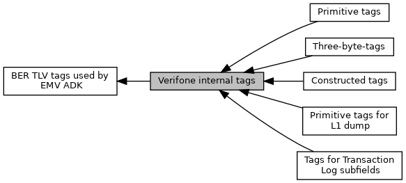

[Modules](#groups) \| [Macros](#define-members)

There are many data objects, which do not have an EMVCo defined tags. For usage of TLV interface it\'s necessary to define internal tags. [More\...](#details)

Collaboration diagram for Verifone internal tags:

|  |  |
|----|----|
| Modules |  |
|   | <a href="group___v_e_r_i___c_o_n_s_t_r___t_a_g_s.md">Constructed tags</a> |
|   | <a href="group___v_e_r_i___p_r_i_m___t_a_g_s.md">Primitive tags</a> |
|   | <a href="group___p_r_i_m___t_a_g_s__3_b_y_t_e.md">Three-byte-tags</a> |
|   | <a href="group___v_e_r_i___t_r_x___l_o_g___s_u_b_f_i_e_l_d_s.md">Tags for Transaction Log subfields</a> |
|   | <a href="group___v_e_r_i___l1___d_u_m_p___t_a_g_s.md">Primitive tags for L1 dump</a> |

|  |  |
|----|----|
| Macros |  |
| #define  | [TAG_C0_TRM_CL_CVM_LIMIT](#ga1d0660ada78e32c5aeb3da312a47f4e1)   0xC0 |
|   | CVM limit. [More\...](#ga1d0660ada78e32c5aeb3da312a47f4e1)  |
| #define  | [TAG_C1_TRM_CL_CEIL_LIMIT](#ga884cb0f58da629345ed68b59f9be86e1)   0xC1 |
|   | Ceiling limit (Contactless transaction limit) [More\...](#ga884cb0f58da629345ed68b59f9be86e1)  |
| #define  | [TAG_C2_TRM_CL_MODES](#gaa66039efd92d9d68efc76d60ed6bfef5)   0xC2 |
| #define  | [TAG_C3_INDEX](#ga55680befcbec0e54e06c2e1bd5ec1aa3)   0xC3 |
| #define  | [TAG_C4_APP_PRG_ID_LEN](#gaf9ec8be82e854fe74855f73fed9b8b66)   0xC4 |
| #define  | [TAG_C5_APP_PRG_ID](#ga7644b2476aa05aec2b1f9b587d839d90)   0xC5 |
| #define  | [TAG_C6_TXN_LIMIT](#ga6939f0b90d5f52e5e90c8cb25c9016f8)   0xC6 |
| #define  | [TAG_C7_LED_ID](#ga0483788e02fd99a29e35901f3e629ee5)   0xC7 |
|   | <a href="group___a_d_k___l_e_d.md#gabd80a7d1c3dbc5604604b02c20620f51">EMV_CTLS_LED()</a>: `ucLedId`. [More\...](#ga0483788e02fd99a29e35901f3e629ee5)  |
| #define  | [TAG_C8_LED_STATE](#ga2f34280866aca01da43759de83289fd6)   0xC8 |
|   | <a href="group___a_d_k___l_e_d.md#gabd80a7d1c3dbc5604604b02c20620f51">EMV_CTLS_LED()</a>: `ucLedState` resp. <a href="group___c_b_c_k___f_c_t___t_a_g_s.md#ga1ed48d32ca46560f8dacd954fc485bcf">TAG_BF10_CTLS_CBK_LEDS</a>. [More\...](#ga2f34280866aca01da43759de83289fd6)  |
| #define  | [TAG_C9_POLL_TIMEOUT](#gabee88da49445eeaf676bb183cdafc283)   0xC9 |
|   | <a href="group___d_e_f___f_l_o_w___i_n_p_u_t.md#a55288d912bcb810932a421b632af84aa">EMV_CTLS_START_STRUCT::ServerPollTimeout</a>. [More\...](#gabee88da49445eeaf676bb183cdafc283)  |
| #define  | [TAG_CA_DRL_ON_OFF](#gab0c43ce81a48ba0774878ef74fc09152)   0xCA |
|   | EMV_CTLS_VISA_DRL_STRUCT::OnOffSwitch. [More\...](#gab0c43ce81a48ba0774878ef74fc09152)  |
| #define  | [TAG_CB_BEEP_SCENARIO](#ga0b724e7079eee112657fd53f1e4d909e)   0xCB |
|   | Buzzer scenario in callback <a href="group___c_b_c_k___f_c_t___t_a_g_s.md#ga805fd29bb45bbc706fefd6533ee3c69f">TAG_BF19_CTLS_CBK_BEEP</a>. [More\...](#ga0b724e7079eee112657fd53f1e4d909e)  |
| #define  | [TAG_FA_VISA_DRL_RISK](#ga7c527bbe5b8cb5b50773bc455c233fb3)   0xFA |
| #define  | [TAG_FB_PP3_PMSG_TABLE](#gaaac63d67c7434add9b7f514500990e6e)   0xFB |
| #define  | [TAG_FC_EP_BF0C_FINAL_SELECT](#gacf1d8b1b365dc96d993cf1fcdbeab8c1)   0xFC |
|   | BF0C from SELECT response, can be used with <a href="group___f_u_n_c___f_l_o_w.md#ga8c9f0640ed818c3dc19da528f5f0b406">EMV_CTLS_fetchTxnTags()</a> [More\...](#gacf1d8b1b365dc96d993cf1fcdbeab8c1)  |
| #define  | [TAG_FD_AMEX_DRL_RISK](#ga548f2f4a92327e8026b1aaf0aa99093b)   0xFD |

## DetailedDescription {#detailed-description}

There are many data objects, which do not have an EMVCo defined tags. For usage of TLV interface it\'s necessary to define internal tags.

## MacroDefinition Documentation {#macro-definition-documentation}

## TAG_C0_TRM_CL_CVM_LIMIT 

#define TAG_C0_TRM_CL_CVM_LIMIT   0xC0

CVM limit.

## TAG_C1_TRM_CL_CEIL_LIMIT 

#define TAG_C1_TRM_CL_CEIL_LIMIT   0xC1

Ceiling limit (Contactless transaction limit)

## TAG_C2_TRM_CL_MODES 

#define TAG_C2_TRM_CL_MODES   0xC2

**<a href="deprecated.md#_deprecated000001">Deprecated:</a>** <a href="group___d_e_f___f_l_o_w___o_u_t_p_u_t.md#af2a0fc1109b1f50d008679aeb4db9d2f">EMV_CTLS_TRANSRES_TYPE::CL_Mode</a>

## TAG_C3_INDEX 

#define TAG_C3_INDEX   0xC3

**<a href="deprecated.md#_deprecated000002">Deprecated:</a>**

## TAG_C4_APP_PRG_ID_LEN 

#define TAG_C4_APP_PRG_ID_LEN   0xC4

**<a href="deprecated.md#_deprecated000003">Deprecated:</a>**

## TAG_C5_APP_PRG_ID 

#define TAG_C5_APP_PRG_ID   0xC5

**<a href="deprecated.md#_deprecated000004">Deprecated:</a>**

## TAG_C6_TXN_LIMIT 

#define TAG_C6_TXN_LIMIT   0xC6

**<a href="deprecated.md#_deprecated000005">Deprecated:</a>**

## TAG_C7_LED_ID 

#define TAG_C7_LED_ID   0xC7

<a href="group___a_d_k___l_e_d.md#gabd80a7d1c3dbc5604604b02c20620f51">EMV_CTLS_LED()</a>: `ucLedId`.

## TAG_C8_LED_STATE 

#define TAG_C8_LED_STATE   0xC8

<a href="group___a_d_k___l_e_d.md#gabd80a7d1c3dbc5604604b02c20620f51">EMV_CTLS_LED()</a>: `ucLedState` resp. <a href="group___c_b_c_k___f_c_t___t_a_g_s.md#ga1ed48d32ca46560f8dacd954fc485bcf">TAG_BF10_CTLS_CBK_LEDS</a>.

## TAG_C9_POLL_TIMEOUT 

#define TAG_C9_POLL_TIMEOUT   0xC9

<a href="group___d_e_f___f_l_o_w___i_n_p_u_t.md#a55288d912bcb810932a421b632af84aa">EMV_CTLS_START_STRUCT::ServerPollTimeout</a>.

## TAG_CA_DRL_ON_OFF 

#define TAG_CA_DRL_ON_OFF   0xCA

EMV_CTLS_VISA_DRL_STRUCT::OnOffSwitch.

## TAG_CB_BEEP_SCENARIO 

#define TAG_CB_BEEP_SCENARIO   0xCB

Buzzer scenario in callback <a href="group___c_b_c_k___f_c_t___t_a_g_s.md#ga805fd29bb45bbc706fefd6533ee3c69f">TAG_BF19_CTLS_CBK_BEEP</a>.

## TAG_FA_VISA_DRL_RISK 

#define TAG_FA_VISA_DRL_RISK   0xFA

**<a href="deprecated.md#_deprecated000006">Deprecated:</a>**

## TAG_FB_PP3_PMSG_TABLE 

#define TAG_FB_PP3_PMSG_TABLE   0xFB

**<a href="deprecated.md#_deprecated000007">Deprecated:</a>**

## TAG_FC_EP_BF0C_FINAL_SELECT 

#define TAG_FC_EP_BF0C_FINAL_SELECT   0xFC

BF0C from SELECT response, can be used with <a href="group___f_u_n_c___f_l_o_w.md#ga8c9f0640ed818c3dc19da528f5f0b406">EMV_CTLS_fetchTxnTags()</a>

## TAG_FD_AMEX_DRL_RISK 

#define TAG_FD_AMEX_DRL_RISK   0xFD

**<a href="deprecated.md#_deprecated000008">Deprecated:</a>**
