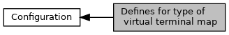

[Macros](#define-members) \| [Typedefs](#typedef-members)

Collaboration diagram for Defines for type of virtual terminal map:

|  |  |
|----|----|
| Macros |  |
| #define  | [EMV_ADK_VIRTUALTERMMAP_APPEND](#ga95979a2d5283fa88774b4e4178d2acd5)   0x01 |
|   | append one entry to virtual terminal map. [More\...](#ga95979a2d5283fa88774b4e4178d2acd5)  |
| #define  | [EMV_ADK_VIRTUALTERMMAP_DELETE_ALL](#gae4a964129fdb7a4cee6b8e1c90a8444e)   0x20 |
|   | delete whole virtual terminal map. [More\...](#gae4a964129fdb7a4cee6b8e1c90a8444e)  |

|  |  |
|----|----|
| Typedefs |  |
| typedef unsigned char  | [EMV_ADK_VIRTUALTERMMAP_TYPE](#ga8549dc337b3e6382af882edd8a4ef5dc) |
|   | typedef for \"virtual terminal map type\" (<a href="group___f_u_n_c___c_o_n_f.md#gab5d29810043af901c08736d4e9337353">EMV_CT_MapVirtualTerminal()</a>) [More\...](#ga8549dc337b3e6382af882edd8a4ef5dc)  |

## DetailedDescription {#detailed-description}

Used in <a href="group___f_u_n_c___c_o_n_f.md#gab5d29810043af901c08736d4e9337353">EMV_CT_MapVirtualTerminal()</a>

## MacroDefinition Documentation {#macro-definition-documentation}

## EMV_ADK_VIRTUALTERMMAP_APPEND 

#define EMV_ADK_VIRTUALTERMMAP_APPEND   0x01

append one entry to virtual terminal map.

## EMV_ADK_VIRTUALTERMMAP_DELETE_ALL 

#define EMV_ADK_VIRTUALTERMMAP_DELETE_ALL   0x20

delete whole virtual terminal map.

## TypedefDocumentation {#typedef-documentation}

## EMV_ADK_VIRTUALTERMMAP_TYPE 

typedef unsigned char [EMV_ADK_VIRTUALTERMMAP_TYPE](#ga8549dc337b3e6382af882edd8a4ef5dc)

typedef for \"virtual terminal map type\" (<a href="group___f_u_n_c___c_o_n_f.md#gab5d29810043af901c08736d4e9337353">EMV_CT_MapVirtualTerminal()</a>)
