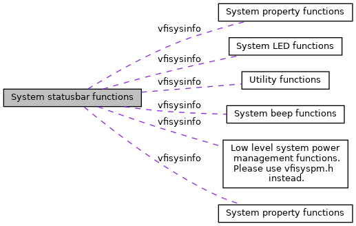

[Namespaces](#namespaces) \| [Macros](#define-members)

Collaboration diagram for System statusbar functions:

|            |                                                          |
|------------|----------------------------------------------------------|
| Namespaces |                                                          |
|            | <a href="namespacevfisysinfo.md">vfisysinfo</a> |

|          |                                                    |
|----------|----------------------------------------------------|
| Macros   |                                                    |
| #define  | [SYS_BAR_API](#ga126c91e085914983e138add8b3591cdd) |

## DetailedDescription {#detailed-description}

## MacroDefinition Documentation {#macro-definition-documentation}

## SYS_BAR_API 

#define SYS_BAR_API

