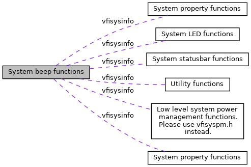

[Namespaces](#namespaces)

Collaboration diagram for System beep functions:

|            |                                                          |
|------------|----------------------------------------------------------|
| Namespaces |                                                          |
|            | <a href="namespacevfisysinfo.md">vfisysinfo</a> |

## DetailedDescription {#detailed-description}
