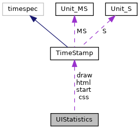

[Data Structures](#nested-classes) \| [Namespaces](#namespaces) \| [Macros](#define-members) \| [Typedefs](#typedef-members) \| [Enumerations](#enum-members) \| [Functions](#func-members)

`#include <stdarg.h>`
`#include <pthread.h>`
`#include "`<a href="guiprt_2src_2html_2jsobject_8h_source.md">jsobject.h</a>`"`
`#include "`<a href="guiprt_2src_2html_2timestamp_8h_source.md">timestamp.h</a>`"`
`#include "`<a href="gui__error_8h_source.md">gui_error.h</a>`"`
`#include "`<a href="types_8h_source.md">types.h</a>`"`
`#include "`<a href="gui__template_8h_source.md">gui_template.h</a>`"`

Include dependency graph for gui.h:

This graph shows which files directly or indirectly include this file:

<a href="gui_8h_source.md">Go to the source code of this file.</a>

|  |  |
|----|----|
| Data Structures |  |
| class   | <a href="classvfigui_1_1_u_i_c_b_data.md">UICBData</a> |
| struct   | <a href="namespacevfigui.md#structvfigui_1_1_u_i_region">UIRegion</a> |
| struct   | <a href="structvfigui_1_1_u_i_error_entry.md">UIErrorEntry</a> |
| struct   | <a href="namespacevfigui.md#structvfigui_1_1_u_i_statistics">UIStatistics</a> |
| struct   | <a href="namespacevfigui.md#structvfigui_1_1_u_i_backlight">UIBacklight</a> |
| class   | <a href="classvfigui_1_1_u_i_drawing.md">UIDrawing</a> |
| struct   | <a href="structvfigui_1_1_u_i_text_width.md">UITextWidth</a> |

|            |                                                  |
|------------|--------------------------------------------------|
| Namespaces |                                                  |
|            | <a href="namespacevfigui.md">vfigui</a> |

|  |  |
|----|----|
| Macros |  |
| #define  | <a href="group__vfigui.md#gad7c2e1cb200073ed64c64285a5f37231">DllSpec</a> |

|  |  |
|----|----|
| Typedefs |  |
| typedef bool(\*  | <a href="namespacevfigui.md#a2f8a971ed8de9b7a30c70f4a60cf2da8">uiCallback</a>) (void \*data) |
| typedef void(\*  | <a href="namespacevfigui.md#a29ea0490208725e330b8b11f770b51a7">uiAsyncCallback</a>) (void \*data, UICBType type, UICBData &uidata) |
| typedef void(\*  | <a href="namespacevfigui.md#ab8ea76e56e5a189126608d0674e79db7">uiDisconnectCallback</a>) (int display) |
| typedef void(\*  | <a href="namespacevfigui.md#a5ded57d248c0c7c8b719a61284a75453">uiEventCallback</a>) (void \*data, UICanvasEvent event, int x, int y, int key, unsigned flags) |

|  |  |
|----|----|
| Enumerations |  |
| enum   | <a href="namespacevfigui.md#a2eee911f81a366ee45341def47875e17">UICBType</a> {   <a href="namespacevfigui.md#a2eee911f81a366ee45341def47875e17ae4ef1e7d1f460d916e4691fe04640996">UI_CB_RESULT</a>, <a href="namespacevfigui.md#a2eee911f81a366ee45341def47875e17a031dabd30a2d21d9595c12e70e683c4a">UI_CB_UPDATE</a>, <a href="namespacevfigui.md#a2eee911f81a366ee45341def47875e17af65a5ab1552709eb0ceb8ecdf8d1861d">UI_CB_LOAD</a>, <a href="namespacevfigui.md#a2eee911f81a366ee45341def47875e17a7540606b129a913f5eb156021bff676b">UI_CB_ERROR_LIST</a>,   <a href="namespacevfigui.md#a2eee911f81a366ee45341def47875e17aee7d5e08608d2fab562ed5b3f516060d">UI_CB_STATISTICS</a>, <a href="namespacevfigui.md#a2eee911f81a366ee45341def47875e17a01c9cdb351c14efc871dcaeb4b5ea816">UI_CB_EVENT</a> } |
| enum   | { <a href="namespacevfigui.md#a99fb83031ce9923c84392b4e92f956b5ab7c758bc6ba3fd0e57fbb46ee178b43f">UI_REGION_DEFAULT</a> =0 } |
| enum   | { <a href="namespacevfigui.md#abc6126af1d45847bc59afa0aa3216b04aa53740e76041bfa278474eea977aa607">UI_REGION_FLAG_HIDDEN</a> =1 } |
| enum   | <a href="namespacevfigui.md#a0c064fcc5409b0845e11925a55f324bd">UIPropertyInt</a> {   <a href="namespacevfigui.md#a0c064fcc5409b0845e11925a55f324bdacd0735c01cf5c93d28977026ba79a648">UI_PROP_TIMEOUT</a> =0, <a href="namespacevfigui.md#a0c064fcc5409b0845e11925a55f324bdab3831f55519a8d598508668fa914dae1">UI_PROP_PASSWORD_CHAR</a>, <a href="namespacevfigui.md#a0c064fcc5409b0845e11925a55f324bdaaea38481b8b882ee8d15b3f89169a0f0">UI_PROP_DEFAULT_FONT_SIZE</a>, <a href="namespacevfigui.md#a0c064fcc5409b0845e11925a55f324bdad99992968807353cde482f423dca5f2c">UI_PROP_PIN_AUTO_ENTER</a>,   <a href="namespacevfigui.md#a0c064fcc5409b0845e11925a55f324bda03bb51eea83f5cb9f2f47f9a6fc6add5">UI_PROP_PIN_CLEAR_ALL</a>, <a href="namespacevfigui.md#a0c064fcc5409b0845e11925a55f324bda4f3d2b9a8136f3a8606e9ba8e66371d4">UI_PROP_PIN_BYPASS_KEY</a>, <a href="namespacevfigui.md#a0c064fcc5409b0845e11925a55f324bdab97b324cf4cec94f5e8ed7a3f9a307e8">UI_PROP_PIN_ALGORITHM</a>, <a href="namespacevfigui.md#a0c064fcc5409b0845e11925a55f324bda6cfddb13f6d62ad6cd856407cdebb06c">UI_PROP_PIN_INTERCHAR_TIMEOUT</a>,   <a href="namespacevfigui.md#a0c064fcc5409b0845e11925a55f324bdab1b06ca821561df58a2ed70f9a0ccc92">UI_PROP_PASSWORD_SHOW_CHAR</a>, <a href="namespacevfigui.md#a0c064fcc5409b0845e11925a55f324bdabd05f80f71c25bfbb4418fc079a1a150">UI_PROP_KEEP_DISPLAY</a>, <a href="namespacevfigui.md#a0c064fcc5409b0845e11925a55f324bdafe44d8907b3bc0533078ce9715273388">UI_PROP_UPDATE_EVENTS</a>, <a href="namespacevfigui.md#a0c064fcc5409b0845e11925a55f324bdaf9c20f0de4be24280c450e8e7872e8bd">UI_PROP_CIRCULAR_MENU</a>,   <a href="namespacevfigui.md#a0c064fcc5409b0845e11925a55f324bda8cb02148a645c7ab36456e9fcddf9b95">UI_PROP_TOUCH_ACTION_BEEP</a>, <a href="namespacevfigui.md#a0c064fcc5409b0845e11925a55f324bda2fd99740c5d21a35c54fb09238d5a0b5">UI_PROP_STATISTICS</a>, <a href="namespacevfigui.md#a0c064fcc5409b0845e11925a55f324bda40b0c7d4d54399a528bfdb2dc27175b6">UI_PROP_RESTRICTED</a>, <a href="namespacevfigui.md#a0c064fcc5409b0845e11925a55f324bdaf5d8c9f896a650e589294aa47a1cdfad">UI_PROP_CP_APP_MODE</a>,   <a href="namespacevfigui.md#a0c064fcc5409b0845e11925a55f324bda25861f52b93bed0a1e9332111b1e243c">UI_PROP_SCROLL_COLOR</a>, <a href="namespacevfigui.md#a0c064fcc5409b0845e11925a55f324bdafc6554130369f8897206c325c8e23a1f">UI_PROP_INPUT_ERROR_BEEP</a>, <a href="namespacevfigui.md#a0c064fcc5409b0845e11925a55f324bda88fd2bf8cb14c4c66a2606c00921fae7">UI_PROP_ZOOM_MAX</a>, <a href="namespacevfigui.md#a0c064fcc5409b0845e11925a55f324bda4cff4b22121cb90b2964bc891638a2d6">UI_PROP_SCROLL_DISPLAY</a>,   <a href="namespacevfigui.md#a0c064fcc5409b0845e11925a55f324bda03cccd4d7a09fc598eaeeec1274b920b">UI_PROP_JS_QUOTA_SIZE</a>, <a href="namespacevfigui.md#a0c064fcc5409b0845e11925a55f324bda7139a7fd1b0b96d1c37836a7fda18b38">UI_PROP_SCROLL_WIDTH</a>, <a href="namespacevfigui.md#a0c064fcc5409b0845e11925a55f324bdad63b3cc0284a91767bed25cfb2261f9d">UI_DEVICE_WIDTH</a> =1000, <a href="namespacevfigui.md#a0c064fcc5409b0845e11925a55f324bdaf40999a19159c1f5026f3d3515cf176b">UI_DEVICE_HEIGHT</a>,   <a href="namespacevfigui.md#a0c064fcc5409b0845e11925a55f324bdae10fa15d2ff73e96acb041428e3e9568">UI_DEVICE_COLOR_DEPTH</a>, <a href="namespacevfigui.md#a0c064fcc5409b0845e11925a55f324bda67a1877dcd84f02468f7dd3d8216deaa">UI_DEVICE_SUPPORTS_TOUCH</a>, <a href="namespacevfigui.md#a0c064fcc5409b0845e11925a55f324bda557915f034e4cc5a6f82560c5386bbba">UI_DEVICE_SUPPORTS_BEEPER</a>, <a href="namespacevfigui.md#a0c064fcc5409b0845e11925a55f324bdaee304caffa2da760374b80c356884578">UI_DEVICE_SUPPORTS_AUDIO</a>,   <a href="namespacevfigui.md#a0c064fcc5409b0845e11925a55f324bda36bfe29a3483020958630c322a4ebad7">UI_DEVICE_SUPPORTS_VIDEO</a>, <a href="namespacevfigui.md#a0c064fcc5409b0845e11925a55f324bdab67467a6e243a5cfd13be7739bfa3660">UI_DEVICE_SUPPORTS_SIGCAP</a>, <a href="namespacevfigui.md#a0c064fcc5409b0845e11925a55f324bda7923e4ee6701c560eceb700f5262b723">UI_DEVICE_SUPPORTS_COLOR_DISPLAY</a>, <a href="namespacevfigui.md#a0c064fcc5409b0845e11925a55f324bdad5a6c03eba25c25e4fd791342b8d12c3">UI_DEVICE_HAS_CAP_TOUCH_KEYPAD</a>,   <a href="namespacevfigui.md#a0c064fcc5409b0845e11925a55f324bdab71a3575154cd5322f5f09a582e47667">UI_DEVICE_SUPPORTS_NAVIGATOR_MODE</a>, <a href="namespacevfigui.md#a0c064fcc5409b0845e11925a55f324bda8a77a7eb32d7a1c205937d9e3b1f5fd2">UI_DEVICE_KEY_COUNT</a> } |
| enum   | <a href="namespacevfigui.md#a72b6555c0bdbb3b9869dd1f7c05f67bb">UIPropertyString</a> {   <a href="namespacevfigui.md#a72b6555c0bdbb3b9869dd1f7c05f67bba90206df4a61713d64baacc9babc82209">UI_PROP_DECIMAL_SEPARATOR</a> =2000, <a href="namespacevfigui.md#a72b6555c0bdbb3b9869dd1f7c05f67bba68500616a8bdd768f940e3b09e54e635">UI_PROP_THOUSANDS_SEPARATOR</a>, <a href="namespacevfigui.md#a72b6555c0bdbb3b9869dd1f7c05f67bba354379a4bff223f115824535059aa883">UI_PROP_DEFAULT_FONT</a>, <a href="namespacevfigui.md#a72b6555c0bdbb3b9869dd1f7c05f67bba3580ad2194aadcf2a7c56726d07f5be1">UI_PROP_RESOURCE_PATH</a>,   <a href="namespacevfigui.md#a72b6555c0bdbb3b9869dd1f7c05f67bba1a3d0abed9a947ae48c77fcedf2c9539">UI_PROP_FILE_PREFIX</a>, <a href="namespacevfigui.md#a72b6555c0bdbb3b9869dd1f7c05f67bbab9e8bf7593993c8604294fe9b1a04aae">UI_PROP_KEYMAP</a>, <a href="namespacevfigui.md#a72b6555c0bdbb3b9869dd1f7c05f67bbafd65f34cd29eeac90dc4cb00de29a0a1">UI_PROP_CSS</a>, <a href="namespacevfigui.md#a72b6555c0bdbb3b9869dd1f7c05f67bba0a899a6eb324ae727f3328167f7f2d98">UI_PROP_RESOURCE_DEFAULT_PATH</a>,   <a href="namespacevfigui.md#a72b6555c0bdbb3b9869dd1f7c05f67bba95505c1e53fa6286b7e570d6116a0058">UI_PROP_GUI_EXTENSIONS</a>, <a href="namespacevfigui.md#a72b6555c0bdbb3b9869dd1f7c05f67bba8c98c4ac330efdc3052c3af3c13f8302">UI_PROP_HTTP_HEADER_FIELDS</a>, <a href="namespacevfigui.md#a72b6555c0bdbb3b9869dd1f7c05f67bbae0f686bc77a4547c91223e3eb06fc5ba">UI_PROP_CP_APP_DIR</a>, <a href="namespacevfigui.md#a72b6555c0bdbb3b9869dd1f7c05f67bba04a19af423fbe53e0ddf28e2172add4e">UI_PROP_LANGUAGE</a>,   <a href="namespacevfigui.md#a72b6555c0bdbb3b9869dd1f7c05f67bbae21e5a8ff72c7ad7f97d921f9f949beb">UI_PROP_JS_ROOT</a>, <a href="namespacevfigui.md#a72b6555c0bdbb3b9869dd1f7c05f67bba87c8e9f6fc18ef3f22d92f1aba879de3">UI_PROP_PRINT_ROOT</a>, <a href="namespacevfigui.md#a72b6555c0bdbb3b9869dd1f7c05f67bbacb5b482c9529148a66f3a8c49a9753e3">UI_PROP_PRINT_CSS</a>, <a href="namespacevfigui.md#a72b6555c0bdbb3b9869dd1f7c05f67bba4069b7307b56f4fa4a179f50a62e3da4">UI_PROP_JS_QUOTA_ROOT</a>,   <a href="namespacevfigui.md#a72b6555c0bdbb3b9869dd1f7c05f67bba3f832f117c95a1e8cc8556e208ec3f2a">UI_DEVICE_MODEL</a> =3000 } |
| enum   | <a href="namespacevfigui.md#a84ff3a6d9454d39192c2fccc92900230">UIServerProperty</a> { <a href="namespacevfigui.md#a84ff3a6d9454d39192c2fccc92900230acb6d3a1a7ef8fe6696e2686ddfac439b">UI_SERVER_TOUCH_ACTION_BEEP</a>, <a href="namespacevfigui.md#a84ff3a6d9454d39192c2fccc92900230a10e894a7b837b3e8797a3c45a39f1b15">UI_SERVER_INPUT_ERROR_BEEP</a>, <a href="namespacevfigui.md#a84ff3a6d9454d39192c2fccc92900230a7a1c49a08b2e2aa4ddd7ad9394f1dcff">UI_SERVER_KEYMAP</a> } |
| enum   | {   <a href="namespacevfigui.md#adc29c2ff13d900c2f185ee95427fb06caa8a89070711d74453161c2bc722b45b7">UI_TRANS_UP</a> =0x1, <a href="namespacevfigui.md#adc29c2ff13d900c2f185ee95427fb06ca241672f3ee3af3bf9c4ff56ba17d7d42">UI_TRANS_RIGHT</a> =0x2, <a href="namespacevfigui.md#adc29c2ff13d900c2f185ee95427fb06ca9cf0d7df50c182fcc8cd08063f0cb968">UI_TRANS_DOWN</a> =0x4, <a href="namespacevfigui.md#adc29c2ff13d900c2f185ee95427fb06cace0b5d60b46cb03931815bf2daaf31b4">UI_TRANS_LEFT</a> =0x8,   <a href="namespacevfigui.md#adc29c2ff13d900c2f185ee95427fb06caf6455771fe797959e8140181b30ad0b8">UI_TRANS_DIRECTION_MASK</a> =0xf, <a href="namespacevfigui.md#adc29c2ff13d900c2f185ee95427fb06ca7497c218dcec541dde795f850cb54ec1">UI_TRANS_EASE_IN</a> =0x10, <a href="namespacevfigui.md#adc29c2ff13d900c2f185ee95427fb06ca35750db4673841ec626dbb9559eff0c9">UI_TRANS_EASE_OUT</a> =0x20, <a href="namespacevfigui.md#adc29c2ff13d900c2f185ee95427fb06cae036c25ff70a9317b4cffb8d8f83d735">UI_TRANS_EASE_INOUT</a> =0x30,   <a href="namespacevfigui.md#adc29c2ff13d900c2f185ee95427fb06ca61c1064bcc701954d9d7f2aaae8c49e0">UI_TRANS_EASE_MASK</a> =0x30, <a href="namespacevfigui.md#adc29c2ff13d900c2f185ee95427fb06ca21150119cb7961f2e5521427ff980831">UI_TRANS_NONE</a> =0x000, <a href="namespacevfigui.md#adc29c2ff13d900c2f185ee95427fb06ca3bbae1fdeb1ff684117766cf3a279cf7">UI_TRANS_SLIDE</a> =0x100, <a href="namespacevfigui.md#adc29c2ff13d900c2f185ee95427fb06ca8d9216db1a89eb53e83f0b557ae5c026">UI_TRANS_SLIDEON</a> =0x200,   <a href="namespacevfigui.md#adc29c2ff13d900c2f185ee95427fb06ca6839edd3b541a682705e99053ace6fc6">UI_TRANS_SWAP</a> =0x300, <a href="namespacevfigui.md#adc29c2ff13d900c2f185ee95427fb06ca9aa10c80d81837b0671059f29b6247fe">UI_TRANS_CROSSFADE</a> =0x400, <a href="namespacevfigui.md#adc29c2ff13d900c2f185ee95427fb06ca41eb3eecc9132ab7e1b3cb5e96de0ec7">UI_TRANS_TYPE_MASK</a> =0xfff00 } |
| enum   | <a href="namespacevfigui.md#ab9093178bd56d7fa93a9f14269817087">UILEDShape</a> { <a href="namespacevfigui.md#ab9093178bd56d7fa93a9f14269817087ad9c71758cfa4e04ca6df76c8bd15a1f2">UI_SHAPE_RECTANGLE</a>, <a href="namespacevfigui.md#ab9093178bd56d7fa93a9f14269817087a8a7d344d0b9202c920ed4790a1a1443b">UI_SHAPE_ELLIPSE</a> } |
| enum   | <a href="namespacevfigui.md#a953c1b2cadd586de592b1f3dc07eab7e">UIEdge</a> { <a href="namespacevfigui.md#a953c1b2cadd586de592b1f3dc07eab7ea4336eca5d4a88bfd695b374a9f54799f">UI_EDGE_TOP</a>, <a href="namespacevfigui.md#a953c1b2cadd586de592b1f3dc07eab7eae446ca2d01032490cf1062a32e0b68a3">UI_EDGE_RIGHT</a>, <a href="namespacevfigui.md#a953c1b2cadd586de592b1f3dc07eab7ea836f3413e753708c6a3da2af37023abe">UI_EDGE_BOTTOM</a>, <a href="namespacevfigui.md#a953c1b2cadd586de592b1f3dc07eab7ea1063a026e87b7c8837ff876aef8f9b1b">UI_EDGE_LEFT</a> } |
| enum   | <a href="namespacevfigui.md#a09efbc077884a4944a73602edd62f2c4">UIScrollPosition</a> { <a href="namespacevfigui.md#a09efbc077884a4944a73602edd62f2c4a5680925a69ff89175050925fb88737f7">UI_SCROLL_TOP</a>, <a href="namespacevfigui.md#a09efbc077884a4944a73602edd62f2c4a8cec25f66c4fc093fa5f31ba25588f3d">UI_SCROLL_BOTTOM</a> } |
| enum   | <a href="namespacevfigui.md#a8810a38d55f6476c22d819dfc6fc8876">UIBeep</a> { <a href="namespacevfigui.md#a8810a38d55f6476c22d819dfc6fc8876a4fb144f79440b6b39d0d0667cce2268c">UI_BEEP_NORMAL</a>, <a href="namespacevfigui.md#a8810a38d55f6476c22d819dfc6fc8876afce2759a2a4103c8463afdc9f816b43a">UI_BEEP_ERROR</a> } |
| enum   | <a href="namespacevfigui.md#a1b866918923778597a21f37a9cb6d821">UINagScreenType</a> { <a href="namespacevfigui.md#a1b866918923778597a21f37a9cb6d821a1ec8ecba7a8282c4a269df71fde3afc9">UI_NAG_TEST_DEVICE</a> } |
| enum   | <a href="namespacevfigui.md#ab39be9e8cfe25802d65abffda76e2ce9">UICanvasEvent</a> {   <a href="namespacevfigui.md#ab39be9e8cfe25802d65abffda76e2ce9a47a7b3109580461dc474a10cbfe700d9">UI_PUSH</a>, <a href="namespacevfigui.md#ab39be9e8cfe25802d65abffda76e2ce9a1f74cb11557899b29804c9b22d2f0c0e">UI_DRAG</a>, <a href="namespacevfigui.md#ab39be9e8cfe25802d65abffda76e2ce9aa8ef8a738610cb1959e62da6d32ce7aa">UI_RELEASE</a>, <a href="namespacevfigui.md#ab39be9e8cfe25802d65abffda76e2ce9ad5735fa18bce3a01daaec5963bf818db">UI_KEYDOWN</a>,   <a href="namespacevfigui.md#ab39be9e8cfe25802d65abffda76e2ce9adff731bbcbc03407e22d436bd6078aa7">UI_KEYUP</a>, <a href="namespacevfigui.md#ab39be9e8cfe25802d65abffda76e2ce9ac689065eca62d445963e73f4e42a7a7d">UI_TERMINATE</a> } |

|  |  |
|----|----|
| Functions |  |
| <a href="sound_8h.md#ad7c2e1cb200073ed64c64285a5f37231">DllSpec</a> void  | <a href="namespacevfigui.md#a82b5e57ef72c921533d54743b31b7fb2">uiSetConnectAttempts</a> (int num) |
| <a href="sound_8h.md#ad7c2e1cb200073ed64c64285a5f37231">DllSpec</a> int  | <a href="namespacevfigui.md#a75d81778a108be5377e3557f4a314c49">uiGetConnectAttempts</a> () |
| <a href="sound_8h.md#ad7c2e1cb200073ed64c64285a5f37231">DllSpec</a> void  | <a href="namespacevfigui.md#a65a2c9a477b2fdaeff369e84983affd8">uiSetDisconnectCallback</a> (uiDisconnectCallback cb) |
| <a href="sound_8h.md#ad7c2e1cb200073ed64c64285a5f37231">DllSpec</a> uiDisconnectCallback  | <a href="namespacevfigui.md#a44ec86d46a855923f7b262a4fafa3241">uiGetDisconnectCallback</a> () |
| <a href="sound_8h.md#ad7c2e1cb200073ed64c64285a5f37231">DllSpec</a> void  | <a href="namespacevfigui.md#acbd9c4046c5f740d62624e060f5cc455">uiSetKeepalive</a> (int count, int interval) |
| <a href="sound_8h.md#ad7c2e1cb200073ed64c64285a5f37231">DllSpec</a> void  | <a href="namespacevfigui.md#af4e3a2ba9b7f5189d363e118fe8a42c6">uiGetKeepalive</a> (int &count, int &interval) |
| <a href="sound_8h.md#ad7c2e1cb200073ed64c64285a5f37231">DllSpec</a> void  | <a href="namespacevfigui.md#ac7bfe0876088a31cdc9187485e047e19">uiDisconnect</a> (int display) |
| <a href="sound_8h.md#ad7c2e1cb200073ed64c64285a5f37231">DllSpec</a> int  | <a href="namespacevfigui.md#add0fbe2ab1e98634bede1d672f8b1049">uiReadRuntimeID</a> (int display, std::string &id, int timeout_msec=5000) |
| <a href="sound_8h.md#ad7c2e1cb200073ed64c64285a5f37231">DllSpec</a> std::string  | <a href="namespacevfigui.md#af8b1a2c34408a1c5b1267c0a43e4f4ee">uiPrint</a> (const char \*format,\...) |
| <a href="sound_8h.md#ad7c2e1cb200073ed64c64285a5f37231">DllSpec</a> std::string  | <a href="namespacevfigui.md#a2601c394a0761a7273046f232ca006a5">uiPrintV</a> (const char \*format, va_list va) |
| <a href="sound_8h.md#ad7c2e1cb200073ed64c64285a5f37231">DllSpec</a> int  | <a href="namespacevfigui.md#a8b97b38ea285770cf0c747710f36b86a">uiDisplayCount</a> () |
| <a href="sound_8h.md#ad7c2e1cb200073ed64c64285a5f37231">DllSpec</a> int  | <a href="namespacevfigui.md#a016ce5f26e09bf3f341484fe9b302491">uiDisplay</a> (int display, int region_id, const std::string &text) |
| <a href="sound_8h.md#ad7c2e1cb200073ed64c64285a5f37231">DllSpec</a> int  | <a href="namespacevfigui.md#afca736475af5b2ec8faca935097ffb75">uiDisplay</a> (int region_id, const std::string &text) |
| int  | <a href="namespacevfigui.md#a8494cc44676b84fbfda16ecda7178336">uiDisplay</a> (const std::string &text) |
| <a href="sound_8h.md#ad7c2e1cb200073ed64c64285a5f37231">DllSpec</a> int  | <a href="namespacevfigui.md#af330e250493b2c6546274bea96d87fca">uiInvoke</a> (int display, int region_id, <a href="namespacevfihtml.md#a53240b3eda61c045f82728814874a1f8">stringmap</a> &<a href="_web_service_wrappers_8c.md#a6e248376c0290338633d8137822eb209">value</a>, const std::string &text, uiCallback cb=0, void \*cbdata=0) |
| <a href="sound_8h.md#ad7c2e1cb200073ed64c64285a5f37231">DllSpec</a> int  | <a href="namespacevfigui.md#aa82de4c15bf16726400a8845b10b18bc">uiInvoke</a> (int region_id, <a href="namespacevfihtml.md#a53240b3eda61c045f82728814874a1f8">stringmap</a> &<a href="_web_service_wrappers_8c.md#a6e248376c0290338633d8137822eb209">value</a>, const std::string &text, uiCallback cb=0, void \*cbdata=0) |
| int  | <a href="namespacevfigui.md#a4cd07ae9a08f56122f27b38e96240622">uiInvoke</a> (<a href="namespacevfihtml.md#a53240b3eda61c045f82728814874a1f8">stringmap</a> &<a href="_web_service_wrappers_8c.md#a6e248376c0290338633d8137822eb209">value</a>, const std::string &text, uiCallback cb=0, void \*cbdata=0) |
| int  | <a href="namespacevfigui.md#a29496ad50b00842c47ab9e50cdfdc3af">uiInvoke</a> (int display, int region_id, const std::string &text, uiCallback cb=0, void \*cbdata=0) |
| int  | <a href="namespacevfigui.md#a2ed9f6f4fdc09fa553b6a9cff6318dd0">uiInvoke</a> (int region_id, const std::string &text, uiCallback cb=0, void \*cbdata=0) |
| int  | <a href="namespacevfigui.md#aacc1ef716ff7d3923319981b25df9f7a">uiInvoke</a> (const std::string &text, uiCallback cb=0, void \*cbdata=0) |
| <a href="sound_8h.md#ad7c2e1cb200073ed64c64285a5f37231">DllSpec</a> int  | <a href="namespacevfigui.md#a9b7f3db241a31f1558bec12a0b7b0578">uiInvokeTemplate</a> (int display, int region_id, <a href="namespacevfihtml.md#a53240b3eda61c045f82728814874a1f8">stringmap</a> &<a href="_web_service_wrappers_8c.md#a6e248376c0290338633d8137822eb209">value</a>, const std::string &template_name, const std::string &text, uiCallback cb=0, void \*cbdata=0) |
| <a href="sound_8h.md#ad7c2e1cb200073ed64c64285a5f37231">DllSpec</a> int  | <a href="namespacevfigui.md#ad125e62d8be0760ce2e50f71c73701d4">uiInvokeTemplate</a> (int region_id, <a href="namespacevfihtml.md#a53240b3eda61c045f82728814874a1f8">stringmap</a> &<a href="_web_service_wrappers_8c.md#a6e248376c0290338633d8137822eb209">value</a>, const std::string &template_name, const std::string &text, uiCallback cb=0, void \*cbdata=0) |
| int  | <a href="namespacevfigui.md#ab16852bef6c6a94fd96fd631d8a3d9bf">uiInvokeTemplate</a> (<a href="namespacevfihtml.md#a53240b3eda61c045f82728814874a1f8">stringmap</a> &<a href="_web_service_wrappers_8c.md#a6e248376c0290338633d8137822eb209">value</a>, const std::string &template_name, const std::string &text, uiCallback cb=0, void \*cbdata=0) |
| int  | <a href="namespacevfigui.md#ac97efb88cd31d4f1fcf30cc1e2664281">uiInvokeTemplate</a> (int display, int region_id, const std::string &template_name, const std::string &text, uiCallback cb=0, void \*cbdata=0) |
| int  | <a href="namespacevfigui.md#a7dd297f6a9064389d667ecc8e25a2a67">uiInvokeTemplate</a> (int region_id, const std::string &template_name, const std::string &text, uiCallback cb=0, void \*cbdata=0) |
| int  | <a href="namespacevfigui.md#a9f7246af56ca281d9db90a81477209c2">uiInvokeTemplate</a> (const std::string &template_name, const std::string &text, uiCallback cb=0, void \*cbdata=0) |
| <a href="sound_8h.md#ad7c2e1cb200073ed64c64285a5f37231">DllSpec</a> int  | <a href="namespacevfigui.md#af5812cac4b8cd48873fcac4608f3082d">uiInvokeURL</a> (int display, int region_id, <a href="namespacevfihtml.md#a53240b3eda61c045f82728814874a1f8">stringmap</a> &<a href="_web_service_wrappers_8c.md#a6e248376c0290338633d8137822eb209">value</a>, const char \*url, uiCallback cb=0, void \*cbdata=0) |
| <a href="sound_8h.md#ad7c2e1cb200073ed64c64285a5f37231">DllSpec</a> int  | <a href="namespacevfigui.md#ae26ec4b97b6ccb5a047e2d2bdbe77836">uiInvokeURL</a> (int region_id, <a href="namespacevfihtml.md#a53240b3eda61c045f82728814874a1f8">stringmap</a> &<a href="_web_service_wrappers_8c.md#a6e248376c0290338633d8137822eb209">value</a>, const char \*url, uiCallback cb=0, void \*cbdata=0) |
| int  | <a href="namespacevfigui.md#ac8e3a0145e4dd63bb993ceaa3a4c9991">uiInvokeURL</a> (<a href="namespacevfihtml.md#a53240b3eda61c045f82728814874a1f8">stringmap</a> &<a href="_web_service_wrappers_8c.md#a6e248376c0290338633d8137822eb209">value</a>, const char \*url, uiCallback cb=0, void \*cbdata=0) |
| int  | <a href="namespacevfigui.md#a7938fd28144f570b7d100c5e040eeaa9">uiInvokeURL</a> (int display, int region_id, const char \*url, uiCallback cb=0, void \*cbdata=0) |
| int  | <a href="namespacevfigui.md#a20a3d7e8198a57adfad068dd83dd094d">uiInvokeURL</a> (int region_id, const char \*url, uiCallback cb=0, void \*cbdata=0) |
| int  | <a href="namespacevfigui.md#af1c97d985b0b73fa2648880368e9b328">uiInvokeURL</a> (const char \*url, uiCallback cb=0, void \*cbdata=0) |
| <a href="sound_8h.md#ad7c2e1cb200073ed64c64285a5f37231">DllSpec</a> int  | <a href="namespacevfigui.md#a02cf023ea21242e5845ffdf6bb1553b7">uiInvokeURL</a> (int display, int region_id, <a href="namespacevfihtml.md#a53240b3eda61c045f82728814874a1f8">stringmap</a> &<a href="_web_service_wrappers_8c.md#a6e248376c0290338633d8137822eb209">value</a>, const std::string &url, uiCallback cb=0, void \*cbdata=0) |
| int  | <a href="namespacevfigui.md#a3d4b8e9c000df8a904681223fc8a4fbc">uiInvokeURL</a> (int region_id, <a href="namespacevfihtml.md#a53240b3eda61c045f82728814874a1f8">stringmap</a> &<a href="_web_service_wrappers_8c.md#a6e248376c0290338633d8137822eb209">value</a>, const std::string &url, uiCallback cb=0, void \*cbdata=0) |
| int  | <a href="namespacevfigui.md#a209dd0b731df45bda0b4bf2a5391240d">uiInvokeURL</a> (<a href="namespacevfihtml.md#a53240b3eda61c045f82728814874a1f8">stringmap</a> &<a href="_web_service_wrappers_8c.md#a6e248376c0290338633d8137822eb209">value</a>, const std::string &url, uiCallback cb=0, void \*cbdata=0) |
| int  | <a href="namespacevfigui.md#a3379e35ca75cf95ebdbc6129d8996724">uiInvokeURL</a> (int display, int region_id, const std::string &url, uiCallback cb=0, void \*cbdata=0) |
| int  | <a href="namespacevfigui.md#aaa6a2593d8fa1ff90490faed5247e142">uiInvokeURL</a> (int region_id, const std::string &url, uiCallback cb=0, void \*cbdata=0) |
| int  | <a href="namespacevfigui.md#adebea7c8615efacdc05e7da8952681ac">uiInvokeURL</a> (const std::string &url, uiCallback cb=0, void \*cbdata=0) |
| <a href="sound_8h.md#ad7c2e1cb200073ed64c64285a5f37231">DllSpec</a> int  | <a href="namespacevfigui.md#add2574c4d093c99c0708c23b4c92e23d">uiInvokeAsync</a> (int display, int region_id, const <a href="namespacevfihtml.md#a53240b3eda61c045f82728814874a1f8">stringmap</a> &<a href="_web_service_wrappers_8c.md#a6e248376c0290338633d8137822eb209">value</a>, const std::string &text, uiAsyncCallback cb=0, void \*data=0) |
| <a href="sound_8h.md#ad7c2e1cb200073ed64c64285a5f37231">DllSpec</a> int  | <a href="namespacevfigui.md#a753f2409eaf1889d2133bafcf7e61d68">uiInvokeAsync</a> (int region_id, const <a href="namespacevfihtml.md#a53240b3eda61c045f82728814874a1f8">stringmap</a> &<a href="_web_service_wrappers_8c.md#a6e248376c0290338633d8137822eb209">value</a>, const std::string &text, uiAsyncCallback cb=0, void \*data=0) |
| int  | <a href="namespacevfigui.md#ac2b2c7917a78c4c0b8ccb011d1e09acc">uiInvokeAsync</a> (const <a href="namespacevfihtml.md#a53240b3eda61c045f82728814874a1f8">stringmap</a> &<a href="_web_service_wrappers_8c.md#a6e248376c0290338633d8137822eb209">value</a>, const std::string &text, uiAsyncCallback cb=0, void \*data=0) |
| int  | <a href="namespacevfigui.md#abd48f321943cf1bbe299ea2c4a41d072">uiInvokeAsync</a> (int display, int region_id, const std::string &text, uiAsyncCallback cb=0, void \*data=0) |
| int  | <a href="namespacevfigui.md#aa0fa50585387defa76b00688ab9a8fb2">uiInvokeAsync</a> (int region_id, const std::string &text, uiAsyncCallback cb=0, void \*data=0) |
| int  | <a href="namespacevfigui.md#a4dfeb030d818d2b6327dd7814f6ef5a0">uiInvokeAsync</a> (const std::string &text, uiAsyncCallback cb=0, void \*data=0) |
| <a href="sound_8h.md#ad7c2e1cb200073ed64c64285a5f37231">DllSpec</a> int  | <a href="namespacevfigui.md#a2281e14acba78d6d5f32d72b2d70f77b">uiInvokeTemplateAsync</a> (int display, int region_id, const <a href="namespacevfihtml.md#a53240b3eda61c045f82728814874a1f8">stringmap</a> &<a href="_web_service_wrappers_8c.md#a6e248376c0290338633d8137822eb209">value</a>, const std::string &template_name, const std::string &text, uiAsyncCallback cb=0, void \*data=0) |
| <a href="sound_8h.md#ad7c2e1cb200073ed64c64285a5f37231">DllSpec</a> int  | <a href="namespacevfigui.md#ace0dd2491977346d7c26bda121f9fc5a">uiInvokeTemplateAsync</a> (int region_id, const <a href="namespacevfihtml.md#a53240b3eda61c045f82728814874a1f8">stringmap</a> &<a href="_web_service_wrappers_8c.md#a6e248376c0290338633d8137822eb209">value</a>, const std::string &template_name, const std::string &text, uiAsyncCallback cb=0, void \*data=0) |
| int  | <a href="namespacevfigui.md#a8f61b95dea16f7281baff6aebaf85478">uiInvokeTemplateAsync</a> (const <a href="namespacevfihtml.md#a53240b3eda61c045f82728814874a1f8">stringmap</a> &<a href="_web_service_wrappers_8c.md#a6e248376c0290338633d8137822eb209">value</a>, const std::string &template_name, const std::string &text, uiAsyncCallback cb=0, void \*data=0) |
| int  | <a href="namespacevfigui.md#a64d6f7a95be527b409cb95c434e4d5f9">uiInvokeTemplateAsync</a> (int display, int region_id, const std::string &template_name, const std::string &text, uiAsyncCallback cb=0, void \*data=0) |
| int  | <a href="namespacevfigui.md#a9579e1ca702ed055f8e379cb6838a930">uiInvokeTemplateAsync</a> (int region_id, const std::string &template_name, const std::string &text, uiAsyncCallback cb=0, void \*data=0) |
| int  | <a href="namespacevfigui.md#a68736b559c5a0ec957d40aaf621034c3">uiInvokeTemplateAsync</a> (const std::string &template_name, const std::string &text, uiAsyncCallback cb=0, void \*data=0) |
| <a href="sound_8h.md#ad7c2e1cb200073ed64c64285a5f37231">DllSpec</a> int  | <a href="namespacevfigui.md#a7144a4bea5f4f98d9b3c45d95959389b">uiInvokeURLAsync</a> (int display, int region_id, const <a href="namespacevfihtml.md#a53240b3eda61c045f82728814874a1f8">stringmap</a> &<a href="_web_service_wrappers_8c.md#a6e248376c0290338633d8137822eb209">value</a>, const char \*url, uiAsyncCallback cb=0, void \*data=0) |
| <a href="sound_8h.md#ad7c2e1cb200073ed64c64285a5f37231">DllSpec</a> int  | <a href="namespacevfigui.md#a75aa771f95566f619d9ef4fa02c53a61">uiInvokeURLAsync</a> (int region_id, const <a href="namespacevfihtml.md#a53240b3eda61c045f82728814874a1f8">stringmap</a> &<a href="_web_service_wrappers_8c.md#a6e248376c0290338633d8137822eb209">value</a>, const char \*url, uiAsyncCallback cb=0, void \*data=0) |
| int  | <a href="namespacevfigui.md#a1ec0618ea41447138849fc3c32be3c86">uiInvokeURLAsync</a> (const <a href="namespacevfihtml.md#a53240b3eda61c045f82728814874a1f8">stringmap</a> &<a href="_web_service_wrappers_8c.md#a6e248376c0290338633d8137822eb209">value</a>, const char \*url, uiAsyncCallback cb=0, void \*data=0) |
| int  | <a href="namespacevfigui.md#ab1c880bacf1a33c75e9b0bf346a3e94b">uiInvokeURLAsync</a> (int display, int region_id, const char \*url, uiAsyncCallback cb=0, void \*data=0) |
| int  | <a href="namespacevfigui.md#ae8e60a3ea452be0ec00c2fe57d8c7f5c">uiInvokeURLAsync</a> (int region_id, const char \*url, uiAsyncCallback cb=0, void \*data=0) |
| int  | <a href="namespacevfigui.md#a5a99ca667d8ac14aaeffccaa29077118">uiInvokeURLAsync</a> (const char \*url, uiAsyncCallback cb=0, void \*data=0) |
| <a href="sound_8h.md#ad7c2e1cb200073ed64c64285a5f37231">DllSpec</a> int  | <a href="namespacevfigui.md#afe482f678a4531ba58dbac63fb340ac2">uiInvokeURLAsync</a> (int display, int region_id, const <a href="namespacevfihtml.md#a53240b3eda61c045f82728814874a1f8">stringmap</a> &<a href="_web_service_wrappers_8c.md#a6e248376c0290338633d8137822eb209">value</a>, const std::string &url, uiAsyncCallback cb=0, void \*data=0) |
| int  | <a href="namespacevfigui.md#aa36daa6e9b2343149e184f3c5a399a7b">uiInvokeURLAsync</a> (int region_id, const <a href="namespacevfihtml.md#a53240b3eda61c045f82728814874a1f8">stringmap</a> &<a href="_web_service_wrappers_8c.md#a6e248376c0290338633d8137822eb209">value</a>, const std::string &url, uiAsyncCallback cb=0, void \*data=0) |
| int  | <a href="namespacevfigui.md#aeb48f4ead8e267174d647841da917274">uiInvokeURLAsync</a> (const <a href="namespacevfihtml.md#a53240b3eda61c045f82728814874a1f8">stringmap</a> &<a href="_web_service_wrappers_8c.md#a6e248376c0290338633d8137822eb209">value</a>, const std::string &url, uiAsyncCallback cb=0, void \*data=0) |
| int  | <a href="namespacevfigui.md#a607f46e880513775bde539f98680694f">uiInvokeURLAsync</a> (int display, int region_id, const std::string &url, uiAsyncCallback cb=0, void \*data=0) |
| int  | <a href="namespacevfigui.md#ad0e763c7f22e01b7afe8b52c20686aeb">uiInvokeURLAsync</a> (int region_id, const std::string &url, uiAsyncCallback cb=0, void \*data=0) |
| int  | <a href="namespacevfigui.md#a79bc9a31568a53f0be76879e1f87cd07">uiInvokeURLAsync</a> (const std::string &url, uiAsyncCallback cb=0, void \*data=0) |
| <a href="sound_8h.md#ad7c2e1cb200073ed64c64285a5f37231">DllSpec</a> int  | <a href="namespacevfigui.md#a1736105f217b0ece50660d95fa6c8b4e">uiInvokeWait</a> (int txn_id, std::map\< std::string, std::string \> &<a href="_web_service_wrappers_8c.md#a6e248376c0290338633d8137822eb209">value</a>, int timeout_msec=-1) |
| int  | <a href="namespacevfigui.md#ab8aa72661d81348a481e147dae55e62f">uiInvokeWait</a> (int txn_id, int timeout_msec=-1) |
| <a href="sound_8h.md#ad7c2e1cb200073ed64c64285a5f37231">DllSpec</a> int  | <a href="namespacevfigui.md#a151d71877a0f6426b3e2bbee47f88f0e">uiInvokeCancel</a> (int txn_id, std::map\< std::string, std::string \> &<a href="_web_service_wrappers_8c.md#a6e248376c0290338633d8137822eb209">value</a>) |
| int  | <a href="namespacevfigui.md#aa495d8f9eb8b11f9c431e97ad7c5ea48">uiInvokeCancel</a> (int txn_id) |
| <a href="sound_8h.md#ad7c2e1cb200073ed64c64285a5f37231">DllSpec</a> int  | <a href="namespacevfigui.md#a3ccd62fc69ee72f1c85f446f881446bd">uiInvokeCancelAsync</a> (int txn_id) |
| <a href="sound_8h.md#ad7c2e1cb200073ed64c64285a5f37231">DllSpec</a> int  | <a href="namespacevfigui.md#a95f72e582b6a5a19d4215120592708a9">uiInvokeURLDetached</a> (int display, int region_id, const char \*url) |
| <a href="sound_8h.md#ad7c2e1cb200073ed64c64285a5f37231">DllSpec</a> int  | <a href="namespacevfigui.md#ac603c487c81b99b609d2a885bc275490">uiInvokeURLDetached</a> (int region_id, const char \*url) |
| int  | <a href="namespacevfigui.md#a1ef56d27857daf197c533c4f9a4470d5">uiInvokeURLDetached</a> (const char \*url) |
| <a href="sound_8h.md#ad7c2e1cb200073ed64c64285a5f37231">DllSpec</a> int  | <a href="namespacevfigui.md#aea621e3bdf3f7b1fd03b455af5976d11">uiClear</a> (int display, int region_id) |
| int  | <a href="namespacevfigui.md#ac03b2873b401569d8a649d8bc7af726a">uiClear</a> (int region_id) |
| <a href="sound_8h.md#ad7c2e1cb200073ed64c64285a5f37231">DllSpec</a> int  | <a href="namespacevfigui.md#ac94648784fbac056c2d259dbfc3e50aa">uiSetPropertyInt</a> (int display, enum UIPropertyInt property, int <a href="_web_service_wrappers_8c.md#a6e248376c0290338633d8137822eb209">value</a>) |
| <a href="sound_8h.md#ad7c2e1cb200073ed64c64285a5f37231">DllSpec</a> int  | <a href="namespacevfigui.md#a9ed0a622cfa42b1ce68f4be26126c135">uiSetPropertyInt</a> (enum UIPropertyInt property, int <a href="_web_service_wrappers_8c.md#a6e248376c0290338633d8137822eb209">value</a>) |
| <a href="sound_8h.md#ad7c2e1cb200073ed64c64285a5f37231">DllSpec</a> int  | <a href="namespacevfigui.md#aff979f20dc673ae471cbac14d4b082b0">uiGetPropertyInt</a> (int display, enum UIPropertyInt property, int \*<a href="_web_service_wrappers_8c.md#a6e248376c0290338633d8137822eb209">value</a>) |
| <a href="sound_8h.md#ad7c2e1cb200073ed64c64285a5f37231">DllSpec</a> int  | <a href="namespacevfigui.md#aa41752be42e095baf01c259ca270896a">uiGetPropertyInt</a> (enum UIPropertyInt property, int \*<a href="_web_service_wrappers_8c.md#a6e248376c0290338633d8137822eb209">value</a>) |
| <a href="sound_8h.md#ad7c2e1cb200073ed64c64285a5f37231">DllSpec</a> int  | <a href="namespacevfigui.md#a3c03200cb65db47c2437f9729b87151a">uiSetPropertyString</a> (int display, enum UIPropertyString property, const char \*<a href="_web_service_wrappers_8c.md#a6e248376c0290338633d8137822eb209">value</a>) |
| <a href="sound_8h.md#ad7c2e1cb200073ed64c64285a5f37231">DllSpec</a> int  | <a href="namespacevfigui.md#ace3792ba4b0cea7b7ecd1d6fb150cc60">uiSetPropertyString</a> (enum UIPropertyString property, const char \*<a href="_web_service_wrappers_8c.md#a6e248376c0290338633d8137822eb209">value</a>) |
| int  | <a href="namespacevfigui.md#a0da88a730c997e2eb5887dbc7a8e40cc">uiSetPropertyString</a> (int display, enum UIPropertyString property, const std::string &<a href="_web_service_wrappers_8c.md#a6e248376c0290338633d8137822eb209">value</a>) |
| int  | <a href="namespacevfigui.md#a73e6560d375dfad439e518137ed19577">uiSetPropertyString</a> (enum UIPropertyString property, const std::string &<a href="_web_service_wrappers_8c.md#a6e248376c0290338633d8137822eb209">value</a>) |
| <a href="sound_8h.md#ad7c2e1cb200073ed64c64285a5f37231">DllSpec</a> int  | <a href="namespacevfigui.md#a623cbc7d8743e2e3d8498d50777fa3ad">uiGetPropertyString</a> (int display, enum UIPropertyString property, char \*<a href="_web_service_wrappers_8c.md#a6e248376c0290338633d8137822eb209">value</a>, int len) |
| <a href="sound_8h.md#ad7c2e1cb200073ed64c64285a5f37231">DllSpec</a> int  | <a href="namespacevfigui.md#a7eac3808b596fa431ee1ff1608bab62b">uiGetPropertyString</a> (enum UIPropertyString property, char \*<a href="_web_service_wrappers_8c.md#a6e248376c0290338633d8137822eb209">value</a>, int len) |
| <a href="sound_8h.md#ad7c2e1cb200073ed64c64285a5f37231">DllSpec</a> int  | <a href="namespacevfigui.md#acae11dad6e37787a7e85b4dcd3d4d786">uiGetPropertyString</a> (int display, enum UIPropertyString property, std::string &<a href="_web_service_wrappers_8c.md#a6e248376c0290338633d8137822eb209">value</a>) |
| <a href="sound_8h.md#ad7c2e1cb200073ed64c64285a5f37231">DllSpec</a> int  | <a href="namespacevfigui.md#a1ad6020f90cd47d52adbe0c71fd35cbd">uiGetPropertyString</a> (enum UIPropertyString property, std::string &<a href="_web_service_wrappers_8c.md#a6e248376c0290338633d8137822eb209">value</a>) |
| <a href="sound_8h.md#ad7c2e1cb200073ed64c64285a5f37231">DllSpec</a> int  | <a href="namespacevfigui.md#a32a889dab6f3831aa979c1c8b4483c4d">uiSetServerProperty</a> (int display, enum UIServerProperty property, const std::string &<a href="_web_service_wrappers_8c.md#a6e248376c0290338633d8137822eb209">value</a>) |
| <a href="sound_8h.md#ad7c2e1cb200073ed64c64285a5f37231">DllSpec</a> int  | <a href="namespacevfigui.md#abc71804e99267efb2c9915482e3d7925">uiGetServerProperty</a> (int display, enum UIServerProperty property, std::string &<a href="_web_service_wrappers_8c.md#a6e248376c0290338633d8137822eb209">value</a>) |
| <a href="sound_8h.md#ad7c2e1cb200073ed64c64285a5f37231">DllSpec</a> std::string  | <a href="namespacevfigui.md#a617e79a2394c49a8c9cb0c2b5aa15dbc">uiGetTerminalResourceDir</a> (int display, const std::string &www_path) |
| <a href="sound_8h.md#ad7c2e1cb200073ed64c64285a5f37231">DllSpec</a> std::string  | <a href="namespacevfigui.md#a45b314b70044f48c33586fa612c5aa75">uiGetTerminalResourceDir</a> (const std::string &www_path) |
| <a href="sound_8h.md#ad7c2e1cb200073ed64c64285a5f37231">DllSpec</a> std::string  | <a href="namespacevfigui.md#ab800f2b1c4ab30c0781a89747bf39049">uiGetKeypadType</a> (int display) |
| <a href="sound_8h.md#ad7c2e1cb200073ed64c64285a5f37231">DllSpec</a> void  | <a href="namespacevfigui.md#a7e717916b36544241bf0bc5e2242f08e">uiSetLocalProperties</a> (bool local) |
| <a href="sound_8h.md#ad7c2e1cb200073ed64c64285a5f37231">DllSpec</a> bool  | <a href="namespacevfigui.md#a7c4242334f3a30685d37f1a77bc42e9e">uiGetLocalProperties</a> () |
| <a href="sound_8h.md#ad7c2e1cb200073ed64c64285a5f37231">DllSpec</a> int  | <a href="namespacevfigui.md#af855d00b4a448abba99ca993a7b629eb">uiLayout</a> (int display, const UIRegion \*region, int regcnt, const UIRegion \*oldreg, int oldregcnt) |
| <a href="sound_8h.md#ad7c2e1cb200073ed64c64285a5f37231">DllSpec</a> int  | <a href="namespacevfigui.md#a2308e46a8b61fa63abdef60d827172c9">uiLayout</a> (const UIRegion \*region, int regcnt, const UIRegion \*oldreg, int oldregcnt) |
| <a href="sound_8h.md#ad7c2e1cb200073ed64c64285a5f37231">DllSpec</a> int  | <a href="namespacevfigui.md#a2b870737fa6f93f758500172412417c3">uiLayout</a> (int display, const UIRegion \*region, int regcnt) |
| <a href="sound_8h.md#ad7c2e1cb200073ed64c64285a5f37231">DllSpec</a> int  | <a href="namespacevfigui.md#ae1d4310482c2c5fd22af4ded6e30ec68">uiLayout</a> (const UIRegion \*region, int regcnt) |
| int  | <a href="namespacevfigui.md#a5973e71a4a5388d5eb726065251c806c">uiLayout</a> (int display, const std::vector\< UIRegion \> &reg) |
| int  | <a href="namespacevfigui.md#a64434790277988d09750ff6aa4f4adf3">uiLayout</a> (const std::vector\< UIRegion \> &reg) |
| int  | <a href="namespacevfigui.md#af0598abe1d1d654dc0d6ecc7de63349f">uiLayout</a> (int display, const std::vector\< UIRegion \> &reg, const std::vector\< UIRegion \> &oldreg) |
| int  | <a href="namespacevfigui.md#a088e9d110d91bc4ef66ae5a4ff690002">uiLayout</a> (const std::vector\< UIRegion \> &reg, const std::vector\< UIRegion \> &oldreg) |
| <a href="sound_8h.md#ad7c2e1cb200073ed64c64285a5f37231">DllSpec</a> int  | <a href="namespacevfigui.md#a1102efd15c6c51773f53f23af850d984">uiLayout</a> (int display, const char \*name) |
| <a href="sound_8h.md#ad7c2e1cb200073ed64c64285a5f37231">DllSpec</a> int  | <a href="namespacevfigui.md#a8ac6977e18c3105bf9753170bc2c762d">uiLayout</a> (const char \*name) |
| <a href="sound_8h.md#ad7c2e1cb200073ed64c64285a5f37231">DllSpec</a> int  | <a href="namespacevfigui.md#a81b3d717d2eeb276b10d2209f28fe4ba">uiGetLayout</a> (int display, std::vector\< UIRegion \> &region) |
| <a href="sound_8h.md#ad7c2e1cb200073ed64c64285a5f37231">DllSpec</a> int  | <a href="namespacevfigui.md#ab147f3a7405d7d74e0191e02ead220ca">uiGetLayout</a> (std::vector\< UIRegion \> &region) |
| <a href="sound_8h.md#ad7c2e1cb200073ed64c64285a5f37231">DllSpec</a> int  | <a href="namespacevfigui.md#a94a69e2807585364f39d692ba0e3011b">uiGetRegionSize</a> (int display, int region_id, int &width, int &height) |
| int  | <a href="namespacevfigui.md#ac053ca37ca59edfed7faccacf384f72a">uiGetRegionSize</a> (int region_id, int &width, int &height) |
| <a href="sound_8h.md#ad7c2e1cb200073ed64c64285a5f37231">DllSpec</a> int  | <a href="namespacevfigui.md#a63902ad7b3ac76cb853b5a136a4c37bb">uiEnterRegion</a> (int display, int region_id) |
| <a href="sound_8h.md#ad7c2e1cb200073ed64c64285a5f37231">DllSpec</a> int  | <a href="namespacevfigui.md#ae1b5ad17e85c54d2415b3b734243546f">uiEnterRegion</a> (int region_id) |
| <a href="sound_8h.md#ad7c2e1cb200073ed64c64285a5f37231">DllSpec</a> int  | <a href="namespacevfigui.md#ab3d02556e61ec80ef434358669b6f585">uiLeaveRegion</a> (int display) |
| <a href="sound_8h.md#ad7c2e1cb200073ed64c64285a5f37231">DllSpec</a> int  | <a href="namespacevfigui.md#a6ce8e954aefd094c8bc3ae793ab2d21b">uiLeaveRegion</a> () |
| <a href="sound_8h.md#ad7c2e1cb200073ed64c64285a5f37231">DllSpec</a> std::string  | <a href="namespacevfigui.md#a0244df175be1611bc7a85dd93c948784">uiCurrentRegionPath</a> (int display) |
| <a href="sound_8h.md#ad7c2e1cb200073ed64c64285a5f37231">DllSpec</a> std::string  | <a href="namespacevfigui.md#a4550efc3cba40e765619411c8d7e46be">uiCurrentRegionPath</a> () |
| <a href="sound_8h.md#ad7c2e1cb200073ed64c64285a5f37231">DllSpec</a> int  | <a href="namespacevfigui.md#a7c0abf751a9ab9db14ff5e5aff4b5166">uiSetCurrentRegionPath</a> (int display, const std::string &path) |
| <a href="sound_8h.md#ad7c2e1cb200073ed64c64285a5f37231">DllSpec</a> int  | <a href="namespacevfigui.md#a9fa755e87d1d00378dc8d6e53b627067">uiSetCurrentRegionPath</a> (const std::string &path) |
| <a href="sound_8h.md#ad7c2e1cb200073ed64c64285a5f37231">DllSpec</a> int  | <a href="namespacevfigui.md#a6bdba0a661bb96f7e1a6f2fdf83ff2f3">uiRegionIsVisible</a> (int display, int region_id) |
| int  | <a href="namespacevfigui.md#a42e30d569d84d36c8cdf52266c786e9d">uiRegionIsVisible</a> (int region_id) |
| <a href="sound_8h.md#ad7c2e1cb200073ed64c64285a5f37231">DllSpec</a> void  | <a href="namespacevfigui.md#ae1d86be38dabed0b93f804b91805a3d3">uiReadConfig</a> (int display) |
| <a href="sound_8h.md#ad7c2e1cb200073ed64c64285a5f37231">DllSpec</a> void  | <a href="namespacevfigui.md#ac02f0e1a367e0f7afbacd2f4f72462d4">uiReadConfig</a> () |
| <a href="sound_8h.md#ad7c2e1cb200073ed64c64285a5f37231">DllSpec</a> int  | <a href="namespacevfigui.md#ab103c683852a0d4b19695e76f90dcf82">uiSetCatalog</a> (int display, const std::string &filename) |
| <a href="sound_8h.md#ad7c2e1cb200073ed64c64285a5f37231">DllSpec</a> int  | <a href="namespacevfigui.md#a1287e55b44eac5be44111aa26dff62d2">uiSetCatalog</a> (const std::string &filename) |
| <a href="sound_8h.md#ad7c2e1cb200073ed64c64285a5f37231">DllSpec</a> std::string  | <a href="namespacevfigui.md#a4a44408bb3f87835196a3df9d7cb35ea">uiGetCatalog</a> (int display) |
| <a href="sound_8h.md#ad7c2e1cb200073ed64c64285a5f37231">DllSpec</a> std::string  | <a href="namespacevfigui.md#a725611680ba95d088972f30ef93dc6d4">uiGetCatalog</a> () |
| <a href="sound_8h.md#ad7c2e1cb200073ed64c64285a5f37231">DllSpec</a> void  | <a href="namespacevfigui.md#aac69533e0d547c76b34253f4458c525c">uiCatalogSetDelayedRelease</a> (unsigned num) |
| <a href="sound_8h.md#ad7c2e1cb200073ed64c64285a5f37231">DllSpec</a> unsigned  | <a href="namespacevfigui.md#a145a22220c96bcb561f120babf33a75f">uiCatalogGetDelayedRelease</a> () |
| <a href="sound_8h.md#ad7c2e1cb200073ed64c64285a5f37231">DllSpec</a> std::string  | <a href="namespacevfigui.md#a742c67e3b8c81268853ca4aa1302eaa6">uiGetText</a> (int display, const std::string &name, const std::string &deflt=\"\") |
| <a href="sound_8h.md#ad7c2e1cb200073ed64c64285a5f37231">DllSpec</a> std::string  | <a href="namespacevfigui.md#ac1917b2cdc02c811c2c9ad69ca23614f">uiGetText</a> (const std::string &name, const std::string &deflt=\"\") |
| <a href="sound_8h.md#ad7c2e1cb200073ed64c64285a5f37231">DllSpec</a> std::string  | <a href="namespacevfigui.md#aa8e23a4d766e1ec759c6109325ac633a">uiGetText</a> (int display, const std::string &filename, const std::string &name, const std::string &deflt) |
| <a href="sound_8h.md#ad7c2e1cb200073ed64c64285a5f37231">DllSpec</a> std::string  | <a href="namespacevfigui.md#a0d47522c23d1a4448e631bc5f3c83279">uiGetText</a> (const std::string &filename, const std::string &name, const std::string &deflt) |
| <a href="sound_8h.md#ad7c2e1cb200073ed64c64285a5f37231">DllSpec</a> int  | <a href="namespacevfigui.md#a1aa8f65012e1de871a5fdd4aaa92d0c4">uiGetHtml</a> (int display, const std::map\< std::string, std::string \> &<a href="_web_service_wrappers_8c.md#a6e248376c0290338633d8137822eb209">value</a>, const std::string &text, std::string &html) |
| <a href="sound_8h.md#ad7c2e1cb200073ed64c64285a5f37231">DllSpec</a> int  | <a href="namespacevfigui.md#a324c711ce8e6b643c9dfdd4d75e4b1fe">uiGetHtml</a> (const std::map\< std::string, std::string \> &<a href="_web_service_wrappers_8c.md#a6e248376c0290338633d8137822eb209">value</a>, const std::string &text, std::string &html) |
| <a href="sound_8h.md#ad7c2e1cb200073ed64c64285a5f37231">DllSpec</a> int  | <a href="namespacevfigui.md#a4d40320933b1af7172eece218230e821">uiGetHtmlURL</a> (int display, const std::map\< std::string, std::string \> &<a href="_web_service_wrappers_8c.md#a6e248376c0290338633d8137822eb209">value</a>, const std::string &url, std::string &html) |
| <a href="sound_8h.md#ad7c2e1cb200073ed64c64285a5f37231">DllSpec</a> int  | <a href="namespacevfigui.md#ab5c65c2de21eb90827944b29818339e9">uiGetHtmlURL</a> (const std::map\< std::string, std::string \> &<a href="_web_service_wrappers_8c.md#a6e248376c0290338633d8137822eb209">value</a>, const std::string &url, std::string &html) |
| <a href="sound_8h.md#ad7c2e1cb200073ed64c64285a5f37231">DllSpec</a> std::string  | <a href="namespacevfigui.md#a703feb5d5ee2f1f6bbfc5dac3ff48c55">uiGetURLPath</a> (int display, const std::string &url) |
| <a href="sound_8h.md#ad7c2e1cb200073ed64c64285a5f37231">DllSpec</a> std::string  | <a href="namespacevfigui.md#a9fbfc7262a6c318fc9c350c0a92a3a05">uiGetURLPath</a> (const std::string &url) |
| <a href="sound_8h.md#ad7c2e1cb200073ed64c64285a5f37231">DllSpec</a> int  | <a href="namespacevfigui.md#a1b6f8628a0f9ae48eafa86f55315ba7e">uiScreenshotPNG</a> (int display, const char \*filename) |
| <a href="sound_8h.md#ad7c2e1cb200073ed64c64285a5f37231">DllSpec</a> int  | <a href="namespacevfigui.md#a190aab1a86115eb896eeacbbda6bd606">uiScreenshotPNG</a> (const char \*filename) |
| <a href="sound_8h.md#ad7c2e1cb200073ed64c64285a5f37231">DllSpec</a> int  | <a href="namespacevfigui.md#a2574c87baaf2c30025ecfe4ccae1fa8d">uiScreenshotPNG</a> (int display, const char \*filename, int x, int y, int w, int h) |
| int  | <a href="namespacevfigui.md#a28a32b9d5541aa1b95983506d4ad6c7f">uiScreenshotPNG</a> (const char \*filename, int x, int y, int w, int h) |
| <a href="sound_8h.md#ad7c2e1cb200073ed64c64285a5f37231">DllSpec</a> int  | <a href="namespacevfigui.md#a476e8b97ea419cb7239cbcd638880006">uiScreenshotPNGData</a> (int display, std::vector\< unsigned char \> &data) |
| <a href="sound_8h.md#ad7c2e1cb200073ed64c64285a5f37231">DllSpec</a> int  | <a href="namespacevfigui.md#a7c60c796d87df62fd95412146c28a307">uiScreenshotPNGData</a> (std::vector\< unsigned char \> &data) |
| <a href="sound_8h.md#ad7c2e1cb200073ed64c64285a5f37231">DllSpec</a> int  | <a href="namespacevfigui.md#a8cb483bdcecf0b8f06bcbb04d072999d">uiScreenshotPNGData</a> (int display, std::vector\< unsigned char \> &data, int x, int y, int w, int h) |
| int  | <a href="namespacevfigui.md#a6d1773d3b1885dbd97531d28b3f289ce">uiScreenshotPNGData</a> (std::vector\< unsigned char \> &data, int x, int y, int w, int h) |
| <a href="sound_8h.md#ad7c2e1cb200073ed64c64285a5f37231">DllSpec</a> int  | <a href="namespacevfigui.md#a9591b1a690de93e3c4a98aa7a721f83f">uiURL2PNG</a> (const char \*filename, int width, int height, const std::map\< std::string, std::string \> &<a href="_web_service_wrappers_8c.md#a6e248376c0290338633d8137822eb209">value</a>, const std::string &url) |
| <a href="sound_8h.md#ad7c2e1cb200073ed64c64285a5f37231">DllSpec</a> int  | <a href="namespacevfigui.md#a016be7fe29764536c92f235eb684471d">uiURL2PNGData</a> (std::vector\< unsigned char \> &data, int width, int height, const std::map\< std::string, std::string \> &<a href="_web_service_wrappers_8c.md#a6e248376c0290338633d8137822eb209">value</a>, const std::string &url) |
| <a href="sound_8h.md#ad7c2e1cb200073ed64c64285a5f37231">DllSpec</a> int  | <a href="namespacevfigui.md#a914abf000bf14f2f5aed24c56273ca7b">uiHTML2PNG</a> (const char \*filename, int width, int height, const std::map\< std::string, std::string \> &<a href="_web_service_wrappers_8c.md#a6e248376c0290338633d8137822eb209">value</a>, const std::string &text) |
| <a href="sound_8h.md#ad7c2e1cb200073ed64c64285a5f37231">DllSpec</a> int  | <a href="namespacevfigui.md#aa969466735eb2bb92fc50d708a9f168f">uiHTML2PNGData</a> (std::vector\< unsigned char \> &data, int width, int height, const std::map\< std::string, std::string \> &<a href="_web_service_wrappers_8c.md#a6e248376c0290338633d8137822eb209">value</a>, const std::string &text) |
| const <a href="sound_8h.md#ad7c2e1cb200073ed64c64285a5f37231">DllSpec</a> char \*  | <a href="namespacevfigui.md#ad6be50feb08194512b140d6a56d93f98">uiLibVersion</a> () |
| const <a href="sound_8h.md#ad7c2e1cb200073ed64c64285a5f37231">DllSpec</a> char \*  | <a href="namespacevfigui.md#a50f3479412fe3105d4066f4e6219b578">gui_GetVersion</a> () |
| const <a href="sound_8h.md#ad7c2e1cb200073ed64c64285a5f37231">DllSpec</a> char \*  | <a href="namespacevfigui.md#a0595a6bb7288c587bf5c99220c383521">gui_GetSvcVersion</a> (int display) |
| const <a href="sound_8h.md#ad7c2e1cb200073ed64c64285a5f37231">DllSpec</a> char \*  | <a href="namespacevfigui.md#a6f6b104be963114f33362e6a2af2cce1">gui_GetSvcVersion</a> () |
| <a href="sound_8h.md#ad7c2e1cb200073ed64c64285a5f37231">DllSpec</a> int  | <a href="namespacevfigui.md#a8c1bfe6d0439d6cf0a6e30401bc97f72">uiSetTransition</a> (int display, int region_id, unsigned transtype, int duration_ms) |
| <a href="sound_8h.md#ad7c2e1cb200073ed64c64285a5f37231">DllSpec</a> int  | <a href="namespacevfigui.md#a72378ccc5306877110bc3c5a83c9f3ac">uiSetTransition</a> (int region_id, unsigned transtype, int duration_ms) |
| int  | <a href="namespacevfigui.md#af384ac04b7e3d4c8599e20696857aba9">uiSetTransition</a> (unsigned transtype, int duration_ms) |
| const <a href="sound_8h.md#ad7c2e1cb200073ed64c64285a5f37231">DllSpec</a> std::vector\< UIErrorEntry \> &  | <a href="namespacevfigui.md#aba34f6eef06a651ed7d9ce0149864af9">uiErrorList</a> () |
| const <a href="sound_8h.md#ad7c2e1cb200073ed64c64285a5f37231">DllSpec</a> UIStatistics &  | <a href="namespacevfigui.md#a24336e28feb91acfc20a2923e9efa924">uiStatistics</a> () |
| <a href="sound_8h.md#ad7c2e1cb200073ed64c64285a5f37231">DllSpec</a> std::string  | <a href="namespacevfigui.md#a6f12172a8274bd06e3f1bca6a9c4d9de">uiScriptError</a> () |
| <a href="sound_8h.md#ad7c2e1cb200073ed64c64285a5f37231">DllSpec</a> int  | <a href="namespacevfigui.md#aba3b5d38c1416e167c8e53d47f5d017b">uiGetIdleTime</a> (int display=0) |
| <a href="sound_8h.md#ad7c2e1cb200073ed64c64285a5f37231">DllSpec</a> void  | <a href="namespacevfigui.md#acad448fa6ecc86a6a9fe1c888fb02ece">uiSetLogMask</a> (unsigned mask) |
| <a href="sound_8h.md#ad7c2e1cb200073ed64c64285a5f37231">DllSpec</a> unsigned  | <a href="namespacevfigui.md#a3a15c62f2a57d17c7cf9d3e87b284267">uiGetLogMask</a> (void) |
| <a href="sound_8h.md#ad7c2e1cb200073ed64c64285a5f37231">DllSpec</a> int  | <a href="namespacevfigui.md#a1c1a705a5c98aeef8602de84d9cb7e9c">uiConfigLEDs</a> (int display, UILEDShape shape, int width, int height, unsigned off_rgba, unsigned on0_rgba, unsigned on1_rgba, unsigned on2_rgba, unsigned on3_rgba) |
| <a href="sound_8h.md#ad7c2e1cb200073ed64c64285a5f37231">DllSpec</a> int  | <a href="namespacevfigui.md#a134ca348bbdf9510cb20d8f74fc69188">uiConfigLEDs</a> (UILEDShape shape, int width, int height, unsigned off_rgba, unsigned on0_rgba, unsigned on1_rgba, unsigned on2_rgba, unsigned on3_rgba) |
| <a href="sound_8h.md#ad7c2e1cb200073ed64c64285a5f37231">DllSpec</a> int  | <a href="namespacevfigui.md#a2debe337036ea68eeab9a45c92100af7">uiConfigLEDs</a> (int display, const char \*filename) |
| <a href="sound_8h.md#ad7c2e1cb200073ed64c64285a5f37231">DllSpec</a> int  | <a href="namespacevfigui.md#a2ce39c0e56da282966166f00f8d95867">uiConfigLEDs</a> (const char \*filename) |
| <a href="sound_8h.md#ad7c2e1cb200073ed64c64285a5f37231">DllSpec</a> int  | <a href="namespacevfigui.md#a805135597b3ce4a1f776415ebdeb22d4">uiShowLEDArea</a> (int display, UIEdge edge, int width, int height, unsigned bg_rgba) |
| <a href="sound_8h.md#ad7c2e1cb200073ed64c64285a5f37231">DllSpec</a> int  | <a href="namespacevfigui.md#a9128b151b3360ef3380e02236eb396e4">uiShowLEDArea</a> (UIEdge edge, int width, int height, unsigned bg_rgba) |
| <a href="sound_8h.md#ad7c2e1cb200073ed64c64285a5f37231">DllSpec</a> int  | <a href="namespacevfigui.md#a838a0e3e4a7230d791dbea64c3f5398b">uiHideLEDArea</a> (int display) |
| <a href="sound_8h.md#ad7c2e1cb200073ed64c64285a5f37231">DllSpec</a> int  | <a href="namespacevfigui.md#aca6beb2abadaebfb2af604aeb836b5f9">uiHideLEDArea</a> () |
| <a href="sound_8h.md#ad7c2e1cb200073ed64c64285a5f37231">DllSpec</a> int  | <a href="namespacevfigui.md#aeeb84d055718fd760d2db795f5c7159c">uiSetLED</a> (int display, unsigned led, bool state) |
| <a href="sound_8h.md#ad7c2e1cb200073ed64c64285a5f37231">DllSpec</a> int  | <a href="namespacevfigui.md#a2d552e5f0863af3ad7aeb9789c6f0e0c">uiSetLED</a> (unsigned led, bool state) |
| <a href="sound_8h.md#ad7c2e1cb200073ed64c64285a5f37231">DllSpec</a> int  | <a href="namespacevfigui.md#ac23c57f93cde8fd315c9730cff1e199f">uiSetBacklightConfig</a> (int display, const std::vector\< UIBacklight \> &levels) |
| <a href="sound_8h.md#ad7c2e1cb200073ed64c64285a5f37231">DllSpec</a> int  | <a href="namespacevfigui.md#a84dbe3f9f4ba9bdb6f5d6e86220b17f8">uiGetBacklightConfig</a> (int display, std::vector\< UIBacklight \> &levels) |
| <a href="sound_8h.md#ad7c2e1cb200073ed64c64285a5f37231">DllSpec</a> int  | <a href="namespacevfigui.md#a6f1182c769b590e85cd0e62dbcb46fc4">uiSetBacklightLevel</a> (int display, int level) |
| <a href="sound_8h.md#ad7c2e1cb200073ed64c64285a5f37231">DllSpec</a> int  | <a href="namespacevfigui.md#ab5737b28abc50bdf419763e7f3e8c476">uiGetBacklightLevel</a> (int display, int &level) |
| <a href="sound_8h.md#ad7c2e1cb200073ed64c64285a5f37231">DllSpec</a> int  | <a href="namespacevfigui.md#a068db1d363c4d36a444f1a86f198d3f4">uiSetInput</a> (int display, int region_id, const std::string &name, const std::string &<a href="_web_service_wrappers_8c.md#a6e248376c0290338633d8137822eb209">value</a>) |
| int  | <a href="namespacevfigui.md#a72fcffe0e977430ec6e159edc9f37863">uiSetInput</a> (int region_id, const std::string &name, const std::string &<a href="_web_service_wrappers_8c.md#a6e248376c0290338633d8137822eb209">value</a>) |
| <a href="sound_8h.md#ad7c2e1cb200073ed64c64285a5f37231">DllSpec</a> int  | <a href="namespacevfigui.md#a82e45a48b655b42d50b4428c4245f917">uiRunAction</a> (int display, int region_id, const std::string &name) |
| int  | <a href="namespacevfigui.md#afb940cb2a741ac6647694c077fd5b01f">uiRunAction</a> (int region_id, const std::string &name) |
| <a href="sound_8h.md#ad7c2e1cb200073ed64c64285a5f37231">DllSpec</a> int  | <a href="namespacevfigui.md#ab651b84144ad71093985dc06d541415f">uiRunAction2</a> (int display, int region_id, const std::string &name) |
| int  | <a href="namespacevfigui.md#a53334623e82aad1f5ad24f2990891183">uiRunAction2</a> (int region_id, const std::string &name) |
| <a href="sound_8h.md#ad7c2e1cb200073ed64c64285a5f37231">DllSpec</a> int  | <a href="namespacevfigui.md#ab45a226e8e8b51af7a6b966e4a1e3b9d">uiAddOption</a> (int display, int region_id, const std::string &name, const std::string &<a href="_web_service_wrappers_8c.md#a6e248376c0290338633d8137822eb209">value</a>, const std::string &text, const std::string &style=\"\", const std::string &action=\"\", int position=-1) |
| int  | <a href="namespacevfigui.md#a1015c2e749c417375eb07a87be83115d">uiAddOption</a> (int region_id, const std::string &name, const std::string &<a href="_web_service_wrappers_8c.md#a6e248376c0290338633d8137822eb209">value</a>, const std::string &text, const std::string &style=\"\", const std::string &action=\"\", int position=-1) |
| <a href="sound_8h.md#ad7c2e1cb200073ed64c64285a5f37231">DllSpec</a> int  | <a href="namespacevfigui.md#a708b83cb207311e9ee0ce89fdbc64b2b">uiScrollOption</a> (int display, int region_id, const std::string &name, const std::string &<a href="_web_service_wrappers_8c.md#a6e248376c0290338633d8137822eb209">value</a>, UIScrollPosition pos) |
| int  | <a href="namespacevfigui.md#a9b5cf25b433267281eed58a43269ecb8">uiScrollOption</a> (int region_id, const std::string &name, const std::string &<a href="_web_service_wrappers_8c.md#a6e248376c0290338633d8137822eb209">value</a>, UIScrollPosition pos) |
| <a href="sound_8h.md#ad7c2e1cb200073ed64c64285a5f37231">DllSpec</a> int  | <a href="namespacevfigui.md#a127a7511d72753958ee9568cbe56addc">uiRemoveOption</a> (int display, int region_id, const std::string &name, const std::string &<a href="_web_service_wrappers_8c.md#a6e248376c0290338633d8137822eb209">value</a>) |
| int  | <a href="namespacevfigui.md#a91540198a82cf57a06e8e4b3962272b4">uiRemoveOption</a> (int region_id, const std::string &name, const std::string &<a href="_web_service_wrappers_8c.md#a6e248376c0290338633d8137822eb209">value</a>) |
| <a href="sound_8h.md#ad7c2e1cb200073ed64c64285a5f37231">DllSpec</a> int  | <a href="namespacevfigui.md#a2b9dd85f581cd18f44ac0f6e2e298a02">uiDisablePINOK</a> (int display=0) |
| <a href="sound_8h.md#ad7c2e1cb200073ed64c64285a5f37231">DllSpec</a> int  | <a href="namespacevfigui.md#a507a546dba483793386d45565eac84e7">uiEnablePINOK</a> (int display=0) |
| <a href="sound_8h.md#ad7c2e1cb200073ed64c64285a5f37231">DllSpec</a> int  | <a href="namespacevfigui.md#ab3d6c9c83c3b9c6cded334180a5dbc54">uiUpdate</a> (int display, int region_id, const std::string &name, const std::string &html) |
| int  | <a href="namespacevfigui.md#a5308d7d8d56f446e4f66be3eebe6eb34">uiUpdate</a> (int region_id, const std::string &name, const std::string &html) |
| <a href="sound_8h.md#ad7c2e1cb200073ed64c64285a5f37231">DllSpec</a> int  | <a href="namespacevfigui.md#af6e906366931be49e599366c1618e06f">uiBeep</a> (int display, UIBeep beep) |
| int  | <a href="namespacevfigui.md#a2b44558ec990325748ca107b6839e841">uiBeep</a> (UIBeep beep) |
| <a href="sound_8h.md#ad7c2e1cb200073ed64c64285a5f37231">DllSpec</a> int  | <a href="namespacevfigui.md#a51199b2daa138383c44d62efb596267f">uiNagScreen</a> (int display, enum UINagScreenType type, int hide, int show) |
| <a href="sound_8h.md#ad7c2e1cb200073ed64c64285a5f37231">DllSpec</a> int  | <a href="namespacevfigui.md#a4f50c305f35961d8b4571fbd01d12c2c">uiCanvas</a> (int display, int region_id, uiEventCallback cb, void \*data=0) |
| int  | <a href="namespacevfigui.md#ae7f512a15498b2a7a5e49d237381fddf">uiCanvas</a> (int region_id, uiEventCallback cb, void \*data=0) |
| <a href="sound_8h.md#ad7c2e1cb200073ed64c64285a5f37231">DllSpec</a> int  | <a href="namespacevfigui.md#a59738042ac30693d8958da57b7a2e884">uiDraw</a> (int display, int region_id, const UIDrawing &drawing) |
| int  | <a href="namespacevfigui.md#af552cd7e86e5777747e40dec0f637fdf">uiDraw</a> (int region_id, const UIDrawing &drawing) |
| <a href="sound_8h.md#ad7c2e1cb200073ed64c64285a5f37231">DllSpec</a> int  | <a href="namespacevfigui.md#a913ea01e97aab7a98098ba2a53a4fd19">uiDrawAsync</a> (int display, int region_id, const UIDrawing &drawing, uiAsyncCallback cb=0, void \*data=0) |
| int  | <a href="namespacevfigui.md#a045bc5d515a9474781924826e8542dc8">uiDrawAsync</a> (int region_id, const UIDrawing &drawing, uiAsyncCallback cb=0, void \*data=0) |
| <a href="sound_8h.md#ad7c2e1cb200073ed64c64285a5f37231">DllSpec</a> int  | <a href="namespacevfigui.md#a7a8977fe87e931923e1ce8b4cf458643">uiTextMetrics</a> (int display, int region_id, const std::string &font, int size, unsigned style, std::vector\< UITextWidth \> &width, int &height, int &descent) |
| int  | <a href="namespacevfigui.md#a83fbf6e1275e851ec71bfc99efa6c03d">uiTextMetrics</a> (int region_id, const std::string &font, int size, unsigned style, std::vector\< UITextWidth \> &width, int &height, int &descent) |
| const <a href="sound_8h.md#ad7c2e1cb200073ed64c64285a5f37231">DllSpec</a> char \*  | <a href="namespacevfigui.md#aefeddf255ffe45c5a8ae06cca4b55e1e">uiDataURLType</a> (const std::string &in) |
| <a href="sound_8h.md#ad7c2e1cb200073ed64c64285a5f37231">DllSpec</a> bool  | <a href="namespacevfigui.md#a2285cfd3a19cfe70d5c9ab5bb02a5c64">uiDataURLToString</a> (std::string &out, const std::string &in) |
| <a href="sound_8h.md#ad7c2e1cb200073ed64c64285a5f37231">DllSpec</a> bool  | <a href="namespacevfigui.md#a4d0003af3471b1179db3249777c66471">uiDataURLToFile</a> (const char \*filename, const std::string &in) |

------------------------------------------------------------------------

## DataStructure Documentation {#data-structure-documentation}

## vfigui::UIRegion 

struct vfigui::UIRegion

structure describing the position and size of an output region

| Data Fields |  |  |
|----|----|----|
| int | bottom | 
bottom position in pixels (+=height if negative)
 |
| int | flags | 
flags: UI_REGION_FLAG_HIDDEN
 |
| int | id | 
region ID, 0 is the default region
 |
| int | left | 
left position in pixels (+=width if negative)
 |
| int | right | 
right position in pixels (+=width if negative)
 |
| int | top | 
top position in pixels (+=height if negative)
 |

## vfigui::UIStatistics 

struct vfigui::UIStatistics

Statistics information

Collaboration diagram for UIStatistics:

\[<a href="graph_legend.md">legend</a>\]

| Data Fields |  |  |
|----|----|----|
| <a href="classvfihtml_1_1_time_stamp.md">TimeStamp</a> | css | 
css loading and parsing has finished
 |
| <a href="classvfihtml_1_1_time_stamp.md">TimeStamp</a> | draw | 
sending drawing commands to gfx system has finished (initial drawing of the HTML page)
 |
| <a href="classvfihtml_1_1_time_stamp.md">TimeStamp</a> | html | 
html loading, parsing and layout has finished
 |
| <a href="classvfihtml_1_1_time_stamp.md">TimeStamp</a> | start | 
starting time
 |

## vfigui::UIBacklight 

struct vfigui::UIBacklight

backlight brightness level

| Data Fields |  |  |
|----|----|----|
| unsigned | brightness | 
brightness level (0..100)
 |
| unsigned | timeout | 
timeout in milliseconds after which to switch to the next level (if there is another one)
 |
