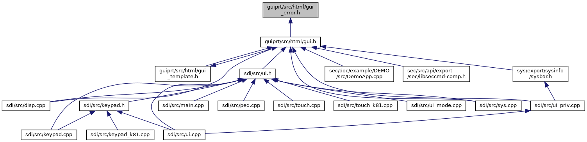

[Enumerations](#enum-members)

This graph shows which files directly or indirectly include this file:

<a href="gui__error_8h_source.md">Go to the source code of this file.</a>

|  |  |
|----|----|
| Enumerations |  |
| enum   | <a href="group__vfigui.md#ga83f7c4e297519549c9a54137e2eab4fe">UIError</a> {   <a href="group__vfigui.md#gga83f7c4e297519549c9a54137e2eab4fea0e9295b37bfaa07f3b8e2b2f666bcb08">UI_ERR_OK</a> = 0, <a href="group__vfigui.md#gga83f7c4e297519549c9a54137e2eab4fea6dc64819a8719e862f267b4c31adaa2b">UI_ERR_ABORT</a> = -1, <a href="group__vfigui.md#gga83f7c4e297519549c9a54137e2eab4fea15472ee6eda060f2cf3b851873c6d36d">UI_ERR_BACK</a> = -2, <a href="group__vfigui.md#gga83f7c4e297519549c9a54137e2eab4fea25c0f4789a50189db529c844fbc5395b">UI_ERR_TIMEOUT</a> = -3,   <a href="group__vfigui.md#gga83f7c4e297519549c9a54137e2eab4feadbe8a9e9b76ccd414fe3298b7c0fb547">UI_ERR_PROPERTY</a> = -4, <a href="group__vfigui.md#gga83f7c4e297519549c9a54137e2eab4fea0feebab162cfb6cdcee4d17207ce129a">UI_ERR_WRONG_PIN</a> = -5, <a href="group__vfigui.md#gga83f7c4e297519549c9a54137e2eab4fea4fb70ece1e94f28779bba6389188e2de">UI_ERR_PARAMETER</a> = -6, <a href="group__vfigui.md#gga83f7c4e297519549c9a54137e2eab4feab947423fdbe03bf4ee7d4132a7470271">UI_ERR_PERMISSION</a> = -7,   <a href="group__vfigui.md#gga83f7c4e297519549c9a54137e2eab4feae72b16ac91ed2f069ed4e315c0a66879">UI_ERR_CANCELLED</a> = -8, <a href="group__vfigui.md#gga83f7c4e297519549c9a54137e2eab4feadbd688cec162b05d77aab8797757c186">UI_ERR_REGION</a> = -9, <a href="group__vfigui.md#gga83f7c4e297519549c9a54137e2eab4fea0a03c8c4c8aeebc5f13764f769f42f4c">UI_ERR_FAIL</a> = -10, <a href="group__vfigui.md#gga83f7c4e297519549c9a54137e2eab4fea781613b007357a1ac3bb993fe3b3762e">UI_ERR_UNSUPPORTED</a> = -11,   <a href="group__vfigui.md#gga83f7c4e297519549c9a54137e2eab4fea2c2b0c364f6e000b6095f46251bce01d">UI_ERR_INVALID</a> = -12, <a href="group__vfigui.md#gga83f7c4e297519549c9a54137e2eab4fea4f30958efdaaa591b1c9a6fa002c8052">UI_ERR_WAIT_TIMEOUT</a> = -13, <a href="group__vfigui.md#gga83f7c4e297519549c9a54137e2eab4fea2ee7809161321af15ef84d5655faeb38">UI_ERR_CONNECTION_LOST</a> = -14, <a href="group__vfigui.md#gga83f7c4e297519549c9a54137e2eab4fea96cc0295432f6a49261ad54fe52480ee">UI_ERR_PROTOCOL</a> = -15,   <a href="group__vfigui.md#gga83f7c4e297519549c9a54137e2eab4fea3a64249431f7850af3d70beb6003e656">UI_ERR_SCRIPT</a> = -16, <a href="group__vfigui.md#gga83f7c4e297519549c9a54137e2eab4feab1e3d97746123a542bab13edcfdc9b6a">UI_ERR_FILE_READ</a> = -17, <a href="group__vfigui.md#gga83f7c4e297519549c9a54137e2eab4fea8114356c722648f4ee88fd9478c790b7">UI_ERR_RESTRICTED</a> = -18, <a href="group__vfigui.md#gga83f7c4e297519549c9a54137e2eab4feab37b7cd2ae744a5e47a8ef15c1b0a738">UI_ERR_MODIFIED</a> = -19,   <a href="group__vfigui.md#gga83f7c4e297519549c9a54137e2eab4fea53bd48814f477e41d8ef8698e1416502">UI_ERR_ACTION</a> = -20, <a href="group__vfigui.md#gga83f7c4e297519549c9a54137e2eab4fea0f0b76a16470d668ca5249cce7984e28">UI_ERR_DISPLAY</a> = -21, <a href="group__vfigui.md#gga83f7c4e297519549c9a54137e2eab4fea8f9428454f7865ce15b6fdc8e0ac46b3">UI_ERR_PIN_ENTRY_DENIED</a> = -22 } |
