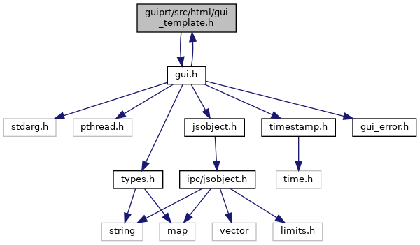
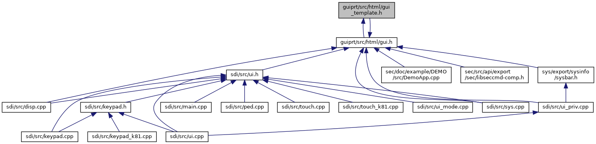

[Data Structures](#nested-classes) \| [Namespaces](#namespaces) \| [Macros](#define-members) \| [Enumerations](#enum-members) \| [Functions](#func-members)

`#include "`<a href="gui_8h_source.md">gui.h</a>`"`

Include dependency graph for gui_template.h:

This graph shows which files directly or indirectly include this file:

<a href="gui__template_8h_source.md">Go to the source code of this file.</a>

|  |  |
|----|----|
| Data Structures |  |
| struct   | <a href="namespacevfigui.md#structvfigui_1_1_u_i_menu_entry">UIMenuEntry</a> |

|            |                                                  |
|------------|--------------------------------------------------|
| Namespaces |                                                  |
|            | <a href="namespacevfigui.md">vfigui</a> |

|  |  |
|----|----|
| Macros |  |
| #define  | <a href="group__vfigui.md#gad7c2e1cb200073ed64c64285a5f37231">DllSpec</a> |

|  |  |
|----|----|
| Enumerations |  |
| enum   | <a href="namespacevfigui.md#aa90b029c4b564092e6cdb23f518b6bb8">UIMenuOptions</a> { <a href="namespacevfigui.md#aa90b029c4b564092e6cdb23f518b6bb8a60b7fb3952f82aa365ac1d4e13335797">UI_MENU_DISABLED</a> =1 } |

|  |  |
|----|----|
| Functions |  |
| <a href="sound_8h.md#ad7c2e1cb200073ed64c64285a5f37231">DllSpec</a> int  | <a href="namespacevfigui.md#ad8a2161c5d5a12d5555951b2f6b103df">uiDisplay</a> (int display, int region_id, const std::string &templateName, const std::string &text) |
| <a href="sound_8h.md#ad7c2e1cb200073ed64c64285a5f37231">DllSpec</a> int  | <a href="namespacevfigui.md#ae1cbfaf2abb0590395fbf5261db6669d">uiDisplay</a> (int region_id, const std::string &templateName, const std::string &text) |
| int  | <a href="namespacevfigui.md#a7dfffbe598f9b851ce1494efcf7c7016">uiDisplay</a> (const std::string &templateName, const std::string &text) |
| <a href="sound_8h.md#ad7c2e1cb200073ed64c64285a5f37231">DllSpec</a> int  | <a href="namespacevfigui.md#a7ef65e67ea8ea8f74e8473bb3b393567">uiDisplayAsync</a> (int display, int region_id, const std::string &text, uiAsyncCallback cb=0, void \*data=0) |
| <a href="sound_8h.md#ad7c2e1cb200073ed64c64285a5f37231">DllSpec</a> int  | <a href="namespacevfigui.md#a0981cb984ea5389bd4f6a2b8d98011c3">uiDisplayAsync</a> (int region_id, const std::string &text, uiAsyncCallback cb=0, void \*data=0) |
| int  | <a href="namespacevfigui.md#a07e92040457dc9b34b784f5ca7eb8613">uiDisplayAsync</a> (const std::string &text, uiAsyncCallback cb=0, void \*data=0) |
| <a href="sound_8h.md#ad7c2e1cb200073ed64c64285a5f37231">DllSpec</a> int  | <a href="namespacevfigui.md#aa8c8c7cd53187a0ddaf1ad952ac2fa89">uiDisplayAsync</a> (int display, int region_id, const std::string &templateName, const std::string &text, uiAsyncCallback cb=0, void \*data=0) |
| <a href="sound_8h.md#ad7c2e1cb200073ed64c64285a5f37231">DllSpec</a> int  | <a href="namespacevfigui.md#ab7b5e17d8c22f9f234f938163a55ed35">uiDisplayAsync</a> (int region_id, const std::string &templateName, const std::string &text, uiAsyncCallback cb=0, void \*data=0) |
| int  | <a href="namespacevfigui.md#a6eac13906076612f805ab58793a43cce">uiDisplayAsync</a> (const std::string &templateName, const std::string &text, uiAsyncCallback cb=0, void \*data=0) |
| <a href="sound_8h.md#ad7c2e1cb200073ed64c64285a5f37231">DllSpec</a> int  | <a href="namespacevfigui.md#a8579cb74c1f8b3d0d855d7b8ca06f462">uiDisplayWait</a> (int txn_id, int timeout_msec=-1) |
| <a href="sound_8h.md#ad7c2e1cb200073ed64c64285a5f37231">DllSpec</a> int  | <a href="namespacevfigui.md#a30b5d12037b46ee2ab8261bd9edcc047">uiConfirm</a> (int display, int region_id, const std::string &templateName, const std::string &text, uiCallback cb=0, void \*cbdata=0) |
| <a href="sound_8h.md#ad7c2e1cb200073ed64c64285a5f37231">DllSpec</a> int  | <a href="namespacevfigui.md#aa69b25bb68c919f8a8e27a4850ed741d">uiConfirm</a> (int region_id, const std::string &templateName, const std::string &text, uiCallback cb=0, void \*cbdata=0) |
| int  | <a href="namespacevfigui.md#a9f4db443faab5f8a3c9fbccf81229451">uiConfirm</a> (const std::string &templateName, const std::string &text, uiCallback cb=0, void \*cbdata=0) |
| <a href="sound_8h.md#ad7c2e1cb200073ed64c64285a5f37231">DllSpec</a> int  | <a href="namespacevfigui.md#a6bfa2fed6af97902225d42d89f7e6598">uiConfirmAsync</a> (int display, int region_id, const std::string &templateName, const std::string &text, uiAsyncCallback cb=0, void \*data=0) |
| <a href="sound_8h.md#ad7c2e1cb200073ed64c64285a5f37231">DllSpec</a> int  | <a href="namespacevfigui.md#a57dc5b62e7f7fb17adaa60bc70cb4b4e">uiConfirmAsync</a> (int region_id, const std::string &templateName, const std::string &text, uiAsyncCallback cb=0, void \*data=0) |
| int  | <a href="namespacevfigui.md#a820f14caba76881f193b683b8f464ceb">uiConfirmAsync</a> (const std::string &templateName, const std::string &text, uiAsyncCallback cb=0, void \*data=0) |
| <a href="sound_8h.md#ad7c2e1cb200073ed64c64285a5f37231">DllSpec</a> int  | <a href="namespacevfigui.md#a932cb60db6f53cfe8bc8759d05e6e09e">uiConfirmWait</a> (int txn_id, int timeout_msec=-1) |
| <a href="sound_8h.md#ad7c2e1cb200073ed64c64285a5f37231">DllSpec</a> int  | <a href="namespacevfigui.md#abc2e22a493f5dbdb8bfad06dd187d51a">uiInput</a> (int display, int region_id, const std::string &templateName, std::vector\< std::string \> &<a href="_web_service_wrappers_8c.md#a6e248376c0290338633d8137822eb209">value</a>, const std::string &text, uiCallback cb=0, void \*cbdata=0) |
| <a href="sound_8h.md#ad7c2e1cb200073ed64c64285a5f37231">DllSpec</a> int  | <a href="namespacevfigui.md#a1f7eb2e08d981c8985042e63f99a8c00">uiInput</a> (int region_id, const std::string &templateName, std::vector\< std::string \> &<a href="_web_service_wrappers_8c.md#a6e248376c0290338633d8137822eb209">value</a>, const std::string &text, uiCallback cb=0, void \*cbdata=0) |
| int  | <a href="namespacevfigui.md#a3945d4b563dba269f81f03506e1672e5">uiInput</a> (const std::string &templateName, std::vector\< std::string \> &<a href="_web_service_wrappers_8c.md#a6e248376c0290338633d8137822eb209">value</a>, const std::string &text, uiCallback cb=0, void \*cbdata=0) |
| <a href="sound_8h.md#ad7c2e1cb200073ed64c64285a5f37231">DllSpec</a> int  | <a href="namespacevfigui.md#a6c27e35cafa80cbcc8464b472a8346f7">uiInputAsync</a> (int display, int region_id, const std::string &templateName, const std::vector\< std::string \> &<a href="_web_service_wrappers_8c.md#a6e248376c0290338633d8137822eb209">value</a>, const std::string &text, uiAsyncCallback cb=0, void \*data=0) |
| <a href="sound_8h.md#ad7c2e1cb200073ed64c64285a5f37231">DllSpec</a> int  | <a href="namespacevfigui.md#aa7ff3a4e3261b4ebacbf7f8d193fa337">uiInputAsync</a> (int region_id, const std::string &templateName, const std::vector\< std::string \> &<a href="_web_service_wrappers_8c.md#a6e248376c0290338633d8137822eb209">value</a>, const std::string &text, uiAsyncCallback cb=0, void \*data=0) |
| int  | <a href="namespacevfigui.md#af464dd48aaf1446db4f0c0b8b8f1b571">uiInputAsync</a> (const std::string &templateName, const std::vector\< std::string \> &<a href="_web_service_wrappers_8c.md#a6e248376c0290338633d8137822eb209">value</a>, const std::string &text, uiAsyncCallback cb=0, void \*data=0) |
| <a href="sound_8h.md#ad7c2e1cb200073ed64c64285a5f37231">DllSpec</a> int  | <a href="namespacevfigui.md#afebb1f35d2b398978a3fc6baf6a72e3e">uiInputWait</a> (int txn_id, std::vector\< std::string \> &<a href="_web_service_wrappers_8c.md#a6e248376c0290338633d8137822eb209">value</a>, int timeout_msec=-1) |
| <a href="sound_8h.md#ad7c2e1cb200073ed64c64285a5f37231">DllSpec</a> int  | <a href="namespacevfigui.md#a89a70f269a838ac0cf8011856f1e7882">uiInputPINCheck</a> (int display, int region_id, const std::string &templateName, const std::string &referencePIN, const std::string &text, uiCallback cb=0, void \*cbdata=0) |
| <a href="sound_8h.md#ad7c2e1cb200073ed64c64285a5f37231">DllSpec</a> int  | <a href="namespacevfigui.md#afc9d66509cc8c12b2e9a0f6236cabb92">uiInputPINCheck</a> (int region_id, const std::string &templateName, const std::string &referencePIN, const std::string &text, uiCallback cb=0, void \*cbdata=0) |
| int  | <a href="namespacevfigui.md#a40aa14783303e452b6f82ad687a26eed">uiInputPINCheck</a> (const std::string &templateName, const std::string &referencePIN, const std::string &text, uiCallback cb=0, void \*cbdata=0) |
| <a href="sound_8h.md#ad7c2e1cb200073ed64c64285a5f37231">DllSpec</a> int  | <a href="namespacevfigui.md#af83bcb0d3c6baa8de991d79d81014b87">uiInputPINCheckAsync</a> (int display, int region_id, const std::string &templateName, const std::string &referencePIN, const std::string &text, uiAsyncCallback cb=0, void \*data=0) |
| <a href="sound_8h.md#ad7c2e1cb200073ed64c64285a5f37231">DllSpec</a> int  | <a href="namespacevfigui.md#a704739c768ff6350c1d163aaa5deb3a1">uiInputPINCheckAsync</a> (int region_id, const std::string &templateName, const std::string &referencePIN, const std::string &text, uiAsyncCallback cb=0, void \*data=0) |
| int  | <a href="namespacevfigui.md#abc8bc6e55c13d89e51d5a174dabf7e99">uiInputPINCheckAsync</a> (const std::string &templateName, const std::string &referencePIN, const std::string &text, uiAsyncCallback cb=0, void \*data=0) |
| <a href="sound_8h.md#ad7c2e1cb200073ed64c64285a5f37231">DllSpec</a> int  | <a href="namespacevfigui.md#ae23c072e72e864549ed92e34d7eba717">uiInputPINCheckWait</a> (int txn_id, int timeout_msec=-1) |
| <a href="sound_8h.md#ad7c2e1cb200073ed64c64285a5f37231">DllSpec</a> int  | <a href="namespacevfigui.md#a98d3ffe172afda1fbc4586f09af7606c">uiMenu</a> (int display, int region_id, const std::string &templateName, const std::string &text, const struct UIMenuEntry menu\[\], int menusize, int preselect, uiCallback cb=0, void \*cbdata=0) |
| <a href="sound_8h.md#ad7c2e1cb200073ed64c64285a5f37231">DllSpec</a> int  | <a href="namespacevfigui.md#a51553a615e55eb90a3a5b9da1a0b55c0">uiMenu</a> (int region_id, const std::string &templateName, const std::string &text, const struct UIMenuEntry menu\[\], int menusize, int preselect, uiCallback cb=0, void \*cbdata=0) |
| int  | <a href="namespacevfigui.md#a9b7020c4f8fb93cd3b19df1d1064b106">uiMenu</a> (const std::string &templateName, const std::string &text, const struct UIMenuEntry menu\[\], int menusize, int preselect, uiCallback cb=0, void \*cbdata=0) |
| <a href="sound_8h.md#ad7c2e1cb200073ed64c64285a5f37231">DllSpec</a> int  | <a href="namespacevfigui.md#abce089ab208df1ad1bfa04561f3d322c">uiMenuAsync</a> (int display, int region_id, const std::string &templateName, const std::string &text, const struct UIMenuEntry menu\[\], int menusize, int preselect, uiAsyncCallback cb=0, void \*data=0) |
| <a href="sound_8h.md#ad7c2e1cb200073ed64c64285a5f37231">DllSpec</a> int  | <a href="namespacevfigui.md#a5e360bdfb7050535067e3fcd93176769">uiMenuAsync</a> (int region_id, const std::string &templateName, const std::string &text, const struct UIMenuEntry menu\[\], int menusize, int preselect, uiAsyncCallback cb=0, void \*data=0) |
| int  | <a href="namespacevfigui.md#a02210718552d1e11062bb7823f7bf630">uiMenuAsync</a> (const std::string &template_name, const std::string &text, const struct UIMenuEntry menu\[\], int menusize, int preselect, uiAsyncCallback cb=0, void \*data=0) |
| <a href="sound_8h.md#ad7c2e1cb200073ed64c64285a5f37231">DllSpec</a> int  | <a href="namespacevfigui.md#a7bcce0289e8d528e362c8da5657ffafb">uiMenuWait</a> (int txn_id, int timeout_msec=-1) |

------------------------------------------------------------------------

## DataStructure Documentation {#data-structure-documentation}

## vfigui::UIMenuEntry 

struct vfigui::UIMenuEntry

structure for menu entries

### Examples

<a href="demo-sysinfo_8cpp-example.md#_a2">demo-sysinfo.cpp</a>, <a href="mac_demo1_8cpp-example.md#_a10">mac_demo1.cpp</a>, <a href="mac_demo2_8cpp-example.md#_a3">mac_demo2.cpp</a>, and <a href="pm-demo_8cpp-example.md#_a6">pm-demo.cpp</a>.

| Data Fields |  |  |
|----|----|----|
| unsigned | options | 
options, see <a href="namespacevfigui.md#aa90b029c4b564092e6cdb23f518b6bb8">vfigui::UIMenuOptions</a>
 |
| string | text | 
text to be displayed
 |
| int | value | 
return value
 |
