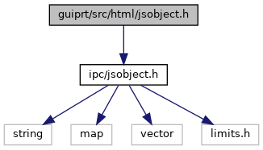
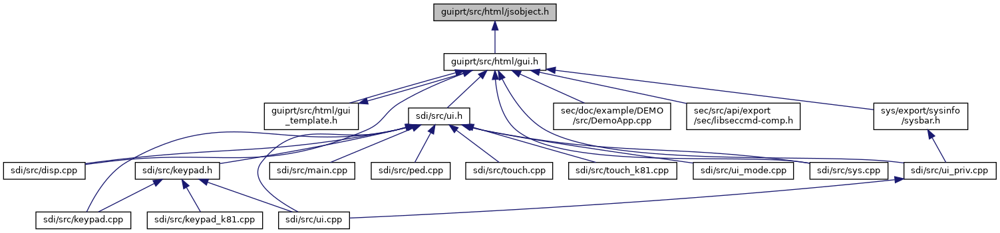

[Namespaces](#namespaces) \| [Typedefs](#typedef-members)

`#include <`<a href="ipc_2src_2ipc_2jsobject_8h_source.md">ipc/jsobject.h</a>`>`

Include dependency graph for jsobject.h:

This graph shows which files directly or indirectly include this file:

<a href="guiprt_2src_2html_2jsobject_8h_source.md">Go to the source code of this file.</a>

|            |                                                    |
|------------|----------------------------------------------------|
| Namespaces |                                                    |
|            | <a href="namespacevfihtml.md">vfihtml</a> |

|  |  |
|----|----|
| Typedefs |  |
| typedef <a href="classvfiipc_1_1_j_s_object.md">vfiipc::JSObject</a>  | <a href="namespacevfihtml.md#aae7be032793c509f7d46a8e251b0f0e5">JSObject</a> |
