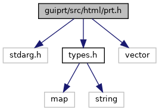

[Data Structures](#nested-classes) \| [Namespaces](#namespaces) \| [Macros](#define-members) \| [Typedefs](#typedef-members) \| [Enumerations](#enum-members) \| [Functions](#func-members)

`#include <stdarg.h>`
`#include "`<a href="types_8h_source.md">types.h</a>`"`
`#include <vector>`

Include dependency graph for prt.h:

This graph shows which files directly or indirectly include this file:

<a href="guiprt_2src_2html_2prt_8h_source.md">Go to the source code of this file.</a>

|  |  |
|----|----|
| Data Structures |  |
| struct   | <a href="namespacevfiprt.md#structvfiprt_1_1prt_control_seq">prtControlSeq</a> |
| struct   | <a href="structvfiprt_1_1_prt_error_entry.md">PrtErrorEntry</a> |

|            |                                                    |
|------------|----------------------------------------------------|
| Namespaces |                                                    |
|            | <a href="namespacevfihtml.md">vfihtml</a> |
|            | <a href="namespacevfiprt.md">vfiprt</a>   |

|  |  |
|----|----|
| Macros |  |
| #define  | <a href="group__vfiprt.md#gad7c2e1cb200073ed64c64285a5f37231">DllSpec</a> |

|  |  |
|----|----|
| Typedefs |  |
| typedef void(\*  | <a href="namespacevfiprt.md#a3691bc12eb8cadf581fb757005ff07c0">prtAsyncCallback</a>) (void \*data) |

|  |  |
|----|----|
| Enumerations |  |
| enum   | <a href="namespacevfiprt.md#aabb64aaac27500bf4b3b419feff87361">PrtError</a> {   <a href="namespacevfiprt.md#aabb64aaac27500bf4b3b419feff87361af2ad9f75739b523e78df0375ad38a546">PRT_OK</a> = 0, <a href="namespacevfiprt.md#aabb64aaac27500bf4b3b419feff87361a8de6b77dc9ed09b215c1999c7e2ba06b">PRT_BUSY</a> = -1, <a href="namespacevfiprt.md#aabb64aaac27500bf4b3b419feff87361a97c7d651a078ac337e76812e2c065ee8">PRT_PAPERJAM</a> = -2, <a href="namespacevfiprt.md#aabb64aaac27500bf4b3b419feff87361ad9c03d6e1ea575ed6f996d945d83a945">PRT_HEADOPEN</a> = -3,   <a href="namespacevfiprt.md#aabb64aaac27500bf4b3b419feff87361a800ccbd12989598a0bfd6aa12141776c">PRT_PAPEREND</a> = -4, <a href="namespacevfiprt.md#aabb64aaac27500bf4b3b419feff87361a429988d9a2c4de64c091c963c53de39f">PRT_OVERHEAT</a> = -5, <a href="namespacevfiprt.md#aabb64aaac27500bf4b3b419feff87361a41e79c4dbe0869fdf53de2ac223a6c55">PRT_OVERVOLTAGE</a> = -6, <a href="namespacevfiprt.md#aabb64aaac27500bf4b3b419feff87361a4b5ae5a3826908d62ba457037a20f78d">PRT_UNDERVOLTAGE</a> = -7,   <a href="namespacevfiprt.md#aabb64aaac27500bf4b3b419feff87361ae4bf0cf9fc2178e4bab2ee0ddfbb1cbc">PRT_FAIL</a> = -8, <a href="namespacevfiprt.md#aabb64aaac27500bf4b3b419feff87361aac2c7fd5e450078cf3bb9758edc78814">PRT_SCRIPT_ERROR</a> = -9, <a href="namespacevfiprt.md#aabb64aaac27500bf4b3b419feff87361a7e51c5aeff1f987d71f6fe16119f026a">PRT_NO_PRINTER</a> = -10, <a href="namespacevfiprt.md#aabb64aaac27500bf4b3b419feff87361a51b6df7a298542d249f367a54894cd9d">PRT_BATTERY</a> = -11,   <a href="namespacevfiprt.md#aabb64aaac27500bf4b3b419feff87361a297f389a033f12741f24a0f347095d24">PRT_UNSUPPORTED</a> = -20, <a href="namespacevfiprt.md#aabb64aaac27500bf4b3b419feff87361a2f640a533852c2707eea294cb3933f9f">PRT_INVALID_PARAM</a> = -21, <a href="namespacevfiprt.md#aabb64aaac27500bf4b3b419feff87361a85a47068700f032f8d72becd0aa2eb74">PRT_NO_RESOURCE</a> = -22, <a href="namespacevfiprt.md#aabb64aaac27500bf4b3b419feff87361ae7f67c7703e39bd2a4a798ef85e27486">PRT_FILE_NOT_FOUND</a> = -23,   <a href="namespacevfiprt.md#aabb64aaac27500bf4b3b419feff87361ae4cc3e5e3cf9534c40aa61aeeb782c36">PRT_PROTOCOL</a> = -24, <a href="namespacevfiprt.md#aabb64aaac27500bf4b3b419feff87361a4c222cd1b09ce981bbaffbf59ebe4448">PRT_FINAL_RESULT</a> =- 40, <a href="namespacevfiprt.md#aabb64aaac27500bf4b3b419feff87361a39eb412b95f0ff2a5a14b6eaadd8d4d3">PRT_TIMEOUT</a> = -41 } |
|   | List of general errors. <a href="namespacevfiprt.md#aabb64aaac27500bf4b3b419feff87361">More...</a>  |
| enum   | <a href="namespacevfiprt.md#aee9be45580d5cde27d2a82b09fe3c601">PrtMode</a> { <a href="namespacevfiprt.md#aee9be45580d5cde27d2a82b09fe3c601a2f0f079bd5a47252c0a92a2815571c9e">PRT_PREFER_GRAPHICS</a>, <a href="namespacevfiprt.md#aee9be45580d5cde27d2a82b09fe3c601aac04ca493dd2c33ce7f7f002512f6adf">PRT_PREFER_TEXT</a> } |
| enum   | <a href="namespacevfiprt.md#a5616550e7b7e340d3e599ba1aece137e">PrtPropertyInt</a> {   <a href="namespacevfiprt.md#a5616550e7b7e340d3e599ba1aece137eaba9ed34792864ba187e6f566646c332c">PRT_PROP_STATE</a> =0, <a href="namespacevfiprt.md#a5616550e7b7e340d3e599ba1aece137ea2ec3622f20fade62b56f6a4e70700f67">PRT_PROP_HEAD_TEMP</a>, <a href="namespacevfiprt.md#a5616550e7b7e340d3e599ba1aece137ea831996db2dee9c1379d132faebfc5265">PRT_PROP_HEAD_VOLTAGE</a>, <a href="namespacevfiprt.md#a5616550e7b7e340d3e599ba1aece137ea9f148531a2103e693f187c9ef9e4900a">PRT_PROP_PIXEL_WIDTH</a>,   <a href="namespacevfiprt.md#a5616550e7b7e340d3e599ba1aece137eae1a48bed741d94116f0de8ac98ee1467">PRT_PROP_CONTRAST</a>, <a href="namespacevfiprt.md#a5616550e7b7e340d3e599ba1aece137ea84903dc1a82acf8fa15799764fd4fec9">PRT_PROP_DEFAULT_FONT_SIZE</a>, <a href="namespacevfiprt.md#a5616550e7b7e340d3e599ba1aece137ea892e6822d26fbab553e7bc00c16c45f6">PRT_PROP_PRINT_MODE</a>, <a href="namespacevfiprt.md#a5616550e7b7e340d3e599ba1aece137ead9e51751423f88f62d12e2ca667952cf">PRT_PROP_JS_QUOTA_SIZE</a> } |
|   | List of numeric properties. <a href="namespacevfiprt.md#a5616550e7b7e340d3e599ba1aece137e">More...</a>  |
| enum   | <a href="namespacevfiprt.md#a063ad187f3b6a77eca82feb4065ed489">PrtPropertyString</a> {   <a href="namespacevfiprt.md#a063ad187f3b6a77eca82feb4065ed489a9e3541d8c5a98671d1e726b0a1d8c761">PRT_PROP_RESOURCE_PATH</a>, <a href="namespacevfiprt.md#a063ad187f3b6a77eca82feb4065ed489a3d1b36a7accd9f3c505b5754387e9106">PRT_PROP_FILE_PREFIX</a>, <a href="namespacevfiprt.md#a063ad187f3b6a77eca82feb4065ed489a2e165b58fb4bf74d7629a586dc5f5ae7">PRT_PROP_DEFAULT_FONT</a>, <a href="namespacevfiprt.md#a063ad187f3b6a77eca82feb4065ed489ab737a13ee98ce5fd500b427ba5d8cf67">PRT_PROP_CSS</a>,   <a href="namespacevfiprt.md#a063ad187f3b6a77eca82feb4065ed489a2ed0ec6d59747c0dc048457a4a34e1c8">PRT_PROP_INIFILE</a>, <a href="namespacevfiprt.md#a063ad187f3b6a77eca82feb4065ed489a5f0e296615e2361384076a4ade07019a">PRT_PROP_JS_ROOT</a>, <a href="namespacevfiprt.md#a063ad187f3b6a77eca82feb4065ed489a05cea7e1ceff37cacb88af05a96c7fad">PRT_PROP_DEVICE</a>, <a href="namespacevfiprt.md#a063ad187f3b6a77eca82feb4065ed489a2a431689e041726a97f3fe918ca741f8">PRT_PROP_JS_QUOTA_ROOT</a>,   <a href="namespacevfiprt.md#a063ad187f3b6a77eca82feb4065ed489aa245985ba6ce25fee7880af2238928af">PRT_PROP_CP_APP_DIR</a> } |
|   | List of string properties. <a href="namespacevfiprt.md#a063ad187f3b6a77eca82feb4065ed489">More...</a>  |

|  |  |
|----|----|
| Functions |  |
| bool  | <a href="namespacevfiprt.md#ab5aada82cb359dbc6a74d478ee7d46df">prtFinalResult</a> (int x) |
| <a href="sound_8h.md#ad7c2e1cb200073ed64c64285a5f37231">DllSpec</a> int  | <a href="namespacevfiprt.md#a4226eb3c80a05a57e1bdcae1d802b7fb">prtSetPropertyInt</a> (enum PrtPropertyInt property, int <a href="_web_service_wrappers_8c.md#a6e248376c0290338633d8137822eb209">value</a>) |
| <a href="sound_8h.md#ad7c2e1cb200073ed64c64285a5f37231">DllSpec</a> int  | <a href="namespacevfiprt.md#a328666bdb869598ae87db05f5376fa5b">prtGetPropertyInt</a> (enum PrtPropertyInt property, int \*<a href="_web_service_wrappers_8c.md#a6e248376c0290338633d8137822eb209">value</a>) |
| <a href="sound_8h.md#ad7c2e1cb200073ed64c64285a5f37231">DllSpec</a> int  | <a href="namespacevfiprt.md#a019a78a3989581d2412ac274c1cf3401">prtSetPropertyString</a> (enum PrtPropertyString property, const char \*<a href="_web_service_wrappers_8c.md#a6e248376c0290338633d8137822eb209">value</a>) |
| int  | <a href="namespacevfiprt.md#a53397309ce5cc150bb54a289066a082b">prtSetPropertyString</a> (enum PrtPropertyString property, const std::string &<a href="_web_service_wrappers_8c.md#a6e248376c0290338633d8137822eb209">value</a>) |
| <a href="sound_8h.md#ad7c2e1cb200073ed64c64285a5f37231">DllSpec</a> int  | <a href="namespacevfiprt.md#a5f28969939265c39c352b0e78d0871c0">prtGetPropertyString</a> (enum PrtPropertyString property, char \*<a href="_web_service_wrappers_8c.md#a6e248376c0290338633d8137822eb209">value</a>, int len) |
| <a href="sound_8h.md#ad7c2e1cb200073ed64c64285a5f37231">DllSpec</a> int  | <a href="namespacevfiprt.md#a6d204c112d27f61000bc6343b2f45a22">prtGetPropertyString</a> (enum PrtPropertyString property, std::string &<a href="_web_service_wrappers_8c.md#a6e248376c0290338633d8137822eb209">value</a>) |
| <a href="sound_8h.md#ad7c2e1cb200073ed64c64285a5f37231">DllSpec</a> std::string  | <a href="namespacevfiprt.md#a5d53221623bd3d71eba771b097209ebb">prtFormat</a> (const char \*format,\...) |
| <a href="sound_8h.md#ad7c2e1cb200073ed64c64285a5f37231">DllSpec</a> std::string  | <a href="namespacevfiprt.md#a7087e0d1c8dbbb4ddb7c96f2906c0edc">prtFormatV</a> (const char \*format, va_list va) |
| <a href="sound_8h.md#ad7c2e1cb200073ed64c64285a5f37231">DllSpec</a> enum PrtError  | <a href="namespacevfiprt.md#a31b1c26648a592e4e93cd559e10b7d75">prtURL</a> (const <a href="namespacevfihtml.md#a53240b3eda61c045f82728814874a1f8">stringmap</a> &<a href="_web_service_wrappers_8c.md#a6e248376c0290338633d8137822eb209">value</a>, const char \*url, bool landscape=false) |
| enum PrtError  | <a href="namespacevfiprt.md#a810bf85ce9c0f3e1707750267aa7e401">prtURL</a> (const <a href="namespacevfihtml.md#a53240b3eda61c045f82728814874a1f8">stringmap</a> &<a href="_web_service_wrappers_8c.md#a6e248376c0290338633d8137822eb209">value</a>, const std::string &url, bool landscape=false) |
| enum PrtError  | <a href="namespacevfiprt.md#a38d5bb87f971afe9f7e9a815e5f82d57">prtURL</a> (const char \*url, bool landscape=false) |
| enum PrtError  | <a href="namespacevfiprt.md#a345d67f849bbabf6bf4b63d03cc66046">prtURL</a> (const std::string &url, bool landscape=false) |
| <a href="sound_8h.md#ad7c2e1cb200073ed64c64285a5f37231">DllSpec</a> enum PrtError  | <a href="namespacevfiprt.md#afe19510258113242e1b45a44a81fd27c">prtHTML</a> (const <a href="namespacevfihtml.md#a53240b3eda61c045f82728814874a1f8">stringmap</a> &<a href="_web_service_wrappers_8c.md#a6e248376c0290338633d8137822eb209">value</a>, const std::string &text, bool landscape=false) |
| enum PrtError  | <a href="namespacevfiprt.md#ad9eef43e35a159f1bdadf10705e6f9c6">prtHTML</a> (const std::string &text, bool landscape=false) |
| <a href="sound_8h.md#ad7c2e1cb200073ed64c64285a5f37231">DllSpec</a> enum PrtError  | <a href="namespacevfiprt.md#a8de43d45ffeef13d5c41c2e21bea48e9">prtURLAsync</a> (const <a href="namespacevfihtml.md#a53240b3eda61c045f82728814874a1f8">stringmap</a> &<a href="_web_service_wrappers_8c.md#a6e248376c0290338633d8137822eb209">value</a>, const char \*url, bool landscape=false, prtAsyncCallback cb=0, void \*cbdata=0) |
| enum PrtError  | <a href="namespacevfiprt.md#a6b468947807758e2e79df38538804708">prtURLAsync</a> (const <a href="namespacevfihtml.md#a53240b3eda61c045f82728814874a1f8">stringmap</a> &<a href="_web_service_wrappers_8c.md#a6e248376c0290338633d8137822eb209">value</a>, const std::string &url, bool landscape=false, prtAsyncCallback cb=0, void \*cbdata=0) |
| enum PrtError  | <a href="namespacevfiprt.md#abc632fae0d62e53379723f35b13dce7f">prtURLAsync</a> (const char \*url, bool landscape=false, prtAsyncCallback cb=0, void \*cbdata=0) |
| enum PrtError  | <a href="namespacevfiprt.md#a186a4c8cd2f927b80c6a537c617ae92b">prtURLAsync</a> (const std::string &url, bool landscape=false, prtAsyncCallback cb=0, void \*cbdata=0) |
| <a href="sound_8h.md#ad7c2e1cb200073ed64c64285a5f37231">DllSpec</a> enum PrtError  | <a href="namespacevfiprt.md#ad52f1a074846b76e2b85c3a495fbe211">prtHTMLAsync</a> (const <a href="namespacevfihtml.md#a53240b3eda61c045f82728814874a1f8">stringmap</a> &<a href="_web_service_wrappers_8c.md#a6e248376c0290338633d8137822eb209">value</a>, const std::string &text, bool landscape=false, prtAsyncCallback cb=0, void \*cbdata=0) |
| enum PrtError  | <a href="namespacevfiprt.md#a41983b7c56c6c991abac955ba15ea1e0">prtHTMLAsync</a> (const std::string &text, bool landscape=false, prtAsyncCallback cb=0, void \*cbdata=0) |
| <a href="sound_8h.md#ad7c2e1cb200073ed64c64285a5f37231">DllSpec</a> enum PrtError  | <a href="namespacevfiprt.md#a83f7a62f65843e99ed9cbb9b9e40f643">prtWait</a> (int timeout_msec=-1) |
| <a href="sound_8h.md#ad7c2e1cb200073ed64c64285a5f37231">DllSpec</a> enum PrtError  | <a href="namespacevfiprt.md#aaae2a4a5f9812176ccfb58301fa6f53c">prtURL2PNG</a> (const char \*destfile, int width, const <a href="namespacevfihtml.md#a53240b3eda61c045f82728814874a1f8">stringmap</a> &<a href="_web_service_wrappers_8c.md#a6e248376c0290338633d8137822eb209">value</a>, const char \*url, bool landscape=false) |
| enum PrtError  | <a href="namespacevfiprt.md#a054b7b38b39b0d94422bb68481b704d7">prtURL2PNG</a> (const std::string &destfile, int width, const <a href="namespacevfihtml.md#a53240b3eda61c045f82728814874a1f8">stringmap</a> &<a href="_web_service_wrappers_8c.md#a6e248376c0290338633d8137822eb209">value</a>, const char \*url, bool landscape=false) |
| enum PrtError  | <a href="namespacevfiprt.md#a19e23768c6942423b6361ba37adb2511">prtURL2PNG</a> (const char \*destfile, int width, const <a href="namespacevfihtml.md#a53240b3eda61c045f82728814874a1f8">stringmap</a> &<a href="_web_service_wrappers_8c.md#a6e248376c0290338633d8137822eb209">value</a>, const std::string &url, bool landscape=false) |
| enum PrtError  | <a href="namespacevfiprt.md#a330b2630efc51f8d3636b1265cfecd0d">prtURL2PNG</a> (const std::string &destfile, int width, const <a href="namespacevfihtml.md#a53240b3eda61c045f82728814874a1f8">stringmap</a> &<a href="_web_service_wrappers_8c.md#a6e248376c0290338633d8137822eb209">value</a>, const std::string &url, bool landscape=false) |
| enum PrtError  | <a href="namespacevfiprt.md#acfab62a558524ed8957f67089dc7ab58">prtURL2PNG</a> (const char \*destfile, int width, const char \*url, bool landscape=false) |
| enum PrtError  | <a href="namespacevfiprt.md#a962dc49cb48b697319d41cbe8c805c30">prtURL2PNG</a> (const std::string &destfile, int width, const char \*url, bool landscape=false) |
| enum PrtError  | <a href="namespacevfiprt.md#a9b7f3018f44a8cbec64aa1555faeeb09">prtURL2PNG</a> (const char \*destfile, int width, const std::string &url, bool landscape=false) |
| enum PrtError  | <a href="namespacevfiprt.md#a4ec8edf8499b43e8cefa1d0d0ad0d67d">prtURL2PNG</a> (const std::string &destfile, int width, const std::string &url, bool landscape=false) |
| <a href="sound_8h.md#ad7c2e1cb200073ed64c64285a5f37231">DllSpec</a> enum PrtError  | <a href="namespacevfiprt.md#a68b5d075c73ff3ae0be5ccce9afc1d33">prtHTML2PNG</a> (const char \*destfile, int width, const <a href="namespacevfihtml.md#a53240b3eda61c045f82728814874a1f8">stringmap</a> &<a href="_web_service_wrappers_8c.md#a6e248376c0290338633d8137822eb209">value</a>, const std::string &text, bool landscape=false) |
| enum PrtError  | <a href="namespacevfiprt.md#af4dea83f2276e04f338d949e6f31d183">prtHTML2PNG</a> (const char \*destfile, int width, const std::string &text, bool landscape=false) |
| enum PrtError  | <a href="namespacevfiprt.md#a0ecc3a65a8f7b9d6440defaeb6de99fe">prtHTML2PNG</a> (const std::string &destfile, int width, const std::string &text, bool landscape=false) |
| <a href="sound_8h.md#ad7c2e1cb200073ed64c64285a5f37231">DllSpec</a> enum PrtError  | <a href="namespacevfiprt.md#acf30cbb37e339d1ebe62ca90a8822951">prtURL2ColorPNG</a> (const char \*destfile, int width, const <a href="namespacevfihtml.md#a53240b3eda61c045f82728814874a1f8">stringmap</a> &<a href="_web_service_wrappers_8c.md#a6e248376c0290338633d8137822eb209">value</a>, const char \*url, bool landscape=false) |
| enum PrtError  | <a href="namespacevfiprt.md#a90f17ca1c729b01fd3a7dd47c1420533">prtURL2ColorPNG</a> (const std::string &destfile, int width, const <a href="namespacevfihtml.md#a53240b3eda61c045f82728814874a1f8">stringmap</a> &<a href="_web_service_wrappers_8c.md#a6e248376c0290338633d8137822eb209">value</a>, const char \*url, bool landscape=false) |
| enum PrtError  | <a href="namespacevfiprt.md#a1d69bd9429e18e3aa99e998b8059f6fe">prtURL2ColorPNG</a> (const char \*destfile, int width, const <a href="namespacevfihtml.md#a53240b3eda61c045f82728814874a1f8">stringmap</a> &<a href="_web_service_wrappers_8c.md#a6e248376c0290338633d8137822eb209">value</a>, const std::string &url, bool landscape=false) |
| enum PrtError  | <a href="namespacevfiprt.md#a1b9968e73f69b8dcf85828a868fb7d35">prtURL2ColorPNG</a> (const std::string &destfile, int width, const <a href="namespacevfihtml.md#a53240b3eda61c045f82728814874a1f8">stringmap</a> &<a href="_web_service_wrappers_8c.md#a6e248376c0290338633d8137822eb209">value</a>, const std::string &url, bool landscape=false) |
| enum PrtError  | <a href="namespacevfiprt.md#a0d35889a54a1682202ec7a795e4fcd28">prtURL2ColorPNG</a> (const char \*destfile, int width, const char \*url, bool landscape=false) |
| enum PrtError  | <a href="namespacevfiprt.md#aa1c8664b1f6cb8b5198589250d184986">prtURL2ColorPNG</a> (const std::string &destfile, int width, const char \*url, bool landscape=false) |
| enum PrtError  | <a href="namespacevfiprt.md#a027f7e400ef3aed22ab14ea03df81c38">prtURL2ColorPNG</a> (const char \*destfile, int width, const std::string &url, bool landscape=false) |
| enum PrtError  | <a href="namespacevfiprt.md#ad6fd8f2cc4935bb66f3c94348e768055">prtURL2ColorPNG</a> (const std::string &destfile, int width, const std::string &url, bool landscape=false) |
| <a href="sound_8h.md#ad7c2e1cb200073ed64c64285a5f37231">DllSpec</a> enum PrtError  | <a href="namespacevfiprt.md#ace7941298deb1c71520d2ccc1f59aae5">prtHTML2ColorPNG</a> (const char \*destfile, int width, const <a href="namespacevfihtml.md#a53240b3eda61c045f82728814874a1f8">stringmap</a> &<a href="_web_service_wrappers_8c.md#a6e248376c0290338633d8137822eb209">value</a>, const std::string &text, bool landscape=false) |
| enum PrtError  | <a href="namespacevfiprt.md#a5fa14bf8f1254b4638b750f84076be04">prtHTML2ColorPNG</a> (const char \*destfile, int width, const std::string &text, bool landscape=false) |
| enum PrtError  | <a href="namespacevfiprt.md#af8a3a20c1778770a4d0acee1ef6786a3">prtHTML2ColorPNG</a> (const std::string &destfile, int width, const std::string &text, bool landscape=false) |
| <a href="sound_8h.md#ad7c2e1cb200073ed64c64285a5f37231">DllSpec</a> enum PrtError  | <a href="namespacevfiprt.md#a5fda025e6ba20fdc32feede8915ef8e0">prtURL2Text</a> (std::string &result, int width, const <a href="namespacevfihtml.md#a53240b3eda61c045f82728814874a1f8">stringmap</a> &<a href="_web_service_wrappers_8c.md#a6e248376c0290338633d8137822eb209">value</a>, const char \*url, const prtControlSeq &ctrl) |
| enum PrtError  | <a href="namespacevfiprt.md#abd3046756f8ef15af5fb6e88485c0592">prtURL2Text</a> (std::string &result, int width, const <a href="namespacevfihtml.md#a53240b3eda61c045f82728814874a1f8">stringmap</a> &<a href="_web_service_wrappers_8c.md#a6e248376c0290338633d8137822eb209">value</a>, const std::string &url, const prtControlSeq &ctrl) |
| enum PrtError  | <a href="namespacevfiprt.md#afaeaa2d5e1b72fea20693ec01a02e052">prtURL2Text</a> (std::string &result, int width, const char \*url, const prtControlSeq &ctrl) |
| enum PrtError  | <a href="namespacevfiprt.md#a1107e98269b7ae36ee1a3e05bda48f5d">prtURL2Text</a> (std::string &result, int width, const std::string &url, const prtControlSeq &ctrl) |
| <a href="sound_8h.md#ad7c2e1cb200073ed64c64285a5f37231">DllSpec</a> enum PrtError  | <a href="namespacevfiprt.md#a9f3dc390acd8a321e81a3c8a23fcc473">prtHTML2Text</a> (std::string &result, int width, const <a href="namespacevfihtml.md#a53240b3eda61c045f82728814874a1f8">stringmap</a> &<a href="_web_service_wrappers_8c.md#a6e248376c0290338633d8137822eb209">value</a>, const std::string &text, const prtControlSeq &ctrl) |
| enum PrtError  | <a href="namespacevfiprt.md#ac4b5f41ae3fc56a1fc2b1a78635af6b0">prtHTML2Text</a> (std::string &result, int width, const std::string &text, const prtControlSeq &ctrl) |
| <a href="sound_8h.md#ad7c2e1cb200073ed64c64285a5f37231">DllSpec</a> int  | <a href="namespacevfiprt.md#a4c7078ea0b88cacda6d6eba511606e81">prtGetFD</a> () |
| <a href="sound_8h.md#ad7c2e1cb200073ed64c64285a5f37231">DllSpec</a> int  | <a href="namespacevfiprt.md#a7678b42a2b4a33d7b8c53a71ff0c5284">prtSetCatalog</a> (const std::string &filename) |
| <a href="sound_8h.md#ad7c2e1cb200073ed64c64285a5f37231">DllSpec</a> void  | <a href="namespacevfiprt.md#acc2a03e3c65b5c8c03f9c47d3731b7ef">prtCatalogSetDelayedRelease</a> (unsigned num) |
| <a href="sound_8h.md#ad7c2e1cb200073ed64c64285a5f37231">DllSpec</a> unsigned  | <a href="namespacevfiprt.md#a901e493ccff126fd4e97f9a94a003991">prtCatalogGetDelayedRelease</a> () |
| <a href="sound_8h.md#ad7c2e1cb200073ed64c64285a5f37231">DllSpec</a> std::string  | <a href="namespacevfiprt.md#a3f09958fa5e5dfd73947570eede09f3e">prtGetText</a> (const std::string &name, const std::string &deflt=\"\") |
| <a href="sound_8h.md#ad7c2e1cb200073ed64c64285a5f37231">DllSpec</a> int  | <a href="namespacevfiprt.md#a894c3adbbd91f7f706ab907314ca541c">prtGetHtml</a> (const std::map\< std::string, std::string \> &<a href="_web_service_wrappers_8c.md#a6e248376c0290338633d8137822eb209">value</a>, const std::string &text, std::string &html, bool full) |
| <a href="sound_8h.md#ad7c2e1cb200073ed64c64285a5f37231">DllSpec</a> int  | <a href="namespacevfiprt.md#a4a2c02b03cb291bdc4ed559ebf7a6f4d">prtGetHtml</a> (const std::map\< std::string, std::string \> &<a href="_web_service_wrappers_8c.md#a6e248376c0290338633d8137822eb209">value</a>, const std::string &text, std::string &html) |
| <a href="sound_8h.md#ad7c2e1cb200073ed64c64285a5f37231">DllSpec</a> int  | <a href="namespacevfiprt.md#aaea92124361b8c4129b83e65c19a187c">prtGetHtmlURL</a> (const std::map\< std::string, std::string \> &<a href="_web_service_wrappers_8c.md#a6e248376c0290338633d8137822eb209">value</a>, const std::string &url, std::string &html, bool full) |
| <a href="sound_8h.md#ad7c2e1cb200073ed64c64285a5f37231">DllSpec</a> int  | <a href="namespacevfiprt.md#a2036b8b510f767ef947943996187124e">prtGetHtmlURL</a> (const std::map\< std::string, std::string \> &<a href="_web_service_wrappers_8c.md#a6e248376c0290338633d8137822eb209">value</a>, const std::string &url, std::string &html) |
| <a href="sound_8h.md#ad7c2e1cb200073ed64c64285a5f37231">DllSpec</a> int  | <a href="namespacevfiprt.md#acdfd03af403f906b8ddf8f4faba80efd">prtSetRemotePrinter</a> (const std::string &address) |
| const <a href="sound_8h.md#ad7c2e1cb200073ed64c64285a5f37231">DllSpec</a> char \*  | <a href="namespacevfiprt.md#abfc2b04f8ca018750fb58662de716e5e">prtLibVersion</a> () |
| const <a href="sound_8h.md#ad7c2e1cb200073ed64c64285a5f37231">DllSpec</a> char \*  | <a href="namespacevfiprt.md#aacc02fb690d18054f009b4b18d31b9f0">prt_GetVersion</a> () |
| const <a href="sound_8h.md#ad7c2e1cb200073ed64c64285a5f37231">DllSpec</a> std::vector\< PrtErrorEntry \> &  | <a href="namespacevfiprt.md#a0bf71d84338672c928d2849a74b70349">prtErrorList</a> () |
| <a href="sound_8h.md#ad7c2e1cb200073ed64c64285a5f37231">DllSpec</a> std::string  | <a href="namespacevfiprt.md#a2b668474952d2a2c807fd227246f40a0">prtScriptError</a> () |
| <a href="sound_8h.md#ad7c2e1cb200073ed64c64285a5f37231">DllSpec</a> void  | <a href="namespacevfiprt.md#ab215cbde888ebfaf9ff0653de6811dd5">prtSetLocalProperties</a> (bool local) |
| <a href="sound_8h.md#ad7c2e1cb200073ed64c64285a5f37231">DllSpec</a> bool  | <a href="namespacevfiprt.md#aaf735eaaf5aee3e3063ad4288b94621c">prtGetLocalProperties</a> () |
| <a href="sound_8h.md#ad7c2e1cb200073ed64c64285a5f37231">DllSpec</a> void  | <a href="namespacevfiprt.md#afaef426fe1518ee0286774d61d7cb401">prtSetLogMask</a> (unsigned mask) |
| <a href="sound_8h.md#ad7c2e1cb200073ed64c64285a5f37231">DllSpec</a> unsigned  | <a href="namespacevfiprt.md#a7afd32c4c56826b494d22abfcb98164e">prtGetLogMask</a> (void) |
| <a href="sound_8h.md#ad7c2e1cb200073ed64c64285a5f37231">DllSpec</a> void  | <a href="namespacevfiprt.md#a75f7f156ae5226185808997e23f28d68">prtAddFontDir</a> (const char \*dir) |

------------------------------------------------------------------------

## DataStructure Documentation {#data-structure-documentation}

## vfiprt::prtControlSeq 

struct vfiprt::prtControlSeq

control sequences that will be used during conversion to text.


These control sequences may contain 0-bytes!


| Data Fields |  |  |
|----|----|----|
| string | boldOff | 
deactivate bold printing
 |
| string | boldOn | 
activate bold printing
 |
| string | fontDoubleHeight | 
switch to double height font (activated with font-size:32, see HTMLPrinter users guide)
 |
| string | fontDoubleWidth | 
switch to double width font (activated with font-size:40, see HTMLPrinter users guide)
 |
| string | fontDoubleWidthHeight | 
switch to double width and height font (activated with font-size:48, see HTMLPrinter users guide)
 |
| string | fontNormal | 
switch to normal (default) font (activated with font-size:24, see HTMLPrinter users guide)
 |
| string | italicOff | 
deactivate italic printing
 |
| string | italicOn | 
activate italic printing
 |
| string | underlineOff | 
deactivate underline printing
 |
| string | underlineOn | 
activate underline printing
 |
