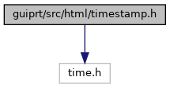
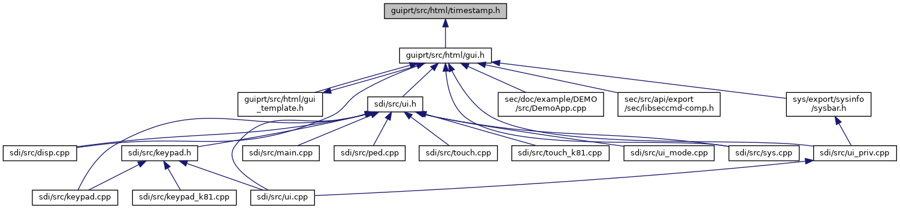

[Data Structures](#nested-classes) \| [Namespaces](#namespaces) \| [Macros](#define-members) \| [Functions](#func-members)

`#include <time.h>`

Include dependency graph for timestamp.h:

This graph shows which files directly or indirectly include this file:

<a href="guiprt_2src_2html_2timestamp_8h_source.md">Go to the source code of this file.</a>

|  |  |
|----|----|
| Data Structures |  |
| class   | <a href="classvfihtml_1_1_time_stamp.md">TimeStamp</a> |
| class   | <a href="classvfihtml_1_1_time_stamp.md#classvfihtml_1_1_time_stamp_1_1_unit___m_s">TimeStamp::Unit_MS</a> |
| class   | <a href="classvfihtml_1_1_time_stamp.md#classvfihtml_1_1_time_stamp_1_1_unit___s">TimeStamp::Unit_S</a> |

|            |                                                    |
|------------|----------------------------------------------------|
| Namespaces |                                                    |
|            | <a href="namespacevfihtml.md">vfihtml</a> |

|          |                                               |
|----------|-----------------------------------------------|
| Macros   |                                               |
| #define  | [DllSpec](#ad7c2e1cb200073ed64c64285a5f37231) |

|  |  |
|----|----|
| Functions |  |
| <a href="sound_8h.md#ad7c2e1cb200073ed64c64285a5f37231">DllSpec</a> TimeStamp  | <a href="namespacevfihtml.md#a3d78ca4ce27a959bf398e15ffb3ac35c">operator+</a> (const TimeStamp &a, const TimeStamp &b) |
| <a href="sound_8h.md#ad7c2e1cb200073ed64c64285a5f37231">DllSpec</a> TimeStamp  | <a href="namespacevfihtml.md#abb5f451bfe33b4d0957051af55e3ae99">operator-</a> (const TimeStamp &a, const TimeStamp &b) |
| bool  | <a href="namespacevfihtml.md#a8925dae3d083f52e28204c76dc63cfb5">operator==</a> (const TimeStamp &a, const TimeStamp &b) |
| bool  | <a href="namespacevfihtml.md#a6869fb59c93e8b8039fa26a47db06300">operator!=</a> (const TimeStamp &a, const TimeStamp &b) |
| bool  | <a href="namespacevfihtml.md#a62aae78823ad670db1f2a3871f9c6138">operator<</a> (const TimeStamp &a, const TimeStamp &b) |
| bool  | <a href="namespacevfihtml.md#a157e4057ccddad828bf42ae796a7c877">operator<=</a> (const TimeStamp &a, const TimeStamp &b) |
| bool  | <a href="namespacevfihtml.md#a9b79b43d164b3effb8259fab63cde591">operator></a> (const TimeStamp &a, const TimeStamp &b) |
| bool  | <a href="namespacevfihtml.md#a1bfa3d2893680e868a6e38bc12b17b05">operator>=</a> (const TimeStamp &a, const TimeStamp &b) |
| TimeStamp  | <a href="namespacevfihtml.md#a6f93946b848787d14daadba81d73b56c">operator*</a> (int t, TimeStamp::Unit_MS) |
| TimeStamp  | <a href="namespacevfihtml.md#a91630290de39196e23b6360b1a67c272">operator*</a> (int t, TimeStamp::Unit_S) |

## DetailedDescription {#detailed-description}

time utilities

------------------------------------------------------------------------

## DataStructure Documentation {#data-structure-documentation}

## vfihtml::TimeStamp::Unit_MS 

class vfihtml::TimeStamp::Unit_MS

helper class for unit conversion

## vfihtml::TimeStamp::Unit_S 

class vfihtml::TimeStamp::Unit_S

helper class for unit conversion

## MacroDefinition Documentation {#macro-definition-documentation}

## DllSpec 

#define DllSpec

