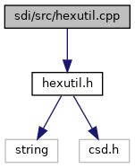

[Namespaces](#namespaces) \| [Functions](#func-members)

`#include "`<a href="sdi_2src_2hexutil_8h_source.md">hexutil.h</a>`"`

Include dependency graph for hexutil.cpp:

|            |                                            |
|------------|--------------------------------------------|
| Namespaces |                                            |
|            | <a href="namespacesdi.md">sdi</a> |

|  |  |
|----|----|
| Functions |  |
| int  | <a href="namespacesdi.md#aa7fda2cc5788cacfc2e267534b6391cd">hextobin</a> (unsigned char \*dst, const unsigned char \*src, int srclen) |
| int  | <a href="namespacesdi.md#a62d4f9a462bed89ebf473e377b7a24ad">hextobin</a> (csd::csd_data &dst, const unsigned char \*src, int srclen) |
| void  | <a href="namespacesdi.md#adb43cc15cc5e467d2a32db177abd95ac">bintohex</a> (unsigned char \*dst, const unsigned char \*src, int srclen) |
| void  | <a href="namespacesdi.md#a451fd8059d3954678d5ad223175cb078">bintohexstring</a> (char \*dst, const unsigned char \*src, int srclen) |
| void  | <a href="namespacesdi.md#a13312c8bd33a98c730b4c757e55a5304">bintohexstring</a> (string &dst, const unsigned char \*src, int srclen) |
| void  | <a href="namespacesdi.md#a6afe79e222ca1a9079f715b758dc4255">bintohexstring</a> (csd_string &dst, const unsigned char \*src, int srclen) |
| void  | <a href="namespacesdi.md#a8da4aa04db98292e03fb0c769642ac4e">bintotrack2</a> (unsigned char \*dst, const unsigned char \*src, int srclen) |
| void  | <a href="namespacesdi.md#a86d21f7d6c1590dfd83b11e0228e6dc4">bintotrack2string</a> (csd_string &dst, const unsigned char \*src, int srclen) |
| int  | <a href="namespacesdi.md#ad7b26a90792d2c2e5486941ed7b4dd7c">track2tobin</a> (unsigned char \*dst, const unsigned char \*src, int srclen) |
| int  | <a href="namespacesdi.md#ae42d999b07e327fe3aea4bfe156cef0a">track2tobin</a> (csd::csd_data &dst, const unsigned char \*src, int srclen) |
