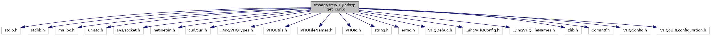

[Data Structures](#nested-classes) \| [Macros](#define-members) \| [Functions](#func-members)

`#include <stdio.h>`
`#include <stdlib.h>`
`#include <malloc.h>`
`#include <unistd.h>`
`#include <sys/socket.h>`
`#include <netinet/in.h>`
`#include "curl/curl.h"`
`#include "../inc/VHQTypes.h"`
`#include "VHQUtils.h"`
`#include "VHQFileNames.h"`
`#include "VHQIo.h"`
`#include <string.h>`
`#include <errno.h>`
`#include "VHQDebug.h"`
`#include "../inc/VHQConfig.h"`
`#include "../inc/VHQFileNames.h"`
`#include <zlib.h>`
`#include "ComIntf.h"`
`#include "VHQConfig.h"`
`#include "VHQcURLconfiguration.h"`

Include dependency graph for http_get_curl.c:

|                 |                                       |
|-----------------|---------------------------------------|
| Data Structures |                                       |
| struct          | [MemoryStruct](#struct_memory_struct) |

|  |  |
|----|----|
| Macros |  |
| #define  | [MY_DEBUG_ZONE](#a11b568a805188513933c1d2a3904fbe0)   DEBUG_ZONE_KMAILMAN |
| #define  | [min](#a8195a86b6d75b9a3939505e8bb50021e)(X, Y)   ((X) \< (Y) ? (X) : (Y)) |
| #define  | [CURL_MAX_READ_BLOCK_SIZE](#a00b7f57f88398c75444c2bc4c4f678c3)   2048 |

|  |  |
|----|----|
| Functions |  |
| void  | [W3Unescape](#ab68d2f7e15185696235c102c3e54d69a) (char \*pBuffer, int \*piLen) |
| vhq_result_t  | [http_post_curl](#a79b40fe8f8eee80e6e85ab9a9774e0eb) (const char \*pszUrl, const char \*pszRelativeURL, const char \*content, char \*response, int response_len) |
| bool  | [http_post_curl2](#abc19458a6a5df96fc004a6f0cd0f936c) (const char \*pszUrl, const char \*pszRelativeURL, const char \*content, char \*response, int response_len) |
| void  | [ServerPing](#a6954759a59d47aa4ba3aba78ba35614c) () |
| bool  | [http_get_curl](#ad2f0bd5449d0bd62b1ef32ba17efb33f) (const char \*pszUrl, const char \*pszRelativeURL, const char \*content, char \*response, int response_len) |

## DetailedDescription {#detailed-description}

Main VHQ XML Packager operations

------------------------------------------------------------------------

## DataStructure Documentation {#data-structure-documentation}

## MemoryStruct 

struct MemoryStruct

| Data Fields |        |     |
|-------------|--------|-----|
| char \*     | memory |     |
| size_t      | size   |     |

## MacroDefinition Documentation {#macro-definition-documentation}

## CURL_MAX_READ_BLOCK_SIZE 

#define CURL_MAX_READ_BLOCK_SIZE   2048

## min 

#define min

## MY_DEBUG_ZONE 

#define MY_DEBUG_ZONE   DEBUG_ZONE_KMAILMAN

## FunctionDocumentation {#function-documentation}

## http_get_curl() 

bool http_get_curl

## http_post_curl() 

vhq_result_t http_post_curl

This function initializes and configure CURL, calls ADK functions to establish server connection, fetches server response.

**Parameters**

\[in\] **pszUrl** = URL of server \[in\] **pszRelativeURL** = Postpayload \[in\] **content** = device message to send \[in\] **response** = buffer to store response from server \[in\] **response_len** = length of server response

### Returns

TRUE, if success; FALSE, if failure

## http_post_curl2() 

bool http_post_curl2

## ServerPing() 

void ServerPing

This function ping the server.

**Parameters**

\[in\] **void**

### Returns

void

## W3Unescape() 

void W3Unescape

