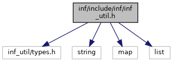

[Data Structures](#nested-classes) \| [Macros](#define-members) \| [Enumerations](#enum-members) \| [Functions](#func-members)

Import/Export Utility API. [More\...](#details)

`#include "inf_util/types.h"`

Include dependency graph for inf_util.h:

<a href="inf__util_8h_source.md">Go to the source code of this file.</a>

|  |  |
|----|----|
| Data Structures |  |
| struct   | <a href="group__inf__util__public.md#struct_im_ex_par">ImExPar</a> |
|   | Structure to tune up import /export operations. <a href="group__inf__util__public.md#struct_im_ex_par">More...</a>  |
| struct   | <a href="group__inf__util__public.md#struct_error_info">ErrorInfo</a> |
|   | Structure to capture error information. <a href="group__inf__util__public.md#struct_error_info">More...</a>  |

|          |                                                    |
|----------|----------------------------------------------------|
| Macros   |                                                    |
| #define  | [INF_UTIL_API](#a99bc021d4bced3a9a02e9ca8cc5630c5) |

|  |  |
|----|----|
| Enumerations |  |
| enum   | <a href="group__inf__util__public.md#ga59e56af19e754a6aa26a612ebf91d05f">ErrorCode</a> {   <a href="group__inf__util__public.md#gga59e56af19e754a6aa26a612ebf91d05fae68ba0b1134392f5da641ddee28fbe71">INFO_E_OK</a> = 0, <a href="group__inf__util__public.md#gga59e56af19e754a6aa26a612ebf91d05fa5be3dde74d9d17a8194d3a37b0fb0537">INFO_E_BAD_DB_SCHEMA_FILE</a> = -1, <a href="group__inf__util__public.md#gga59e56af19e754a6aa26a612ebf91d05fa6e33879c03fd180b25df18ccd52c5cf6">INFO_E_BAD_DATA_SCHEMA_FILE</a> = -2, <a href="group__inf__util__public.md#gga59e56af19e754a6aa26a612ebf91d05fa7f326dd24642867ef8807dbd48d45f43">INFO_E_BAD_DB</a> = -3,   <a href="group__inf__util__public.md#gga59e56af19e754a6aa26a612ebf91d05fada3d517617be644a0d42a0639ad3cda1">INFO_E_BAD_DATA_FILE</a> = -4, <a href="group__inf__util__public.md#gga59e56af19e754a6aa26a612ebf91d05fae79e3a320f35a2b58cf253ec4fd9621d">INFO_E_FILE_IO</a> = -5, <a href="group__inf__util__public.md#gga59e56af19e754a6aa26a612ebf91d05fa858ba6ec9e5cf8d171bed9ba6e09a979">INFO_E_DB_FAILURE</a> = -10, <a href="group__inf__util__public.md#gga59e56af19e754a6aa26a612ebf91d05fa087340e75a4ac0fd699b19f1bff2cda8">INFO_E_DB_INSERT</a> = -11,   <a href="group__inf__util__public.md#gga59e56af19e754a6aa26a612ebf91d05fa0fdb9d9a09de6fd5ca12f767b1e2cf15">INFO_E_DB_READ</a> = -12, <a href="group__inf__util__public.md#gga59e56af19e754a6aa26a612ebf91d05faeeec8af383aa416f8b55ef1dd44df434">INFO_E_DB_TRANSACTION</a> = -13, <a href="group__inf__util__public.md#gga59e56af19e754a6aa26a612ebf91d05fa192bbbf41df3d07b8f860a0d5f4e0597">INFO_E_DB_DELETE</a> = -14, <a href="group__inf__util__public.md#gga59e56af19e754a6aa26a612ebf91d05fac4ddc287af5887b0a30f6883573f4a1b">INFO_E_PARSE_ERROR</a> = -100,   <a href="group__inf__util__public.md#gga59e56af19e754a6aa26a612ebf91d05fa63f25277d2d2de83d84f95e932f3119c">INFO_E_NO_MORE</a> = -200, <a href="group__inf__util__public.md#gga59e56af19e754a6aa26a612ebf91d05faa37c4ca5dbc0693b88b07f5c83745a9c">INFO_E_UNKNOWN</a> = -201, <a href="group__inf__util__public.md#gga59e56af19e754a6aa26a612ebf91d05fa8d2a98de16d6eb4c7d4352f455fcc1a3">INFO_E_SKIPPED</a> = -202, <a href="group__inf__util__public.md#gga59e56af19e754a6aa26a612ebf91d05fa9e5197133a18fa013348582a12aee328">INFO_E_NOT_IMPL</a> = -999,   <a href="group__inf__util__public.md#gga59e56af19e754a6aa26a612ebf91d05fa0962cacbe8f8661cd7784a0b4c07ef8d">INFO_E_INTERNAL_ERROR</a> = -1000, <a href="group__inf__util__public.md#gga59e56af19e754a6aa26a612ebf91d05fa9d59c9c4da6e8df9253776ed07a450b8">INFO_E_PARAM</a> = -1001, <a href="group__inf__util__public.md#gga59e56af19e754a6aa26a612ebf91d05fa7db006c3fb86a536a1142d070e136afe">INFO_E_BACKEND</a> = -1002, <a href="group__inf__util__public.md#gga59e56af19e754a6aa26a612ebf91d05fa09dd2684c518a6f846ad808721354903">INFO_E_BACKEND_ROLE</a> = -1003 } |
|   | Error codes for the API functions. <a href="group__inf__util__public.md#ga59e56af19e754a6aa26a612ebf91d05f">More...</a>  |
| enum   | <a href="group__inf__util__public.md#ga436e393d88341728721b3496ededd5a3">OperationSubType</a> { <a href="group__inf__util__public.md#gga436e393d88341728721b3496ededd5a3ad9c3be77e956290d97cb38ee023f94d3">INFO_OP_FULL</a>, <a href="group__inf__util__public.md#gga436e393d88341728721b3496ededd5a3a541723e2d922a2255ea2234e9773981e">INFO_OP_PARTIAL</a>, <a href="group__inf__util__public.md#gga436e393d88341728721b3496ededd5a3a6b373622a755b7cbee3491e97840c764">INFO_OP_MERGE</a> } |
|   | Operation sub type. <a href="group__inf__util__public.md#ga436e393d88341728721b3496ededd5a3">More...</a>  |

|  |  |
|----|----|
| Functions |  |
| const [INF_UTIL_API](#a99bc021d4bced3a9a02e9ca8cc5630c5) char \*  | [infoutil_getVersion](#a9107d35320cbbe8358a375c571de886d) (void) |
|   | get version of a library [More\...](#a9107d35320cbbe8358a375c571de886d)  |
| [INF_UTIL_API](#a99bc021d4bced3a9a02e9ca8cc5630c5) void  | <a href="group__inf__util__public.md#gab01e86686ec39099f98fc710fa1a1cf8">error_info_free</a> (<a href="group__inf__util__public.md#struct_error_info">ErrorInfo</a> \*error) |
|   | Deallocate resources referenced by a <a href="group__inf__util__public.md#struct_error_info">ErrorInfo</a> structure. <a href="group__inf__util__public.md#gab01e86686ec39099f98fc710fa1a1cf8">More...</a>  |
| [INF_UTIL_API](#a99bc021d4bced3a9a02e9ca8cc5630c5) <a href="group__inf__util__public.md#ga59e56af19e754a6aa26a612ebf91d05f">ErrorCode</a>  | <a href="group__inf__util__public.md#gab028dff98150e41fc21c1b3a3f5d336d">info_import</a> (const char \*dataSchemaFile, const char \*dbSchemaFile, const char \*dbName, const char \*inputFileName, <a href="group__inf__util__public.md#struct_error_info">ErrorInfo</a> \*error) |
|   | Import data from datafile to database. <a href="group__inf__util__public.md#gab028dff98150e41fc21c1b3a3f5d336d">More...</a>  |
| [INF_UTIL_API](#a99bc021d4bced3a9a02e9ca8cc5630c5) <a href="group__inf__util__public.md#ga59e56af19e754a6aa26a612ebf91d05f">ErrorCode</a>  | <a href="group__inf__util__public.md#ga258b17ec88ed2273039e1477c463ba0f">info_import</a> (const char \*dataSchemaFile, const char \*dbSchemaFile, const char \*dbName, const char \*inputFileName, const char \*condition, <a href="group__inf__util__public.md#struct_error_info">ErrorInfo</a> \*error) |
|   | Import data from datafile to database. <a href="group__inf__util__public.md#ga258b17ec88ed2273039e1477c463ba0f">More...</a>  |
| [INF_UTIL_API](#a99bc021d4bced3a9a02e9ca8cc5630c5) <a href="group__inf__util__public.md#ga59e56af19e754a6aa26a612ebf91d05f">ErrorCode</a>  | <a href="group__inf__util__public.md#gaa9ed5d1644c56b30f1dcbad90537deb7">info_partial_import</a> (const char \*dataSchemaFile, const char \*dbSchemaFile, const char \*dbName, const char \*inputFileName, <a href="group__inf__util__public.md#struct_error_info">ErrorInfo</a> \*error) |
|   | Import data from datafile to database. Data is inserted or updated, depends from destination DB. <a href="group__inf__util__public.md#gaa9ed5d1644c56b30f1dcbad90537deb7">More...</a>  |
| [INF_UTIL_API](#a99bc021d4bced3a9a02e9ca8cc5630c5) <a href="group__inf__util__public.md#ga59e56af19e754a6aa26a612ebf91d05f">ErrorCode</a>  | <a href="group__inf__util__public.md#gacc99cea360371439ac165789200eacda">info_partial_import</a> (const char \*dataSchemaFile, const char \*dbSchemaFile, const char \*dbName, const char \*inputFileName, const char \*condition, <a href="group__inf__util__public.md#struct_error_info">ErrorInfo</a> \*error) |
|   | Import data from datafile to database. Data is inserted or updated, depends from destination DB. <a href="group__inf__util__public.md#gacc99cea360371439ac165789200eacda">More...</a>  |
| [INF_UTIL_API](#a99bc021d4bced3a9a02e9ca8cc5630c5) <a href="group__inf__util__public.md#ga59e56af19e754a6aa26a612ebf91d05f">ErrorCode</a>  | <a href="group__inf__util__public.md#gacc8c27e963a0deb2af270918ec233f7c">info_export</a> (const char \*dataSchemaFile, const char \*dbSchemaFile, const char \*dbName, const char \*outputFileName, <a href="group__inf__util__public.md#struct_error_info">ErrorInfo</a> \*error) |
|   | Export data from database to datafile. <a href="group__inf__util__public.md#gacc8c27e963a0deb2af270918ec233f7c">More...</a>  |
| [INF_UTIL_API](#a99bc021d4bced3a9a02e9ca8cc5630c5) <a href="group__inf__util__public.md#ga59e56af19e754a6aa26a612ebf91d05f">ErrorCode</a>  | <a href="group__inf__util__public.md#ga188443d652530e5cd3b6c2eac7d3870d">info_import_property_db</a> (const char \*dbName, const char \*inputFileName, <a href="group__inf__util__public.md#struct_error_info">ErrorInfo</a> \*error) |
|   | Import data from datafile to property database. <a href="group__inf__util__public.md#ga188443d652530e5cd3b6c2eac7d3870d">More...</a>  |
| [INF_UTIL_API](#a99bc021d4bced3a9a02e9ca8cc5630c5) <a href="group__inf__util__public.md#ga59e56af19e754a6aa26a612ebf91d05f">ErrorCode</a>  | <a href="group__inf__util__public.md#gabb79f6feed0203e74b933c0aef3d412e">info_import_property_db</a> (const char \*dbName, const char \*inputFileName, const char \*condition, <a href="group__inf__util__public.md#struct_error_info">ErrorInfo</a> \*error) |
|   | Import data from datafile to property database. <a href="group__inf__util__public.md#gabb79f6feed0203e74b933c0aef3d412e">More...</a>  |
| [INF_UTIL_API](#a99bc021d4bced3a9a02e9ca8cc5630c5) <a href="group__inf__util__public.md#ga59e56af19e754a6aa26a612ebf91d05f">ErrorCode</a>  | <a href="group__inf__util__public.md#ga51782a9663512eea89a58503d1b0f8b7">info_partial_import_property_db</a> (const char \*dbName, const char \*inputFileName, <a href="group__inf__util__public.md#struct_error_info">ErrorInfo</a> \*error) |
|   | Import data from datafile to property database. Data is inserted or updated, depends from destination DB. <a href="group__inf__util__public.md#ga51782a9663512eea89a58503d1b0f8b7">More...</a>  |
| [INF_UTIL_API](#a99bc021d4bced3a9a02e9ca8cc5630c5) <a href="group__inf__util__public.md#ga59e56af19e754a6aa26a612ebf91d05f">ErrorCode</a>  | <a href="group__inf__util__public.md#gad453df8d3bf2a654b35cdba2ac25ec09">info_partial_import_property_db</a> (const char \*dbName, const char \*inputFileName, const char \*condition, <a href="group__inf__util__public.md#struct_error_info">ErrorInfo</a> \*error) |
|   | Import data from datafile to property database. Data is inserted or updated, depends from destination DB. <a href="group__inf__util__public.md#gad453df8d3bf2a654b35cdba2ac25ec09">More...</a>  |
| [INF_UTIL_API](#a99bc021d4bced3a9a02e9ca8cc5630c5) <a href="group__inf__util__public.md#ga59e56af19e754a6aa26a612ebf91d05f">ErrorCode</a>  | <a href="group__inf__util__public.md#gad27f3e972a4ef344ffdc18a32b1c6e70">info_merge_import_property_db</a> (const char \*dbName, const char \*inputFileName, <a href="group__inf__util__public.md#struct_error_info">ErrorInfo</a> \*error) |
|   | Merge data from source XML file to destination DB. Data is inserted if not existed in destination DB. <a href="group__inf__util__public.md#gad27f3e972a4ef344ffdc18a32b1c6e70">More...</a>  |
| [INF_UTIL_API](#a99bc021d4bced3a9a02e9ca8cc5630c5) <a href="group__inf__util__public.md#ga59e56af19e754a6aa26a612ebf91d05f">ErrorCode</a>  | <a href="group__inf__util__public.md#ga2e1f19af8ac77b89414cb307e7be6ebe">info_merge_import_property_db</a> (const char \*dbName, const char \*inputFileName, const char \*condition, <a href="group__inf__util__public.md#struct_error_info">ErrorInfo</a> \*error) |
|   | Merge data from source XML file to destination DB. Data is inserted if not existed in destination DB. <a href="group__inf__util__public.md#ga2e1f19af8ac77b89414cb307e7be6ebe">More...</a>  |
| [INF_UTIL_API](#a99bc021d4bced3a9a02e9ca8cc5630c5) <a href="group__inf__util__public.md#ga59e56af19e754a6aa26a612ebf91d05f">ErrorCode</a>  | <a href="group__inf__util__public.md#gad68545aeaee0777b75d402be3c239d06">info_export_property_db</a> (const char \*dbName, const char \*outputFileName, <a href="group__inf__util__public.md#struct_error_info">ErrorInfo</a> \*error) |
|   | Export data from database to datafile. <a href="group__inf__util__public.md#gad68545aeaee0777b75d402be3c239d06">More...</a>  |

## DetailedDescription {#detailed-description}

Import/Export Utility API.

## MacroDefinition Documentation {#macro-definition-documentation}

## INF_UTIL_API 

#define INF_UTIL_API

## FunctionDocumentation {#function-documentation}

## infoutil_getVersion() 

const [INF_UTIL_API](#a99bc021d4bced3a9a02e9ca8cc5630c5) char\* infoutil_getVersion

get version of a library

### Returns

string with version
