<a href="hierarchy.md">Go to the textual class hierarchy</a>

|                                                     |
|-----------------------------------------------------|
| 

   |
| 

   |
| 

   |
| 

   |
| 

   |
| 
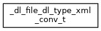
   |
| 
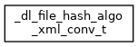
   |
| 
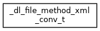
   |
| 
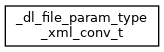
   |
| 

   |
| 
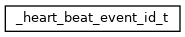
  |
| 

  |
| 

  |
| 
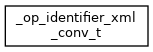
  |
| 
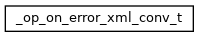
  |
| 

  |
| 

  |
| 

  |
| 

  |
| 

  |
| 
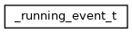
  |
| 

  |
| 

  |
| 
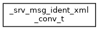
  |
| 
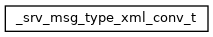
  |
| 
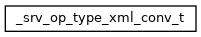
  |
| 

  |
| 
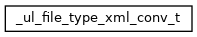
  |
| 

  |
| 

  |
| 

  |
| 

  |
| 

  |
| 

  |
| 

  |
| 

  |
| 

  |
| 

  |
| 

  |
| 

  |
| 

  |
| 

  |
| 

  |
| 

  |
| 

  |
| 

  |
| 

  |
| 

  |
| 

  |
| 

  |
| 

  |
| 

  |
| 

  |
| 

  |
| 

  |
| 

  |
| 

  |
| 

  |
| 

  |
| 

  |
| 

  |
| 

  |
| 

  |
| 

  |
| 

  |
| 

  |
| 

  |
| 

  |
| 

  |
| 

  |
| 

  |
| 

  |
| 

  |
| 

  |
| 

  |
| 

  |
| 

  |
| 

  |
| 

  |
| 

  |
| 

  |
| 

  |
| 

  |
| 
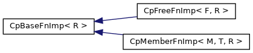
  |
| 
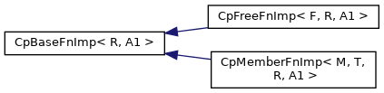
  |
| 
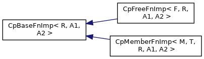
  |
| 
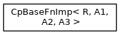
  |
| 
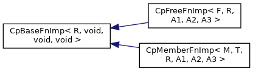
  |
| 
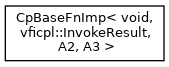
  |
| 
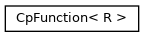
  |
| 
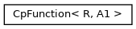
  |
| 
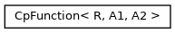
  |
| 
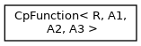
  |
| 

  |
| 

  |
| 

  |
| 

  |
| 

  |
| 

  |
| 

  |
| 

 |
| 

 |
| 

 |
| 
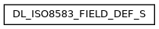
 |
| 

 |
| 

 |
| 

 |
| 

 |
| 

 |
| 

 |
| 

 |
| 

 |
| 

 |
| 

 |
| 

 |
| 

 |
| 

 |
| 

 |
| 

 |
| 

 |
| 

 |
| 

 |
| 

 |
| 

 |
| 

 |
| 

 |
| 
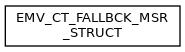
 |
| 

 |
| 

 |
| 

 |
| 

 |
| 

 |
| 

 |
| 

 |
| 

 |
| 

 |
| 

 |
| 

 |
| 

 |
| 

 |
| 

 |
| 

 |
| 

 |
| 

 |
| 

 |
| 

 |
| 

 |
| 

 |
| 

 |
| 

 |
| 

 |
| 

 |
| 

 |
| 

 |
| 

 |
| 

 |
| 

 |
| 

 |
| 

 |
| 

 |
| 

 |
| 

 |
| 

 |
| 

 |
| 

 |
| 

 |
| 

 |
| 

 |
| 

 |
| 

 |
| 

 |
| 

 |
| 

 |
| 

 |
| 

 |
| 

 |
| 

 |
| 

 |
| 

 |
| 

 |
| 

 |
| 

 |
| 

 |
| 

 |
| 

 |
| 

 |
| 

 |
| 

 |
| 

 |
| 

 |
| 

 |
| 

 |
| 

 |
| 

 |
| 

 |
| 

 |
| 

 |
| 

 |
| 

 |
| 

 |
| 

 |
| 
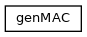
 |
| 

 |
| 

 |
| 

 |
| 

 |
| 

 |
| 

 |
| 

 |
| 

 |
| 

 |
| 
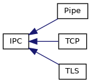
 |
| 

 |
| 

 |
| 

 |
| 

 |
| 
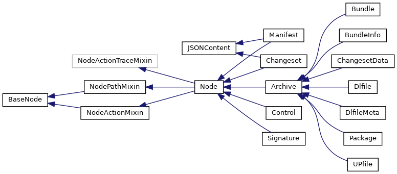
 |
| 

 |
| 

 |
| 

 |
| 

 |
| 

 |
| 

 |
| 

 |
| 

 |
| 

 |
| 

 |
| 

 |
| 

 |
| 

 |
| 

 |
| 

 |
| 

 |
| 

 |
| 

 |
| 

 |
| 

 |
| 

 |
| 

 |
| 

 |
| 

 |
| 

 |
| 

 |
| 

 |
| 
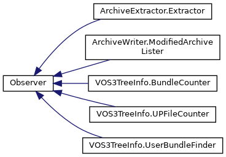
 |
| 

 |
| 

 |
| 

 |
| 

 |
| 

 |
| 

 |
| 

 |
| 

 |
| 

 |
| 

 |
| 

 |
| 
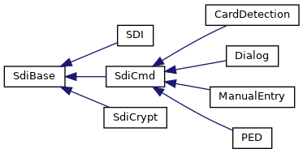
 |
| 

 |
| 

 |
| 

 |
| 

 |
| 

 |
| 

 |
| 

 |
| 

 |
| 

 |
| 

 |
| 

 |
| 

 |
| 

 |
| 

 |
| 

 |
| 

 |
| 

 |
| 

 |
| 

 |
| 

 |
| 

 |
| 

 |
| 

 |
| 

 |
| 

 |
| 

 |
| 

 |
| 

 |
| 

 |
| 

 |
| 

 |
| 

 |
| 

 |
| 

 |
| 

 |
| 

 |
| 

 |
| 

 |
| 

 |
| 
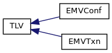
 |
| 

 |
| 

 |
| 

 |
| 

 |
| 

 |
| 

 |
| 

 |
| 

 |
| 

 |
| 

 |
| 

 |
| 

 |
| 

 |
| 

 |
| 

 |
| 

 |
| 

 |
| 

 |
| 

 |
| 

 |
| 

 |
| 

 |
| 

 |
| 

 |
| 

 |
| 

 |
| 

 |
| 

 |
| 

 |
| 

 |
| 

 |
| 

 |
| 

 |
| 

 |
| 

 |
| 

 |
| 

 |
| 

 |
| 

 |
