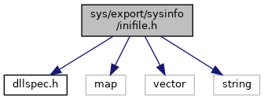

[Data Structures](#nested-classes) \| [Namespaces](#namespaces)

`#include "`<a href="dllspec_8h_source.md">dllspec.h</a>`"`
`#include <map>`
`#include <vector>`
`#include <string>`

Include dependency graph for inifile.h:

<a href="inifile_8h_source.md">Go to the source code of this file.</a>

|  |  |
|----|----|
| Data Structures |  |
| class   | <a href="classvfisysinfo_1_1_ini_file.md">IniFile</a> |

|            |                                                          |
|------------|----------------------------------------------------------|
| Namespaces |                                                          |
|            | <a href="namespacevfisysinfo.md">vfisysinfo</a> |
