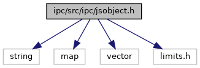
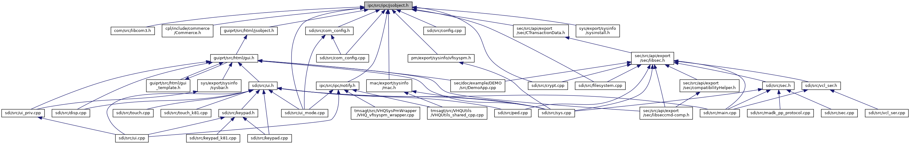

[Data Structures](#nested-classes) \| [Namespaces](#namespaces) \| [Macros](#define-members)

`#include <string>`
`#include <map>`
`#include <vector>`
`#include <limits.h>`

Include dependency graph for jsobject.h:

This graph shows which files directly or indirectly include this file:

<a href="ipc_2src_2ipc_2jsobject_8h_source.md">Go to the source code of this file.</a>

|  |  |
|----|----|
| Data Structures |  |
| class   | <a href="classvfiipc_1_1_j_s_object.md">JSObject</a> |

|            |                                                  |
|------------|--------------------------------------------------|
| Namespaces |                                                  |
|            | <a href="namespacevfiipc.md">vfiipc</a> |

|  |  |
|----|----|
| Macros |  |
| #define  | <a href="group__vfiipc.md#gad7c2e1cb200073ed64c64285a5f37231">DllSpec</a> |
