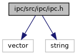
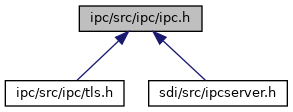

[Data Structures](#nested-classes) \| [Namespaces](#namespaces) \| [Macros](#define-members) \| [Typedefs](#typedef-members)

`#include <vector>`
`#include <string>`

Include dependency graph for ipc.h:

This graph shows which files directly or indirectly include this file:

<a href="ipc_8h_source.md">Go to the source code of this file.</a>

|                 |                                                     |
|-----------------|-----------------------------------------------------|
| Data Structures |                                                     |
| class           | <a href="classvfiipc_1_1_i_p_c.md">IPC</a> |
| class           | <a href="classvfiipc_1_1_t_c_p.md">TCP</a> |
| class           | <a href="classvfiipc_1_1_pipe.md">Pipe</a> |

|            |                                                  |
|------------|--------------------------------------------------|
| Namespaces |                                                  |
|            | <a href="namespacevfiipc.md">vfiipc</a> |

|          |                                                  |
|----------|--------------------------------------------------|
| Macros   |                                                  |
| #define  | [DllSpec](#ad7c2e1cb200073ed64c64285a5f37231)    |
| #define  | [DEPRECATED](#ac1e8a42306d8e67cb94ca31c3956ee78) |

|  |  |
|----|----|
| Typedefs |  |
| typedef void(\*  | <a href="namespacevfiipc.md#ad81e4165dd387a02aacdb8a57c4fdd4f">ipcCallback</a>) (void \*data, IPC \*ipc) |

## DetailedDescription {#detailed-description}

inter process communication

## MacroDefinition Documentation {#macro-definition-documentation}

## DEPRECATED 

#define DEPRECATED

## DllSpec 

#define DllSpec

