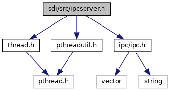

[Data Structures](#nested-classes)

`#include "`<a href="thread_8h_source.md">thread.h</a>`"`
`#include "`<a href="pthreadutil_8h_source.md">pthreadutil.h</a>`"`
`#include "`<a href="ipc_8h_source.md">ipc/ipc.h</a>`"`

Include dependency graph for ipcserver.h:

<a href="ipcserver_8h_source.md">Go to the source code of this file.</a>

|  |  |
|----|----|
| Data Structures |  |
| class   | <a href="class_ipc_server.md">IpcServer< Service ></a> |
