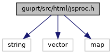
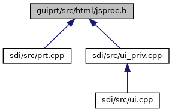

[Namespaces](#namespaces) \| [Macros](#define-members) \| [Enumerations](#enum-members) \| [Functions](#func-members)

`#include <string>`
`#include <vector>`
`#include <map>`

Include dependency graph for jsproc.h:

This graph shows which files directly or indirectly include this file:

<a href="jsproc_8h_source.md">Go to the source code of this file.</a>

|            |                                                    |
|------------|----------------------------------------------------|
| Namespaces |                                                    |
|            | <a href="namespacevfihtml.md">vfihtml</a> |
|            | <a href="namespacejs.md">js</a>           |

|          |                                               |
|----------|-----------------------------------------------|
| Macros   |                                               |
| #define  | [DllSpec](#ad7c2e1cb200073ed64c64285a5f37231) |

|  |  |
|----|----|
| Enumerations |  |
| enum   | <a href="namespacejs.md#ad20456843dd92e66711a2f7bf92ba403">JSTraceType</a> { <a href="namespacejs.md#ad20456843dd92e66711a2f7bf92ba403a0097858ea2de0d47f1b37c6b59c2877b">JST_HTTPGET</a>, <a href="namespacejs.md#ad20456843dd92e66711a2f7bf92ba403a018b7c186e2e6c565ae2ef1094f11c19">JST_HTTPPOST</a>, <a href="namespacejs.md#ad20456843dd92e66711a2f7bf92ba403a4e9e8cb17cd6cde626775e713559d61b">JST_HTTPRESULT</a> } |
| enum   | <a href="namespacejs.md#ab8a0c8e0d128f31e9b6aed5cbcc2a71c">JSLogLevel</a> {   <a href="namespacejs.md#ab8a0c8e0d128f31e9b6aed5cbcc2a71ca8bfbb012c5c86c64ad79efdb0261d147">JSL_EMERGENCY</a> =0, <a href="namespacejs.md#ab8a0c8e0d128f31e9b6aed5cbcc2a71cadffafab224bc4e075654d9481e252bc8">JSL_ALERT</a> =1, <a href="namespacejs.md#ab8a0c8e0d128f31e9b6aed5cbcc2a71cab221e9c88ce2273731b118be8d1cd3c8">JSL_CRITICAL</a> =2, <a href="namespacejs.md#ab8a0c8e0d128f31e9b6aed5cbcc2a71cafe102a5d724b8b7a20057d4ec0f8411e">JSL_ERROR</a> =3,   <a href="namespacejs.md#ab8a0c8e0d128f31e9b6aed5cbcc2a71ca1a1c6e37370cae3caba81e3ab822b0a9">JSL_WARNING</a> =4, <a href="namespacejs.md#ab8a0c8e0d128f31e9b6aed5cbcc2a71ca8bbd28ebf2d8ab68ea4c034820b83c72">JSL_NOTICE</a> =5, <a href="namespacejs.md#ab8a0c8e0d128f31e9b6aed5cbcc2a71cacdfefe038aa565f330ed517e52a336ab">JSL_INFO</a> =6, <a href="namespacejs.md#ab8a0c8e0d128f31e9b6aed5cbcc2a71caf3f2f3a9bbfe273ade514f6a3cc4a24c">JSL_DEBUG</a> =7 } |

|  |  |
|----|----|
| Functions |  |
| <a href="sound_8h.md#ad7c2e1cb200073ed64c64285a5f37231">DllSpec</a> bool  | <a href="namespacejs.md#aed4342f3366822c63467b5ac2cf954a6">jsProcessor</a> (void \*data, const std::string &sourcecode, std::map\< std::string, std::string \> &arg, std::string &out, std::string &err, std::string &exitcode) |
| <a href="sound_8h.md#ad7c2e1cb200073ed64c64285a5f37231">DllSpec</a> bool  | <a href="namespacejs.md#a079799b1c828f53a96eec5af0c7e591e">jsProcessorExt</a> (void \*data, const std::string &sourcecode, std::map\< std::string, std::string \> &arg, std::string &out, std::string &err, std::string &exitcode, vfihtml::ExtContext \*context) |
| const <a href="sound_8h.md#ad7c2e1cb200073ed64c64285a5f37231">DllSpec</a> char \*  | <a href="namespacejs.md#ad00023748fe562979f1e0d9927fa8b4c">jsProcVersion</a> () |
| <a href="sound_8h.md#ad7c2e1cb200073ed64c64285a5f37231">DllSpec</a> void  | <a href="namespacejs.md#a93f7e226d11567703ca1af4ad05c74b8">jsSetHttpProxy</a> (const char \*proxy) |
| const <a href="sound_8h.md#ad7c2e1cb200073ed64c64285a5f37231">DllSpec</a> char \*  | <a href="namespacejs.md#aa600eb22cb9b648950a8c9b7336f25a3">jsGetHttpProxy</a> () |
| <a href="sound_8h.md#ad7c2e1cb200073ed64c64285a5f37231">DllSpec</a> void  | <a href="namespacejs.md#ab0b2ef6cebca767dc473a5cbc5a3d3dc">jsSetConsole</a> (void(\*cb)(void \*data, const char \*text), void \*data) |
| <a href="sound_8h.md#ad7c2e1cb200073ed64c64285a5f37231">DllSpec</a> void  | <a href="namespacejs.md#a2873af29ad5c7fb7d1c52623f6c1aa69">jsGetConsole</a> (void(\*&cb)(void \*, const char \*), void \*&data) |
| <a href="sound_8h.md#ad7c2e1cb200073ed64c64285a5f37231">DllSpec</a> void  | <a href="namespacejs.md#a941985c6558b6f4f10bacf7857d5ad6e">jsSetNotify</a> (int(\*cb)(void \*data, const char \*to, const char \*notification_id, const char \*json_param, unsigned flags, const char \*from), void \*data) |
| <a href="sound_8h.md#ad7c2e1cb200073ed64c64285a5f37231">DllSpec</a> void  | <a href="namespacejs.md#a4693926db9182ab2551e72551c7f703e">jsGetNotify</a> (int(\*&cb)(void \*data, const char \*to, const char \*notification_id, const char \*json_param, unsigned flags, const char \*from), void \*&data) |
| <a href="sound_8h.md#ad7c2e1cb200073ed64c64285a5f37231">DllSpec</a> void  | <a href="namespacejs.md#ab7a589551714a925a23a39e9c2f86a34">jsSetNotifyAndWait</a> (int(\*cb)(void \*data, const char \*to, const char \*notification_id, const char \*json_param, unsigned flags, const char \*from, const char \*wait_id, std::string &result, int timeout_msec), void \*data) |
| <a href="sound_8h.md#ad7c2e1cb200073ed64c64285a5f37231">DllSpec</a> void  | <a href="namespacejs.md#a4f20de3f3605bf70b48e478b00221a2d">jsGetNotifyAndWait</a> (int(\*&cb)(void \*data, const char \*to, const char \*notification_id, const char \*json_param, unsigned flags, const char \*from, const char \*wait_id, std::string &result, int timeout_msec), void \*&data) |
| <a href="sound_8h.md#ad7c2e1cb200073ed64c64285a5f37231">DllSpec</a> void  | <a href="namespacejs.md#a671fe746485753d6f9edcc2a4420ef91">jsSetTrace</a> (void(\*cb)(void \*data, JSTraceType type, const std::string &app_id, std::map\< std::string, std::string \> &trace), void \*data) |
| <a href="sound_8h.md#ad7c2e1cb200073ed64c64285a5f37231">DllSpec</a> void  | <a href="namespacejs.md#acad863333bee2403c9d54b3bd117158c">jsGetTrace</a> (void(\*&cb)(void \*data, JSTraceType type, const std::string &app_id, std::map\< std::string, std::string \> &trace), void \*&data) |
| <a href="sound_8h.md#ad7c2e1cb200073ed64c64285a5f37231">DllSpec</a> void  | <a href="namespacejs.md#aa4e26e9d7af24ac28e26ec47d4ea095c">jsSetLog</a> (void(\*cb)(void \*data, const std::string &app_id, JSLogLevel log_level, const std::vector\< std::string \> &msg), void \*data) |
| <a href="sound_8h.md#ad7c2e1cb200073ed64c64285a5f37231">DllSpec</a> void  | <a href="namespacejs.md#a34a81ec14c36fc4aa838773ff4b15949">jsGetLog</a> (void(\*&cb)(void \*data, const std::string &app_id, JSLogLevel log_level, const std::vector\< std::string \> &msg), void \*&data) |

## DetailedDescription {#detailed-description}

script processor

## MacroDefinition Documentation {#macro-definition-documentation}

## DllSpec 

#define DllSpec

