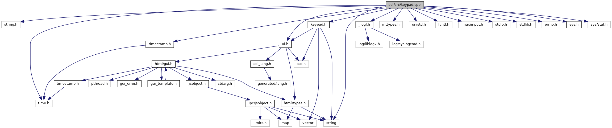

`#include <string.h>`
`#include "`<a href="sdi_2src_2timestamp_8h_source.md">timestamp.h</a>`"`
`#include "`<a href="ui_8h_source.md">ui.h</a>`"`
`#include "`<a href="keypad_8h_source.md">keypad.h</a>`"`
`#include "`<a href="__logf_8h_source.md">_logf.h</a>`"`
`#include <inttypes.h>`
`#include <unistd.h>`
`#include <fcntl.h>`
`#include <linux/input.h>`
`#include <time.h>`
`#include <string>`
`#include <stdio.h>`
`#include <stdlib.h>`
`#include <errno.h>`
`#include "`<a href="sys_8h_source.md">sys.h</a>`"`
`#include <sys/stat.h>`

Include dependency graph for keypad.cpp:

