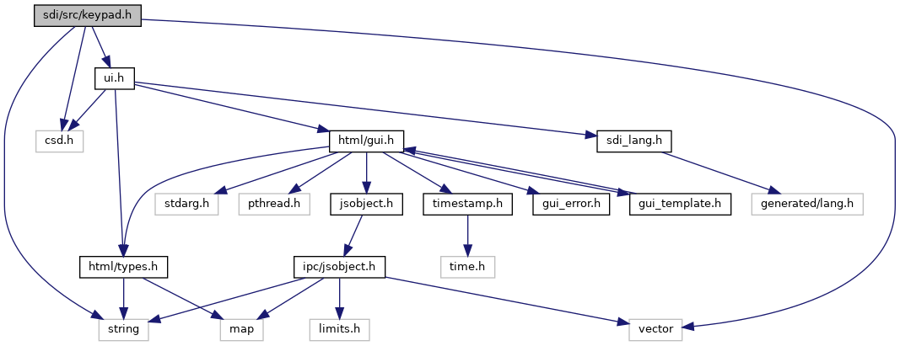
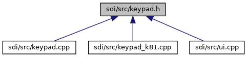

[Data Structures](#nested-classes)

`#include <string>`
`#include <vector>`
`#include "csd.h"`
`#include "`<a href="ui_8h_source.md">ui.h</a>`"`

Include dependency graph for keypad.h:

This graph shows which files directly or indirectly include this file:

<a href="keypad_8h_source.md">Go to the source code of this file.</a>

|                 |                                                |
|-----------------|------------------------------------------------|
| Data Structures |                                                |
| class           | <a href="class_key_pad.md">KeyPad</a> |
