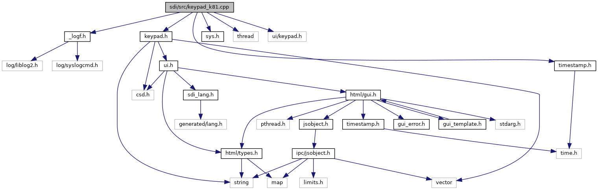

`#include "`<a href="__logf_8h_source.md">_logf.h</a>`"`
`#include "`<a href="keypad_8h_source.md">keypad.h</a>`"`
`#include "`<a href="sys_8h_source.md">sys.h</a>`"`
`#include "`<a href="sdi_2src_2timestamp_8h_source.md">timestamp.h</a>`"`
`#include <thread>`
`#include <ui/keypad.h>`

Include dependency graph for keypad_k81.cpp:

