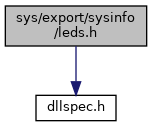
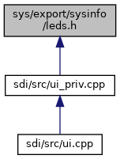

[Namespaces](#namespaces) \| [Enumerations](#enum-members) \| [Functions](#func-members)

`#include "`<a href="dllspec_8h_source.md">dllspec.h</a>`"`

Include dependency graph for leds.h:

This graph shows which files directly or indirectly include this file:

<a href="leds_8h_source.md">Go to the source code of this file.</a>

|            |                                                          |
|------------|----------------------------------------------------------|
| Namespaces |                                                          |
|            | <a href="namespacevfisysinfo.md">vfisysinfo</a> |

|  |  |
|----|----|
| Enumerations |  |
| enum   | <a href="namespacevfisysinfo.md#ab6831a7d06c0a2bc69f9b024f6445a80">LEDs</a> {   <a href="namespacevfisysinfo.md#ab6831a7d06c0a2bc69f9b024f6445a80af426e11280e04b0573ee9096035b5541">CTLS_LED_NONE</a> = 0, <a href="namespacevfisysinfo.md#ab6831a7d06c0a2bc69f9b024f6445a80a8e09104d36ad9727494206d4e55221e4">MSR_LED_NONE</a> = 0, <a href="namespacevfisysinfo.md#ab6831a7d06c0a2bc69f9b024f6445a80aac9b09da35c2d54eb64ab416abb37645">SYS_LED_NONE</a> = 0, <a href="namespacevfisysinfo.md#ab6831a7d06c0a2bc69f9b024f6445a80a65798fde604548306d987ad18f7e6a8e">MSR_LED_0</a> = (1\<\<0),   <a href="namespacevfisysinfo.md#ab6831a7d06c0a2bc69f9b024f6445a80a20d6d3474aef0298b73ffdbd68fc5d0e">MSR_LED_1</a> = (1\<\<1), <a href="namespacevfisysinfo.md#ab6831a7d06c0a2bc69f9b024f6445a80a80698b4a6eb45a3a019ebcfa952a880c">MSR_LED_2</a> = (1\<\<2), <a href="namespacevfisysinfo.md#ab6831a7d06c0a2bc69f9b024f6445a80a27f5f55a7254ef7dbb9907f51ef0ddc6">KEYPAD_LED</a> = (1\<\<3), <a href="namespacevfisysinfo.md#ab6831a7d06c0a2bc69f9b024f6445a80a9b4d97ca299bb13e9449f7b7af2511c9">SMARTCARD_LED</a> = (1\<\<4),   <a href="namespacevfisysinfo.md#ab6831a7d06c0a2bc69f9b024f6445a80a5d504864fade7b081567b450437747f7">CTLS_LED_LOGO</a> = (1\<\<5), <a href="namespacevfisysinfo.md#ab6831a7d06c0a2bc69f9b024f6445a80af3e19db98073f2485f8eeecfd937bb2b">CTLS_LED_0</a> = (1\<\<6), <a href="namespacevfisysinfo.md#ab6831a7d06c0a2bc69f9b024f6445a80a13d0a3953ed0e8f578e938a61cd7e9e8">CTLS_LED_1</a> = (1\<\<7), <a href="namespacevfisysinfo.md#ab6831a7d06c0a2bc69f9b024f6445a80addf37561061e07231c0d4e68bca26056">CTLS_LED_2</a> = (1\<\<8),   <a href="namespacevfisysinfo.md#ab6831a7d06c0a2bc69f9b024f6445a80aa6a566782b1accb3be414926ed519baa">CTLS_LED_3</a> = (1\<\<9), <a href="namespacevfisysinfo.md#ab6831a7d06c0a2bc69f9b024f6445a80a3e1390b17356b014e6e3bb74243a8e89">SYSTEM_LED</a> = (1\<\<10), <a href="namespacevfisysinfo.md#ab6831a7d06c0a2bc69f9b024f6445a80a4354634783e550e45e8c1c3de0fe7799">POWER_LED</a> = (1\<\<11), <a href="namespacevfisysinfo.md#ab6831a7d06c0a2bc69f9b024f6445a80acab8266e75d4b9e130cee4674862638e">BLUETOOTH_LED</a> = (1\<\<12),   <a href="namespacevfisysinfo.md#ab6831a7d06c0a2bc69f9b024f6445a80afe56eb35bc594d8cfaf1b616dd31f927">MODEM_LED</a> = (1\<\<13), <a href="namespacevfisysinfo.md#ab6831a7d06c0a2bc69f9b024f6445a80ac9da5c4501ff07f5930282709dec61b3">GREEN_LED</a> = (1\<\<14), <a href="namespacevfisysinfo.md#ab6831a7d06c0a2bc69f9b024f6445a80a9924710c1e80e5287b87b1d6541c3623">YELLOW_LED</a> = (1\<\<15), <a href="namespacevfisysinfo.md#ab6831a7d06c0a2bc69f9b024f6445a80aedcf3ad9edba345343e3d99b9d27d5a9">RED_LED</a> = (1\<\<16),   <a href="namespacevfisysinfo.md#ab6831a7d06c0a2bc69f9b024f6445a80a7b834594a2fa42d8d30faa3577421f99">MSR_LED_ALL</a> = MSR_LED_0 \| MSR_LED_1 \| MSR_LED_2, <a href="namespacevfisysinfo.md#ab6831a7d06c0a2bc69f9b024f6445a80a363205aef563ac04a7ac3a8236b5d55d">CTLS_LED_ALL</a> = CTLS_LED_0 \| CTLS_LED_1 \| CTLS_LED_2 \| CTLS_LED_3 \| CTLS_LED_LOGO } |
| enum   | <a href="namespacevfisysinfo.md#ac53d0dd4fdb8c227b07184816614b3f9">LedStates</a> { <a href="namespacevfisysinfo.md#ac53d0dd4fdb8c227b07184816614b3f9a31773366e575d3bc1209834eedf2f525">SWITCH_OFF</a> = 0, <a href="namespacevfisysinfo.md#ac53d0dd4fdb8c227b07184816614b3f9a44eaafa32143d3ddf31d2074e76a0f60">SWITCH_ON</a> = 1 } |
| enum   | <a href="namespacevfisysinfo.md#a55dc64efc347b073c4504e53decdbe03">LedBrightness</a> { <a href="namespacevfisysinfo.md#a55dc64efc347b073c4504e53decdbe03a9d972ff013f6e9e28c0134c5a79ac88b">MAX_BRIGHTNESS</a> = 255, <a href="namespacevfisysinfo.md#a55dc64efc347b073c4504e53decdbe03a8f32ee7ca5d7f834671f01e0f3bb4693">MIN_BRIGHTNESS</a> = 0 } |

|  |  |
|----|----|
| Functions |  |
| <a href="dllspec_8h.md#a06244aced91c3fbc18547181038765aa">SYS_INFO_API</a> int  | <a href="namespacevfisysinfo.md#aee000a15a06178175634163e5591b00a">ctlsLedsChangeState</a> (int ledMap) |
| <a href="dllspec_8h.md#a06244aced91c3fbc18547181038765aa">SYS_INFO_API</a> int  | <a href="namespacevfisysinfo.md#aabc99b91721225db16d2ff8358631fe2">msrLedsChangeState</a> (int ledMap) |
| <a href="dllspec_8h.md#a06244aced91c3fbc18547181038765aa">SYS_INFO_API</a> int  | <a href="namespacevfisysinfo.md#a1587dae29ddad22c7def2be5eac61ff8">scrLedChangeState</a> (int state) |
| <a href="dllspec_8h.md#a06244aced91c3fbc18547181038765aa">SYS_INFO_API</a> int  | <a href="namespacevfisysinfo.md#a468b20d075222dd30fabc2c3633cb50d">sysLedsChangeState</a> (int ledMap) |
| <a href="dllspec_8h.md#a06244aced91c3fbc18547181038765aa">SYS_INFO_API</a> int  | <a href="namespacevfisysinfo.md#a2ccd3d074bc8c8d3ae6f502232ebe897">msrShowRunway</a> (int repeatCount) |
| <a href="dllspec_8h.md#a06244aced91c3fbc18547181038765aa">SYS_INFO_API</a> int  | <a href="namespacevfisysinfo.md#a0a2dc873f3bc7fafff5d08336d8eeaf6">msrShowCancel</a> (void) |
| <a href="dllspec_8h.md#a06244aced91c3fbc18547181038765aa">SYS_INFO_API</a> int  | <a href="namespacevfisysinfo.md#a1eda2d856d4d40113571a95d3d6a4277">logoLedChangeState</a> (int state) |
| <a href="dllspec_8h.md#a06244aced91c3fbc18547181038765aa">SYS_INFO_API</a> int  | <a href="namespacevfisysinfo.md#ab373028a6c5ee63e4e24a4bab90bf220">setBrightness</a> (unsigned int ledMap, int brightness) |
| <a href="dllspec_8h.md#a06244aced91c3fbc18547181038765aa">SYS_INFO_API</a> bool  | <a href="namespacevfisysinfo.md#aaa8c401ff147fb47c360e6f2539f9d63">isBrightnessAdjustable</a> (unsigned int ledId) |
