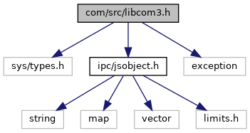

[Data Structures](#nested-classes) \| [Namespaces](#namespaces) \| [Macros](#define-members) \| [Enumerations](#enum-members) \| [Variables](#var-members)

`#include <sys/types.h>`
`#include <`<a href="ipc_2src_2ipc_2jsobject_8h_source.md">ipc/jsobject.h</a>`>`
`#include <exception>`

Include dependency graph for libcom3.h:

<a href="libcom3_8h_source.md">Go to the source code of this file.</a>

|  |  |
|----|----|
| Data Structures |  |
| class   | <a href="classvficom_1_1_exception.md">Exception</a> |
|   | <a href="classvficom_1_1_exception.md">Exception</a> type thrown by constructors in classes in this file. <a href="classvficom_1_1_exception.md#details">More...</a>  |
| class   | <a href="classvficom_1_1_milliseconds.md">Milliseconds</a> |
| class   | <a href="classvficom_1_1_command_pipe.md">CommandPipe</a> |
| class   | <a href="classvficom_1_1_event_pipe.md">EventPipe</a> |

|  |  |
|----|----|
| Namespaces |  |
|   | <a href="namespacevficom.md">vficom</a> |
|   | <a href="namespacevficom_1_1cmd.md">vficom::cmd</a> |
|   | <a href="namespacevficom_1_1cmdparam.md">vficom::cmdparam</a> |
|   | <a href="namespacevficom_1_1cmdparam_1_1in.md">vficom::cmdparam::in</a> |
|   | <a href="namespacevficom_1_1cmdparam_1_1in_1_1stk__on.md">vficom::cmdparam::in::stk_on</a> |
|   | <a href="namespacevficom_1_1cmdparam_1_1in_1_1stk__off.md">vficom::cmdparam::in::stk_off</a> |
|   | <a href="namespacevficom_1_1cmdparam_1_1in_1_1stk__status.md">vficom::cmdparam::in::stk_status</a> |
|   | <a href="namespacevficom_1_1cmdparam_1_1in_1_1stk__write.md">vficom::cmdparam::in::stk_write</a> |
|   | <a href="namespacevficom_1_1cmdparam_1_1in_1_1stk__write_1_1msg.md">vficom::cmdparam::in::stk_write::msg</a> |
|   | <a href="namespacevficom_1_1cmdparam_1_1in_1_1stk__write_1_1msg_1_1tr.md">vficom::cmdparam::in::stk_write::msg::tr</a> |
|   | <a href="namespacevficom_1_1cmdparam_1_1in_1_1stk__write_1_1msg_1_1tr_1_1refresh.md">vficom::cmdparam::in::stk_write::msg::tr::refresh</a> |
|   | <a href="namespacevficom_1_1cmdparam_1_1in_1_1stk__write_1_1msg_1_1tr_1_1setup__event__list.md">vficom::cmdparam::in::stk_write::msg::tr::setup_event_list</a> |
|   | <a href="namespacevficom_1_1cmdparam_1_1in_1_1stk__write_1_1msg_1_1tr_1_1select__item.md">vficom::cmdparam::in::stk_write::msg::tr::select_item</a> |
|   | <a href="namespacevficom_1_1cmdparam_1_1in_1_1stk__write_1_1msg_1_1tr_1_1setup__menu.md">vficom::cmdparam::in::stk_write::msg::tr::setup_menu</a> |
|   | <a href="namespacevficom_1_1cmdparam_1_1in_1_1stk__write_1_1msg_1_1env.md">vficom::cmdparam::in::stk_write::msg::env</a> |
|   | <a href="namespacevficom_1_1cmdparam_1_1in_1_1stk__write_1_1msg_1_1env_1_1menu__select.md">vficom::cmdparam::in::stk_write::msg::env::menu_select</a> |
|   | <a href="namespacevficom_1_1cmdparam_1_1in_1_1stk__write_1_1msg_1_1env_1_1event__download.md">vficom::cmdparam::in::stk_write::msg::env::event_download</a> |
|   | <a href="namespacevficom_1_1cmdparam_1_1in_1_1ussd__write.md">vficom::cmdparam::in::ussd_write</a> |
|   | <a href="namespacevficom_1_1cmdparam_1_1in_1_1ussd__status.md">vficom::cmdparam::in::ussd_status</a> |
|   | <a href="namespacevficom_1_1cmdparam_1_1in_1_1sim__access.md">vficom::cmdparam::in::sim_access</a> |
|   | <a href="namespacevficom_1_1cmdparam_1_1in_1_1ping.md">vficom::cmdparam::in::ping</a> |
|   | <a href="namespacevficom_1_1cmdparam_1_1out.md">vficom::cmdparam::out</a> |
|   | <a href="namespacevficom_1_1cmdparam_1_1out_1_1ping.md">vficom::cmdparam::out::ping</a> |
|   | <a href="namespacevficom_1_1cmdparam_1_1out_1_1stk__status.md">vficom::cmdparam::out::stk_status</a> |
|   | <a href="namespacevficom_1_1cmdparam_1_1out_1_1ussd__status.md">vficom::cmdparam::out::ussd_status</a> |
|   | <a href="namespacevficom_1_1cmdparam_1_1out_1_1sim__access.md">vficom::cmdparam::out::sim_access</a> |
|   | <a href="namespacevficom_1_1cmdparam_1_1out_1_1wlan__scan.md">vficom::cmdparam::out::wlan_scan</a> |
|   | <a href="namespacevficom_1_1cmdparam_1_1out_1_1wlan__scan_1_1json__keys.md">vficom::cmdparam::out::wlan_scan::json_keys</a> |
|   | <a href="namespacevficom_1_1event.md">vficom::event</a> |
|   | <a href="namespacevficom_1_1event_1_1stk.md">vficom::event::stk</a> |
|   | <a href="namespacevficom_1_1event_1_1stk_1_1set__up__event__list.md">vficom::event::stk::set_up_event_list</a> |
|   | <a href="namespacevficom_1_1event_1_1stk_1_1select__item.md">vficom::event::stk::select_item</a> |
|   | <a href="namespacevficom_1_1event_1_1stk_1_1menu__selection.md">vficom::event::stk::menu_selection</a> |
|   | <a href="namespacevficom_1_1event_1_1ussd.md">vficom::event::ussd</a> |
|   | <a href="namespacevficom_1_1status.md">vficom::status</a> |

|          |                                                    |
|----------|----------------------------------------------------|
| Macros   |                                                    |
| #define  | [COM3_DllSpec](#af8173355d81a442e8fec1ebd507e3a36) |

|  |  |
|----|----|
| Enumerations |  |
| enum   | <a href="namespacevficom_1_1cmdparam_1_1in_1_1stk__write_1_1msg.md#a234450c2c657a6d5316bb8188dbbcd5d">STKTRCommand</a> {   <a href="namespacevficom_1_1cmdparam_1_1in_1_1stk__write_1_1msg.md#a234450c2c657a6d5316bb8188dbbcd5daa0ce25efd0caa8725b776aceb8584bb2">STK_TR_CMD_REFRESH</a> = 1, <a href="namespacevficom_1_1cmdparam_1_1in_1_1stk__write_1_1msg.md#a234450c2c657a6d5316bb8188dbbcd5da3de966187a2f9d6339188503d787a674">STK_TR_CMD_SETUP_EVENT_LIST</a> = 5, <a href="namespacevficom_1_1cmdparam_1_1in_1_1stk__write_1_1msg.md#a234450c2c657a6d5316bb8188dbbcd5da657d0e99bbd4f535e31c71cb691489ed">STK_TR_CMD_SELECT_ITEM</a> = 36, <a href="namespacevficom_1_1cmdparam_1_1in_1_1stk__write_1_1msg.md#a234450c2c657a6d5316bb8188dbbcd5da94d7ddbc8ab0069214ef7eb64a64fe2d">STK_TR_CMD_SETUP_MENU</a> = 37,   <a href="namespacevficom_1_1cmdparam_1_1in_1_1stk__write_1_1msg.md#a234450c2c657a6d5316bb8188dbbcd5dabf2853413140a0f6b3e77d4ad6b45967">STK_TR_MAX_ENUM</a> = 0x7FFFFFFF } |
| enum   | <a href="namespacevficom_1_1cmdparam_1_1in_1_1stk__write_1_1msg.md#a37a60d6078b7db799def050b0df8575c">STKENVCommand</a> { <a href="namespacevficom_1_1cmdparam_1_1in_1_1stk__write_1_1msg.md#a37a60d6078b7db799def050b0df8575ca18c3b5c6924431fbdf0b17510f1bd520">STK_ENV_CMD_MENU_SELECT</a> = 211, <a href="namespacevficom_1_1cmdparam_1_1in_1_1stk__write_1_1msg.md#a37a60d6078b7db799def050b0df8575ca9df31c97c0de893a08eb38b005bdc223">STK_ENV_CMD_EVENT_DOWNLOAD</a> = 214, <a href="namespacevficom_1_1cmdparam_1_1in_1_1stk__write_1_1msg.md#a37a60d6078b7db799def050b0df8575caec02de6efa9b755fe3ba03d6beb071a5">STK_ENV_MAX_ENUM</a> = 0x7FFFFFFF } |
| enum   | <a href="namespacevficom_1_1event.md#a2628ea8d12e8b2563c32f05dc7fff6fa">EventType</a> { <a href="namespacevficom_1_1event.md#a2628ea8d12e8b2563c32f05dc7fff6faac94a0e44aea9f0a62928152bc2966f02">EVT_URC_STK</a> = 0, <a href="namespacevficom_1_1event.md#a2628ea8d12e8b2563c32f05dc7fff6faa103c761754e574e8fa46d4bc24c3da58">EVT_URC_USSD</a> = 1, <a href="namespacevficom_1_1event.md#a2628ea8d12e8b2563c32f05dc7fff6faa11c23089090ed51600dee29f834c653e">EVT_MAX_ENUM</a> = 0x7FFFFFFF } |
| enum   | <a href="namespacevficom_1_1event_1_1stk.md#a5c9f20e9dfda7ed7ed70d7a4b3dab65c">STKURCProCommand</a> { <a href="namespacevficom_1_1event_1_1stk.md#a5c9f20e9dfda7ed7ed70d7a4b3dab65ca579e57dd8e1b4d3aeea89024110a8faa">SET_UP_EVENT_LIST</a> = 5, <a href="namespacevficom_1_1event_1_1stk.md#a5c9f20e9dfda7ed7ed70d7a4b3dab65caff4dbb9d650bf39f32e93d17f47ed147">SELECT_ITEM</a> = 36, <a href="namespacevficom_1_1event_1_1stk.md#a5c9f20e9dfda7ed7ed70d7a4b3dab65cae26875fc20d12429767cd8101f356898">MENU_SELECTION</a> = 37, <a href="namespacevficom_1_1event_1_1stk.md#a5c9f20e9dfda7ed7ed70d7a4b3dab65caeb25216260e5ee725a779863deb4d0a3">STK_URC_PRO_MAX_ENUM</a> = 0x7FFFFFFF } |
| enum   | <a href="namespacevficom_1_1status.md#ae7ba2f563df916ce3ce6be92a19d2bbc">PipeStatus</a> {   <a href="namespacevficom_1_1status.md#ae7ba2f563df916ce3ce6be92a19d2bbca2bc49ec37d6a5715dd23e85f1ff5bb59">OK</a> = 0, <a href="namespacevficom_1_1status.md#ae7ba2f563df916ce3ce6be92a19d2bbcaef2863a469df3ea6871d640e3669a2f2">INVALID</a> = 1, <a href="namespacevficom_1_1status.md#ae7ba2f563df916ce3ce6be92a19d2bbcad7e21613367ae574d29fb0f12b02be44">NOSUPPORT</a> = 2, <a href="namespacevficom_1_1status.md#ae7ba2f563df916ce3ce6be92a19d2bbcaee9eff54c2e86e523f8be55c5ad62c58">NOTREADY</a> = 3,   <a href="namespacevficom_1_1status.md#ae7ba2f563df916ce3ce6be92a19d2bbcaecedb56d1405a60c6069f4a0139bdec5">FAILED</a> = 5, <a href="namespacevficom_1_1status.md#ae7ba2f563df916ce3ce6be92a19d2bbcaad9dee005a3d0f9137b2ac1e0869f89b">TIMEOUT</a> = 6, <a href="namespacevficom_1_1status.md#ae7ba2f563df916ce3ce6be92a19d2bbca16447fcbaada0814065a175e7cc7823f">STARVATION</a> = 7, <a href="namespacevficom_1_1status.md#ae7ba2f563df916ce3ce6be92a19d2bbca613171f09bea59d3a66afe2d09a136d0">USER_INTERRUPT</a> = 8,   <a href="namespacevficom_1_1status.md#ae7ba2f563df916ce3ce6be92a19d2bbca45fb932b1d1e8ed5779c816779acd30e">MAX_ENUM</a> = 0x7FFFFFFF } |

|  |  |
|----|----|
| Variables |  |
| const [COM3_DllSpec](#af8173355d81a442e8fec1ebd507e3a36) char  | <a href="namespacevficom_1_1cmd.md#abb2b3f4a4bb598a81dfd1128b0b28f76">ping</a> \[\] |
|   | PING command value. <a href="namespacevficom_1_1cmd.md#abb2b3f4a4bb598a81dfd1128b0b28f76">More...</a>  |
| const [COM3_DllSpec](#af8173355d81a442e8fec1ebd507e3a36) char  | <a href="namespacevficom_1_1cmd.md#a9361760ae5960eea59f608300ca3002f">stk_on</a> \[\] |
|   | STK On command value. <a href="namespacevficom_1_1cmd.md#a9361760ae5960eea59f608300ca3002f">More...</a>  |
| const [COM3_DllSpec](#af8173355d81a442e8fec1ebd507e3a36) char  | <a href="namespacevficom_1_1cmd.md#ab87430479d817a2b0f173db3ab49709c">stk_off</a> \[\] |
|   | STK Off command value. <a href="namespacevficom_1_1cmd.md#ab87430479d817a2b0f173db3ab49709c">More...</a>  |
| const [COM3_DllSpec](#af8173355d81a442e8fec1ebd507e3a36) char  | <a href="namespacevficom_1_1cmd.md#a47636d831d5cbc65b7c6915f1701f0a2">stk_status</a> \[\] |
|   | STK Status command value. <a href="namespacevficom_1_1cmd.md#a47636d831d5cbc65b7c6915f1701f0a2">More...</a>  |
| const [COM3_DllSpec](#af8173355d81a442e8fec1ebd507e3a36) char  | <a href="namespacevficom_1_1cmd.md#a3de5a6fc99b71f79469478abe765738b">stk_write</a> \[\] |
|   | STK Write command value. <a href="namespacevficom_1_1cmd.md#a3de5a6fc99b71f79469478abe765738b">More...</a>  |
| const [COM3_DllSpec](#af8173355d81a442e8fec1ebd507e3a36) char  | <a href="namespacevficom_1_1cmd.md#a63930bb13d90798b7b8b85d480a2e0bf">ussd_status</a> \[\] |
|   | USSD Status (AT+CUSD?) <a href="namespacevficom_1_1cmd.md#a63930bb13d90798b7b8b85d480a2e0bf">More...</a>  |
| const [COM3_DllSpec](#af8173355d81a442e8fec1ebd507e3a36) char  | <a href="namespacevficom_1_1cmd.md#abbf68123b626894e7d1d0ebf1fa5f49c">ussd_write</a> \[\] |
|   | USSD Write (AT+CUSD=n,str,dcs) <a href="namespacevficom_1_1cmd.md#abbf68123b626894e7d1d0ebf1fa5f49c">More...</a>  |
| const [COM3_DllSpec](#af8173355d81a442e8fec1ebd507e3a36) char  | <a href="namespacevficom_1_1cmd.md#a1fd1468bac3dd5a05fa3d5acac24bcf8">sim_access</a> \[\] |
|   | Restricted SIM Access via AT+CRSM. <a href="namespacevficom_1_1cmd.md#a1fd1468bac3dd5a05fa3d5acac24bcf8">More...</a>  |
| const [COM3_DllSpec](#af8173355d81a442e8fec1ebd507e3a36) char  | <a href="namespacevficom_1_1cmd.md#a0f77fa4326d79b8aed259124e6ef3d04">wlan_scan</a> \[\] |
|   | Scan WiFi networks without filtering. <a href="namespacevficom_1_1cmd.md#a0f77fa4326d79b8aed259124e6ef3d04">More...</a>  |
| const [COM3_DllSpec](#af8173355d81a442e8fec1ebd507e3a36) char  | <a href="namespacevficom_1_1cmdparam_1_1in.md#a15b1cdaa09166038d605a69c5d558977">command</a> \[\] |
|   | string - JSON member holding one of the command string values defined in <a href="namespacevficom_1_1cmd.md">vficom::cmd</a> namespace <a href="namespacevficom_1_1cmdparam_1_1in.md#a15b1cdaa09166038d605a69c5d558977">More...</a>  |
| const [COM3_DllSpec](#af8173355d81a442e8fec1ebd507e3a36) char  | <a href="namespacevficom_1_1cmdparam_1_1in_1_1stk__on.md#a2b4a0dc4f4178cae0b1a5abb7d0122de">timeout</a> \[\] |
|   | integer - Overall timeout in milliseconds <a href="namespacevficom_1_1cmdparam_1_1in_1_1stk__on.md#a2b4a0dc4f4178cae0b1a5abb7d0122de">More...</a>  |
| const [COM3_DllSpec](#af8173355d81a442e8fec1ebd507e3a36) char  | <a href="namespacevficom_1_1cmdparam_1_1in_1_1stk__off.md#a2b4a0dc4f4178cae0b1a5abb7d0122de">timeout</a> \[\] |
|   | integer - Overall timeout in milliseconds <a href="namespacevficom_1_1cmdparam_1_1in_1_1stk__off.md#a2b4a0dc4f4178cae0b1a5abb7d0122de">More...</a>  |
| const [COM3_DllSpec](#af8173355d81a442e8fec1ebd507e3a36) char  | <a href="namespacevficom_1_1cmdparam_1_1in_1_1stk__status.md#a2b4a0dc4f4178cae0b1a5abb7d0122de">timeout</a> \[\] |
|   | integer - Overall timeout in milliseconds <a href="namespacevficom_1_1cmdparam_1_1in_1_1stk__status.md#a2b4a0dc4f4178cae0b1a5abb7d0122de">More...</a>  |
| const [COM3_DllSpec](#af8173355d81a442e8fec1ebd507e3a36) char  | <a href="namespacevficom_1_1cmdparam_1_1in_1_1stk__write.md#a2b4a0dc4f4178cae0b1a5abb7d0122de">timeout</a> \[\] |
|   | integer - Overall timeout in milliseconds <a href="namespacevficom_1_1cmdparam_1_1in_1_1stk__write.md#a2b4a0dc4f4178cae0b1a5abb7d0122de">More...</a>  |
| const [COM3_DllSpec](#af8173355d81a442e8fec1ebd507e3a36) char  | <a href="namespacevficom_1_1cmdparam_1_1in_1_1stk__write.md#a59a4060a8f4c471a8a2814ede31645d9">message_obj</a> \[\] |
|   | Object - Parameters depending on STK. <a href="namespacevficom_1_1cmdparam_1_1in_1_1stk__write.md#a59a4060a8f4c471a8a2814ede31645d9">More...</a>  |
| const [COM3_DllSpec](#af8173355d81a442e8fec1ebd507e3a36) char  | <a href="namespacevficom_1_1cmdparam_1_1in_1_1stk__write_1_1msg.md#ab32f80509076e8fdd54922a117a14c6c">usat_command</a> \[\] |
|   | string - \"STKTR\" or \"STKENV\" <a href="namespacevficom_1_1cmdparam_1_1in_1_1stk__write_1_1msg.md#ab32f80509076e8fdd54922a117a14c6c">More...</a>  |
| const [COM3_DllSpec](#af8173355d81a442e8fec1ebd507e3a36) char  | <a href="namespacevficom_1_1cmdparam_1_1in_1_1stk__write_1_1msg.md#a78378fa24e0c0249b786249d20122555">proactCmd</a> \[\] |
|   | integer - STK Cmd (STKTR Command) <a href="namespacevficom_1_1cmdparam_1_1in_1_1stk__write_1_1msg.md#a78378fa24e0c0249b786249d20122555">More...</a>  |
| const [COM3_DllSpec](#af8173355d81a442e8fec1ebd507e3a36) char  | <a href="namespacevficom_1_1cmdparam_1_1in_1_1stk__write_1_1msg.md#adef2c7a812cfb2e8b8f4c1197d8e97a3">envCmd</a> \[\] |
|   | integer - STK Cmd (STKENV Command) <a href="namespacevficom_1_1cmdparam_1_1in_1_1stk__write_1_1msg.md#adef2c7a812cfb2e8b8f4c1197d8e97a3">More...</a>  |
| const [COM3_DllSpec](#af8173355d81a442e8fec1ebd507e3a36) char  | <a href="namespacevficom_1_1cmdparam_1_1in_1_1stk__write_1_1msg.md#a718fb933f922f59d50270984ea93ec91">parameters</a> \[\] |
|   | object - Depends on usat_command and proactCmd/envCmd <a href="namespacevficom_1_1cmdparam_1_1in_1_1stk__write_1_1msg.md#a718fb933f922f59d50270984ea93ec91">More...</a>  |
| const [COM3_DllSpec](#af8173355d81a442e8fec1ebd507e3a36) char  | <a href="namespacevficom_1_1cmdparam_1_1in_1_1stk__write_1_1msg_1_1tr_1_1refresh.md#a625b9748e49ec8ee41ab3546a32415c0">result</a> \[\] |
|   | integer <a href="namespacevficom_1_1cmdparam_1_1in_1_1stk__write_1_1msg_1_1tr_1_1refresh.md#a625b9748e49ec8ee41ab3546a32415c0">More...</a>  |
| const [COM3_DllSpec](#af8173355d81a442e8fec1ebd507e3a36) char  | <a href="namespacevficom_1_1cmdparam_1_1in_1_1stk__write_1_1msg_1_1tr_1_1setup__event__list.md#a625b9748e49ec8ee41ab3546a32415c0">result</a> \[\] |
|   | integer <a href="namespacevficom_1_1cmdparam_1_1in_1_1stk__write_1_1msg_1_1tr_1_1setup__event__list.md#a625b9748e49ec8ee41ab3546a32415c0">More...</a>  |
| const [COM3_DllSpec](#af8173355d81a442e8fec1ebd507e3a36) char  | <a href="namespacevficom_1_1cmdparam_1_1in_1_1stk__write_1_1msg_1_1tr_1_1select__item.md#a625b9748e49ec8ee41ab3546a32415c0">result</a> \[\] |
|   | integer <a href="namespacevficom_1_1cmdparam_1_1in_1_1stk__write_1_1msg_1_1tr_1_1select__item.md#a625b9748e49ec8ee41ab3546a32415c0">More...</a>  |
| const [COM3_DllSpec](#af8173355d81a442e8fec1ebd507e3a36) char  | <a href="namespacevficom_1_1cmdparam_1_1in_1_1stk__write_1_1msg_1_1tr_1_1select__item.md#a279e633341df7c5aa4d6921f2c3fbd70">add_result</a> \[\] |
|   | integer <a href="namespacevficom_1_1cmdparam_1_1in_1_1stk__write_1_1msg_1_1tr_1_1select__item.md#a279e633341df7c5aa4d6921f2c3fbd70">More...</a>  |
| const [COM3_DllSpec](#af8173355d81a442e8fec1ebd507e3a36) char  | <a href="namespacevficom_1_1cmdparam_1_1in_1_1stk__write_1_1msg_1_1tr_1_1select__item.md#ac45b0e198aed51eba7ed7e5085177d7b">dcs</a> \[\] |
|   | integer <a href="namespacevficom_1_1cmdparam_1_1in_1_1stk__write_1_1msg_1_1tr_1_1select__item.md#ac45b0e198aed51eba7ed7e5085177d7b">More...</a>  |
| const [COM3_DllSpec](#af8173355d81a442e8fec1ebd507e3a36) char  | <a href="namespacevficom_1_1cmdparam_1_1in_1_1stk__write_1_1msg_1_1tr_1_1select__item.md#a981c8da2d475a8aae111a7e04c059eb1">hex_string</a> \[\] |
|   | string <a href="namespacevficom_1_1cmdparam_1_1in_1_1stk__write_1_1msg_1_1tr_1_1select__item.md#a981c8da2d475a8aae111a7e04c059eb1">More...</a>  |
| const [COM3_DllSpec](#af8173355d81a442e8fec1ebd507e3a36) char  | <a href="namespacevficom_1_1cmdparam_1_1in_1_1stk__write_1_1msg_1_1tr_1_1setup__menu.md#a625b9748e49ec8ee41ab3546a32415c0">result</a> \[\] |
|   | integer <a href="namespacevficom_1_1cmdparam_1_1in_1_1stk__write_1_1msg_1_1tr_1_1setup__menu.md#a625b9748e49ec8ee41ab3546a32415c0">More...</a>  |
| const [COM3_DllSpec](#af8173355d81a442e8fec1ebd507e3a36) char  | <a href="namespacevficom_1_1cmdparam_1_1in_1_1stk__write_1_1msg_1_1env_1_1menu__select.md#a560864dedcdf3ae04a042845409846f3">item_id</a> \[\] |
|   | integer <a href="namespacevficom_1_1cmdparam_1_1in_1_1stk__write_1_1msg_1_1env_1_1menu__select.md#a560864dedcdf3ae04a042845409846f3">More...</a>  |
| const [COM3_DllSpec](#af8173355d81a442e8fec1ebd507e3a36) char  | <a href="namespacevficom_1_1cmdparam_1_1in_1_1stk__write_1_1msg_1_1env_1_1event__download.md#a304112f7ef47146835af811ec803c9b0">event</a> \[\] |
|   | integer <a href="namespacevficom_1_1cmdparam_1_1in_1_1stk__write_1_1msg_1_1env_1_1event__download.md#a304112f7ef47146835af811ec803c9b0">More...</a>  |
| const [COM3_DllSpec](#af8173355d81a442e8fec1ebd507e3a36) char  | <a href="namespacevficom_1_1cmdparam_1_1in_1_1ussd__write.md#a024d40cda59916fb9470299c7338d3e3">n</a> \[\] |
|   | integer <a href="namespacevficom_1_1cmdparam_1_1in_1_1ussd__write.md#a024d40cda59916fb9470299c7338d3e3">More...</a>  |
| const [COM3_DllSpec](#af8173355d81a442e8fec1ebd507e3a36) char  | <a href="namespacevficom_1_1cmdparam_1_1in_1_1ussd__write.md#aa2ad567d2728772e7ce46242b9f5e83a">str</a> \[\] |
|   | string, optional <a href="namespacevficom_1_1cmdparam_1_1in_1_1ussd__write.md#aa2ad567d2728772e7ce46242b9f5e83a">More...</a>  |
| const [COM3_DllSpec](#af8173355d81a442e8fec1ebd507e3a36) char  | <a href="namespacevficom_1_1cmdparam_1_1in_1_1ussd__write.md#ac45b0e198aed51eba7ed7e5085177d7b">dcs</a> \[\] |
|   | int, optional <a href="namespacevficom_1_1cmdparam_1_1in_1_1ussd__write.md#ac45b0e198aed51eba7ed7e5085177d7b">More...</a>  |
| const [COM3_DllSpec](#af8173355d81a442e8fec1ebd507e3a36) char  | <a href="namespacevficom_1_1cmdparam_1_1in_1_1ussd__write.md#a2b4a0dc4f4178cae0b1a5abb7d0122de">timeout</a> \[\] |
|   | integer - Overall timeout in milliseconds <a href="namespacevficom_1_1cmdparam_1_1in_1_1ussd__write.md#a2b4a0dc4f4178cae0b1a5abb7d0122de">More...</a>  |
| const [COM3_DllSpec](#af8173355d81a442e8fec1ebd507e3a36) char  | <a href="namespacevficom_1_1cmdparam_1_1in_1_1ussd__status.md#a2b4a0dc4f4178cae0b1a5abb7d0122de">timeout</a> \[\] |
|   | integer - Overall timeout in milliseconds <a href="namespacevficom_1_1cmdparam_1_1in_1_1ussd__status.md#a2b4a0dc4f4178cae0b1a5abb7d0122de">More...</a>  |
| const [COM3_DllSpec](#af8173355d81a442e8fec1ebd507e3a36) char  | <a href="namespacevficom_1_1cmdparam_1_1in_1_1sim__access.md#a2b4a0dc4f4178cae0b1a5abb7d0122de">timeout</a> \[\] |
|   | integer - Overall timeout in milliseconds <a href="namespacevficom_1_1cmdparam_1_1in_1_1sim__access.md#a2b4a0dc4f4178cae0b1a5abb7d0122de">More...</a>  |
| const [COM3_DllSpec](#af8173355d81a442e8fec1ebd507e3a36) char  | <a href="namespacevficom_1_1cmdparam_1_1in_1_1sim__access.md#a462c16af73a1fdeb0621e8971351714a">json_cmd</a> \[\] |
|   | string containing the JSON wrapped AT+CRSM command <a href="namespacevficom_1_1cmdparam_1_1in_1_1sim__access.md#a462c16af73a1fdeb0621e8971351714a">More...</a>  |
| const [COM3_DllSpec](#af8173355d81a442e8fec1ebd507e3a36) char  | <a href="namespacevficom_1_1cmdparam_1_1in_1_1ping.md#a920892b2ff3fe5a072f035eb2a5920c9">destination</a> \[\] |
|   | string - dns name or ip address <a href="namespacevficom_1_1cmdparam_1_1in_1_1ping.md#a920892b2ff3fe5a072f035eb2a5920c9">More...</a>  |
| const [COM3_DllSpec](#af8173355d81a442e8fec1ebd507e3a36) char  | <a href="namespacevficom_1_1cmdparam_1_1in_1_1ping.md#a4f51ec05d10dbe4d0d8e2e17fa76cd03">count</a> \[\] |
|   | integer - stop after \"count\" ping request <a href="namespacevficom_1_1cmdparam_1_1in_1_1ping.md#a4f51ec05d10dbe4d0d8e2e17fa76cd03">More...</a>  |
| const [COM3_DllSpec](#af8173355d81a442e8fec1ebd507e3a36) char  | <a href="namespacevficom_1_1cmdparam_1_1in_1_1ping.md#a2b4a0dc4f4178cae0b1a5abb7d0122de">timeout</a> \[\] |
|   | integer - Overall timeout in milliseconds <a href="namespacevficom_1_1cmdparam_1_1in_1_1ping.md#a2b4a0dc4f4178cae0b1a5abb7d0122de">More...</a>  |
| const [COM3_DllSpec](#af8173355d81a442e8fec1ebd507e3a36) char  | <a href="namespacevficom_1_1cmdparam_1_1in_1_1ping.md#a8da131bd7b2090ec245661c0d77811c4">addr_family</a> \[\] |
|   | integer - \[optional\] value of type <a href="libcom_8h.md#a9d0a5913331bf7ad7df0fd094ba5ebac">com_AddressFamily</a>, default <a href="libcom_8h.md#a9d0a5913331bf7ad7df0fd094ba5ebaca543d618d8f9ef06977cc6ae9023ca6a2">COM_AF_UNSPEC</a> <a href="namespacevficom_1_1cmdparam_1_1in_1_1ping.md#a8da131bd7b2090ec245661c0d77811c4">More...</a>  |
| const [COM3_DllSpec](#af8173355d81a442e8fec1ebd507e3a36) char  | <a href="namespacevficom_1_1cmdparam_1_1in_1_1ping.md#a9baf2a893a551768cd734a9e59bbe897">dont_fragment</a> \[\] |
|   | boolean - \[optional\] set or unset the DF flag in IP header, default (not specified in input command): set automatically based on routing table <a href="namespacevficom_1_1cmdparam_1_1in_1_1ping.md#a9baf2a893a551768cd734a9e59bbe897">More...</a>  |
| const [COM3_DllSpec](#af8173355d81a442e8fec1ebd507e3a36) char  | <a href="namespacevficom_1_1cmdparam_1_1in_1_1ping.md#a2a1d0b5edb4eebde7e6d5bbc84c02730">interface</a> \[\] |
|   | integer - \[optional\] value of type \'enum com_Interface\', default <a href="libcom_8h.md#af5a039e966328fc65a4de3506050898ea7b596c612d40d9611370b1cbcd242b0b">COM_INTERFACE_ANY</a> <a href="namespacevficom_1_1cmdparam_1_1in_1_1ping.md#a2a1d0b5edb4eebde7e6d5bbc84c02730">More...</a>  |
| const [COM3_DllSpec](#af8173355d81a442e8fec1ebd507e3a36) char  | <a href="namespacevficom_1_1cmdparam_1_1in_1_1ping.md#a98835b95b5bab834959434cf556f73da">interval</a> \[\] |
|   | integer - \[optional\] milliseconds between sending each packet, default: 1000 <a href="namespacevficom_1_1cmdparam_1_1in_1_1ping.md#a98835b95b5bab834959434cf556f73da">More...</a>  |
| const [COM3_DllSpec](#af8173355d81a442e8fec1ebd507e3a36) char  | <a href="namespacevficom_1_1cmdparam_1_1in_1_1ping.md#ae0d180616fe53dddd61f70c62526b0db">size</a> \[\] |
|   | integer - \[optional\] use \"size\" as number of data bytes to be sent, default 56 <a href="namespacevficom_1_1cmdparam_1_1in_1_1ping.md#ae0d180616fe53dddd61f70c62526b0db">More...</a>  |
| const [COM3_DllSpec](#af8173355d81a442e8fec1ebd507e3a36) char  | <a href="namespacevficom_1_1cmdparam_1_1in_1_1ping.md#a08da058f9e2399639365eccf1f7706d3">waittime</a> \[\] |
|   | integer - \[optional\] reply wait \"waittime\" in milliseconds, default 5000 milliseconds <a href="namespacevficom_1_1cmdparam_1_1in_1_1ping.md#a08da058f9e2399639365eccf1f7706d3">More...</a>  |
| const [COM3_DllSpec](#af8173355d81a442e8fec1ebd507e3a36) char  | <a href="namespacevficom_1_1cmdparam_1_1out.md#a2d25468a9609684dc26c6ef8afea754d">comerr</a> \[\] |
|   | contains the status of the command execution: one of <a href="libcom_8h.md#a332bd39910a20de262a2321a456e4a58">com_ErrorCodes</a> <a href="namespacevficom_1_1cmdparam_1_1out.md#a2d25468a9609684dc26c6ef8afea754d">More...</a>  |
| const [COM3_DllSpec](#af8173355d81a442e8fec1ebd507e3a36) char  | <a href="namespacevficom_1_1cmdparam_1_1out_1_1ping.md#ab3f37340f5eeeabadac4fca46e9877c9">transmitted</a> \[\] |
|   | integer - number of transmitted packets <a href="namespacevficom_1_1cmdparam_1_1out_1_1ping.md#ab3f37340f5eeeabadac4fca46e9877c9">More...</a>  |
| const [COM3_DllSpec](#af8173355d81a442e8fec1ebd507e3a36) char  | <a href="namespacevficom_1_1cmdparam_1_1out_1_1ping.md#a9e0df6765a477857c7df53d5769c7eca">received</a> \[\] |
|   | integer - number of received packets <a href="namespacevficom_1_1cmdparam_1_1out_1_1ping.md#a9e0df6765a477857c7df53d5769c7eca">More...</a>  |
| const [COM3_DllSpec](#af8173355d81a442e8fec1ebd507e3a36) char  | <a href="namespacevficom_1_1cmdparam_1_1out_1_1ping.md#afae7571306924c4632e2dae0970b2bd3">rtt_avg</a> \[\] |
|   | integer - avarage RTT in milliseconds <a href="namespacevficom_1_1cmdparam_1_1out_1_1ping.md#afae7571306924c4632e2dae0970b2bd3">More...</a>  |
| const [COM3_DllSpec](#af8173355d81a442e8fec1ebd507e3a36) char  | <a href="namespacevficom_1_1cmdparam_1_1out_1_1ping.md#af8f0e2d098b1678a47d88a4960f4a4ca">rtt_min</a> \[\] |
|   | integer - lowest RTT in milliseconds <a href="namespacevficom_1_1cmdparam_1_1out_1_1ping.md#af8f0e2d098b1678a47d88a4960f4a4ca">More...</a>  |
| const [COM3_DllSpec](#af8173355d81a442e8fec1ebd507e3a36) char  | <a href="namespacevficom_1_1cmdparam_1_1out_1_1ping.md#a4babea03335004ab9a21c5588e849af4">rtt_max</a> \[\] |
|   | integer - highest RTT in milliseconds <a href="namespacevficom_1_1cmdparam_1_1out_1_1ping.md#a4babea03335004ab9a21c5588e849af4">More...</a>  |
| const [COM3_DllSpec](#af8173355d81a442e8fec1ebd507e3a36) char  | <a href="namespacevficom_1_1cmdparam_1_1out_1_1stk__status.md#ab4544ed7ac29b175d220bc3866c13d2c">status</a> \[\] |
|   | string - returns \"on\" or \"off\" <a href="namespacevficom_1_1cmdparam_1_1out_1_1stk__status.md#ab4544ed7ac29b175d220bc3866c13d2c">More...</a>  |
| const [COM3_DllSpec](#af8173355d81a442e8fec1ebd507e3a36) char  | <a href="namespacevficom_1_1cmdparam_1_1out_1_1ussd__status.md#ab4544ed7ac29b175d220bc3866c13d2c">status</a> \[\] |
|   | integer - returns 1 or 0 <a href="namespacevficom_1_1cmdparam_1_1out_1_1ussd__status.md#ab4544ed7ac29b175d220bc3866c13d2c">More...</a>  |
| const [COM3_DllSpec](#af8173355d81a442e8fec1ebd507e3a36) char  | <a href="namespacevficom_1_1cmdparam_1_1out_1_1sim__access.md#a9ad1e2800f77e752910c0d4ab873ca03">json_resp</a> \[\] |
|   | string containing the JSON wrapped AT+CRSM command response <a href="namespacevficom_1_1cmdparam_1_1out_1_1sim__access.md#a9ad1e2800f77e752910c0d4ab873ca03">More...</a>  |
| const [COM3_DllSpec](#af8173355d81a442e8fec1ebd507e3a36) char  | <a href="namespacevficom_1_1cmdparam_1_1out_1_1wlan__scan.md#a9ad1e2800f77e752910c0d4ab873ca03">json_resp</a> \[\] |
|   | string containing the JSON array with scan results <a href="namespacevficom_1_1cmdparam_1_1out_1_1wlan__scan.md#a9ad1e2800f77e752910c0d4ab873ca03">More...</a>  |
| const [COM3_DllSpec](#af8173355d81a442e8fec1ebd507e3a36) char  | <a href="namespacevficom_1_1cmdparam_1_1out_1_1wlan__scan_1_1json__keys.md#a58be0109b1094934766fb07b04083670">ssid</a> \[\] |
| const [COM3_DllSpec](#af8173355d81a442e8fec1ebd507e3a36) char  | <a href="namespacevficom_1_1cmdparam_1_1out_1_1wlan__scan_1_1json__keys.md#afb3575d386e9da9e5e13a0a1c2768bb1">bssid</a> \[\] |
|   | String. <a href="namespacevficom_1_1cmdparam_1_1out_1_1wlan__scan_1_1json__keys.md#afb3575d386e9da9e5e13a0a1c2768bb1">More...</a>  |
| const [COM3_DllSpec](#af8173355d81a442e8fec1ebd507e3a36) char  | <a href="namespacevficom_1_1cmdparam_1_1out_1_1wlan__scan_1_1json__keys.md#ad5782227c6fa2d04025869eadd49edd0">adhoc</a> \[\] |
|   | Bool, is the network AdHoc? <a href="namespacevficom_1_1cmdparam_1_1out_1_1wlan__scan_1_1json__keys.md#ad5782227c6fa2d04025869eadd49edd0">More...</a>  |
| const [COM3_DllSpec](#af8173355d81a442e8fec1ebd507e3a36) char  | <a href="namespacevficom_1_1cmdparam_1_1out_1_1wlan__scan_1_1json__keys.md#a4a156ee852ab5fa19e3abe3ae6de5941">pairw</a> \[\] |
|   | Int, pairwise cipher, com_WLANCipherTypes. <a href="namespacevficom_1_1cmdparam_1_1out_1_1wlan__scan_1_1json__keys.md#a4a156ee852ab5fa19e3abe3ae6de5941">More...</a>  |
| const [COM3_DllSpec](#af8173355d81a442e8fec1ebd507e3a36) char  | <a href="namespacevficom_1_1cmdparam_1_1out_1_1wlan__scan_1_1json__keys.md#afd95b3d6f9333bb89f82ba0c38dccfd3">group</a> \[\] |
|   | Int, group cipher, com_WLANCipherTypes. <a href="namespacevficom_1_1cmdparam_1_1out_1_1wlan__scan_1_1json__keys.md#afd95b3d6f9333bb89f82ba0c38dccfd3">More...</a>  |
| const [COM3_DllSpec](#af8173355d81a442e8fec1ebd507e3a36) char  | <a href="namespacevficom_1_1cmdparam_1_1out_1_1wlan__scan_1_1json__keys.md#acb03137853de2d38c2c2a2154fbb21eb">km</a> \[\] |
|   | Int, key management, com_WLANKeyMgmt. <a href="namespacevficom_1_1cmdparam_1_1out_1_1wlan__scan_1_1json__keys.md#acb03137853de2d38c2c2a2154fbb21eb">More...</a>  |
| const [COM3_DllSpec](#af8173355d81a442e8fec1ebd507e3a36) char  | <a href="namespacevficom_1_1cmdparam_1_1out_1_1wlan__scan_1_1json__keys.md#a1275baf83e21b56d7dd2cc08c1a584b0">perc</a> \[\] |
|   | Int, signal level (percentage) <a href="namespacevficom_1_1cmdparam_1_1out_1_1wlan__scan_1_1json__keys.md#a1275baf83e21b56d7dd2cc08c1a584b0">More...</a>  |
| const [COM3_DllSpec](#af8173355d81a442e8fec1ebd507e3a36) char  | <a href="namespacevficom_1_1cmdparam_1_1out_1_1wlan__scan_1_1json__keys.md#aeff6429db6f3170400b6f52c36d3bec0">dbm</a> \[\] |
|   | Int, signal level (dBm) <a href="namespacevficom_1_1cmdparam_1_1out_1_1wlan__scan_1_1json__keys.md#aeff6429db6f3170400b6f52c36d3bec0">More...</a>  |
| const [COM3_DllSpec](#af8173355d81a442e8fec1ebd507e3a36) char  | <a href="namespacevficom_1_1cmdparam_1_1out_1_1wlan__scan_1_1json__keys.md#ac9376942c10c0db2a7e73ac587a1d33c">freq</a> \[\] |
|   | Int, channel frequency. <a href="namespacevficom_1_1cmdparam_1_1out_1_1wlan__scan_1_1json__keys.md#ac9376942c10c0db2a7e73ac587a1d33c">More...</a>  |
| const [COM3_DllSpec](#af8173355d81a442e8fec1ebd507e3a36) char  | <a href="namespacevficom_1_1cmdparam_1_1out_1_1wlan__scan_1_1json__keys.md#a0430f507936d95741e834441df04acaf">proto</a> \[\] |
|   | Int, protocol, com_WLANProto. <a href="namespacevficom_1_1cmdparam_1_1out_1_1wlan__scan_1_1json__keys.md#a0430f507936d95741e834441df04acaf">More...</a>  |
| const [COM3_DllSpec](#af8173355d81a442e8fec1ebd507e3a36) char  | <a href="namespacevficom_1_1cmdparam_1_1out_1_1wlan__scan_1_1json__keys.md#aeeb2b1c8a9d5f1a4aaf251729b2b8368">std</a> \[\] |
|   | Int, standard, com_WLANStandard; present only on VOS3. <a href="namespacevficom_1_1cmdparam_1_1out_1_1wlan__scan_1_1json__keys.md#aeeb2b1c8a9d5f1a4aaf251729b2b8368">More...</a>  |
| const [COM3_DllSpec](#af8173355d81a442e8fec1ebd507e3a36) char  | <a href="namespacevficom_1_1event_1_1stk.md#a12f36db82ddc1060e18dd1ff5cfb39b9">urc</a> \[\] |
|   | string - \"+STKPRO:\" <a href="namespacevficom_1_1event_1_1stk.md#a12f36db82ddc1060e18dd1ff5cfb39b9">More...</a>  |
| const [COM3_DllSpec](#af8173355d81a442e8fec1ebd507e3a36) char  | <a href="namespacevficom_1_1event_1_1stk.md#abd252468ae3a3e5279e052c25dc799ef">proactive_command</a> \[\] |
|   | integer (enum STKURCProCommand) - Type of command, for example 5 (SET UP EVENT LIST) <a href="namespacevficom_1_1event_1_1stk.md#abd252468ae3a3e5279e052c25dc799ef">More...</a>  |
| const [COM3_DllSpec](#af8173355d81a442e8fec1ebd507e3a36) char  | <a href="namespacevficom_1_1event_1_1stk.md#a718fb933f922f59d50270984ea93ec91">parameters</a> \[\] |
|   | object - contains parameters depending on proactive command <a href="namespacevficom_1_1event_1_1stk.md#a718fb933f922f59d50270984ea93ec91">More...</a>  |
| const [COM3_DllSpec](#af8173355d81a442e8fec1ebd507e3a36) char  | <a href="namespacevficom_1_1event_1_1stk.md#a2b4a0dc4f4178cae0b1a5abb7d0122de">timeout</a> \[\] |
|   | integer - Timeout in milliseconds <a href="namespacevficom_1_1event_1_1stk.md#a2b4a0dc4f4178cae0b1a5abb7d0122de">More...</a>  |
| const [COM3_DllSpec](#af8173355d81a442e8fec1ebd507e3a36) char  | <a href="namespacevficom_1_1event_1_1stk_1_1set__up__event__list.md#a58b8a56ffbf2ffd58a11ae50b123344e">event_list</a> \[\] |
|   | integer - EventList, for example 22 <a href="namespacevficom_1_1event_1_1stk_1_1set__up__event__list.md#a58b8a56ffbf2ffd58a11ae50b123344e">More...</a>  |
| const [COM3_DllSpec](#af8173355d81a442e8fec1ebd507e3a36) char  | <a href="namespacevficom_1_1event_1_1stk_1_1select__item.md#a82b164577136a1cd6874a72f73846fce">cmd_qualifier</a> \[\] |
|   | integer <a href="namespacevficom_1_1event_1_1stk_1_1select__item.md#a82b164577136a1cd6874a72f73846fce">More...</a>  |
| const [COM3_DllSpec](#af8173355d81a442e8fec1ebd507e3a36) char  | <a href="namespacevficom_1_1event_1_1stk_1_1select__item.md#a249be8d05032634deb42b1e5fea747d8">alpha</a> \[\] |
|   | string - Alphanumeric descriptor <a href="namespacevficom_1_1event_1_1stk_1_1select__item.md#a249be8d05032634deb42b1e5fea747d8">More...</a>  |
| const [COM3_DllSpec](#af8173355d81a442e8fec1ebd507e3a36) char  | <a href="namespacevficom_1_1event_1_1stk_1_1select__item.md#a560864dedcdf3ae04a042845409846f3">item_id</a> \[\] |
|   | integer <a href="namespacevficom_1_1event_1_1stk_1_1select__item.md#a560864dedcdf3ae04a042845409846f3">More...</a>  |
| const [COM3_DllSpec](#af8173355d81a442e8fec1ebd507e3a36) char  | <a href="namespacevficom_1_1event_1_1stk_1_1select__item.md#afad542aa2df7161acbc7ab01d5dfe664">total_items</a> \[\] |
|   | integer <a href="namespacevficom_1_1event_1_1stk_1_1select__item.md#afad542aa2df7161acbc7ab01d5dfe664">More...</a>  |
| const [COM3_DllSpec](#af8173355d81a442e8fec1ebd507e3a36) char  | <a href="namespacevficom_1_1event_1_1stk_1_1select__item.md#a2903f0a8f3a8335309eef88135bf0dbf">item_text</a> \[\] |
|   | string <a href="namespacevficom_1_1event_1_1stk_1_1select__item.md#a2903f0a8f3a8335309eef88135bf0dbf">More...</a>  |
| const [COM3_DllSpec](#af8173355d81a442e8fec1ebd507e3a36) char  | <a href="namespacevficom_1_1event_1_1stk_1_1select__item.md#a1c2eedb6c972148679f8206c23a9b092">next_action</a> \[\] |
|   | integer <a href="namespacevficom_1_1event_1_1stk_1_1select__item.md#a1c2eedb6c972148679f8206c23a9b092">More...</a>  |
| const [COM3_DllSpec](#af8173355d81a442e8fec1ebd507e3a36) char  | <a href="namespacevficom_1_1event_1_1stk_1_1select__item.md#abdb39d55a6be159a1189e7e73c667643">default_item</a> \[\] |
|   | integer <a href="namespacevficom_1_1event_1_1stk_1_1select__item.md#abdb39d55a6be159a1189e7e73c667643">More...</a>  |
| const [COM3_DllSpec](#af8173355d81a442e8fec1ebd507e3a36) char  | <a href="namespacevficom_1_1event_1_1stk_1_1select__item.md#a9258a8527ab568afa639e6351530ad2c">icon_id</a> \[\] |
|   | integer <a href="namespacevficom_1_1event_1_1stk_1_1select__item.md#a9258a8527ab568afa639e6351530ad2c">More...</a>  |
| const [COM3_DllSpec](#af8173355d81a442e8fec1ebd507e3a36) char  | <a href="namespacevficom_1_1event_1_1stk_1_1select__item.md#a79c2fe0e201065f97fb20afafb76a7d0">icon_id_list_elem</a> \[\] |
|   | integer <a href="namespacevficom_1_1event_1_1stk_1_1select__item.md#a79c2fe0e201065f97fb20afafb76a7d0">More...</a>  |
| const [COM3_DllSpec](#af8173355d81a442e8fec1ebd507e3a36) char  | <a href="namespacevficom_1_1event_1_1stk_1_1menu__selection.md#a82b164577136a1cd6874a72f73846fce">cmd_qualifier</a> \[\] |
|   | integer <a href="namespacevficom_1_1event_1_1stk_1_1menu__selection.md#a82b164577136a1cd6874a72f73846fce">More...</a>  |
| const [COM3_DllSpec](#af8173355d81a442e8fec1ebd507e3a36) char  | <a href="namespacevficom_1_1event_1_1stk_1_1menu__selection.md#a249be8d05032634deb42b1e5fea747d8">alpha</a> \[\] |
|   | string - Alphanumeric descriptor <a href="namespacevficom_1_1event_1_1stk_1_1menu__selection.md#a249be8d05032634deb42b1e5fea747d8">More...</a>  |
| const [COM3_DllSpec](#af8173355d81a442e8fec1ebd507e3a36) char  | <a href="namespacevficom_1_1event_1_1stk_1_1menu__selection.md#a560864dedcdf3ae04a042845409846f3">item_id</a> \[\] |
|   | integer <a href="namespacevficom_1_1event_1_1stk_1_1menu__selection.md#a560864dedcdf3ae04a042845409846f3">More...</a>  |
| const [COM3_DllSpec](#af8173355d81a442e8fec1ebd507e3a36) char  | <a href="namespacevficom_1_1event_1_1stk_1_1menu__selection.md#afad542aa2df7161acbc7ab01d5dfe664">total_items</a> \[\] |
|   | integer <a href="namespacevficom_1_1event_1_1stk_1_1menu__selection.md#afad542aa2df7161acbc7ab01d5dfe664">More...</a>  |
| const [COM3_DllSpec](#af8173355d81a442e8fec1ebd507e3a36) char  | <a href="namespacevficom_1_1event_1_1stk_1_1menu__selection.md#a2903f0a8f3a8335309eef88135bf0dbf">item_text</a> \[\] |
|   | string <a href="namespacevficom_1_1event_1_1stk_1_1menu__selection.md#a2903f0a8f3a8335309eef88135bf0dbf">More...</a>  |
| const [COM3_DllSpec](#af8173355d81a442e8fec1ebd507e3a36) char  | <a href="namespacevficom_1_1event_1_1stk_1_1menu__selection.md#a1c2eedb6c972148679f8206c23a9b092">next_action</a> \[\] |
|   | integer <a href="namespacevficom_1_1event_1_1stk_1_1menu__selection.md#a1c2eedb6c972148679f8206c23a9b092">More...</a>  |
| const [COM3_DllSpec](#af8173355d81a442e8fec1ebd507e3a36) char  | <a href="namespacevficom_1_1event_1_1stk_1_1menu__selection.md#a9258a8527ab568afa639e6351530ad2c">icon_id</a> \[\] |
|   | integer <a href="namespacevficom_1_1event_1_1stk_1_1menu__selection.md#a9258a8527ab568afa639e6351530ad2c">More...</a>  |
| const [COM3_DllSpec](#af8173355d81a442e8fec1ebd507e3a36) char  | <a href="namespacevficom_1_1event_1_1stk_1_1menu__selection.md#a79c2fe0e201065f97fb20afafb76a7d0">icon_id_list_elem</a> \[\] |
|   | integer <a href="namespacevficom_1_1event_1_1stk_1_1menu__selection.md#a79c2fe0e201065f97fb20afafb76a7d0">More...</a>  |
| const [COM3_DllSpec](#af8173355d81a442e8fec1ebd507e3a36) char  | <a href="namespacevficom_1_1event_1_1ussd.md#a348a7029a12a56793a401845e7473af8">m</a> \[\] |
|   | integer <a href="namespacevficom_1_1event_1_1ussd.md#a348a7029a12a56793a401845e7473af8">More...</a>  |
| const [COM3_DllSpec](#af8173355d81a442e8fec1ebd507e3a36) char  | <a href="namespacevficom_1_1event_1_1ussd.md#aa2ad567d2728772e7ce46242b9f5e83a">str</a> \[\] |
|   | string, optional <a href="namespacevficom_1_1event_1_1ussd.md#aa2ad567d2728772e7ce46242b9f5e83a">More...</a>  |
| const [COM3_DllSpec](#af8173355d81a442e8fec1ebd507e3a36) char  | <a href="namespacevficom_1_1event_1_1ussd.md#ac45b0e198aed51eba7ed7e5085177d7b">dcs</a> \[\] |
|   | integer, optional. Must be present if str is set <a href="namespacevficom_1_1event_1_1ussd.md#ac45b0e198aed51eba7ed7e5085177d7b">More...</a>  |

## MacroDefinition Documentation {#macro-definition-documentation}

## COM3_DllSpec 

#define COM3_DllSpec

