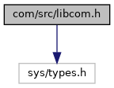
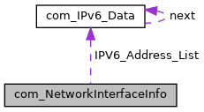

[Data Structures](#nested-classes) \| [Macros](#define-members) \| [Typedefs](#typedef-members) \| [Enumerations](#enum-members) \| [Functions](#func-members) \| [Variables](#var-members)

ADK-COM API. [More\...](#details)

`#include <sys/types.h>`

Include dependency graph for libcom.h:

<a href="libcom_8h_source.md">Go to the source code of this file.</a>

|  |  |
|----|----|
| Data Structures |  |
| struct   | [com_networkEventData](#structcom__network_event_data) |
| struct   | [com_IPConfig](#structcom___i_p_config) |
| struct   | [com_IPv6_Data](#structcom___i_pv6___data) |
| struct   | [com_NetworkInterfaceInfo](#structcom___network_interface_info) |
| struct   | [com_NetworkRouteInfo_IPv4](#structcom___network_route_info___i_pv4) |
| struct   | [com_NetworkRouteInfo_IPv6](#structcom___network_route_info___i_pv6) |
| struct   | [com_PingInfo](#structcom___ping_info) |
| struct   | [com_USBInfo](#structcom___u_s_b_info) |
| struct   | [com_MAC](#structcom___m_a_c) |
| struct   | [com_EddystoneUID](#structcom___eddystone_u_i_d) |
| struct   | [com_EddystoneURL](#structcom___eddystone_u_r_l) |
| struct   | [com_EddystoneURLExt](#structcom___eddystone_u_r_l_ext) |
| struct   | [com_IBeacon](#structcom___i_beacon) |
| struct   | [com_BLEAttribute](#structcom___b_l_e_attribute) |
| struct   | [com_WirelessSignalQuality](#structcom___wireless_signal_quality) |

|  |  |
|----|----|
| Macros |  |
| #define  | [DllSpec](#ad7c2e1cb200073ed64c64285a5f37231) |
| #define  | [ADKCOM_MARK_DEPRECATED](#a68e57f917ef9386e20d908c94ebae641)(why)   <a href="_v_h_q__vfisyspm__wrapper_8cpp.md#a9e4fa62755aeaea9c141cacda826fbcd">__attribute__</a>((deprecated)) |
| #define  | [com_DeviceProperityInt](#ae9e504294e3b30635e62df6a7f82a8da)   [com_DevicePropertyInt](#a74cce87f701d74146be5852c3e6c9bbf) |
| #define  | [com_DeviceProperityString](#a3c901e6cc02991e9fa54cdedc5a8bf20)   [com_DevicePropertyString](#a75c4854b1be8e9387085859b537e2f52) |
| #define  | [COM_PROP_SUPP_INTERFACES](#aadb55ff07323c3df3bc8412ecd85dc6a)   [COM_PROP_SUPPORTED_FEATURES_1](#a74cce87f701d74146be5852c3e6c9bbfa4f351d696edf697c564fd0c24118b93c) |
| #define  | [com_InterfaceMask](#a06d83b69c936f113c5c6fdffaa3a8529)   [com_FeatureMask1](#aa5c3b6a8f6228158ee0cb424b47619d2) |
| #define  | [COM_LAN_1](#a86ce124189b9850f2987117500253a7e)   [COM_FEATURE1_LAN_1](#aa5c3b6a8f6228158ee0cb424b47619d2abb8983be452b4d2e1352f2e3dfe83e73) |
| #define  | [COM_LAN_2](#acd1c21eb3bb13cc8fb7e8681b7ee0dc9)   [COM_FEATURE1_LAN_2](#aa5c3b6a8f6228158ee0cb424b47619d2ab8ebff74395486ed65a0697f0ced63c6) |
| #define  | [COM_GPRS](#aee69ba759b2f926229c1ac1d78791b42)   [COM_FEATURE1_GPRS](#aa5c3b6a8f6228158ee0cb424b47619d2acedb4f3bf8773373e8b0cc433b596727) |
| #define  | [COM_UMTS](#ab55c750ac38e80ba4ff3d34dde9adaea)   [COM_FEATURE1_UMTS](#aa5c3b6a8f6228158ee0cb424b47619d2a513522ef3e6792a50ed7f6ae371931b1) |
| #define  | [COM_ISDN](#a821e5776a023022418b38305fef43cc7)   [COM_FEATURE1_ISDN](#aa5c3b6a8f6228158ee0cb424b47619d2a0323de0f3d7998be520f620254c7fe99) |
| #define  | [COM_MODEM](#a381b092edaeaae75d87757e8fdf0a0b0)   [COM_FEATURE1_MODEM](#aa5c3b6a8f6228158ee0cb424b47619d2a3f6e72db55b72bf3b77fc25c65ee5b4b) |
| #define  | [COM_SERIAL_1](#a928ea4e2d57d464b1728690969a057b3)   [COM_FEATURE1_SERIAL_1](#aa5c3b6a8f6228158ee0cb424b47619d2afbe4a8baaddc72e2b6f42a79c140db2c) |
| #define  | [COM_SERIAL_2](#a1a208a994eb3c816b71237922393b8fd)   [COM_FEATURE1_SERIAL_2](#aa5c3b6a8f6228158ee0cb424b47619d2a5f455e0a0aed6d6f3c729f644c525c2f) |
| #define  | [COM_SERIAL_3](#aea42e03cf93a57dda77dd64b43730ae8)   [COM_FEATURE1_SERIAL_3](#aa5c3b6a8f6228158ee0cb424b47619d2a2759dbc602b5fe07d634d3e0d986e6a5) |
| #define  | [COM_SERIAL_4](#a554cc84cf058bd6601c1d4ed90b807d7)   [COM_FEATURE1_SERIAL_4](#aa5c3b6a8f6228158ee0cb424b47619d2abc58cb63881ec782692efbb51f0b5e7d) |
| #define  | [COM_SERIAL_5](#a79d589d17442144d555f364cc45b18b3)   [COM_FEATURE1_SERIAL_5](#aa5c3b6a8f6228158ee0cb424b47619d2a889f798dcaf586b226296ff29998f674) |
| #define  | [COM_SERIAL_6](#ac53246a3953e4caa590df69512bc6bca)   [COM_FEATURE1_SERIAL_6](#aa5c3b6a8f6228158ee0cb424b47619d2aff856250458896a12800ace8cd175025) |
| #define  | [COM_USB](#a6791c22217126ed3d06a2fd5e0cadd58)   [COM_FEATURE1_USB](#aa5c3b6a8f6228158ee0cb424b47619d2a7f27a496b94be0e7670eaf719aaa926e) |
| #define  | [COM_BLUETOOTH](#a218605c92b617ea871fb16d9e08f4278)   [COM_FEATURE1_BLUETOOTH](#aa5c3b6a8f6228158ee0cb424b47619d2aa43388ffd110ccddb0379b706aaebfcd) |
| #define  | [COM_WIFI](#a6117e62fc6ade01e2ee4a3fe0471ed94)   [COM_FEATURE1_WIFI](#aa5c3b6a8f6228158ee0cb424b47619d2a6f2f8362e29bd514c80df0f6b3aac9ef) |
| #define  | [COM_MDB](#a7af0ef0b94029f5d5803588d76af015f)   [COM_FEATURE1_MDB](#aa5c3b6a8f6228158ee0cb424b47619d2a536a3b801ba00af1c912535c9b91eaa9) |
| #define  | [COM_RS485](#a44b7a33d51e48a87fbc6f6c11f65fecf)   [COM_FEATURE1_RS485](#aa5c3b6a8f6228158ee0cb424b47619d2ac019c9e2fe32fe52c2911817ac48d056) |
| #define  | [COM_SERIAL_USBD](#a6e96b081f71062232074ef01f1c94ad5)   [COM_FEATURE1_SERIAL_USBD](#aa5c3b6a8f6228158ee0cb424b47619d2a3f7eac5eb13fe2df5640040b770d27c0) |
| #define  | [COM_LAN_USBD](#ae94f33a3dd51cd7f7c5d9cb49d017f43)   [COM_FEATURE1_LAN_USBD](#aa5c3b6a8f6228158ee0cb424b47619d2aad9fefdcbde620ee748226ace280768c) |
| #define  | [COM_SERIAL_COM1A](#ab4e8d47158ca9e23e82179b41175bfb7)   [COM_FEATURE1_SERIAL_COM1A](#aa5c3b6a8f6228158ee0cb424b47619d2ace304bd92e788516f4bca6344a672359) |
| #define  | [COM_SERIAL_COM1B](#aa12ee48292e36a5827f60a377df0d61d)   [COM_FEATURE1_SERIAL_COM1B](#aa5c3b6a8f6228158ee0cb424b47619d2ab8b9c79997d28d71a7729685e489b3e7) |
| #define  | [COM_SERIAL_COM1C](#ab45abc51cea6d2d09cc0091df0e6893f)   [COM_FEATURE1_SERIAL_COM1C](#aa5c3b6a8f6228158ee0cb424b47619d2ade39b690218270677bff28318124dcdf) |
| #define  | [COM_SERIAL_COM1D](#a75888ca80b89e354f7279a9e63032103)   [COM_FEATURE1_SERIAL_COM1D](#aa5c3b6a8f6228158ee0cb424b47619d2a1e0ea89f1e921c5bef54de42d60672ee) |
| #define  | [COM_SERIAL_COM1E](#a93a741ac01eecdbdc793339535e6e56f)   [COM_FEATURE1_SERIAL_COM1E](#aa5c3b6a8f6228158ee0cb424b47619d2a187ba89684044ed4fa7cdb5c5fcb9aee) |
| #define  | [COM_LAN_USBH](#aaefdac70482e051410504aa5ca01e6ef)   [COM_FEATURE1_LAN_USBH](#aa5c3b6a8f6228158ee0cb424b47619d2a01f164df046c81012e329b6675a3a908) |
| #define  | [COM_BC_READER](#a8398a93ffac633389a4f7ec20067aae9)   [COM_FEATURE1_BC_READER](#aa5c3b6a8f6228158ee0cb424b47619d2a0d3e4609db27d08c7d1824bac4edcd6d) |
| #define  | [COM_USBSER](#a4a2254fd3f22f72f3fd934f7580b49ee)   [COM_FEATURE1_USBSER](#aa5c3b6a8f6228158ee0cb424b47619d2a4cb4b1848370c3fb358b1a8b07094292) |
| #define  | [COM_LAN_USBD1](#aadc11be406ca0138918233bc8873fe36)   [COM_FEATURE1_LAN_USBD1](#aa5c3b6a8f6228158ee0cb424b47619d2a6b787580c01d23b6bcb07532bf937eaf) |
| #define  | [COM_BLE](#aea592dfcfaee76bf414e0e6584f740c1)   [COM_FEATURE1_BLE](#aa5c3b6a8f6228158ee0cb424b47619d2ac920927f3f3e173215a8a5971d40196f) |
| #define  | [COM_4G_LTE](#a47ab10cd86fb4b838f5b1c871ec2965d)   [COM_FEATURE1_4G_LTE](#aa5c3b6a8f6228158ee0cb424b47619d2a633974933d07af29c846539583eeb800) |
| #define  | [COM_DUAL_SIM](#ab0269ad45cfbef2f4b546876120e6b8f)   [COM_FEATURE1_DUAL_SIM](#aa5c3b6a8f6228158ee0cb424b47619d2a7b9e16aea189ee2ee0a98487faadc8a3) |
| #define  | [COM_SSL_POLICY_IGNORE_NONE](#aec598692970f3aeae2414b293feac4f4)   ((int) 0) |
| #define  | [COM_SSL_POLICY_IGNORE_ALL](#a7dec03cd17a237d847b9021ccbe27f2b)   (1 \<\< 0) |
| #define  | [COM_SSL_POLICY_IGNORE_CERT_SELF_SIGNED](#a0884f4f903cddbb382c20b60ccd1790f)   (1 \<\< 1) |
| #define  | [COM_SSL_POLICY_IGNORE_CERT_HAS_EXPIRED](#a78592543c92e6d40870fd5a41da6e94d)   (1 \<\< 2) |
| #define  | [COM_SSL_POLICY_IGNORE_CERT_NOT_YET_VALID](#abe6b2eae37ec24c63ea522a77a090d77)   (1 \<\< 3) |
| #define  | [COM_SSL_POLICY_IGNORE_HOSTNAME_CHECK](#abe3c54e2242e230ea20c6cc3433a7d81)   (1 \<\< 4) |
| #define  | [COM_SSL_POLICY_IGNORE_CA_KEY_TOO_SMALL](#a45c979956ce215a37b0a7f10196e2da3)   (1 \<\< 5) |
| #define  | [COM_SSL_POLICY_IGNORE_CA_MD_TOO_WEAK](#a4cb1891c0fa8bc314b2c08c4d7897627)   (1 \<\< 6) |
| #define  | [COM_IPV4_ADDR_LENGTH](#a24512e5a794918da700c76965390a252)   (15 + 1) |
| #define  | [COM_IPV6_ADDR_LENGTH](#ab5e8e326a620cff39a739043bdb31068)   (47 + 1) |
| #define  | [COM_MAC_ADDR_LENGTH](#a06e8209b725a05306dff2305188c21b4)   (17 + 1) |
| #define  | [COM_ETH_MAC_ADDR_LENGTH](#a84740c72d74904d91cb14f4229fa6958)   [COM_MAC_ADDR_LENGTH](#a06e8209b725a05306dff2305188c21b4) |
| #define  | [COM_SELECT_READ](#a814f3a2e74ce0a12bc89cd1a1b1b86f8)   (1 \<\< 0) |
| #define  | [COM_SELECT_WRITE](#a08da6ce26a387cf4487f4a50dc0f4773)   (1 \<\< 1) |
| #define  | [COM_SELECT_INTERRUPT](#ab9ea34bb6a76cabdfbc2d8c85a49c70a)   (1 \<\< 2) |
| #define  | [MAX_WLAN_SURVEY_COUNT](#af6dd4da99250497b436998fe27f6d37d)   25 |
| #define  | [COM_BT_COUNT](#a221415dfb91486272ba58722b58ce43e)   \"BT_COUNT\" |
| #define  | [COM_WLAN_COUNT](#a1782f83ac38bf06e099ac19e4e03511b)   \"WLAN_COUNT\" |
| #define  | [COM_GSM_COUNT](#a687f8cf03cb629dcbe33093f59493e5f)   \"GSM_COUNT\" |
| #define  | [COM_LOG_COUNT](#aa8056b7006e30ed4c1cc76459bbdf0e9)   \"LOG_COUNT\" |
| #define  | [COM_LINK_SPEED_EXT_INTERFACE](#aacc18173e883dfed787dd17417107754)   \"interface\" |
| #define  | [COM_LINK_SPEED_EXT_CONFIGURED](#a63ffaffff6d7859b86e02a5dfce98025)   \"configured\" |
| #define  | [COM_LINK_SPEED_EXT_ACTIVE](#a18f17cacb5545fdc85a554ef819e172a)   \"active\" |

|  |  |
|----|----|
| Typedefs |  |
| typedef void(\*  | [comCallbackConnectionType](#aa7c90fef5142b54c2f7b95b23e381af6)) (enum [com_ConnectionEvent](#a8239249db998e4aac1b0477ec2e1b40f) event, enum [com_ConnectionType](#ad8ed41376d7876324c9101abf3cdd75c) type, const void \*data, void \*priv, enum [com_ErrorCodes](#a332bd39910a20de262a2321a456e4a58) com_errno) |
| typedef void(\*  | [comCallbackNetworkType](#a527b5d93b76532de3d8eef4fdaf23fd3)) (enum [com_NetworkEvent](#a0496cb54a878b5e873baabcb337f3b67) event, enum [com_NetworkType](#aec0f538a04656ee7da7fa126128d3047) type, const void \*data, void \*priv, enum [com_ErrorCodes](#a332bd39910a20de262a2321a456e4a58) com_errno) |
| typedef void(\*  | [comCallbackWirelessScanType](#a88cd11d3a473225046a3d3029e3b040d)) (enum [com_WirelessScanEvent](#ae62ac545841882377e59e34428e7025e) event, enum [com_WirelessNetworkType](#a65804830613e63a444697c3e8c24cca5) type, enum [com_DataFormat](#a18092d13d1e138450f65c2cd5595969b) format, const void \*data, void \*priv, enum [com_ErrorCodes](#a332bd39910a20de262a2321a456e4a58) com_errno) |
| typedef void(\*  | [comCallbackGATTCharacteristicChanged](#a3f1c4925b00f2038884e8c8c35af72cc)) (enum [com_BLEAttributeEvent](#aa6c846af117990ab66907fecbd9b1888) eventType, struct [com_BLEAttribute](#structcom___b_l_e_attribute) \*attribute, void \*priv, enum [com_ErrorCodes](#a332bd39910a20de262a2321a456e4a58) com_errno) |
| typedef void(\*  | [comCallbackGATTStatus](#ab428524bd2bb131016d54a0c97b6bd85)) (enum [com_BLEStatusEvent](#ac7b4c8fba135aee7ba832ae202f1a045) eventType, struct [com_MAC](#structcom___m_a_c) mac, void \*priv, enum [com_ErrorCodes](#a332bd39910a20de262a2321a456e4a58) com_errno) |
| typedef struct com_ConnectHandle  | [com_NetworkHandle](#a88b8565220810fc29b3984b94e785a4e) |

|  |  |
|----|----|
| Enumerations |  |
| enum   | [com_NetworkStatus](#ae04c2eda5b1eb746d9859a9bc0e2bc14) { [COM_NETWORK_STATUS_ERROR](#ae04c2eda5b1eb746d9859a9bc0e2bc14acf84c36dd9cd83f71e4928c92e774bb6) = 0, [COM_NETWORK_STATUS_START](#ae04c2eda5b1eb746d9859a9bc0e2bc14af9d2097570453c43b6c0aa44eacf74b2) = 1, [COM_NETWORK_STATUS_STOP](#ae04c2eda5b1eb746d9859a9bc0e2bc14a6a83453fdacd562d990d9689333d0210) = 2 } |
| enum   | [com_WaitStatus](#a02ed137c38a7f529440af3d68d17a740) { [COM_CONNECTION_STATUS_CONNECT](#a02ed137c38a7f529440af3d68d17a740ad3f448426bd402fcb46e5a869958703a) = 0, [COM_CONNECTION_STATUS_FAIL](#a02ed137c38a7f529440af3d68d17a740a83e94c9c913edb32f410836c967730bd) = 1, [COM_CONNECTION_STATUS_TIMEOUT](#a02ed137c38a7f529440af3d68d17a740aa86b5f76793d66696d26e1826d91e008) = 2, [COM_CONNECTION_STATUS_ERROR](#a02ed137c38a7f529440af3d68d17a740aaa10da7284f598cce8f8acbbbe619473) = 3 } |
| enum   | [com_WaitNetStatus](#a0fa9ee525de984dfdb924e450ba8fbd3) { [COM_NET_STATUS_OK](#a0fa9ee525de984dfdb924e450ba8fbd3ad179702710159b7c1bf09ab748a23c29) = 0, [COM_NET_STATUS_FAIL](#a0fa9ee525de984dfdb924e450ba8fbd3af02ea86f834b9f5d1f59d9ef6ab74bbb) = 1, [COM_NET_STATUS_TIMEOUT](#a0fa9ee525de984dfdb924e450ba8fbd3a8ea1173c870490af3dff23155c3e0122) = 2, [COM_NET_STATUS_ERROR](#a0fa9ee525de984dfdb924e450ba8fbd3a6cc560cf7105b84bce8b8d46d07eaf1f) = 3 } |
| enum   | [com_ConnectionEvent](#a8239249db998e4aac1b0477ec2e1b40f) {   [COM_EVENT_CONNECTION_ESTABLISHED](#a8239249db998e4aac1b0477ec2e1b40faf6a88224f3a2b5849158d946dc3090d0) = 0, [COM_EVENT_CONNECTION_NEXT](#a8239249db998e4aac1b0477ec2e1b40fa6d8216bd52bb2d6dd8934962d43bfe13) = 1, [COM_EVENT_CONNECTION_FAILED](#a8239249db998e4aac1b0477ec2e1b40fa0fce86b65d98a83d795ba4f8dee4944f) = 2, [COM_EVENT_PROFILE_FAILED](#a8239249db998e4aac1b0477ec2e1b40fa7ba08d06fab43ae5774d8eccbbd8ab65) = 3,   [COM_EVENT_SSL_PASSWORD_REQUIRED](#a8239249db998e4aac1b0477ec2e1b40fa324795c247f93c2b82ec1130066b551a) = 4, [COM_EVENT_SSL_PKCS12_PASSWORD_REQUIRED](#a8239249db998e4aac1b0477ec2e1b40fa7842843df864a8cf4d0189516feb82c8) = COM_EVENT_SSL_PASSWORD_REQUIRED, [COM_EVENT_SSL_CONFIRM_POLICY_OVERRIDE](#a8239249db998e4aac1b0477ec2e1b40fa3ce7889a38b6da2c4c0053f19446c6a6) = 5, [COM_EVENT_SSL_PKEY_PASSWORD_REQUIRED](#a8239249db998e4aac1b0477ec2e1b40fab6d12ffc34ebfe830ebd4adc5f5be093) = 6,   [COM_EVENT_CONNECTION_SKIPPED](#a8239249db998e4aac1b0477ec2e1b40fa32fd736aa0e5997d2b44077951806a9a) = 7, [COM_EVENT_CONNECTION_LISTENING](#a8239249db998e4aac1b0477ec2e1b40fa49558be8ef763f77fc8331b80df4772f) = 8 } |
| enum   | [com_ConnectionState](#a5f26be8fbd649e583318d5fdc9d0581d) {   [COM_CON_STATE_ACTIVE](#a5f26be8fbd649e583318d5fdc9d0581da2b7d16cb01860d08c8f643a549ddcaf0) = 0, [COM_CON_STATE_PARAM_INVALID](#a5f26be8fbd649e583318d5fdc9d0581da1a1d0e87527c1d95295473ffa60358a0) = 1, [COM_CON_STATE_PARAM_NO_CON](#a5f26be8fbd649e583318d5fdc9d0581da5d07173ce1f43e714b38b02c5d6eb67c) = 2, [COM_CON_STATE_RESET](#a5f26be8fbd649e583318d5fdc9d0581da9c438d1945545ff6aa13f65497526143) = 3,   [COM_CON_STATE_REMOTE_CLOSING](#a5f26be8fbd649e583318d5fdc9d0581dac5b944b1c89293c2c5a99bea5130f433) = 4, [COM_CON_STATE_TIMEDOUT](#a5f26be8fbd649e583318d5fdc9d0581da80903adf8a9c14b779db6cc58b320ada) = 5 } |
| enum   | [com_NetworkEvent](#a0496cb54a878b5e873baabcb337f3b67) {   [COM_EVENT_INVALID](#a0496cb54a878b5e873baabcb337f3b67a5374b3527347a7512dd33df0e6b58020) = 0, [COM_EVENT_NETWORK_INTERFACE_UP](#a0496cb54a878b5e873baabcb337f3b67ad2a8194f7a0a2154d394403790f79c1b) = 1, [COM_EVENT_NETWORK_INTERFACE_DOWN](#a0496cb54a878b5e873baabcb337f3b67aeaba7d1c3e632d358240629062465971) = 2, [COM_EVENT_NETWORK_LINK_UP](#a0496cb54a878b5e873baabcb337f3b67a3646cbdc6723387e5b71fb570e1a865e) = 3,   [COM_EVENT_NETWORK_LINK_DOWN](#a0496cb54a878b5e873baabcb337f3b67a69049ca20e2420d3b011774fd81bb2d7) = 4, [COM_EVENT_NETWORK_SIGNAL](#a0496cb54a878b5e873baabcb337f3b67aca3f67d99162f0ec19ecf625a4c7e09f) = 5, [COM_EVENT_NETWORK_RECONNECT](#a0496cb54a878b5e873baabcb337f3b67a2c960d72fd16afb94124802d59ffc7c9) = 6, [COM_EVENT_SIM_PIN_REQUEST](#a0496cb54a878b5e873baabcb337f3b67a75adc9d0dae397aa39ad97e63c8bef26) = 7,   [COM_EVENT_SIM_PUK_REQUEST](#a0496cb54a878b5e873baabcb337f3b67af5bcf5fda135e84e6fcb0f5e68fab056) = 8, [COM_EVENT_SIM2_PIN_REQUEST](#a0496cb54a878b5e873baabcb337f3b67a95a2ea5685eb281ae17a127e9894add9) = 18, [COM_EVENT_SIM2_PUK_REQUEST](#a0496cb54a878b5e873baabcb337f3b67a64b0d4e3b9a76a8d228c6c0048e5a396) = 19, [COM_EVENT_NETWORK_PACKET_SWITCH](#a0496cb54a878b5e873baabcb337f3b67a2ec6553045c2df51590b29ccd1cc1c22) = 9,   [COM_EVENT_INTERNAL_PING](#a0496cb54a878b5e873baabcb337f3b67a1960d7b43c1c6101a2d18ef225d392ea) = 10, [COM_EVENT_BT_CONFIRM_PAIR_REQUEST](#a0496cb54a878b5e873baabcb337f3b67a88bb22ca3bceff283f3ea3e7a3cf4fee) = 11, [COM_EVENT_BT_PAIR_DONE](#a0496cb54a878b5e873baabcb337f3b67aa6ef0e1744bbc09f430eb7fada50ccec) = 12, [COM_EVENT_BT_DISCOV_TO_ELAPSED](#a0496cb54a878b5e873baabcb337f3b67a1d15739e51c75b518b3b9801d6290ed9) = 13,   [COM_EVENT_NETWORK_FAILED](#a0496cb54a878b5e873baabcb337f3b67a3478625186e16ec85f446de5b055e7af) = 14, [COM_EVENT_BT_SPP_SERVER_CONNECTED](#a0496cb54a878b5e873baabcb337f3b67a514248e0787997b6f124cbcc845f9f40) = 15, [COM_EVENT_BT_SPP_SERVER_DISCONNECTED](#a0496cb54a878b5e873baabcb337f3b67a96e1a8ed2308e21e2bf9b8a6c607e309) = 16, [COM_EVENT_GEOFENCE_VIOLATION](#a0496cb54a878b5e873baabcb337f3b67a03373f9158b21761dbd9185d8d568bb3) = 17,   [COM_EVENT_BT_EXT_PIN](#a0496cb54a878b5e873baabcb337f3b67a025a82a94ac67872d1cdbbcfe3d1041b) = 20, [COM_EVENT_BT_EXT_CONFIRM](#a0496cb54a878b5e873baabcb337f3b67a9f1d25590dfdff3e02aabbdc2deed381) = 21, [COM_EVENT_BT_EXT_VISUALIZE](#a0496cb54a878b5e873baabcb337f3b67a320046ae08e5dfb46679e8872556c35e) = 22, [COM_EVENT_BT_EXT_TIMEOUT](#a0496cb54a878b5e873baabcb337f3b67a677d21d138df96ee31a74379d6cd56da) = 23,   [COM_EVENT_BT_EXT_FAILED](#a0496cb54a878b5e873baabcb337f3b67a6c74364b3344ca1f0bda4b87712712e9) = 24, [COM_EVENT_BT_EXT_SUCCESS](#a0496cb54a878b5e873baabcb337f3b67a136879a0c45bd4836dbb2f00a43160e3) = 25, [COM_EVENT_NETWORK_ATTACH](#a0496cb54a878b5e873baabcb337f3b67a0fb326a93c65b4034d79b91829ecf001) = 26, [COM_EVENT_NETWORK_DETACH](#a0496cb54a878b5e873baabcb337f3b67a7aa550be2ca20ffc0384ffd3dadb80ea) = 27,   [COM_EVENT_DEVICE_PWR_OFF](#a0496cb54a878b5e873baabcb337f3b67af911dd9b1a4c937b0dcd02c29b89822a) = 28, [COM_EVENT_DEVICE_PWR_ON](#a0496cb54a878b5e873baabcb337f3b67aa4365fc07161ea3a7871a247bb8252b3) = 29, [COM_EVENT_NETWORK_SIGNAL_EXT](#a0496cb54a878b5e873baabcb337f3b67acb36cbbc51841b7496cabb36138b9ca4) = 30, [COM_EVENT_REG_STATUS_CHANGE](#a0496cb54a878b5e873baabcb337f3b67ab19b54bd7d3e9758bb9e61a80325d6a0) = 31,   [COM_EVENT_SIM_SLOT_SWITCH](#a0496cb54a878b5e873baabcb337f3b67ae0196257910fb184a6fd1f625abade7c) = 32, [COM_EVENT_PD_REG_STATUS_CHANGE](#a0496cb54a878b5e873baabcb337f3b67a10f5d328d322b1c5d19025a18f3ea476) = 33, [COM_EVENT_PD_EVENT](#a0496cb54a878b5e873baabcb337f3b67aef12400f7d7a93f282eb25ed5abb4af7) = 34, [COM_EVENT_BLE_EXT_PIN](#a0496cb54a878b5e873baabcb337f3b67a2d1d5bdcb8f3bbee303a88432b675716) = 41,   [COM_EVENT_BLE_EXT_CONFIRM](#a0496cb54a878b5e873baabcb337f3b67a3bba88977459fed53531e1269e2492ea) = 42, [COM_EVENT_BLE_EXT_VISUALIZE](#a0496cb54a878b5e873baabcb337f3b67a1dda616323eb9020c4284d2ee13deabd) = 43, [COM_EVENT_BLE_EXT_TIMEOUT](#a0496cb54a878b5e873baabcb337f3b67a540d80b3d80c2a57e0055f5ccc303045) = 44, [COM_EVENT_BLE_EXT_FAILED](#a0496cb54a878b5e873baabcb337f3b67a58e16f61ebd4766ee53545fddbab5ea0) = 45,   [COM_EVENT_BLE_EXT_SUCCESS](#a0496cb54a878b5e873baabcb337f3b67aca5acceb0bcd437f7dfa7af6761f09ee) = 46, [COM_EVENT_WLAN_AP_DISCONNECT](#a0496cb54a878b5e873baabcb337f3b67a5700d781f321fa0bf0b7ad56d3aa28f0) = 47, [COM_EVENT_WLAN_AP_CONNECT](#a0496cb54a878b5e873baabcb337f3b67a0fc34875ef21c243671122ae0e1fd1f9) = 48 } |
| enum   | [com_WirelessScanEvent](#ae62ac545841882377e59e34428e7025e) { [COM_EVENT_WIRELESS_SCAN_SUCCESS](#ae62ac545841882377e59e34428e7025eacc27f708631923a02369a09fec48cc38) = 1, [COM_EVENT_WIRELESS_SCAN_FAILURE](#ae62ac545841882377e59e34428e7025ea905b8b93ff9f552c57c22370146c3f3e) = 2 } |
| enum   | [com_DataFormat](#a18092d13d1e138450f65c2cd5595969b) { [COM_DATA_FORMAT_FLAT](#a18092d13d1e138450f65c2cd5595969ba4a1068c953cdf114a4acbd2dda598fad) = 0 } |
| enum   | [com_OrangePortNumber](#a4493f2596e06ab95db0b3c0fa9938557) {   [COM_ORANGE_PORT_NONE](#a4493f2596e06ab95db0b3c0fa9938557a47405804495a8fdca10e6ed6b1fd04d8) = 0, [COM_ORANGE_PORT_1](#a4493f2596e06ab95db0b3c0fa9938557a394f4daaa7b5d0d88d2bfc7c5ec6508f) = 1, [COM_ORANGE_PORT_2](#a4493f2596e06ab95db0b3c0fa9938557a91e5683ea1f6eca98d88ec5415d0d2e6) = 2, [COM_ORANGE_PORT_3](#a4493f2596e06ab95db0b3c0fa9938557ad2427809b4f6310cca10aac83dd3899b) = 3,   [COM_ORANGE_PORT_4](#a4493f2596e06ab95db0b3c0fa9938557a2008e6fe0c1787013c1d1d57686ee233) = 4 } |
| enum   | [com_FeatureMask1](#aa5c3b6a8f6228158ee0cb424b47619d2) {   [COM_FEATURE1_LAN_1](#aa5c3b6a8f6228158ee0cb424b47619d2abb8983be452b4d2e1352f2e3dfe83e73) = 1 \<\< 0, [COM_FEATURE1_LAN_2](#aa5c3b6a8f6228158ee0cb424b47619d2ab8ebff74395486ed65a0697f0ced63c6) = 1 \<\< 1, [COM_FEATURE1_GPRS](#aa5c3b6a8f6228158ee0cb424b47619d2acedb4f3bf8773373e8b0cc433b596727) = 1 \<\< 2, [COM_FEATURE1_UMTS](#aa5c3b6a8f6228158ee0cb424b47619d2a513522ef3e6792a50ed7f6ae371931b1) = 1 \<\< 3,   [COM_FEATURE1_ISDN](#aa5c3b6a8f6228158ee0cb424b47619d2a0323de0f3d7998be520f620254c7fe99) = 1 \<\< 4, [COM_FEATURE1_MODEM](#aa5c3b6a8f6228158ee0cb424b47619d2a3f6e72db55b72bf3b77fc25c65ee5b4b) = 1 \<\< 5, [COM_FEATURE1_SERIAL_1](#aa5c3b6a8f6228158ee0cb424b47619d2afbe4a8baaddc72e2b6f42a79c140db2c) = 1 \<\< 6, [COM_FEATURE1_SERIAL_2](#aa5c3b6a8f6228158ee0cb424b47619d2a5f455e0a0aed6d6f3c729f644c525c2f) = 1 \<\< 7,   [COM_FEATURE1_SERIAL_3](#aa5c3b6a8f6228158ee0cb424b47619d2a2759dbc602b5fe07d634d3e0d986e6a5) = 1 \<\< 8, [COM_FEATURE1_SERIAL_4](#aa5c3b6a8f6228158ee0cb424b47619d2abc58cb63881ec782692efbb51f0b5e7d) = 1 \<\< 9, [COM_FEATURE1_SERIAL_5](#aa5c3b6a8f6228158ee0cb424b47619d2a889f798dcaf586b226296ff29998f674) = 1 \<\< 10, [COM_FEATURE1_SERIAL_6](#aa5c3b6a8f6228158ee0cb424b47619d2aff856250458896a12800ace8cd175025) = 1 \<\< 11,   [COM_FEATURE1_USB](#aa5c3b6a8f6228158ee0cb424b47619d2a7f27a496b94be0e7670eaf719aaa926e) = 1 \<\< 12, [COM_FEATURE1_BLUETOOTH](#aa5c3b6a8f6228158ee0cb424b47619d2aa43388ffd110ccddb0379b706aaebfcd) = 1 \<\< 13, [COM_FEATURE1_WIFI](#aa5c3b6a8f6228158ee0cb424b47619d2a6f2f8362e29bd514c80df0f6b3aac9ef) = 1 \<\< 14, [COM_FEATURE1_MDB](#aa5c3b6a8f6228158ee0cb424b47619d2a536a3b801ba00af1c912535c9b91eaa9) = 1 \<\< 15,   [COM_FEATURE1_RS485](#aa5c3b6a8f6228158ee0cb424b47619d2ac019c9e2fe32fe52c2911817ac48d056) = 1 \<\< 16, [COM_FEATURE1_SERIAL_USBD](#aa5c3b6a8f6228158ee0cb424b47619d2a3f7eac5eb13fe2df5640040b770d27c0) = 1 \<\< 17, [COM_FEATURE1_LAN_USBD](#aa5c3b6a8f6228158ee0cb424b47619d2aad9fefdcbde620ee748226ace280768c) = 1 \<\< 18, [COM_FEATURE1_SERIAL_COM1A](#aa5c3b6a8f6228158ee0cb424b47619d2ace304bd92e788516f4bca6344a672359) = 1 \<\< 19,   [COM_FEATURE1_SERIAL_COM1B](#aa5c3b6a8f6228158ee0cb424b47619d2ab8b9c79997d28d71a7729685e489b3e7) = 1 \<\< 20, [COM_FEATURE1_SERIAL_COM1C](#aa5c3b6a8f6228158ee0cb424b47619d2ade39b690218270677bff28318124dcdf) = 1 \<\< 21, [COM_FEATURE1_SERIAL_COM1D](#aa5c3b6a8f6228158ee0cb424b47619d2a1e0ea89f1e921c5bef54de42d60672ee) = 1 \<\< 22, [COM_FEATURE1_SERIAL_COM1E](#aa5c3b6a8f6228158ee0cb424b47619d2a187ba89684044ed4fa7cdb5c5fcb9aee) = 1 \<\< 23,   [COM_FEATURE1_LAN_USBH](#aa5c3b6a8f6228158ee0cb424b47619d2a01f164df046c81012e329b6675a3a908) = 1 \<\< 24, [COM_FEATURE1_BC_READER](#aa5c3b6a8f6228158ee0cb424b47619d2a0d3e4609db27d08c7d1824bac4edcd6d) = 1 \<\< 25, [COM_FEATURE1_USBSER](#aa5c3b6a8f6228158ee0cb424b47619d2a4cb4b1848370c3fb358b1a8b07094292) = 1 \<\< 26, [COM_FEATURE1_LAN_USBD1](#aa5c3b6a8f6228158ee0cb424b47619d2a6b787580c01d23b6bcb07532bf937eaf) = 1 \<\< 27,   [COM_FEATURE1_BLE](#aa5c3b6a8f6228158ee0cb424b47619d2ac920927f3f3e173215a8a5971d40196f) = 1 \<\< 28, [COM_FEATURE1_4G_LTE](#aa5c3b6a8f6228158ee0cb424b47619d2a633974933d07af29c846539583eeb800) = 1 \<\< 29, [COM_FEATURE1_DUAL_SIM](#aa5c3b6a8f6228158ee0cb424b47619d2a7b9e16aea189ee2ee0a98487faadc8a3) = 1 \<\< 30 } |
| enum   | [com_FeatureMask2](#a62b31ba92470bf5d1bd2a2ca8de5728d) {   [COM_FEATURE2_PPP_SERIAL](#a62b31ba92470bf5d1bd2a2ca8de5728da0efce2e2ad2676d38e5cc43efa70500d) = 1 \<\< 0, [COM_FEATURE2_USBGADGET_SERIAL](#a62b31ba92470bf5d1bd2a2ca8de5728da29aaae92fb54f6ec85654c4d5847f5d0) = 1 \<\< 1, [COM_FEATURE2_USBGADGET_ETH_RNDIS](#a62b31ba92470bf5d1bd2a2ca8de5728da4ef2725e821b0509e7674f92496c6e72) = 1 \<\< 2, [COM_FEATURE2_USBGADGET_SERIAL_RNDIS](#a62b31ba92470bf5d1bd2a2ca8de5728da80f9010da004272fc26e22b386546b30) = 1 \<\< 3,   [COM_FEATURE2_USBGADGET_SERIAL_ECM](#a62b31ba92470bf5d1bd2a2ca8de5728da5f717706fa6da2e3b054706a811eee5d) = 1 \<\< 4, [COM_FEATURE2_USBGADGET_ETH_ECM](#a62b31ba92470bf5d1bd2a2ca8de5728da3df4c1c712877bd51380f20e5eb9c6b8) = 1 \<\< 5, [COM_FEATURE2_USBGADGET_ETH_ECMx2](#a62b31ba92470bf5d1bd2a2ca8de5728da31520d1c5b44a2966e773f5285db7350) = 1 \<\< 6, [COM_FEATURE2_USBGADGET_SERIAL_ECMx2](#a62b31ba92470bf5d1bd2a2ca8de5728daf3b740354e3b9f04cbb7a23fbec4ef3f) = 1 \<\< 7,   [COM_FEATURE2_BRIDGING](#a62b31ba92470bf5d1bd2a2ca8de5728da8430227e318e9cf10fbe9591676f339b) = 1 \<\< 8, [COM_FEATURE2_CSD](#a62b31ba92470bf5d1bd2a2ca8de5728dacdb24867d9b5d9e54085bae1202fcb33) = 1 \<\< 9, [COM_FEATURE2_IBEACON](#a62b31ba92470bf5d1bd2a2ca8de5728da1815e7979238e0277c305256b61117ec) = 1 \<\< 10, [COM_FEATURE2_EDDYSTONE](#a62b31ba92470bf5d1bd2a2ca8de5728dab291e5149579531845fab07bbda4af9e) = 1 \<\< 11,   [COM_FEATURE2_GPRS_SIGNAL_EVENTS](#a62b31ba92470bf5d1bd2a2ca8de5728da1d6f837bad338253b5ee32d75bf72a91) = 1 \<\< 12, [COM_FEATURE2_BT_PAIR_EXT](#a62b31ba92470bf5d1bd2a2ca8de5728da439c88fdb5644a383e319303784d5b0c) = 1 \<\< 13, [COM_FEATURE2_BT_GATT](#a62b31ba92470bf5d1bd2a2ca8de5728da92349379e91796523a881ac0eac1a86c) = 1 \<\< 14, [COM_FEATURE2_WIFI_SIGNAL_EVENTS](#a62b31ba92470bf5d1bd2a2ca8de5728da15ba1ac3955ebfd56ef88db237448423) = 1 \<\< 15,   [COM_FEATURE2_BT_VIRTUAL_CHANNELS](#a62b31ba92470bf5d1bd2a2ca8de5728da02329d5c5a836e940cc8a413295762fc) = 1 \<\< 16, [COM_FEATURE2_BT_GATT_SERIAL](#a62b31ba92470bf5d1bd2a2ca8de5728dae8b43f37e70f6510b57fc198337cd38d) = 1 \<\< 17, [COM_FEATURE2_DEVICE_NO_AUTOPOWER](#a62b31ba92470bf5d1bd2a2ca8de5728da6961dc976446f06166e2d75d9f014ffa) = 1 \<\< 18, [COM_FEATURE2_BASE_COMMUNICATIONS](#a62b31ba92470bf5d1bd2a2ca8de5728dae315054f884075b92ead5b74b3806edf) = 1 \<\< 19,   [COM_FEATURE2_BT_GATT_BEACON_CTL](#a62b31ba92470bf5d1bd2a2ca8de5728da6dd7a95605577c5b9f17b5e2f5071cae) = 1 \<\< 20, [COM_FEATURE2_USB_PORT_1_CONFIG](#a62b31ba92470bf5d1bd2a2ca8de5728daceb6a30c9976543610893fe43aa7f97f) = 1 \<\< 21, [COM_FEATURE2_USB_PORT_2_CONFIG](#a62b31ba92470bf5d1bd2a2ca8de5728dad4880f3b64d2c204c6a6114f68590bbc) = 1 \<\< 22, [COM_FEATURE2_USB_PORT_1_GADGET_CONFIG](#a62b31ba92470bf5d1bd2a2ca8de5728dad1cdb4d9d51ff9b22e2b7bb0b961e5f5) = 1 \<\< 23,   [COM_FEATURE2_USB_PORT_2_GADGET_CONFIG](#a62b31ba92470bf5d1bd2a2ca8de5728da043fabbfd418e4f58eaa5437bcd3b62c) = 1 \<\< 24, [COM_FEATURE2_SERIAL_USBD2](#a62b31ba92470bf5d1bd2a2ca8de5728da41eb985c2f826d907af205ca3ee96d56) = 1 \<\< 25, [COM_FEATURE2_LAN_USBD2](#a62b31ba92470bf5d1bd2a2ca8de5728daf939d63ab9c4d7b0dab99839ab8e5d51) = 1 \<\< 26, [COM_FEATURE2_LAN_USBD3](#a62b31ba92470bf5d1bd2a2ca8de5728da6bcedb06757bedfbadcde416f7e8ffb0) = 1 \<\< 27,   [COM_FEATURE2_RADIO_POWER_PROFILE](#a62b31ba92470bf5d1bd2a2ca8de5728daef8ff98ce4d63312c617c99f16b5fdd3) = 1 \<\< 28, [COM_FEATURE2_DUAL_BAND_WIFI](#a62b31ba92470bf5d1bd2a2ca8de5728da6f9a93e144aaef698c7443e8be3e3458) = 1 \<\< 29, [COM_FEATURE2_IPV6](#a62b31ba92470bf5d1bd2a2ca8de5728da39b6a5c5ab8271806f5f56a988791a58) = 1 \<\< 30 } |
| enum   | [com_FeatureMask3](#a4c8d8656674e4a4caa58ebcae4b99de0) {   [COM_FEATURE3_AUTO_RECONNECT](#a4c8d8656674e4a4caa58ebcae4b99de0ab4a9a3b478101b892e4547e6735a11e3) = 1 \<\< 0, [COM_FEATURE3_SIM_TOOLKIT](#a4c8d8656674e4a4caa58ebcae4b99de0aaee808eb409e1e824fbedb5de4766b9f) = 1 \<\< 1, [COM_FEATURE3_USSD](#a4c8d8656674e4a4caa58ebcae4b99de0a4e4762f944c8e4784af1f741308cf239) = 1 \<\< 2, [COM_FEATURE3_WLAN_BAND_SELECTION](#a4c8d8656674e4a4caa58ebcae4b99de0a6e965623271e0db5145bb21f022d1e2c) = 1 \<\< 3,   [COM_FEATURE3_DHCP_CONFIG_PARAMS](#a4c8d8656674e4a4caa58ebcae4b99de0a0c25bbf39eb886b0728ffce208be32c7) = 1 \<\< 4, [COM_FEATURE3_GRANULAR_RADIO_RESTART](#a4c8d8656674e4a4caa58ebcae4b99de0a55120641770d15fbf31f2bf2049e4444) = 1 \<\< 5, [COM_FEATURE3_TETHERING](#a4c8d8656674e4a4caa58ebcae4b99de0ab0f1f652e880fd277ca7bfd0cde216f8) = 1 \<\< 6, [COM_FEATURE3_LAN_802_1X_EAP](#a4c8d8656674e4a4caa58ebcae4b99de0a7ab8a273f1aa6b9add8ae545ec223b7e) = 1 \<\< 7,   [COM_FEATURE3_BASE_GET_SET_CONFIG](#a4c8d8656674e4a4caa58ebcae4b99de0a3526ced875da09fc056e9e1e2b0be967) = 1 \<\< 8, [COM_FEATURE3_USBGADGET_IAP2](#a4c8d8656674e4a4caa58ebcae4b99de0a280343e916c7bbb063067c6d8a500923) = 1 \<\< 9, [COM_FEATURE3_SIM_ACCESS](#a4c8d8656674e4a4caa58ebcae4b99de0a6312e7d9a8f025b6ae9034bdc4835424) = 1 \<\< 10, [COM_FEATURE3_USBGADGET_ETH_NCM](#a4c8d8656674e4a4caa58ebcae4b99de0adb1aa11fd6d67bdd086535dc6dbe55a8) = 1 \<\< 11,   [COM_FEATURE3_USBGADGET_SERIAL_NCM](#a4c8d8656674e4a4caa58ebcae4b99de0a4d20eabaf6c58b181639ca702add13a7) = 1 \<\< 12, [COM_FEATURE3_USBGADGET_ETH_EEM](#a4c8d8656674e4a4caa58ebcae4b99de0aaf381215fa3b36c1e796a87906c45542) = 1 \<\< 13, [COM_FEATURE3_USBGADGET_SERIAL_EEM](#a4c8d8656674e4a4caa58ebcae4b99de0a151224c9ba27114e8a3590b3224f90d7) = 1 \<\< 14, [COM_FEATURE3_ORANGE_PORT_MGMT](#a4c8d8656674e4a4caa58ebcae4b99de0a026064792e55fc2b484f7a414b92a30e) = 1 \<\< 15,   [COM_FEATURE3_ORANGE_ETH_SWITCH_MGMT](#a4c8d8656674e4a4caa58ebcae4b99de0ac4b96b7d11c0b83daaa7a392ae753119) = 1 \<\< 16, [COM_FEATURE3_WIFI_FAST_ROAMING_80211R](#a4c8d8656674e4a4caa58ebcae4b99de0a13b1fbb859d823d08b73638e9c998ebd) = 1 \<\< 17, [COM_FEATURE3_MANUAL_DNS](#a4c8d8656674e4a4caa58ebcae4b99de0a70ebf44bb77d486abc27fe45df736542) = 1 \<\< 18, [COM_FEATURE3_MANUAL_DNS6](#a4c8d8656674e4a4caa58ebcae4b99de0a8ff5127bc5ac101b41cf79c44565aae9) = 1 \<\< 19,   [COM_FEATURE3_LTE_CAT_M1](#a4c8d8656674e4a4caa58ebcae4b99de0a0deabe2c37e432e63376d0b8637cbf65) = 1 \<\< 30 } |
| enum   | [com_DevicePropertyInt](#a74cce87f701d74146be5852c3e6c9bbf) {   [COM_PROP_SUPPORTED_FEATURES_1](#a74cce87f701d74146be5852c3e6c9bbfa4f351d696edf697c564fd0c24118b93c) = 0, [COM_PROP_SUPPORTED_FEATURES_2](#a74cce87f701d74146be5852c3e6c9bbfaf6fbf73b18846ef7eccd5f14923f7529) = 46, [COM_PROP_SUPPORTED_FEATURES_3](#a74cce87f701d74146be5852c3e6c9bbfaf974388dda0264bcc78d1c29e9541c43) = 53, [COM_PROP_GSM_SIGNAL_QUALITY](#a74cce87f701d74146be5852c3e6c9bbfa82a24368431330a2b2e49fdc520ba3ab) = 1,   [COM_PROP_GSM_SIGNAL_ERROR_RATE](#a74cce87f701d74146be5852c3e6c9bbfa151df874225789558860dffcf19a9e22) = 2, [COM_PROP_GSM_SIM_PRESENT](#a74cce87f701d74146be5852c3e6c9bbfa1462b074421b23a3699dbba52e7514c2) = 3, [COM_PROP_GSM_PIN_COUNT](#a74cce87f701d74146be5852c3e6c9bbfa21982107f350c6865aa6d6b5753a2999) = 4, [COM_PROP_GSM_SIGNAL_RSSI](#a74cce87f701d74146be5852c3e6c9bbfaed77d562b2d1b1b0da6afaf346e5a225) = 5,   [COM_PROP_GSM_SIGNAL_PERCENTAGE](#a74cce87f701d74146be5852c3e6c9bbfa6b5251381bce891eac9cc2078bd98ce7) = 6, [COM_PROP_GSM_SIGNAL_DBM](#a74cce87f701d74146be5852c3e6c9bbfa80243a9466796302ceb8d94649bf5820) = 7, [COM_PROP_GSM_SIGNAL_STRENGTH](#a74cce87f701d74146be5852c3e6c9bbfa9e3d21a47b257a5db102c1db5d705b1b) = 49, [COM_PROP_GSM_ROAM_STATUS](#a74cce87f701d74146be5852c3e6c9bbfa2d11be382d486ba45d5e46756b6320f8) = 8,   [COM_PROP_GSM_FREQ](#a74cce87f701d74146be5852c3e6c9bbfad0d9fe6cbeea7f1299562c3e0ae9aeb5) = 9, [COM_PROP_GSM_RADIO_ACCESS_TECH](#a74cce87f701d74146be5852c3e6c9bbfad037aefa23bdafa433a779d15a074188) = 10, [COM_PROP_RADIO_ACCESS_TECH](#a74cce87f701d74146be5852c3e6c9bbfab07498d15df049a28b50595861e52236) = 10, [COM_PROP_GPRS_PACKET_SWITCH](#a74cce87f701d74146be5852c3e6c9bbfa8cd243b9e395660eca81715ffe46710c) = 11,   [COM_PROP_POWER_MANAGEMENT_MODE](#a74cce87f701d74146be5852c3e6c9bbfa4f39fa57933e34da3b8ee18daf976e89) = 12, [COM_PROP_VERBOSITY](#a74cce87f701d74146be5852c3e6c9bbfa75f26872cacf522deaeeb277db4bf832) = 13, [COM_PROP_WLAN_SIGNAL_PERCENTAGE](#a74cce87f701d74146be5852c3e6c9bbfaf38f66e5ea2c263458937adb5c55eb14) = 14, [COM_PROP_WLAN_SIGNAL_DBM](#a74cce87f701d74146be5852c3e6c9bbfa6998de570849203576653129870bd694) = 15,   [COM_PROP_WLAN_FREQ](#a74cce87f701d74146be5852c3e6c9bbfa06b7a752d2878a319478718cb1f0a874) = 16, [COM_PROP_ETH_0_LINK_STATUS](#a74cce87f701d74146be5852c3e6c9bbfa6fbd4b9962055d8394c9af0d8d9d97dd) = 17, [COM_PROP_ETH_1_LINK_STATUS](#a74cce87f701d74146be5852c3e6c9bbfa9a7650a84734278fdd7ec663e95bf91e) = 18, [COM_PROP_ETH_BT_LINK_STATUS](#a74cce87f701d74146be5852c3e6c9bbfab890544541b9d63d3cfe9e1e06e95354) = 19,   [COM_PROP_BT_DISCOVERABLE](#a74cce87f701d74146be5852c3e6c9bbfafc6d88657d1e6e734833c7b8d668ae1e) = 20, [COM_PROP_BT_DISCOVERY_TIMEOUT](#a74cce87f701d74146be5852c3e6c9bbfa3aa93f4913c0ae7a6cbb372a5ad30e29) = 21, [COM_PROP_BT_SSP_CONFIRMATION](#a74cce87f701d74146be5852c3e6c9bbfabcc7219e2247739cb2c67dd49a2f774a) = 23, [COM_PROP_BT_CONFIRM_PAIR](#a74cce87f701d74146be5852c3e6c9bbfab9571652b37bdba1763ea7fc694e2b8f) = 24,   [COM_PROP_BT_IBEACON_STATUS](#a74cce87f701d74146be5852c3e6c9bbfadb2a3b19d3a46d0556ff4b4c2e0fdb7b) = 25, [COM_PROP_BT_IBEACON_OFF](#a74cce87f701d74146be5852c3e6c9bbfa744078eb681134a75122a764922e6f7f) = 26, [COM_PROP_USB_GADGET_MODE](#a74cce87f701d74146be5852c3e6c9bbfa638af5c7ddb082ac867a2752285d899f) = 27, [COM_PROP_ETH_USB_GADGET_LINK_STATUS](#a74cce87f701d74146be5852c3e6c9bbfa0b6f666d31b21842e595bdb9a4efbc7b) = 28,   [COM_PROP_WLAN_SIGNAL_THRESHOLD](#a74cce87f701d74146be5852c3e6c9bbfa3a61bc0cacf065048b2b093fd23e63ef) = 29, [COM_PROP_GSM_SIGNAL_THRESHOLD](#a74cce87f701d74146be5852c3e6c9bbfa4f66840524d6f83446ae1246a9125b4d) = 30, [COM_PROP_BT_GET_SPP0_CONFIG](#a74cce87f701d74146be5852c3e6c9bbfabbdb3ac7668df34967e6fbb38621dd89) = 31, [COM_PROP_BT_GET_SPP2_CONFIG](#a74cce87f701d74146be5852c3e6c9bbfa384108d5daad49abeef0bf62155aeb2e) = 32,   [COM_PROP_GSM_GET_SIM_STATUS](#a74cce87f701d74146be5852c3e6c9bbfaf8af51505c49ca6cf5f477cf797fa313) = 33, [COM_PROP_ETH_USB_HOST_GADGET_LINK_STATUS](#a74cce87f701d74146be5852c3e6c9bbfa8abaa850f59c1f5e107bac21ea7dfc6e) = 34, [COM_PROP_USB1_MODE](#a74cce87f701d74146be5852c3e6c9bbfa6856528315a74ad8ae1ff73d5b4de191) = 35, [COM_PROP_USB2_MODE](#a74cce87f701d74146be5852c3e6c9bbfacc55efc967b001431d9aa616219a46cf) = 36,   [COM_PROP_USB_GADGET_MODE_ACTIVE](#a74cce87f701d74146be5852c3e6c9bbfa5664912d846199721350aa995d91ea19) = 37, [COM_PROP_ETH_USB1_GADGET_LINK_STATUS](#a74cce87f701d74146be5852c3e6c9bbfa9ad0f7e790751092c7710daffc130e8c) = 38, [COM_PROP_SELECT_SIM_SLOT](#a74cce87f701d74146be5852c3e6c9bbfa4029291ef6eefe4a2127b0d533f8c0a3) = 39, [COM_PROP_RAW_MODEM_CURRENT_MODULATION](#a74cce87f701d74146be5852c3e6c9bbfa7273b950385955d7d4264ef08604f0cb) = 40,   [COM_PROP_RAW_MODEM_CURRENT_SPEED_RX](#a74cce87f701d74146be5852c3e6c9bbfa18c5077cd6bcd74a218595ceb5f64129) = 41, [COM_PROP_RAW_MODEM_CURRENT_SPEED_TX](#a74cce87f701d74146be5852c3e6c9bbfaaef2abd0112aa6bc7e61ceef7b4cf613) = 42, [COM_PROP_PPP_MODEM_CURRENT_MODULATION](#a74cce87f701d74146be5852c3e6c9bbfa3a160f63c6bb3a983af21d069f807444) = 43, [COM_PROP_PPP_MODEM_CURRENT_SPEED_RX](#a74cce87f701d74146be5852c3e6c9bbfaa5e94a5d7cbef34494953c7e35a1ff81) = 44,   [COM_PROP_PPP_MODEM_CURRENT_SPEED_TX](#a74cce87f701d74146be5852c3e6c9bbfa055daaa1c609ac358ad7479e7d8d6b60) = 45, [COM_PROP_INTERNAL_LOG_CLEAR](#a74cce87f701d74146be5852c3e6c9bbfaf71a2d280801bb0ba51f80f98b1375a6) = 47, [COM_PROP_MODEM_LINK_STATUS](#a74cce87f701d74146be5852c3e6c9bbfa82fd11dd6385d0f895445c308d80ccef) = 48, [COM_PROP_ETH_0_LINK_SPEED](#a74cce87f701d74146be5852c3e6c9bbfa4cad03b507270d8f2d5081d182717c01) = 50,   [COM_PROP_ETH_1_LINK_SPEED](#a74cce87f701d74146be5852c3e6c9bbfa0402ced2b42a46deeb5b2a002d8b827f) = 51, [COM_PROP_GSM_POWER_PROFILE](#a74cce87f701d74146be5852c3e6c9bbfa8bbda46d2dafe52608a54cdff679fa2d) = 52, [COM_PROP_GSM_CONFIGURED_RAT](#a74cce87f701d74146be5852c3e6c9bbfa66ea1f9ce99a48d1cd2c48a5cf8b6408) = 54, [COM_PROP_WLAN_ROAM_THRESHOLD_2_4GHZ](#a74cce87f701d74146be5852c3e6c9bbfaaaaae6604b08b3aead59513656380cb0) = 55,   [COM_PROP_WLAN_ROAM_THRESHOLD_5GHZ](#a74cce87f701d74146be5852c3e6c9bbfaa4f241ece0c476931baa6747cc1f7c4f) = 56, [COM_PROP_WLAN_BAND_SELECTION](#a74cce87f701d74146be5852c3e6c9bbfa80cf35cbfbf90075129cb2fabee4a9ae) = 57, [COM_PROP_BASE_ETH_V4_ENABLEMENT](#a74cce87f701d74146be5852c3e6c9bbfae5b50cb544d3258bd371beb52df34be7) = 58, [COM_PROP_BASE_ETH_V6_ENABLEMENT](#a74cce87f701d74146be5852c3e6c9bbfae8a435c1dd393b152ddc4462ca90a04a) = 59,   [COM_PROP_IPV6_CONFIG_MODE](#a74cce87f701d74146be5852c3e6c9bbfa93dda7a3e9aa4894cb8b5b30a46ee546) = 60, [COM_PROP_WLAN_GENERATION](#a74cce87f701d74146be5852c3e6c9bbfa0aa511ee665061c8940861fd212fa6f8) = 61, [COM_PROP_ORANGE_D3_USB_A_5V_OUT](#a74cce87f701d74146be5852c3e6c9bbfae0f3e317b23000361dd0a83b892e3387) = 62, [COM_PROP_ORANGE_D2_D3_USB_RJ45_5V_OUT](#a74cce87f701d74146be5852c3e6c9bbfa93102792001566a6c77c22f802a3eb7b) = 63,   [COM_PROP_ORANGE_D2_D3_PoUSB_RJ45_12V_IN](#a74cce87f701d74146be5852c3e6c9bbfa8acbd0c9805c75b42fb5768d804fc475) = 64, [COM_PROP_ORANGE_D2_D3_USB_RJ45_DATA](#a74cce87f701d74146be5852c3e6c9bbfaea782b2be42b99f54425da84af374291) = 65, [COM_PROP_ORANGE_D3_PoSERIAL_12V_IN](#a74cce87f701d74146be5852c3e6c9bbfa2a5ad9229a6c5eaf2c367f68b42ff029) = 66, [COM_PROP_ORANGE_D3_SERIAL_DATA](#a74cce87f701d74146be5852c3e6c9bbfac6ff10e0535d854cb0cbc6b9eaafd910) = 67,   [COM_PROP_ORANGE_UPLINK_PORT](#a74cce87f701d74146be5852c3e6c9bbfa0dd234f215afad7f884f1daee81a1f89) = 68 } |
| enum   | [com_DevicePropertyString](#a75c4854b1be8e9387085859b537e2f52) {   [COM_PROP_GSM_SIM_PIN](#a75c4854b1be8e9387085859b537e2f52a4a33f3ecf8d7199a75352b2646e73fe4) = 100, [COM_PROP_GSM_SIM_PUK](#a75c4854b1be8e9387085859b537e2f52ab21abf026bfc589976aaa78b77831974) = 101, [COM_PROP_GSM_SIM_PIN_NEW](#a75c4854b1be8e9387085859b537e2f52a628da4c3b86c412581f1b7586740199f) = 102, [COM_PROP_GSM_PROVIDER_NAME](#a75c4854b1be8e9387085859b537e2f52a6aa96288f92d2545a82f93fe45862cec) = 103,   [COM_PROP_GSM_PROVIDER_NAME_LONG](#a75c4854b1be8e9387085859b537e2f52a9caebc949f0c90876fda1f8973b682c8) = COM_PROP_GSM_PROVIDER_NAME, [COM_PROP_GSM_MCC](#a75c4854b1be8e9387085859b537e2f52a2eba86813ddbf44bc3bdfc771235c63c) = 104, [COM_PROP_GSM_MNC](#a75c4854b1be8e9387085859b537e2f52a680dc172d5e4474541a39d3efd50164d) = 105, [COM_PROP_GSM_HOME_MCC](#a75c4854b1be8e9387085859b537e2f52af74e3254ba9da5a45c6479df47e6a71e) = 106,   [COM_PROP_GSM_HOME_MNC](#a75c4854b1be8e9387085859b537e2f52a32ad5c3ce41b1e03a102c9a197991c37) = 107, [COM_PROP_GSM_HOME_OPERATOR](#a75c4854b1be8e9387085859b537e2f52a05e676f784974397def06b100ff7e9e2) = 108, [COM_PROP_GSM_LAC](#a75c4854b1be8e9387085859b537e2f52a75d98adb0d9645c853779393220dd1d6) = 109, [COM_PROP_GSM_CELL_ID](#a75c4854b1be8e9387085859b537e2f52aa71b5688ef19e0a83c2a935035cb7c06) = 110,   [COM_PROP_GSM_IMEI](#a75c4854b1be8e9387085859b537e2f52a8504b82bfa4b1ff4d302cff230f5ee5a) = 111, [COM_PROP_GSM_IMSI](#a75c4854b1be8e9387085859b537e2f52afd7a29466cafd0f1770d8126fb10f0e9) = 112, [COM_PROP_GSM_SIM_ID](#a75c4854b1be8e9387085859b537e2f52a09b9d00ee1acb85a7989ef4927184fda) = 113, [COM_PROP_WLAN_SSID](#a75c4854b1be8e9387085859b537e2f52ae8e22544e22b0f3890c37a36c3793489) = 114,   [COM_PROP_WLAN_BSSID](#a75c4854b1be8e9387085859b537e2f52a9a0aeac8304b44d69754b95345d3429e) = 115, [COM_PROP_WLAN_SITE_SURVEY](#a75c4854b1be8e9387085859b537e2f52a6bce1710b9fc0d6ee6ee075915be03a0) = 116, [COM_PROP_BT_SCAN](#a75c4854b1be8e9387085859b537e2f52a9c87503397adee4d13051a0ccabd1a2f) = 117, [COM_PROP_BT_PAIRING_STATUS](#a75c4854b1be8e9387085859b537e2f52a6456ea4f59d6b6454d21d693a4e4c2cd) = 118,   [COM_PROP_BT_CONNECTION_STATUS](#a75c4854b1be8e9387085859b537e2f52a0f4d7f6e4b8c51d1ae77600f0409c478) = 119, [COM_PROP_BT_IBEACON_ON](#a75c4854b1be8e9387085859b537e2f52aafe34f7d2f46f5a04603acb29509014c) = 120, [COM_PROP_GSM_SCAN](#a75c4854b1be8e9387085859b537e2f52a7f7b930a16f561198ca2042b0a38c6db) = 121, [COM_PROP_BT_LOCAL_NAME](#a75c4854b1be8e9387085859b537e2f52aaca999b9efb26385b78d743344628206) = 122,   [COM_PROP_BT_SERVICE_DISCOVERY](#a75c4854b1be8e9387085859b537e2f52a1191a72dfefc0e8b8e89dcb7e0ffff01) = 123, [COM_PROP_INTERNAL_LOG](#a75c4854b1be8e9387085859b537e2f52a4a176b8b708b9c064f1ce01536e3e6b9) = 124, [COM_PROP_3GPP_ERRORS](#a75c4854b1be8e9387085859b537e2f52a723ad5f0b11e0bb72129104ba26e83d2) = 125, [COM_PROP_BT_PAIRING_LIST](#a75c4854b1be8e9387085859b537e2f52a755379c4f6799161ac95e5230605038f) = 126,   [COM_PROP_BT_SERVICE_EXT_SPP](#a75c4854b1be8e9387085859b537e2f52adb5f21e70710cb0d2330b8df6d986ef1) = 127, [COM_PROP_WLAN_COUNTRY_REG_DOM](#a75c4854b1be8e9387085859b537e2f52a54307f812018ad8ad2c7f2f84adf202b) = 128, [COM_PROP_BT_PAIRED_SERVICE_EXT_SPP](#a75c4854b1be8e9387085859b537e2f52a5cf4370113be330e1975b09ba3bdb14b) = 129, [COM_PROP_BT_PAIRED_SERVICE_DISCOVERY](#a75c4854b1be8e9387085859b537e2f52a078216536ffa47a9c9cd34c0afad411a) = 130,   [COM_PROP_GSM_PREFERRED_OPERATOR_LIST](#a75c4854b1be8e9387085859b537e2f52aa931867a13b5fdde85d99e718b21cbc2) = 131, [COM_PROP_BT_OWN_ADDR](#a75c4854b1be8e9387085859b537e2f52a3c076dc35434278f37420b646d82ea02) = 132, [COM_PROP_BT_OWN_NAME](#a75c4854b1be8e9387085859b537e2f52ad00a45dc9aa62f410fe1cfa8b615038c) = 133, [COM_PROP_GSM_CONNECTED_APN](#a75c4854b1be8e9387085859b537e2f52a4281d070d27423209d9de62624ea4a87) = 134,   [COM_PROP_NEIGHBOR_TABLE](#a75c4854b1be8e9387085859b537e2f52aec387e7c790b09b79be5e7187f82cae8) = 135, [COM_PROP_GSM_PROVIDER_NAME_SHORT](#a75c4854b1be8e9387085859b537e2f52ae2935bb9d386bf971e17d64f25cc4e1c) = 136, [COM_PROP_GSM_MODULE_INFO](#a75c4854b1be8e9387085859b537e2f52adae0e2aae5bf41d832fb306da78cab66) = 137, [COM_PROP_GSM_SERVICE_PROVIDER_NAME](#a75c4854b1be8e9387085859b537e2f52ae736af73a329f6b8a35230e6ffa243fa) = 138,   [COM_PROP_ETH_LINK_SPEED_EXT](#a75c4854b1be8e9387085859b537e2f52ac752acd6efc120266393a61ebbb91218) = 139, [COM_PROP_WLAN_LINK_INFO](#a75c4854b1be8e9387085859b537e2f52a5b750cb04191b643075f95d3f31113b2) = 140, [COM_PROP_ORANGE_DONGLE_INFO](#a75c4854b1be8e9387085859b537e2f52a0a0eb71e6cdd1a56d184627dbc62f952) = 141, [COM_PROP_ORANGE_DONGLE_ETHERNET_INFO](#a75c4854b1be8e9387085859b537e2f52aa11a772fbb29896d15dfcd4603d4148a) = 142,   [COM_PROP_ORANGE_DONGLE_ETHERNET_PORT_ACTIVATION](#a75c4854b1be8e9387085859b537e2f52a59778a1ef96930849f57a56269fb2034) = 143, [COM_PROP_ORANGE_DONGLE_ETHERNET_PORT_STATCOUNT](#a75c4854b1be8e9387085859b537e2f52a7c1c4c718c82aa6e04749c714c62dbf1) = 144, [COM_PROP_WLAN_LIST](#a75c4854b1be8e9387085859b537e2f52a05a65c86352e529f2ed4ac0ef663ce87) = 145 } |
| enum   | [com_ConnectionType](#ad8ed41376d7876324c9101abf3cdd75c) {   [COM_CONNECTION_TYPE_NONE](#ad8ed41376d7876324c9101abf3cdd75ca2e7a8c6c6c70c2db9fe00339e73f0412) = 0, [COM_CONNECTION_TYPE_TCP](#ad8ed41376d7876324c9101abf3cdd75cab09a9a1f2f9175f89b8b99d91b9e498a) = 1, [COM_CONNECTION_TYPE_UDP](#ad8ed41376d7876324c9101abf3cdd75ca9db6be132e1c8d915a353c2073e920ce) = 2, [COM_CONNECTION_TYPE_SSL](#ad8ed41376d7876324c9101abf3cdd75ca709d8e521b4d6235f4a9b9a794386c17) = 3,   [COM_CONNECTION_TYPE_RAW_MODEM](#ad8ed41376d7876324c9101abf3cdd75cafe0c5719d31b3e240b4825bc326f1a0a) = 4, [COM_CONNECTION_TYPE_RAW_GSM](#ad8ed41376d7876324c9101abf3cdd75ca00e3649ed63f518d943a64752c19e2d6) = 5, [COM_CONNECTION_TYPE_RAW_CSD](#ad8ed41376d7876324c9101abf3cdd75ca48988c47e3d2776834ca0264f71d5329) = 5, [COM_CONNECTION_TYPE_RAW_ISDN](#ad8ed41376d7876324c9101abf3cdd75caf3b176d6b96b88419590ba4fdb623d43) = 6,   [COM_CONNECTION_TYPE_RAW_SERIAL](#ad8ed41376d7876324c9101abf3cdd75ca551ea43d7e95fc23e6ad0adbd8580c13) = 7, [COM_CONNECTION_TYPE_WS](#ad8ed41376d7876324c9101abf3cdd75ca8411c30629a43207cf419cf4cb143a62) = 8, [COM_CONNECTION_TYPE_WSS](#ad8ed41376d7876324c9101abf3cdd75cabeea525d7d1d201620ab26f5050c103f) = 9 } |
| enum   | [com_NetworkType](#aec0f538a04656ee7da7fa126128d3047) {   [COM_NETWORK_TYPE_NONE](#aec0f538a04656ee7da7fa126128d3047a4da5efefddc71b28a032632d8ee9a5e0) = 0, [COM_NETWORK_TYPE_LAN](#aec0f538a04656ee7da7fa126128d3047ad1c78192f02de90e4dee6e1d78ff9071) = 1, [COM_NETWORK_TYPE_PPP_MODEM](#aec0f538a04656ee7da7fa126128d3047a0dbcb046231cac8785b506f8b27acd71) = 2, [COM_NETWORK_TYPE_PPP_GPRS](#aec0f538a04656ee7da7fa126128d3047a03816c1406dc11b8419479de16386707) = 3,   [COM_NETWORK_TYPE_WLAN](#aec0f538a04656ee7da7fa126128d3047a482ac2853afbde937a829d3552c4252a) = 4, [COM_NETWORK_TYPE_PPP_SERIAL](#aec0f538a04656ee7da7fa126128d3047a1268d0a44491cc76d4d5e52357af2b89) = 5, [COM_NETWORK_TYPE_PPP_CSD](#aec0f538a04656ee7da7fa126128d3047a743c16f0dbeb44d45acc2c981a9e8f62) = 6, [COM_NETWORK_TYPE_LOOP_LOCAL](#aec0f538a04656ee7da7fa126128d3047af58fcf7988dbe9dbc8ac563576a93f84) = 7 } |
| enum   | [com_ErrorCodes](#a332bd39910a20de262a2321a456e4a58) {   [COM_ERR_NONE](#a332bd39910a20de262a2321a456e4a58ade0863189d651aec53603e182c236d73) = 0, [COM_ERR_INVALID_HANDLE](#a332bd39910a20de262a2321a456e4a58a5130f19374d7173d124e4543ab297f5a) = 1, [COM_ERR_INVALID_PARAM](#a332bd39910a20de262a2321a456e4a58a82e0a3c19ed1e589a3da61b74ba07335) = 2, [COM_ERR_ALREADY_INIT](#a332bd39910a20de262a2321a456e4a58a6576b22e4ba76616262c5075ee04451d) = 3,   [COM_ERR_NO_INIT](#a332bd39910a20de262a2321a456e4a58a726a4bd3dabb29bdb69a60f657417ea6) = 4, [COM_ERR_ALREADY_EST](#a332bd39910a20de262a2321a456e4a58a3ec3b322477034eba517fa3a131732c7) = 5, [COM_ERR_DAEMON_COM](#a332bd39910a20de262a2321a456e4a58a1ed586205106e7353ce9b00e8b61bb3f) = 6, [COM_ERR_DAEMON_INVALID](#a332bd39910a20de262a2321a456e4a58a0fefa369a9d54a88b411689d18cfa6a5) = 7,   [COM_ERR_DAEMON_INVALID_REQUEST](#a332bd39910a20de262a2321a456e4a58a60633ae5ec1526eb0293a6a02b04a35e) = 8, [COM_ERR_DAEMON_INTERNAL](#a332bd39910a20de262a2321a456e4a58a6e665af577f754682685c3ba47e0c1a0) = 9, [COM_ERR_CON_NOFILE](#a332bd39910a20de262a2321a456e4a58ab6e00250e492bdcaef29ff6a44c54b2a) = 10, [COM_ERR_CON_NOINFOSVC](#a332bd39910a20de262a2321a456e4a58a4343c40f0e1498e6a24e84492f2e1ea9) = 11,   [COM_ERR_CON_CORRUPT](#a332bd39910a20de262a2321a456e4a58a6213356a9e7d6a42bbf4031c75334c43) = 12, [COM_ERR_CON_INVALID](#a332bd39910a20de262a2321a456e4a58a47384dc5dafb368c8642876b54119ed0) = 13, [COM_ERR_CON_SOCKET](#a332bd39910a20de262a2321a456e4a58a9f5ebb44174d8848313ea66fe81fd111) = 14, [COM_ERR_CON_USED](#a332bd39910a20de262a2321a456e4a58a7051bb7bba5d30c951f35382d79cd97d) = 15,   [COM_ERR_CON_NOTREADY](#a332bd39910a20de262a2321a456e4a58a539f2c196f880f8a10180f2ecdf82c9f) = 16, [COM_ERR_CON_AGAIN](#a332bd39910a20de262a2321a456e4a58a6e3d7425d4de215f6231e69623876f68) = 17, [COM_ERR_CON_SEVERED](#a332bd39910a20de262a2321a456e4a58aa6a45277b822b973d6d1aee162ace700) = 18, [COM_ERR_CON_CANCEL](#a332bd39910a20de262a2321a456e4a58a1d0383c18150eae6fda4ae6a0fbdb1b7) = 19,   [COM_ERR_CON_INVALIDHOST](#a332bd39910a20de262a2321a456e4a58a5ce19fb3435bb85aab2d25af15c2b66c) = 20, [COM_ERR_CON_TIMEOUT](#a332bd39910a20de262a2321a456e4a58ac79e163fd2c227ac558fdb465738f170) = 21, [COM_ERR_CON_SSL](#a332bd39910a20de262a2321a456e4a58a0abf8a5dd991857379af6db27ddea5b6) = 22, [COM_ERR_CON_SSL_VERIFY](#a332bd39910a20de262a2321a456e4a58ab4132260569596dd97bb8e0f977238be) = 23,   [COM_ERR_CON_SSL_CERT](#a332bd39910a20de262a2321a456e4a58a854ef879f2e6bb081a4b1e79d04bf4d0) = 24, [COM_ERR_CON_SSL_KEY](#a332bd39910a20de262a2321a456e4a58a26191e3cb94f6d52b6e6190a1ea0a986) = 25, [COM_ERR_CON_SSL_INTERUPT](#a332bd39910a20de262a2321a456e4a58af9e31d2f5551b8b396508d4c2c2db15d) = 26, [COM_ERR_CON_SSL_CIPHERSET](#a332bd39910a20de262a2321a456e4a58a1807c0067ecc007d1bf5ce02bcc64e81) = 27,   [COM_ERR_CON_SSL_BUSY](#a332bd39910a20de262a2321a456e4a58aa5ebfb6628ed6cb432f26b181b44da1b) = 28, [COM_ERR_CON_SSL_PROTOCOL](#a332bd39910a20de262a2321a456e4a58a6fc2fb0a5c7d139337d9db4d9286855d) = 29, [COM_ERR_CON_SSL_PASSWORD](#a332bd39910a20de262a2321a456e4a58aea4bc3b7cba7677a0d438836be651c42) = 30, [COM_ERR_NET_NOFILE](#a332bd39910a20de262a2321a456e4a58adec818933d2d6a9fc72d197e7425ad47) = 31,   [COM_ERR_NET_CORRUPT](#a332bd39910a20de262a2321a456e4a58a58953cf7335268a1c4009764f9be296a) = 32, [COM_ERR_NET_INVALID](#a332bd39910a20de262a2321a456e4a58a6362d9b6ca9449014fe6b97bcb850d56) = 33, [COM_ERR_NET_NOATTACH](#a332bd39910a20de262a2321a456e4a58a77fbffe226f9a31ad89533f2008342c0) = 34, [COM_ERR_NET_NOEXIST](#a332bd39910a20de262a2321a456e4a58a454a34bad2bba086605a5ab09023d166) = 35,   [COM_ERR_NET_DENY](#a332bd39910a20de262a2321a456e4a58a72f597a173f4df33b978aef78d7066c4) = 36, [COM_ERR_NET_NOSUPPORT](#a332bd39910a20de262a2321a456e4a58a9b71caac0bdd87e109c5635755beea89) = 37, [COM_ERR_NET_TIMEOUT](#a332bd39910a20de262a2321a456e4a58aeeaa56957e4a5c9620d3f7595b4fd793) = 38, [COM_ERR_NET_SIM_VERIFY](#a332bd39910a20de262a2321a456e4a58a0f2c59719abf2946437512a9b9dfe06f) = 39,   [COM_ERR_NET_ALREADY_UP](#a332bd39910a20de262a2321a456e4a58aca3dbf2ce5aecf9b532e524b7407e4a3) = 40, [COM_ERR_NET_DOWN](#a332bd39910a20de262a2321a456e4a58aaaf2400dcc0ddc2db1a8708234b29b5d) = 41, [COM_ERR_NET_PPP_AUTH_FAIL](#a332bd39910a20de262a2321a456e4a58a1951695b09f6411cbb7e783122b01e7d) = 42, [COM_ERR_NET_PPP_FAIL](#a332bd39910a20de262a2321a456e4a58a1e62ec9c1fdc405f54ec212f477f6ef3) = 43,   [COM_ERR_PROP_NOEXIST](#a332bd39910a20de262a2321a456e4a58a2acd32b49288095cde54119b35ad4aee) = 44, [COM_ERR_PROP_DENY](#a332bd39910a20de262a2321a456e4a58ae53185f1af7a2534336a44e5cea309cd) = 45, [COM_ERR_PROP_RDONLY](#a332bd39910a20de262a2321a456e4a58a7e13eecc521b360f9891af007b601199) = 46, [COM_ERR_PROP_WRONLY](#a332bd39910a20de262a2321a456e4a58a3e0210e2b479afd75fad4e8b1bcb6eb1) = 47,   [COM_ERR_PROP_BUF](#a332bd39910a20de262a2321a456e4a58a6ae8569904d79f8c1d76ac585d902413) = 48, [COM_ERR_DEV_INTERNAL](#a332bd39910a20de262a2321a456e4a58af0f8d30450334dc5fcf8d492ffd57ad9) = 49, [COM_ERR_DEV_NOSIM](#a332bd39910a20de262a2321a456e4a58af343bdf52b4c20fcddc8572c74673189) = 50, [COM_ERR_DEV_GSM_PWR](#a332bd39910a20de262a2321a456e4a58a1123ccc4797ff253b8653bb145a4d890) = 51,   [COM_ERR_DEV_PIN_PUK_VERIFY](#a332bd39910a20de262a2321a456e4a58ad85e37c4ea63a297727680196ffae99e) = 52, [COM_ERR_DEV_IN_USE](#a332bd39910a20de262a2321a456e4a58a91adaa328e22c6384aec1c300e86e754) = 53, [COM_ERR_DEV_BATTERY](#a332bd39910a20de262a2321a456e4a58a7a27bc3baea90dcd7f7d1df5eb52af12) = 54, [COM_ERR_DEV_DETACHED](#a332bd39910a20de262a2321a456e4a58abce05f39ee3b90768176c6413e75871b) = 55,   [COM_ERR_DEV_NO_CARRIER](#a332bd39910a20de262a2321a456e4a58a69ebf3c74cefd9b54e7f4ca577e4f661) = 56, [COM_ERR_DEV_NO_DIAL_TONE](#a332bd39910a20de262a2321a456e4a58aa351205c3fd8db3935e5e9bd5b8962e9) = 57, [COM_ERR_DEV_NO_ANSWER](#a332bd39910a20de262a2321a456e4a58a6b5b266dd83895d6647f02a10a3a43f6) = 58, [COM_ERR_DEV_SDLC_FAIL](#a332bd39910a20de262a2321a456e4a58a3f5d629cbcd82548bf0e78dfe45ec0ba) = 59,   [COM_ERR_DEV_LINE_IN_USE](#a332bd39910a20de262a2321a456e4a58a5f7053521dce5ca229108cc8e7fd50f7) = 60, [COM_ERR_DEV_BUSY](#a332bd39910a20de262a2321a456e4a58ac215ba79e3b8e99d1c03f68b9240a8d9) = 61, [COM_ERR_NO_RESOURCES](#a332bd39910a20de262a2321a456e4a58ad157b4ca4a448b70cd5881af39fe501f) = 62, [COM_ERR_DEV_NO_CABLE](#a332bd39910a20de262a2321a456e4a58adf08e69272b07f18422d036c3869f6b3) = 63,   [COM_ERR_NO_PROFILE_NODE](#a332bd39910a20de262a2321a456e4a58ad17fc8a00b1bdecac7eb97e666eebbd7) = 64, [COM_ERR_DEV_OPEN](#a332bd39910a20de262a2321a456e4a58ae8d21c3f7d1487758167a1774f717409) = 65, [COM_ERR_DEV_POWER](#a332bd39910a20de262a2321a456e4a58a149ccdc68efc034049354cfb2ceba8a7) = 66, [COM_ERR_OP_AMBIGUOUS](#a332bd39910a20de262a2321a456e4a58a273950a5272958f245ca15fc265c285c) = 67,   [COM_ERR_NET_BT_PAIR_PENDING](#a332bd39910a20de262a2321a456e4a58a1e5af7c07fbc4c6e2ddaa3da55e10c03) = 68, [COM_ERR_NET_BT_PAIR_FAILED](#a332bd39910a20de262a2321a456e4a58a15355171ab7d8ca409fc5d7821bda448) = 69, [COM_ERR_NET_BT_PAN_NOCONN](#a332bd39910a20de262a2321a456e4a58a6d015f567d1b36af483b4845f52f8226) = 70, [COM_ERR_NET_BT_OUTOFRANGE](#a332bd39910a20de262a2321a456e4a58aa068fd0d189da570555444d6b1cad665) = 71,   [COM_ERR_DEV_PIN_REQUIRED](#a332bd39910a20de262a2321a456e4a58a15206e5333b69bf5de7ea396ed54169e) = 72, [COM_ERR_DEV_NO_MODEM_PROFILE](#a332bd39910a20de262a2321a456e4a58a134ff6d11fc3c26f1d4a035836417b30) = 73, [COM_ERR_OS_OPERATION_FAILED](#a332bd39910a20de262a2321a456e4a58a586c6a645e22511ed25b188d978a37ac) = 74, [COM_ERR_NOT_DOCKED](#a332bd39910a20de262a2321a456e4a58af23129287fc41a1e30f864bad0a68480) = 75,   [COM_ERR_TRY_AGAIN](#a332bd39910a20de262a2321a456e4a58ad147e18bf0c6cfddc85e18a52bc34999) = 76, [COM_ERR_NET_NOT_CONNECTED](#a332bd39910a20de262a2321a456e4a58a721b56401790a33a0507c4960800cd2d) = 77, [COM_ERR_NET_WRONG_CREDENTIALS](#a332bd39910a20de262a2321a456e4a58a2e6c6d79252db807adfe52887e48dcf9) = 78, [COM_ERR_NET_BIND](#a332bd39910a20de262a2321a456e4a58aa7f7ce131198fca6005ae006a2bc434f) = 79,   [COM_ERR_PING_MSG_TOO_LONG](#a332bd39910a20de262a2321a456e4a58aca56d3701191dbe2ead63d8256f2f63a) = 80, [COM_ERR_NET_SIM_ERROR](#a332bd39910a20de262a2321a456e4a58a0f1f8ad911635fe19eaddc888f94faa9) = 81, [COM_ERR_CON_PROXY](#a332bd39910a20de262a2321a456e4a58a68c13afacfc9d5556c91f0f479dba37b) = 82, [COM_ERR_DHCP](#a332bd39910a20de262a2321a456e4a58aca693bc736c4546fee67cb35fb949338) = 83,   [COM_ERR_DEV_SIM_MEMORY_FULL](#a332bd39910a20de262a2321a456e4a58a3792b267a152c7ceb60ce3c581702364) = 84, [COM_SYSTEM_ERRNO_BASE](#a332bd39910a20de262a2321a456e4a58afcf0ee625b03c6a4b801a701c67cc270) = 1000 } |
| enum   | [com_Interfaces](#af5a039e966328fc65a4de3506050898e) {   [COM_INTERFACE_NONE](#af5a039e966328fc65a4de3506050898ea23e76e010851aace7c16d1a9e9520681) = 0, [COM_INTERFACE_ETH0](#af5a039e966328fc65a4de3506050898ea3eeba6cf57e2e793d47b5b8fc96ecb79) = 1, [COM_INTERFACE_ETH1](#af5a039e966328fc65a4de3506050898ea351a23f29a6f4ae6f68c817d62ac31bf) = 2, [COM_INTERFACE_GPRS0](#af5a039e966328fc65a4de3506050898eaefc300bc1d4e4d5f1de2f3517b90fbff) = 3,   [COM_INTERFACE_DIAL](#af5a039e966328fc65a4de3506050898eab60efb2784c8addffbf93d9a926023c2) = 4, [COM_INTERFACE_PPP_DIAL](#af5a039e966328fc65a4de3506050898ea82a13d8a08aafc14db543cebeed3f221) = 5, [COM_INTERFACE_CSD](#af5a039e966328fc65a4de3506050898ea79dc2c1fe449697dd65bb0a9faf60855) = 41, [COM_INTERFACE_SERIAL_COM1](#af5a039e966328fc65a4de3506050898eadb5bca52648828ec0bf9f2bf5e7d6c32) = 6,   [COM_INTERFACE_SERIAL_COM2](#af5a039e966328fc65a4de3506050898ea573b176b7088d3f7e8fe7e37489f66c6) = 7, [COM_INTERFACE_SERIAL_COM3](#af5a039e966328fc65a4de3506050898eaafd99b54a0da9f354d9fd045591a9422) = 8, [COM_INTERFACE_SERIAL_COM4](#af5a039e966328fc65a4de3506050898eaa8fbd75470f2d22dc612b2e865cea08d) = 9, [COM_INTERFACE_SERIAL_COM5](#af5a039e966328fc65a4de3506050898ea5c056a87afe024a1be0907b0265d20f7) = 10,   [COM_INTERFACE_SERIAL_COM6](#af5a039e966328fc65a4de3506050898ead2db7a21d96198ba6f29ae01e67b5a7e) = 11, [COM_INTERFACE_SERIAL_USBD](#af5a039e966328fc65a4de3506050898eabcaa07a2b31608d0cda562ce8b1090e4) = 12, [COM_INTERFACE_SERIAL_USBD2](#af5a039e966328fc65a4de3506050898ea53dd870d0b4544c2d044d3bf99657e7d) = 48, [COM_INTERFACE_SERIAL_USB_DYN](#af5a039e966328fc65a4de3506050898eaf2bc8d502640b346255a683f1c43abaf) = 35,   [COM_INTERFACE_SERIAL_BC_READER](#af5a039e966328fc65a4de3506050898ea2dc25387313af80b6fb1b90988b16834) = 37, [COM_INTERFACE_SERIAL_USBSER](#af5a039e966328fc65a4de3506050898eaadb56eee513c057b8ff2296195849b4b) = 40, [COM_INTERFACE_SERIAL_GATT](#af5a039e966328fc65a4de3506050898eaffe4d1a1f723d659d4e58ead347a61fb) = 43, [COM_INTERFACE_WLAN0](#af5a039e966328fc65a4de3506050898ea9bff648b00948adcf61de6b877b21e71) = 13,   [COM_INTERFACE_BT](#af5a039e966328fc65a4de3506050898eaf49a7a64d28007cd41753e69b49f167f) = 14, [COM_INTERFACE_ETH_BT](#af5a039e966328fc65a4de3506050898eafc444e0f3056401c757eacfa46cfd9d5) = 15, [COM_INTERFACE_PPP_BT](#af5a039e966328fc65a4de3506050898ea6720cd96af80f311de006dde03114829) = 16, [COM_INTERFACE_DIAL_BT](#af5a039e966328fc65a4de3506050898eaff3afa1d048b19d8dc2789c048617ed7) = 17,   [COM_INTERFACE_SERIAL_BT_SPP0](#af5a039e966328fc65a4de3506050898ea6ec0be2c0015a57cea5b581c80f2abc9) = 18, [COM_INTERFACE_SERIAL_BT_SPP1](#af5a039e966328fc65a4de3506050898ea377e11df185928d20cdcfb85aad22f74) = 19, [COM_INTERFACE_SERIAL_BT_SPP2](#af5a039e966328fc65a4de3506050898ea0ecfeeef4cbada1b407951c8d16d243d) = 20, [COM_INTERFACE_SERIAL_BT_SPP](#af5a039e966328fc65a4de3506050898ea725c242c106ef27127b848fbb7c2d46a) = 45,   [COM_INTERFACE_SERIAL_BT_SPP_SERVER](#af5a039e966328fc65a4de3506050898eab075c9f3009d3a1ebc274796a1bc25ef) = 49, [COM_INTERFACE_ETH_USB_GADGET](#af5a039e966328fc65a4de3506050898eab9e818d320f770be0dc6db459960d806) = 21, [COM_INTERFACE_ETH_USB1_GADGET](#af5a039e966328fc65a4de3506050898ea4b2b5cf5ad3a04ba20bea68ea4205b9d) = 38, [COM_INTERFACE_ETH_USB2_GADGET](#af5a039e966328fc65a4de3506050898eafe3fd8f4b8cc66a952a0eeb0d3ae6498) = 46,   [COM_INTERFACE_ETH_USB3_GADGET](#af5a039e966328fc65a4de3506050898ea372aa2ff54be153952ba6c3346ec36cf) = 47, [COM_INTERFACE_SERIAL_COM1A](#af5a039e966328fc65a4de3506050898ea6b834ee6257e4fa9f565caa7e54c08c2) = 22, [COM_INTERFACE_SERIAL_COM1B](#af5a039e966328fc65a4de3506050898ea67df1e462a546c0fba8622317750eb7e) = 23, [COM_INTERFACE_SERIAL_COM1C](#af5a039e966328fc65a4de3506050898ea3ea07cf86c4c2b1496dd8d9ff8d236a4) = 24,   [COM_INTERFACE_SERIAL_COM1D](#af5a039e966328fc65a4de3506050898ea95c2daeebc22af54e984882359f97781) = 25, [COM_INTERFACE_SERIAL_COM1E](#af5a039e966328fc65a4de3506050898ea0d7fd76bb8958a5ba508e621ce32d22c) = 26, [COM_INTERFACE_PPP_COM1](#af5a039e966328fc65a4de3506050898ea2e705d29dfaac1b444e97f0fcdb0c3a1) = 27, [COM_INTERFACE_PPP_COM2](#af5a039e966328fc65a4de3506050898eacb95ac2915b0718ab2e2785cf6d42f24) = 28,   [COM_INTERFACE_PPP_COM3](#af5a039e966328fc65a4de3506050898ea6534ecaf3abd9448b28ab1b5bd1cd966) = 29, [COM_INTERFACE_PPP_COM4](#af5a039e966328fc65a4de3506050898ea2ef3314efac9bba4ef94eb77b03ef875) = 30, [COM_INTERFACE_PPP_COM5](#af5a039e966328fc65a4de3506050898ea7f6a5b11b9b9011529e27e5777d5773c) = 31, [COM_INTERFACE_PPP_COM6](#af5a039e966328fc65a4de3506050898ea4c29036ee9870cf261d12114607de889) = 32,   [COM_INTERFACE_PPP_USBD](#af5a039e966328fc65a4de3506050898ea5ff0e3b844781883c25d0add8021d4c9) = 33, [COM_INTERFACE_PPP_USB_DYN](#af5a039e966328fc65a4de3506050898ea9093bb1e4e69de0c6da67d1bee6eec9c) = 36, [COM_INTERFACE_PPP_CSD](#af5a039e966328fc65a4de3506050898eae1410bb6b200b5ee29168a3ea23eda4e) = 42, [COM_INTERFACE_ETH_USB_HOST_GADGET](#af5a039e966328fc65a4de3506050898ea5d86360a84b033be90a3f46ae5425017) = 34,   [COM_INTERFACE_BRIDGE](#af5a039e966328fc65a4de3506050898eaaec70596130dae1a359dbacd3b62f4b9) = 39, [COM_INTERFACE_LOOP_LOCAL](#af5a039e966328fc65a4de3506050898ea7d6513983705b4f6e51fcfe4d4dc4acd) = 44, [COM_INTERFACE_PPP_BT_SPP](#af5a039e966328fc65a4de3506050898ea76dc182e050f47dbcc4c4b32e502da95) = 50, [COM_INTERFACE_ANY](#af5a039e966328fc65a4de3506050898ea7b596c612d40d9611370b1cbcd242b0b) = 200 } |
| enum   | [com_EthernetSpeed](#a5e1991c5854b4d7e2ac0d31bf252a761) {   [COM_ETH_SPEED_AUTO](#a5e1991c5854b4d7e2ac0d31bf252a761a202551b85f0586cd6f0b629a136e50a0) = 0, [COM_ETH_SPEED_100M_FD](#a5e1991c5854b4d7e2ac0d31bf252a761ab94876a8614d054fed57327bd7b6d804) = 1, [COM_ETH_SPEED_100M_HD](#a5e1991c5854b4d7e2ac0d31bf252a761a0f700c7475b67157e983996b6f0f0d7d) = 2, [COM_ETH_SPEED_10M_FD](#a5e1991c5854b4d7e2ac0d31bf252a761ac125744f21f5bf0d31684a4aacdf5440) = 3,   [COM_ETH_SPEED_10M_HD](#a5e1991c5854b4d7e2ac0d31bf252a761af6da4e32665ef97628502fdc9b9d8277) = 4 } |
| enum   | [com_WLANBSSType](#ad8184ba9db7d06c30203b17acf8e1457) { [COM_WLAN_BSS_TYPE_INFRA](#ad8184ba9db7d06c30203b17acf8e1457a4177a81f369f6fab7a280c8a7011a4fd) = 0, [COM_WLAN_BSS_TYPE_ADHOC](#ad8184ba9db7d06c30203b17acf8e1457ac805479b8aa02bb8b3173db2a979cb84) = 1 } |
| enum   | [com_WLANAuthAlg](#a875af98e1774bedacdd8e84d64ffdc99) { [COM_WLAN_AUTH_NONE](#a875af98e1774bedacdd8e84d64ffdc99ae9ddab7ebc1cd459ac4bc64ddbfaecbc) = 0, [COM_WLAN_AUTH_OPEN](#a875af98e1774bedacdd8e84d64ffdc99a85b4684bd6ce375b1ff9f2a2cf034c13) = 1, [COM_WLAN_AUTH_SHARED](#a875af98e1774bedacdd8e84d64ffdc99aa0cf81a2994b44c683b61ff9af8b2a2d) = 2 } |
| enum   | [com_WLANProto](#a6c5ac78b70ebdac3c33833deff67d074) {   [COM_WLAN_PROTO_AUTO](#a6c5ac78b70ebdac3c33833deff67d074ac355e38f1064c0267fe9382ed1b11952) = 0, [COM_WLAN_PROTO_WPA_WPA2](#a6c5ac78b70ebdac3c33833deff67d074ac3e45a77c890d57bd09b261586551b9c) = COM_WLAN_PROTO_AUTO, [COM_WLAN_PROTO_WPA](#a6c5ac78b70ebdac3c33833deff67d074af4c0c829fb930d17b563570badc99517) = 1, [COM_WLAN_PROTO_RSN](#a6c5ac78b70ebdac3c33833deff67d074a741ad8f209209d5e9c57cccae7a6d5d2) = 2,   [COM_WLAN_PROTO_WPA2](#a6c5ac78b70ebdac3c33833deff67d074a91bdf233ea53ffa2faaaa3ed584cd2c2) = COM_WLAN_PROTO_RSN, [COM_WLAN_PROTO_WEP](#a6c5ac78b70ebdac3c33833deff67d074aa5a03dfa36b849046c2eb0a77f4416da) = 3 } |
| enum   | [com_WLANStandard](#adea5e06da9809a4e61c77a26925a87d6) {   [COM_WLAN_STANDARD_WPA](#adea5e06da9809a4e61c77a26925a87d6a2b85dfe5a16839e8834e220424f531fd) = 0, [COM_WLAN_STANDARD_WPA2](#adea5e06da9809a4e61c77a26925a87d6a35fb0b4f936e9cd0335fee542f6f4c42) = 1, [COM_WLAN_STANDARD_WPA_WPA2](#adea5e06da9809a4e61c77a26925a87d6a0d90fa82b642fb6275830e0a18c283d8) = 2, [COM_WLAN_STANDARD_WPA3](#adea5e06da9809a4e61c77a26925a87d6a2df93fcbb3091501b5922f5e2696ce6c) = 3,   [COM_WLAN_STANDARD_WPA2_WPA3](#adea5e06da9809a4e61c77a26925a87d6af5614bf837fe9f21aa6d396b94a8a7dc) = 4 } |
| enum   | [com_WLANKeyMgmt](#ad86d6b728cc4898a972a585fa28e1ece) {   [COM_WLAN_KEY_MGMT_PSK](#ad86d6b728cc4898a972a585fa28e1eceab437f4dccb1effffcfefa4d9c2a0b27e) = 0, [COM_WLAN_KEY_MGMT_EAP](#ad86d6b728cc4898a972a585fa28e1ecea5faca71847a7e1c440f8aef5205dfeea) = 1, [COM_WLAN_KEY_MGMT_NONE](#ad86d6b728cc4898a972a585fa28e1ecea970839199947749dfb5dc27856c12ccb) = 2, [COM_WLAN_KEY_MGMT_SAE](#ad86d6b728cc4898a972a585fa28e1ecea331dd65b876e2db95ddb38a3686ae31e) = 3,   [COM_WLAN_KEY_MGMT_EAP_SHA256](#ad86d6b728cc4898a972a585fa28e1ecea7def4b20027a929e8a75167fef573925) = 4 } |
| enum   | [com_WLANCipherTypes](#ab1d8596f830ecb3d8b553f50934a72b2) {   [COM_WLAN_CIPHER_CCMP_TKIP](#ab1d8596f830ecb3d8b553f50934a72b2a42ecad60a9eb89bb8d68c505647d0cb4) = 0, [COM_WLAN_CIPHER_AUTO](#ab1d8596f830ecb3d8b553f50934a72b2aeef5be88dde572aa3d20ffc72d1feb72) = COM_WLAN_CIPHER_CCMP_TKIP, [COM_WLAN_CIPHER_TKIP](#ab1d8596f830ecb3d8b553f50934a72b2a8456fcc25900c3659b6e150befac0a8e) = 1, [COM_WLAN_CIPHER_CCMP](#ab1d8596f830ecb3d8b553f50934a72b2a72f202ea3e82b1f7feabc5f0a2fd971c) = 2,   [COM_WLAN_CIPHER_WEP](#ab1d8596f830ecb3d8b553f50934a72b2a4d46128126a51c503ee9a46b05b48c25) = 3, [COM_WLAN_CIPHER_NONE](#ab1d8596f830ecb3d8b553f50934a72b2a4de0b33aa39f23790e8b5e979f7d9304) = 4 } |
| enum   | [com_WLANEAPType](#a9856dea83563265725b73426b148210e) {   [COM_WLAN_EAP_TYPE_NONE](#a9856dea83563265725b73426b148210eab0efeeb782491e2608ee8b45d197bbdd) = 0, [COM_WLAN_EAP_TYPE_TLS](#a9856dea83563265725b73426b148210eaba252b8cb167580c387712214473cff0) = 1, [COM_WLAN_EAP_TYPE_PEAP](#a9856dea83563265725b73426b148210ead30ef8dbef9441d77c29eef7f6627f50) = 2, [COM_WLAN_EAP_TYPE_FAST](#a9856dea83563265725b73426b148210ea91d30bff0073b34df6172d5107a4df58) = 3,   [COM_WLAN_EAP_TYPE_TTLS](#a9856dea83563265725b73426b148210ea4d510601f950d5ff4e8516ade3ba197b) = 4, [COM_WLAN_EAP_TYPE_PWD](#a9856dea83563265725b73426b148210eaf5f9bc9deeaef2a0ee145897aefe3248) = 5, [COM_WLAN_EAP_TYPE_PSK](#a9856dea83563265725b73426b148210ea3194c604831a3f7d59b5efae52a8629c) = 6, [COM_WLAN_EAP_TYPE_GPSK](#a9856dea83563265725b73426b148210ea37009f8c7fd25e65659480a9544d885d) = 7 } |
| enum   | [com_LANEAPType](#a6ee3064c4528804c58b02fd05e5cfc49) {   [COM_LAN_EAP_TYPE_NONE](#a6ee3064c4528804c58b02fd05e5cfc49a41d706e10597ca9b694f239313f2e7a6) = COM_WLAN_EAP_TYPE_NONE, [COM_LAN_EAP_TYPE_TLS](#a6ee3064c4528804c58b02fd05e5cfc49ad1b3d2303593c78a2d5189e1eb8675f2) = COM_WLAN_EAP_TYPE_TLS, [COM_LAN_EAP_TYPE_PEAP](#a6ee3064c4528804c58b02fd05e5cfc49ac77b053f1eed718692901cc3e62d1c71) = COM_WLAN_EAP_TYPE_PEAP, [COM_LAN_EAP_TYPE_FAST](#a6ee3064c4528804c58b02fd05e5cfc49a9ec3ce8a8974f297cf6e68f6af841483) = COM_WLAN_EAP_TYPE_FAST,   [COM_LAN_EAP_TYPE_TTLS](#a6ee3064c4528804c58b02fd05e5cfc49a35eadc7a94ee4b589a4d56bf6d3dab59) = COM_WLAN_EAP_TYPE_TTLS, [COM_LAN_EAP_TYPE_PWD](#a6ee3064c4528804c58b02fd05e5cfc49a90c264b2f846e1e174116fb98686a0fc) = COM_WLAN_EAP_TYPE_PWD, [COM_LAN_EAP_TYPE_PSK](#a6ee3064c4528804c58b02fd05e5cfc49a5f676c9ec28a58909f04d97ceb794ca7) = COM_WLAN_EAP_TYPE_PSK, [COM_LAN_EAP_TYPE_GPSK](#a6ee3064c4528804c58b02fd05e5cfc49af75bc74720d040f5ad97a3674756fdde) = COM_WLAN_EAP_TYPE_GPSK } |
| enum   | [com_WLANVisibility](#a5596f1cdd414347af113aa006e867755) { [COM_WLAN_SSID_VISIBLE](#a5596f1cdd414347af113aa006e867755a149001fa633190ae08503086f76ad4fd) = 0, [COM_WLAN_SSID_HIDDEN](#a5596f1cdd414347af113aa006e867755a6bfdff0f42861c18da4a218b2208d4cb) = 1 } |
| enum   | [com_RadioACT](#a491c4aeb7dff83719e8cce2fd8dca344) {   [COM_GPRS_ACT_2G](#a491c4aeb7dff83719e8cce2fd8dca344a77b9285e26124d33aa7bbd099897b5cc) = 0, [COM_GPRS_ACT_3G](#a491c4aeb7dff83719e8cce2fd8dca344a57b20f29d3409379d3baff97ff2e460b) = 1, [COM_GPRS_ACT_4G](#a491c4aeb7dff83719e8cce2fd8dca344a296bf39333c11de78668d5d76c7f2a26) = 2, [COM_RADIO_ACCESS_TECHNOLOGY_2G](#a491c4aeb7dff83719e8cce2fd8dca344aa15c8e2f70f2627a38b1a92398f65c1d) = COM_GPRS_ACT_2G,   [COM_RADIO_ACCESS_TECHNOLOGY_3G](#a491c4aeb7dff83719e8cce2fd8dca344aea56a875d77ce6aab0992bc937d8454c) = COM_GPRS_ACT_3G, [COM_RADIO_ACCESS_TECHNOLOGY_4G](#a491c4aeb7dff83719e8cce2fd8dca344a126242c29b53d181c8cb34116663fa47) = COM_GPRS_ACT_4G, [COM_RADIO_ACCESS_TECHNOLOGY_AUTO](#a491c4aeb7dff83719e8cce2fd8dca344a877f6bb6a909481f605f4774d340c8ee) = 3, [COM_RADIO_ACCESS_TECHNOLOGY_LTE_CAT_M1](#a491c4aeb7dff83719e8cce2fd8dca344a99d7163b70695101ae13b9018cecc898) = 4 } |
| enum   | [com_RadioFreq](#acaa62cb88224e6898d9862be332fff0f) {   [COM_GSM_FREQ_UNKNOWN](#acaa62cb88224e6898d9862be332fff0faecf70045456a13394e05f91cd357dd71) = 0, [COM_GSM_FREQ_500](#acaa62cb88224e6898d9862be332fff0fab9a616b8b336b78def379ab23a3bef35) = 500, [COM_GSM_FREQ_700](#acaa62cb88224e6898d9862be332fff0fa7015b5f9d3a3b3379d60ba54a2753948) = 700, [COM_GSM_FREQ_850](#acaa62cb88224e6898d9862be332fff0facf1b79212782c2b86c068cba7e64e60b) = 850,   [COM_GSM_FREQ_900](#acaa62cb88224e6898d9862be332fff0fac18afce44d9dec46dbd730cd828018bd) = 900, [COM_GSM_FREQ_1800](#acaa62cb88224e6898d9862be332fff0fab5edfcbba15c4c58d7d1e8770f152df0) = 1800, [COM_GSM_FREQ_1900](#acaa62cb88224e6898d9862be332fff0fa7b46ed1fd48a07f9a37ab3e12ccfe59b) = 1900, [COM_GSM_FREQ_2100](#acaa62cb88224e6898d9862be332fff0fa570e6c0f573a56f940ed80f3bcadb0bf) = 2100 } |
| enum   | [com_DialType](#ad93338b1d492fd4cf0f28ad8990301c6) { [COM_DIAL_TONE](#ad93338b1d492fd4cf0f28ad8990301c6a46563827586f0e0ead9cd7d95c1669f9) = 0, [COM_DIAL_PULSE](#ad93338b1d492fd4cf0f28ad8990301c6a63c3735ba755eaa63f65ed4568b331a5) = 1 } |
| enum   | [com_DialMode](#aa4b10de89a4fc20d49b790c56b832eba) { [COM_DIAL_ASYNC](#aa4b10de89a4fc20d49b790c56b832ebaa6876c3955a4de7fde0f3fca59388e493) = 0, [COM_DIAL_SYNC](#aa4b10de89a4fc20d49b790c56b832ebaa3d4a52362e37bd61b8fd6737823ceb32) = 1 } |
| enum   | [com_Modulation](#aa3b7fa6e451228c40bca0752f962548e) {   [COM_MOD_V92](#aa3b7fa6e451228c40bca0752f962548ea5f4f4932a84825e5ded756d9cd0efcfa) = 0, [COM_MOD_BELL103](#aa3b7fa6e451228c40bca0752f962548eae70756ea3bc2aa10747d72fc340e7fb7) = 1, [COM_MOD_BELL212](#aa3b7fa6e451228c40bca0752f962548ea4d55a496483acdc9f00754f9d7481cd8) = 2, [COM_MOD_V21](#aa3b7fa6e451228c40bca0752f962548ea9a4ea2faa443a66978151fe7239b8e6b) = 3,   [COM_MOD_V22](#aa3b7fa6e451228c40bca0752f962548ea3b21776031e6a040c477159c5a7a6ce2) = 4, [COM_MOD_V22bis](#aa3b7fa6e451228c40bca0752f962548eacc1ee53945b043d1812f47118caa87c8) = 5, [COM_MOD_V32](#aa3b7fa6e451228c40bca0752f962548ea65f8b025bd3d0ea48c7b080753c8ce52) = 6, [COM_MOD_V32bis](#aa3b7fa6e451228c40bca0752f962548eaa7f7786b931e20f3740cb372b2741201) = 7,   [COM_MOD_V34](#aa3b7fa6e451228c40bca0752f962548ea074bf900eccb269f544e72ad9e9e5969) = 8, [COM_MOD_V90](#aa3b7fa6e451228c40bca0752f962548eaa12644ec8571fb5bcc203e3878066981) = 9, [COM_MOD_AUTO](#aa3b7fa6e451228c40bca0752f962548ea0178a507063a1437599db08faca7b088) = 10, [COM_MOD_V23](#aa3b7fa6e451228c40bca0752f962548ead322cbd7317b3a02f6b0844e59a41051) = 11 } |
| enum   | [com_ModulationCSD](#a2a3fbcba37f9017e6d9e7c15f8fd26b6) {   [COM_MOD_CSD_AUTO](#a2a3fbcba37f9017e6d9e7c15f8fd26b6a110ebf89bbd31e69a1adcba28a915d62) = 0, [COM_MOD_CSD_V22BIS_2400](#a2a3fbcba37f9017e6d9e7c15f8fd26b6a3cee504e6de712f818c423b98da66c77) = 1, [COM_MOD_CSD_V32_4800](#a2a3fbcba37f9017e6d9e7c15f8fd26b6ad11ef8ae598a06f276b3347fc069472c) = 2, [COM_MOD_CSD_V32_9600](#a2a3fbcba37f9017e6d9e7c15f8fd26b6afdf03c9a6e4e452c7c7f148c5f3bff4a) = 3,   [COM_MOD_CSD_V34_14400](#a2a3fbcba37f9017e6d9e7c15f8fd26b6a11fe5d0a1324be3c945d2a8dba430312) = 4, [COM_MOD_CSD_V110_2400](#a2a3fbcba37f9017e6d9e7c15f8fd26b6a39745490ecb3cb11be4654d80414944d) = 5, [COM_MOD_CSD_V110_4800](#a2a3fbcba37f9017e6d9e7c15f8fd26b6ac612fbe311dcf14f37181265b9616cb9) = 6, [COM_MOD_CSD_V110_9600](#a2a3fbcba37f9017e6d9e7c15f8fd26b6ad1e37d1bb604d0408b44be07494c2504) = 7,   [COM_MOD_CSD_V110_14400](#a2a3fbcba37f9017e6d9e7c15f8fd26b6aa99297f28c4fb4b574a17a6f74b83bae) = 8 } |
| enum   | [com_ISDNProt](#a457d58145c14c32a6b2bf59e5dc613fb) { [COM_ISDN_X31B](#a457d58145c14c32a6b2bf59e5dc613fba76920fc887dd2e5941149d53e493889e) = 0, [COM_ISDN_X75](#a457d58145c14c32a6b2bf59e5dc613fbaf6dcc4e47a7a2045f73123902dada588) = 1, [COM_ISDN_TRANSP](#a457d58145c14c32a6b2bf59e5dc613fba6ddb11f9ad9af34850864a6dbe6fddec) = 2, [COM_ISDN_HDLC](#a457d58145c14c32a6b2bf59e5dc613fba30c572bf6047d4c2f1d2275bbdbe0ff5) = 3 } |
| enum   | [com_ErrorCorrection](#a368e6807d67eeffdd1d2a44c2dc466a9) {   [COM_ERRCOR_V42_MNP](#a368e6807d67eeffdd1d2a44c2dc466a9ab3f51c62d6aab8c8e889619499381fab) = 0, [COM_ERRCOR_NONE](#a368e6807d67eeffdd1d2a44c2dc466a9af2996d74ce57a652a1cf5177c0c6f525) = 1, [COM_ERRCOR_V42_MNP_ONLY](#a368e6807d67eeffdd1d2a44c2dc466a9aa7fefb442d8b3256aa2becf526dae678) = 2, [COM_ERRCOR_V42_ONLY](#a368e6807d67eeffdd1d2a44c2dc466a9a761a2ad135db8a52aa01ed36960e2cf1) = 3,   [COM_ERRCOR_MNP_ONLY](#a368e6807d67eeffdd1d2a44c2dc466a9ab23e3786af093d09803d184b7bbcd247) = 4, [COM_ERRCOR_AUTO](#a368e6807d67eeffdd1d2a44c2dc466a9a5fafbb139c8ddeb47c6770b5491605f6) = 5 } |
| enum   | [com_FastConnect](#aa2eeb85d6477bc1f203b2ca47db519e6) { [COM_FASTCONNECT_DISABLE](#aa2eeb85d6477bc1f203b2ca47db519e6adbc8238dcacf1553bb1595c037e77b67) = 0, [COM_FASTCONNECT_ENABLE](#aa2eeb85d6477bc1f203b2ca47db519e6a826e1bd176d78ee301fd8c040d8ae79a) = 1 } |
| enum   | [com_Compression](#a302a301a2d318876c555313aa7c0bf16) { [COM_COMPR_NONE](#a302a301a2d318876c555313aa7c0bf16a8604bd80c6f1bc48b17a3370fb54b0e6) = 0, [COM_COMPR_V42_MNP](#a302a301a2d318876c555313aa7c0bf16a3870fb48d623c3f1cdf3d5da2d2cbaba) = 1, [COM_COMPR_AUTO](#a302a301a2d318876c555313aa7c0bf16acc852794d8f76ac77a411d4e3669ad9f) = 2 } |
| enum   | [com_PPPAuth](#a7823b665524c50b6779c7b50f3e7ee1a) { [COM_PPP_PAP](#a7823b665524c50b6779c7b50f3e7ee1aa4a30bcf6b265ac6c246b70ee5df51130) = 0, [COM_PPP_NONE](#a7823b665524c50b6779c7b50f3e7ee1aaf7c8c2932a84e96db63ed57a3f8a3b76) = 1, [COM_PPP_CHAP](#a7823b665524c50b6779c7b50f3e7ee1aa24ba4fb3503439f165ff09f87d10f5b3) = 2, [COM_PPP_CHAP_PAP](#a7823b665524c50b6779c7b50f3e7ee1aa68e3fded863083cecd7a3b9ed1294f3a) = 3 } |
| enum   | [com_StartupMode](#a04d16ad0cb213bed97df0c2ef0fb6f4e) { [COM_STARTUP_AUTO](#a04d16ad0cb213bed97df0c2ef0fb6f4eaa4f8cab63791ae2897bf63984e411043) = 0, [COM_STARTUP_ONDEMAND](#a04d16ad0cb213bed97df0c2ef0fb6f4ea7a4e62d392300f534626317a6e6a7e1c) = 1 } |
| enum   | [com_SSLVersion](#ab6a10796b1fb04b8a3e6ad53580c3703) {   [COM_SSL_NOVERSION](#ab6a10796b1fb04b8a3e6ad53580c3703aa053afc14ed22aec7c70a68bbfa0d00c) = 0, [COM_SSL_TLS1_2](#ab6a10796b1fb04b8a3e6ad53580c3703acf007fce51d71a85b878f7b743203ef0) = 1, [COM_SSL_TLS1_1](#ab6a10796b1fb04b8a3e6ad53580c3703a21fcc31eb3986c8f7a1a6f029ed10add) = 2, [COM_SSL_TLS1_0](#ab6a10796b1fb04b8a3e6ad53580c3703aeae597b747e4ab56f294284ce4f421f0) = 3,   [COM_SSL_SSL23](#ab6a10796b1fb04b8a3e6ad53580c3703a4604ea329f5ef3784a7d28a9115f4d10) = 4, [COM_SSL_SSL3](#ab6a10796b1fb04b8a3e6ad53580c3703a5bed808a3df13a383b31e5948e008a58) = 5, [COM_SSL_TLS1_3](#ab6a10796b1fb04b8a3e6ad53580c3703a6f6e12c72c93288e472e89cdbd1db59b) = 6 } |
| enum   | [com_SSL23MinVersion](#a67330c7205fc43109abf8965a061fd8d) {   [COM_SSL23MIN_ALL](#a67330c7205fc43109abf8965a061fd8da3536d88429c95eb534e14787779eaa14) = 0, [COM_SSL23MIN_TLS1_2](#a67330c7205fc43109abf8965a061fd8dae6fd096a262215ef239eae5a551b20c2) = 1, [COM_SSL23MIN_TLS1_1](#a67330c7205fc43109abf8965a061fd8da106f1a0667a5250ca269c7b238d4764f) = 2, [COM_SSL23MIN_TLS1_0](#a67330c7205fc43109abf8965a061fd8dad83965d0890c638b8ae5facb064bcb60) = 3,   [COM_SSL23MIN_SSL3](#a67330c7205fc43109abf8965a061fd8da8df79dd6530ecd6836b364261c4b9216) = 4, [COM_SSL23MIN_TLS1_3](#a67330c7205fc43109abf8965a061fd8da83c4316b44e4b00949133e3c37aaefac) = 5 } |
| enum   | [com_SerialBaudrate](#a27fc82245fa156c0535c72b8de9a1aee) {   [COM_SERIAL_BAUD_INVALID](#a27fc82245fa156c0535c72b8de9a1aeeae886cdc1a31b10deebba3ea7fd3e4937) = 0, [COM_SERIAL_BAUD_300](#a27fc82245fa156c0535c72b8de9a1aeead8b9f7f62a5adbf0030517c76ad895e4) = 300, [COM_SERIAL_BAUD_600](#a27fc82245fa156c0535c72b8de9a1aeeaf62025c9f70df1448ef4f485d2345c88) = 600, [COM_SERIAL_BAUD_1200](#a27fc82245fa156c0535c72b8de9a1aeea0eba0f5f568423451fb53ead4bdd098d) = 1200,   [COM_SERIAL_BAUD_2400](#a27fc82245fa156c0535c72b8de9a1aeea29ffc20a6308daff5a96f1ac1cde1dc2) = 2400, [COM_SERIAL_BAUD_4800](#a27fc82245fa156c0535c72b8de9a1aeeaa351ea083c09e52bdd86a75ae0f683cf) = 4800, [COM_SERIAL_BAUD_9600](#a27fc82245fa156c0535c72b8de9a1aeeab1f0ea26b2ded70c4a81d381cc66e19a) = 9600, [COM_SERIAL_BAUD_19200](#a27fc82245fa156c0535c72b8de9a1aeeaf7894b58e850d1736f8cbffca62c6a3d) = 19200,   [COM_SERIAL_BAUD_38400](#a27fc82245fa156c0535c72b8de9a1aeea765e5112a379a95656d11284bc88cede) = 38400, [COM_SERIAL_BAUD_57600](#a27fc82245fa156c0535c72b8de9a1aeeacee8ed8d46a2b35228fcd1cd9efbdb83) = 57600, [COM_SERIAL_BAUD_115200](#a27fc82245fa156c0535c72b8de9a1aeea9a63b4815d6ff5dbb11b5b7ae4e98840) = 115200, [COM_SERIAL_BAUD_460800](#a27fc82245fa156c0535c72b8de9a1aeea5aaafafdc81908b30fdc33ac553482ce) = 460800,   [COM_SERIAL_BAUD_921600](#a27fc82245fa156c0535c72b8de9a1aeea15d10273a269a946865cf186f43323e4) = 921600, [COM_SERIAL_BAUD_1000000](#a27fc82245fa156c0535c72b8de9a1aeea1bba9d757289dbb7e29c9c619f9e74b9) = 1000000, [COM_SERIAL_BAUD_1152000](#a27fc82245fa156c0535c72b8de9a1aeea1b90caf2db98be50f1072bddd70e4178) = 1152000, [COM_SERIAL_BAUD_1500000](#a27fc82245fa156c0535c72b8de9a1aeeae0ebb219dc2c7f9d1704fb8f861f9c1b) = 1500000,   [COM_SERIAL_BAUD_2000000](#a27fc82245fa156c0535c72b8de9a1aeea169840976d1c1c60f257c2c4d12fda27) = 2000000, [COM_SERIAL_BAUD_2500000](#a27fc82245fa156c0535c72b8de9a1aeea68f16c78000596ae6400404124733d29) = 2500000, [COM_SERIAL_BAUD_3000000](#a27fc82245fa156c0535c72b8de9a1aeea1f23e3c6e62c9a8c57485ffe3b22bb9c) = 3000000, [COM_SERIAL_BAUD_3500000](#a27fc82245fa156c0535c72b8de9a1aeea72a91fce1d9a8695f09abbf9a6e8c6b2) = 3500000,   [COM_SERIAL_BAUD_4000000](#a27fc82245fa156c0535c72b8de9a1aeeaa49db072315eb748598a632afb80e1d9) = 4000000 } |
| enum   | [com_SerialParity](#ab0b1ca542636c15f1c32ba2c2e2a1d1c) { [COM_SERIAL_PAR_INVALID](#ab0b1ca542636c15f1c32ba2c2e2a1d1cab9a04528b7901ef8df63dafd6d084e81) = 0, [COM_SERIAL_PAR_NONE](#ab0b1ca542636c15f1c32ba2c2e2a1d1ca0bde9c1f76857420fea97bed06cf351c) = 1, [COM_SERIAL_PAR_ODD](#ab0b1ca542636c15f1c32ba2c2e2a1d1cae3075340296f33081b766af2b9da388d) = 2, [COM_SERIAL_PAR_EVEN](#ab0b1ca542636c15f1c32ba2c2e2a1d1cadb2927e897258d357ad1cd4a1006e5a5) = 3 } |
| enum   | [com_SerialDatabits](#aa69c5a4958689b1758a0d44991ce36ed) {   [COM_SERIAL_DATAB_INVALID](#aa69c5a4958689b1758a0d44991ce36eda98fd424268e8bb0e5818a064b7de0a3c) = 0, [COM_SERIAL_DATAB_5](#aa69c5a4958689b1758a0d44991ce36eda863b1c67b5977d19f81a6bec531beeda) = 5, [COM_SERIAL_DATAB_6](#aa69c5a4958689b1758a0d44991ce36eda04a45e40e37ce9de66d99ec4e7d45c36) = 6, [COM_SERIAL_DATAB_7](#aa69c5a4958689b1758a0d44991ce36edaee276d8ecb0a4757701c1f6a4800b248) = 7,   [COM_SERIAL_DATAB_8](#aa69c5a4958689b1758a0d44991ce36eda54e6d29baf526bb0536ec28b916859d0) = 8 } |
| enum   | [com_SerialStopbits](#ada13a25d4580356d71debb4ef20ddca2) { [COM_SERIAL_STOPB_INVALID](#ada13a25d4580356d71debb4ef20ddca2a3317a78577ced38099a5582ac23988c4) = 0, [COM_SERIAL_STOPB_ONE](#ada13a25d4580356d71debb4ef20ddca2a1e3e1ad7d04268c2ef3a9f00ecfbbe78) = 1, [COM_SERIAL_STOPB_TWO](#ada13a25d4580356d71debb4ef20ddca2a8fdf5d90091e5bbeba811de437e903a4) = 2 } |
| enum   | [com_SerialFlowcontrol](#afb907523568acf50a89f2dafbfadc15f) { [COM_SERIAL_FLOW_INVALID](#afb907523568acf50a89f2dafbfadc15fa02b81ef7fb92104b29fd2f65860a7585) = 0, [COM_SERIAL_FLOW_NONE](#afb907523568acf50a89f2dafbfadc15fa741528a226e068a3d28f644acbb5bdc1) = 1, [COM_SERIAL_FLOW_HARDWARE](#afb907523568acf50a89f2dafbfadc15fa8fe9185fdbbcbec4c2700b9fe1645640) = 2, [COM_SERIAL_FLOW_SOFTWARE](#afb907523568acf50a89f2dafbfadc15fab7863ee6db9a005abc2a9c0b5f97b52e) = 3 } |
| enum   | [com_IPV6Mode](#a06437990eb114f49b3a8ce2afd0f94ca) { [COM_IPV6_MODE_INVALID](#a06437990eb114f49b3a8ce2afd0f94caaa8ca51503bb31cb3d7a1fedbf9c89064) = 0, [COM_IPV6_MODE_STATIC](#a06437990eb114f49b3a8ce2afd0f94caa1b3a390a78a400045db5f8d84a92c302) = 1, [COM_IPV6_MODE_AUTO](#a06437990eb114f49b3a8ce2afd0f94caa77b73b3dde20151e6c98d2ccc4e8b59c) = 2 } |
| enum   | [com_IPV6Config](#ae1066933b242d2d9ef264dce76a816da) { [COM_IPV6_CONFIG_GENERAL](#ae1066933b242d2d9ef264dce76a816daac3b31cc7ba4782e580509d57721d7c18) = 0, [COM_IPV6_CONFIG_MALAYSIA](#ae1066933b242d2d9ef264dce76a816daa0f35deb72fd6dd447eeaa197296a2ba3) = 1 } |
| enum   | [com_ProfilePropertyInt](#a330addccc1f771e357c7640fda3e6687) {   [COM_PROFILE_PROP_INT_PORT](#a330addccc1f771e357c7640fda3e6687abbb8d2bebb9c8bec9f5e64bc73c9bae4) = 0, [COM_PROFILE_PROP_INT_CONNECTION_TIMEOUT](#a330addccc1f771e357c7640fda3e6687a6744ddf89a72c894391cd36e33cf6bb6) = 1, [COM_PROFILE_PROP_INT_IP_CON_TIMEOUT](#a330addccc1f771e357c7640fda3e6687aaf9ab03f401f75fdd138e658961938e2) = 69, [COM_PROFILE_PROP_INT_NETWORK_TIMEOUT](#a330addccc1f771e357c7640fda3e6687a7ab48025118e8e949cf04af3f75b61da) = 2,   [COM_PROFILE_PROP_INT_SSL_VERSION](#a330addccc1f771e357c7640fda3e6687a6c5019ab33f9d12c90fa2b4fb110cae9) = 3, [COM_PROFILE_PROP_INT_SSL_CHECK_EXPIRATION](#a330addccc1f771e357c7640fda3e6687aff6caec7da58b62626c16f4c530757a4) = 4, [COM_PROFILE_PROP_INT_INTERFACE](#a330addccc1f771e357c7640fda3e6687a77d1fe2b2ce92bc87a609df1d10debe1) = 5, [COM_PROFILE_PROP_INT_STARTUP_MODE](#a330addccc1f771e357c7640fda3e6687ab636466d3dab3c8cb52f16941204681d) = 6,   [COM_PROFILE_PROP_INT_MODEM_DIAL_MODE](#a330addccc1f771e357c7640fda3e6687a08b7e984e54d48d26e256fae8e0b2329) = 7, [COM_PROFILE_PROP_INT_MODEM_DIAL_TYPE](#a330addccc1f771e357c7640fda3e6687a8395bf83d6ad6e405f5cb211fd3a63c2) = 8, [COM_PROFILE_PROP_INT_MODEM_DIAL_MODULATION](#a330addccc1f771e357c7640fda3e6687abebec3ce299289f3717b6bcc4a7f4096) = 9, [COM_PROFILE_PROP_INT_MODEM_DIAL_COMPRESSION](#a330addccc1f771e357c7640fda3e6687affc7243310769a7345567d125af2a32d) = 10,   [COM_PROFILE_PROP_INT_MODEM_DIAL_BLIND_DIAL](#a330addccc1f771e357c7640fda3e6687a591acc50d0e78a9977fdab1eaaf5d774) = 11, [COM_PROFILE_PROP_INT_MODEM_DIAL_ERR_CORR](#a330addccc1f771e357c7640fda3e6687a11595bdbd49f079a24c091431ab98dd8) = 12, [COM_PROFILE_PROP_INT_RAW_PSTN_DIAL_MODE](#a330addccc1f771e357c7640fda3e6687af5dee17d4c5790d2cdb24b8c25d05cc2) = 7, [COM_PROFILE_PROP_INT_RAW_PSTN_DIAL_TYPE](#a330addccc1f771e357c7640fda3e6687a3607579d16ec680f69d4918b5ed37102) = 8,   [COM_PROFILE_PROP_INT_RAW_PSTN_DIAL_MODULATION](#a330addccc1f771e357c7640fda3e6687a3631f4b5b37b1cfe11b87ebc2f47c432) = 9, [COM_PROFILE_PROP_INT_RAW_PSTN_DIAL_COMPRESSION](#a330addccc1f771e357c7640fda3e6687a36e5a96b22752fcb872bf6a546910705) = 10, [COM_PROFILE_PROP_INT_RAW_PSTN_DIAL_BLIND_DIAL](#a330addccc1f771e357c7640fda3e6687a8c8d3cb88532ac0ff622767c6702b9fb) = 11, [COM_PROFILE_PROP_INT_RAW_PSTN_DIAL_ERR_CORR](#a330addccc1f771e357c7640fda3e6687a04b7c79ae5779c8ff486a61e4332deaa) = 12,   [COM_PROFILE_PROP_INT_RAW_ISDN_DIAL_MODE](#a330addccc1f771e357c7640fda3e6687a523b979214989b20cb749d19100ef626) = 14, [COM_PROFILE_PROP_INT_RAW_ISDN_DIAL_TYPE](#a330addccc1f771e357c7640fda3e6687a4a4eedcf7c7ddd3e48602625160d51c7) = 15, [COM_PROFILE_PROP_INT_RAW_ISDN_DIAL_MODULATION](#a330addccc1f771e357c7640fda3e6687a507a48a4064f20b285a1a348b0653969) = 16, [COM_PROFILE_PROP_INT_RAW_ISDN_DIAL_COMPRESSION](#a330addccc1f771e357c7640fda3e6687a02ba6427459ddbc4d5102bfe6dda38f2) = 17,   [COM_PROFILE_PROP_INT_RAW_ISDN_DIAL_BLIND_DIAL](#a330addccc1f771e357c7640fda3e6687a37500ad879fed851801ed372440ada03) = 18, [COM_PROFILE_PROP_INT_RAW_ISDN_DIAL_ERR_CORR](#a330addccc1f771e357c7640fda3e6687aef6129fdc430afaee8e15db6a7e65a28) = 19, [COM_PROFILE_PROP_INT_DHCP](#a330addccc1f771e357c7640fda3e6687aef4167fcda9cabf4315db91824dd5cee) = 21, [COM_PROFILE_PROP_INT_PPP_IDLE_TIMEOUT_SEC](#a330addccc1f771e357c7640fda3e6687ab530ac57f438c303a8c51a82dd45e741) = 22,   [COM_PROFILE_PROP_INT_PPP_AUTH](#a330addccc1f771e357c7640fda3e6687aa679e417d5c21dcede0425cdbebf915f) = 23, [COM_PROFILE_PROP_INT_PPPGPRS_IDLE_TIMEOUT_SEC](#a330addccc1f771e357c7640fda3e6687a0c43f1b8b076d4a6d603d42d5cdcb6b2) = 22, [COM_PROFILE_PROP_INT_PPPGPRS_AUTH](#a330addccc1f771e357c7640fda3e6687a213f70d8cdf2e2526e6ad95cbc991a49) = 23, [COM_PROFILE_PROP_INT_PPPMODEM_IDLE_TIMEOUT_SEC](#a330addccc1f771e357c7640fda3e6687aa375ec4d1735a414e9d140f9d904c644) = 24,   [COM_PROFILE_PROP_INT_PPPMODEM_AUTH](#a330addccc1f771e357c7640fda3e6687ab334edf35b5ad954ebdd853cc6134ef5) = 25, [COM_PROFILE_PROP_INT_PPPMODEM_DIAL_MODE](#a330addccc1f771e357c7640fda3e6687abaeefddcacee2b95303cb5d7002e1e12) = 26, [COM_PROFILE_PROP_INT_PPPMODEM_DIAL_TYPE](#a330addccc1f771e357c7640fda3e6687a11c53b2bfc4301ab08e4ffb7769e032f) = 27, [COM_PROFILE_PROP_INT_PPPMODEM_DIAL_MODULATION](#a330addccc1f771e357c7640fda3e6687aa86162f9c0c28267a0a54a6fbbb8fa9d) = 28,   [COM_PROFILE_PROP_INT_PPPMODEM_DIAL_COMPRESSION](#a330addccc1f771e357c7640fda3e6687a85b0672dca8a40d590fe3d9b99c4a00e) = 29, [COM_PROFILE_PROP_INT_PPPMODEM_DIAL_BLIND_DIAL](#a330addccc1f771e357c7640fda3e6687a9154bb501ad59784a1ba3756674fa5a0) = 30, [COM_PROFILE_PROP_INT_PPPMODEM_DIAL_ERR_CORR](#a330addccc1f771e357c7640fda3e6687a4d9a508b56c68fd72173b5e06abc5eec) = 31, [COM_PROFILE_PROP_INT_NETWORK_TYPE](#a330addccc1f771e357c7640fda3e6687a7bacbac30052493341d4692381820587) = 32,   [COM_PROFILE_PROP_INT_WLAN_AUTH_ALG](#a330addccc1f771e357c7640fda3e6687a31bc5d71c6c57430223954e8727488f4) = 33, [COM_PROFILE_PROP_INT_WLAN_BSS_TYPE](#a330addccc1f771e357c7640fda3e6687aab651407514a938782237c8694287982) = 34, [COM_PROFILE_PROP_INT_WLAN_CHANNEL](#a330addccc1f771e357c7640fda3e6687a6c9b6f2ceae41beffac2c064c20e5a60) = 35, [COM_PROFILE_PROP_INT_WLAN_CIPHER_GROUP](#a330addccc1f771e357c7640fda3e6687a36d6049861c2e8d4e44d51c30bb24f49) = 36,   [COM_PROFILE_PROP_INT_WLAN_CIPHER_GROUPWISE](#a330addccc1f771e357c7640fda3e6687a7f4756193852277ab970975f987cc6bd) = COM_PROFILE_PROP_INT_WLAN_CIPHER_GROUP, [COM_PROFILE_PROP_INT_WLAN_CIPHER_PAIRWISE](#a330addccc1f771e357c7640fda3e6687a65fc8f09e2aeaf5c50171a78372700d2) = 37, [COM_PROFILE_PROP_INT_WLAN_WEP_INDEX](#a330addccc1f771e357c7640fda3e6687af4e6b4a4936a1272517e38412349e686) = 38, [COM_PROFILE_PROP_INT_WLAN_EAP_TYPE](#a330addccc1f771e357c7640fda3e6687abccbedb98a67becde5b848db67b2a9fa) = 39,   [COM_PROFILE_PROP_INT_WLAN_KEY_MGMT](#a330addccc1f771e357c7640fda3e6687a98718989f849418b652b4b3e44aeab04) = 45, [COM_PROFILE_PROP_INT_WLAN_PROTO](#a330addccc1f771e357c7640fda3e6687af3efb373b63d32ce9b625852db309f94) = 46, [COM_PROFILE_PROP_INT_WLAN_VISIBILITY](#a330addccc1f771e357c7640fda3e6687ae2001640b3339a7977c640cf802858d9) = 61, [COM_PROFILE_PROP_INT_RAW_SERIAL_BAUDRATE](#a330addccc1f771e357c7640fda3e6687a69c77c0a0aec50d3a513b55a2471ab31) = 40,   [COM_PROFILE_PROP_INT_RAW_SERIAL_PARITY](#a330addccc1f771e357c7640fda3e6687a4e2515f935905f826ddf64dfd2edc4c9) = 41, [COM_PROFILE_PROP_INT_RAW_SERIAL_DATABITS](#a330addccc1f771e357c7640fda3e6687a89f39b799c86049cc813937bf560293d) = 42, [COM_PROFILE_PROP_INT_RAW_SERIAL_STOPBITS](#a330addccc1f771e357c7640fda3e6687a55e92453e97dcd3ef02bcdb514440b16) = 43, [COM_PROFILE_PROP_INT_RAW_SERIAL_FLOWCONTROL](#a330addccc1f771e357c7640fda3e6687a13d997dc2c46cea21c7f1fca297cae0e) = 44,   [COM_PROFILE_PROP_INT_SERVER](#a330addccc1f771e357c7640fda3e6687a0abac7619ba9766aae42e7da81fe08e4) = 45, [COM_PROFILE_PROP_INT_SSL_MUTUAL](#a330addccc1f771e357c7640fda3e6687a932608771212dd20a8adc5d8af5e5eed) = 46, [COM_PROFILE_PROP_INT_SSL_POLICY](#a330addccc1f771e357c7640fda3e6687a4854c6f8e4917cf933b431982ac8ad8d) = 47, [COM_PROFILE_PROP_INT_BAUDRATE](#a330addccc1f771e357c7640fda3e6687a5c3fc26fe5020df37e8345d74a025193) = COM_PROFILE_PROP_INT_RAW_SERIAL_BAUDRATE,   [COM_PROFILE_PROP_INT_PARITY](#a330addccc1f771e357c7640fda3e6687ad653f50938aebcb668034b70549ecd69) = COM_PROFILE_PROP_INT_RAW_SERIAL_PARITY, [COM_PROFILE_PROP_INT_DATABITS](#a330addccc1f771e357c7640fda3e6687ad3e7e1fe6595c7199669e9c253826726) = COM_PROFILE_PROP_INT_RAW_SERIAL_DATABITS, [COM_PROFILE_PROP_INT_STOPBITS](#a330addccc1f771e357c7640fda3e6687af967598ddfd4d8a9630c4fde48ee7944) = COM_PROFILE_PROP_INT_RAW_SERIAL_STOPBITS, [COM_PROFILE_PROP_INT_TCP_MAXSEG](#a330addccc1f771e357c7640fda3e6687afc7a67460bde0db3c579d827d0a5b53b) = 48,   [COM_PROFILE_PROP_INT_TCP_FIN_TIMEOUT](#a330addccc1f771e357c7640fda3e6687a02c497d81ee42a243b9b680e5054bcf4) = 49, [COM_PROFILE_PROP_INT_MODEM_FAST_CONNECT](#a330addccc1f771e357c7640fda3e6687a7b59ec90ad9af8ca361aeddb81d90dec) = 50, [COM_PROFILE_PROP_INT_IPV6_ENABLED](#a330addccc1f771e357c7640fda3e6687afe33ae6429f4b9e8c762414ecc45885a) = 51, [COM_PROFILE_PROP_INT_IPV6_MODE](#a330addccc1f771e357c7640fda3e6687a1dee58bcf9bf89018b8f29add93fcf69) = 52,   [COM_PROFILE_PROP_INT_IPV6_GLOBAL_PREFIX](#a330addccc1f771e357c7640fda3e6687ac6bb9a48a9347fa2376be721fe7e2b6b) = 53, [COM_PROFILE_PROP_INT_IPV6_UNIQUE_LOCAL_PREFIX](#a330addccc1f771e357c7640fda3e6687a9284d713beb0c35ed4635a677acd470b) = 54, [COM_PROFILE_PROP_INT_IPV4_ENABLED](#a330addccc1f771e357c7640fda3e6687a0d5abd65c9da09bdb64867e15a4bcf1e) = 55, [COM_PROFILE_PROP_INT_SSL23_MINVERSION](#a330addccc1f771e357c7640fda3e6687a1e659c72cc88eaee351d6df545843095) = 56,   [COM_PROFILE_PROP_INT_BIND](#a330addccc1f771e357c7640fda3e6687a8cd70f260e4c51af791fd069601ba861) = 57, [COM_PROFILE_PROP_INT_SIM_SLOT](#a330addccc1f771e357c7640fda3e6687a152eb1887860e62787ac41f8b5596eb9) = 58, [COM_PROFILE_PROP_INT_CSD_MODULATION](#a330addccc1f771e357c7640fda3e6687aee57a5c442457632752a092b3fae9d26) = 59, [COM_PROFILE_PROP_INT_SO_REUSEADDR](#a330addccc1f771e357c7640fda3e6687aff9c839d5c2b6d9577e84aeea2ddd04b) = 60,   [COM_PROFILE_PROP_INT_SO_LINGER](#a330addccc1f771e357c7640fda3e6687ad11c9abebaf3851b4d008290a7eecbe4) = 62, [COM_PROFILE_PROP_INT_SO_LINGER_TIMEOUT](#a330addccc1f771e357c7640fda3e6687aa0cb41af197a6bda6c260558640cfd85) = 63, [COM_PROFILE_PROP_INT_SHARED_CONNECTION](#a330addccc1f771e357c7640fda3e6687a3130cd67c4d7ed47a13b83d54e8cf837) = 64, [COM_PROFILE_PROP_INT_RESTRICT_LOCAL](#a330addccc1f771e357c7640fda3e6687a6957a6cd405d28c645e04efd203b2efc) = 65,   [COM_PROFILE_PROP_INT_LCP_RESTART](#a330addccc1f771e357c7640fda3e6687a727f9853b86a3ac5511b881c07381496) = 66, [COM_PROFILE_PROP_INT_DNS_TIMEOUT](#a330addccc1f771e357c7640fda3e6687a33ef1d6e95c66f7675ef971f637149ab) = 67, [COM_PROFILE_PROP_INT_PORT_SERVER](#a330addccc1f771e357c7640fda3e6687af651d9cb1e988459869f19939dcb493a) = 68, [COM_PROFILE_PROP_LAST_SOCKET_ERROR](#a330addccc1f771e357c7640fda3e6687a55545d6cf3e7c87e5ffe6a2aef6577c9) = 70,   [COM_PROFILE_PROP_DHCP_IPV4_TIMEOUT](#a330addccc1f771e357c7640fda3e6687a61e0444bd6b52edf13507cdbac2af2f9) = 71, [COM_PROFILE_PROP_DHCP_IPV4_RETRY_COUNT](#a330addccc1f771e357c7640fda3e6687a9783ad7603745c4551d437c4191bd609) = 72, [COM_PROFILE_PROP_DHCP_IPV4_RETRY_WAIT](#a330addccc1f771e357c7640fda3e6687a4b21e65bd4f923e9071b25217fabe96f) = 73, [COM_PROFILE_PROP_INT_SSL_POLICY_EXT](#a330addccc1f771e357c7640fda3e6687a5a999774206698935b34233787668d88) = 74,   [COM_PROFILE_PROP_INT_WLAN_EAP_ALLOW_WEAK_KEY](#a330addccc1f771e357c7640fda3e6687afe4d436dfb1cbc4351ec6b13cccef561) = 75, [COM_PROFILE_PROP_INT_MOBILE_RECONF_LEVEL](#a330addccc1f771e357c7640fda3e6687a649c4beedda774a4dac37137c3bcdf76) = 76, [COM_PROFILE_PROP_INT_MOBILE_PDP_RETRIES](#a330addccc1f771e357c7640fda3e6687a776edd53e4b62d0939f4bee67dd8deaf) = 77, [COM_PROFILE_PROP_INT_WLAN_EAP_ALLOW_TLSV1](#a330addccc1f771e357c7640fda3e6687a5f8599bc8abc9215952d8500523bab8e) = 78,   [COM_PROFILE_PROP_INT_LAN_EAP_ALLOW_WEAK_KEY](#a330addccc1f771e357c7640fda3e6687a41ad80d041796a3486b1a0ac1ed3df93) = 79, [COM_PROFILE_PROP_INT_LAN_EAP_ALLOW_TLSV1](#a330addccc1f771e357c7640fda3e6687af03fd3b5f62e83e65d70b80be277a7e9) = 80, [COM_PROFILE_PROP_INT_LAN_EAP_TYPE](#a330addccc1f771e357c7640fda3e6687aa94ab9cf69cd468b6011d35b65a97b6b) = 81, [COM_PROFILE_PROP_INT_MIN_SIGNAL_PERCENT](#a330addccc1f771e357c7640fda3e6687a6156bfb4fd664499562bf281f2d6e302) = 82,   [COM_PROFILE_PROP_INT_SPP_CHANNEL](#a330addccc1f771e357c7640fda3e6687ab5d1a1e25854bb1def4b77156b607867) = 83, [COM_PROFILE_PROP_INT_DISABLE_COMPRESSION](#a330addccc1f771e357c7640fda3e6687aa348fff771d9d17f09fcec5c1aa4a3e1) = 84, [COM_PROFILE_PROP_INT_MTU](#a330addccc1f771e357c7640fda3e6687a97091e7a5011af9b9e178505d6e4fa96) = 85, [COM_PROFILE_PROP_INT_TCP_USER_TIMEOUT](#a330addccc1f771e357c7640fda3e6687af419e8b0c66fda0a4bfd27c4380e5c65) = 86,   [COM_PROFILE_PROP_INT_MANUAL_DNS](#a330addccc1f771e357c7640fda3e6687a07d46eaa237a33dde09e6a2da09742ac) = 87, [COM_PROFILE_PROP_INT_WLAN_FT_MODE](#a330addccc1f771e357c7640fda3e6687a016f71aa7b456b7a3b3139725dda3b8a) = 88, [COM_PROFILE_PROP_INT_MANUAL_DNS6](#a330addccc1f771e357c7640fda3e6687a8f359630b61615192a50ec3faa81b7db) = 89 } |
| enum   | [com_ProfilePropertyString](#a7cdb798185fb1a08554a3c3eb1a49987) {   [COM_PROFILE_PROP_STRING_NETWORKNAME](#a7cdb798185fb1a08554a3c3eb1a49987a50bb7c0cdf17311008aa11962cb1a330) = 0, [COM_PROFILE_PROP_STRING_NETWORKNAME_FULL](#a7cdb798185fb1a08554a3c3eb1a49987aa9a3dbfa7d73e16466752122310951a2) = 1, [COM_PROFILE_PROP_STRING_ADDRESS](#a7cdb798185fb1a08554a3c3eb1a49987a0d90942443f74e7bb5f8228c3f46d28f) = 2, [COM_PROFILE_PROP_STRING_IPADDRESS](#a7cdb798185fb1a08554a3c3eb1a49987ad2c83814dd81e92c2a7809ffa198d4c9) = 40,   [COM_PROFILE_PROP_STRING_SSL_CA_CERT_FILE](#a7cdb798185fb1a08554a3c3eb1a49987a847a35a2b69b2b074c53f11c7421af05) = 3, [COM_PROFILE_PROP_STRING_SSL_CA_CERT_DIR](#a7cdb798185fb1a08554a3c3eb1a49987ab907bda89e9e4e8efc9bb84e64ca3cc5) = 4, [COM_PROFILE_PROP_STRING_SSL_OWN_CERT_FILE](#a7cdb798185fb1a08554a3c3eb1a49987ac7bee876af4b20866a35a211bb8ddbcc) = 5, [COM_PROFILE_PROP_STRING_SSL_OWN_PKEY_FILE](#a7cdb798185fb1a08554a3c3eb1a49987aa8a6e1740406216640f4174c3aceb5b6) = 6,   [COM_PROFILE_PROP_STRING_SSL_PKCS12_FILE](#a7cdb798185fb1a08554a3c3eb1a49987a785aaf87b9e9104aaceed3a0fc454302) = 7, [COM_PROFILE_PROP_STRING_SSL_CIPHER_LIST](#a7cdb798185fb1a08554a3c3eb1a49987ac7be4d076aba0ae8804d474cfb0bd0fa) = 8, [COM_PROFILE_PROP_STRING_RAW_PSTN_PABX](#a7cdb798185fb1a08554a3c3eb1a49987aab70de346ab12d5b9736011cf5248b81) = 9, [COM_PROFILE_PROP_STRING_RAW_PSTN_ADDR](#a7cdb798185fb1a08554a3c3eb1a49987aad81aec62cb160bb4611fe3e9b7781fb) = 10,   [COM_PROFILE_PROP_STRING_RAW_ISDN_PABX](#a7cdb798185fb1a08554a3c3eb1a49987a5ab8aece69fd0e38d9d2735315df9cf8) = 11, [COM_PROFILE_PROP_STRING_RAW_ISDN_ADDR](#a7cdb798185fb1a08554a3c3eb1a49987a0f509c21e16c74b9ddf57872dfbbb9ca) = 12, [COM_PROFILE_PROP_STRING_RAW_ISDN_X25_NUMBER](#a7cdb798185fb1a08554a3c3eb1a49987afe6f7b7629a4e9e4bd755be19d9c1384) = 13, [COM_PROFILE_PROP_STRING_RAW_ISDN_USER_DATA](#a7cdb798185fb1a08554a3c3eb1a49987a1630d4330a69a7fc6ed10f7e56290d8a) = 14,   [COM_PROFILE_PROP_STRING_OWN_IP_ADDR](#a7cdb798185fb1a08554a3c3eb1a49987ae25357336c19af04e45a32171eb595a6) = 15, [COM_PROFILE_PROP_STRING_OWN_NETMASK](#a7cdb798185fb1a08554a3c3eb1a49987a237a358e78b7bcdcd482cfd44630890a) = 16, [COM_PROFILE_PROP_STRING_OWN_GATEWAY](#a7cdb798185fb1a08554a3c3eb1a49987a013b47827c0b4d8b00a8838b32c07d15) = 17, [COM_PROFILE_PROP_STRING_OWN_DNS1](#a7cdb798185fb1a08554a3c3eb1a49987a0e4842dd7d0fe08bba65e99967b61ccc) = 18,   [COM_PROFILE_PROP_STRING_OWN_DNS2](#a7cdb798185fb1a08554a3c3eb1a49987a954ee30703563ea1da33d4f830373f30) = 19, [COM_PROFILE_PROP_STRING_LAN_OWN_IP_ADDR](#a7cdb798185fb1a08554a3c3eb1a49987ad73db42bcf4ad3010c71632a75597282) = 15, [COM_PROFILE_PROP_STRING_LAN_OWN_NETMASK](#a7cdb798185fb1a08554a3c3eb1a49987ad197289372e93eec35c4a7a503617f8a) = 16, [COM_PROFILE_PROP_STRING_LAN_OWN_GATEWAY](#a7cdb798185fb1a08554a3c3eb1a49987a206efbf455d0cf03bbd532f34f5d8c7a) = 17,   [COM_PROFILE_PROP_STRING_LAN_OWN_DNS1](#a7cdb798185fb1a08554a3c3eb1a49987adbdedc4ac6e365dc8e53598b7c22f019) = 18, [COM_PROFILE_PROP_STRING_LAN_OWN_DNS2](#a7cdb798185fb1a08554a3c3eb1a49987a5146ad3e315be28f368d3ad96e0cb2ab) = 19, [COM_PROFILE_PROP_STRING_PPPGPRS_APN](#a7cdb798185fb1a08554a3c3eb1a49987a229716754465bf3dda31619cd4df0d75) = 20, [COM_PROFILE_PROP_STRING_PPP_USERNAME](#a7cdb798185fb1a08554a3c3eb1a49987a29d283818bbdf34faf72d1aae0b975c4) = 21,   [COM_PROFILE_PROP_STRING_PPP_PASSWORD](#a7cdb798185fb1a08554a3c3eb1a49987a031dfaadcbb5c6c128a5d628173cb853) = 22, [COM_PROFILE_PROP_STRING_PPPGPRS_USERNAME](#a7cdb798185fb1a08554a3c3eb1a49987a26be1c10c15dbf19be00a34d5e9a0371) = 21, [COM_PROFILE_PROP_STRING_PPPGPRS_PASSWORD](#a7cdb798185fb1a08554a3c3eb1a49987acd01a759c70ebd02716c0a4bda95c8bd) = 22, [COM_PROFILE_PROP_STRING_PPPGPRS_DIALSTRING](#a7cdb798185fb1a08554a3c3eb1a49987ae634a10d5476f372b194c2362d55527d) = 23,   [COM_PROFILE_PROP_STRING_PPPMODEM_PABX](#a7cdb798185fb1a08554a3c3eb1a49987a69eca02c0eb27522e844d72822eb9316) = 24, [COM_PROFILE_PROP_STRING_PPPMODEM_DIAL_NUMBER](#a7cdb798185fb1a08554a3c3eb1a49987a1dd789ef3bb27f4977b9b1578f9504fa) = 25, [COM_PROFILE_PROP_STRING_PPPMODEM_USERNAME](#a7cdb798185fb1a08554a3c3eb1a49987ac558251ae57c90179a340152189fe77d) = 26, [COM_PROFILE_PROP_STRING_PPPMODEM_PASSWORD](#a7cdb798185fb1a08554a3c3eb1a49987a265e5401b7f458ad2be2e098ecf06865) = 27,   [COM_PROFILE_PROP_STRING_WLAN_SSID](#a7cdb798185fb1a08554a3c3eb1a49987a73f30b82d2400eab9be8b574e322bef9) = 28, [COM_PROFILE_PROP_STRING_WLAN_PSK](#a7cdb798185fb1a08554a3c3eb1a49987a074b484e09e8725e39f2a62214793008) = 29, [COM_PROFILE_PROP_STRING_WLAN_WEP_0](#a7cdb798185fb1a08554a3c3eb1a49987a7ab8788cf5899b025e31dd10c78c2a1e) = 30, [COM_PROFILE_PROP_STRING_WLAN_WEP_1](#a7cdb798185fb1a08554a3c3eb1a49987a5e0fb5fb5e56f87f39fcd7dbef588fcc) = 31,   [COM_PROFILE_PROP_STRING_WLAN_WEP_2](#a7cdb798185fb1a08554a3c3eb1a49987ad1c13bce20d8a0d529153c64a8565410) = 32, [COM_PROFILE_PROP_STRING_WLAN_WEP_3](#a7cdb798185fb1a08554a3c3eb1a49987a94d8996b3cf71e4d73108329abb0fc8b) = 33, [COM_PROFILE_PROP_STRING_WLAN_EAP_IDENTITY](#a7cdb798185fb1a08554a3c3eb1a49987aacffe6783346ff998a0152720950985d) = 34, [COM_PROFILE_PROP_STRING_WLAN_EAP_ANONYMOUS_IDENTITY](#a7cdb798185fb1a08554a3c3eb1a49987a0ede83929329c8f79fba87acd153f077) = 71,   [COM_PROFILE_PROP_STRING_WLAN_EAP_PASSWORD](#a7cdb798185fb1a08554a3c3eb1a49987a1e28f2b9ec6618b626b1231fd23967b4) = 35, [COM_PROFILE_PROP_STRING_WLAN_EAP_CACERT](#a7cdb798185fb1a08554a3c3eb1a49987a7147419e023726a5cd5e0d36bacd6814) = 36, [COM_PROFILE_PROP_STRING_WLAN_EAP_CLIENTCERT](#a7cdb798185fb1a08554a3c3eb1a49987a8f55bfc6a2619b70908a9054ca26a04d) = 37, [COM_PROFILE_PROP_STRING_WLAN_EAP_PRIVKEY](#a7cdb798185fb1a08554a3c3eb1a49987a008b179548a9ac98ef2d3f89b5f96fb0) = 38,   [COM_PROFILE_PROP_STRING_WLAN_EAP_PRIVKEY_PWD](#a7cdb798185fb1a08554a3c3eb1a49987ae37d992590d0ce40e55d68aedc81c0c2) = 39, [COM_PROFILE_PROP_STRING_COUNTRY_CODE](#a7cdb798185fb1a08554a3c3eb1a49987a4836ae7b1df84680637640ca8c6b0edb) = 41, [COM_PROFILE_PROP_STRING_OWN_IPV6_GLOBAL_ADDR](#a7cdb798185fb1a08554a3c3eb1a49987a9605d2e988323089019adad14f68e325) = 44, [COM_PROFILE_PROP_STRING_OWN_IPV6_UNIQUE_LOCAL_ADDR](#a7cdb798185fb1a08554a3c3eb1a49987aca01db7e5f7df8ffd25756d50a4af001) = 45,   [COM_PROFILE_PROP_STRING_OWN_IPV6_GATEWAY](#a7cdb798185fb1a08554a3c3eb1a49987ab0b305e33d266b17143818160362d2d8) = 46, [COM_PROFILE_PROP_STRING_OWN_IPV6_DNS1](#a7cdb798185fb1a08554a3c3eb1a49987ad59b4f3dd19d4f185cbbea7a045f6667) = 47, [COM_PROFILE_PROP_STRING_OWN_IPV6_DNS2](#a7cdb798185fb1a08554a3c3eb1a49987a53c0e927fe6fe917faef29976f1100f8) = 48, [COM_PROFILE_PROP_STRING_BIND_GW](#a7cdb798185fb1a08554a3c3eb1a49987ac41d0c1b16a22ed036be851c92eec2df) = 49,   [COM_PROFILE_PROP_STRING_BIND_GW_V6](#a7cdb798185fb1a08554a3c3eb1a49987a487cbd90c6ed7e7135e04a6f50da808b) = 50, [COM_PROFILE_PROP_STRING_ADDR_FAMILY](#a7cdb798185fb1a08554a3c3eb1a49987a0e898fcc7ca35e595787c5a2b01116b0) = 51, [COM_PROFILE_PROP_STRING_WLAN_EAP_PAC_FILE](#a7cdb798185fb1a08554a3c3eb1a49987a2c5d0d5ed4745ca30e9c1a99320fea3a) = 52, [COM_PROFILE_PROP_STRING_PPPCSD_DIAL_NUMBER](#a7cdb798185fb1a08554a3c3eb1a49987afe668be2cf8f71d376dc3d58897008f4) = 53,   [COM_PROFILE_PROP_STRING_OWN_DHCP_HOSTNAME](#a7cdb798185fb1a08554a3c3eb1a49987a0e3ded375166af096886609ab11037cd) = 54, [COM_PROFILE_PROP_STRING_WEBSOCK_HOST](#a7cdb798185fb1a08554a3c3eb1a49987a78a2ee6f70d4dfafa875224b541e9f2f) = 55, [COM_PROFILE_PROP_STRING_WEBSOCK_ORIGIN](#a7cdb798185fb1a08554a3c3eb1a49987a08e0e32bf7ac14324072f2eba85c9427) = 56, [COM_PROFILE_PROP_STRING_WEBSOCK_PATH](#a7cdb798185fb1a08554a3c3eb1a49987a1cdce677312a60d006f80d5b6142dc52) = 57,   [COM_PROFILE_PROP_STRING_WEBSOCK_PROTOCOL](#a7cdb798185fb1a08554a3c3eb1a49987afed4efdaba4708e171ecdbaedef29e39) = 58, [COM_PROFILE_PROP_STRING_SSL_SNI_SERVERNAME](#a7cdb798185fb1a08554a3c3eb1a49987abe0066a72e0976e17b441d2f1e2ce14d) = 59, [COM_PROFILE_PROP_STRING_WLAN_BAND](#a7cdb798185fb1a08554a3c3eb1a49987a5d753f6e488fa97e4de75c56ed1e422a) = 60, [COM_PROFILE_PROP_STRING_OWN_DHCP_CLIENTID](#a7cdb798185fb1a08554a3c3eb1a49987a9a355c7f4a154fa63525da7a7403f1b3) = 61,   [COM_PROFILE_PROP_STRING_IPADDRESS_SERVER](#a7cdb798185fb1a08554a3c3eb1a49987a2d39fd4f45d51d564a94045109e43b83) = 62, [COM_PROFILE_PROP_STRING_LAN_EAP_IDENTITY](#a7cdb798185fb1a08554a3c3eb1a49987a7af2c560b957cf017428e3b3a98eee7d) = 63, [COM_PROFILE_PROP_STRING_LAN_EAP_PASSWORD](#a7cdb798185fb1a08554a3c3eb1a49987a641f67ae82f4feb987ce54a34552674e) = 64, [COM_PROFILE_PROP_STRING_LAN_EAP_CACERT](#a7cdb798185fb1a08554a3c3eb1a49987a8fdd18106acaec08cc59d8418dc64232) = 65,   [COM_PROFILE_PROP_STRING_LAN_EAP_CLIENTCERT](#a7cdb798185fb1a08554a3c3eb1a49987ab7fa555e85a0596b5db9ff4665f40c40) = 66, [COM_PROFILE_PROP_STRING_LAN_EAP_PRIVKEY](#a7cdb798185fb1a08554a3c3eb1a49987ab0d04ea371285ad6b611e9f751506b69) = 67, [COM_PROFILE_PROP_STRING_LAN_EAP_PRIVKEY_PWD](#a7cdb798185fb1a08554a3c3eb1a49987a6a1a36b108789d83276b26c507af1ee9) = 68, [COM_PROFILE_PROP_STRING_LAN_EAP_PAC_FILE](#a7cdb798185fb1a08554a3c3eb1a49987a9cac354467df4880d2bd46dc216c1224) = 69,   [COM_PROFILE_PROP_STRING_LAN_EAP_ANONYMOUS_IDENTITY](#a7cdb798185fb1a08554a3c3eb1a49987a7f1520b774df5bfec001468673a5254d) = 70, [COM_PROFILE_PROP_STRING_SPP_BT_ADDR](#a7cdb798185fb1a08554a3c3eb1a49987af883d16336c7af5deccc9d37419a4903) = 72, [COM_PROFILE_PROP_STRING_SPP_SVC_NAME](#a7cdb798185fb1a08554a3c3eb1a49987aebf1ad430c5de6881296b46e57121672) = 73 } |
| enum   | [com_BTProfileMask](#a8d3acccdd31801904c8d8985cd781205) {   [COM_BT_DUN](#a8d3acccdd31801904c8d8985cd781205adf5e0ab236fcab33d272b24c2a965546) = 1 \<\< 0, [COM_BT_PAN](#a8d3acccdd31801904c8d8985cd781205ab72d2cc16f5b93c3aa18997276feed1a) = 1 \<\< 1, [COM_BT_SPP](#a8d3acccdd31801904c8d8985cd781205a0729fc0eb55ded84d78512e585f037a5) = 1 \<\< 2, [COM_BT_SPP1](#a8d3acccdd31801904c8d8985cd781205a82b7eead20b11a99e2030fefe6ffc9e8) = 1 \<\< 3,   [COM_BT_SPP2](#a8d3acccdd31801904c8d8985cd781205ae377db1dc283261b0bd7732642fd21d9) = 1 \<\< 4, [COM_BT_ERROR](#a8d3acccdd31801904c8d8985cd781205a407e216e168b5c42b3beb5cc1fd8aac8) = 1 \<\< 30 } |
| enum   | [com_BTConfigSPPPort](#a9438e2da2db2def899f86172c213b1c3) { [COM_BT_CONFIG_SPP0](#a9438e2da2db2def899f86172c213b1c3a7e14f6b1a5150d9fb76ee42f687964db) = 0, [COM_BT_CONFIG_SPP2](#a9438e2da2db2def899f86172c213b1c3a50f25604de7fc5e6a9e6d1d971fcf146) = 1 } |
| enum   | [com_LinkType](#a6410f90915118e2ac0ae7b543ef7c289) { [COM_LINK_ETHERNET](#a6410f90915118e2ac0ae7b543ef7c289a60e3574de888a60ff5fd65a6d125114a) = 0, [COM_LINK_POINT_TO_POINT](#a6410f90915118e2ac0ae7b543ef7c289a578dad82d350bd586d8208db41eee3e4) = 1, [COM_LINK_LOCAL_LOOP](#a6410f90915118e2ac0ae7b543ef7c289a57ac779d2b3e4966370f150f673b0531) = 2 } |
| enum   | [com_IPv6_AddrScope](#a6444d090d66016553d731555a9c68a18) {   [COM_IPV6_SCOPE_UNSPECIFIED](#a6444d090d66016553d731555a9c68a18a50ecef5eb0009cb46d25646ed7c84e6a) = 0, [COM_IPV6_SCOPE_GLOBAL](#a6444d090d66016553d731555a9c68a18a1c91f08d8ee9f085a512b70639fde41a) = 1, [COM_IPV6_SCOPE_LINK_LOCAL](#a6444d090d66016553d731555a9c68a18ad9666206105c4fb2f883679b27a18cf5) = 2, [COM_IPV6_SCOPE_SITE_LOCAL](#a6444d090d66016553d731555a9c68a18a021ae3c4a270d55fcd1fb24e16c5ccdc) = 3,   [COM_IPV6_SCOPE_V4MAPPED](#a6444d090d66016553d731555a9c68a18ab94e9f679f7b707c520a84a091c9274f) = 4, [COM_IPV6_SCOPE_V4COMPAT](#a6444d090d66016553d731555a9c68a18afd18fd85b223ee1b856e44af6c23b138) = 5, [COM_IPV6_SCOPE_LOOPBACK](#a6444d090d66016553d731555a9c68a18a60b6f9d1a8ec5af810635d2c2eea67db) = 6 } |
| enum   | [com_NetworkRouteProtocol](#a73fa559c069856b86c692f6ef2db0503) {   [COM_RTPROT_UNSPEC](#a73fa559c069856b86c692f6ef2db0503a17c0bdf92ad09de8f3213069e67bc8ac) = 0, [COM_RTPROT_REDIRECT](#a73fa559c069856b86c692f6ef2db0503a0d9791125dac7c50ae075ef341efc5a6) = 1, [COM_RTPROT_KERNEL](#a73fa559c069856b86c692f6ef2db0503a4ce2269f221e1cb6af3d89d05ffa93ba) = 2, [COM_RTPROT_BOOT](#a73fa559c069856b86c692f6ef2db0503afa923c98558219f045372f20eb26773a) = 3,   [COM_RTPROT_STATIC](#a73fa559c069856b86c692f6ef2db0503a096e7c30040e4efbcc67e45b18aa59e0) = 4 } |
| enum   | [com_NetworkRouteScope](#a336e3849eccd2eace48ac2aecaeaca07) {   [COM_RT_SCOPE_UNIVERSE](#a336e3849eccd2eace48ac2aecaeaca07a2f1969cc04074e2b5c7370ade9b8bbd3) = 0, [COM_RT_SCOPE_SITE](#a336e3849eccd2eace48ac2aecaeaca07ab36987750157bd6b3aad62adfdc85751) = 200, [COM_RT_SCOPE_LINK](#a336e3849eccd2eace48ac2aecaeaca07a1e5674da026164cf0b0740446e393b3f) = 253, [COM_RT_SCOPE_HOST](#a336e3849eccd2eace48ac2aecaeaca07aea2bf0816f0ee2bf0ba35f3495a97458) = 254,   [COM_RT_SCOPE_NOWHERE](#a336e3849eccd2eace48ac2aecaeaca07ac5b29693220d910097208cafabf7dbc7) = 255 } |
| enum   | [com_AddressFamily](#a9d0a5913331bf7ad7df0fd094ba5ebac) { [COM_AF_UNSPEC](#a9d0a5913331bf7ad7df0fd094ba5ebaca543d618d8f9ef06977cc6ae9023ca6a2) = 0, [COM_AF_INET](#a9d0a5913331bf7ad7df0fd094ba5ebaca2ca89c097f12c86a02a582c0fde9a970) = 1, [COM_AF_INET6](#a9d0a5913331bf7ad7df0fd094ba5ebaca978c0e8c2dad6d1a174ee23263e72d2f) = 2 } |
| enum   | [com_PowerMgmtMask](#a0190dbf359f1d33b75b311ad622b0c6c) {   [COM_GPRC_URC_OFF](#a0190dbf359f1d33b75b311ad622b0c6ca6ea272e3660f56023ec1437085f3ce14) = 0x0000, [COM_GPRS_URC_RSSI](#a0190dbf359f1d33b75b311ad622b0c6ca96fb7545a0a4a10adb55d2257c2f7177) = 0x0001, [COM_GPRS_URC_PACKET_SWITCH](#a0190dbf359f1d33b75b311ad622b0c6caf6e447c00886826b217eddf42f469419) = 0x0002, [COM_ALL_NETWORK_STATUS_ON](#a0190dbf359f1d33b75b311ad622b0c6caeb14a16055a82e95e4ba44e2efae0f0b) = 0x0004,   [COM_ALL_NETWORK_STATUS_OFF](#a0190dbf359f1d33b75b311ad622b0c6cabef7af2cded3ac921d4067aeccf57721) = 0x0008 } |
| enum   | [com_PasswordType](#a4c0490f5e7645a8e77bce6f5229b12ca) { [COM_PASSWORD_SSL](#a4c0490f5e7645a8e77bce6f5229b12caa49aaf011baaa42b6eb2bc6001509570d) = 0, [COM_PASSWORD_SSL_PKCS12](#a4c0490f5e7645a8e77bce6f5229b12caa4a7047caef5d03971695a84cad103edb) = COM_PASSWORD_SSL, [COM_PASSWORD_SSL_POLICY_ACCEPT](#a4c0490f5e7645a8e77bce6f5229b12caa869490484fa7103cd4e22aa0966e36e7) = 1, [COM_PASSWORD_SSL_PKEY](#a4c0490f5e7645a8e77bce6f5229b12caafa06f12ec44048aa6670b7209c11c6d7) = 2 } |
| enum   | [com_BTPairMethod](#a6025bf743d2dbef66217cdee285576e0) { [COM_BT_PAIR_AUTO](#a6025bf743d2dbef66217cdee285576e0addb1dee723ef34d2c5997e9bf160d563) = 0, [COM_BT_PAIR_LEGACY](#a6025bf743d2dbef66217cdee285576e0abc866148dcbbce04e04681d319a6c0d9) = 1, [COM_BT_PAIR_SSP_JUSTWORKS](#a6025bf743d2dbef66217cdee285576e0a40178243dffa629f9f5f94349ebaaac1) = 2, [COM_BT_PAIR_SSP_PASSKEY](#a6025bf743d2dbef66217cdee285576e0a6e9d625134981cd6d0584873c07fd8b9) = 3 } |
| enum   | [com_WirelessNetworkType](#a65804830613e63a444697c3e8c24cca5) {   [COM_WIRELESS_TYPE_BT](#a65804830613e63a444697c3e8c24cca5a9243e2409ede20a4ce413441b957e5dd) = 0, [COM_WIRELESS_TYPE_WLAN](#a65804830613e63a444697c3e8c24cca5a8801df5bd20f364db037e6f0be735a3a) = 1, [COM_WIRELESS_TYPE_GSM](#a65804830613e63a444697c3e8c24cca5a2a6be494c62f0b88910d5af304e36600) = 2, [COM_WIRELESS_TYPE_BT_SERVICES](#a65804830613e63a444697c3e8c24cca5a97152fc24ce7b419640839e967a87578) = 3,   [COM_WIRELESS_TYPE_BT_SERVICES_EXT_SPP](#a65804830613e63a444697c3e8c24cca5a1d3ce127c0564876c68ecd4f31b9738e) = 4, [COM_WIRELESS_TYPE_BT_PAIRED_SERVICES](#a65804830613e63a444697c3e8c24cca5a737f57c8e0145399325bd355489783db) = 5, [COM_WIRELESS_TYPE_BT_PAIRED_SERVICES_EXT_SPP](#a65804830613e63a444697c3e8c24cca5afc650adc3af7878337611308930f493d) = 6 } |
| enum   | [com_SIMStatus](#a67c53017743272260bf3595aad1efd32) {   [COM_GPRS_SIM_READY](#a67c53017743272260bf3595aad1efd32aae5b8073503be61273916946b0f2377f) = 0, [COM_GPRS_SIM_NEEDS_PIN](#a67c53017743272260bf3595aad1efd32a694260f6bde1bfca5f96c081dd84cef7) = 1, [COM_GPRS_SIM_NEEDS_PUK](#a67c53017743272260bf3595aad1efd32acb51a67f9fa8f493c389075db57054a8) = 2, [COM_GPRS_SIM_BUSY](#a67c53017743272260bf3595aad1efd32af24868f7eefcab1ae295f5bdcbf9ad0c) = 3,   [COM_GPRS_SIM_NOT_PRESENT](#a67c53017743272260bf3595aad1efd32a8df8a464192200eaef10f22a5d8fca96) = 4, [COM_GPRS_SIM_FAILURE](#a67c53017743272260bf3595aad1efd32a75623047fe333c612095df75df2811f9) = 5, [COM_GPRS_SIM_WRONG](#a67c53017743272260bf3595aad1efd32a0097340f52847bb5126ca8cdc07ae28c) = 6 } |
| enum   | [com_USBGadgetMode](#a8ff820c8a3dc131164e3cda0a2708af8) {   [COM_USBGADGET_DEFAULT](#a8ff820c8a3dc131164e3cda0a2708af8af8124bc626dbe63adabbc93400a3c268) = 0, [COM_USBGADGET_SERIAL](#a8ff820c8a3dc131164e3cda0a2708af8a091ed3d3f80cda4274f2371e93655a80) = 1, [COM_USBGADGET_ETH_RNDIS](#a8ff820c8a3dc131164e3cda0a2708af8aa066f9727520da7b532e782043bcaa20) = 2, [COM_USBGADGET_SERIAL_RNDIS](#a8ff820c8a3dc131164e3cda0a2708af8aae4f858f8c93cca7a7d63a826f8791d7) = 3,   [COM_USBGADGET_SERIAL_ECM](#a8ff820c8a3dc131164e3cda0a2708af8a19693b71afe71c28fc1045e04658474b) = 4, [COM_USBGADGET_ETH_ECM](#a8ff820c8a3dc131164e3cda0a2708af8ab88c06f3e2e9a45b434c251720577b4c) = 5, [COM_USBGADGET_ETH_ECMx2](#a8ff820c8a3dc131164e3cda0a2708af8ae81efa330a1951755c0d9bfa66719cad) = 6, [COM_USBGADGET_SERIAL_ECMx2](#a8ff820c8a3dc131164e3cda0a2708af8af28288abce579b48a74916fd63cd4939) = 7,   [COM_USBGADGET_IAP2](#a8ff820c8a3dc131164e3cda0a2708af8acc2c808fe7488484967f68d081293ed7) = 8, [COM_USBGADGET_ETH_NCM](#a8ff820c8a3dc131164e3cda0a2708af8ae1490b47b9bb7ed99a1337bae97a7c42) = 9, [COM_USBGADGET_SERIAL_NCM](#a8ff820c8a3dc131164e3cda0a2708af8a44c0951d9f40f29459cb2428613b16e4) = 10, [COM_USBGADGET_ETH_EEM](#a8ff820c8a3dc131164e3cda0a2708af8a5a643e9a35832ec2169681f01f703525) = 11,   [COM_USBGADGET_SERIAL_EEM](#a8ff820c8a3dc131164e3cda0a2708af8a83c688a54a1973fa3c04e26f704f5573) = 12 } |
| enum   | [com_USB_Mode](#aaabd07ac4fc89b5bd9dd331f1944f84a) { [COM_USB_MODE_DEFAULT](#aaabd07ac4fc89b5bd9dd331f1944f84aa42747c48b5c76a38eec14bd53f6ec4a4) = 1, [COM_USB_MODE_HOST](#aaabd07ac4fc89b5bd9dd331f1944f84aa92d666906a559fbcc58471efdb0e6559) = 2, [COM_USB_MODE_DEVICE](#aaabd07ac4fc89b5bd9dd331f1944f84aad738bc6a32c27f8786e86d7893bff884) = 3 } |
| enum   | [com_SimSlot](#a9f71d8660efae61442502d1c7438ced2) { [COM_SIM_SLOT_CURRENT](#a9f71d8660efae61442502d1c7438ced2a2d20d599d55f5cb600b2e325c634955d) = 0, [COM_SIM_SLOT_1](#a9f71d8660efae61442502d1c7438ced2affb414a379cb3b1a1715be04c774a740) = 1, [COM_SIM_SLOT_2](#a9f71d8660efae61442502d1c7438ced2af773991b5bfcc376f160efb3214d2398) = 2 } |
| enum   | [com_BeaconPowerLevel](#ad375d466f0342dd2bb395ee2c96d150f) { [COM_BEACON_POWER_LEVEL_ULTRA_LOW](#ad375d466f0342dd2bb395ee2c96d150fa8a763719df660ea98181d75ab621dc40) = 0, [COM_BEACON_POWER_LEVEL_LOW](#ad375d466f0342dd2bb395ee2c96d150fa8ecfe9fefc2bd71931ef444063f62141) = 1, [COM_BEACON_POWER_LEVEL_MEDIUM](#ad375d466f0342dd2bb395ee2c96d150fa52c479011daecbc8a5f0574455cffcb6) = 2, [COM_BEACON_POWER_LEVEL_HIGH](#ad375d466f0342dd2bb395ee2c96d150fa56461960375c9636ac50794ce5f62df4) = 3 } |
| enum   | [com_BeaconURLPrefix](#ab3ebb5ed0b8dcc0898d0b6aab9524cfc) { [COM_BEACON_URL_PREFIX_HTTP_WWW](#ab3ebb5ed0b8dcc0898d0b6aab9524cfcadf26b96a565c08f32a08cf421e368e5b) = 0, [COM_BEACON_URL_PREFIX_HTTPS_WWW](#ab3ebb5ed0b8dcc0898d0b6aab9524cfca8714cfa584951b1fb3b155fd8cb5fcca) = 1, [COM_BEACON_URL_PREFIX_HTTP](#ab3ebb5ed0b8dcc0898d0b6aab9524cfcaf042a77d385ee6bd5693ecbbe1fdb9ff) = 2, [COM_BEACON_URL_PREFIX_HTTPS](#ab3ebb5ed0b8dcc0898d0b6aab9524cfcacbe8f4a4047d89688ab9092279fad9f3) = 3 } |
| enum   | [com_BLEAttributeEvent](#aa6c846af117990ab66907fecbd9b1888) { [COM_BLE_ATTR_EVENT_NOTIFY](#aa6c846af117990ab66907fecbd9b1888adf8df9fe28ebfdff2fdac554f1015e79) = 0, [COM_BLE_ATTR_EVENT_INDICATE](#aa6c846af117990ab66907fecbd9b1888a6f7218f8889b9611e5613d136956e230) = 1, [COM_BLE_ATTR_EVENT_CONNECT](#aa6c846af117990ab66907fecbd9b1888a52a8039b181a7c7b4090eeaff02c87e8) = 2, [COM_BLE_ATTR_EVENT_DISCONNECT](#aa6c846af117990ab66907fecbd9b1888a1c86c5ad99dd3f9bce674e280934c973) = 3 } |
| enum   | [com_BLEStatusEvent](#ac7b4c8fba135aee7ba832ae202f1a045) { [COM_BLE_STATUS_EVENT_CONNECT](#ac7b4c8fba135aee7ba832ae202f1a045abd656c51ca7e7b75eaf0b26eb6973d92) = 2, [COM_BLE_STATUS_EVENT_DISCONNECT](#ac7b4c8fba135aee7ba832ae202f1a045a994b899b4b0dc18de5c356643197af4e) = 3 } |
| enum   | [com_Device](#af98e77a1fd2d8093b511d758d76719b7) { [COM_DEVICE_NONE](#af98e77a1fd2d8093b511d758d76719b7a50eb7f7efb4ad5d81721689c7730ff12) = 0, [COM_DEVICE_WIFI](#af98e77a1fd2d8093b511d758d76719b7a0c6f8e7dfac170649e0036504e75a2a7) = 1, [COM_DEVICE_BT](#af98e77a1fd2d8093b511d758d76719b7aae1f5b2280952cb6bc3dade3ac1e2a0e) = 2, [COM_DEVICE_MOBILE](#af98e77a1fd2d8093b511d758d76719b7a2131ad8dd89cefa0dfdace78303bb557) = 3 } |
| enum   | [com_DevicePowerMode](#ab48110d60ebc4d744a5febe8c8c2a355) { [COM_DEVICE_POWER_OFF](#ab48110d60ebc4d744a5febe8c8c2a355a72b8b7644428bb0bec9c94bc58e2a637) = 0, [COM_DEVICE_POWER_ON](#ab48110d60ebc4d744a5febe8c8c2a355adb08c396c68dee1a8fd8a223b2b1cd57) = 1, [COM_DEVICE_POWER_HW_OFF](#ab48110d60ebc4d744a5febe8c8c2a355a31f58bc1a34726125c293af975fa9d4c) = 2 } |
| enum   | [com_BaseNetworkMode](#ad6cd965bf5bb6572c4e996201f7abcb6) { [COM_BASE_NET_ROUTER](#ad6cd965bf5bb6572c4e996201f7abcb6a28e7bdb4e7d25fac21e440c29686b782), [COM_BASE_NET_BRIDGE](#ad6cd965bf5bb6572c4e996201f7abcb6aa21675b6437019f34782b5ba506c6719) } |
| enum   | [com_WLANBand](#abd9dc2e13a88bd247d9af2d4392aa08a) { [COM_WLAN_BAND_AUTO_SELECT](#abd9dc2e13a88bd247d9af2d4392aa08aada0e872d7a114d1bde8612ac0ccd0eb8), [COM_WLAN_BAND_2_4_GHZ](#abd9dc2e13a88bd247d9af2d4392aa08aa323ae54cc84ca5d00f29ad7c3a34ccf9), [COM_WLAN_BAND_5_GHZ](#abd9dc2e13a88bd247d9af2d4392aa08aa57b85ad4639608c2bdc744e8c8f95744) } |
| enum   | [com_RadioReconfigurationLevel](#a9bd3f6fb37e60fca265410c5088dfa44) {   [COM_RECONFIGURE_MOBILE_OLD](#a9bd3f6fb37e60fca265410c5088dfa44af53e17969dee1dd4793a677195c0cc07) = -1, [COM_RECONFIGURE_MOBILE_REGISTER](#a9bd3f6fb37e60fca265410c5088dfa44af182cd313c368dfc7efce3347d19837a) = 0, [COM_RECONFIGURE_MOBILE_ATTACH](#a9bd3f6fb37e60fca265410c5088dfa44afbe5def401b88a40f06719f732ace19c) = 1, [COM_RECONFIGURE_MOBILE_PDP](#a9bd3f6fb37e60fca265410c5088dfa44accf9868ea2a523434d3a1fad16335ab2) = 2,   [COM_RECONFIGURE_MOBILE_PPP](#a9bd3f6fb37e60fca265410c5088dfa44a7cfe20756b9cd6468ee42311bb778c53) = 3 } |
| enum   | [com_MobileOperatorRegistrationEvent](#a372f6398a39d8665136515e68a77cb76) {   [COM_MOBILE_OP_EVENT_REG_NOT_REGISTERED](#a372f6398a39d8665136515e68a77cb76a56ac263fd12f0738a07efa078dba87ad) = 0, [COM_MOBILE_OP_EVENT_REG_DENIED](#a372f6398a39d8665136515e68a77cb76a08d7d0e87ea72ceefb11b3cf559f63d5) = 1, [COM_MOBILE_OP_EVENT_REG_SEARCHING_FOR_A_NEW_OPERATOR](#a372f6398a39d8665136515e68a77cb76a32d4ca121e6b9b71fa1e841580b383c6) = 2, [COM_MOBILE_OP_EVENT_REG_FOREIGN_NETWORK](#a372f6398a39d8665136515e68a77cb76a9be40f736fef03c4eea3564232b49347) = 3,   [COM_MOBILE_OP_EVENT_REG_HOME_NETWORK](#a372f6398a39d8665136515e68a77cb76a2a76deef803d6940ec2f42575305495f) = 4, [COM_MOBILE_OP_EVENT_REG_UNKNOWN](#a372f6398a39d8665136515e68a77cb76a782719ff0b86b043e3dbfcfa5cf79b97) = 5 } |
| enum   | [com_MobilePacketDomainRegistration](#a219bb03e94ed46689e800bb63ea192a1) { [COM_MOBILE_PD_EVENT_ATTACH_NOT_REGISTERED](#a219bb03e94ed46689e800bb63ea192a1af7f6ad7a7179d151d1072741d668437c) = 0, [COM_MOBILE_PD_EVENT_ATTACH_FOREIGN_NETWORK](#a219bb03e94ed46689e800bb63ea192a1a1433c116528ed5681226b0827f7eb8ea) = 3, [COM_MOBILE_PD_EVENT_ATTACH_HOME_NETWORK](#a219bb03e94ed46689e800bb63ea192a1a98b1f9b7389c2a97469d344137b09561) = 4 } |
| enum   | [com_MobilePacketDomainEvent](#a73dc739065fdd98d123dd54c3491e8a4) {   [COM_MOBILE_PD_EVENT_NW_DEACT](#a73dc739065fdd98d123dd54c3491e8a4a19d0d0b8981ebafbaec7142d18881935) = 1, [COM_MOBILE_PD_EVENT_NW_ACT](#a73dc739065fdd98d123dd54c3491e8a4a8abba023ae853582f6ea6f999681f36d) = 2, [COM_MOBILE_PD_EVENT_ME_ACT](#a73dc739065fdd98d123dd54c3491e8a4aff5ec07fc8933344f7dd732703f6bc8d) = 3, [COM_MOBILE_PD_EVENT_ME_DEACT](#a73dc739065fdd98d123dd54c3491e8a4ac023b91f33b8bf6f70bc84c86874b3cc) = 4,   [COM_MOBILE_PD_EVENT_PDN_ACT](#a73dc739065fdd98d123dd54c3491e8a4a45814722f8ef06569fdd140cb63be61d) = 5, [COM_MOBILE_PD_EVENT_PDN_DEACT](#a73dc739065fdd98d123dd54c3491e8a4a23f4629d4342d3f1b517c958eca959bb) = 6, [COM_MOBILE_PD_EVENT_NW_DETACH](#a73dc739065fdd98d123dd54c3491e8a4a1e8132b64f93e0d648faa7ea089e4337) = 7, [COM_MOBILE_PD_EVENT_ME_DETACH](#a73dc739065fdd98d123dd54c3491e8a4a7a2d60ec28cccda3f59676829bfc485a) = 8,   [COM_MOBILE_PD_EVENT_UNKNOWN](#a73dc739065fdd98d123dd54c3491e8a4a0565acff2bb10b627ea1a2cea89188ca) = 9 } |

|  |  |
|----|----|
| Functions |  |
| <a href="sound_8h.md#ad7c2e1cb200073ed64c64285a5f37231">DllSpec</a> int  | [com_Init](#ac8c39547d8e7fefb66c9e6168da8b35d) (enum [com_ErrorCodes](#a332bd39910a20de262a2321a456e4a58) \*com_errno) |
| <a href="sound_8h.md#ad7c2e1cb200073ed64c64285a5f37231">DllSpec</a> int  | [com_Destroy](#a9c42f243213c1bd460f2b1ae0aea067e) (enum [com_ErrorCodes](#a332bd39910a20de262a2321a456e4a58) \*com_errno) |
| <a href="sound_8h.md#ad7c2e1cb200073ed64c64285a5f37231">DllSpec</a> struct com_ConnectHandle \*  | [com_Connect](#a38b33fccc951bc546fbaee4ea832ef13) (const char \*connectionProfile, [comCallbackConnectionType](#aa7c90fef5142b54c2f7b95b23e381af6) callback, void \*priv, int timeout_msec, enum [com_ErrorCodes](#a332bd39910a20de262a2321a456e4a58) \*com_errno) |
| <a href="sound_8h.md#ad7c2e1cb200073ed64c64285a5f37231">DllSpec</a> struct com_ConnectHandle \*  | [com_ConnectAsync](#a65f3a6e7059cb1dfa3a924aad3122c90) (const char \*connectionProfile, [comCallbackConnectionType](#aa7c90fef5142b54c2f7b95b23e381af6) callback, void \*priv, enum [com_ErrorCodes](#a332bd39910a20de262a2321a456e4a58) \*com_errno) |
| <a href="sound_8h.md#ad7c2e1cb200073ed64c64285a5f37231">DllSpec</a> enum [com_WaitStatus](#a02ed137c38a7f529440af3d68d17a740)  | [com_ConnectWait](#ad6270f5c1d4a16369395040b6e2d69f6) (struct com_ConnectHandle \*handle, unsigned int timeout_msec, enum [com_ErrorCodes](#a332bd39910a20de262a2321a456e4a58) \*com_errno) |
| <a href="sound_8h.md#ad7c2e1cb200073ed64c64285a5f37231">DllSpec</a> enum [com_WaitNetStatus](#a0fa9ee525de984dfdb924e450ba8fbd3)  | [com_NetworkWait](#a3b34259bae0aa09b980e8b3b6a2b4125) ([com_NetworkHandle](#a88b8565220810fc29b3984b94e785a4e) \*handle, unsigned int timeout_msec, enum [com_ErrorCodes](#a332bd39910a20de262a2321a456e4a58) \*com_errno) |
| <a href="sound_8h.md#ad7c2e1cb200073ed64c64285a5f37231">DllSpec</a> int  | [com_ConnectGetFD](#a749c6c6286ed822ae71541f71655bbdc) (struct com_ConnectHandle \*handle, enum [com_ErrorCodes](#a332bd39910a20de262a2321a456e4a58) \*com_errno) |
| <a href="sound_8h.md#ad7c2e1cb200073ed64c64285a5f37231">DllSpec</a> int  | [com_ConnectGetSslFD](#a5a31613d54ff87e6eaf134ba28229004) (struct com_ConnectHandle \*handle, enum [com_ErrorCodes](#a332bd39910a20de262a2321a456e4a58) \*com_errno) |
| <a href="sound_8h.md#ad7c2e1cb200073ed64c64285a5f37231">DllSpec</a> void \*  | [com_ConnectGetSslObj](#a883a247538d9db1a9075bde34fb2786b) (struct com_ConnectHandle \*handle, enum [com_ErrorCodes](#a332bd39910a20de262a2321a456e4a58) \*com_errno) |
| <a href="sound_8h.md#ad7c2e1cb200073ed64c64285a5f37231">DllSpec</a> int  | [com_ConnectClose](#a8bca756375d8e08dcfdb9884f2226623) (struct com_ConnectHandle \*handle, enum [com_ErrorCodes](#a332bd39910a20de262a2321a456e4a58) \*com_errno) |
| <a href="sound_8h.md#ad7c2e1cb200073ed64c64285a5f37231">DllSpec</a> int  | [com_CloseNetworkHandle](#a984ace436d24619b860cb6c44e0a42eb) ([com_NetworkHandle](#a88b8565220810fc29b3984b94e785a4e) \*handle, enum [com_ErrorCodes](#a332bd39910a20de262a2321a456e4a58) \*com_errno) |
| <a href="sound_8h.md#ad7c2e1cb200073ed64c64285a5f37231">DllSpec</a> enum [com_ConnectionType](#ad8ed41376d7876324c9101abf3cdd75c)  | [com_GetConnectionType](#a0279909b652b8a01fb4662a5b15d7612) (struct com_ConnectHandle \*handle, enum [com_ErrorCodes](#a332bd39910a20de262a2321a456e4a58) \*com_errno) |
| <a href="sound_8h.md#ad7c2e1cb200073ed64c64285a5f37231">DllSpec</a> int  | [com_AttachNetwork](#a10cdfc0c9edf6383c69f8ac03d84131e) (const char \*networkProfile, enum [com_ErrorCodes](#a332bd39910a20de262a2321a456e4a58) \*com_errno) |
| <a href="sound_8h.md#ad7c2e1cb200073ed64c64285a5f37231">DllSpec</a> [com_NetworkHandle](#a88b8565220810fc29b3984b94e785a4e) \*  | [com_AttachNetworkAsync](#a657bd48e7c3c4e82e6cac4b7d0831d39) (const char \*networkProfile, enum [com_ErrorCodes](#a332bd39910a20de262a2321a456e4a58) \*com_errno) |
| <a href="sound_8h.md#ad7c2e1cb200073ed64c64285a5f37231">DllSpec</a> int  | [com_DetachNetwork](#ac712564077229407508035ed93d78c50) (const char \*networkProfile, enum [com_ErrorCodes](#a332bd39910a20de262a2321a456e4a58) \*com_errno) |
| <a href="sound_8h.md#ad7c2e1cb200073ed64c64285a5f37231">DllSpec</a> [com_NetworkHandle](#a88b8565220810fc29b3984b94e785a4e) \*  | [com_DetachNetworkAsync](#a300e60c2174e268dcf17e2767b0c3a68) (const char \*networkProfile, enum [com_ErrorCodes](#a332bd39910a20de262a2321a456e4a58) \*com_errno) |
| <a href="sound_8h.md#ad7c2e1cb200073ed64c64285a5f37231">DllSpec</a> enum [com_NetworkStatus](#ae04c2eda5b1eb746d9859a9bc0e2bc14)  | [com_GetNetworkStatus](#af8cabb81d2ebc6a005e5b39239866870) (const char \*networkProfile, enum [com_ErrorCodes](#a332bd39910a20de262a2321a456e4a58) \*com_errno) |
| <a href="sound_8h.md#ad7c2e1cb200073ed64c64285a5f37231">DllSpec</a> int  | [com_GetNetworkInfo](#af854f7b94462cbd1b7aa272f1113f567) (const char \*networkProfile, struct [com_IPConfig](#structcom___i_p_config) \*ipconfig, enum [com_ErrorCodes](#a332bd39910a20de262a2321a456e4a58) \*com_errno) |
| <a href="sound_8h.md#ad7c2e1cb200073ed64c64285a5f37231">DllSpec</a> int  | [com_GetNetworkInterfaceInfo](#a93110e3419cc76be68ce6f4472150ccd) (enum [com_Interfaces](#af5a039e966328fc65a4de3506050898e) interface, struct [com_NetworkInterfaceInfo](#structcom___network_interface_info) \*\*netinfo, enum [com_ErrorCodes](#a332bd39910a20de262a2321a456e4a58) \*com_errno) |
| <a href="sound_8h.md#ad7c2e1cb200073ed64c64285a5f37231">DllSpec</a> int  | [com_GetBaseNetworkInterfaceInfo](#a722ba84c2e8558ce2d5a85be246303a7) (enum [com_Interfaces](#af5a039e966328fc65a4de3506050898e) interface, struct [com_NetworkInterfaceInfo](#structcom___network_interface_info) \*\*netinfo, enum [com_ErrorCodes](#a332bd39910a20de262a2321a456e4a58) \*com_errno) |
| <a href="sound_8h.md#ad7c2e1cb200073ed64c64285a5f37231">DllSpec</a> void  | [com_NetworkInterfaceInfo_Free](#ae8a2fcfa86cc8570bac8fd005d1be77a) (struct [com_NetworkInterfaceInfo](#structcom___network_interface_info) \*netinfo) |
| <a href="sound_8h.md#ad7c2e1cb200073ed64c64285a5f37231">DllSpec</a> int  | [com_GetDevicePropertyInt](#a801f39cf08b0bfa7136393854278e597) (enum [com_DevicePropertyInt](#a74cce87f701d74146be5852c3e6c9bbf) intProperty, int \*<a href="_web_service_wrappers_8c.md#a6e248376c0290338633d8137822eb209">value</a>, enum [com_ErrorCodes](#a332bd39910a20de262a2321a456e4a58) \*com_errno) |
| <a href="sound_8h.md#ad7c2e1cb200073ed64c64285a5f37231">DllSpec</a> int  | [com_GetDevicePropertyString](#a6c6b018a491e95447da2a948d2f188d7) (enum [com_DevicePropertyString](#a75c4854b1be8e9387085859b537e2f52) stringProperty, char \*buf, int len, enum [com_ErrorCodes](#a332bd39910a20de262a2321a456e4a58) \*com_errno) |
| <a href="sound_8h.md#ad7c2e1cb200073ed64c64285a5f37231">DllSpec</a> int  | [com_SetDevicePropertyInt](#aec65bb14d18ca83d519299e117f20469) (enum [com_DevicePropertyInt](#a74cce87f701d74146be5852c3e6c9bbf) intProperty, int <a href="_web_service_wrappers_8c.md#a6e248376c0290338633d8137822eb209">value</a>, enum [com_ErrorCodes](#a332bd39910a20de262a2321a456e4a58) \*com_errno) |
| <a href="sound_8h.md#ad7c2e1cb200073ed64c64285a5f37231">DllSpec</a> int  | [com_SetDevicePropertyString](#a5ee98c76f68a71a8f6784f79fd7b2f67) (enum [com_DevicePropertyString](#a75c4854b1be8e9387085859b537e2f52) stringProperty, const char \*buf, enum [com_ErrorCodes](#a332bd39910a20de262a2321a456e4a58) \*com_errno) |
| <a href="sound_8h.md#ad7c2e1cb200073ed64c64285a5f37231">DllSpec</a> int  | [com_GetProfilePropertyInt](#a256e125f12ac7cda21afa82e25b6229d) (const void \*data, enum [com_ConnectionType](#ad8ed41376d7876324c9101abf3cdd75c) type, enum [com_ProfilePropertyInt](#a330addccc1f771e357c7640fda3e6687) intProperty, int \*result, enum [com_ErrorCodes](#a332bd39910a20de262a2321a456e4a58) \*com_errno) |
| <a href="sound_8h.md#ad7c2e1cb200073ed64c64285a5f37231">DllSpec</a> int  | [com_GetProfilePropertyString](#a8629e7051f4be75c131b23de2f461591) (const void \*data, enum [com_ConnectionType](#ad8ed41376d7876324c9101abf3cdd75c) type, enum [com_ProfilePropertyString](#a7cdb798185fb1a08554a3c3eb1a49987) stringProperty, const char \*\*result, enum [com_ErrorCodes](#a332bd39910a20de262a2321a456e4a58) \*com_errno) |
| <a href="sound_8h.md#ad7c2e1cb200073ed64c64285a5f37231">DllSpec</a> int  | [com_GetProfileNodePropertyInt](#a13070d8dda6381cfc273b241e00e6fdd) (const void \*data, enum [com_ConnectionType](#ad8ed41376d7876324c9101abf3cdd75c) type, enum [com_ProfilePropertyInt](#a330addccc1f771e357c7640fda3e6687) intProperty, unsigned int which, int \*result, enum [com_ErrorCodes](#a332bd39910a20de262a2321a456e4a58) \*com_errno) |
| <a href="sound_8h.md#ad7c2e1cb200073ed64c64285a5f37231">DllSpec</a> int  | [com_GetProfileNodePropertyString](#ac260d5cd0c8f4593e6120e5afb3a4c75) (const void \*data, enum [com_ConnectionType](#ad8ed41376d7876324c9101abf3cdd75c) type, enum [com_ProfilePropertyString](#a7cdb798185fb1a08554a3c3eb1a49987) stringProperty, unsigned int which, const char \*\*result, enum [com_ErrorCodes](#a332bd39910a20de262a2321a456e4a58) \*com_errno) |
| <a href="sound_8h.md#ad7c2e1cb200073ed64c64285a5f37231">DllSpec</a> int  | [com_NetworkRestart](#a820193ecb965f10c494a1393fbe9bd3b) (const char \*networkProfile, enum [com_ErrorCodes](#a332bd39910a20de262a2321a456e4a58) \*com_errno) |
| <a href="sound_8h.md#ad7c2e1cb200073ed64c64285a5f37231">DllSpec</a> int  | [com_BaseNetworkRestart](#adcf40f994a4c9a0e4e6a7f4925612e61) (const char \*networkProfile, enum [com_ErrorCodes](#a332bd39910a20de262a2321a456e4a58) \*com_errno) |
| <a href="sound_8h.md#ad7c2e1cb200073ed64c64285a5f37231">DllSpec</a> [com_NetworkHandle](#a88b8565220810fc29b3984b94e785a4e) \*  | [com_RestartNetworkAsync](#ad21aa775c950864715037a697a63efd1) (const char \*networkProfile, enum [com_ErrorCodes](#a332bd39910a20de262a2321a456e4a58) \*com_errno) |
| <a href="sound_8h.md#ad7c2e1cb200073ed64c64285a5f37231">DllSpec</a> ssize_t  | [com_Receive](#a61643cc4c9047a8cd528f10846e3ec17) (struct com_ConnectHandle \*handle, void \*buffer, size_t size, enum [com_ErrorCodes](#a332bd39910a20de262a2321a456e4a58) \*com_errno) |
| <a href="sound_8h.md#ad7c2e1cb200073ed64c64285a5f37231">DllSpec</a> ssize_t  | [com_ReceiveFrom](#a523c494a8fd5d4397257ba439a9f0c45) (struct com_ConnectHandle \*handle, void \*message, size_t length, enum [com_AddressFamily](#a9d0a5913331bf7ad7df0fd094ba5ebac) \*addr_type, char \*addr, size_t addr_length, unsigned short \*port, enum [com_ErrorCodes](#a332bd39910a20de262a2321a456e4a58) \*com_errno) |
| <a href="sound_8h.md#ad7c2e1cb200073ed64c64285a5f37231">DllSpec</a> ssize_t  | [com_Send](#a86944e9a76e84d162fa1f6312696d9f9) (struct com_ConnectHandle \*handle, const void \*buffer, size_t size, enum [com_ErrorCodes](#a332bd39910a20de262a2321a456e4a58) \*com_errno) |
| <a href="sound_8h.md#ad7c2e1cb200073ed64c64285a5f37231">DllSpec</a> ssize_t  | [com_SendTo](#a5d8b92257989b0842af3a49a1cc0ac0e) (struct com_ConnectHandle \*handle, const void \*message, size_t length, const char \*dest_addr, unsigned short dest_port, enum [com_ErrorCodes](#a332bd39910a20de262a2321a456e4a58) \*com_errno) |
| <a href="sound_8h.md#ad7c2e1cb200073ed64c64285a5f37231">DllSpec</a> enum [com_ConnectionState](#a5f26be8fbd649e583318d5fdc9d0581d)  | [com_GetConnectionState](#ae23ee8dc30e74adcfceb8cdc35b277f8) (struct com_ConnectHandle \*handle) |
| <a href="sound_8h.md#ad7c2e1cb200073ed64c64285a5f37231">DllSpec</a> int  | [com_NetworkSetCallback](#ac86c6411e3a7f50c61d552f06fda58e9) ([comCallbackNetworkType](#a527b5d93b76532de3d8eef4fdaf23fd3) callback, void \*priv, enum [com_ErrorCodes](#a332bd39910a20de262a2321a456e4a58) \*com_errno) |
| const <a href="sound_8h.md#ad7c2e1cb200073ed64c64285a5f37231">DllSpec</a> char \*  | [com_GetErrorString](#a64ded2e202ac2485d3406f63a13538e8) (enum [com_ErrorCodes](#a332bd39910a20de262a2321a456e4a58) com_errno_in) |
| <a href="sound_8h.md#ad7c2e1cb200073ed64c64285a5f37231">DllSpec</a> int  | [com_purgeCache](#a1907e8fd1f2815b951b9955684bb1fca) (enum [com_ErrorCodes](#a332bd39910a20de262a2321a456e4a58) \*com_errno) [ADKCOM_MARK_DEPRECATED](#a68e57f917ef9386e20d908c94ebae641)(\"Cache is no longer [necessary](#a094c19de8d528a8161a5d6099247faa4)\") |
| const <a href="sound_8h.md#ad7c2e1cb200073ed64c64285a5f37231">DllSpec</a> char \*  | [com_GetVersion](#ab88f9728460434908b808e34a856b6af) (void) |
| const <a href="sound_8h.md#ad7c2e1cb200073ed64c64285a5f37231">DllSpec</a> char \*  | [com_GetSvcVersion](#a8b4969ca794633232fdfc9605ae95c6e) (void) |
| <a href="sound_8h.md#ad7c2e1cb200073ed64c64285a5f37231">DllSpec</a> int  | [com_SetPassword](#af66689ca828262faa844703399d6e128) (enum [com_PasswordType](#a4c0490f5e7645a8e77bce6f5229b12ca) pwtype, const void \*data, const char \*password, enum [com_ErrorCodes](#a332bd39910a20de262a2321a456e4a58) \*com_errno) |
| <a href="sound_8h.md#ad7c2e1cb200073ed64c64285a5f37231">DllSpec</a> int  | [com_BTPair](#adb0a8b3cac950b79562f5bafbb4cc4af) (const char \*bt_addr, enum [com_BTPairMethod](#a6025bf743d2dbef66217cdee285576e0) method, const char \*PIN, enum [com_ErrorCodes](#a332bd39910a20de262a2321a456e4a58) \*com_errno) |
| <a href="sound_8h.md#ad7c2e1cb200073ed64c64285a5f37231">DllSpec</a> int  | [com_BTUnPair](#a651875c5863f9b25b41127efc9de4b69) (const char \*bt_addr, enum [com_ErrorCodes](#a332bd39910a20de262a2321a456e4a58) \*com_errno) |
| <a href="sound_8h.md#ad7c2e1cb200073ed64c64285a5f37231">DllSpec</a> int  | [com_WirelessScan](#afda205165fdc3f98af8715f527fe3027) (enum [com_WirelessNetworkType](#a65804830613e63a444697c3e8c24cca5) type, char \*buf, unsigned int len, enum [com_ErrorCodes](#a332bd39910a20de262a2321a456e4a58) \*com_errno) |
| <a href="sound_8h.md#ad7c2e1cb200073ed64c64285a5f37231">DllSpec</a> int  | [com_WirelessScanAsync](#aa84a48c75547b1fa8604fcc0d41aa549) (enum [com_WirelessNetworkType](#a65804830613e63a444697c3e8c24cca5) type, [comCallbackWirelessScanType](#a88cd11d3a473225046a3d3029e3b040d) callback, enum [com_DataFormat](#a18092d13d1e138450f65c2cd5595969b) format, void \*priv, enum [com_ErrorCodes](#a332bd39910a20de262a2321a456e4a58) \*com_errno) |
| <a href="sound_8h.md#ad7c2e1cb200073ed64c64285a5f37231">DllSpec</a> int  | [com_Ping](#aa8873f893a11785bf2d04782ca86d4a2) (const char \*addr, enum [com_Interfaces](#af5a039e966328fc65a4de3506050898e) interface, unsigned int count, unsigned int timeout, struct [com_PingInfo](#structcom___ping_info) \*result, enum [com_ErrorCodes](#a332bd39910a20de262a2321a456e4a58) \*com_errno) |
| <a href="sound_8h.md#ad7c2e1cb200073ed64c64285a5f37231">DllSpec</a> int  | [com_AddNetworkRoute](#ae439ab0952d7aa4e2d2a4896386b31a9) (const char \*destination, const char \*netmask, const char \*gateway, enum [com_Interfaces](#af5a039e966328fc65a4de3506050898e) interface, enum [com_ErrorCodes](#a332bd39910a20de262a2321a456e4a58) \*com_errno) |
| <a href="sound_8h.md#ad7c2e1cb200073ed64c64285a5f37231">DllSpec</a> int  | [com_DeleteNetworkRoute](#a751564e8f30e477ad4e53626449567ad) (const char \*destination, const char \*netmask, const char \*gateway, enum [com_Interfaces](#af5a039e966328fc65a4de3506050898e) interface, enum [com_ErrorCodes](#a332bd39910a20de262a2321a456e4a58) \*com_errno) |
| <a href="sound_8h.md#ad7c2e1cb200073ed64c64285a5f37231">DllSpec</a> int  | [com_GetNetworkRouteInfo](#aa8ba2a877f35517bc8cebd9bb5fe56a6) (struct [com_NetworkRouteInfo_IPv4](#structcom___network_route_info___i_pv4) \*\*rtinfo4, struct [com_NetworkRouteInfo_IPv6](#structcom___network_route_info___i_pv6) \*\*rtinfo6, enum [com_ErrorCodes](#a332bd39910a20de262a2321a456e4a58) \*com_errno) |
| <a href="sound_8h.md#ad7c2e1cb200073ed64c64285a5f37231">DllSpec</a> void  | [com_NetworkRouteInfo_Free](#a947a70004b4fbb64e170d537e3a9ce18) (struct [com_NetworkRouteInfo_IPv4](#structcom___network_route_info___i_pv4) \*rtinfo4, struct [com_NetworkRouteInfo_IPv6](#structcom___network_route_info___i_pv6) \*rtinfo6) |
| <a href="sound_8h.md#ad7c2e1cb200073ed64c64285a5f37231">DllSpec</a> int  | [com_Select](#a19c50d06994f4123bfdd643fdb2f26de) (struct com_ConnectHandle \*handle, unsigned int flags_in, int timeout, unsigned int \*flags_out, enum [com_ErrorCodes](#a332bd39910a20de262a2321a456e4a58) \*com_errno) |
| <a href="sound_8h.md#ad7c2e1cb200073ed64c64285a5f37231">DllSpec</a> int  | [com_SelectInterrupt](#a06d69e74c54b68da65afb9ca9ba4222e) (struct com_ConnectHandle \*handle, enum [com_ErrorCodes](#a332bd39910a20de262a2321a456e4a58) \*com_errno) |
| <a href="sound_8h.md#ad7c2e1cb200073ed64c64285a5f37231">DllSpec</a> int  | [com_SelectInterruptReset](#a6cd6411812f39b74fedaadd81eb40433) (struct com_ConnectHandle \*handle, enum [com_ErrorCodes](#a332bd39910a20de262a2321a456e4a58) \*com_errno) |
| <a href="sound_8h.md#ad7c2e1cb200073ed64c64285a5f37231">DllSpec</a> int  | [com_SetMultiThreadingMode](#a97bb1f10786bfc96ae0fcbe4c70d07dd) (struct com_ConnectHandle \*handle, enum [com_ErrorCodes](#a332bd39910a20de262a2321a456e4a58) \*com_errno) [ADKCOM_MARK_DEPRECATED](#a68e57f917ef9386e20d908c94ebae641)(\"The OS |
| <a href="sound_8h.md#ad7c2e1cb200073ed64c64285a5f37231">DllSpec</a> int  | [com_SetBTSPPPort](#a7153f12bb09be2b99fb52d255c20b09e) (enum [com_BTConfigSPPPort](#a9438e2da2db2def899f86172c213b1c3) sppPort, int portSetting, enum [com_ErrorCodes](#a332bd39910a20de262a2321a456e4a58) \*com_errno) [ADKCOM_MARK_DEPRECATED](#a68e57f917ef9386e20d908c94ebae641)(\"The OS |
| <a href="sound_8h.md#ad7c2e1cb200073ed64c64285a5f37231">DllSpec</a> int  | [com_GetUSBInfo](#adf24ee0003a22eb725b4622d7848a5dd) (struct [com_USBInfo](#structcom___u_s_b_info) \*\*usbinfo, enum [com_ErrorCodes](#a332bd39910a20de262a2321a456e4a58) \*com_errno) |
| <a href="sound_8h.md#ad7c2e1cb200073ed64c64285a5f37231">DllSpec</a> void  | [com_USBInfo_Free](#a2e4fff93e7962f69652892f4a882d5bc) (struct [com_USBInfo](#structcom___u_s_b_info) \*usbinfo) |
| <a href="sound_8h.md#ad7c2e1cb200073ed64c64285a5f37231">DllSpec</a> int  | [com_NetworkAddCallback](#a4eb5e5841f8bed136745567b470ac75c) ([comCallbackNetworkType](#a527b5d93b76532de3d8eef4fdaf23fd3) callback, enum [com_NetworkEvent](#a0496cb54a878b5e873baabcb337f3b67) eventsArr\[\], size_t count, void \*priv, enum [com_ErrorCodes](#a332bd39910a20de262a2321a456e4a58) \*com_errno) |
| <a href="sound_8h.md#ad7c2e1cb200073ed64c64285a5f37231">DllSpec</a> int  | [com_NetworkRemoveCallback](#a29f971baf107867cb108478b27b442fc) ([comCallbackNetworkType](#a527b5d93b76532de3d8eef4fdaf23fd3) callback, enum [com_ErrorCodes](#a332bd39910a20de262a2321a456e4a58) \*com_errno) |
| <a href="sound_8h.md#ad7c2e1cb200073ed64c64285a5f37231">DllSpec</a> int  | [com_NetworkRemoveCallbackSync](#a72a9001b9f8e925d765134a7c71e0bdb) ([comCallbackNetworkType](#a527b5d93b76532de3d8eef4fdaf23fd3) callback, enum [com_ErrorCodes](#a332bd39910a20de262a2321a456e4a58) \*com_errno) |
| <a href="sound_8h.md#ad7c2e1cb200073ed64c64285a5f37231">DllSpec</a> int  | [com_SetStunnelConfig](#a3658c67822073afab2c329755aaddd37) (const char \*stunnel_cfg_file, int run_now, enum [com_ErrorCodes](#a332bd39910a20de262a2321a456e4a58) \*com_errno) |
| <a href="sound_8h.md#ad7c2e1cb200073ed64c64285a5f37231">DllSpec</a> int  | [com_AddInterfaceBridge](#ae8c264deaa66e6a8455da5e0eb6f9a76) (enum [com_Interfaces](#af5a039e966328fc65a4de3506050898e) iface1, enum [com_Interfaces](#af5a039e966328fc65a4de3506050898e) iface2, enum [com_ErrorCodes](#a332bd39910a20de262a2321a456e4a58) \*com_errno) |
| <a href="sound_8h.md#ad7c2e1cb200073ed64c64285a5f37231">DllSpec</a> int  | [com_RemoveInterfaceBridge](#af88341ba7935adfdeba8e33b5c678d92) (enum [com_Interfaces](#af5a039e966328fc65a4de3506050898e) iface1, enum [com_Interfaces](#af5a039e966328fc65a4de3506050898e) iface2, enum [com_ErrorCodes](#a332bd39910a20de262a2321a456e4a58) \*com_errno) |
| <a href="sound_8h.md#ad7c2e1cb200073ed64c64285a5f37231">DllSpec</a> int  | [com_PairDockedBase](#a4cb847d0c1534aa131ecbc4d5a4c2cd2) (struct [com_MAC](#structcom___m_a_c) \*mac, enum [com_ErrorCodes](#a332bd39910a20de262a2321a456e4a58) \*com_errno) |
| <a href="sound_8h.md#ad7c2e1cb200073ed64c64285a5f37231">DllSpec</a> int  | [com_SetInterfacePriority](#a25f401a278d7578730eb85a85dbba9b5) (enum [com_Interfaces](#af5a039e966328fc65a4de3506050898e) interfaces\[\], size_t count, enum [com_ErrorCodes](#a332bd39910a20de262a2321a456e4a58) \*com_errno) |
| <a href="sound_8h.md#ad7c2e1cb200073ed64c64285a5f37231">DllSpec</a> int  | [com_EddystoneUIDSetAdvertisement](#a65333b921ee49dca15e33b9155087ba6) (struct [com_EddystoneUID](#structcom___eddystone_u_i_d) eddystoneUID, enum [com_StartupMode](#a04d16ad0cb213bed97df0c2ef0fb6f4e) startupMode, enum [com_ErrorCodes](#a332bd39910a20de262a2321a456e4a58) \*com_errno) |
| <a href="sound_8h.md#ad7c2e1cb200073ed64c64285a5f37231">DllSpec</a> int  | [com_EddystoneURLSetAdvertisement](#a2dd60d34cc1ed4cc66a07ec151f23a6d) (struct [com_EddystoneURL](#structcom___eddystone_u_r_l) eddystoneURL, enum [com_StartupMode](#a04d16ad0cb213bed97df0c2ef0fb6f4e) startupMode, enum [com_ErrorCodes](#a332bd39910a20de262a2321a456e4a58) \*com_errno) |
| <a href="sound_8h.md#ad7c2e1cb200073ed64c64285a5f37231">DllSpec</a> int  | [com_EddystoneURLSetAdvertisementExt](#a7eab5f7f7382383034c0b37d63d044ec) (struct [com_EddystoneURLExt](#structcom___eddystone_u_r_l_ext) eddystoneURLExt, enum [com_StartupMode](#a04d16ad0cb213bed97df0c2ef0fb6f4e) startupMode, enum [com_ErrorCodes](#a332bd39910a20de262a2321a456e4a58) \*com_errno) |
| <a href="sound_8h.md#ad7c2e1cb200073ed64c64285a5f37231">DllSpec</a> int  | [com_IBeaconSetAdvertisement](#acba33f21f870bf27b8e62a600ec1be17) (struct [com_IBeacon](#structcom___i_beacon) iBeacon, enum [com_StartupMode](#a04d16ad0cb213bed97df0c2ef0fb6f4e) startupMode, enum [com_ErrorCodes](#a332bd39910a20de262a2321a456e4a58) \*com_errno) |
| <a href="sound_8h.md#ad7c2e1cb200073ed64c64285a5f37231">DllSpec</a> int  | [com_EddystoneUIDStartAdvertisement](#ab7d6229fc4c241f5fd9ac94ec4c3be12) (enum [com_ErrorCodes](#a332bd39910a20de262a2321a456e4a58) \*com_errno) |
| <a href="sound_8h.md#ad7c2e1cb200073ed64c64285a5f37231">DllSpec</a> int  | [com_EddystoneURLStartAdvertisement](#a6c2d3c2686096cfbaf89bd266109fa3e) (enum [com_ErrorCodes](#a332bd39910a20de262a2321a456e4a58) \*com_errno) |
| <a href="sound_8h.md#ad7c2e1cb200073ed64c64285a5f37231">DllSpec</a> int  | [com_IBeaconStartAdvertisement](#a4808892fb28569f7f949fa14aa103ef6) (enum [com_ErrorCodes](#a332bd39910a20de262a2321a456e4a58) \*com_errno) |
| <a href="sound_8h.md#ad7c2e1cb200073ed64c64285a5f37231">DllSpec</a> int  | [com_EddystoneUIDGetAdvertisement](#a1c2230843310aeb56eccf564c1646967) (struct [com_EddystoneUID](#structcom___eddystone_u_i_d) \*eddystoneUID, enum [com_StartupMode](#a04d16ad0cb213bed97df0c2ef0fb6f4e) \*startupMode, int \*isRunning, enum [com_ErrorCodes](#a332bd39910a20de262a2321a456e4a58) \*com_errno) |
| <a href="sound_8h.md#ad7c2e1cb200073ed64c64285a5f37231">DllSpec</a> int  | [com_EddystoneURLGetAdvertisement](#a6bf1ed3560b6340028f2c9f29895794a) (struct [com_EddystoneURL](#structcom___eddystone_u_r_l) \*eddystoneURL, enum [com_StartupMode](#a04d16ad0cb213bed97df0c2ef0fb6f4e) \*startupMode, int \*isRunning, enum [com_ErrorCodes](#a332bd39910a20de262a2321a456e4a58) \*com_errno) |
| <a href="sound_8h.md#ad7c2e1cb200073ed64c64285a5f37231">DllSpec</a> int  | [com_EddystoneURLGetAdvertisementExt](#a3163590cfa3a4ff5ff6cb5efb708883b) (struct [com_EddystoneURLExt](#structcom___eddystone_u_r_l_ext) \*eddystoneURLExt, enum [com_StartupMode](#a04d16ad0cb213bed97df0c2ef0fb6f4e) \*startupMode, int \*isRunning, enum [com_ErrorCodes](#a332bd39910a20de262a2321a456e4a58) \*com_errno) |
| <a href="sound_8h.md#ad7c2e1cb200073ed64c64285a5f37231">DllSpec</a> int  | [com_IBeaconGetAdvertisement](#a2c13209f2854692dc63309551fdc3de1) (struct [com_IBeacon](#structcom___i_beacon) \*iBeacon, enum [com_StartupMode](#a04d16ad0cb213bed97df0c2ef0fb6f4e) \*startupMode, int \*isRunning, enum [com_ErrorCodes](#a332bd39910a20de262a2321a456e4a58) \*com_errno) |
| <a href="sound_8h.md#ad7c2e1cb200073ed64c64285a5f37231">DllSpec</a> int  | [com_EddystoneUIDStopAdvertisement](#a7864b2fce473630093486b95bbd42d8e) (enum [com_ErrorCodes](#a332bd39910a20de262a2321a456e4a58) \*com_errno) |
| <a href="sound_8h.md#ad7c2e1cb200073ed64c64285a5f37231">DllSpec</a> int  | [com_EddystoneURLStopAdvertisement](#a0c7972227577e361b158a6cc7e95be17) (enum [com_ErrorCodes](#a332bd39910a20de262a2321a456e4a58) \*com_errno) |
| <a href="sound_8h.md#ad7c2e1cb200073ed64c64285a5f37231">DllSpec</a> int  | [com_IBeaconStopAdvertisement](#a35633db6e2632562eff1452a5207408d) (enum [com_ErrorCodes](#a332bd39910a20de262a2321a456e4a58) \*com_errno) |
| <a href="sound_8h.md#ad7c2e1cb200073ed64c64285a5f37231">DllSpec</a> int  | [com_BTExtStartDiscovery](#a9bc08d1ba0f589865eb2aeb464a1f2a4) (unsigned int discovery_timeout_seconds, enum [com_ErrorCodes](#a332bd39910a20de262a2321a456e4a58) \*com_errno) |
| <a href="sound_8h.md#ad7c2e1cb200073ed64c64285a5f37231">DllSpec</a> int  | [com_BTExtStopDiscovery](#a452dab4cc355c4adb42f839ee14d6c03) (enum [com_ErrorCodes](#a332bd39910a20de262a2321a456e4a58) \*com_errno) |
| <a href="sound_8h.md#ad7c2e1cb200073ed64c64285a5f37231">DllSpec</a> int  | [com_BTExtPair](#a50ab27fff8e9fb6eb6fd6644758ad217) (const char \*bt_addr, enum [com_ErrorCodes](#a332bd39910a20de262a2321a456e4a58) \*com_errno) |
| <a href="sound_8h.md#ad7c2e1cb200073ed64c64285a5f37231">DllSpec</a> int  | [com_BTExtConfirm](#a6d8fdcc0fda7412457b70613684a177d) (unsigned int yesOrNo, enum [com_ErrorCodes](#a332bd39910a20de262a2321a456e4a58) \*com_errno) |
| <a href="sound_8h.md#ad7c2e1cb200073ed64c64285a5f37231">DllSpec</a> int  | [com_BTExtSetPIN](#ab64c0609658a65b7e7952d682b7de117) (const char \*pin, enum [com_ErrorCodes](#a332bd39910a20de262a2321a456e4a58) \*com_errno) |
| <a href="sound_8h.md#ad7c2e1cb200073ed64c64285a5f37231">DllSpec</a> int  | [com_BTGATTStart](#aed79e2c4cab6f33a4e31615053917cad) (const char \*xmlfile_path, enum [com_ErrorCodes](#a332bd39910a20de262a2321a456e4a58) \*com_errno) |
| <a href="sound_8h.md#ad7c2e1cb200073ed64c64285a5f37231">DllSpec</a> int  | [com_BTGATTSetup](#a438bc746568e203c0ad74cbbd6aa9bd8) (const char \*xmlfile_path, enum [com_ErrorCodes](#a332bd39910a20de262a2321a456e4a58) \*com_errno) |
| <a href="sound_8h.md#ad7c2e1cb200073ed64c64285a5f37231">DllSpec</a> int  | [com_BTGATTStartBeaconing](#a1d89fcb8d31ecbae17cbfca9ac393fba) (enum [com_ErrorCodes](#a332bd39910a20de262a2321a456e4a58) \*com_errno) |
| <a href="sound_8h.md#ad7c2e1cb200073ed64c64285a5f37231">DllSpec</a> int  | [com_BTGATTStopBeaconing](#a396d00ea9f49d7994e9f7c89ba979985) (enum [com_ErrorCodes](#a332bd39910a20de262a2321a456e4a58) \*com_errno) |
| <a href="sound_8h.md#ad7c2e1cb200073ed64c64285a5f37231">DllSpec</a> int  | [com_BTGATTStop](#a4c4884bf1c0f49f28c15e7adc806c768) (enum [com_ErrorCodes](#a332bd39910a20de262a2321a456e4a58) \*com_errno) |
| <a href="sound_8h.md#ad7c2e1cb200073ed64c64285a5f37231">DllSpec</a> int  | [com_BTGATTReadCharacteristic](#a5c35ed9103da7b49c849ee11097029b7) (struct [com_BLEAttribute](#structcom___b_l_e_attribute) \*attribute, enum [com_ErrorCodes](#a332bd39910a20de262a2321a456e4a58) \*com_errno) |
| <a href="sound_8h.md#ad7c2e1cb200073ed64c64285a5f37231">DllSpec</a> int  | [com_BTGATTWriteCharacteristic](#a186a5526e06d21127878661465ff14eb) (struct [com_BLEAttribute](#structcom___b_l_e_attribute) \*attribute, enum [com_ErrorCodes](#a332bd39910a20de262a2321a456e4a58) \*com_errno) |
| <a href="sound_8h.md#ad7c2e1cb200073ed64c64285a5f37231">DllSpec</a> int  | [com_BTGATTAddCharacteristicCallback](#a0f0901372792544d1bcecc923e34b740) ([comCallbackGATTCharacteristicChanged](#a3f1c4925b00f2038884e8c8c35af72cc) callback, void \*priv, enum [com_ErrorCodes](#a332bd39910a20de262a2321a456e4a58) \*com_errno) |
| <a href="sound_8h.md#ad7c2e1cb200073ed64c64285a5f37231">DllSpec</a> int  | [com_BTGATTRemoveCharacteristicCallback](#ae5f17e8e14c3b8d77ecca9420dfe6e19) ([comCallbackGATTCharacteristicChanged](#a3f1c4925b00f2038884e8c8c35af72cc) callback, enum [com_ErrorCodes](#a332bd39910a20de262a2321a456e4a58) \*com_errno) |
| <a href="sound_8h.md#ad7c2e1cb200073ed64c64285a5f37231">DllSpec</a> int  | [com_BTGATTAddStatusCallback](#aa7bceb5d86c028f0ae4ff24a1e945453) ([comCallbackGATTStatus](#ab428524bd2bb131016d54a0c97b6bd85) callback, void \*priv, enum [com_ErrorCodes](#a332bd39910a20de262a2321a456e4a58) \*com_errno) |
| <a href="sound_8h.md#ad7c2e1cb200073ed64c64285a5f37231">DllSpec</a> int  | [com_BTGATTRemoveStatusCallback](#a4a1e811a032c1ac7b75451df76360417) ([comCallbackGATTStatus](#ab428524bd2bb131016d54a0c97b6bd85) callback, enum [com_ErrorCodes](#a332bd39910a20de262a2321a456e4a58) \*com_errno) |
| <a href="sound_8h.md#ad7c2e1cb200073ed64c64285a5f37231">DllSpec</a> int  | [com_BTGATTDisconnect](#a225fb1b5839859c7f704bd6fd7346446) (const char \*bt_address, enum [com_ErrorCodes](#a332bd39910a20de262a2321a456e4a58) \*com_errno) |
| <a href="sound_8h.md#ad7c2e1cb200073ed64c64285a5f37231">DllSpec</a> int  | [com_BTEnableVirtualChannels](#a429f0346020ea1e3ca47c7819d3ebb99) (const char \*bt_address, enum [com_ErrorCodes](#a332bd39910a20de262a2321a456e4a58) \*com_errno) |
| <a href="sound_8h.md#ad7c2e1cb200073ed64c64285a5f37231">DllSpec</a> int  | [com_BTDisableVirtualChannels](#a30083e9610136998d08ce6aa64552c4b) (enum [com_ErrorCodes](#a332bd39910a20de262a2321a456e4a58) \*com_errno) |
| <a href="sound_8h.md#ad7c2e1cb200073ed64c64285a5f37231">DllSpec</a> int  | [com_GetBaseNetworkMode](#aa010b0294abc2af3e3b878c4a1493ab3) (enum [com_BaseNetworkMode](#ad6cd965bf5bb6572c4e996201f7abcb6) \*mode, enum [com_ErrorCodes](#a332bd39910a20de262a2321a456e4a58) \*com_errno) |
| <a href="sound_8h.md#ad7c2e1cb200073ed64c64285a5f37231">DllSpec</a> int  | [com_SetBaseNetworkMode](#aa16a425c030afc1b8f4cd83616098096) (const enum [com_BaseNetworkMode](#ad6cd965bf5bb6572c4e996201f7abcb6) mode, enum [com_ErrorCodes](#a332bd39910a20de262a2321a456e4a58) \*com_errno) |
| <a href="sound_8h.md#ad7c2e1cb200073ed64c64285a5f37231">DllSpec</a> int  | [com_GetBaseEthernetLinkState](#a7a9a65e33e19cf46bcdabdcd162233e1) (const char \*bt_addr, enum [com_ErrorCodes](#a332bd39910a20de262a2321a456e4a58) \*com_errno) |
| <a href="sound_8h.md#ad7c2e1cb200073ed64c64285a5f37231">DllSpec</a> int  | [com_PowerModeSet](#a24251c13b11f210e1543a88d03401fc3) (enum [com_Device](#af98e77a1fd2d8093b511d758d76719b7) device, enum [com_DevicePowerMode](#ab48110d60ebc4d744a5febe8c8c2a355) power_mode, enum [com_ErrorCodes](#a332bd39910a20de262a2321a456e4a58) \*com_errno) |
| <a href="sound_8h.md#ad7c2e1cb200073ed64c64285a5f37231">DllSpec</a> int  | [com_PowerModeStatus](#a35c8340ad2d5496d084d3fcac3d952dc) (enum [com_Device](#af98e77a1fd2d8093b511d758d76719b7) device, enum [com_DevicePowerMode](#ab48110d60ebc4d744a5febe8c8c2a355) \*power_mode, enum [com_ErrorCodes](#a332bd39910a20de262a2321a456e4a58) \*com_errno) |
| <a href="sound_8h.md#ad7c2e1cb200073ed64c64285a5f37231">DllSpec</a> int  | [com_GetWirelessSignalQuality](#aa8a3311b947c1039f6f52b9350be02d4) (enum [com_Interfaces](#af5a039e966328fc65a4de3506050898e) interface, const char \*input, struct [com_WirelessSignalQuality](#structcom___wireless_signal_quality) \*signal, enum [com_ErrorCodes](#a332bd39910a20de262a2321a456e4a58) \*com_errno) |
| <a href="sound_8h.md#ad7c2e1cb200073ed64c64285a5f37231">DllSpec</a> int  | [com_DNSResolveHostname](#ad85fe86dad1b30e4344829b47f072750) (const char \*hostname, enum [com_Interfaces](#af5a039e966328fc65a4de3506050898e) interface, enum [com_AddressFamily](#a9d0a5913331bf7ad7df0fd094ba5ebac) af, unsigned int timeout_ms, char \*buffer, const size_t size, enum [com_ErrorCodes](#a332bd39910a20de262a2321a456e4a58) \*com_errno) |
| <a href="sound_8h.md#ad7c2e1cb200073ed64c64285a5f37231">DllSpec</a> int  | [com_TetheringEnable](#a30812b5475dd598141cb317925571cd0) (enum [com_Interfaces](#af5a039e966328fc65a4de3506050898e) interface, enum [com_ErrorCodes](#a332bd39910a20de262a2321a456e4a58) \*com_errno) |
| <a href="sound_8h.md#ad7c2e1cb200073ed64c64285a5f37231">DllSpec</a> int  | [com_TetheringDisable](#a5a9510006cd78a31cb798dd349e1b540) (enum [com_Interfaces](#af5a039e966328fc65a4de3506050898e) interface, enum [com_ErrorCodes](#a332bd39910a20de262a2321a456e4a58) \*com_errno) |
| <a href="sound_8h.md#ad7c2e1cb200073ed64c64285a5f37231">DllSpec</a> int  | [com_TetheringState](#adb3f0666f7c925603a1184e5d6487b62) (enum [com_Interfaces](#af5a039e966328fc65a4de3506050898e) interface, enum [com_ErrorCodes](#a332bd39910a20de262a2321a456e4a58) \*com_errno) |

|  |  |
|----|----|
| Variables |  |
| <a href="sound_8h.md#ad7c2e1cb200073ed64c64285a5f37231">DllSpec</a> int for which this was  | [necessary](#a094c19de8d528a8161a5d6099247faa4) |
| <a href="sound_8h.md#ad7c2e1cb200073ed64c64285a5f37231">DllSpec</a> int for which this was is no longer  | [supported](#a9a4ed540299159ffaa884ea4df897c2b) |

## DetailedDescription {#detailed-description}

ADK-COM API.

### Author

ADKteam Public ADK-COM API

------------------------------------------------------------------------

## DataStructure Documentation {#data-structure-documentation}

## com_networkEventData 

struct com_networkEventData

Network <a href="libevt_8h.md#struct_event">Event</a> structure

| Data Fields |  |  |
|----|----|----|
| char \* | data1 | 
Additional Data
 |
| enum [com_Interfaces](#af5a039e966328fc65a4de3506050898e) | network | 
Type of Network
 |

## com_IPConfig 

struct com_IPConfig

IP configuration information

| Data Fields |  |  |
|----|----|----|
| unsigned int | dhcp | 
0 if DHCP disabled
 |
| char | dns1\[[COM_IPV4_ADDR_LENGTH](#a24512e5a794918da700c76965390a252)\] | 
DNS1 address (string), empty string if not set
 |
| char | dns2\[[COM_IPV4_ADDR_LENGTH](#a24512e5a794918da700c76965390a252)\] | 
DNS2 address (string), empty string if not set
 |
| char | gateway\[[COM_IPV4_ADDR_LENGTH](#a24512e5a794918da700c76965390a252)\] | 
Gateway address (string), empty string if not set
 |
| char | ip_addr\[[COM_IPV4_ADDR_LENGTH](#a24512e5a794918da700c76965390a252)\] | 
IPv4 address (string)
 |
| char | mac\[[COM_ETH_MAC_ADDR_LENGTH](#a84740c72d74904d91cb14f4229fa6958)\] | 
Ethernet MAC address (string)
 |
| char | netmask\[[COM_IPV4_ADDR_LENGTH](#a24512e5a794918da700c76965390a252)\] | 
network mask (string)
 |

## com_IPv6_Data 

struct com_IPv6_Data

Collaboration diagram for com_IPv6_Data:

\[<a href="graph_legend.md">legend</a>\]

| Data Fields |  |  |
|----|----|----|
| char | IPV6_Addr\[[COM_IPV6_ADDR_LENGTH](#ab5e8e326a620cff39a739043bdb31068)\] |  |
| unsigned char | IPV6_Addr_Prefixlen |  |
| enum [com_IPv6_AddrScope](#a6444d090d66016553d731555a9c68a18) | IPV6_Addr_Scope |  |
| struct [com_IPv6_Data](#structcom___i_pv6___data) \* | next |  |

## com_NetworkInterfaceInfo 

struct com_NetworkInterfaceInfo

Network interface configuration and statistics

Collaboration diagram for com_NetworkInterfaceInfo:

\[<a href="graph_legend.md">legend</a>\]

| Data Fields |  |  |
|----|----|----|
| char | HW_Addr\[[COM_ETH_MAC_ADDR_LENGTH](#a84740c72d74904d91cb14f4229fa6958)\] |  |
| char | IPV4_Addr\[[COM_IPV4_ADDR_LENGTH](#a24512e5a794918da700c76965390a252)\] |  |
| char | IPV4_Broadcast\[[COM_IPV4_ADDR_LENGTH](#a24512e5a794918da700c76965390a252)\] |  |
| char | IPV4_Destination\[[COM_IPV4_ADDR_LENGTH](#a24512e5a794918da700c76965390a252)\] |  |
| int | IPV4_DHCP_Enabled |  |
| char | IPV4_DNS1\[[COM_IPV4_ADDR_LENGTH](#a24512e5a794918da700c76965390a252)\] |  |
| char | IPV4_DNS2\[[COM_IPV4_ADDR_LENGTH](#a24512e5a794918da700c76965390a252)\] |  |
| char | IPV4_Gateway\[[COM_IPV4_ADDR_LENGTH](#a24512e5a794918da700c76965390a252)\] |  |
| char | IPV4_Netmask\[[COM_IPV4_ADDR_LENGTH](#a24512e5a794918da700c76965390a252)\] |  |
| struct [com_IPv6_Data](#structcom___i_pv6___data) \* | IPV6_Address_List |  |
| int | IPV6_DHCP_Enabled |  |
| char | IPV6_DNS1\[[COM_IPV6_ADDR_LENGTH](#ab5e8e326a620cff39a739043bdb31068)\] |  |
| char | IPV6_DNS2\[[COM_IPV6_ADDR_LENGTH](#ab5e8e326a620cff39a739043bdb31068)\] |  |
| int | IPV6_Enabled |  |
| char | IPV6_Gateway\[[COM_IPV6_ADDR_LENGTH](#ab5e8e326a620cff39a739043bdb31068)\] |  |
| int | IPV6_Supported |  |
| int | Link_Speed |  |
| enum [com_LinkType](#a6410f90915118e2ac0ae7b543ef7c289) | Link_Type |  |
| int | MTU_Size |  |
| unsigned int | RX_Bytes |  |
| unsigned int | RX_Errors |  |
| unsigned int | RX_Packets |  |
| enum [com_NetworkStatus](#ae04c2eda5b1eb746d9859a9bc0e2bc14) | status |  |
| unsigned int | TX_Bytes |  |
| unsigned int | TX_Errors |  |
| unsigned int | TX_Packets |  |

## com_NetworkRouteInfo_IPv4 

struct com_NetworkRouteInfo_IPv4

Network routing table entry (IPv4)

Collaboration diagram for com_NetworkRouteInfo_IPv4:

\[<a href="graph_legend.md">legend</a>\]

| Data Fields |  |  |
|----|----|----|
| char | dstAddr\[[COM_IPV4_ADDR_LENGTH](#a24512e5a794918da700c76965390a252)\] | 
Destination address
 |
| char | dstNetmask\[[COM_IPV4_ADDR_LENGTH](#a24512e5a794918da700c76965390a252)\] | 
Destination Netmask
 |
| unsigned char | dstPrefixlen | 
Destination prefix length
 |
| char | gateWay\[[COM_IPV4_ADDR_LENGTH](#a24512e5a794918da700c76965390a252)\] | 
Gateway address
 |
| char | ifName\[16\] | 
Network interface name
 |
| int | isDefaultRoute | 
set to 1 if default route, 0 otherwise
 |
| unsigned int | metric | 
Metric
 |
| struct [com_NetworkRouteInfo_IPv4](#structcom___network_route_info___i_pv4) \* | next | 
Pointer to next routing table element or NULL if end of list is reached
 |
| enum [com_NetworkRouteProtocol](#a73fa559c069856b86c692f6ef2db0503) | protocol | 
Routing protocol
 |
| enum [com_NetworkRouteScope](#a336e3849eccd2eace48ac2aecaeaca07) | scope | 
Scope
 |
| char | srcAddr\[[COM_IPV4_ADDR_LENGTH](#a24512e5a794918da700c76965390a252)\] | 
Source address
 |

## com_NetworkRouteInfo_IPv6 

struct com_NetworkRouteInfo_IPv6

Network routing table entry (IPv6)

Collaboration diagram for com_NetworkRouteInfo_IPv6:

\[<a href="graph_legend.md">legend</a>\]

| Data Fields |  |  |
|----|----|----|
| char | dstAddr\[[COM_IPV6_ADDR_LENGTH](#ab5e8e326a620cff39a739043bdb31068)\] | 
Destination address
 |
| unsigned char | dstPrefixlen | 
Destination prefix length
 |
| char | gateWay\[[COM_IPV6_ADDR_LENGTH](#ab5e8e326a620cff39a739043bdb31068)\] | 
Gateway address
 |
| char | ifName\[16\] | 
Network interface name
 |
| int | isDefaultRoute | 
set to 1 if default route, 0 otherwise
 |
| unsigned int | metric | 
Metric
 |
| struct [com_NetworkRouteInfo_IPv6](#structcom___network_route_info___i_pv6) \* | next | 
Pointer to next routing table element or NULL if end of list is reached
 |
| enum [com_NetworkRouteProtocol](#a73fa559c069856b86c692f6ef2db0503) | protocol | 
Routing protocol
 |
| enum [com_NetworkRouteScope](#a336e3849eccd2eace48ac2aecaeaca07) | scope | 
Scope
 |
| char | srcAddr\[[COM_IPV6_ADDR_LENGTH](#ab5e8e326a620cff39a739043bdb31068)\] | 
Source address
 |

## com_PingInfo 

struct com_PingInfo

| Data Fields |  |  |
|----|----|----|
| unsigned int | nreceived | 
number of received packets
 |
| unsigned int | ntransmitted | 
number of transmitted packets
 |
| unsigned long | tavg | 
average round trip in milliseconds
 |
| unsigned long | tmax | 
min round trip in milliseconds
 |
| unsigned long | tmin | 
max round trip in milliseconds
 |

## com_USBInfo 

struct com_USBInfo

Collaboration diagram for com_USBInfo:

\[<a href="graph_legend.md">legend</a>\]

| Data Fields |  |  |
|----|----|----|
| char | bcddevice\[4+1\] | 
Device Release Number
 |
| char | idProduct\[4+1\] | 
Product ID (Assigned by Manufacturer)
 |
| char | idVendor\[4+1\] | 
Vendor ID (Assigned by USB Org)
 |
| char | manufacturer\[256+1\] | 
Name of the manufacturer
 |
| struct [com_USBInfo](#structcom___u_s_b_info) \* | next | 
Pointer to next USB device info element or NULL if end of list is reached
 |
| char | product\[256+1\] | 
Name of the product
 |
| char | serial\[256+1\] | 
USB device serial number
 |
| char | ttyDevice\[16+1\] | 
currently assigned tty device or zero-length string if no tty device
 |

## com_MAC 

struct com_MAC

| Data Fields |  |  |
|----|----|----|
| char | MAC\[[COM_MAC_ADDR_LENGTH](#a06e8209b725a05306dff2305188c21b4)\] | 
Human-readable MAC address. Example: 01:23:45:67:89:ab
 |

## com_EddystoneUID 

struct com_EddystoneUID

| Data Fields |  |  |
|----|----|----|
| unsigned char | instance\[6\] | 
Instance to advertise. Note that this does not need to be zero-terminated
 |
| unsigned int | interval | 
Interval in ms. Can range from 100 to 5000 ms (5 sec)
 |
| unsigned char | namesp\[10\] | 
Namespace to advertise. Note that this does not need to be zero-terminated
 |
| enum [com_BeaconPowerLevel](#ad375d466f0342dd2bb395ee2c96d150f) | powerLevel | 
Power level of the beacon. please refer to `com_BeaconPowerLevel`
 |

## com_EddystoneURL 

struct com_EddystoneURL

| Data Fields |  |  |
|----|----|----|
| int | interval | 
Interval in ms. Can range from 100 to 5000 ms (5 sec).
 |
| enum [com_BeaconPowerLevel](#ad375d466f0342dd2bb395ee2c96d150f) | powerLevel | 
Power level of the beacon. please refer to `com_BeaconPowerLevel`
 |
| char | url\[18\] | 
URL to advertise. Will be appended after the prefix. Must be null-terminated
 |
| enum [com_BeaconURLPrefix](#ab3ebb5ed0b8dcc0898d0b6aab9524cfc) | url_prefix | 
URL Prefix. Please refer to `com_BeaconPrefix`
 |

## com_EddystoneURLExt 

struct com_EddystoneURLExt

| Data Fields |  |  |
|----|----|----|
| int | interval | 
Interval in ms. Can range from 100 to 5000 ms (5 sec).
 |
| enum [com_BeaconPowerLevel](#ad375d466f0342dd2bb395ee2c96d150f) | powerLevel | 
Power level of the beacon. please refer to `com_BeaconPowerLevel`
 |
| size_t | sz | 
Size of data in url
 |
| char | url\[17\] | 
URL to advertise. Will be appended after the prefix. Will be interpreted according to the Eddystone UID spec (not zero terminated, for example NUL (0) byte means \'.com\')
 |
| enum [com_BeaconURLPrefix](#ab3ebb5ed0b8dcc0898d0b6aab9524cfc) | url_prefix | 
URL Prefix. Please refer to `com_BeaconPrefix`
 |

## com_IBeacon 

struct com_IBeacon

| Data Fields |  |  |
|----|----|----|
| int | interval | 
Interval in ms. Can range from 100 to 5000 ms (5 sec).
 |
| u_int16_t | major | 
Major
 |
| u_int16_t | minor | 
Minor
 |
| enum [com_BeaconPowerLevel](#ad375d466f0342dd2bb395ee2c96d150f) | powerLevel | 
Power level of the beacon. please refer to `com_BeaconPowerLevel`
 |
| char | uuid\[16\] | 
UUID
 |

## com_BLEAttribute 

struct com_BLEAttribute

| Data Fields   |             |     |
|---------------|-------------|-----|
| unsigned char | data\[512\] |     |
| void \*       | ext         |     |
| short         | id          |     |
| size_t        | size        |     |

## com_WirelessSignalQuality 

struct com_WirelessSignalQuality

| Data Fields |            |     |
|-------------|------------|-----|
| int         | dbm        |     |
| int         | percentage |     |
| int         | rssi       |     |

## MacroDefinition Documentation {#macro-definition-documentation}

## ADKCOM_MARK_DEPRECATED 

#define ADKCOM_MARK_DEPRECATED

## COM_4G_LTE 

#define COM_4G_LTE   [COM_FEATURE1_4G_LTE](#aa5c3b6a8f6228158ee0cb424b47619d2a633974933d07af29c846539583eeb800)

## COM_BC_READER 

#define COM_BC_READER   [COM_FEATURE1_BC_READER](#aa5c3b6a8f6228158ee0cb424b47619d2a0d3e4609db27d08c7d1824bac4edcd6d)

## COM_BLE 

#define COM_BLE   [COM_FEATURE1_BLE](#aa5c3b6a8f6228158ee0cb424b47619d2ac920927f3f3e173215a8a5971d40196f)

## COM_BLUETOOTH 

#define COM_BLUETOOTH   [COM_FEATURE1_BLUETOOTH](#aa5c3b6a8f6228158ee0cb424b47619d2aa43388ffd110ccddb0379b706aaebfcd)

## COM_BT_COUNT 

#define COM_BT_COUNT   \"BT_COUNT\"

Name of JSON object defining the count of BT stations stored in JSON message returned by BT properties or scan

## com_DeviceProperityInt 

#define com_DeviceProperityInt   [com_DevicePropertyInt](#a74cce87f701d74146be5852c3e6c9bbf)

## com_DeviceProperityString 

#define com_DeviceProperityString   [com_DevicePropertyString](#a75c4854b1be8e9387085859b537e2f52)

## COM_DUAL_SIM 

#define COM_DUAL_SIM   [COM_FEATURE1_DUAL_SIM](#aa5c3b6a8f6228158ee0cb424b47619d2a7b9e16aea189ee2ee0a98487faadc8a3)

## COM_ETH_MAC_ADDR_LENGTH 

#define COM_ETH_MAC_ADDR_LENGTH   [COM_MAC_ADDR_LENGTH](#a06e8209b725a05306dff2305188c21b4)

Max length of an Ethernet MAC address in string representation

## COM_GPRS 

#define COM_GPRS   [COM_FEATURE1_GPRS](#aa5c3b6a8f6228158ee0cb424b47619d2acedb4f3bf8773373e8b0cc433b596727)

## COM_GSM_COUNT 

#define COM_GSM_COUNT   \"GSM_COUNT\"

Name of JSON object defining the count of GSM operators stored in JSON message returned by GSM scan/survey

## com_InterfaceMask 

#define com_InterfaceMask   [com_FeatureMask1](#aa5c3b6a8f6228158ee0cb424b47619d2)

## COM_IPV4_ADDR_LENGTH 

#define COM_IPV4_ADDR_LENGTH   (15 + 1)

Max length of an IPv4 address in string representation

## COM_IPV6_ADDR_LENGTH 

#define COM_IPV6_ADDR_LENGTH   (47 + 1)

Max length of an IPv6 address in string representation

## COM_ISDN 

#define COM_ISDN   [COM_FEATURE1_ISDN](#aa5c3b6a8f6228158ee0cb424b47619d2a0323de0f3d7998be520f620254c7fe99)

## COM_LAN_1 

#define COM_LAN_1   [COM_FEATURE1_LAN_1](#aa5c3b6a8f6228158ee0cb424b47619d2abb8983be452b4d2e1352f2e3dfe83e73)

## COM_LAN_2 

#define COM_LAN_2   [COM_FEATURE1_LAN_2](#aa5c3b6a8f6228158ee0cb424b47619d2ab8ebff74395486ed65a0697f0ced63c6)

## COM_LAN_USBD 

#define COM_LAN_USBD   [COM_FEATURE1_LAN_USBD](#aa5c3b6a8f6228158ee0cb424b47619d2aad9fefdcbde620ee748226ace280768c)

## COM_LAN_USBD1 

#define COM_LAN_USBD1   [COM_FEATURE1_LAN_USBD1](#aa5c3b6a8f6228158ee0cb424b47619d2a6b787580c01d23b6bcb07532bf937eaf)

## COM_LAN_USBH 

#define COM_LAN_USBH   [COM_FEATURE1_LAN_USBH](#aa5c3b6a8f6228158ee0cb424b47619d2a01f164df046c81012e329b6675a3a908)

## COM_LINK_SPEED_EXT_ACTIVE 

#define COM_LINK_SPEED_EXT_ACTIVE   \"active\"

## COM_LINK_SPEED_EXT_CONFIGURED 

#define COM_LINK_SPEED_EXT_CONFIGURED   \"configured\"

## COM_LINK_SPEED_EXT_INTERFACE 

#define COM_LINK_SPEED_EXT_INTERFACE   \"interface\"

For COM_PROP_ETH_LINK_SPEED_EXT

## COM_LOG_COUNT 

#define COM_LOG_COUNT   \"LOG_COUNT\"

Name of JSON object defining the count of log entries stored in JSON message returned by get-log-property

## COM_MAC_ADDR_LENGTH 

#define COM_MAC_ADDR_LENGTH   (17 + 1)

Max length of an MAC address in string representation

## COM_MDB 

#define COM_MDB   [COM_FEATURE1_MDB](#aa5c3b6a8f6228158ee0cb424b47619d2a536a3b801ba00af1c912535c9b91eaa9)

## COM_MODEM 

#define COM_MODEM   [COM_FEATURE1_MODEM](#aa5c3b6a8f6228158ee0cb424b47619d2a3f6e72db55b72bf3b77fc25c65ee5b4b)

## COM_PROP_SUPP_INTERFACES 

#define COM_PROP_SUPP_INTERFACES   [COM_PROP_SUPPORTED_FEATURES_1](#a74cce87f701d74146be5852c3e6c9bbfa4f351d696edf697c564fd0c24118b93c)

## COM_RS485 

#define COM_RS485   [COM_FEATURE1_RS485](#aa5c3b6a8f6228158ee0cb424b47619d2ac019c9e2fe32fe52c2911817ac48d056)

## COM_SELECT_INTERRUPT 

#define COM_SELECT_INTERRUPT   (1 \<\< 2)

## COM_SELECT_READ 

#define COM_SELECT_READ   (1 \<\< 0)

Wait until the socket becomes available for writing

## COM_SELECT_WRITE 

#define COM_SELECT_WRITE   (1 \<\< 1)

Return if an interrupt is currently pending

## COM_SERIAL_1 

#define COM_SERIAL_1   [COM_FEATURE1_SERIAL_1](#aa5c3b6a8f6228158ee0cb424b47619d2afbe4a8baaddc72e2b6f42a79c140db2c)

## COM_SERIAL_2 

#define COM_SERIAL_2   [COM_FEATURE1_SERIAL_2](#aa5c3b6a8f6228158ee0cb424b47619d2a5f455e0a0aed6d6f3c729f644c525c2f)

## COM_SERIAL_3 

#define COM_SERIAL_3   [COM_FEATURE1_SERIAL_3](#aa5c3b6a8f6228158ee0cb424b47619d2a2759dbc602b5fe07d634d3e0d986e6a5)

## COM_SERIAL_4 

#define COM_SERIAL_4   [COM_FEATURE1_SERIAL_4](#aa5c3b6a8f6228158ee0cb424b47619d2abc58cb63881ec782692efbb51f0b5e7d)

## COM_SERIAL_5 

#define COM_SERIAL_5   [COM_FEATURE1_SERIAL_5](#aa5c3b6a8f6228158ee0cb424b47619d2a889f798dcaf586b226296ff29998f674)

## COM_SERIAL_6 

#define COM_SERIAL_6   [COM_FEATURE1_SERIAL_6](#aa5c3b6a8f6228158ee0cb424b47619d2aff856250458896a12800ace8cd175025)

## COM_SERIAL_COM1A 

#define COM_SERIAL_COM1A   [COM_FEATURE1_SERIAL_COM1A](#aa5c3b6a8f6228158ee0cb424b47619d2ace304bd92e788516f4bca6344a672359)

## COM_SERIAL_COM1B 

#define COM_SERIAL_COM1B   [COM_FEATURE1_SERIAL_COM1B](#aa5c3b6a8f6228158ee0cb424b47619d2ab8b9c79997d28d71a7729685e489b3e7)

## COM_SERIAL_COM1C 

#define COM_SERIAL_COM1C   [COM_FEATURE1_SERIAL_COM1C](#aa5c3b6a8f6228158ee0cb424b47619d2ade39b690218270677bff28318124dcdf)

## COM_SERIAL_COM1D 

#define COM_SERIAL_COM1D   [COM_FEATURE1_SERIAL_COM1D](#aa5c3b6a8f6228158ee0cb424b47619d2a1e0ea89f1e921c5bef54de42d60672ee)

## COM_SERIAL_COM1E 

#define COM_SERIAL_COM1E   [COM_FEATURE1_SERIAL_COM1E](#aa5c3b6a8f6228158ee0cb424b47619d2a187ba89684044ed4fa7cdb5c5fcb9aee)

## COM_SERIAL_USBD 

#define COM_SERIAL_USBD   [COM_FEATURE1_SERIAL_USBD](#aa5c3b6a8f6228158ee0cb424b47619d2a3f7eac5eb13fe2df5640040b770d27c0)

## COM_SSL_POLICY_IGNORE_ALL 

#define COM_SSL_POLICY_IGNORE_ALL   (1 \<\< 0)

All server certificate checks are disabled (server authenticity is completely ignored!)

## COM_SSL_POLICY_IGNORE_CA_KEY_TOO_SMALL 

#define COM_SSL_POLICY_IGNORE_CA_KEY_TOO_SMALL   (1 \<\< 5)

Allow small server certificate key size (\<2048 bits)

## COM_SSL_POLICY_IGNORE_CA_MD_TOO_WEAK 

#define COM_SSL_POLICY_IGNORE_CA_MD_TOO_WEAK   (1 \<\< 6)

Allow weak hash algorithms (MD5, SHA1)

## COM_SSL_POLICY_IGNORE_CERT_HAS_EXPIRED 

#define COM_SSL_POLICY_IGNORE_CERT_HAS_EXPIRED   (1 \<\< 2)

Allow expired server certificates

## COM_SSL_POLICY_IGNORE_CERT_NOT_YET_VALID 

#define COM_SSL_POLICY_IGNORE_CERT_NOT_YET_VALID   (1 \<\< 3)

Allow not yet valid server certificates

## COM_SSL_POLICY_IGNORE_CERT_SELF_SIGNED 

#define COM_SSL_POLICY_IGNORE_CERT_SELF_SIGNED   (1 \<\< 1)

Allow self-signed server certificates

## COM_SSL_POLICY_IGNORE_HOSTNAME_CHECK 

#define COM_SSL_POLICY_IGNORE_HOSTNAME_CHECK   (1 \<\< 4)

Disable the hostname checks on the server certificate

## COM_SSL_POLICY_IGNORE_NONE 

#define COM_SSL_POLICY_IGNORE_NONE   ((int) 0)

policies for selective supression of ssl server cert verification errors, default should be POLICY_IGNORE_NONE None of the security features below is disabled (default)

## COM_UMTS 

#define COM_UMTS   [COM_FEATURE1_UMTS](#aa5c3b6a8f6228158ee0cb424b47619d2a513522ef3e6792a50ed7f6ae371931b1)

## COM_USB 

#define COM_USB   [COM_FEATURE1_USB](#aa5c3b6a8f6228158ee0cb424b47619d2a7f27a496b94be0e7670eaf719aaa926e)

## COM_USBSER 

#define COM_USBSER   [COM_FEATURE1_USBSER](#aa5c3b6a8f6228158ee0cb424b47619d2a4cb4b1848370c3fb358b1a8b07094292)

## COM_WIFI 

#define COM_WIFI   [COM_FEATURE1_WIFI](#aa5c3b6a8f6228158ee0cb424b47619d2a6f2f8362e29bd514c80df0f6b3aac9ef)

## COM_WLAN_COUNT 

#define COM_WLAN_COUNT   \"WLAN_COUNT\"

Name of JSON object defining the count of WLAN networks stored in JSON message returned by WLAN scan/survey

## DllSpec 

#define DllSpec

## MAX_WLAN_SURVEY_COUNT 

#define MAX_WLAN_SURVEY_COUNT   25

Maximum number of WLAN networks per WLAN scan

## TypedefDocumentation {#typedef-documentation}

## com_NetworkHandle 

typedef struct com_ConnectHandle [com_NetworkHandle](#a88b8565220810fc29b3984b94e785a4e)

## comCallbackConnectionType 

typedef void(\* comCallbackConnectionType) (enum [com_ConnectionEvent](#a8239249db998e4aac1b0477ec2e1b40f) event, enum [com_ConnectionType](#ad8ed41376d7876324c9101abf3cdd75c) type, const void \*data, void \*priv, enum [com_ErrorCodes](#a332bd39910a20de262a2321a456e4a58) com_errno)

Connection Callback. Is specific to each connection

## comCallbackGATTCharacteristicChanged 

typedef void(\* comCallbackGATTCharacteristicChanged) (enum [com_BLEAttributeEvent](#aa6c846af117990ab66907fecbd9b1888) eventType, struct [com_BLEAttribute](#structcom___b_l_e_attribute) \*attribute, void \*priv, enum [com_ErrorCodes](#a332bd39910a20de262a2321a456e4a58) com_errno)

GATT characteristic change callback. Will be called when the characteristic changes

## comCallbackGATTStatus 

typedef void(\* comCallbackGATTStatus) (enum [com_BLEStatusEvent](#ac7b4c8fba135aee7ba832ae202f1a045) eventType, struct [com_MAC](#structcom___m_a_c) mac, void \*priv, enum [com_ErrorCodes](#a332bd39910a20de262a2321a456e4a58) com_errno)

GATT Connect change callback. Will be called when the a client connects or disconnects

## comCallbackNetworkType 

typedef void(\* comCallbackNetworkType) (enum [com_NetworkEvent](#a0496cb54a878b5e873baabcb337f3b67) event, enum [com_NetworkType](#aec0f538a04656ee7da7fa126128d3047) type, const void \*data, void \*priv, enum [com_ErrorCodes](#a332bd39910a20de262a2321a456e4a58) com_errno)

Network Callback. There is one instance of this running if the callback is set by the application

## comCallbackWirelessScanType 

typedef void(\* comCallbackWirelessScanType) (enum [com_WirelessScanEvent](#ae62ac545841882377e59e34428e7025e) event, enum [com_WirelessNetworkType](#a65804830613e63a444697c3e8c24cca5) type, enum [com_DataFormat](#a18092d13d1e138450f65c2cd5595969b) format, const void \*data, void \*priv, enum [com_ErrorCodes](#a332bd39910a20de262a2321a456e4a58) com_errno)

Wireless Scan Callback. Specific to each asynchronous scan

## EnumerationType Documentation {#enumeration-type-documentation}

## com_AddressFamily 

enum [com_AddressFamily](#a9d0a5913331bf7ad7df0fd094ba5ebac)

Address Family to specify the IP stack used to establish an IP connection

| Enumerator |  |
|----|----|
| COM_AF_UNSPEC  | 
Unspecified Internet Protocol version
 |
| COM_AF_INET  | 
Internet Protocol version 4
 |
| COM_AF_INET6  | 
Internet Protocol version 6
 |

## com_BaseNetworkMode 

enum [com_BaseNetworkMode](#ad6cd965bf5bb6572c4e996201f7abcb6)

| Enumerator |  |
|----|----|
| COM_BASE_NET_ROUTER  | 
base station network mode: routed interfaces
 |
| COM_BASE_NET_BRIDGE  | 
base station network mode: bridged interfaces
 |

## com_BeaconPowerLevel 

enum [com_BeaconPowerLevel](#ad375d466f0342dd2bb395ee2c96d150f)

| Enumerator                        |     |
|-----------------------------------|-----|
| COM_BEACON_POWER_LEVEL_ULTRA_LOW  |     |
| COM_BEACON_POWER_LEVEL_LOW        |     |
| COM_BEACON_POWER_LEVEL_MEDIUM     |     |
| COM_BEACON_POWER_LEVEL_HIGH       |     |

## com_BeaconURLPrefix 

enum [com_BeaconURLPrefix](#ab3ebb5ed0b8dcc0898d0b6aab9524cfc)

| Enumerator |  |
|----|----|
| COM_BEACON_URL_PREFIX_HTTP_WWW  | 
Prefix will be <a href="http://www">http://www</a>.
 |
| COM_BEACON_URL_PREFIX_HTTPS_WWW  | 
Prefix will be <a href="https://www">https://www</a>.
 |
| COM_BEACON_URL_PREFIX_HTTP  | 
Prefix will be <a href="http://">http://</a>
 |
| COM_BEACON_URL_PREFIX_HTTPS  | 
Prefix will be <a href="https://">https://</a>
 |

## com_BLEAttributeEvent 

enum [com_BLEAttributeEvent](#aa6c846af117990ab66907fecbd9b1888)

| Enumerator                     |     |
|--------------------------------|-----|
| COM_BLE_ATTR_EVENT_NOTIFY      |     |
| COM_BLE_ATTR_EVENT_INDICATE    |     |
| COM_BLE_ATTR_EVENT_CONNECT     |     |
| COM_BLE_ATTR_EVENT_DISCONNECT  |     |

## com_BLEStatusEvent 

enum [com_BLEStatusEvent](#ac7b4c8fba135aee7ba832ae202f1a045)

| Enumerator                       |     |
|----------------------------------|-----|
| COM_BLE_STATUS_EVENT_CONNECT     |     |
| COM_BLE_STATUS_EVENT_DISCONNECT  |     |

## com_BTConfigSPPPort 

enum [com_BTConfigSPPPort](#a9438e2da2db2def899f86172c213b1c3)

BT SPP Port to configure for outgoing (client) or incoming (server) connection

| Enumerator          |                                                     |
|---------------------|-----------------------------------------------------|
| COM_BT_CONFIG_SPP0  | 
BT SPP0 port
               |
| COM_BT_CONFIG_SPP2  | 
BT SPP2 port 
 |

## com_BTPairMethod 

enum [com_BTPairMethod](#a6025bf743d2dbef66217cdee285576e0)

Bluetooth Pairing method

| Enumerator |  |
|----|----|
| COM_BT_PAIR_AUTO  | 
Pairing method is automatically determined based on friendly name
 |
| COM_BT_PAIR_LEGACY  | 
Bluetooth Legacy pairing
 |
| COM_BT_PAIR_SSP_JUSTWORKS  | 
Bluetooth Secure Simple Pairing in Just-Works mode
 |
| COM_BT_PAIR_SSP_PASSKEY  | 
Bluetooth Secure Simple Paiting with Passkey confirmation
 |

## com_BTProfileMask 

enum [com_BTProfileMask](#a8d3acccdd31801904c8d8985cd781205)

Bit mask of available/supported bluetooth profiles

| Enumerator    |                                                         |
|---------------|---------------------------------------------------------|
| COM_BT_DUN    | 
Dial-Up Modem Profile
          |
| COM_BT_PAN    | 
Ethernet Profile
               |
| COM_BT_SPP    | 
Serial Profile 0
               |
| COM_BT_SPP1   | 
Serial Profile 1
               |
| COM_BT_SPP2   | 
Serial Profile 2
               |
| COM_BT_ERROR  | 
Error occured. Check com_errno
 |

## com_Compression 

enum [com_Compression](#a302a301a2d318876c555313aa7c0bf16)

Compression modes

| Enumerator |  |
|----|----|
| COM_COMPR_NONE  | 
Disables data compression
 |
| COM_COMPR_V42_MNP  | 
Microcom Networking Protocol compression
 |
| COM_COMPR_AUTO  | 
Use the default data compression decided by the modem
 |

## com_ConnectionEvent 

enum [com_ConnectionEvent](#a8239249db998e4aac1b0477ec2e1b40f)

Events thrown by the connection layer

| Enumerator |  |
|----|----|
| COM_EVENT_CONNECTION_ESTABLISHED  | 
connection successfully established
 |
| COM_EVENT_CONNECTION_NEXT  | 
trying to establish next connection of a profile
 |
| COM_EVENT_CONNECTION_FAILED  | 
connection cannot be established
 |
| COM_EVENT_PROFILE_FAILED  | 
none of the connections defined in profile can be established
 |
| COM_EVENT_SSL_PASSWORD_REQUIRED  | 
DEPRECATED - use COM_EVENT_SSL_PKCS12_PASSWORD_REQUIRED instead --- In order to establish a SSL/TLS connection a PKCS#12 password needs to be set
 |
| COM_EVENT_SSL_PKCS12_PASSWORD_REQUIRED  | 
In order to establish a SSL/TLS connection a PKCS#12 password needs to be set
 |
| COM_EVENT_SSL_CONFIRM_POLICY_OVERRIDE  | 
In order to override the SSL/TLS policy the application has to confirm the request
 |
| COM_EVENT_SSL_PKEY_PASSWORD_REQUIRED  | 
In order to establish a SSL/TLS connection a password for the private client key needs to be set
 |
| COM_EVENT_CONNECTION_SKIPPED  | 
Connection skipped. Network interface for this connection is off and should not be enabled though start_network flag (connection profile)
 |
| COM_EVENT_CONNECTION_LISTENING  | 
Server waiting for connections.
 |

## com_ConnectionState 

enum [com_ConnectionState](#a5f26be8fbd649e583318d5fdc9d0581d)

| Enumerator |  |
|----|----|
| COM_CON_STATE_ACTIVE  | 
The remote is considered to be active
 |
| COM_CON_STATE_PARAM_INVALID  | 
Handle passed by application is invalid
 |
| COM_CON_STATE_PARAM_NO_CON  | 
Handle passed by application is not connection-oriented
 |
| COM_CON_STATE_RESET  | 
The remote has reset the connection. The connection was not properly shut down. Pass handle to com_ConnectClose
 |
| COM_CON_STATE_REMOTE_CLOSING  | 
The remote is waiting for the connection to close. Pass handle to com_ConnectClose to properly shut down
 |
| COM_CON_STATE_TIMEDOUT  | 
The other end didn\'t acknowledge retransmitted data after some time
 |

## com_ConnectionType 

enum [com_ConnectionType](#ad8ed41376d7876324c9101abf3cdd75c)

Type of connection to a host

| Enumerator |  |
|----|----|
| COM_CONNECTION_TYPE_NONE  | 
No connection (error)
 |
| COM_CONNECTION_TYPE_TCP  | 
TCP/IP connection
 |
| COM_CONNECTION_TYPE_UDP  | 
UDP/IP connection
 |
| COM_CONNECTION_TYPE_SSL  | 
SSL over TCP, single or mutual authentication
 |
| COM_CONNECTION_TYPE_RAW_MODEM  | 
Raw dial-up modem connection
 |
| COM_CONNECTION_TYPE_RAW_GSM  | 
Deprecated, renamed to COM_CONNECTION_TYPE_RAW_CSD
 |
| COM_CONNECTION_TYPE_RAW_CSD  | 
Raw circuit switched connection
 |
| COM_CONNECTION_TYPE_RAW_ISDN  | 
Raw ISDN connection
 |
| COM_CONNECTION_TYPE_RAW_SERIAL  | 
Raw SERIAL (UART/USB emulated) connection
 |
| COM_CONNECTION_TYPE_WS  | 
Plain websocket
 |
| COM_CONNECTION_TYPE_WSS  | 
TLS secured websocket
 |

## com_DataFormat 

enum [com_DataFormat](#a18092d13d1e138450f65c2cd5595969b)

| Enumerator |  |
|----|----|
| COM_DATA_FORMAT_FLAT  | 
Flat data representation in JSON encoding (see full documentation for details)
 |

## com_Device 

enum [com_Device](#af98e77a1fd2d8093b511d758d76719b7)

| Enumerator         |                                                |
|--------------------|------------------------------------------------|
| COM_DEVICE_NONE    | 
None
                  |
| COM_DEVICE_WIFI    | 
WiFi / WLAN
           |
| COM_DEVICE_BT      | 
Bluetooth
             |
| COM_DEVICE_MOBILE  | 
Mobile data, 2G/3G/4G
 |

## com_DevicePowerMode 

enum [com_DevicePowerMode](#ab48110d60ebc4d744a5febe8c8c2a355)

| Enumerator |  |
|----|----|
| COM_DEVICE_POWER_OFF  | 
Hardware OFF. For mobile radio the module is put into airplane mode if supported. Note: The getter function [com_PowerModeStatus()](#a35c8340ad2d5496d084d3fcac3d952dc) will return this value whenever hardware is really powered off or in airplane mode.
 |
| COM_DEVICE_POWER_ON  | 
Hardware ON / leave airplane mode
 |
| COM_DEVICE_POWER_HW_OFF  | 
Hardware OFF. Same as COM_DEVICE_POWER_OFF, even airplane supporting mobile data modules are powered off. For backward compatibility reasons this value can only be used for the setter method [com_PowerModeSet()](#a24251c13b11f210e1543a88d03401fc3).
 |

## com_DevicePropertyInt 

enum [com_DevicePropertyInt](#a74cce87f701d74146be5852c3e6c9bbf)

Integer Device Properties, read/write permissions in brackets

| Enumerator |  |
|----|----|
| COM_PROP_SUPPORTED_FEATURES_1  | 
Bit list of available features on this terminal type. Check enum com_FeatureMask1 \[R/O\]
 |
| COM_PROP_SUPPORTED_FEATURES_2  | 
Bit list of available features on this terminal type. Check enum com_FeatureMask2 \[R/O\]
 |
| COM_PROP_SUPPORTED_FEATURES_3  | 
Bit list of available features on this terminal type. Check enum com_FeatureMask3 \[R/O\]
 |
| COM_PROP_GSM_SIGNAL_QUALITY  | 
DEPRECATED. Mobile network signal quality, 0 not attached, 1 bad signal \... 255 good signal \[R/O\]
 |
| COM_PROP_GSM_SIGNAL_ERROR_RATE  | 
DEPRECATED. Signal error rate: bit error rate \[R/O\]
 |
| COM_PROP_GSM_SIM_PRESENT  | 
SIM card present in the device \[R/O\]
 |
| COM_PROP_GSM_PIN_COUNT  | 
Number of remaining tries to enter the PIN referred to by pin_status, 0 is returned if no SIM present \[R/O\]
 |
| COM_PROP_GSM_SIGNAL_RSSI  | 
Mobile network signal in RSSI value \[R/O\]
 |
| COM_PROP_GSM_SIGNAL_PERCENTAGE  | 
Mobile network signal in RSSI percentage value \[R/O\]
 |
| COM_PROP_GSM_SIGNAL_DBM  | 
Mobile network signal in dbm value \[R/O\]
 |
| COM_PROP_GSM_SIGNAL_STRENGTH  | 
VOS2/3 only: Mobile network signal Strength. Range 0..5. Must be used to draw signal strength indicator bars \[R/O\]
 |
| COM_PROP_GSM_ROAM_STATUS  | 
Roaming indicator 0-registered to home or not registered, 1-registered to other network \[R/O\]
 |
| COM_PROP_GSM_FREQ  | 
Radio Frequency. See enum com_RadioFreq. Please note this works only for 2G and 3G networks. 4G networks will return value 0 (COM_GSM_FREQ_UNKNOWN)\[R/O\]
 |
| COM_PROP_GSM_RADIO_ACCESS_TECH  | 
Radio Access Technology. For valid values see enum com_RadioACT <a href="VOS2/3%20%5BR/W%5D">R/O</a>
 |
| COM_PROP_RADIO_ACCESS_TECH  | 
Radio Access Technology. For valid values see enum com_RadioACT <a href="VOS2/3%20%5BR/W%5D">R/O</a>
 |
| COM_PROP_GPRS_PACKET_SWITCH  | 
Deprecated -- Do not use \[N/A\]
 |
| COM_PROP_POWER_MANAGEMENT_MODE  | 
Deprecated -- Do not use \[N/A\]
 |
| COM_PROP_VERBOSITY  | 
Deprecated -- Do not use \[N/A\]
 |
| COM_PROP_WLAN_SIGNAL_PERCENTAGE  | 
WLAN network signal in RSSI percentage value \[R/O\]
 |
| COM_PROP_WLAN_SIGNAL_DBM  | 
WLAN network signal in dbm value \[R/O\]
 |
| COM_PROP_WLAN_FREQ  | 
Channel frequency \[R/O\]
 |
| COM_PROP_ETH_0_LINK_STATUS  | 
Cable link status for ETH0 ethernet interface, 1 is returned for link up, 0 is returned for link down \[R/O\]
 |
| COM_PROP_ETH_1_LINK_STATUS  | 
Cable link status for ETH1 ethernet interface, 1 is returned for link up, 0 is returned for link down \[R/O\]
 |
| COM_PROP_ETH_BT_LINK_STATUS  | 
Cable link status for BLUETOOTH ETH ethernet interface, 1 is returned for link up, 0 is returned for link down \[R/O\]
 |
| COM_PROP_BT_DISCOVERABLE  | 
Deprecated -- Do not use \[N/A\]
 |
| COM_PROP_BT_DISCOVERY_TIMEOUT  | 
Deprecated -- Do not use \[N/A\]
 |
| COM_PROP_BT_SSP_CONFIRMATION  | 
Deprecated -- Do not use \[N/A\]
 |
| COM_PROP_BT_CONFIRM_PAIR  | 
Deprecated -- Do not use \[N/A\]
 |
| COM_PROP_BT_IBEACON_STATUS  | 
Check iBeacon status. 0 = not advertising, 1 = currently advertising, -1 = error \[R/O\]
 |
| COM_PROP_BT_IBEACON_OFF  | 
Stop advertising via iBeacon. The integer value given is ignored \[W/O\]
 |
| COM_PROP_USB_GADGET_MODE  | 
Configures the USB device gagdet mode of the terminal. See enum com_USBGadgetMode for all available values. \[R/W\] VOS3: a change is effective immediately. A read command will always return the currently set value and is always identical to COM_PROP_USB_GADGET_MODE_ACTIVE VOS1 and VOS2: the mode cannot be set on-the-fly. A Terminal reboot is required to apply the new settings!\! When this property is read, it returns the currently configured gadget mode which is not necessarily the mode which is currently active. You can read the currently active gadget mode using property COM_PROP_USB_GADGET_MODE_ACTIVE.
 |
| COM_PROP_ETH_USB_GADGET_LINK_STATUS  | 
Cable link status for USB Gadget Ethernet interface, 1 is returned for link up, 0 is returned for link down \[R/O\]
 |
| COM_PROP_WLAN_SIGNAL_THRESHOLD  | 
Deprecated -- Do not use \[N/A\]
 |
| COM_PROP_GSM_SIGNAL_THRESHOLD  | 
Deprecated -- Do not use \[N/A\]
 |
| COM_PROP_BT_GET_SPP0_CONFIG  | 
Deprecated -- Do not use \[N/A\]
 |
| COM_PROP_BT_GET_SPP2_CONFIG  | 
Deprecated -- Do not use \[N/A\]
 |
| COM_PROP_GSM_GET_SIM_STATUS  | 
SIM status property for mobile devices. Possible values: see enum com_SIMStatus \[R/O\]
 |
| COM_PROP_ETH_USB_HOST_GADGET_LINK_STATUS  | 
VOS2/3 only: Cable link status for USB Host Gadget Ethernet interface, 1 is returned for link up, 0 is returned for link down \[R/O\]
 |
| COM_PROP_USB1_MODE  | 
VOS2/3 only: USB mode of USB1. Can be one of com_USB_Mode. When set a terminal reboot is required to apply the new settings \[R/W\]
 |
| COM_PROP_USB2_MODE  | 
VOS2/3 only: USB mode of USB2. Can be one of com_USB_Mode. When set a terminal reboot is required to apply the new settings \[R/W\]
 |
| COM_PROP_USB_GADGET_MODE_ACTIVE  | 
Read the currently active USB Client gagdet mode of the terminal. \[R/O\] On VOS1 this returns the same value as for COM_PROP_USB_GADGET_MODE due to limited OS capabilities.
 |
| COM_PROP_ETH_USB1_GADGET_LINK_STATUS  | 
VOS2/3 only: Cable link status for USB Gadget Ethernet interface, channel 2 (usb1), 1 is returned for link up, 0 is returned for link down \[R/O\]
 |
| COM_PROP_SELECT_SIM_SLOT  | 
Select which SIM slot should be used or read currently selected SIM-Slot. Please refer to enum com_SimSlot for the appropriate values. Writing this property is only supported on VOS2 and VOS3 devices. \[R/W\]
 |
| COM_PROP_RAW_MODEM_CURRENT_MODULATION  | 
Retrieve the current modulation type of a connected raw modem. Must be cast to com_Modulation. If modem is not connected, -1 is returned and com_errno is set to COM_ERR_NET_NOEXIST. \[R/O\]
 |
| COM_PROP_RAW_MODEM_CURRENT_SPEED_RX  | 
Retrieve the current RX speed of a connected raw modem \[unit: Baud\]. If the raw modem is not connected, -1 is returned and com_errno is set to COM_ERR_NET_NOEXIST. \[R/O\]
 |
| COM_PROP_RAW_MODEM_CURRENT_SPEED_TX  | 
Retrieve the current TX speed of a connected raw modem \[unit: Baud\]. If the raw modem is not connected, -1 is returned and com_errno is set to COM_ERR_NET_NOEXIST. \[R/O\]
 |
| COM_PROP_PPP_MODEM_CURRENT_MODULATION  | 
Retrieve the current modulation type of a connected ppp modem. Must be cast to com_Modulation. If the ppp modem is not connected, -1 is returned and com_errno is set to COM_ERR_NET_NOEXIST. \[R/O\]
 |
| COM_PROP_PPP_MODEM_CURRENT_SPEED_RX  | 
Retrieve the current RX speed of a connected ppp modem \[unit: Baud\]. If the ppp modem is not connected, -1 is returned and com_errno is set to COM_ERR_NET_NOEXIST. \[R/O\]
 |
| COM_PROP_PPP_MODEM_CURRENT_SPEED_TX  | 
Retrieve the current TX speed of a connected ppp modem \[unit: Baud\]. If the ppp modem is not connected, -1 is returned and com_errno is set to COM_ERR_NET_NOEXIST. \[R/O\]
 |
| COM_PROP_INTERNAL_LOG_CLEAR  | 
Clear the internal error log messages. The set value is irrelevant \[W/O\]
 |
| COM_PROP_MODEM_LINK_STATUS  | 
Current status of the dial-up modem (active/inactive). Applies for all supported modem modes \[R/O\]
 |
| COM_PROP_ETH_0_LINK_SPEED  | 
Cable link speed for ETH0 ethernet interface. See enum com_EthernetSpeed for supported values. Note that read values will reflect the real speed, thus COM_ETH_SPEED_AUTO is never returned \[R/W\]
 |
| COM_PROP_ETH_1_LINK_SPEED  | 
Cable link speed for ETH1 ethernet interface, see enum com_EthernetSpeed for supported values. Note that read values will reflect the real speed, thus COM_ETH_SPEED_AUTO is never returned \[R/W\]
 |
| COM_PROP_GSM_POWER_PROFILE  | 
Write/Read Used GSM Power Profile Index (0,1,2,3\...N), 0 = No Power limitation. N depends on radio model. com_errno will be set to COM_ERR_NO_PROFILE_NODE if the slot is empty or the slot does not exist. com_errno will be set to COM_ERR_INVALID_PARAM if the value to be set is negative. com_errno will be set to COM_ERR_NET_NOEXIST if this feature is not supported on the current device \[R/W\]
 |
| COM_PROP_GSM_CONFIGURED_RAT  | 
Read/write the configured/desired Radio Access Technology. The returned value is not necessarily the currently active RAT. For this see COM_PROP_GSM_RADIO_ACCESS_TECH. Type: enum com_RadioACT <a href="VOS2/3%20only">R/W</a>
 |
| COM_PROP_WLAN_ROAM_THRESHOLD_2_4GHZ  | 
2.4 GHz WiFi Roaming Threshold. Value range: -10 to -100 and 0 in dBm where 0 means default driver value. Network must be restarted to apply the setting! <a href="VOS2/3%20only">R/W</a> Note: For VOS3, COM_PROP_WLAN_ROAM_THRESHOLD_2_4GHZ and COM_PROP_WLAN_ROAM_THRESHOLD_5GHZ effectively set the value for BOTH bands. The roaming threshold cannot be changed for one frequency band only.
 |
| COM_PROP_WLAN_ROAM_THRESHOLD_5GHZ  | 
5 GHz WiFi Roaming Threshold. Value range: -10 to -100 and 0 in dBm where 0 means default driver value. Network must be restarted in order to apply! <a href="VOS2/3%20only">R/W</a> Note: For VOS3, COM_PROP_WLAN_ROAM_THRESHOLD_2_4GHZ and COM_PROP_WLAN_ROAM_THRESHOLD_5GHZ effectively set the value for BOTH bands. The roaming threshold cannot be changed for one frequency band only.
 |
| COM_PROP_WLAN_BAND_SELECTION  | 
WiFi band selection. Value type: enum com_WLANBand (only applicable on dual-band WiFi devices. Check COM_FEATURE2_DUAL_BAND_WIFI) Network must be restarted in order to apply! \[R/W\] (VOS2 and VOS3 only)
 |
| COM_PROP_BASE_ETH_V4_ENABLEMENT  | 
Enable/ Disable ETH IPv4 Network on base. Device must sit on base. Base must be in Bridge mode. After writing this property the base must be restarted in order to apply new settings! Value 1 = on, Value 0 = off \[R/W\] (VOS2 only)
 |
| COM_PROP_BASE_ETH_V6_ENABLEMENT  | 
Enable/ Disable ETH IPv6 Network on base. Device must sit on base. Base must be in Bridge mode. After writing this property the base must be restarted in order to apply new settings! Value 1 = on, Value 0 = off \[R/W\] (VOS2 only)
 |
| COM_PROP_IPV6_CONFIG_MODE  | 
Set or retrieve the IPv6 interface configuration. Can be one of enum com_IPV6Config. \[R/W\] (VOS2 only)
 |
| COM_PROP_WLAN_GENERATION  | 
WLAN Generation (Wi-Fi 4/5/6) of current Wi-Fi connection. 0 if undetermined/unknown, 1 if legacy mode (802.11a/b/g). VOS2 always returns 0. \[R/O\]
 |
| COM_PROP_ORANGE_D3_USB_A_5V_OUT  | 
enable (1) / disable (0) 5V power output on USB-A port (D3 only) \[R/W\]
 |
| COM_PROP_ORANGE_D2_D3_USB_RJ45_5V_OUT  | 
enable (1) / disable (0) 5V power output on USB-RJ45 port (D2 and D3) \[R/W\]
 |
| COM_PROP_ORANGE_D2_D3_PoUSB_RJ45_12V_IN  | 
detect (0/1) 12V power input on USB-RJ45 port (D2 and D3) \[R/O\]
 |
| COM_PROP_ORANGE_D2_D3_USB_RJ45_DATA  | 
enable (1) / disable (0) data lines on USB-RJ45 port (D2 and D3) \[R/W\]
 |
| COM_PROP_ORANGE_D3_PoSERIAL_12V_IN  | 
detect (0/1) 12V power input on serial port (D3 only) \[R/O\]
 |
| COM_PROP_ORANGE_D3_SERIAL_DATA  | 
enable (1) / disable (0) serial port (D3 only) \[R/W\]
 |
| COM_PROP_ORANGE_UPLINK_PORT  | 
Uplink port number used for link status polling. See enum com_OrangePortNumber for port mapping. COM_ORANGE_PORT_NONE means no port is used to detect link status. Available only for D2 and D3 dongles. \[R/W\] (VOS3 only)
 |

## com_DevicePropertyString 

enum [com_DevicePropertyString](#a75c4854b1be8e9387085859b537e2f52)

String Device Properties, read/write permissions in brackets

| Enumerator |  |
|----|----|
| COM_PROP_GSM_SIM_PIN  | 
Set PIN for the used SIM card \[W/O\]
 |
| COM_PROP_GSM_SIM_PUK  | 
Set PUK for the used SIM card to recover the SIM PIN. COM_PROP_GSM_SIM_PIN_NEW must be set before this call in order to specifiy the new PIN to be set after PUK was accepted! \[W/O\]
 |
| COM_PROP_GSM_SIM_PIN_NEW  | 
Set new PIN, used only if you want to change the SIM PIN. COM_PROP_GSM_SIM_PIN must be set before this call! \[W/O\]
 |
| COM_PROP_GSM_PROVIDER_NAME  | 
Long Name of the network operator \[R/O\]
 |
| COM_PROP_GSM_PROVIDER_NAME_LONG  | 
Long Name of the network operator \[R/O\]
 |
| COM_PROP_GSM_MCC  | 
GSM mobile country code (visitor network) \[R/O\]
 |
| COM_PROP_GSM_MNC  | 
GSM mobile network code (visitor network) \[R/O\]
 |
| COM_PROP_GSM_HOME_MCC  | 
GSM mobile country code (home network) \[R/O\]
 |
| COM_PROP_GSM_HOME_MNC  | 
GSM mobile network code (home network) \[R/O\]
 |
| COM_PROP_GSM_HOME_OPERATOR  | 
GSM mobile operator (home network) \[R/O\]
 |
| COM_PROP_GSM_LAC  | 
GSM location area code \[R/O\]
 |
| COM_PROP_GSM_CELL_ID  | 
GSM cell ID \[R/O\]
 |
| COM_PROP_GSM_IMEI  | 
International Mobile Equipment Identity \[R/O\]
 |
| COM_PROP_GSM_IMSI  | 
International Mobile Subscriber Identity \[R/O\]
 |
| COM_PROP_GSM_SIM_ID  | 
SIM card identification number \[R/O\]
 |
| COM_PROP_WLAN_SSID  | 
WLAN Service Set Identifier of currently connected Wi-Fi network \[R/O\]
 |
| COM_PROP_WLAN_BSSID  | 
WLAN Basic Service Set Identifier. This basically is the hardware address of the currently connected access point in a Wi-Fi network \[R/O\]
 |
| COM_PROP_WLAN_SITE_SURVEY  | 
List of available WLAN networks. Consider using the com_WirelessScan function instead \[R/O\]
 |
| COM_PROP_BT_SCAN  | 
Scan for discoverable Bluetooth devices and returns a list of them
 |
| COM_PROP_BT_PAIRING_STATUS  | 
JSON-coded list of all currently paired devices. If not paired with any peer then following JSON string is returned: {\"BT_COUNT\":0} \[R/O\]
 |
| COM_PROP_BT_CONNECTION_STATUS  | 
JSON-coded list of all currently connected devices. If not connected to any peer then following JSON string is returned: {\"BT_COUNT\":0} \[R/O\]
 |
| COM_PROP_BT_IBEACON_ON  | 
Advertise with the specified UUID. \[W/O\] The format is UUID:MAJOR:MINOR. MAJOR/MINOR is intepreted as an integer. You may omit hyphens Example: 123e4567-e89b-12d3-a456-426655440000:2000:80 will broadcast the UUID 123e4567-e89b-12d3-a456-426655440000 with major 2000 and minor 80 \[W/O\]
 |
| COM_PROP_GSM_SCAN  | 
List of available cellular radio networks \[R/O\]
 |
| COM_PROP_BT_LOCAL_NAME  | 
Deprecated -- Do not use \[N/A\]
 |
| COM_PROP_BT_SERVICE_DISCOVERY  | 
List of available Services per scanned BT device \[R/O\]
 |
| COM_PROP_INTERNAL_LOG  | 
Get a list of all recently occurred errors in ADKCOM service \[R/O\]
 |
| COM_PROP_3GPP_ERRORS  | 
Get a JSON string with recently occurred 3GPP errors. Refer to manual for member descriptions. VOS2/3 only! \[R/O\]
 |
| COM_PROP_BT_PAIRING_LIST  | 
JSON-coded list of all currently paired devices. Please note that this does not return the profiles entries as with COM_PROP_BT_CONNECTION_STATUS. If not paired with any peer then following JSON string is returned: {\"BT_COUNT\":0} \[R/O\]
 |
| COM_PROP_BT_SERVICE_EXT_SPP  | 
List of available bluetooth devices and their SPP channels. If none are available returns {\"BT_COUNT\":0} \[R/O\]
 |
| COM_PROP_WLAN_COUNTRY_REG_DOM  | 
Set/Get WLAN country code and apply regulatory settings. Country code (CC) in ISO-3166-1 alpha-2 format + optional revision number in the format CC or CC/REV, for ex. \"JP\" or \"JP/5\". When read, the returned string always contains the revision if available. VOS3 exclusive: Sending an empty country code string will reset the stored country - a device reboot is required to complete the reset \[R/W\] VOS2/3 only
 |
| COM_PROP_BT_PAIRED_SERVICE_EXT_SPP  | 
List of available paired bluetooth devices and their SPP channels. If none are available returns {\"BT_COUNT\":0} \[R/O\] Consider using the com_WirelessScan function instead
 |
| COM_PROP_BT_PAIRED_SERVICE_DISCOVERY  | 
List of available Services per scanned paired BT device. Consider using the com_WirelessScan function instead \[R/O\]
 |
| COM_PROP_GSM_PREFERRED_OPERATOR_LIST  | 
List of preferred mobile operators \[R/W\] VOS2/3 only. If there is a CME error 20 (Memory full), error COM_ERR_DEV_SIM_MEMORY_FULL may be thrown.
 |
| COM_PROP_BT_OWN_ADDR  | 
Own BT address as string (eg. 11:22:33:44:55:66) \[R/O\]
 |
| COM_PROP_BT_OWN_NAME  | 
Own BT friendly name. Max length is 127 characters \[R/W\]
 |
| COM_PROP_GSM_CONNECTED_APN  | 
Currently connected mobile APN \[R/O\]
 |
| COM_PROP_NEIGHBOR_TABLE  | 
Get Neighbor Table (ARP/NDP) -- See programmers guide for details \[R/O\]
 |
| COM_PROP_GSM_PROVIDER_NAME_SHORT  | 
Short alphanumeric Name of the network provider. Note: This property is unsupported on terminal types with Gemalto BGS2-W modules and will return COM_ERR_PROP_DENY. You can use COM_PROP_GSM_MODULE_INFO to determine the exact module type. \[R/O\]
 |
| COM_PROP_GSM_MODULE_INFO  | 
Return JSON encoded string containing radio module name and software revision. Format: {\"module\":\"\[\<module name\>\]\",\"revision\":\"\[\<SW revision\>\]\"} \[R/O\]
 |
| COM_PROP_GSM_SERVICE_PROVIDER_NAME  | 
Return Service Provider Name as stored on the USIM. The name can be empty or up to 16 characters long. Only available on VOS2/3 \[R/O\]
 |
| COM_PROP_ETH_LINK_SPEED_EXT  | 
Return JSON array containing configured and actual link speeds for all Ethernet interfaces, for example: \"\[ { \"interface\": 1, \"configured\": 0, \"active\": 1 }, { \"interface\": 2, \"configured\": 1, \"active\": 1 } \]\". \"interface\" corresponds to com_Interfaces, \"configured\" and \"active\" to com_EthernetSpeed. If there are no Ethernet interfaces, returns JSON null value (\"null\"). Only available on VOS3 \[R/O\]
 |
| COM_PROP_WLAN_LINK_INFO  | 
Return JSON formated information about the current WLAN link. This combines several link informational elements like SSID, BSSID, Frequency and more which could previously only be queried seperately. This property is meant for convenience. Only available on VOS3 \[R/O\]
 |
| COM_PROP_ORANGE_DONGLE_INFO  | 
Return JSON encoded string containing orange dongle type, part number and serial number. If no Orange Dongle is connected the query will return COM_ERR_NET_NOT_CONNECTED, otherwise the returned format is as follows: {\"dongle-type\":\"\[\<dongle type\>\]\",\"part-number\":\"\[\<part number\>\]\",\"serial-number\":\"\[\<SerialNumber\>\]\"} \[R/O\]
 |
| COM_PROP_ORANGE_DONGLE_ETHERNET_INFO  | 
Return JSON encoded string containing information about each available Orange Dongle Ethernet Switch port. Available only for D2 and D3 dongles. \[R/O\]
 |
| COM_PROP_ORANGE_DONGLE_ETHERNET_PORT_ACTIVATION  | 
Return JSON encoded string containing information about port activation of each Ethernet Switch port. If written, it must contain the same JSON array as when read, but only the to be changed switch ports should be contained. Available only for D2 and D3 dongles. \[R/W\]
 |
| COM_PROP_ORANGE_DONGLE_ETHERNET_PORT_STATCOUNT  | 
Return JSON encoded string containing statistic counters of each Ethernet Switch port. Note that this is a quite time consuming operation and will take several seconds to return. Use with caution. Available only for D2 and D3 dongles. \[R/O\]
 |
| COM_PROP_WLAN_LIST  | 
Return JSON encoded string containing currently configured and enabled WiFi networks. Currently the list contains only SSIDs grouped by source (ADK or OS; OS source is not present on VOS3), but it might be extended with more information in future versions. Example: {\"OS\":\[{\"ssid\":\"network1\"},{\"ssid\":\"network2\"}\],\"ADK\":\[{\"ssid\":\"network3\"},{\"ssid\":\"network4\"}\]}. Each array of objects can be empty. \[R/O\]
 |

## com_DialMode 

enum [com_DialMode](#aa4b10de89a4fc20d49b790c56b832eba)

Modem dialing modes

| Enumerator      |                                            |
|-----------------|--------------------------------------------|
| COM_DIAL_ASYNC  | 
Asynchronous mode
 |
| COM_DIAL_SYNC   | 
Synchronous mode
  |

## com_DialType 

enum [com_DialType](#ad93338b1d492fd4cf0f28ad8990301c6)

Modem dialing types

| Enumerator |  |
|----|----|
| COM_DIAL_TONE  | 
Dual-tone multi-frequency signaling (DTMF)
 |
| COM_DIAL_PULSE  | 
Pulse dialing
 |

## com_ErrorCodes 

enum [com_ErrorCodes](#a332bd39910a20de262a2321a456e4a58)

ADK-COM Error codes

| Enumerator |  |
|----|----|
| COM_ERR_NONE  | 
No error
 |
| COM_ERR_INVALID_HANDLE  | 
Handle is invalid (NULL)
 |
| COM_ERR_INVALID_PARAM  | 
Parameters to the function (aside form the handle) are invalid
 |
| COM_ERR_ALREADY_INIT  | 
Init function has already been called
 |
| COM_ERR_NO_INIT  | 
Init function has NOT already been called
 |
| COM_ERR_ALREADY_EST  | 
Connection has already been established
 |
| COM_ERR_DAEMON_COM  | 
Communication error with the comdaemon, most likely not active
 |
| COM_ERR_DAEMON_INVALID  | 
Comdaemon has sent invalid response
 |
| COM_ERR_DAEMON_INVALID_REQUEST  | 
Comdaemon has not understood our request
 |
| COM_ERR_DAEMON_INTERNAL  | 
Generic internal error of the Daemon
 |
| COM_ERR_CON_NOFILE  | 
Connection XML or database could not be parsed
 |
| COM_ERR_CON_NOINFOSVC  | 
Deprecated
 |
| COM_ERR_CON_CORRUPT  | 
Connection XML/DB file corrupt or otherwise unusable
 |
| COM_ERR_CON_INVALID  | 
Connection Section in DB/XML does not have enough or invalid parameters
 |
| COM_ERR_CON_SOCKET  | 
The socket connection could not be set up
 |
| COM_ERR_CON_USED  | 
The raw data connection is currently in use and is not shared
 |
| COM_ERR_CON_NOTREADY  | 
Connection has not yet been established
 |
| COM_ERR_CON_AGAIN  | 
Send/Recv would block, but the socket is in non-blocking mode
 |
| COM_ERR_CON_SEVERED  | 
Connection has been terminated and must be reestablished - DEPRECATED
 |
| COM_ERR_CON_CANCEL  | 
Application has canceled the connection
 |
| COM_ERR_CON_INVALIDHOST  | 
DNS name resolution failed
 |
| COM_ERR_CON_TIMEOUT  | 
Connection Timeout expired
 |
| COM_ERR_CON_SSL  | 
SSL connection could not be set up
 |
| COM_ERR_CON_SSL_VERIFY  | 
The verification of the certificate failed or the certificate does not match the hostname
 |
| COM_ERR_CON_SSL_CERT  | 
Invalid private key / certificate or wrong PKCS#12 password
 |
| COM_ERR_CON_SSL_KEY  | 
The private key does not contain valid data
 |
| COM_ERR_CON_SSL_INTERUPT  | 
The connection was interrupted during SSL handshake
 |
| COM_ERR_CON_SSL_CIPHERSET  | 
OpenSSL rejected the use of the cipher list
 |
| COM_ERR_CON_SSL_BUSY  | 
OpenSSL currently can\'t read or write data due to OpenSSL internal processing, try again later
 |
| COM_ERR_CON_SSL_PROTOCOL  | 
OpenSSL protocol error occured
 |
| COM_ERR_CON_SSL_PASSWORD  | 
PKCS#12 secret was not correctly entered
 |
| COM_ERR_NET_NOFILE  | 
Network XML or database could not be parsed (probably won\'t apply to db as the same file)
 |
| COM_ERR_NET_CORRUPT  | 
Network XML/DB file corrupt or otherwise unusable
 |
| COM_ERR_NET_INVALID  | 
Network Section in DB/XML does not have enough or invalid parameters
 |
| COM_ERR_NET_NOATTACH  | 
Process not attached to specified network
 |
| COM_ERR_NET_NOEXIST  | 
Specified network interface does not exist
 |
| COM_ERR_NET_DENY  | 
Specified network interface could not be set up/reset
 |
| COM_ERR_NET_NOSUPPORT  | 
A request/feature/setting is not supported
 |
| COM_ERR_NET_TIMEOUT  | 
The specified timeout of the network profile has expired
 |
| COM_ERR_NET_SIM_VERIFY  | 
The SIM Card verification is pending. Set the PIN using the Property functions first.
 |
| COM_ERR_NET_ALREADY_UP  | 
Network is already up
 |
| COM_ERR_NET_DOWN  | 
Sudden network disconnection
 |
| COM_ERR_NET_PPP_AUTH_FAIL  | 
PPP Authentication failed
 |
| COM_ERR_NET_PPP_FAIL  | 
General PPP failure
 |
| COM_ERR_PROP_NOEXIST  | 
Property does not exist
 |
| COM_ERR_PROP_DENY  | 
Property exists but could not be set/retrieved
 |
| COM_ERR_PROP_RDONLY  | 
Property exists but is read-only
 |
| COM_ERR_PROP_WRONLY  | 
Property exists but is write-only
 |
| COM_ERR_PROP_BUF  | 
String-Property read successfully, but application buffer is too small
 |
| COM_ERR_DEV_INTERNAL  | 
Internal device error
 |
| COM_ERR_DEV_NOSIM  | 
No SIM card found
 |
| COM_ERR_DEV_GSM_PWR  | 
Error powering GSM/GPRS hardware
 |
| COM_ERR_DEV_PIN_PUK_VERIFY  | 
SIM PIN or PUK verification failed
 |
| COM_ERR_DEV_IN_USE  | 
Device is still busy. Case where device get/set property is called while device is initializing
 |
| COM_ERR_DEV_BATTERY  | 
General battery failure including low battery
 |
| COM_ERR_DEV_DETACHED  | 
Device detached ( e.g. not connected to base)
 |
| COM_ERR_DEV_NO_CARRIER  | 
No carrier
 |
| COM_ERR_DEV_NO_DIAL_TONE  | 
No dial tone
 |
| COM_ERR_DEV_NO_ANSWER  | 
No answer
 |
| COM_ERR_DEV_SDLC_FAIL  | 
SDLC Init/switch failure
 |
| COM_ERR_DEV_LINE_IN_USE  | 
The line is in use
 |
| COM_ERR_DEV_BUSY  | 
Remote system is busy
 |
| COM_ERR_NO_RESOURCES  | 
Plain resources such as memory could not be allocated
 |
| COM_ERR_DEV_NO_CABLE  | 
Connection cable is unplugged
 |
| COM_ERR_NO_PROFILE_NODE  | 
No such profile node present
 |
| COM_ERR_DEV_OPEN  | 
Error opening device
 |
| COM_ERR_DEV_POWER  | 
The device associated with the request is not powered
 |
| COM_ERR_OP_AMBIGUOUS  | 
The requested operation is ambiguous
 |
| COM_ERR_NET_BT_PAIR_PENDING  | 
BT Confirm Pair pending. Set BT_CONFIRM_PAIR using the Property functions first.
 |
| COM_ERR_NET_BT_PAIR_FAILED  | 
The terminal failed to pair with BT device
 |
| COM_ERR_NET_BT_PAN_NOCONN  | 
The terminal\'s PAN profile is not connected to any VFI bluetooth basestation
 |
| COM_ERR_NET_BT_OUTOFRANGE  | 
The requested BT device is out of range (not available)
 |
| COM_ERR_DEV_PIN_REQUIRED  | 
PUK was sent without setting a COM_PROP_SIM_PIN_NEW
 |
| COM_ERR_DEV_NO_MODEM_PROFILE  | 
No modem country profile is set for this device. Use sysmode to choose one or get OS signed download file to apply the settings.
 |
| COM_ERR_OS_OPERATION_FAILED  | 
An OS operation has failed
 |
| COM_ERR_NOT_DOCKED  | 
Operation cannot be performed because the terminal is not docked to the base station or is no mobile device
 |
| COM_ERR_TRY_AGAIN  | 
Functionality or property currently not available. Try again later
 |
| COM_ERR_NET_NOT_CONNECTED  | 
The network interface associated to that request is not connected/active
 |
| COM_ERR_NET_WRONG_CREDENTIALS  | 
The credentials for the network are incorrect.
 |
| COM_ERR_NET_BIND  | 
Host binding failed
 |
| COM_ERR_PING_MSG_TOO_LONG  | 
Ping message size too long
 |
| COM_ERR_NET_SIM_ERROR  | 
Connection failure due to wrong SIM status. Please read property COM_PROP_GSM_GET_SIM_STATUS in order to determine the exact status if needed
 |
| COM_ERR_CON_PROXY  | 
The proxy was unable to establish the host connection
 |
| COM_ERR_DHCP  | 
Host\'s DHCP server is not answering to probe requests
 |
| COM_ERR_DEV_SIM_MEMORY_FULL  | 
Memory full in the SIM card. This error code is only used for COM_PROP_GSM_PREFERRED_OPERATOR_LIST.
 |
| COM_SYSTEM_ERRNO_BASE  | 
Error numbers greater than COM_SYSTEM_ERRNO_BASE represent standard errno numbers returned by OS socket functions. It is COM_SYSTEM_ERRNO_BASE + errno (see also standard errno.h). 
 |

## com_ErrorCorrection 

enum [com_ErrorCorrection](#a368e6807d67eeffdd1d2a44c2dc466a9)

Error correction modes

| Enumerator |  |
|----|----|
| COM_ERRCOR_V42_MNP  | 
Selects auto reliable mode. This operates the same as COM_ERRCOR_V42_MNP_ONLY except failure to make a reliable connection results in the modem falling back to the speed buffered normal mode
 |
| COM_ERRCOR_NONE  | 
Selects normal speed buffered mode (disables error-correction mode)
 |
| COM_ERRCOR_V42_MNP_ONLY  | 
Selects reliable (error-correction) mode. The modem will first attempt a LAPM connection and then an MNP connection
 |
| COM_ERRCOR_V42_ONLY  | 
Selects LAPM error-correction mode. Failure to make an LAPM error-correction connection results in the modem hanging up
 |
| COM_ERRCOR_MNP_ONLY  | 
Selects MNP error-correction mode. Failure to make an MNP error-correction connection results in the modem hanging up
 |
| COM_ERRCOR_AUTO  | 
Use the default error correction decided by the modem
 |

## com_EthernetSpeed 

enum [com_EthernetSpeed](#a5e1991c5854b4d7e2ac0d31bf252a761)

Ethernet PHY speed settings and duplex mode

| Enumerator |  |
|----|----|
| COM_ETH_SPEED_AUTO  | 
Ethernet auto-negotiation for speed and duplex mode
 |
| COM_ETH_SPEED_100M_FD  | 
100 Mbit, Full-Duplex
 |
| COM_ETH_SPEED_100M_HD  | 
100 Mbit, Half-Duplex
 |
| COM_ETH_SPEED_10M_FD  | 
10 Mbit, Full-Duplex
 |
| COM_ETH_SPEED_10M_HD  | 
10 Mbit, Half-Duplex
 |

## com_FastConnect 

enum [com_FastConnect](#aa2eeb85d6477bc1f203b2ca47db519e6)

Fast connect modes

| Enumerator               |                                               |
|--------------------------|-----------------------------------------------|
| COM_FASTCONNECT_DISABLE  | 
Disable Fast connect
 |
| COM_FASTCONNECT_ENABLE   | 
Enable Fast connect
  |

## com_FeatureMask1 

enum [com_FeatureMask1](#aa5c3b6a8f6228158ee0cb424b47619d2)

Bit mask of available/supported comm interfaces. This can be queried by asking for the integer property COM_PROP_SUPPORTED_FEATURES_1

| Enumerator |  |
|----|----|
| COM_FEATURE1_LAN_1  | 
LAN 1 / ETH0: the main Ethernet interface
 |
| COM_FEATURE1_LAN_2  | 
LAN 2 / ETH1: optional second Ethernet interface
 |
| COM_FEATURE1_GPRS  | 
GSM / GPRS
 |
| COM_FEATURE1_UMTS  | 
3G: UMTS
 |
| COM_FEATURE1_ISDN  | 
ISDN modem
 |
| COM_FEATURE1_MODEM  | 
Dial-up modem
 |
| COM_FEATURE1_SERIAL_1  | 
first serial port, COM1
 |
| COM_FEATURE1_SERIAL_2  | 
second serial port, COM2
 |
| COM_FEATURE1_SERIAL_3  | 
third serial port, COM3
 |
| COM_FEATURE1_SERIAL_4  | 
fourth serial port, COM4
 |
| COM_FEATURE1_SERIAL_5  | 
fifth serial port, COM5
 |
| COM_FEATURE1_SERIAL_6  | 
sixth serial port, COM6
 |
| COM_FEATURE1_USB  | 
USB Host
 |
| COM_FEATURE1_BLUETOOTH  | 
Bluetooth, which includes support for Serial (SPP), Dial-in (DUN) and Ethernet (PAN)
 |
| COM_FEATURE1_WIFI  | 
Wireless LAN
 |
| COM_FEATURE1_MDB  | 
Multi-Drop Bus (MDB)
 |
| COM_FEATURE1_RS485  | 
RS485
 |
| COM_FEATURE1_SERIAL_USBD  | 
Serial over USB (serial gadget)
 |
| COM_FEATURE1_LAN_USBD  | 
Ethernet over USB (Ethernet gadget, USB0)
 |
| COM_FEATURE1_SERIAL_COM1A  | 
Virtual COM1A
 |
| COM_FEATURE1_SERIAL_COM1B  | 
Virtual COM1B
 |
| COM_FEATURE1_SERIAL_COM1C  | 
Virtual COM1C
 |
| COM_FEATURE1_SERIAL_COM1D  | 
Virtual COM1D
 |
| COM_FEATURE1_SERIAL_COM1E  | 
Virtual COM1E
 |
| COM_FEATURE1_LAN_USBH  | 
Ethernet over USB Host (Ethernet gadget, USBH1)
 |
| COM_FEATURE1_BC_READER  | 
Built-in barcode reader (this bit is never set)
 |
| COM_FEATURE1_USBSER  | 
USB Serial (Deprecated -- Do not use)
 |
| COM_FEATURE1_LAN_USBD1  | 
2nd Ethernet over USB channel (Ethernet gadget, USB1)
 |
| COM_FEATURE1_BLE  | 
Bluetooth low energy, which includes support IBeacon
 |
| COM_FEATURE1_4G_LTE  | 
4G LTE
 |
| COM_FEATURE1_DUAL_SIM  | 
Radio module supports two SIM-Slots
 |

## com_FeatureMask2 

enum [com_FeatureMask2](#a62b31ba92470bf5d1bd2a2ca8de5728d)

Bit mask of available/supported comm interfaces. This can be queried by asking for the integer property COM_PROP_SUPPORTED_FEATURES_2

| Enumerator |  |
|----|----|
| COM_FEATURE2_PPP_SERIAL  | 
Supports PPP over Serial network profiles
 |
| COM_FEATURE2_USBGADGET_SERIAL  | 
Refer to enum com_USBGadgetMode
 |
| COM_FEATURE2_USBGADGET_ETH_RNDIS  | 
Refer to enum com_USBGadgetMode
 |
| COM_FEATURE2_USBGADGET_SERIAL_RNDIS  | 
Refer to enum com_USBGadgetMode
 |
| COM_FEATURE2_USBGADGET_SERIAL_ECM  | 
Refer to enum com_USBGadgetMode
 |
| COM_FEATURE2_USBGADGET_ETH_ECM  | 
Refer to enum com_USBGadgetMode
 |
| COM_FEATURE2_USBGADGET_ETH_ECMx2  | 
Refer to enum com_USBGadgetMode
 |
| COM_FEATURE2_USBGADGET_SERIAL_ECMx2  | 
Refer to enum com_USBGadgetMode
 |
| COM_FEATURE2_BRIDGING  | 
Supports bridging interfaces
 |
| COM_FEATURE2_CSD  | 
Supports CSD (Raw radio) interfaces
 |
| COM_FEATURE2_IBEACON  | 
Supports iBeacons
 |
| COM_FEATURE2_EDDYSTONE  | 
Supports Eddystone beacons
 |
| COM_FEATURE2_GPRS_SIGNAL_EVENTS  | 
Supports 2G/3G/4G signal quality events
 |
| COM_FEATURE2_BT_PAIR_EXT  | 
Supports extended bluetooth pairing
 |
| COM_FEATURE2_BT_GATT  | 
Supports GATT functionality
 |
| COM_FEATURE2_WIFI_SIGNAL_EVENTS  | 
Supports WiFi signal quality events
 |
| COM_FEATURE2_BT_VIRTUAL_CHANNELS  | 
Supports Bluetooth Virtual Channels. Refer to com_BTEnableVirtualChannels
 |
| COM_FEATURE2_BT_GATT_SERIAL  | 
Supports GATT Serial emulation
 |
| COM_FEATURE2_DEVICE_NO_AUTOPOWER  | 
Set when ADKCOM is configured to NOT automatically power on any comm interfaces. See documentation for further details
 |
| COM_FEATURE2_BASE_COMMUNICATIONS  | 
Supports a base (Does not mean it is currently docked)
 |
| COM_FEATURE2_BT_GATT_BEACON_CTL  | 
Supports separate turning off/on of GATT Beaconing
 |
| COM_FEATURE2_USB_PORT_1_CONFIG  | 
Supports configuration of USB Port 1 (Never set under VOS1)
 |
| COM_FEATURE2_USB_PORT_2_CONFIG  | 
Supports configuration of USB Port 2 (Never set under VOS1)
 |
| COM_FEATURE2_USB_PORT_1_GADGET_CONFIG  | 
Supports configuration of USB Port 1 gadget settings
 |
| COM_FEATURE2_USB_PORT_2_GADGET_CONFIG  | 
Supports configuration of USB Port 2 gagdet settings (Never set under VOS1)
 |
| COM_FEATURE2_SERIAL_USBD2  | 
Serial over USB 2 (serial gadget)
 |
| COM_FEATURE2_LAN_USBD2  | 
3rd Ethernet over USB channel (Ethernet gadget, USB2)
 |
| COM_FEATURE2_LAN_USBD3  | 
4th Ethernet over USB channel (Ethernet gadget, USB3)
 |
| COM_FEATURE2_RADIO_POWER_PROFILE  | 
Supports Radio Power Profile
 |
| COM_FEATURE2_DUAL_BAND_WIFI  | 
Supports dual-band WiFi
 |
| COM_FEATURE2_IPV6  | 
Supports IPV6 interfaces
 |

## com_FeatureMask3 

enum [com_FeatureMask3](#a4c8d8656674e4a4caa58ebcae4b99de0)

Bit mask of available/supported comm interfaces. This can be queried by asking for the integer property COM_PROP_SUPPORTED_FEATURES_3

| Enumerator |  |
|----|----|
| COM_FEATURE3_AUTO_RECONNECT  | 
Automatically reconnects supported networks
 |
| COM_FEATURE3_SIM_TOOLKIT  | 
SIM Toolkit / Remote SIM Provisoning support
 |
| COM_FEATURE3_USSD  | 
Supports USSD GSM Commands
 |
| COM_FEATURE3_WLAN_BAND_SELECTION  | 
Supports WLAN band selection through property COM_PROP_WLAN_BAND_SELECTION
 |
| COM_FEATURE3_DHCP_CONFIG_PARAMS  | 
Supports DHCP Configuration parameters in LAN/WLAN network profiles. Unsupported on VOS3
 |
| COM_FEATURE3_GRANULAR_RADIO_RESTART  | 
Supports the granular tag (MOBILE_RECONFIGURATION_LEVEL) in GPRS network profile. See also com_RadioReconfigurationLevel
 |
| COM_FEATURE3_TETHERING  | 
Supports Tethering (see com_Tethering\*)
 |
| COM_FEATURE3_LAN_802_1X_EAP  | 
Supports 802.1X EAP auth for LAN networks
 |
| COM_FEATURE3_BASE_GET_SET_CONFIG  | 
Can set / get base configurations (com_GetBaseNetworkInterfaceInfo / com_BaseNetworkRestart)
 |
| COM_FEATURE3_USBGADGET_IAP2  | 
Refer to enum com_USBGadgetMode
 |
| COM_FEATURE3_SIM_ACCESS  | 
Supports Restricted SIM Access via AT+CRSM
 |
| COM_FEATURE3_USBGADGET_ETH_NCM  | 
Refer to enum com_USBGadgetMode
 |
| COM_FEATURE3_USBGADGET_SERIAL_NCM  | 
Refer to enum com_USBGadgetMode
 |
| COM_FEATURE3_USBGADGET_ETH_EEM  | 
Refer to enum com_USBGadgetMode
 |
| COM_FEATURE3_USBGADGET_SERIAL_EEM  | 
Refer to enum com_USBGadgetMode
 |
| COM_FEATURE3_ORANGE_PORT_MGMT  | 
Supports Orange Dongle Communication Port management
 |
| COM_FEATURE3_ORANGE_ETH_SWITCH_MGMT  | 
Supports Orange Dongle Ethernet Switch management
 |
| COM_FEATURE3_WIFI_FAST_ROAMING_80211R  | 
Supports IEEE 802.11R Fast Roaming standard
 |
| COM_FEATURE3_MANUAL_DNS  | 
Supports providing IPv4 DNS together with dynamic settings (manual_dns profile flag)
 |
| COM_FEATURE3_MANUAL_DNS6  | 
Supports providing IPv6 DNS together with dynamic settings (manual_dns6 profile flag)
 |
| COM_FEATURE3_LTE_CAT_M1  | 
Supports LTE CAT-M1 Radio Access Technology
 |

## com_Interfaces 

enum [com_Interfaces](#af5a039e966328fc65a4de3506050898e)

Available communication interfaces in the system

| Enumerator |  |
|----|----|
| COM_INTERFACE_NONE  | 
NONE (Invalid)
 |
| COM_INTERFACE_ETH0  | 
The first (main) Ethernet adapter
 |
| COM_INTERFACE_ETH1  | 
The second Ethernet adapter
 |
| COM_INTERFACE_GPRS0  | 
The main GPRS modem
 |
| COM_INTERFACE_DIAL  | 
The dial modem
 |
| COM_INTERFACE_PPP_DIAL  | 
The dial modem for PPP
 |
| COM_INTERFACE_CSD  | 
CSD Serial interface (VOS2 Only)
 |
| COM_INTERFACE_SERIAL_COM1  | 
COM 1
 |
| COM_INTERFACE_SERIAL_COM2  | 
COM 2
 |
| COM_INTERFACE_SERIAL_COM3  | 
COM 3
 |
| COM_INTERFACE_SERIAL_COM4  | 
COM 4
 |
| COM_INTERFACE_SERIAL_COM5  | 
COM 5
 |
| COM_INTERFACE_SERIAL_COM6  | 
COM 6
 |
| COM_INTERFACE_SERIAL_USBD  | 
USB Device serial emulation (USB serial gadget)
 |
| COM_INTERFACE_SERIAL_USBD2  | 
USB Device serial emulation 2 (USB serial gadget)
 |
| COM_INTERFACE_SERIAL_USB_DYN  | 
Dynamic USB Serial Device hardware (USB to serial converter hardware)
 |
| COM_INTERFACE_SERIAL_BC_READER  | 
Barcode reader
 |
| COM_INTERFACE_SERIAL_USBSER  | 
Deprecated -- Do not use \[N/A\]
 |
| COM_INTERFACE_SERIAL_GATT  | 
GATT Serial interface
 |
| COM_INTERFACE_WLAN0  | 
The wlan interface
 |
| COM_INTERFACE_BT  | 
Bluetooth interface for properties
 |
| COM_INTERFACE_ETH_BT  | 
Bluetooth Ethernet (PAN)
 |
| COM_INTERFACE_PPP_BT  | 
Bluetooth PPP/Dial (DUN)
 |
| COM_INTERFACE_DIAL_BT  | 
Bluetooth Dial-only raw (DUN)
 |
| COM_INTERFACE_SERIAL_BT_SPP0  | 
Bluetooth Serial0 (SPP0)
 |
| COM_INTERFACE_SERIAL_BT_SPP1  | 
Bluetooth Serial1 (SPP1)
 |
| COM_INTERFACE_SERIAL_BT_SPP2  | 
Bluetooth Serial2 (SPP2)
 |
| COM_INTERFACE_SERIAL_BT_SPP  | 
BT SPP (Dynamic)
 |
| COM_INTERFACE_SERIAL_BT_SPP_SERVER  | 
BT SPP (Incoming)
 |
| COM_INTERFACE_ETH_USB_GADGET  | 
USB Ethernet gadget USB0
 |
| COM_INTERFACE_ETH_USB1_GADGET  | 
USB Ethernet gadget USB1 - Raptor exclusive
 |
| COM_INTERFACE_ETH_USB2_GADGET  | 
USB Ethernet gadget USB2 - Carbon8/10 exclusive
 |
| COM_INTERFACE_ETH_USB3_GADGET  | 
USB Ethernet gadget USB3 - Carbon8/10 exclusive
 |
| COM_INTERFACE_SERIAL_COM1A  | 
COM 1A - Please check the documentation for supported devices
 |
| COM_INTERFACE_SERIAL_COM1B  | 
COM 1B - Please check the documentation for supported devices
 |
| COM_INTERFACE_SERIAL_COM1C  | 
COM 1C - Please check the documentation for supported devices
 |
| COM_INTERFACE_SERIAL_COM1D  | 
COM 1D - Please check the documentation for supported devices
 |
| COM_INTERFACE_SERIAL_COM1E  | 
COM 1E - Please check the documentation for supported devices
 |
| COM_INTERFACE_PPP_COM1  | 
PPP over COM1
 |
| COM_INTERFACE_PPP_COM2  | 
PPP over COM2
 |
| COM_INTERFACE_PPP_COM3  | 
PPP over COM3
 |
| COM_INTERFACE_PPP_COM4  | 
PPP over COM4
 |
| COM_INTERFACE_PPP_COM5  | 
PPP over COM5
 |
| COM_INTERFACE_PPP_COM6  | 
PPP over COM6
 |
| COM_INTERFACE_PPP_USBD  | 
PPP over USB Device serial emulation (USB serial gadget)
 |
| COM_INTERFACE_PPP_USB_DYN  | 
PPP over Dynamic USB Serial Device hardware (USB to serial converter hardware)
 |
| COM_INTERFACE_PPP_CSD  | 
PPP over CSD (Placeholder, currently not supported) (VOS2 only)
 |
| COM_INTERFACE_ETH_USB_HOST_GADGET  | 
USB Ethernet Host gadget USBH1 (currently only Raptor and Neo platforms support it). Check also COM_PROP_USB1_MODE / COM_PROP_USB2_MODE.
 |
| COM_INTERFACE_BRIDGE  | 
Bridge interface
 |
| COM_INTERFACE_LOOP_LOCAL  |  |
| COM_INTERFACE_PPP_BT_SPP  | 
Bluetooth PPP (SPP)
 |
| COM_INTERFACE_ANY  | 
ANY Interface (used by com_Ping)
 |

## com_IPv6_AddrScope 

enum [com_IPv6_AddrScope](#a6444d090d66016553d731555a9c68a18)

| Enumerator                  |     |
|-----------------------------|-----|
| COM_IPV6_SCOPE_UNSPECIFIED  |     |
| COM_IPV6_SCOPE_GLOBAL       |     |
| COM_IPV6_SCOPE_LINK_LOCAL   |     |
| COM_IPV6_SCOPE_SITE_LOCAL   |     |
| COM_IPV6_SCOPE_V4MAPPED     |     |
| COM_IPV6_SCOPE_V4COMPAT     |     |
| COM_IPV6_SCOPE_LOOPBACK     |     |

## com_IPV6Config 

enum [com_IPV6Config](#ae1066933b242d2d9ef264dce76a816da)

| Enumerator |  |
|----|----|
| COM_IPV6_CONFIG_GENERAL  | 
The default IPv6 configuration applied to all interfaces
 |
| COM_IPV6_CONFIG_MALAYSIA  | 
The IPv6 configuration needed for Malaysia applied to all interfaces
 |

## com_IPV6Mode 

enum [com_IPV6Mode](#a06437990eb114f49b3a8ce2afd0f94ca)

IPV6 discovery mode

| Enumerator |  |
|----|----|
| COM_IPV6_MODE_INVALID  | 
Invalid mode
 |
| COM_IPV6_MODE_STATIC  | 
Static IPV6 configuration
 |
| COM_IPV6_MODE_AUTO  | 
Automatic IPV6 configuration
 |

## com_ISDNProt 

enum [com_ISDNProt](#a457d58145c14c32a6b2bf59e5dc613fb)

ISDN Protocols

| Enumerator       |                                      |
|------------------|--------------------------------------|
| COM_ISDN_X31B    | 
X31B
        |
| COM_ISDN_X75     | 
X75
         |
| COM_ISDN_TRANSP  | 
Transparent
 |
| COM_ISDN_HDLC    | 
HDLC
        |

## com_LANEAPType 

enum [com_LANEAPType](#a6ee3064c4528804c58b02fd05e5cfc49)

EAP type. Mandatory if eap_mode is COM_801_X_MODE_EAP (1)

| Enumerator |  |
|----|----|
| COM_LAN_EAP_TYPE_NONE  | 
No EAP type
 |
| COM_LAN_EAP_TYPE_TLS  | 
EAP-TLS (uses certificates)
 |
| COM_LAN_EAP_TYPE_PEAP  | 
EAP-PEAP (MSCHAPv2, uses identity + password)
 |
| COM_LAN_EAP_TYPE_FAST  | 
EAP-FAST (uses identity + password)
 |
| COM_LAN_EAP_TYPE_TTLS  | 
EAP-TTLS (tunneled TLS)
 |
| COM_LAN_EAP_TYPE_PWD  | 
EAP-PWD
 |
| COM_LAN_EAP_TYPE_PSK  | 
EAP-PSK
 |
| COM_LAN_EAP_TYPE_GPSK  | 
EAP-GPSK
 |

## com_LinkType 

enum [com_LinkType](#a6410f90915118e2ac0ae7b543ef7c289)

| Enumerator               |     |
|--------------------------|-----|
| COM_LINK_ETHERNET        |     |
| COM_LINK_POINT_TO_POINT  |     |
| COM_LINK_LOCAL_LOOP      |     |

## com_MobileOperatorRegistrationEvent 

enum [com_MobileOperatorRegistrationEvent](#a372f6398a39d8665136515e68a77cb76)

| Enumerator                                            |     |
|-------------------------------------------------------|-----|
| COM_MOBILE_OP_EVENT_REG_NOT_REGISTERED                |     |
| COM_MOBILE_OP_EVENT_REG_DENIED                        |     |
| COM_MOBILE_OP_EVENT_REG_SEARCHING_FOR_A_NEW_OPERATOR  |     |
| COM_MOBILE_OP_EVENT_REG_FOREIGN_NETWORK               |     |
| COM_MOBILE_OP_EVENT_REG_HOME_NETWORK                  |     |
| COM_MOBILE_OP_EVENT_REG_UNKNOWN                       |     |

## com_MobilePacketDomainEvent 

enum [com_MobilePacketDomainEvent](#a73dc739065fdd98d123dd54c3491e8a4)

| Enumerator                     |     |
|--------------------------------|-----|
| COM_MOBILE_PD_EVENT_NW_DEACT   |     |
| COM_MOBILE_PD_EVENT_NW_ACT     |     |
| COM_MOBILE_PD_EVENT_ME_ACT     |     |
| COM_MOBILE_PD_EVENT_ME_DEACT   |     |
| COM_MOBILE_PD_EVENT_PDN_ACT    |     |
| COM_MOBILE_PD_EVENT_PDN_DEACT  |     |
| COM_MOBILE_PD_EVENT_NW_DETACH  |     |
| COM_MOBILE_PD_EVENT_ME_DETACH  |     |
| COM_MOBILE_PD_EVENT_UNKNOWN    |     |

## com_MobilePacketDomainRegistration 

enum [com_MobilePacketDomainRegistration](#a219bb03e94ed46689e800bb63ea192a1)

| Enumerator                                  |     |
|---------------------------------------------|-----|
| COM_MOBILE_PD_EVENT_ATTACH_NOT_REGISTERED   |     |
| COM_MOBILE_PD_EVENT_ATTACH_FOREIGN_NETWORK  |     |
| COM_MOBILE_PD_EVENT_ATTACH_HOME_NETWORK     |     |

## com_Modulation 

enum [com_Modulation](#aa3b7fa6e451228c40bca0752f962548e)

Modem modulation modes (Does not contain CSD modulation modes)

| Enumerator |  |
|----|----|
| COM_MOD_V92  | 
V.92
 |
| COM_MOD_BELL103  | 
BELL 103
 |
| COM_MOD_BELL212  | 
BELL 212
 |
| COM_MOD_V21  | 
V21
 |
| COM_MOD_V22  | 
V22
 |
| COM_MOD_V22bis  | 
V22bis
 |
| COM_MOD_V32  | 
V32
 |
| COM_MOD_V32bis  | 
V32bis
 |
| COM_MOD_V34  | 
V34
 |
| COM_MOD_V90  | 
V.90
 |
| COM_MOD_AUTO  | 
Use the default modulation setting decided by the modem
 |
| COM_MOD_V23  | 
V23
 |

## com_ModulationCSD 

enum [com_ModulationCSD](#a2a3fbcba37f9017e6d9e7c15f8fd26b6)

| Enumerator |  |
|----|----|
| COM_MOD_CSD_AUTO  | 
auto speed
 |
| COM_MOD_CSD_V22BIS_2400  | 
2400 bps V.22bis
 |
| COM_MOD_CSD_V32_4800  | 
4800 bps V.32
 |
| COM_MOD_CSD_V32_9600  | 
9600 bps V.32
 |
| COM_MOD_CSD_V34_14400  | 
14400 bps V.34 
 |
| COM_MOD_CSD_V110_2400  | 
2400 bps V.110
 |
| COM_MOD_CSD_V110_4800  | 
4800 bps V.110
 |
| COM_MOD_CSD_V110_9600  | 
9600 bps V.110
 |
| COM_MOD_CSD_V110_14400  | 
14400 bps V.110
 |

## com_NetworkEvent 

enum [com_NetworkEvent](#a0496cb54a878b5e873baabcb337f3b67)

Events thrown by the network layer

| Enumerator |  |
|----|----|
| COM_EVENT_INVALID  | 
INVALID EVENT
 |
| COM_EVENT_NETWORK_INTERFACE_UP  | 
A network interface was brought up
 |
| COM_EVENT_NETWORK_INTERFACE_DOWN  | 
A network interface was brought down
 |
| COM_EVENT_NETWORK_LINK_UP  | 
A network link was established
 |
| COM_EVENT_NETWORK_LINK_DOWN  | 
A network link was lost
 |
| COM_EVENT_NETWORK_SIGNAL  | 
A network state change was detected. Format is a comma seperated list with values \[percentage\], \[dBm\] and \[RSSI\]. In case a BT signal is returned additionally the according BT MAC address is appended
 |
| COM_EVENT_NETWORK_RECONNECT  | 
A network reconnection is pending
 |
| COM_EVENT_SIM_PIN_REQUEST  | 
SIM card is requesting for PIN entry. This is for the SIM-Slot 1
 |
| COM_EVENT_SIM_PUK_REQUEST  | 
SIM card is requesting for PUK entry. This is for the SIM-Slot 1
 |
| COM_EVENT_SIM2_PIN_REQUEST  | 
SIM card is requesting for PIN entry. This is for the SIM-Slot 2
 |
| COM_EVENT_SIM2_PUK_REQUEST  | 
SIM card is requesting for PUK entry. This is for the SIM-Slot 2
 |
| COM_EVENT_NETWORK_PACKET_SWITCH  | 
A packet switch URC is received from the modem
 |
| COM_EVENT_INTERNAL_PING  | 
Internal ping between the comdaemon and the application. Will not be visible to the application
 |
| COM_EVENT_BT_CONFIRM_PAIR_REQUEST  | 
Deprecated
 |
| COM_EVENT_BT_PAIR_DONE  | 
Deprecated
 |
| COM_EVENT_BT_DISCOV_TO_ELAPSED  | 
Deprecated
 |
| COM_EVENT_NETWORK_FAILED  | 
Network operation could not be performed. This event is only available to the process which has started the operation. This should only be used by the VHQ. Other applications should ignore this event
 |
| COM_EVENT_BT_SPP_SERVER_CONNECTED  | 
Deprecated
 |
| COM_EVENT_BT_SPP_SERVER_DISCONNECTED  | 
Deprecated
 |
| COM_EVENT_GEOFENCE_VIOLATION  | 
Deprecated
 |
| COM_EVENT_BT_EXT_PIN  | 
PIN entry on the remote has been requested. A PIN, which is displayed by the remote, needs to be entered on this device. Friendly name and address will be set in data1 in JSON. See full documentation.
 |
| COM_EVENT_BT_EXT_CONFIRM  | 
Numeric comparison has been requested. PIN, friendly name and address will be set in data1 in JSON. The PIN must be displayed on this device. See full documentation.
 |
| COM_EVENT_BT_EXT_VISUALIZE  | 
Visualizing has been requested. PIN, friendly name and address will be set in data1 in JSON. The PIN must be displayed on this device and entered on the remote device. See full documentation.
 |
| COM_EVENT_BT_EXT_TIMEOUT  | 
The pairing with the remote device has timed out. Address and friendly name will be set in data1 in JSON.
 |
| COM_EVENT_BT_EXT_FAILED  | 
The pairing with the remote device has failed due a negotiation error. Address and friendly will be set in data1 in JSON.
 |
| COM_EVENT_BT_EXT_SUCCESS  | 
The pairing with the remote device has succeded. Address and friendly name will be set in data1 in JSON.
 |
| COM_EVENT_NETWORK_ATTACH  | 
Network operation (Attach) was perfomed. This event is only available to the process which has started the operation. This does not necessitate that the network has changed, only that the operation was accepted. This should only be used by the VHQ. Other applications should ignore this event.
 |
| COM_EVENT_NETWORK_DETACH  | 
Network operation (Detach) was perfomed. This event is only available to the process which has started the operation. This does not necessitate that the network has changed, only that the operation was accepted. This should only be used by the VHQ. Other applications should ignore this event.
 |
| COM_EVENT_DEVICE_PWR_OFF  | 
A hardware device / module was powered OFF
 |
| COM_EVENT_DEVICE_PWR_ON  | 
A hardware device / module was powered ON
 |
| COM_EVENT_NETWORK_SIGNAL_EXT  | 
A network signal state change was detected. Format in JSON (VOS2 only)
 |
| COM_EVENT_REG_STATUS_CHANGE  | 
Mobile network registration status change. Format in JSON (VOS2 only)
 |
| COM_EVENT_SIM_SLOT_SWITCH  | 
The active SIM card slot was changed. New SIM slot is provided in data of the event callback. Refer to com_SimSlot for valid values.
 |
| COM_EVENT_PD_REG_STATUS_CHANGE  | 
Mobile network registration status change. Format in JSON (VOS2 only)
 |
| COM_EVENT_PD_EVENT  | 
Mobile network packet domain event. Format in JSON (VOS2 only)
 |
| COM_EVENT_BLE_EXT_PIN  | 
(BLE Pairing) PIN entry on the remote has been requested. A PIN, which is displayed by the remote, needs to be entered on this device. Friendly name and address will be set in data1 in JSON. See full documentation.
 |
| COM_EVENT_BLE_EXT_CONFIRM  | 
(BLE Pairing) Numeric comparison has been requested. PIN, friendly name and address will be set in data1 in JSON. The PIN must be displayed on this device. See full documentation.
 |
| COM_EVENT_BLE_EXT_VISUALIZE  | 
(BLE Pairing) Visualizing has been requested. PIN, friendly name and address will be set in data1 in JSON. The PIN must be displayed on this device. See full documentation.
 |
| COM_EVENT_BLE_EXT_TIMEOUT  | 
(BLE Pairing) The pairing with the remote device has timed out. Address and friendly name will be set in data1 in JSON.
 |
| COM_EVENT_BLE_EXT_FAILED  | 
(BLE Pairing) The pairing with the remote device has failed due a negotiation error. Address and friendly will be set in data1 in JSON.
 |
| COM_EVENT_BLE_EXT_SUCCESS  | 
(BLE Pairing) The pairing with the remote device has succeded. Address and friendly name will be set in data1 in JSON.
 |
| COM_EVENT_WLAN_AP_DISCONNECT  | 
802.11 disconnect event with disconnect reason and associated BSSID. The additional event data has JSON format as this: {\"bssid\": \"00:11:22:33:44:55\", \"reason: 3\"}
 |
| COM_EVENT_WLAN_AP_CONNECT  | 
802.11 connect event with associated BSSID (association and authentication completed). It\'s also sent when roaming to another BSSID succeeded. The additional event data has JSON format as this: {\"bssid\": \"00:11:22:33:44:55\"}
 |

## com_NetworkRouteProtocol 

enum [com_NetworkRouteProtocol](#a73fa559c069856b86c692f6ef2db0503)

| Enumerator |  |
|----|----|
| COM_RTPROT_UNSPEC  | 
Unspecified
 |
| COM_RTPROT_REDIRECT  | 
Route installed by ICMP redirects; not used by current IPv4
 |
| COM_RTPROT_KERNEL  | 
Route installed by kernel
 |
| COM_RTPROT_BOOT  | 
Route installed during boot
 |
| COM_RTPROT_STATIC  | 
Route installed by administrator
 |

## com_NetworkRouteScope 

enum [com_NetworkRouteScope](#a336e3849eccd2eace48ac2aecaeaca07)

| Enumerator             |                                   |
|------------------------|-----------------------------------|
| COM_RT_SCOPE_UNIVERSE  | 
Universe
 |
| COM_RT_SCOPE_SITE      | 
Site
     |
| COM_RT_SCOPE_LINK      | 
Link
     |
| COM_RT_SCOPE_HOST      | 
Host
     |
| COM_RT_SCOPE_NOWHERE   | 
Nowhere
  |

## com_NetworkStatus 

enum [com_NetworkStatus](#ae04c2eda5b1eb746d9859a9bc0e2bc14)

Status of a network

| Enumerator |  |
|----|----|
| COM_NETWORK_STATUS_ERROR  | 
An error occured while retrieving the network status, check com_errno for reason
 |
| COM_NETWORK_STATUS_START  | 
Network is running
 |
| COM_NETWORK_STATUS_STOP  | 
Network is not running
 |

## com_NetworkType 

enum [com_NetworkType](#aec0f538a04656ee7da7fa126128d3047)

Type of network

| Enumerator |  |
|----|----|
| COM_NETWORK_TYPE_NONE  | 
No Network (for example direct modem connection)
 |
| COM_NETWORK_TYPE_LAN  | 
Ethernet/LAN network
 |
| COM_NETWORK_TYPE_PPP_MODEM  | 
PPP network over dial-up modem
 |
| COM_NETWORK_TYPE_PPP_GPRS  | 
GPRS data connection
 |
| COM_NETWORK_TYPE_WLAN  | 
WLAN network
 |
| COM_NETWORK_TYPE_PPP_SERIAL  | 
PPP network over serial
 |
| COM_NETWORK_TYPE_PPP_CSD  | 
PPP network over GSM CSD connection
 |
| COM_NETWORK_TYPE_LOOP_LOCAL  | 
Local loopback interface
 |

## com_OrangePortNumber 

enum [com_OrangePortNumber](#a4493f2596e06ab95db0b3c0fa9938557)

| Enumerator |  |
|----|----|
| COM_ORANGE_PORT_NONE  | 
Port is not set
 |
| COM_ORANGE_PORT_1  | 
Port with label 1 (D2 and D3)
 |
| COM_ORANGE_PORT_2  | 
Port with label 2 (D2 and D3)
 |
| COM_ORANGE_PORT_3  | 
Port with label 3 (D3 only)
 |
| COM_ORANGE_PORT_4  | 
Port with label 4 (D3 only)
 |

## com_PasswordType 

enum [com_PasswordType](#a4c0490f5e7645a8e77bce6f5229b12ca)

Password type requested via event callback function

| Enumerator |  |
|----|----|
| COM_PASSWORD_SSL  | 
DEPRECATED - use COM_PASSWORD_SSL_PKCS12 instead --- PKCS#12 password for SSL required
 |
| COM_PASSWORD_SSL_PKCS12  | 
PKCS#12 password for SSL required
 |
| COM_PASSWORD_SSL_POLICY_ACCEPT  | 
Accept the changed SSL/TLS policy. Password sent must be \"POLICY_ACCEPTED_INSECURE_NONPCICOMPLIANT_DANGEROUS\" if policy change was accepted by application
 |
| COM_PASSWORD_SSL_PKEY  | 
Password to dectrypt a passphraze secured SSL private key required
 |

## com_PowerMgmtMask 

enum [com_PowerMgmtMask](#a0190dbf359f1d33b75b311ad622b0c6c)

Bit mask of power saving configurations

| Enumerator |  |
|----|----|
| COM_GPRC_URC_OFF  | 
Disable RSSI and packet switch notification
 |
| COM_GPRS_URC_RSSI  | 
GPRS signal
 |
| COM_GPRS_URC_PACKET_SWITCH  | 
Packet switch event
 |
| COM_ALL_NETWORK_STATUS_ON  | 
Enable sending of network events connection status
 |
| COM_ALL_NETWORK_STATUS_OFF  | 
Disables sending of all network events including wireless signal strength. Resets to ON when COM connect API is called
 |

## com_PPPAuth 

enum [com_PPPAuth](#a7823b665524c50b6779c7b50f3e7ee1a)

PPP Authentication modes

| Enumerator |  |
|----|----|
| COM_PPP_PAP  | 
Password Authentication Protocol
 |
| COM_PPP_NONE  | 
No PPP authentication
 |
| COM_PPP_CHAP  | 
Challenge Handshake Authentication Protocol
 |
| COM_PPP_CHAP_PAP  | 
CHAP or PAP, let the PP daemon decide
 |

## com_ProfilePropertyInt 

enum [com_ProfilePropertyInt](#a330addccc1f771e357c7640fda3e6687)

Integer properties which can be obtained from a callback data-block

| Enumerator |  |
|----|----|
| COM_PROFILE_PROP_INT_PORT  | 
The host service port number
 |
| COM_PROFILE_PROP_INT_CONNECTION_TIMEOUT  | 
Time a connection establishment may take before it is cancelled.
 |
| COM_PROFILE_PROP_INT_IP_CON_TIMEOUT  | 
IP connection timeout for connections where the hostname resolves to several IP addresses
 |
| COM_PROFILE_PROP_INT_NETWORK_TIMEOUT  | 
Timeout for the network
 |
| COM_PROFILE_PROP_INT_SSL_VERSION  | 
SSL: Protocol version used for client or server mode
 |
| COM_PROFILE_PROP_INT_SSL_CHECK_EXPIRATION  | 
**DEPRECATED** SSL: Check expiration date of the certificate, default is \"yes\"
 |
| COM_PROFILE_PROP_INT_INTERFACE  | 
Defined symbol for the network interface
 |
| COM_PROFILE_PROP_INT_STARTUP_MODE  | 
Defines the networks start-up behavior \"AUTO\" (network is brought up automatically on every system boot) \"ON-DEMAND\" (network is brought up only if the application demands it) 
 |
| COM_PROFILE_PROP_INT_MODEM_DIAL_MODE  | 
The analogue modem connection mode
 |
| COM_PROFILE_PROP_INT_MODEM_DIAL_TYPE  | 
The analogue modem dialling type
 |
| COM_PROFILE_PROP_INT_MODEM_DIAL_MODULATION  | 
The modulation types for analogue modem
 |
| COM_PROFILE_PROP_INT_MODEM_DIAL_COMPRESSION  | 
The compression type for analogue modem
 |
| COM_PROFILE_PROP_INT_MODEM_DIAL_BLIND_DIAL  | 
0: blind dialing disabled; non-0: blind dialing enabled
 |
| COM_PROFILE_PROP_INT_MODEM_DIAL_ERR_CORR  | 
error correcting mode to be negotiated in a subsequent data connection
 |
| COM_PROFILE_PROP_INT_RAW_PSTN_DIAL_MODE  | 
The analogue modem connection mode
 |
| COM_PROFILE_PROP_INT_RAW_PSTN_DIAL_TYPE  | 
The analogue modem dialling type
 |
| COM_PROFILE_PROP_INT_RAW_PSTN_DIAL_MODULATION  | 
The modulation types for analogue modem
 |
| COM_PROFILE_PROP_INT_RAW_PSTN_DIAL_COMPRESSION  | 
The compression type for analogue modem
 |
| COM_PROFILE_PROP_INT_RAW_PSTN_DIAL_BLIND_DIAL  | 
0: blind dialing disabled; non-0: blind dialing enabled
 |
| COM_PROFILE_PROP_INT_RAW_PSTN_DIAL_ERR_CORR  | 
error correcting mode to be negotiated in a subsequent data connection
 |
| COM_PROFILE_PROP_INT_RAW_ISDN_DIAL_MODE  | 
The analogue modem connection mode
 |
| COM_PROFILE_PROP_INT_RAW_ISDN_DIAL_TYPE  | 
The analogue modem dialling type
 |
| COM_PROFILE_PROP_INT_RAW_ISDN_DIAL_MODULATION  | 
The modulation types for analogue modem
 |
| COM_PROFILE_PROP_INT_RAW_ISDN_DIAL_COMPRESSION  | 
The compression type for analogue modem
 |
| COM_PROFILE_PROP_INT_RAW_ISDN_DIAL_BLIND_DIAL  | 
0: blind dialing disabled; non-0: blind dialing enabled
 |
| COM_PROFILE_PROP_INT_RAW_ISDN_DIAL_ERR_CORR  | 
error correcting mode to be negotiated in a subsequent data connection
 |
| COM_PROFILE_PROP_INT_DHCP  | 
DHCPv4 client usage for this network
 |
| COM_PROFILE_PROP_INT_PPP_IDLE_TIMEOUT_SEC  | 
PPP authentication mode
 |
| COM_PROFILE_PROP_INT_PPP_AUTH  | 
PPP authentication mode
 |
| COM_PROFILE_PROP_INT_PPPGPRS_IDLE_TIMEOUT_SEC  | 
If no new connection within x minutes and no active connections, release modem connection
 |
| COM_PROFILE_PROP_INT_PPPGPRS_AUTH  | 
PPP authentication mode
 |
| COM_PROFILE_PROP_INT_PPPMODEM_IDLE_TIMEOUT_SEC  | 
If no new connection within x minutes and no active connections, release modem connection
 |
| COM_PROFILE_PROP_INT_PPPMODEM_AUTH  | 
PPP authentication mode
 |
| COM_PROFILE_PROP_INT_PPPMODEM_DIAL_MODE  | 
The analogue modem connection mode
 |
| COM_PROFILE_PROP_INT_PPPMODEM_DIAL_TYPE  | 
The analogue modem dialling type
 |
| COM_PROFILE_PROP_INT_PPPMODEM_DIAL_MODULATION  | 
The modulation types for analogue modem
 |
| COM_PROFILE_PROP_INT_PPPMODEM_DIAL_COMPRESSION  | 
The compression type for analogue modem
 |
| COM_PROFILE_PROP_INT_PPPMODEM_DIAL_BLIND_DIAL  | 
0: blind dialing disabled; non-0: blind dialing enabled
 |
| COM_PROFILE_PROP_INT_PPPMODEM_DIAL_ERR_CORR  | 
error correcting mode to be negotiated in a subsequent data connection
 |
| COM_PROFILE_PROP_INT_NETWORK_TYPE  | 
The type of network profile associated with the connection profile
 |
| COM_PROFILE_PROP_INT_WLAN_AUTH_ALG  | 
WLAN authentication mode
 |
| COM_PROFILE_PROP_INT_WLAN_BSS_TYPE  | 
WLAN network connection type
 |
| COM_PROFILE_PROP_INT_WLAN_CHANNEL  | 
WLAN channel number
 |
| COM_PROFILE_PROP_INT_WLAN_CIPHER_GROUP  | 
WLAN Group cipher
 |
| COM_PROFILE_PROP_INT_WLAN_CIPHER_GROUPWISE  | 
WLAN Group cipher (DEPRECATED - use COM_PROFILE_PROP_INT_WLAN_CIPHER_GROUP instead)
 |
| COM_PROFILE_PROP_INT_WLAN_CIPHER_PAIRWISE  | 
WLAN Pairwise cipher
 |
| COM_PROFILE_PROP_INT_WLAN_WEP_INDEX  | 
WLAN WEP index
 |
| COM_PROFILE_PROP_INT_WLAN_EAP_TYPE  | 
WLAN EAP type
 |
| COM_PROFILE_PROP_INT_WLAN_KEY_MGMT  | 
WLAN Key Management
 |
| COM_PROFILE_PROP_INT_WLAN_PROTO  | 
WLAN Protocol
 |
| COM_PROFILE_PROP_INT_WLAN_VISIBILITY  | 
WLAN visibility option (if network to be connected to is hidden/visible). See enum com_WLANVisibility
 |
| COM_PROFILE_PROP_INT_RAW_SERIAL_BAUDRATE  | 
Serial Baudrate
 |
| COM_PROFILE_PROP_INT_RAW_SERIAL_PARITY  | 
Serial Parity
 |
| COM_PROFILE_PROP_INT_RAW_SERIAL_DATABITS  | 
Amount of data bits
 |
| COM_PROFILE_PROP_INT_RAW_SERIAL_STOPBITS  | 
Amount of stop bits
 |
| COM_PROFILE_PROP_INT_RAW_SERIAL_FLOWCONTROL  | 
Flow control
 |
| COM_PROFILE_PROP_INT_SERVER  | 
Server mode
 |
| COM_PROFILE_PROP_INT_SSL_MUTUAL  | 
Mutual SSL authentication (if server mode)
 |
| COM_PROFILE_PROP_INT_SSL_POLICY  | 
SSL policy
 |
| COM_PROFILE_PROP_INT_BAUDRATE  | 
Baudrate
 |
| COM_PROFILE_PROP_INT_PARITY  | 
Parity bits
 |
| COM_PROFILE_PROP_INT_DATABITS  | 
Data bits
 |
| COM_PROFILE_PROP_INT_STOPBITS  | 
Stop bits
 |
| COM_PROFILE_PROP_INT_TCP_MAXSEG  | 
TCP_MAXSEG TCP socket option
 |
| COM_PROFILE_PROP_INT_TCP_FIN_TIMEOUT  | 
Deprecated -- Do not use \[N/A\]
 |
| COM_PROFILE_PROP_INT_MODEM_FAST_CONNECT  | 
defines the property symbol for fast connect
 |
| COM_PROFILE_PROP_INT_IPV6_ENABLED  | 
IPv6 Enabled for this network
 |
| COM_PROFILE_PROP_INT_IPV6_MODE  | 
IPv6 Address if DHCPv6 disabled
 |
| COM_PROFILE_PROP_INT_IPV6_GLOBAL_PREFIX  | 
IPv6 network prefix if DHCPv6 disabled
 |
| COM_PROFILE_PROP_INT_IPV6_UNIQUE_LOCAL_PREFIX  | 
IPv6 network prefix if DHCPv6 disabled
 |
| COM_PROFILE_PROP_INT_IPV4_ENABLED  | 
IPv4 Enabled for this network
 |
| COM_PROFILE_PROP_INT_SSL23_MINVERSION  | 
SSL: Minimum Protocol version used for client or server mode if version is set to SSL23
 |
| COM_PROFILE_PROP_INT_BIND  | 
Bind to host for this connection enabled or disabled
 |
| COM_PROFILE_PROP_INT_SIM_SLOT  | 
SIM Slot to be used
 |
| COM_PROFILE_PROP_INT_CSD_MODULATION  | 
CSD Modulation type to be used. Refer to enum com_ModulationCSD
 |
| COM_PROFILE_PROP_INT_SO_REUSEADDR  | 
socket option SO_REUSEADDR set or unset for server sockets
 |
| COM_PROFILE_PROP_INT_SO_LINGER  | 
socket option SO_LINGER set or unset
 |
| COM_PROFILE_PROP_INT_SO_LINGER_TIMEOUT  | 
socket option SO_LINGER timeout
 |
| COM_PROFILE_PROP_INT_SHARED_CONNECTION  | 
VOS raw modem connections only: connection marked as shared by other apps
 |
| COM_PROFILE_PROP_INT_RESTRICT_LOCAL  | 
Server-connection should be restricted to local interface if network-profile has local interface
 |
| COM_PROFILE_PROP_INT_LCP_RESTART  | 
PPP LCP Restart interval
 |
| COM_PROFILE_PROP_INT_DNS_TIMEOUT  | 
DNS Timeout, -1 indicates it is not set
 |
| COM_PROFILE_PROP_INT_PORT_SERVER  | 
IP port read from the server listen socket (note: can only be used from callback comCallbackConnectionType with event COM_EVENT_CONNECTION_LISTENING
 |
| COM_PROFILE_PROP_LAST_SOCKET_ERROR  | 
Return the last socket error during connection setup. This must only be used on case a socket error was reported (COM_ERR_CON_SOCKET)
 |
| COM_PROFILE_PROP_DHCP_IPV4_TIMEOUT  | 
Current IPv4 DHCP timeout
 |
| COM_PROFILE_PROP_DHCP_IPV4_RETRY_COUNT  | 
Current IPv4 DHCP retry count
 |
| COM_PROFILE_PROP_DHCP_IPV4_RETRY_WAIT  | 
Current IPv4 DHCP retry waiting period after failing
 |
| COM_PROFILE_PROP_INT_SSL_POLICY_EXT  | 
Extended SSL policy
 |
| COM_PROFILE_PROP_INT_WLAN_EAP_ALLOW_WEAK_KEY  | 
WLAN EAP modes: allow weak keys and hashes property value
 |
| COM_PROFILE_PROP_INT_MOBILE_RECONF_LEVEL  | 
Reconfiguration level (mobile)
 |
| COM_PROFILE_PROP_INT_MOBILE_PDP_RETRIES  | 
Number of PDP Context activation retries to perform before giving up
 |
| COM_PROFILE_PROP_INT_WLAN_EAP_ALLOW_TLSV1  | 
WLAN EAP modes: explicitly allow TLSv1 and TLSv1.1 protocols for EAP modes, otherwise authentication may fail
 |
| COM_PROFILE_PROP_INT_LAN_EAP_ALLOW_WEAK_KEY  | 
LAN EAP modes: allow weak keys and hashes property value
 |
| COM_PROFILE_PROP_INT_LAN_EAP_ALLOW_TLSV1  | 
LAN EAP modes: explicitly allow TLSv1 and TLSv1.1 protocols for EAP modes, otherwise authentication may fail
 |
| COM_PROFILE_PROP_INT_LAN_EAP_TYPE  | 
LAN EAP type
 |
| COM_PROFILE_PROP_INT_MIN_SIGNAL_PERCENT  | 
Minimum signal value in percent required before starting connection
 |
| COM_PROFILE_PROP_INT_SPP_CHANNEL  | 
BT SPP channel number
 |
| COM_PROFILE_PROP_INT_DISABLE_COMPRESSION  | 
Whether to disable compression on PPP-over-serial link
 |
| COM_PROFILE_PROP_INT_MTU  | 
LAN and WLAN Node MTU; supported only on VOS3
 |
| COM_PROFILE_PROP_INT_TCP_USER_TIMEOUT  | 
TCP_USER_TIMEOUT socket option
 |
| COM_PROFILE_PROP_INT_MANUAL_DNS  | 
Override IPv4 DNS received from DHCP
 |
| COM_PROFILE_PROP_INT_WLAN_FT_MODE  | 
WLAN Fast Transition mode
 |
| COM_PROFILE_PROP_INT_MANUAL_DNS6  | 
Override IPv6 DNS received from DHCP
 |

## com_ProfilePropertyString 

enum [com_ProfilePropertyString](#a7cdb798185fb1a08554a3c3eb1a49987)

String properties which can be obtained from a callback data-block

| Enumerator |  |
|----|----|
| COM_PROFILE_PROP_STRING_NETWORKNAME  | 
Name of the Network Profile to be used.
 |
| COM_PROFILE_PROP_STRING_NETWORKNAME_FULL  | 
Full of the Network Profile to be used.
 |
| COM_PROFILE_PROP_STRING_ADDRESS  | 
The host address. Either an IP address or a DNS name
 |
| COM_PROFILE_PROP_STRING_IPADDRESS  | 
The host address. If present it is always the (resolved) ip-address
 |
| COM_PROFILE_PROP_STRING_SSL_CA_CERT_FILE  | 
SSL: Path and name of file containing trusted CA certificates (use instead of SSL_CERT_DIR)
 |
| COM_PROFILE_PROP_STRING_SSL_CA_CERT_DIR  | 
SSL: Name of directory containing trusted CA certificates (use instead of SSL_CERT_FILE)
 |
| COM_PROFILE_PROP_STRING_SSL_OWN_CERT_FILE  | 
SSL: Name of file containing the own public key certificate (required for mutual authentication)
 |
| COM_PROFILE_PROP_STRING_SSL_OWN_PKEY_FILE  | 
SSL: Name of file containing the private key (required for mutual authentication)
 |
| COM_PROFILE_PROP_STRING_SSL_PKCS12_FILE  | 
SSL: Name of PKCS#12 file containing the private key and client cert
 |
| COM_PROFILE_PROP_STRING_SSL_CIPHER_LIST  | 
SSL: OpenSSL Cipher Suite list
 |
| COM_PROFILE_PROP_STRING_RAW_PSTN_PABX  | 
PABX Number (dial prefix)
 |
| COM_PROFILE_PROP_STRING_RAW_PSTN_ADDR  | 
Host dial number
 |
| COM_PROFILE_PROP_STRING_RAW_ISDN_PABX  | 
PABX Number (dial prefix)
 |
| COM_PROFILE_PROP_STRING_RAW_ISDN_ADDR  | 
Host dial number
 |
| COM_PROFILE_PROP_STRING_RAW_ISDN_X25_NUMBER  | 
Additional routing information in case of X.31-B connection
 |
| COM_PROFILE_PROP_STRING_RAW_ISDN_USER_DATA  | 
Additional routing information in case of X.31-B connection
 |
| COM_PROFILE_PROP_STRING_OWN_IP_ADDR  | 
IPv4 Address if DHCP disabled
 |
| COM_PROFILE_PROP_STRING_OWN_NETMASK  | 
IPv4 network mask if DHCP disabled
 |
| COM_PROFILE_PROP_STRING_OWN_GATEWAY  | 
IPv4 Gateway if DHCP disabled
 |
| COM_PROFILE_PROP_STRING_OWN_DNS1  | 
first DNS server if DHCP is disabled
 |
| COM_PROFILE_PROP_STRING_OWN_DNS2  | 
second DNS server if DHCP is disabled
 |
| COM_PROFILE_PROP_STRING_LAN_OWN_IP_ADDR  | 
IPv4 Address if DHCP disabled
 |
| COM_PROFILE_PROP_STRING_LAN_OWN_NETMASK  | 
IPv4 network mask if DHCP disabled
 |
| COM_PROFILE_PROP_STRING_LAN_OWN_GATEWAY  | 
IPv4 Gateway if DHCP disabled
 |
| COM_PROFILE_PROP_STRING_LAN_OWN_DNS1  | 
first DNS server if DHCP is disabled
 |
| COM_PROFILE_PROP_STRING_LAN_OWN_DNS2  | 
second DNS server if DHCP is disabled
 |
| COM_PROFILE_PROP_STRING_PPPGPRS_APN  | 
GPRS APN
 |
| COM_PROFILE_PROP_STRING_PPP_USERNAME  | 
PPP username required for authentication
 |
| COM_PROFILE_PROP_STRING_PPP_PASSWORD  | 
PPP password required for authentication
 |
| COM_PROFILE_PROP_STRING_PPPGPRS_USERNAME  | 
PPP username required for authentication
 |
| COM_PROFILE_PROP_STRING_PPPGPRS_PASSWORD  | 
PPP password required for authentication
 |
| COM_PROFILE_PROP_STRING_PPPGPRS_DIALSTRING  | 
GPRS dialing string
 |
| COM_PROFILE_PROP_STRING_PPPMODEM_PABX  | 
PABX Number (dial prefix)
 |
| COM_PROFILE_PROP_STRING_PPPMODEM_DIAL_NUMBER  | 
PPP host number
 |
| COM_PROFILE_PROP_STRING_PPPMODEM_USERNAME  | 
PPP username required for authentication
 |
| COM_PROFILE_PROP_STRING_PPPMODEM_PASSWORD  | 
PPP password required for authentication
 |
| COM_PROFILE_PROP_STRING_WLAN_SSID  | 
WLAN network name
 |
| COM_PROFILE_PROP_STRING_WLAN_PSK  | 
WPA pre-shared key
 |
| COM_PROFILE_PROP_STRING_WLAN_WEP_0  | 
Static WEP keys
 |
| COM_PROFILE_PROP_STRING_WLAN_WEP_1  | 
Static WEP keys
 |
| COM_PROFILE_PROP_STRING_WLAN_WEP_2  | 
Static WEP keys
 |
| COM_PROFILE_PROP_STRING_WLAN_WEP_3  | 
Static WEP keys
 |
| COM_PROFILE_PROP_STRING_WLAN_EAP_IDENTITY  | 
Identity
 |
| COM_PROFILE_PROP_STRING_WLAN_EAP_ANONYMOUS_IDENTITY  | 
Anonymous Identity
 |
| COM_PROFILE_PROP_STRING_WLAN_EAP_PASSWORD  | 
Password
 |
| COM_PROFILE_PROP_STRING_WLAN_EAP_CACERT  | 
File path to CA certificate file.
 |
| COM_PROFILE_PROP_STRING_WLAN_EAP_CLIENTCERT  | 
File path to client certificate file.
 |
| COM_PROFILE_PROP_STRING_WLAN_EAP_PRIVKEY  | 
File path to private key file.
 |
| COM_PROFILE_PROP_STRING_WLAN_EAP_PRIVKEY_PWD  | 
Password for private key file.
 |
| COM_PROFILE_PROP_STRING_COUNTRY_CODE  | 
Country code, see <a href="https://en.wikipedia.org/wiki/ISO_3166-1_alpha-2">https://en.wikipedia.org/wiki/ISO_3166-1_alpha-2</a>
 |
| COM_PROFILE_PROP_STRING_OWN_IPV6_GLOBAL_ADDR  | 
IPv6 Unique local address
 |
| COM_PROFILE_PROP_STRING_OWN_IPV6_UNIQUE_LOCAL_ADDR  | 
IPv6 Unique local address
 |
| COM_PROFILE_PROP_STRING_OWN_IPV6_GATEWAY  | 
IPv6 Gateway if DHCPv6 disabled
 |
| COM_PROFILE_PROP_STRING_OWN_IPV6_DNS1  | 
first IPV6 DNS server if DHCPv6 is disabled
 |
| COM_PROFILE_PROP_STRING_OWN_IPV6_DNS2  | 
second IPv6 DNS server if DHCPv6 is disabled
 |
| COM_PROFILE_PROP_STRING_BIND_GW  | 
Bind Gateway IPv4
 |
| COM_PROFILE_PROP_STRING_BIND_GW_V6  | 
Bind Gateway IPv6
 |
| COM_PROFILE_PROP_STRING_ADDR_FAMILY  | 
Address family
 |
| COM_PROFILE_PROP_STRING_WLAN_EAP_PAC_FILE  | 
User EAP FAST PAC file
 |
| COM_PROFILE_PROP_STRING_PPPCSD_DIAL_NUMBER  | 
CSD dial number
 |
| COM_PROFILE_PROP_STRING_OWN_DHCP_HOSTNAME  | 
DHCP client hostname if DHCP is enabled
 |
| COM_PROFILE_PROP_STRING_WEBSOCK_HOST  | 
content of host header
 |
| COM_PROFILE_PROP_STRING_WEBSOCK_ORIGIN  | 
content of origin header
 |
| COM_PROFILE_PROP_STRING_WEBSOCK_PATH  | 
URI Path
 |
| COM_PROFILE_PROP_STRING_WEBSOCK_PROTOCOL  | 
name of WS protocol to connect to
 |
| COM_PROFILE_PROP_STRING_SSL_SNI_SERVERNAME  | 
SSL SNI servername
 |
| COM_PROFILE_PROP_STRING_WLAN_BAND  | 
WiFi band selection
 |
| COM_PROFILE_PROP_STRING_OWN_DHCP_CLIENTID  | 
DHCP client ID if DHCP is enabled
 |
| COM_PROFILE_PROP_STRING_IPADDRESS_SERVER  | 
IP address read from the server listen socket (note: can only be used from callback comCallbackConnectionType with event COM_EVENT_CONNECTION_LISTENING
 |
| COM_PROFILE_PROP_STRING_LAN_EAP_IDENTITY  | 
Identity
 |
| COM_PROFILE_PROP_STRING_LAN_EAP_PASSWORD  | 
Password
 |
| COM_PROFILE_PROP_STRING_LAN_EAP_CACERT  | 
File path to CA certificate file.
 |
| COM_PROFILE_PROP_STRING_LAN_EAP_CLIENTCERT  | 
File path to client certificate file.
 |
| COM_PROFILE_PROP_STRING_LAN_EAP_PRIVKEY  | 
File path to private key file.
 |
| COM_PROFILE_PROP_STRING_LAN_EAP_PRIVKEY_PWD  | 
Password for private key file.
 |
| COM_PROFILE_PROP_STRING_LAN_EAP_PAC_FILE  | 
User EAP FAST PAC file
 |
| COM_PROFILE_PROP_STRING_LAN_EAP_ANONYMOUS_IDENTITY  | 
Identity
 |
| COM_PROFILE_PROP_STRING_SPP_BT_ADDR  | 
BT SPP address
 |
| COM_PROFILE_PROP_STRING_SPP_SVC_NAME  | 
BT SPP service name
 |

## com_RadioACT 

enum [com_RadioACT](#a491c4aeb7dff83719e8cce2fd8dca344)

GPRS Radio Access Technology

| Enumerator |  |
|----|----|
| COM_GPRS_ACT_2G  | 
Deprecated - use COM_RADIO_ACCESS_TECHNOLOGY_2G instead
 |
| COM_GPRS_ACT_3G  | 
Deprecated - use COM_RADIO_ACCESS_TECHNOLOGY_3G instead
 |
| COM_GPRS_ACT_4G  | 
Deprecated - use COM_RADIO_ACCESS_TECHNOLOGY_4G instead
 |
| COM_RADIO_ACCESS_TECHNOLOGY_2G  | 
2G only
 |
| COM_RADIO_ACCESS_TECHNOLOGY_3G  | 
3G only
 |
| COM_RADIO_ACCESS_TECHNOLOGY_4G  | 
4G only
 |
| COM_RADIO_ACCESS_TECHNOLOGY_AUTO  | 
Automatic selection, preferring the highest supported
 |
| COM_RADIO_ACCESS_TECHNOLOGY_LTE_CAT_M1  | 
LTE CAT-M1 only
 |

## com_RadioFreq 

enum [com_RadioFreq](#acaa62cb88224e6898d9862be332fff0f)

GPRS Radio Frequency

| Enumerator            |                                   |
|-----------------------|-----------------------------------|
| COM_GSM_FREQ_UNKNOWN  | 
Unknown
  |
| COM_GSM_FREQ_500      | 
500 MHz
  |
| COM_GSM_FREQ_700      | 
700 MHz
  |
| COM_GSM_FREQ_850      | 
850 MHz
  |
| COM_GSM_FREQ_900      | 
900 MHz
  |
| COM_GSM_FREQ_1800     | 
1800 MHz
 |
| COM_GSM_FREQ_1900     | 
1900 MHz
 |
| COM_GSM_FREQ_2100     | 
2100 MHz
 |

## com_RadioReconfigurationLevel 

enum [com_RadioReconfigurationLevel](#a9bd3f6fb37e60fca265410c5088dfa44)

| Enumerator                       |     |
|----------------------------------|-----|
| COM_RECONFIGURE_MOBILE_OLD       |     |
| COM_RECONFIGURE_MOBILE_REGISTER  |     |
| COM_RECONFIGURE_MOBILE_ATTACH    |     |
| COM_RECONFIGURE_MOBILE_PDP       |     |
| COM_RECONFIGURE_MOBILE_PPP       |     |

## com_SerialBaudrate 

enum [com_SerialBaudrate](#a27fc82245fa156c0535c72b8de9a1aee)

Serial Baudrate

| Enumerator |  |
|----|----|
| COM_SERIAL_BAUD_INVALID  | 
INVALID BAUDRATE
 |
| COM_SERIAL_BAUD_300  | 
300 Baud
 |
| COM_SERIAL_BAUD_600  | 
600 Baud
 |
| COM_SERIAL_BAUD_1200  | 
1200 Baud
 |
| COM_SERIAL_BAUD_2400  | 
2400 Baud
 |
| COM_SERIAL_BAUD_4800  | 
4800 Baud
 |
| COM_SERIAL_BAUD_9600  | 
9600 Baud
 |
| COM_SERIAL_BAUD_19200  | 
19200 Baud
 |
| COM_SERIAL_BAUD_38400  | 
38400 Baud
 |
| COM_SERIAL_BAUD_57600  | 
57600 Baud
 |
| COM_SERIAL_BAUD_115200  | 
115200 Baud
 |
| COM_SERIAL_BAUD_460800  | 
460800 Baud. Serial PPP only. VOS2 only. Used for CM5 Android\<-\>Raptor interconnect
 |
| COM_SERIAL_BAUD_921600  | 
921600 Baud (Serial only. Used for USB)
 |
| COM_SERIAL_BAUD_1000000  | 
1000000 Baud (VOS3 only)
 |
| COM_SERIAL_BAUD_1152000  | 
1152000 Baud (VOS3 only, unsupported on NEO2)
 |
| COM_SERIAL_BAUD_1500000  | 
1500000 Baud (VOS3 only)
 |
| COM_SERIAL_BAUD_2000000  | 
2000000 Baud (VOS3 only)
 |
| COM_SERIAL_BAUD_2500000  | 
2500000 Baud (VOS3 only, unsupported on NEO2)
 |
| COM_SERIAL_BAUD_3000000  | 
3000000 Baud (VOS3 only)
 |
| COM_SERIAL_BAUD_3500000  | 
3500000 Baud (VOS3 only, unsupported on NEO2)
 |
| COM_SERIAL_BAUD_4000000  | 
4000000 Baud (VOS3 only)
 |

## com_SerialDatabits 

enum [com_SerialDatabits](#aa69c5a4958689b1758a0d44991ce36ed)

Serial Databits

| Enumerator                |                                           |
|---------------------------|-------------------------------------------|
| COM_SERIAL_DATAB_INVALID  | 
INVALID DATABITS
 |
| COM_SERIAL_DATAB_5        | 
5 data bits
      |
| COM_SERIAL_DATAB_6        | 
6 data bits
      |
| COM_SERIAL_DATAB_7        | 
7 data bits
      |
| COM_SERIAL_DATAB_8        | 
8 data bits
      |

## com_SerialFlowcontrol 

enum [com_SerialFlowcontrol](#afb907523568acf50a89f2dafbfadc15f)

Serial Flow Control

| Enumerator |  |
|----|----|
| COM_SERIAL_FLOW_INVALID  | 
INVALID FLOWCONTROL
 |
| COM_SERIAL_FLOW_NONE  | 
No flow control
 |
| COM_SERIAL_FLOW_HARDWARE  | 
Hardware (CTS, RTS) flow control
 |
| COM_SERIAL_FLOW_SOFTWARE  | 
Software (Xon, Xoff) flow control
 |

## com_SerialParity 

enum [com_SerialParity](#ab0b1ca542636c15f1c32ba2c2e2a1d1c)

Serial Parity

| Enumerator              |                                         |
|-------------------------|-----------------------------------------|
| COM_SERIAL_PAR_INVALID  | 
INVALID PARITY
 |
| COM_SERIAL_PAR_NONE     | 
No parity
      |
| COM_SERIAL_PAR_ODD      | 
Odd parity
     |
| COM_SERIAL_PAR_EVEN     | 
Even parity
    |

## com_SerialStopbits 

enum [com_SerialStopbits](#ada13a25d4580356d71debb4ef20ddca2)

Serial Stopbits

| Enumerator                |                                           |
|---------------------------|-------------------------------------------|
| COM_SERIAL_STOPB_INVALID  | 
INVALID STOPBITS
 |
| COM_SERIAL_STOPB_ONE      | 
One stop bit
     |
| COM_SERIAL_STOPB_TWO      | 
Two stop bits
    |

## com_SimSlot 

enum [com_SimSlot](#a9f71d8660efae61442502d1c7438ced2)

| Enumerator |  |
|----|----|
| COM_SIM_SLOT_CURRENT  | 
The currently active SIM-Slot
 |
| COM_SIM_SLOT_1  | 
The first SIM-Slot
 |
| COM_SIM_SLOT_2  | 
The second SIM-Slot
 |

## com_SIMStatus 

enum [com_SIMStatus](#a67c53017743272260bf3595aad1efd32)

| Enumerator                |     |
|---------------------------|-----|
| COM_GPRS_SIM_READY        |     |
| COM_GPRS_SIM_NEEDS_PIN    |     |
| COM_GPRS_SIM_NEEDS_PUK    |     |
| COM_GPRS_SIM_BUSY         |     |
| COM_GPRS_SIM_NOT_PRESENT  |     |
| COM_GPRS_SIM_FAILURE      |     |
| COM_GPRS_SIM_WRONG        |     |

## com_SSL23MinVersion 

enum [com_SSL23MinVersion](#a67330c7205fc43109abf8965a061fd8d)

SSL Protocol minimum version if version is set to `COM_SSL_SSL23`. Ignored for all other SSL versions than SSL23.

| Enumerator |  |
|----|----|
| COM_SSL23MIN_ALL  | 
No restrictions in protocol version. SSLv3 and higher are negotiated with the peer.
 |
| COM_SSL23MIN_TLS1_2  | 
set TLSv1.2 as minimum allowed TLS version
 |
| COM_SSL23MIN_TLS1_1  | 
set TLSv1.1 as minimum allowed TLS version
 |
| COM_SSL23MIN_TLS1_0  | 
set TLSv1.0 as minimum allowed TLS version
 |
| COM_SSL23MIN_SSL3  | 
set SSLv3 as minimum allowed TLS version
 |
| COM_SSL23MIN_TLS1_3  | 
set TLSv1.3 as minimum allowed TLS version
 |

## com_SSLVersion 

enum [com_SSLVersion](#ab6a10796b1fb04b8a3e6ad53580c3703)

SSL Protocol version

| Enumerator |  |
|----|----|
| COM_SSL_NOVERSION  | 
No version (Error)
 |
| COM_SSL_TLS1_2  | 
TLSv1.2 only
 |
| COM_SSL_TLS1_1  | 
TLSv1.1 only
 |
| COM_SSL_TLS1_0  | 
TLSv1 only
 |
| COM_SSL_SSL23  | 
SSLv3 / TLSv1 / TLSv1.1 /TLSv1.2 (SSL 2.0 disabled). Highest available version is negotiated.
 |
| COM_SSL_SSL3  | 
SSLv3 only
 |
| COM_SSL_TLS1_3  | 
TLSv1.3 only
 |

## com_StartupMode 

enum [com_StartupMode](#a04d16ad0cb213bed97df0c2ef0fb6f4e)

Network device start modes

| Enumerator |  |
|----|----|
| COM_STARTUP_AUTO  | 
Start network automatically when Terminal is booted
 |
| COM_STARTUP_ONDEMAND  | 
Start the network on demand only
 |

## com_USB_Mode 

enum [com_USB_Mode](#aaabd07ac4fc89b5bd9dd331f1944f84a)

| Enumerator |  |
|----|----|
| COM_USB_MODE_DEFAULT  | 
Default USB mode as defined by the Operating system
 |
| COM_USB_MODE_HOST  | 
USB Host mode
 |
| COM_USB_MODE_DEVICE  | 
USB Device mode
 |

## com_USBGadgetMode 

enum [com_USBGadgetMode](#a8ff820c8a3dc131164e3cda0a2708af8)

USB gadget mode

| Enumerator |  |
|----|----|
| COM_USBGADGET_DEFAULT  | 
DEPRECATED!!! Default gadget mode defined by the platform software group (in fact it defaults to serial gadget)
 |
| COM_USBGADGET_SERIAL  | 
Serial over USB
 |
| COM_USBGADGET_ETH_RNDIS  | 
Ethernet (RNDIS) over USB \[since VOS2\]
 |
| COM_USBGADGET_SERIAL_RNDIS  | 
Serial and Ethernet (RNDIS) over USB
 |
| COM_USBGADGET_SERIAL_ECM  | 
Serial and Ethernet (ECM) over USB \[since VOS2\]
 |
| COM_USBGADGET_ETH_ECM  | 
Ethernet (ECM) over USB \[since VOS2\]
 |
| COM_USBGADGET_ETH_ECMx2  | 
Two Ethernet over USB channels using ECM protocol to work with other Verifone terminals as peer and other ECM compatible devices (Windows isn\'t!) \[since VOS2\]
 |
| COM_USBGADGET_SERIAL_ECMx2  | 
One Serial and two Ethernet (ECM) over USB channels to work with other Verifone terminals as peer and other ECM compatible devices (Windows isn\'t!) \[since VOS2\]
 |
| COM_USBGADGET_IAP2  | 
IAP2 over USB (Apple i\* devices) \[VOS2 only\]
 |
| COM_USBGADGET_ETH_NCM  | 
Ethernet (NCM) over USB \[since VOS2\]
 |
| COM_USBGADGET_SERIAL_NCM  | 
Serial and Ethernet (ECM) over USB \[since VOS2\]
 |
| COM_USBGADGET_ETH_EEM  | 
Ethernet (EEM) over USB \[since VOS2\]
 |
| COM_USBGADGET_SERIAL_EEM  | 
Serial and Ethernet (EEM) over USB \[since VOS2\]
 |

## com_WaitNetStatus 

enum [com_WaitNetStatus](#a0fa9ee525de984dfdb924e450ba8fbd3)

Status of the network. These are returned by the network-wait function

| Enumerator |  |
|----|----|
| COM_NET_STATUS_OK  | 
network command has been successfully executed
 |
| COM_NET_STATUS_FAIL  | 
network command has failed
 |
| COM_NET_STATUS_TIMEOUT  | 
A timeout has occured
 |
| COM_NET_STATUS_ERROR  | 
A critical error has occured -- check com_errno
 |

## com_WaitStatus 

enum [com_WaitStatus](#a02ed137c38a7f529440af3d68d17a740)

Status of the connection. These are returned by the wait function

| Enumerator |  |
|----|----|
| COM_CONNECTION_STATUS_CONNECT  | 
connection has been established
 |
| COM_CONNECTION_STATUS_FAIL  | 
connection could not be established. com_errno contains details about the connection attempt. In case you have used a connection profile with multiple fallbacks com_errno will contain only the error of the last tried connection. Use the connection callback to retrieve the errors of all fallback connections if needed.
 |
| COM_CONNECTION_STATUS_TIMEOUT  | 
A timeout has occured
 |
| COM_CONNECTION_STATUS_ERROR  | 
A critical error has occured -- check com_errno for more details
 |

## com_WirelessNetworkType 

enum [com_WirelessNetworkType](#a65804830613e63a444697c3e8c24cca5)

Type of wireless networks to be scanned

| Enumerator |  |
|----|----|
| COM_WIRELESS_TYPE_BT  | 
Request a BT device discovery
 |
| COM_WIRELESS_TYPE_WLAN  | 
Request a WLAN device scan
 |
| COM_WIRELESS_TYPE_GSM  | 
Request a GSM operator scan
 |
| COM_WIRELESS_TYPE_BT_SERVICES  | 
Request a BT service scan of all BT devices in vicinity
 |
| COM_WIRELESS_TYPE_BT_SERVICES_EXT_SPP  | 
Request a BT extended SPP scan of all BT devices in vicinity
 |
| COM_WIRELESS_TYPE_BT_PAIRED_SERVICES  | 
Request a BT service scan of all BT devices in vicinity (Paired only -- Faster)
 |
| COM_WIRELESS_TYPE_BT_PAIRED_SERVICES_EXT_SPP  | 
Request a BT extended SPP scan of all BT devices in vicinity (Paired only -- Faster)
 |

## com_WirelessScanEvent 

enum [com_WirelessScanEvent](#ae62ac545841882377e59e34428e7025e)

| Enumerator |  |
|----|----|
| COM_EVENT_WIRELESS_SCAN_SUCCESS  | 
The asynchronous wireless scan has succeded. Results are available JSON encoded via data
 |
| COM_EVENT_WIRELESS_SCAN_FAILURE  | 
The asynchronous wireless scan has failed. Error cause is available via com_errno
 |

## com_WLANAuthAlg 

enum [com_WLANAuthAlg](#a875af98e1774bedacdd8e84d64ffdc99)

WLAN authentication type

| Enumerator |  |
|----|----|
| COM_WLAN_AUTH_NONE  | 
No authentication present in XML/Database-- Error
 |
| COM_WLAN_AUTH_OPEN  | 
Open Mode (WPA / RSN (WPA2,WPA3)) or no encryption
 |
| COM_WLAN_AUTH_SHARED  | 
Shared authentication (WEP)
 |

## com_WLANBand 

enum [com_WLANBand](#abd9dc2e13a88bd247d9af2d4392aa08a)

| Enumerator |  |
|----|----|
| COM_WLAN_BAND_AUTO_SELECT  | 
WLAN module/driver will automatically select the optimal frequency band
 |
| COM_WLAN_BAND_2_4_GHZ  | 
2.4 GHz Band only
 |
| COM_WLAN_BAND_5_GHZ  | 
5 GHz Band only
 |

## com_WLANBSSType 

enum [com_WLANBSSType](#ad8184ba9db7d06c30203b17acf8e1457)

WLAN network connection type

| Enumerator               |     |
|--------------------------|-----|
| COM_WLAN_BSS_TYPE_INFRA  |     |
| COM_WLAN_BSS_TYPE_ADHOC  |     |

## com_WLANCipherTypes 

enum [com_WLANCipherTypes](#ab1d8596f830ecb3d8b553f50934a72b2)

WLAN pairwise/group ciphers

| Enumerator |  |
|----|----|
| COM_WLAN_CIPHER_CCMP_TKIP  | 
Automatic cipher negotiation (TKIP or CCMP)
 |
| COM_WLAN_CIPHER_AUTO  | 
Automatic cipher negotiation (TKIP or CCMP) - other name for COM_WLAN_CIPHER_CCMP_TKIP
 |
| COM_WLAN_CIPHER_TKIP  | 
TKIP cipher Only
 |
| COM_WLAN_CIPHER_CCMP  | 
CCMP (AES) cipher Only. Always set for all WPA3 modes
 |
| COM_WLAN_CIPHER_WEP  | 
WEP (Wired Equivalent Privacy)
 |
| COM_WLAN_CIPHER_NONE  | 
No cipher
 |

## com_WLANEAPType 

enum [com_WLANEAPType](#a9856dea83563265725b73426b148210e)

EAP type. Mandatory if KEY_MGMT is EAP

| Enumerator |  |
|----|----|
| COM_WLAN_EAP_TYPE_NONE  | 
No EAP type -- Error
 |
| COM_WLAN_EAP_TYPE_TLS  | 
EAP-TLS (uses certificates)
 |
| COM_WLAN_EAP_TYPE_PEAP  | 
EAP-PEAP (MSCHAPv2, uses identity + password)
 |
| COM_WLAN_EAP_TYPE_FAST  | 
EAP-FAST (uses identity + password)
 |
| COM_WLAN_EAP_TYPE_TTLS  | 
EAP-TTLS (tunneled TLS)
 |
| COM_WLAN_EAP_TYPE_PWD  | 
EAP-PWD
 |
| COM_WLAN_EAP_TYPE_PSK  | 
EAP-PSK
 |
| COM_WLAN_EAP_TYPE_GPSK  | 
EAP-GPSK
 |

## com_WLANKeyMgmt 

enum [com_WLANKeyMgmt](#ad86d6b728cc4898a972a585fa28e1ece)

WLAN Key Management

| Enumerator |  |
|----|----|
| COM_WLAN_KEY_MGMT_PSK  | 
Pre shared key management
 |
| COM_WLAN_KEY_MGMT_EAP  | 
Authentication negotiated over IEEE Std 802.1X EAP
 |
| COM_WLAN_KEY_MGMT_NONE  | 
No key Mangement (unencrypted)
 |
| COM_WLAN_KEY_MGMT_SAE  | 
Simultaneous Authentication of Equals - WPA3 key exchange in personal mode; not used on VOS and VOS2
 |
| COM_WLAN_KEY_MGMT_EAP_SHA256  | 
Authentication negotiated over IEEE Std 802.1X with SHA-256 EAP - WPA3 key exchange in enterprise mode; not used on VOS and VOS2
 |

## com_WLANProto 

enum [com_WLANProto](#a6c5ac78b70ebdac3c33833deff67d074)

WLAN protocol type

| Enumerator |  |
|----|----|
| COM_WLAN_PROTO_AUTO  | 
Auto mode - let wpa_supplicant decided
 |
| COM_WLAN_PROTO_WPA_WPA2  | 
Auto mode - let wpa_supplicant decided
 |
| COM_WLAN_PROTO_WPA  | 
WPA Only
 |
| COM_WLAN_PROTO_RSN  | 
RSN Robust Security Network for WPA2 and WPA3
 |
| COM_WLAN_PROTO_WPA2  |  |
| COM_WLAN_PROTO_WEP  | 
WEP
 |

## com_WLANStandard 

enum [com_WLANStandard](#adea5e06da9809a4e61c77a26925a87d6)

WLAN WPA Standard

| Enumerator |  |
|----|----|
| COM_WLAN_STANDARD_WPA  |  |
| COM_WLAN_STANDARD_WPA2  |  |
| COM_WLAN_STANDARD_WPA_WPA2  |  |
| COM_WLAN_STANDARD_WPA3  | 
Not used on VOS and VOS2
 |
| COM_WLAN_STANDARD_WPA2_WPA3  | 
Not used on VOS and VOS2
 |

## com_WLANVisibility 

enum [com_WLANVisibility](#a5596f1cdd414347af113aa006e867755)

Visibility of the WLAN to be connected to (Hidden or visible)

| Enumerator |  |
|----|----|
| COM_WLAN_SSID_VISIBLE  | 
WiFi Network is visible (default)
 |
| COM_WLAN_SSID_HIDDEN  | 
WiFi Network is hidden
 |

## FunctionDocumentation {#function-documentation}

## com_AddInterfaceBridge() 

<a href="sound_8h.md#ad7c2e1cb200073ed64c64285a5f37231">DllSpec</a> int com_AddInterfaceBridge

Create a bridge between two network interfaces. V/OS Raptor/Trident only.

**Parameters**

\[in\] **iface1** Interface to be bridged with iface2 \[in\] **iface2** Interface to be bridged with iface1 \[out\] **com_errno** Error code

### Returns

returns 0 if ok, -1 in case of error

## com_AddNetworkRoute() 

<a href="sound_8h.md#ad7c2e1cb200073ed64c64285a5f37231">DllSpec</a> int com_AddNetworkRoute

Add a network or host routing table entry

**Parameters**

\[in\] **destination** IP string of the destination. Can be either IPv4 or IPv6 format without network suffix \[in\] **netmask** Network mask. For IPV4 this can either be an empty string or NULL pointer (for host routes) or a netmask in IPv4 representation or prefixlen value (for network routes). For IPV6 this can be an empty string, NULL pointer or prefix length value \[in\] **gateway** IP string of the gateway. Can be either IPv4 or IPv6 format, or NULL if no gateway needed \[in\] **interface** network interface to be used \[out\] **com_errno** Error code

### Returns

returns 0 if ok, -1 in case of error.

## com_AttachNetwork() 

<a href="sound_8h.md#ad7c2e1cb200073ed64c64285a5f37231">DllSpec</a> int com_AttachNetwork

attach network (start the network if required, increase attach usage count)

**Parameters**

\[in\] **networkProfile** name of the network profile \[out\] **com_errno** Error code

### Returns

returns 0 if ok, -1 in case of error

## com_AttachNetworkAsync() 

<a href="sound_8h.md#ad7c2e1cb200073ed64c64285a5f37231">DllSpec</a> [com_NetworkHandle](#a88b8565220810fc29b3984b94e785a4e)\* com_AttachNetworkAsync

attach network asynchroniously (start the network if required, increase attach usage count)

**Parameters**

\[in\] **networkProfile** name of the network profile \[out\] **com_errno** Error code

### Returns

returns a network-handle if ok, NULL in case of error

## com_BaseNetworkRestart() 

<a href="sound_8h.md#ad7c2e1cb200073ed64c64285a5f37231">DllSpec</a> int com_BaseNetworkRestart

Restart a network to apply changed network parameters to the connected / attached base The IPV6 configuration *may* be skipped, depending on if the base supports setting the IPv6 configurtion remotely beforehand. To be sure that IPV6 is disabled use the enablement property (COM_PROP_BASE_ETH_V6_ENABLEMENT)

**Parameters**

\[in\] **networkProfile** Name of the network profile which should be restarted. The network profile reference either the bridge (\"BRIDGE\") or ethernet (\"ETH0\") interface. \[out\] **com_errno** Error code

### Returns

returns 0 if ok, -1 in case of error

## com_BTDisableVirtualChannels() 

<a href="sound_8h.md#ad7c2e1cb200073ed64c64285a5f37231">DllSpec</a> int com_BTDisableVirtualChannels

Disconnect iAP2/PMRMUX of remote device.

**Parameters**

\[out\] **com_errno** Error code

### Returns

returns 0 if ok, -1 in case of error.

## com_BTEnableVirtualChannels() 

<a href="sound_8h.md#ad7c2e1cb200073ed64c64285a5f37231">DllSpec</a> int com_BTEnableVirtualChannels

Connect with iAP2/PMRMUX to remote device. Device must be paired beforehand and in range. You will have to set this after every boot. If you want to change the device which is used, please disconnect virtual channels with com_BTDisableVirtualChannels first.

**Parameters**

\[in\] **bt_address** Address to connect to \[out\] **com_errno** Error code

### Returns

returns 0 if ok, -1 in case of error.

## com_BTExtConfirm() 

<a href="sound_8h.md#ad7c2e1cb200073ed64c64285a5f37231">DllSpec</a> int com_BTExtConfirm

Confirm pairing with remote device. This function only works if COM_FEATURE2_BT_PAIR_EXT in FEATURE2 is set. This function should only be called in case the network-event is COM_EVENT_BT_EXT_CONFIRM. See the full documentation for further information

**Parameters**

\[in\] **yesOrNo** The PIN shown on screen has been accepted by the user. Parameter should be 0 in case the user has not accepted, 1 if the user has accepted. \[out\] **com_errno** Error code

### Returns

returns 0 if ok, -1 in case of error. A return code of 0 does not indicate that pairing is successful, only that the confrimation on this side has been accepted.

## com_BTExtPair() 

<a href="sound_8h.md#ad7c2e1cb200073ed64c64285a5f37231">DllSpec</a> int com_BTExtPair

Initiate pairing with the the specified device. This function only works if COM_FEATURE2_BT_PAIR_EXT in FEATURE2 is set. See the full documentation for further information

**Parameters**

\[in\] **bt_addr** Bluetooth device address of the Device. Must have the format AA:BB:CC:DD:EE:FF. \[out\] **com_errno** Error code

### Returns

returns 0 if ok, -1 in case of error. A return code of 0 does not indicate that pairing is successful, only that the pairing has been initiated.

## com_BTExtSetPIN() 

<a href="sound_8h.md#ad7c2e1cb200073ed64c64285a5f37231">DllSpec</a> int com_BTExtSetPIN

Set pin when pairing with remote device. This function only works if COM_FEATURE2_BT_PAIR_EXT in FEATURE2 is set. This function should only be called in case the network-event is COM_EVENT_BT_EXT_PIN. See the full documentation for further information

**Parameters**

\[in\] **pin** The pin which has been entered by the user \[out\] **com_errno** Error code

### Returns

returns 0 if ok, -1 in case of error. A return code of 0 does not indicate that pairing is successful, only that the pin has been set.

## com_BTExtStartDiscovery() 

<a href="sound_8h.md#ad7c2e1cb200073ed64c64285a5f37231">DllSpec</a> int com_BTExtStartDiscovery

Sets bluetooth discovery on. If the discovery is already running no action will be performed. This will use the extended method of pairing bluetooth devices. This function only works if COM_FEATURE2_BT_PAIR_EXT in FEATURE2 is set. Please note that the discovery will be turned off once the pairing process has been done once, regardless if it has been successful or not. See the full documentation for further information

**Parameters**

\[in\] **discovery_timeout_seconds** timeout of the discovery operation in seconds. Please note that this timeout refers to the timeout of the discovery, not the timeout of this function itself. \[out\] **com_errno** Error code

### Returns

returns 0 if ok, -1 in case of error

## com_BTExtStopDiscovery() 

<a href="sound_8h.md#ad7c2e1cb200073ed64c64285a5f37231">DllSpec</a> int com_BTExtStopDiscovery

Sets bluetooth discovery off. If the discovery is not running, then no action will be performed. This will use the extended method of pairing bluetooth devices. This function only works if COM_FEATURE2_BT_PAIR_EXT in FEATURE2 is set. Please note that the discovery will be turned off once the pairing process has been done once, regardless if it has been successful or not. See the full documentation for further information

**Parameters**

\[out\] **com_errno** Error code

### Returns

returns 0 if ok, -1 in case of error

## com_BTGATTAddCharacteristicCallback() 

<a href="sound_8h.md#ad7c2e1cb200073ed64c64285a5f37231">DllSpec</a> int com_BTGATTAddCharacteristicCallback

Add callback to be called when a characterstic is changed. When com_Destroy is called all GATT callbacks will be deregistered.

**Parameters**

\[in\] **callback** Callback to be called when a characterstic is changed \[in\] **priv** Pointer to application data \[out\] **com_errno** Error code

### Returns

returns 0 if ok, -1 in case of error.

## com_BTGATTAddStatusCallback() 

<a href="sound_8h.md#ad7c2e1cb200073ed64c64285a5f37231">DllSpec</a> int com_BTGATTAddStatusCallback

Add callback to be called when a BLE Client connects or disconnects. When com_Destroy is called all GATT callbacks will be deregistered.

**Parameters**

\[in\] **callback** Callback to be called when a characterstic is changed \[in\] **priv** Pointer to application data \[out\] **com_errno** Error code

### Returns

returns 0 if ok, -1 in case of error.

## com_BTGATTDisconnect() 

<a href="sound_8h.md#ad7c2e1cb200073ed64c64285a5f37231">DllSpec</a> int com_BTGATTDisconnect

Disconnect a GATT client. If this operation is not supported com_errno will be set to COM_ERR_NET_NOSUPPORT If the GATT client is already disconnected no error will be returned

**Parameters**

\[in\] **bt_address** Hardware address to disconnect. Note you will get this address when a GATT-connect occurs \[out\] **com_errno** Error code

### Returns

returns 0 if ok, -1 in case of error. 0 will be returned even if no action is taken.

## com_BTGATTReadCharacteristic() 

<a href="sound_8h.md#ad7c2e1cb200073ed64c64285a5f37231">DllSpec</a> int com_BTGATTReadCharacteristic

Read GATT Characteristic. Please note the \"id\" member of attribute will be used to determine which attribute to read. Field \"size\" will be set to the amount which was read and field data will hold \"size\" amount of data after the operation completes successfully.

**Parameters**

\[in\] **attribute** Attribute description to be read. See com_BLEAttribute structure for more information. \[out\] **com_errno** Error code

### Returns

returns 0 if ok, -1 in case of error.

## com_BTGATTRemoveCharacteristicCallback() 

<a href="sound_8h.md#ad7c2e1cb200073ed64c64285a5f37231">DllSpec</a> int com_BTGATTRemoveCharacteristicCallback

Remove already callback which was registered by com_BTGATTAddCharacteristicCallback

**Parameters**

\[in\] **callback** Registered callback to be removed \[out\] **com_errno** Error code

### Returns

returns 0 if ok, -1 in case of error.

## com_BTGATTRemoveStatusCallback() 

<a href="sound_8h.md#ad7c2e1cb200073ed64c64285a5f37231">DllSpec</a> int com_BTGATTRemoveStatusCallback

Remove already callback which was registered by com_BTGATTAddCharacteristicCallback

**Parameters**

\[in\] **callback** Registered callback to be removed \[out\] **com_errno** Error code

### Returns

returns 0 if ok, -1 in case of error.

## com_BTGATTSetup() 

<a href="sound_8h.md#ad7c2e1cb200073ed64c64285a5f37231">DllSpec</a> int com_BTGATTSetup

Setup the GATT server. This feature is only active if COM_FEATURE2_BT_GATT_BEACON_CTL is set in the feature-bitset. This does not start beaconing, but only starts the server. If the server was already started the configuration will be read again. If you have turned on beaconing previously the beaconing will still be active.

**Parameters**

\[in\] **xmlfile_path** Path to the xml-file containing the server information. See full documentation on what this XML should contain. The path must not be relative, but full (absolute). \[out\] **com_errno** Error code

### Returns

returns 0 if ok, -1 in case of error. 0 will be returned even if no action is taken.

## com_BTGATTStart() 

<a href="sound_8h.md#ad7c2e1cb200073ed64c64285a5f37231">DllSpec</a> int com_BTGATTStart

(Re)Start the GATT server. This feature is only active if COM_FEATURE2_BT_GATT is set in the feature-bitset. This reads both the configuration and starts the beaconing. If the server was already stated the configuration will be read again.

**Parameters**

\[in\] **xmlfile_path** Path to the xml-file containing the server information. See full documentation on what this XML should contain. The path must not be relative, but full (absolute). \[out\] **com_errno** Error code

### Returns

returns 0 if ok, -1 in case of error. 0 will be returned even if no action is taken.

## com_BTGATTStartBeaconing() 

<a href="sound_8h.md#ad7c2e1cb200073ed64c64285a5f37231">DllSpec</a> int com_BTGATTStartBeaconing

Start GATT Server beaconing. This feature is only active if COM_FEATURE2_BT_GATT_BEACON_CTL is set in the feature-bitset. The server must be running (see functions above). If the beacon is visible no action is taken.

**Parameters**

\[out\] **com_errno** Error code

### Returns

returns 0 if ok, -1 in case of error. 0 will be returned even if no action is taken.

## com_BTGATTStop() 

<a href="sound_8h.md#ad7c2e1cb200073ed64c64285a5f37231">DllSpec</a> int com_BTGATTStop

Stop the GATT server. If the GATT server is not running no action is taken. This feature is only active if COM_FEATURE2_BT_GATT is set in the feature-bitset. This stops beaconing as well as the running server-instance itself.

**Parameters**

\[out\] **com_errno** Error code

### Returns

returns 0 if ok, -1 in case of error. 0 will be returned even if no action is taken.

## com_BTGATTStopBeaconing() 

<a href="sound_8h.md#ad7c2e1cb200073ed64c64285a5f37231">DllSpec</a> int com_BTGATTStopBeaconing

Stop GATT Server beaconing. This feature is only active if COM_FEATURE2_BT_GATT_BEACON_CTL is set in the feature-bitset. This does not stop the server itself. The server must be running (see functions above). If the beacons are currently off, then no action is taken.

**Parameters**

\[out\] **com_errno** Error code

### Returns

returns 0 if ok, -1 in case of error. 0 will be returned even if no action is taken.

## com_BTGATTWriteCharacteristic() 

<a href="sound_8h.md#ad7c2e1cb200073ed64c64285a5f37231">DllSpec</a> int com_BTGATTWriteCharacteristic

Write GATT Characteristic.

**Parameters**

\[in\] **attribute** Attribute description to be written. See com_BLEAttribute structure for more information. \[out\] **com_errno** Error code

### Returns

returns 0 if ok, -1 in case of error.

## com_BTPair() 

<a href="sound_8h.md#ad7c2e1cb200073ed64c64285a5f37231">DllSpec</a> int com_BTPair

Pair with the specified Bluetooth Device If this device is a PCI4+ device this function cannot complete the pairing will fail after a short while.

**Parameters**

\[in\] **bt_addr** Bluetooth device address of the Device. Must have the format AA:BB:CC:DD:EE:FF. \[in\] **method** Pairing Method used. \[in\] **PIN** Optional PIN string. Required if pairing method is COM_BT_PAIR_SSP_PASSKEY or COM_BT_PAIR_LEGACY \[out\] **com_errno** Error code

### Returns

returns 0 if ok, -1 in case of error

## com_BTUnPair() 

<a href="sound_8h.md#ad7c2e1cb200073ed64c64285a5f37231">DllSpec</a> int com_BTUnPair

Unpair with the specified Bluetooth Device and delete it from the list of known devices

**Parameters**

\[in\] **bt_addr** Bluetooth device address of the Device. Must have the format AA:BB:CC:DD:EE:FF. \[out\] **com_errno** Error code

### Returns

returns 0 if ok, -1 in case of error

## com_CloseNetworkHandle() 

<a href="sound_8h.md#ad7c2e1cb200073ed64c64285a5f37231">DllSpec</a> int com_CloseNetworkHandle

closes the network handle. Can be called at any time if a valid handle is provided. Once the handle has been closed the handle is invalid and should not be used. Further usage will result in undefined behaviour.

**Parameters**

\[in\] **handle** handle of the network profile which should be closed \[out\] **com_errno** Error code

## com_Connect() 

<a href="sound_8h.md#ad7c2e1cb200073ed64c64285a5f37231">DllSpec</a> struct com_ConnectHandle\* com_Connect

blocking connection establishment. The caller is informed about connection specific events via callback function.

**Parameters**

\[in\] **connectionProfile** name of the connection profile \[in\] **callback** is the function that will be called when an event is generated. If the pointer is NULL no events will be generated. \[in\] **priv** is application dependent data which will be passed to the callback-function. Applications may use this to pass connection specific information for their own use. \[in\] **timeout_msec** timeout in msec for blocking call to this function. \[out\] **com_errno** Error code

### Returns

returns connection handle or NULL in case of error

## com_ConnectAsync() 

<a href="sound_8h.md#ad7c2e1cb200073ed64c64285a5f37231">DllSpec</a> struct com_ConnectHandle\* com_ConnectAsync

start asynchronous connection establishment. The caller is informed about connection specific events via callback function.

**Parameters**

\[in\] **connectionProfile** name of the connection profile \[in\] **callback** is the function that will be called when an event is generated. If the pointer is NULL no events will be generated. \[in\] **priv** is application dependent data which will be passed to the callback-function. Applications may use this to pass connection specific information for their own use. \[out\] **com_errno** Error code

### Returns

returns connection handle or NULL in case of error

## com_ConnectClose() 

<a href="sound_8h.md#ad7c2e1cb200073ed64c64285a5f37231">DllSpec</a> int com_ConnectClose

closes the connection handle. Can be called at any time if a valid handle is provided. Once the handle has been closed the handle is invalid and must not be used. The result of further usage of this handle is undefined.

**Parameters**

\[in\] **handle** handle of the connection profile which should be closed \[out\] **com_errno** Error code

## com_ConnectGetFD() 

<a href="sound_8h.md#ad7c2e1cb200073ed64c64285a5f37231">DllSpec</a> int com_ConnectGetFD

get the file descriptor for the connection

**Parameters**

\[in\] **handle** handle returned by com_Connect\* \[out\] **com_errno** Error code

### Returns

returns file descriptor (socket handle)
returns -1 if handle does not refer to a plain TCP or UDP connection

## com_ConnectGetSslFD() 

<a href="sound_8h.md#ad7c2e1cb200073ed64c64285a5f37231">DllSpec</a> int com_ConnectGetSslFD

get the file descriptor for the SSL-connection

**Parameters**

\[in\] **handle** handle returned by com_Connect\* \[out\] **com_errno** Error code

### Returns

returns SSL-file descriptor (socket handle). This is the plain non-encrypted tcp-socket. returns -1 if handle does not refer to a SSL connection

## com_ConnectGetSslObj() 

<a href="sound_8h.md#ad7c2e1cb200073ed64c64285a5f37231">DllSpec</a> void\* com_ConnectGetSslObj

get the SSL object for the current SSL connection

**Parameters**

\[in\] **handle** handle returned by com_Connect\* \[out\] **com_errno** Error code

### Returns

returns SSL object or NULL if no SSL connection established. The returned void pointer should be cast to SSL\*

## com_ConnectWait() 

<a href="sound_8h.md#ad7c2e1cb200073ed64c64285a5f37231">DllSpec</a> enum [com_WaitStatus](#a02ed137c38a7f529440af3d68d17a740) com_ConnectWait

wait for async operation to complete

**Parameters**

\[in\] **handle** handle returned by com_Connect\* \[in\] **timeout_msec** timeout in msec for blocking call to this function \[out\] **com_errno** Error code

### Returns

see `com_WaitStatus` for further details

## com_DeleteNetworkRoute() 

<a href="sound_8h.md#ad7c2e1cb200073ed64c64285a5f37231">DllSpec</a> int com_DeleteNetworkRoute

Delete a network or host routing table entry. Be aware that in multi-application environments it may be possible that the same route was added several times. Therfore it will be removed only if the last user no longer needs the route (internal usage counters are maintained)

**Parameters**

\[in\] **destination** IP string of the destination. Can be either IPv4 or IPv6 format with or without network suffix (for example \"192.0.0.1\" for ipv4 host route or \"192.168.1.0/8\" for ipv4 network route) \[in\] **netmask** Network mask. For IPV4 this can either be an empty string or NULL pointer (for host routes) or a netmask in IPv4 representation or prefixlen value (for network routes). For IPV6 this can be an empty string, NULL pointer or prefix length value \[in\] **gateway** IP string of the gateway. Can be either IPv4 or IPv6 format, or NULL if no gateway needed \[in\] **interface** network interface to be used \[out\] **com_errno** Error code

### Returns

returns 0 if ok, -1 in case of error.

## com_Destroy() 

<a href="sound_8h.md#ad7c2e1cb200073ed64c64285a5f37231">DllSpec</a> int com_Destroy

Close the COM ADK. Needs to be called before the main thread has exited by the application.

**Parameters**

\[out\] **com_errno** Error code

### Returns

returns 0 if ok, -1 in case of error

## com_DetachNetwork() 

<a href="sound_8h.md#ad7c2e1cb200073ed64c64285a5f37231">DllSpec</a> int com_DetachNetwork

detach network (stop the network if connection & network usage count drops to 0 and used network is ON-DEMAND)

**Parameters**

\[in\] **networkProfile** name of the network profile \[out\] **com_errno** Error code

### Returns

returns 0 if ok, -1 in case of error

## com_DetachNetworkAsync() 

<a href="sound_8h.md#ad7c2e1cb200073ed64c64285a5f37231">DllSpec</a> [com_NetworkHandle](#a88b8565220810fc29b3984b94e785a4e)\* com_DetachNetworkAsync

detach network asynchronously (stop the network if connection & network usage count drops to 0 and used network is ON-DEMAND)

**Parameters**

\[in\] **networkProfile** name of the network profile \[out\] **com_errno** Error code

### Returns

returns a network-handle if ok, NULL in case of error.

## com_DNSResolveHostname() 

<a href="sound_8h.md#ad7c2e1cb200073ed64c64285a5f37231">DllSpec</a> int com_DNSResolveHostname

DNS Lookup function

**Parameters**

\[in\] **hostname** name of the host to be looked up \[in\] **interface** Interface to query. COM_INTERFACE_ANY (default) will use the DNS servers of the default network interface. Any other interface value will take the associated DNS server of that network interface \[in\] **af** The address family to query. COM_AF_INET will return only A DNS records, COM_AF_INET6 will return only AAAA DNS records and COM_AF_UNSPEC will retrun both - A records first \[in\] **timeout_ms** Timeout value of the DNS query in miliseconds \[in\] **buffer** char buffer to store the DNS query result in JSON format \[in\] **size** size of the buffer \[out\] **com_errno** Error code

### Returns

returns 0 if ok, -1 in case of error.

## com_EddystoneUIDGetAdvertisement() 

<a href="sound_8h.md#ad7c2e1cb200073ed64c64285a5f37231">DllSpec</a> int com_EddystoneUIDGetAdvertisement

Obtain current eddystone UID-advertisement.

**Parameters**

\[out\] **eddystoneUID** Pointer to struct which should be filled with advertisement data. \[out\] **startupMode** Autostart mode currently configured \[out\] **isRunning** Is the beacon currently advertising? Set to 0 if not running, to 1 if running \[out\] **com_errno** Error code.

### Returns

returns 0 if ok, -1 in case of error

## com_EddystoneUIDSetAdvertisement() 

<a href="sound_8h.md#ad7c2e1cb200073ed64c64285a5f37231">DllSpec</a> int com_EddystoneUIDSetAdvertisement

Set a specified eddystone UID as advertisement. This will stop a currently running UID advertisement. Please note that the beacon will not be started.

**Parameters**

\[in\] **eddystoneUID** UID to advertise \[in\] **startupMode** Specifies if the beacon should automatically be enabled at startup of the terminal \[out\] **com_errno** Error code

### Returns

returns 0 if ok, -1 in case of error

## com_EddystoneUIDStartAdvertisement() 

<a href="sound_8h.md#ad7c2e1cb200073ed64c64285a5f37231">DllSpec</a> int com_EddystoneUIDStartAdvertisement

Start eddystone-UID advertisement. If an eddystone-UID beacon is currently being advertised, then no action will be performed.

**Parameters**

\[out\] **com_errno** Error code

### Returns

returns 0 if ok, -1 in case of error

## com_EddystoneUIDStopAdvertisement() 

<a href="sound_8h.md#ad7c2e1cb200073ed64c64285a5f37231">DllSpec</a> int com_EddystoneUIDStopAdvertisement

Stop the currently running eddystone UID advertisement.

**Parameters**

\[out\] **com_errno** Error code

### Returns

returns 0 if ok, -1 in case of error

## com_EddystoneURLGetAdvertisement() 

<a href="sound_8h.md#ad7c2e1cb200073ed64c64285a5f37231">DllSpec</a> int com_EddystoneURLGetAdvertisement

Obtain current eddystone URL-advertisement.

**Parameters**

\[out\] **eddystoneURL** Pointer to struct which should be filled with advertisement data. \[out\] **startupMode** Autostart mode currently configured \[out\] **isRunning** Is the beacon currently advertising? Set to 0 if not running, to 1 if running \[out\] **com_errno** Error code.

### Returns

returns 0 if ok, -1 in case of error

## com_EddystoneURLGetAdvertisementExt() 

<a href="sound_8h.md#ad7c2e1cb200073ed64c64285a5f37231">DllSpec</a> int com_EddystoneURLGetAdvertisementExt

Obtain current eddystone URL-advertisement. The string in \'url\' will not be zero terminated. You will need to parse the bytes in \'url\' according to the eddystone URL spec. If it is already stopped, then no action will be performed.

**Parameters**

\[out\] **eddystoneURLExt** Pointer to struct which should be filled with advertisement data. \[out\] **startupMode** Autostart mode currently configured \[out\] **isRunning** Is the beacon currently advertising? Set to 0 if not running, to 1 if running \[out\] **com_errno** Error code.

### Returns

returns 0 if ok, -1 in case of error

## com_EddystoneURLSetAdvertisement() 

<a href="sound_8h.md#ad7c2e1cb200073ed64c64285a5f37231">DllSpec</a> int com_EddystoneURLSetAdvertisement

Set a specified eddystone URL as advertisement. This will stop a currently running URL advertisement. Please note that the beacon will not be started.

**Parameters**

\[in\] **eddystoneURL** URL to advertise \[in\] **startupMode** Specifies if the beacon should automatically be enabled at startup of the terminal \[out\] **com_errno** Error code

### Returns

returns 0 if ok, -1 in case of error

## com_EddystoneURLSetAdvertisementExt() 

<a href="sound_8h.md#ad7c2e1cb200073ed64c64285a5f37231">DllSpec</a> int com_EddystoneURLSetAdvertisementExt

Set a specified eddystone URL as advertisement. This will stop a currently running URL advertisement. Please note that the beacon will not be started. The bytes in \'url\' will be sent \'as is\', for example byte 0 (NUL) will expand to \".com\". VOS3 only.

**Parameters**

\[in\] **eddystoneURLExt** URL to advertise \[in\] **startupMode** Specifies if the beacon should automatically be enabled at startup of the terminal \[out\] **com_errno** Error code

### Returns

returns 0 if ok, -1 in case of error

## com_EddystoneURLStartAdvertisement() 

<a href="sound_8h.md#ad7c2e1cb200073ed64c64285a5f37231">DllSpec</a> int com_EddystoneURLStartAdvertisement

Start eddystone-URL advertisement. If an eddystone-URL beacon is currently being advertised, then no action will be performed.

**Parameters**

\[out\] **com_errno** Error code

### Returns

returns 0 if ok, -1 in case of error

## com_EddystoneURLStopAdvertisement() 

<a href="sound_8h.md#ad7c2e1cb200073ed64c64285a5f37231">DllSpec</a> int com_EddystoneURLStopAdvertisement

Stop the currently running eddystone URL advertisement. If it is already stopped, then no action will be performed.

**Parameters**

\[out\] **com_errno** Error code

### Returns

returns 0 if ok, -1 in case of error

## com_GetBaseEthernetLinkState() 

<a href="sound_8h.md#ad7c2e1cb200073ed64c64285a5f37231">DllSpec</a> int com_GetBaseEthernetLinkState

Obtain the Ethernet link status of a base station

**Parameters**

\[in\] **bt_addr** Optional parameter that that defines the BT MAC address to be queried. If not specified (NULL) it is assumed the handset is docked to the base and it will determine the Ethernet link state of the currently docked base. \[out\] **com_errno** Error code

### Returns

returns 0 if Ethernet cable is unplugged, 1 if Ethernet cable is plugged or -1 in case of error.

## com_GetBaseNetworkInterfaceInfo() 

<a href="sound_8h.md#ad7c2e1cb200073ed64c64285a5f37231">DllSpec</a> int com_GetBaseNetworkInterfaceInfo

get advanced network information on the base referenced by an interface.

Only works if the COM_FEATURE3_BASE_SET_CONFIG flag is set In contrast to com_GetNetworkInfo the following statistics (rx/tx) fields as well as the MTU size field may be set to value 0.

**Parameters**

\[in\] **interface** interface number you want to query. Must be COM_INTERFACE_ETH0 or COM_INTERFACE_BR0 \[in\] **netinfo** pointer to memory location where network information will be stored \[out\] **com_errno** Error code

### Returns

returns 0 if ok, -1 in case of error


Use the associated free function to release memory if no longer required


## com_GetBaseNetworkMode() 

<a href="sound_8h.md#ad7c2e1cb200073ed64c64285a5f37231">DllSpec</a> int com_GetBaseNetworkMode

Obtain the base station network mode. Currently only BT PAN interface is affected. Handset must be docked onto base while running this API. Otherwise error COM_ERR_NOT_DOCKED is returned.

**Parameters**

\[out\] **mode** current network mode of the base station \[out\] **com_errno** Error code

### Returns

returns 0 if ok, -1 in case of error.

## com_GetConnectionState() 

<a href="sound_8h.md#ad7c2e1cb200073ed64c64285a5f37231">DllSpec</a> enum [com_ConnectionState](#a5f26be8fbd649e583318d5fdc9d0581d) com_GetConnectionState

Connection based connections only: Check state of remote.

**Parameters**

\[in\] **handle** handle returned by com_Connect\*

### Returns

State of the specified connection

## com_GetConnectionType() 

<a href="sound_8h.md#ad7c2e1cb200073ed64c64285a5f37231">DllSpec</a> enum [com_ConnectionType](#ad8ed41376d7876324c9101abf3cdd75c) com_GetConnectionType

get the type of the network connection

**Parameters**

\[in\] **handle** handle returned by com_Connect\* \[out\] **com_errno** Error code

### Returns

returns connection type of handle, COM_CONNECTION_TYPE_NONE in case of error

## com_GetDevicePropertyInt() 

<a href="sound_8h.md#ad7c2e1cb200073ed64c64285a5f37231">DllSpec</a> int com_GetDevicePropertyInt

get integer-type device property

**Parameters**

\[in\] **intProperty** name of the integer-type property \[out\] **value** pointer to integer value of the property \[out\] **com_errno** Error code

### Returns

returns 0 if ok, -1 in case of error

## com_GetDevicePropertyString() 

<a href="sound_8h.md#ad7c2e1cb200073ed64c64285a5f37231">DllSpec</a> int com_GetDevicePropertyString

get string-type device property

**Parameters**

\[in\] **stringProperty** name of the string-type property \[in\] **buf** pointer to char buffer for the property value \[in\] **len** length of the char buffer \[out\] **com_errno** Error code

### Returns

returns 0 if ok, -1 in case of error

## com_GetErrorString() 

const <a href="sound_8h.md#ad7c2e1cb200073ed64c64285a5f37231">DllSpec</a> char\* com_GetErrorString

returns a zero-terminated string with a desciption matching the input com_errno

**Parameters**

\[in\] **com_errno_in** the errno of which you want the desciption

### Returns

description of com_errno_in

## com_GetNetworkInfo() 

<a href="sound_8h.md#ad7c2e1cb200073ed64c64285a5f37231">DllSpec</a> int com_GetNetworkInfo

get basic network information referenced by a network profile

**Parameters**

\[in\] **networkProfile** name of the network profile \[in\] **ipconfig** pointer to memory location where IP configuration information will be stored \[out\] **com_errno** Error code

### Returns

returns 0 if ok, -1 in case of error

## com_GetNetworkInterfaceInfo() 

<a href="sound_8h.md#ad7c2e1cb200073ed64c64285a5f37231">DllSpec</a> int com_GetNetworkInterfaceInfo

get advanced network information referenced by an interface

**Parameters**

\[in\] **interface** interface number you want to query \[in\] **netinfo** pointer to memory location where network information will be stored \[out\] **com_errno** Error code

### Returns

returns 0 if ok, -1 in case of error


Use the associated free function to release memory if no longer required


## com_GetNetworkRouteInfo() 

<a href="sound_8h.md#ad7c2e1cb200073ed64c64285a5f37231">DllSpec</a> int com_GetNetworkRouteInfo

Read routing tables for IPv4 and IPv6 from Kernel. Returns either a valid pointer when routing table entries are available or NULL if not. The returned pointer is the beginning of a linked list of elements. Each element contains the data of one routing table entry. The member \"next\" points to NULL if the end of the list is reached. If you are not interested in one of the routing tables, simply set the pointer to NULL. The user is responsible to call [com_NetworkRouteInfo_Free()](#a947a70004b4fbb64e170d537e3a9ce18) in order to release allocated memory.

**Parameters**

\[out\] **rtinfo4** pointer to the routing info list for IPv4 or NULL \[out\] **rtinfo6** pointer to the routing info list for IPv6 or NULL \[out\] **com_errno** Error code

### Returns

returns 0 if ok, -1 in case of error

## com_GetNetworkStatus() 

<a href="sound_8h.md#ad7c2e1cb200073ed64c64285a5f37231">DllSpec</a> enum [com_NetworkStatus](#ae04c2eda5b1eb746d9859a9bc0e2bc14) com_GetNetworkStatus

get the network status

**Parameters**

\[in\] **networkProfile** name of the network profile \[out\] **com_errno** Error code

### Returns

returns a com_NetworkStatus value. If the value is COM_NETWORK_STATUS_ERROR check com_errno for the reason

## com_GetProfileNodePropertyInt() 

<a href="sound_8h.md#ad7c2e1cb200073ed64c64285a5f37231">DllSpec</a> int com_GetProfileNodePropertyInt

get integer-type profile property

**Parameters**

\[in\] **data** data object obtained from the connection-callback function \[in\] **type** type of the object. Also obtained from the connection-callback function \[in\] **intProperty** name of the integer-type property \[in\] **which** number of the node to be accessed. Varies depending on the network-type. \[out\] **result** pointer to integer value of the property. \[out\] **com_errno** Error code

### Returns

returns 0 if ok, -1 in case of error

## com_GetProfileNodePropertyString() 

<a href="sound_8h.md#ad7c2e1cb200073ed64c64285a5f37231">DllSpec</a> int com_GetProfileNodePropertyString

get string-type profile property

**Parameters**

\[in\] **data** data object obtained from the connection-callback function \[in\] **type** type of the object. Also obtained from the connection-callback function \[in\] **stringProperty** name of the string-type property \[in\] **which** number of the node to be accesed. Varies depending on the network-type. \[in\] **result** pointer to char buffer for the property value (read-only). The result may be NULL or an empty string wit no com_errno set. This means there was no error but the application has specified no or an empty string inside the profile. \[out\] **com_errno** Error code

### Returns

returns 0 if ok, -1 in case of error

## com_GetProfilePropertyInt() 

<a href="sound_8h.md#ad7c2e1cb200073ed64c64285a5f37231">DllSpec</a> int com_GetProfilePropertyInt

get integer-type profile property. Must be called from a connection callback function.

**Parameters**

\[in\] **data** data object obtained from the connection-callback function \[in\] **type** type of the object. Also obtained from the connection-callback function \[in\] **intProperty** name of the integer-type property \[out\] **result** pointer to integer value of the property. \[out\] **com_errno** Error code

### Returns

returns 0 if ok, -1 in case of error

## com_GetProfilePropertyString() 

<a href="sound_8h.md#ad7c2e1cb200073ed64c64285a5f37231">DllSpec</a> int com_GetProfilePropertyString

get string-type profile property. Must be called from a connection callback function.

**Parameters**

\[in\] **data** data object obtained from the connection-callback function \[in\] **type** type of the object. Also obtained from the connection-callback function \[in\] **stringProperty** name of the string-type property \[in\] **result** pointer to char buffer for the property value (read-only). The result may be NULL or an empty string wit no com_errno set. This means there was no error but the application has specified no or an empty string inside the profile. \[out\] **com_errno** Error code

### Returns

returns 0 if ok, -1 in case of error

## com_GetSvcVersion() 

const <a href="sound_8h.md#ad7c2e1cb200073ed64c64285a5f37231">DllSpec</a> char\* com_GetSvcVersion

returns a zero-terminated string with version and build information of the remote com service Format: \[major\].\[minor\].\[patch\]-\[build\]

### Returns

version string, NULL if version cannot be determined

## com_GetUSBInfo() 

<a href="sound_8h.md#ad7c2e1cb200073ed64c64285a5f37231">DllSpec</a> int com_GetUSBInfo

Read currently registered USB device list. Returns either a valid pointer when USB devices were found or NULL if not. The returned pointer is the beginning of a linked list of elements. Each element contains the data of one registered USB device. The member \"next\" points to NULL if the end of the list is reached. The user is responsible to call [com_USBInfo_Free()](#a2e4fff93e7962f69652892f4a882d5bc) in order to release allocated memory.

**Parameters**

\[out\] **usbinfo** pointer to the USB device list or NULL \[out\] **com_errno** Error code

### Returns

returns 0 if ok, -1 in case of error

## com_GetVersion() 

const <a href="sound_8h.md#ad7c2e1cb200073ed64c64285a5f37231">DllSpec</a> char\* com_GetVersion

returns a zero-terminated string with version and build information of libvficom Format: \[major\].\[minor\].\[patch\]-\[build\]

### Returns

version string

## com_GetWirelessSignalQuality() 

<a href="sound_8h.md#ad7c2e1cb200073ed64c64285a5f37231">DllSpec</a> int com_GetWirelessSignalQuality

Obtain the signal quality of a specific wireless connection Note: This function is only available on Raptor/VOS2 platform. Other platforms will return -1 and set the com_errno to COM_ERR_NET_NOSUPPORT

**Parameters**

\[in\] **interface** Interface to query (can be one of COM_INTERFACE_WLAN0, COM_INTERFACE_BT or COM_INTERFACE_GPRS0; others will result in error) \[in\] **input** optional input value. Only needed for COM_INTERFACE_BT: string that defines the BT MAC address to be queried. If the address is not set and there is exactly one device paired, then the address of this device will be used. Ignored for other interfaces \[out\] **signal** Pointer to com_WirelessSignalQuality where the signal quality values will be copied to. \[out\] **com_errno** Error code

### Returns

returns 0 if ok, -1 in case of error.

## com_IBeaconGetAdvertisement() 

<a href="sound_8h.md#ad7c2e1cb200073ed64c64285a5f37231">DllSpec</a> int com_IBeaconGetAdvertisement

Obtain current iBeacon. The string in \'url\' will not be zero terminated.

**Parameters**

\[out\] **iBeacon** Pointer to struct which should be filled with advertisement data. \[out\] **startupMode** Autostart mode currently configured \[out\] **isRunning** Is the beacon currently advertising? Set to 0 if not running, to 1 if running \[out\] **com_errno** Error code.

### Returns

returns 0 if ok, -1 in case of error

## com_IBeaconSetAdvertisement() 

<a href="sound_8h.md#ad7c2e1cb200073ed64c64285a5f37231">DllSpec</a> int com_IBeaconSetAdvertisement

Set a specified iBeacon as advertisement. This will stop a currently running iBeacon advertisement. Please note that the beacon will not be started. (VOS3 only)

**Parameters**

\[in\] **iBeacon** iBeacon to advertise \[in\] **startupMode** Specifies if the beacon should automatically be enabled at startup of the terminal \[out\] **com_errno** Error code

### Returns

returns 0 if ok, -1 in case of error

## com_IBeaconStartAdvertisement() 

<a href="sound_8h.md#ad7c2e1cb200073ed64c64285a5f37231">DllSpec</a> int com_IBeaconStartAdvertisement

Start iBeacon advertisement. If an iBeacon is currently being advertised, then no action will be performed.

**Parameters**

\[out\] **com_errno** Error code

### Returns

returns 0 if ok, -1 in case of error

## com_IBeaconStopAdvertisement() 

<a href="sound_8h.md#ad7c2e1cb200073ed64c64285a5f37231">DllSpec</a> int com_IBeaconStopAdvertisement

Stop the currently running eddystone IBeacon advertisement. If it is already stopped, then no action will be performed.

**Parameters**

\[out\] **com_errno** Error code

### Returns

returns 0 if ok, -1 in case of error

## com_Init() 

<a href="sound_8h.md#ad7c2e1cb200073ed64c64285a5f37231">DllSpec</a> int com_Init

Initialize the COM ADK. Needs to be called once in order to use the COM ADK API functions.

**Parameters**

\[out\] **com_errno** Error code

### Returns

returns 0 if ok, -1 in case of error

## com_NetworkAddCallback() 

<a href="sound_8h.md#ad7c2e1cb200073ed64c64285a5f37231">DllSpec</a> int com_NetworkAddCallback

Add a network callback. This callback will be maintained by libcom until it is removed by com_NetworkRemoveCallback. This does not modify the callback set by com_NetworkSetCallback. You may add the callback one time. Adding a currently present callback again will result in an error (this does not include the callback set with com_NetworkSetCallback).

**Parameters**

\[in\] **callback** is the function that will be called when an event is generated. \[in\] **eventsArr** Array of network events this callback should receive. If specified the array must have at least 1 member. If not specified (NULL pointer) all events will be received by the callback. \[in\] **count** number of network events in the array. If eventsArr is NULL the count must be 0. \[in\] **priv** is application dependent data which will be passed to the callback-function. Applications may use this to pass callback specific information for their own use. \[out\] **com_errno** Error code

### Returns

returns 0 if ok, -1 in case of error

## com_NetworkInterfaceInfo_Free() 

<a href="sound_8h.md#ad7c2e1cb200073ed64c64285a5f37231">DllSpec</a> void com_NetworkInterfaceInfo_Free

Free up memory reserved for a [com_NetworkInterfaceInfo](#structcom___network_interface_info) structure

**Parameters**

\[in\] **netinfo** pointer to memory location where network information is stored

## com_NetworkRemoveCallback() 

<a href="sound_8h.md#ad7c2e1cb200073ed64c64285a5f37231">DllSpec</a> int com_NetworkRemoveCallback

Remove Network Callback. The given network callback must be previously registered using com_NetworkAddCallback. This does not modify the callback set by com_NetworkSetCallback.

**Parameters**

\[in\] **callback** function to be removed \[out\] **com_errno** Error code

### Returns

returns 0 if ok, -1 in case of error

## com_NetworkRemoveCallbackSync() 

<a href="sound_8h.md#ad7c2e1cb200073ed64c64285a5f37231">DllSpec</a> int com_NetworkRemoveCallbackSync

Remove Network Callback. The given network callback must be previously registered using com_NetworkAddCallback. This does not modify the callback set by com_NetworkSetCallback. Unlike com_NetworkRemoveCallback this function blocks and guarantees that afterwards the removed callback will no longer be called and is no longer in progress. This also means this call blocks until all currently in progress callbacks are finished. Do NOT call this inside a network callback, as this will block forever.

**Parameters**

\[in\] **callback** function to be removed \[out\] **com_errno** Error code

### Returns

returns 0 if ok, -1 in case of error

## com_NetworkRestart() 

<a href="sound_8h.md#ad7c2e1cb200073ed64c64285a5f37231">DllSpec</a> int com_NetworkRestart

Restart a network to apply changed network parameters

**Parameters**

\[in\] **networkProfile** Name of the network profile which should be restarted \[out\] **com_errno** Error code

### Returns

returns 0 if ok, -1 in case of error

## com_NetworkRouteInfo_Free() 

<a href="sound_8h.md#ad7c2e1cb200073ed64c64285a5f37231">DllSpec</a> void com_NetworkRouteInfo_Free

Free any previously allocated routing information. NULL-pointers are ignored.

**Parameters**

\[in\] **rtinfo4** pointer to the routing info list for IPv4 or NULL \[in\] **rtinfo6** pointer to the routing info list for IPv6 or NULL

## com_NetworkSetCallback() 

<a href="sound_8h.md#ad7c2e1cb200073ed64c64285a5f37231">DllSpec</a> int com_NetworkSetCallback

register global callback function for network events

**Parameters**

\[in\] **callback** is the function that will be called when an event is generated. If the pointer is NULL no events will be generated. \[in\] **priv** is application dependent data which will be passed to the callback-function. Applications may use this to pass callback specific information for their own use. \[out\] **com_errno** Error code

### Returns

returns 0 if ok, -1 in case of error

## com_NetworkWait() 

<a href="sound_8h.md#ad7c2e1cb200073ed64c64285a5f37231">DllSpec</a> enum [com_WaitNetStatus](#a0fa9ee525de984dfdb924e450ba8fbd3) com_NetworkWait

wait for async network connection establishment to complete

**Parameters**

\[in\] **handle** handle returned by com\_\*Network \[in\] **timeout_msec** timeout in msec for blocking call to this function \[out\] **com_errno** Error code

### Returns

returns OK in case of connection established, returns TIMEOUT if wait timeout for this function expired returns ERROR

## com_PairDockedBase() 

<a href="sound_8h.md#ad7c2e1cb200073ed64c64285a5f37231">DllSpec</a> int com_PairDockedBase

Pair a docked device Handset must be docked onto base while running this API. Otherwise error COM_ERR_NOT_DOCKED is returned.

**Parameters**

\[out\] **mac** MAC address of the device which we have paired with \[out\] **com_errno** Error code

### Returns

returns 0 if ok, -1 in case of error

## com_Ping() 

<a href="sound_8h.md#ad7c2e1cb200073ed64c64285a5f37231">DllSpec</a> int com_Ping

Ping the specified host. Returns when either an error has occured, the timeout has expired, or count has been reached.

**Parameters**

\[in\] **addr** Address of the host \[in\] **interface** network interface via which the ICMP request packets should be sent \[in\] **count** How many packets to send \[in\] **timeout** Overall timeout in seconds \[out\] **result** Result of the pinging process \[out\] **com_errno** Error code (will be set COM_ERR_NET_NOEXIST if the address family for the hostname is not supported by the terminal)

### Returns

returns 0 if ok, -1 in case of error

## com_PowerModeSet() 

<a href="sound_8h.md#ad7c2e1cb200073ed64c64285a5f37231">DllSpec</a> int com_PowerModeSet

Set the power mode of the specified hardware module. A module can either be powered or unpowered.

**Parameters**

\[in\] **device** Type of hardware module \[in\] **power_mode** Power mode to be set for the specified hardware module \[out\] **com_errno** Error code

### Returns

returns 0 if ok, -1 in case of error

## com_PowerModeStatus() 

<a href="sound_8h.md#ad7c2e1cb200073ed64c64285a5f37231">DllSpec</a> int com_PowerModeStatus

Get the current power mode of the specified hardware module.

**Parameters**

\[in\] **device** Type of hardware module \[out\] **power_mode** Power mode currently active for the specified hardware moduled \[out\] **com_errno** Error code

### Returns

returns 0 if ok, -1 in case of error

## com_purgeCache() 

<a href="sound_8h.md#ad7c2e1cb200073ed64c64285a5f37231">DllSpec</a> int com_purgeCache

Asks the cache to release all held entries. Note that releasing the entries from the cache does not necessarily mean that all memory is released. If there are currently com-operations in progress it may be that some entries are still used and therefore will only be released once these operations are complete.

### Returns

returns 0 if ok, -1 in case of error

## com_Receive() 

<a href="sound_8h.md#ad7c2e1cb200073ed64c64285a5f37231">DllSpec</a> ssize_t com_Receive

receive data. This operation is non-blocking.

**Parameters**

\[in\] **handle** handle returned by com_Connect\* \[out\] **buffer** buffer for receiving data read from the link \[in\] **size** size of buffer into which will be read. Must be non-zero. \[out\] **com_errno** Error code

### Returns

On success: the number of bytes read is returned (zero indicates EOF). com_errno must be ignored. On error: -1 is returned and com_errno ist accordingly.


If -1 is returned, the return value com_errno can have a value greater than COM_SYSTEM_ERRNO_BASE which indicates a system error. In this case com_errno substracted by COM_SYSTEM_ERRNO_BASE will equal the system-errno. If the system-errno is EAGAIN or EWOULDBLOCK then there is no data available. Try again later.
It is not an error if the returned number is smaller than the number of bytes requested; this may happen for example because fewer bytes are actually available right now (maybe because we were close to end-of-file, or because we are reading from a pipe, or from a terminal), or because read() was interrupted by a signal.
Websockets only: since websockets are message based each call to com_Receive will return a complete message. The internal maximum message length was set to 8192 bytes, so the caller must make sure the buffer has at least that capacity otherwise messages may be truncated.


[com_Receive()](#a61643cc4c9047a8cd528f10846e3ec17) may return -1 with com_errno set to COM_ERR_CON_SOCKET if the socket associated with the handle is a UDP socket. In that case you should use the according function [com_ReceiveFrom()](#a523c494a8fd5d4397257ba439a9f0c45) instead.

## com_ReceiveFrom() 

<a href="sound_8h.md#ad7c2e1cb200073ed64c64285a5f37231">DllSpec</a> ssize_t com_ReceiveFrom

receive data. This operation is non-blocking.

**Parameters**

\[in\] **handle** handle returned by com_Connect\* \[in\] **message** Points to the buffer where the message should be stored \[in\] **length** Specifies the length in bytes of the buffer pointed to by the buffer argument. Must be non-zero. \[out\] **addr_type** Address family of the specified dest_addr. If NULL, no data is returned \[out\] **addr** IP Address of the host we received the datagram from. Length depends on the addr_type and therefore the buffer must be at least COM_IPV6_ADDR_LENGTH. If NULL, no data is returned \[out\] **addr_length** Length of the buffer that addr points at. Must be at least COM_IPV6_ADDR_LENGTH. If addr != NULL addr_length must be specified as well. \[out\] **port** UDP Port of the remote peer. If NULL, no data is returned \[out\] **com_errno** Error code

### Returns

On success: the number of bytes read is returned (zero indicates EOF). com_errno must be ignored. On error: -1 is returned and com_errno ist accordingly.


If -1 is returned, the return value com_errno can have a value greater than COM_SYSTEM_ERRNO_BASE which indicates a system error. In this case com_errno substracted by COM_SYSTEM_ERRNO_BASE will equal the system-errno. If the system-errno is EAGAIN or EWOULDBLOCK then there is no data available. Try again later.
Upon successful completion, [com_ReceiveFrom()](#a523c494a8fd5d4397257ba439a9f0c45) shall return the length of the message in bytes. If no messages are available to be received and the peer has performed an orderly shutdown, [com_ReceiveFrom()](#a523c494a8fd5d4397257ba439a9f0c45) shall return 0. Otherwise, the function shall return -1 and set com_errno to indicate the error.


## com_RemoveInterfaceBridge() 

<a href="sound_8h.md#ad7c2e1cb200073ed64c64285a5f37231">DllSpec</a> int com_RemoveInterfaceBridge

Remove a bridge between two network interfaces. V/OS Raptor/Trident only

**Parameters**

\[in\] **iface1** Interface which is part of the bridge to be removed \[in\] **iface2** Interface which is part of the bridge to be removed \[out\] **com_errno** Error code

### Returns

returns 0 if ok, -1 in case of error

## com_RestartNetworkAsync() 

<a href="sound_8h.md#ad7c2e1cb200073ed64c64285a5f37231">DllSpec</a> [com_NetworkHandle](#a88b8565220810fc29b3984b94e785a4e)\* com_RestartNetworkAsync

Asynchroniously restart a network to apply changed network parameters Only works if the COM_FEATURE3_BASE_SET_CONFIG flag is set

**Parameters**

\[in\] **networkProfile** Name of the network profile which should be restarted \[out\] **com_errno** Error code

### Returns

returns a handle if ok, NULL in case of error

## com_Select() 

<a href="sound_8h.md#ad7c2e1cb200073ed64c64285a5f37231">DllSpec</a> int com_Select

Wait for an event on a connection handle. Returns when either an error has occured, the timeout has expired, or activity on the handle has occured.

**Parameters**

\[in\] **handle** handle returned by com_Connect\* \[in\] **flags_in** events which should be waited for. You may OR several COM_SELECT\_ values to wait for several events \[in\] **timeout** Overall timeout in milliseconds. A negative value specifies an indefinite timeout \[out\] **flags_out** events which occured. Multiple events at once are possible if flags_in has multiple events \[out\] **com_errno** Error code

### Returns

returns greater or equal 1 if an event specified in flags_in occured. 0 is returned in case of a timeout. -1 is returned in case of error. Check com_errno


if com_errno is greater than COM_SYSTEM_ERRNO_BASE then -1 should have been returned. In this case com_errno subtracted by COM_SYSTEM_ERRNO_BASE will equal to the system-errno.
If the connection is a SSL connection, the SSL context has buffered bytes internally, and you have specified SELECT_READ in flags_in, then all other flags in flags_in will be ignored and only SELECT_READ will be set in flags_out.
In case of a SSL connection, it\'s normal for [com_Receive()](#a61643cc4c9047a8cd528f10846e3ec17) call to exit with EAGAIN system error (com_errno set to COM_SYSTEM_ERRNO_BASE + EAGAIN) even if prior [com_Select()](#a19c50d06994f4123bfdd643fdb2f26de) call returned with the COM_SELECT_READ flag set. In such case, [com_Select()](#a19c50d06994f4123bfdd643fdb2f26de) should be called again.


## com_SelectInterrupt() 

<a href="sound_8h.md#ad7c2e1cb200073ed64c64285a5f37231">DllSpec</a> int com_SelectInterrupt

Interrupts any com_Select which is currently pending for this connection. Cause a com_Select to return if the interrupt flag has been requested. Any subsequent com_Select calls with this handle will return immediately until com_SelectInterruptReset is called.

**Parameters**

\[in\] **handle** handle returned by com_Connect\* \[out\] **com_errno** Error code

### Returns

returns 0 if the handle is valid

## com_SelectInterruptReset() 

<a href="sound_8h.md#ad7c2e1cb200073ed64c64285a5f37231">DllSpec</a> int com_SelectInterruptReset

Clears the interrupt from a connection-handle. The handle must not be in-use during this operation

**Parameters**

\[in\] **handle** handle returned by com_Connect\* \[out\] **com_errno** Error code

### Returns

returns 0 if the handle is valid

## com_Send() 

<a href="sound_8h.md#ad7c2e1cb200073ed64c64285a5f37231">DllSpec</a> ssize_t com_Send

send data. This operation is non-blocking.

**Parameters**

\[in\] **handle** handle returned by com_Connect\* \[in\] **buffer** buffer for sending data \[in\] **size** number of bytes to send. Must be non-zero. \[out\] **com_errno** Error code

### Returns

On success: the number of bytes written is returned. com_errno must be ignored. On error: -1 is returned and com_errno ist accordingly.


If -1 is returned, the return value com_errno can have a value greater than COM_SYSTEM_ERRNO_BASE which indicates a system error. In this case com_errno substracted by COM_SYSTEM_ERRNO_BASE will equal the system-errno. If the system errno is EAGAIN or EWOULDBLOCK then the system-buffer is full. Try again later. If the application has written to a socket, which is closed by the remote-host, the system errno is set to EPIPE. However, it is not guaranteed that an error will always be reported here. For a reliable way of detecting a closed socket, please refer to the manual. No EPIPE signal will be raised.
It is not an error if the number of written bytes is smaller than the number of bytes requested; this may happen for example because the system-buffer is full or because write () was interrupted by a signal.


[com_Send()](#a86944e9a76e84d162fa1f6312696d9f9) may return -1 with com_errno set to COM_ERR_CON_SOCKET if the socket associated with the handle is a UDP socket. In that case you should use the according function [com_SendTo()](#a5d8b92257989b0842af3a49a1cc0ac0e) instead.

## com_SendTo() 

<a href="sound_8h.md#ad7c2e1cb200073ed64c64285a5f37231">DllSpec</a> ssize_t com_SendTo

UDP only: send datagram to specified host. This operation is non-blocking.

**Parameters**

\[in\] **handle** handle returned by com_Connect\* \[in\] **message** buffer the datagram to be sent \[in\] **length** number of bytes to send. Must be non-zero. \[in\] **dest_addr** Destination address of the host \[in\] **dest_port** Destination UDP port \[out\] **com_errno** Error code

### Returns

On success: the number of bytes written is returned. com_errno must be ignored. On error: -1 is returned and com_errno ist accordingly.


If -1 is returned, the return value com_errno can have a value greater than COM_SYSTEM_ERRNO_BASE which indicates a system error. In this case com_errno substracted by COM_SYSTEM_ERRNO_BASE will equal the system-errno. If the system errno is EAGAIN or EWOULDBLOCK then the system-buffer is full. Try again later. If the application has written to a socket, which is closed by the remote-host, the system errno is set to EPIPE. No EPIPE signal will be raised.
It is not an error if the number of written bytes is smaller than the number of bytes requested; this may happen for example because the system-buffer is full or because write () was interrupted by a signal.


## com_SetBaseNetworkMode() 

<a href="sound_8h.md#ad7c2e1cb200073ed64c64285a5f37231">DllSpec</a> int com_SetBaseNetworkMode

Set the base station network mode. Currently only BT PAN interface is affected. Handset must be docked onto base while running this API. Otherwise error COM_ERR_NOT_DOCKED is returned. !!! The base station must be rebooted for the changes to take effect !!!

**Parameters**

\[out\] **mode** desired network mode of the base station \[out\] **com_errno** Error code

### Returns

returns 0 if ok, -1 in case of error.

## com_SetBTSPPPort() 

<a href="sound_8h.md#ad7c2e1cb200073ed64c64285a5f37231">DllSpec</a> int com_SetBTSPPPort

Deprecated -- Do not use

**Parameters**

\[in\] **sppPort** BT SPP Port to configure. Value should be either COM_BT_CONFIG_SPP0 or COM_BT_CONFIG_SPP2 \[in\] **portSetting** Port setting can either be Server (1) for incoming connections or Client (0) for outgoing connections \[out\] **com_errno** Error code

### Returns

returns 0 if ok, -1 in case of error

## com_SetDevicePropertyInt() 

<a href="sound_8h.md#ad7c2e1cb200073ed64c64285a5f37231">DllSpec</a> int com_SetDevicePropertyInt

set integer-type device property

**Parameters**

\[in\] **intProperty** name of the integer-type property \[in\] **value** value of the property \[out\] **com_errno** Error code

### Returns

returns 0 if ok, -1 in case of error

## com_SetDevicePropertyString() 

<a href="sound_8h.md#ad7c2e1cb200073ed64c64285a5f37231">DllSpec</a> int com_SetDevicePropertyString

set string-type device property

**Parameters**

\[in\] **stringProperty** name of the string-type property \[in\] **buf** pointer to char buffer for the property value \[out\] **com_errno** Error code

### Returns

returns 0 if ok, -1 in case of error

## com_SetInterfacePriority() 

<a href="sound_8h.md#ad7c2e1cb200073ed64c64285a5f37231">DllSpec</a> int com_SetInterfacePriority

Change priority of interfaces. The priority of the interfaces will be decided by the order. Interfaces in front will be of higher order than interfaces in the back. Passing a null pointer with count 0 will reset the interface-priority to the default values.

**Parameters**

\[in\] **interfaces** List of interfaces \[in\] **count** Count of interfaces \[out\] **com_errno** Error code

### Returns

returns 0 if ok, -1 in case of error

## com_SetMultiThreadingMode() 

<a href="sound_8h.md#ad7c2e1cb200073ed64c64285a5f37231">DllSpec</a> int com_SetMultiThreadingMode

Deprecated -- Do not use

**Parameters**

\[in\] **handle** handle returned by com_Connect\*. The handle must be connected. \[out\] **com_errno** Error code

### Returns

always Returns non-zero if an error occured. Check com_errno


this function MUST be called by the thread which originally obtained connection handle. Otherwise the results are undefined.


## com_SetPassword() 

<a href="sound_8h.md#ad7c2e1cb200073ed64c64285a5f37231">DllSpec</a> int com_SetPassword

Set the requested password

**Parameters**

\[in\] **pwtype** Type of password \[in\] **data** data object obtained from the connection-callback function \[in\] **password** Password string \[out\] **com_errno** Error code

### Returns

returns 0 if ok, -1 in case of error

## com_SetStunnelConfig() 

<a href="sound_8h.md#ad7c2e1cb200073ed64c64285a5f37231">DllSpec</a> int com_SetStunnelConfig

Store a new stunnel configuration on terminal

**Parameters**

\[in\] **stunnel_cfg_file** File in file system containing the stunnel configuration. If set to NULL all previously stored configurations will be erased and stunnel is stopped. Note that \'run_now\' is ignored in that case. \[in\] **run_now** When set to 1 the stunnel is started after the configuration was applied. When set to 0 the stunnel configuration is only stored in the OS \[out\] **com_errno** Error code

### Returns

returns 0 if ok, -1 in case of error

## com_TetheringDisable() 

<a href="sound_8h.md#ad7c2e1cb200073ed64c64285a5f37231">DllSpec</a> int com_TetheringDisable

Disable Tethering on specified interface. Only supported if COM_FEATURE3_TETHERING is set Calling disable on an interface which is currently not tethered will not result in an error and will do nothing

**Parameters**

\[in\] **interface** Interface to untether \[out\] **com_errno** Error code

### Returns

returns 0 if ok, -1 in case of error.

## com_TetheringEnable() 

<a href="sound_8h.md#ad7c2e1cb200073ed64c64285a5f37231">DllSpec</a> int com_TetheringEnable

Enable Tethering on specified interface. Only supported if COM_FEATURE3_TETHERING is set Calling enable on an interface which is currently tethered will not result in an error and will do nothing

**Parameters**

\[in\] **interface** Interface to tether \[out\] **com_errno** Error code

### Returns

returns 0 if ok, -1 in case of error.

## com_TetheringState() 

<a href="sound_8h.md#ad7c2e1cb200073ed64c64285a5f37231">DllSpec</a> int com_TetheringState

Check Tethering on specified interface. Only supported if COM_FEATURE3_TETHERING is set

**Parameters**

\[in\] **interface** Interface to tether \[out\] **com_errno** Error code

### Returns

returns 0 if not enabled, 1 if enabled, -1 in case of error.

## com_USBInfo_Free() 

<a href="sound_8h.md#ad7c2e1cb200073ed64c64285a5f37231">DllSpec</a> void com_USBInfo_Free

Free any previously allocated USB device information. NULL-pointers are ignored.

**Parameters**

\[in\] **usbinfo** pointer to the USB device list

## com_WirelessScan() 

<a href="sound_8h.md#ad7c2e1cb200073ed64c64285a5f37231">DllSpec</a> int com_WirelessScan

Return the scan result for one of supported wireless network types. Writes a JSON encoded string containing scan information into the buffer buf. Type COM_WIRELESS_TYPE_WLAN contains following JSON string members (x is the number of found networks, starts with \'0\') WLANx_SSID WLANx_BSSID WLANx_BSS_TYPE WLANx_PAIRWISE WLANx_GROUP WLANx_KEY_MGMT WLANx_DBM WLANx_PERCENTAGE WLANx_FREQ WLANx_PROTO The count of found WiFi networks can be retrieved using the JSON member \"WLAN_COUNT\". See define COM_WLAN_COUNT. Type COM_WIRELESS_TYPE_BT contains following JSON string members (x is the number of found networks, starts with \'0\') BTx_ADDR BTx_NAME The count of found Bluetooth networks can be retrieved using the JSON member \"BT_COUNT\". See define COM_BT_COUNT. Type COM_WIRELESS_TYPE_GSM contains following JSON string members (x is the number of found networks, starts with \'0\') GSMx_NAME GSMx_MCCMNC The count of found mobile networks can be retrieved using the JSON member \"GSM_COUNT\". See define COM_GSM_COUNT. Type COM_WIRELESS_TYPE_BT_SERVICES and COM_WIRELESS_TYPE_BT_PAIRED_SERVICES contain following JSON string members (x is the number of found networks, starts with \'0\') BTx_NAME BTx_ADDR BTx_SUPP_PROF (Please see enum com_BTProfileMask to interpret this value) The count of found BT networks can be retrieved using the JSON member \"BT_COUNT\". See define COM_BT_COUNT. Type COM_WIRELESS_TYPE_BT_SERVICES_EXT_SPP and COM_WIRELESS_TYPE_BT_PAIRED_SERVICES_EXT_SPP contain following JSON string members (x is the number of found networks, starts with \'0\') BTx_NAME BTx_ADDR BTx_CHANNEL (integer value) BTx_CHANNEL_NAME (String description of this channel -- Can be used to select the right service) The count of found BT networks can be retrieved using the JSON member \"BT_COUNT\". See define COM_BT_COUNT. Note COM_WIRELESS_TYPE_BT_PAIRED_SERVICES_EXT_SPP may return the same address mutiple times, as one device may have several SPP ports! The BTx_CHANNEL number is the one you need to write into your SPP profile (\"channel\" tag)

**Parameters**

\[out\] **type** Type of scan \[out\] **buf** Pointer to char buffer for the scan results. \[in\] **len** Length of the char buffer \[out\] **com_errno** Error code

### Returns

returns 0 if ok, -1 in case of error

## com_WirelessScanAsync() 

<a href="sound_8h.md#ad7c2e1cb200073ed64c64285a5f37231">DllSpec</a> int com_WirelessScanAsync

Trigger asynchronous wireless scan for one of the supported wireless network types.

**Parameters**

\[in\] **type** wireless network type to scan \[in\] **callback** is the function that will be called when an event is generated. The scan will trigger event COM_EVENT_WIRELESS_SCAN_SUCCESS or COM_EVENT_WIRELESS_SCAN_FAILURE on completion \[in\] **format** specifiy the requested output format. See enum com_DataFormat for details. \[in\] **priv** is application dependent data which will be passed to the callback-function. Applications may use this to pass callback specific information for their own use. \[out\] **com_errno** Error code

### Returns

returns 0 if ok, -1 if case of error

## VariableDocumentation {#variable-documentation}

## necessary 

<a href="sound_8h.md#ad7c2e1cb200073ed64c64285a5f37231">DllSpec</a> int for which this was necessary

## supported 

<a href="sound_8h.md#ad7c2e1cb200073ed64c64285a5f37231">DllSpec</a> int for which this was is no longer supported

