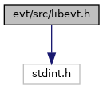

[Data Structures](#nested-classes) \| [Macros](#define-members) \| [Typedefs](#typedef-members) \| [Enumerations](#enum-members) \| [Functions](#func-members) \| [Variables](#var-members)

`#include <stdint.h>`

Include dependency graph for libevt.h:

<a href="libevt_8h_source.md">Go to the source code of this file.</a>

|                 |                        |
|-----------------|------------------------|
| Data Structures |                        |
| struct          | [Event](#struct_event) |

|          |                                               |
|----------|-----------------------------------------------|
| Macros   |                                               |
| #define  | [EVT_API](#a7e6311173510f4660ef3c2d2f234f429) |

|  |  |
|----|----|
| Typedefs |  |
| typedef unsigned long int  | [WaiterHandle](#a7ba4b46d2481427f399dda29a67aaab6) |
|   | Waiting handle type. [More\...](#a7ba4b46d2481427f399dda29a67aaab6)  |
| typedef uint64_t  | [UID](#a83aa1253e238763a389f784ff78d569e) |
|   | Unique ID of [Event](#struct_event). [More\...](#a83aa1253e238763a389f784ff78d569e)  |

|  |  |
|----|----|
| Enumerations |  |
| enum   | [OSEvents](#a47782499daa82ca02ceec0dde367c162) {   [OS_NOP](#a47782499daa82ca02ceec0dde367c162a46e70b83f1a2498c9325b00cb2cf4e3e) = 0, [OS_EVT_TIMER](#a47782499daa82ca02ceec0dde367c162a55c5d33fac553b62a4a2988c2b53af96), [OS_EVT_DOCK](#a47782499daa82ca02ceec0dde367c162aec9658ee40107e166a1dac5d8efc29a1), [OS_EVT_UNDOCK](#a47782499daa82ca02ceec0dde367c162a37f3b245fe203131c78859388aa7d6ec),   [OS_EVT_SHUTDOWN](#a47782499daa82ca02ceec0dde367c162ae25c516903050b08d5cd015e625bf3af) } |
| enum   | [WaitPolicy](#a7d8e96aac2c9ffc0945f804832b93305) { [WAIT_ANY](#a7d8e96aac2c9ffc0945f804832b93305a2a6b8a36eb30e1a3e433912876977446), [WAIT_ALL](#a7d8e96aac2c9ffc0945f804832b93305a5ee1ddeefe68a1f2a66eb8fa6440f0ba) } |
| enum   | [EvtSide](#a45a13daa32f946f8dd819ee734fbf236) { [SIDE_RAISER](#a45a13daa32f946f8dd819ee734fbf236ad699859f8546fbfb9ca1eab82e1a3586) = 0, [SIDE_WAITER](#a45a13daa32f946f8dd819ee734fbf236af860bd783aa79d81ad43ab8c164da7a8), [SIDE_BOTH](#a45a13daa32f946f8dd819ee734fbf236a367c08987c7a0052de86e72ffc318d97) } |
| enum   | [EvtOptions](#aaeb183a7a4790d18f96fa3755b1cbc42) { [EVT_OPT_DEFAULT](#aaeb183a7a4790d18f96fa3755b1cbc42aef88812f61bd57953fff8fa42b9a6fd0) = 0, [EVT_OPT_COPY_NEW_ONLY_EVENTS_IN_GET_BY_HANDLE_FUNC](#aaeb183a7a4790d18f96fa3755b1cbc42a3256b804f3c9350097da691390b88f76) = 0x1 \<\< 0 } |

|  |  |
|----|----|
| Functions |  |
| [EVT_API](#a7e6311173510f4660ef3c2d2f234f429) [UID](#a83aa1253e238763a389f784ff78d569e)  | [evt_make_uid](#a886f0a69446395a4013dc45380f4128f) (uint16_t componentID, uint16_t eventID) |
|   | Creates UID based on componentID and eventID. [More\...](#a886f0a69446395a4013dc45380f4128f)  |
| [EVT_API](#a7e6311173510f4660ef3c2d2f234f429) [UID](#a83aa1253e238763a389f784ff78d569e)  | [evt_make_uid_os](#afb47263c3337482a275b6cecf497204b) (uint16_t componentID, [OSEvents](#a47782499daa82ca02ceec0dde367c162) osEvent) |
|   | Creates UID based on componentID and OS [Event](#struct_event). [More\...](#afb47263c3337482a275b6cecf497204b)  |
| [EVT_API](#a7e6311173510f4660ef3c2d2f234f429) uint16_t  | [evt_get_component_id](#a2063afa16979be3952b393dd81bfd5f8) ([UID](#a83aa1253e238763a389f784ff78d569e)) |
|   | Returns componentID part of UID. [More\...](#a2063afa16979be3952b393dd81bfd5f8)  |
| [EVT_API](#a7e6311173510f4660ef3c2d2f234f429) long  | [evt_start_timer](#af7e23c1a0a2e9a3caa6faf55c3aae1d4) (uint32_t timeout) |
|   | Starts a new timer. [More\...](#af7e23c1a0a2e9a3caa6faf55c3aae1d4)  |
| [EVT_API](#a7e6311173510f4660ef3c2d2f234f429) void  | [evt_stop_timer](#a6f6a659420a37bb9e1d1b07edfe419a2) (long handle) |
|   | Deletes a timer. [More\...](#a6f6a659420a37bb9e1d1b07edfe419a2)  |
| [EVT_API](#a7e6311173510f4660ef3c2d2f234f429) int  | [evt_init](#a799ffc9044180e2968690455cfb5d8cf) ([EvtSide](#a45a13daa32f946f8dd819ee734fbf236) side, uint16_t componentID, uint8_t capacity) |
|   | Initialize EVT library. [More\...](#a799ffc9044180e2968690455cfb5d8cf)  |
| [EVT_API](#a7e6311173510f4660ef3c2d2f234f429) int  | [evt_destroy](#af8fba20f70dc5d4274484f3d3eaf0fc2) () |
|   | De-initialize EVT library. [More\...](#af8fba20f70dc5d4274484f3d3eaf0fc2)  |
| [EVT_API](#a7e6311173510f4660ef3c2d2f234f429) int  | [evt_wait](#adb08919483f2094f1927d67dad595278) ([Event](#struct_event) \*event, int timeout) |
|   | Wait for a single event. [More\...](#adb08919483f2094f1927d67dad595278)  |
| [EVT_API](#a7e6311173510f4660ef3c2d2f234f429) int  | [evt_wait_group](#ab26c08b8228d47a7b83144e5ec6d9c4e) ([Event](#struct_event) \*events, uint32_t count, int timeout, [WaitPolicy](#a7d8e96aac2c9ffc0945f804832b93305) policy) |
|   | Wait for a group of events. [More\...](#ab26c08b8228d47a7b83144e5ec6d9c4e)  |
| [EVT_API](#a7e6311173510f4660ef3c2d2f234f429) int  | [evt_raise](#a2855073610dc2b9210a25468926cfecc) ([Event](#struct_event) \*event) |
|   | Raise an event. [More\...](#a2855073610dc2b9210a25468926cfecc)  |
| [EVT_API](#a7e6311173510f4660ef3c2d2f234f429) [WaiterHandle](#a7ba4b46d2481427f399dda29a67aaab6)  | [evt_init_waiter](#a76bffba58228fdcd95671e17bf8ad041) ([Event](#struct_event) \*events, uint32_t count) |
|   | Initialize asynchronous waiter for a group of events. [More\...](#a76bffba58228fdcd95671e17bf8ad041)  |
| [EVT_API](#a7e6311173510f4660ef3c2d2f234f429) int  | [evt_get_by_handle](#a9fbabdeb66cb9541e4a4c146b7e1658a) ([WaiterHandle](#a7ba4b46d2481427f399dda29a67aaab6) waiter, [Event](#struct_event) \*events, uint32_t count) |
|   | Get events so far collected by asynchronous waiter. [More\...](#a9fbabdeb66cb9541e4a4c146b7e1658a)  |
| [EVT_API](#a7e6311173510f4660ef3c2d2f234f429) int  | [evt_peek_by_handle](#a793d32176ee75ec31b31f1fb1cd6abbc) ([WaiterHandle](#a7ba4b46d2481427f399dda29a67aaab6) waiter, [Event](#struct_event) \*events, uint32_t count) |
|   | Peek events so far collected by asynchronous waiter. [More\...](#a793d32176ee75ec31b31f1fb1cd6abbc)  |
| [EVT_API](#a7e6311173510f4660ef3c2d2f234f429) int  | [evt_wait_by_handle](#a57f2c3182b0ea176490a1735324de25e) ([WaiterHandle](#a7ba4b46d2481427f399dda29a67aaab6) handle, int timeout, [WaitPolicy](#a7d8e96aac2c9ffc0945f804832b93305) policy) |
|   | Blocks thread execution until waiter receive an event or timeout occurs. [More\...](#a57f2c3182b0ea176490a1735324de25e)  |
| [EVT_API](#a7e6311173510f4660ef3c2d2f234f429) int  | [evt_destroy_waiter](#a09b61b8da3127a2c067df17d29be4f1f) ([WaiterHandle](#a7ba4b46d2481427f399dda29a67aaab6) waiter) |
|   | Stops and destroys the asynchronous waiter. [More\...](#a09b61b8da3127a2c067df17d29be4f1f)  |
| [EVT_API](#a7e6311173510f4660ef3c2d2f234f429) void  | [evt_set_options](#a5e8063c63d656262cf58b6336b270502) (int options) |
|   | Set options changing behavior of ADK-EVT engine. [More\...](#a5e8063c63d656262cf58b6336b270502)  |
| [EVT_API](#a7e6311173510f4660ef3c2d2f234f429) int  | [evt_get_options](#aee16ce74c4a65f2ac2952bfd2f06dd27) () |
|   | Get options. [More\...](#aee16ce74c4a65f2ac2952bfd2f06dd27)  |
| const [EVT_API](#a7e6311173510f4660ef3c2d2f234f429) char \*  | [evt_getVersion](#a1a7daf80470e0ad3b570ec8fc680821d) () |
|   | get version of a library [More\...](#a1a7daf80470e0ad3b570ec8fc680821d)  |
| [EVT_API](#a7e6311173510f4660ef3c2d2f234f429) int  | [get_dock_sts](#adc9d1c34c7762b01b3b9830f1f70c6ed) () |
|   | Returns unit dock status. [More\...](#adc9d1c34c7762b01b3b9830f1f70c6ed)  |

|  |  |
|----|----|
| Variables |  |
| const long  | [EVT_ANY_HANDLE](#a63090fb17900201d2517be5e555b7d87) = -1 |
|   | Timer [Event](#struct_event) mask that allow to receive all timer events. [More\...](#a63090fb17900201d2517be5e555b7d87)  |
| const [WaiterHandle](#a7ba4b46d2481427f399dda29a67aaab6)  | [EVT_INVALID_HANDLE](#a468c3786a00e38b1d61d083fa0b4ce96) = 0 |
|   | Invalid WaiterHandle value. [More\...](#a468c3786a00e38b1d61d083fa0b4ce96)  |
| const int  | [EVT_INFINITE_WAIT](#a35fc755ca0569e2acb759e0d683a2fb5) = -1 |
|   | Timeout value for infinite wait. [More\...](#a35fc755ca0569e2acb759e0d683a2fb5)  |
| const uint32_t  | [EVT_DATA_SIZE](#adb6493cdff512931871b2239b71215c2) = 64 |
|   | Size of [Event](#struct_event) additional data. [More\...](#adb6493cdff512931871b2239b71215c2)  |
| const uint32_t  | [EVT_MAX_COUNT](#ac34c5452c5be1c370c9c3bf70044d4e0) = 256 |
|   | Maximal event count to wait for. [More\...](#ac34c5452c5be1c370c9c3bf70044d4e0)  |

------------------------------------------------------------------------

## DataStructure Documentation {#data-structure-documentation}

## Event 

struct Event

ADK [Event](#struct_event) structure.

| Data Fields |  |  |
|----|----|----|
| long | handle | OS [Event](#struct_event) handle or EVT_ANY_HANDLE. |
| [UID](#a83aa1253e238763a389f784ff78d569e) | id | [Event](#struct_event) ID. Must be specified by both raise and wait sides. |
| char | raised_data\[[EVT_DATA_SIZE](#adb6493cdff512931871b2239b71215c2)\] | Additional data for received [Event](#struct_event). |
| uint8_t | raised_flag | Raising flag. Indicates that [Event](#struct_event) was successfully received. |
| long | raised_handle | OS [Event](#struct_event) return Handle. |
| uint64_t | raised_timestamp | Timestamp of raised event. Unix time in seconds. |
| uint16_t | raised_version | [Event](#struct_event) version. Data is componentID/eventID specific. |

## MacroDefinition Documentation {#macro-definition-documentation}

## EVT_API 

#define EVT_API

## TypedefDocumentation {#typedef-documentation}

## UID 

typedef uint64_t [UID](#a83aa1253e238763a389f784ff78d569e)

Unique ID of [Event](#struct_event).

## WaiterHandle 

typedef unsigned long int [WaiterHandle](#a7ba4b46d2481427f399dda29a67aaab6)

Waiting handle type.

## EnumerationType Documentation {#enumeration-type-documentation}

## EvtOptions 

enum [EvtOptions](#aaeb183a7a4790d18f96fa3755b1cbc42)

EVT engine options

| Enumerator                                          |     |
|-----------------------------------------------------|-----|
| EVT_OPT_DEFAULT                                     |     |
| EVT_OPT_COPY_NEW_ONLY_EVENTS_IN_GET_BY_HANDLE_FUNC  |     |

## EvtSide 

enum [EvtSide](#a45a13daa32f946f8dd819ee734fbf236)

| Enumerator   |     |
|--------------|-----|
| SIDE_RAISER  |     |
| SIDE_WAITER  |     |
| SIDE_BOTH    |     |

## OSEvents 

enum [OSEvents](#a47782499daa82ca02ceec0dde367c162)

| Enumerator       |     |
|------------------|-----|
| OS_NOP           |     |
| OS_EVT_TIMER     |     |
| OS_EVT_DOCK      |     |
| OS_EVT_UNDOCK    |     |
| OS_EVT_SHUTDOWN  |     |

## WaitPolicy 

enum [WaitPolicy](#a7d8e96aac2c9ffc0945f804832b93305)

Waiting policies for event groups.

| Enumerator |  |
|----|----|
| WAIT_ANY  |  |
| WAIT_ALL  | 
Stop waiting if at least 1 event from group is raised.
 |

## FunctionDocumentation {#function-documentation}

## evt_destroy() 

[EVT_API](#a7e6311173510f4660ef3c2d2f234f429) int evt_destroy

De-initialize EVT library.

Destroys caching structures, do cleanup. Make sure all waiters are stopped before this call.

### Returns

Negative: error with errno value. 0: Library successfully de-initialized.

## evt_destroy_waiter() 

[EVT_API](#a7e6311173510f4660ef3c2d2f234f429) int evt_destroy_waiter

Stops and destroys the asynchronous waiter.

Send waiter thread an exit signal then join the thread.

**Parameters**

**waiter** A handle created by evt_init_waiter(). Passing here already destroyed handle cause an undefined behavior.

### Returns

Negative: error with errno value. 0: on success.

## evt_get_by_handle() 

[EVT_API](#a7e6311173510f4660ef3c2d2f234f429) int evt_get_by_handle

Get events so far collected by asynchronous waiter.

Function returns immediately. Returns either all or only \'new\' events (collected from the last call), depends from EVT_OPT_COPY_NEW_ONLY_EVENTS_IN_GET_BY_HANDLE_FUNC compatibility option.

**Parameters**

**waiter** A handle created by evt_init_waiter(). Passing here a destroyed handle cause an undefined behavior. **events** Array of Events to fill. **count** Number of events represented in \'events\' param. (Must be equal or more as passed to evt_init_waiter()).

### Returns

Negative: error with errno value. 0: success but there is no raised event (since last call). Positive: returns number of raised events. Events are copied to \'events\' member.

## evt_get_component_id() 

[EVT_API](#a7e6311173510f4660ef3c2d2f234f429) uint16_t evt_get_component_id

Returns componentID part of UID.

**Parameters**

**UID**

### Returns

componentID

## evt_get_options() 

[EVT_API](#a7e6311173510f4660ef3c2d2f234f429) int evt_get_options

Get options.

### Returns

the options set

## evt_getVersion() 

const [EVT_API](#a7e6311173510f4660ef3c2d2f234f429) char\* evt_getVersion

get version of a library

### Returns

string with version

## evt_init() 

[EVT_API](#a7e6311173510f4660ef3c2d2f234f429) int evt_init

Initialize EVT library.

Creates caching structures, sets ignore to SIGPIPE signal (V/OS - raiser side).

**Parameters**

**side** Side to be initialized. **componentID** System wide component ID. **capacity** Estimated number of unique events to be processed.

### Returns

Negative: error with errno value. 0: Library successfully initialized.

## evt_init_waiter() 

[EVT_API](#a7e6311173510f4660ef3c2d2f234f429) [WaiterHandle](#a7ba4b46d2481427f399dda29a67aaab6) evt_init_waiter

Initialize asynchronous waiter for a group of events.

**Parameters**

**events** Array of Events to wait for. Caller is responsible to provide only unique ID. **count** Number of events represented in \'events\' param.

### Returns

EVT_INVALID_HANDLE on failure or valid WaiterHandle otherwise.

## evt_make_uid() 

[EVT_API](#a7e6311173510f4660ef3c2d2f234f429) [UID](#a83aa1253e238763a389f784ff78d569e) evt_make_uid

Creates UID based on componentID and eventID.

UID Creation helper function for user events.

**Parameters**

**componentID** System wide component ID. **eventID** Component wide event ID.

### Returns

[Event](#struct_event) UID.

## evt_make_uid_os() 

[EVT_API](#a7e6311173510f4660ef3c2d2f234f429) [UID](#a83aa1253e238763a389f784ff78d569e) evt_make_uid_os

Creates UID based on componentID and OS [Event](#struct_event).

UID Creation helper function for OS events.

**Parameters**

**componentID** System wide component ID. **osEvent** OS Event.

### Returns

[Event](#struct_event) UID.

## evt_peek_by_handle() 

[EVT_API](#a7e6311173510f4660ef3c2d2f234f429) int evt_peek_by_handle

Peek events so far collected by asynchronous waiter.

Function returns immediately. Returns either all or only \'new\' events, depends from EVT_OPT_COPY_NEW_ONLY_EVENTS_IN_GET_BY_HANDLE_FUNC compatibility option.

**Parameters**

**waiter** A handle created by evt_init_waiter(). Passing here a destroyed handle cause an undefined behavior. **events** Array of Events to fill. **count** Number of events represented in \'events\' param. (Must be equal or more as passed to evt_init_waiter()).

### Returns

Negative: error with errno value. 0: success but there is no raised event (since last call). Positive: returns number of raised events. Events are copied to \'events\' member.

## evt_raise() 

[EVT_API](#a7e6311173510f4660ef3c2d2f234f429) int evt_raise

Raise an event.

Raise an event specified by \'event\'. Works synchronously and returns after event is sent.

**Parameters**

**event** An Event to raise.

### Returns

Negative: error with errno value. 0: [Event](#struct_event) successfully raised.

## evt_set_options() 

[EVT_API](#a7e6311173510f4660ef3c2d2f234f429) void evt_set_options

Set options changing behavior of ADK-EVT engine.

**Parameters**

**options** The options are coded as bitmasks and can be combined by a logical or operation. All available options are collected in EvtOptions enum.

## evt_start_timer() 

[EVT_API](#a7e6311173510f4660ef3c2d2f234f429) long evt_start_timer

Starts a new timer.

Schedules an event after a timeout.

**Parameters**

**timeout** Timeout in ms. Max value is 24h (86,400,000 ms)

### Returns

Negative: error with errno value. Non negative: timer handle.

## evt_stop_timer() 

[EVT_API](#a7e6311173510f4660ef3c2d2f234f429) void evt_stop_timer

Deletes a timer.

Stops a timer and free associated resources.

**Parameters**

**handle** Timer handle acquired by evt_start_timer().

## evt_wait() 

[EVT_API](#a7e6311173510f4660ef3c2d2f234f429) int evt_wait

Wait for a single event.

Stops thread execution till \'event\' is received or time specified by \'timeout\' is up.

**Parameters**

**event** An Event to wait for. **timeout** A valid wait timeout (timeout \> 0) in ms. EVT_INFINITE_WAIT - for infinite wait.

### Returns

Negative: error with errno value. 0: [Event](#struct_event) successfully received. Positive: ETIME - on timeout.

## evt_wait_by_handle() 

[EVT_API](#a7e6311173510f4660ef3c2d2f234f429) int evt_wait_by_handle

Blocks thread execution until waiter receive an event or timeout occurs.

Function returns only if event is received or timeout occurred

**Parameters**

**waiter** A handle created by evt_init_waiter(). Passing here a destroyed handle cause an undefined behavior. **timeout** A valid wait timeout (timeout \> 0) in ms. EVT_INFINITE_WAIT - for infinite wait. **policy** WaitPolicy for event group.

### Returns

ETIME: timeout occurred 0: event received

## evt_wait_group() 

[EVT_API](#a7e6311173510f4660ef3c2d2f234f429) int evt_wait_group

Wait for a group of events.

Stops thread execution till one or all (see \'policy\') \'events\' are received or time specified by \'timeout\' is up.

**Parameters**

**events** Array of Events to wait for. Caller is responsible to provide only unique ID. **count** Number of events represented in \'events\' param. **timeout** A valid wait timeout (timeout \> 0) in ms. EVT_INFINITE_WAIT - for infinite wait. **policy** WaitPolicy for event group.

### Returns

Negative: error with errno value. 0: [Event](#struct_event) successfully received. Positive: ETIME - on timeout.

## get_dock_sts() 

[EVT_API](#a7e6311173510f4660ef3c2d2f234f429) int get_dock_sts

Returns unit dock status.

### Returns

0: Unit is docked -1: Unit is undocked.

## VariableDocumentation {#variable-documentation}

## EVT_ANY_HANDLE 

const long EVT_ANY_HANDLE = -1

Timer [Event](#struct_event) mask that allow to receive all timer events.

## EVT_DATA_SIZE 

const uint32_t EVT_DATA_SIZE = 64

Size of [Event](#struct_event) additional data.

## EVT_INFINITE_WAIT 

const int EVT_INFINITE_WAIT = -1

Timeout value for infinite wait.

## EVT_INVALID_HANDLE 

const [WaiterHandle](#a7ba4b46d2481427f399dda29a67aaab6) EVT_INVALID_HANDLE = 0

Invalid WaiterHandle value.

## EVT_MAX_COUNT 

const uint32_t EVT_MAX_COUNT = 256

Maximal event count to wait for.
