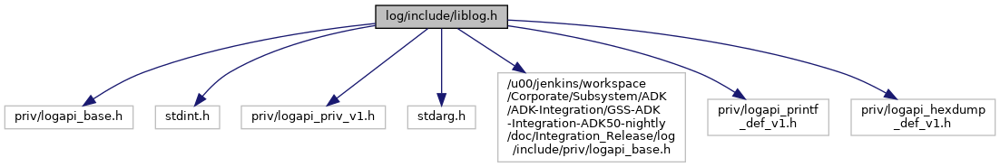
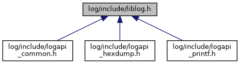

[Macros](#define-members)

`#include "priv/logapi_base.h"`
`#include "priv/logapi_priv_v1.h"`
`#include "priv/logapi_printf_def_v1.h"`
`#include "priv/logapi_hexdump_def_v1.h"`

Include dependency graph for liblog.h:

This graph shows which files directly or indirectly include this file:

<a href="liblog_8h_source.md">Go to the source code of this file.</a>

|          |                                                               |
|----------|---------------------------------------------------------------|
| Macros   |                                                               |
| #define  | [LIBLOG_API_VERSION](#ab95c10e43fb6b2a9666d4a5dbdfae905)   11 |

## MacroDefinition Documentation {#macro-definition-documentation}

## LIBLOG_API_VERSION 

#define LIBLOG_API_VERSION   11

