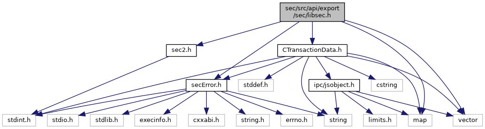
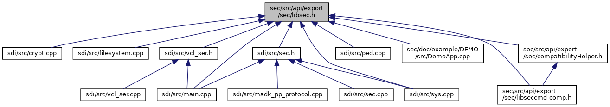

[Namespaces](#namespaces) \| [Macros](#define-members) \| [Functions](#func-members)

ADK Security Service API. [More\...](#details)

`#include "`<a href="sec2_8h_source.md">sec2.h</a>`"`
`#include "`<a href="_c_transaction_data_8h_source.md">CTransactionData.h</a>`"`
`#include <vector>`
`#include <map>`
`#include "`<a href="sec_error_8h_source.md">secError.h</a>`"`

Include dependency graph for libsec.h:

This graph shows which files directly or indirectly include this file:

<a href="libsec_8h_source.md">Go to the source code of this file.</a>

|  |  |
|----|----|
| Namespaces |  |
|   | <a href="namespacecom__verifone__seccmd.md">com_verifone_seccmd</a> |

|          |                                                       |
|----------|-------------------------------------------------------|
| Macros   |                                                       |
| #define  | [DllSpecSEC](#abcde1739ffe76c2296e21ce0b20f0ad3)      |
| #define  | [VOS3_Depricated](#aee3bc4f656b4576272b4ad069ed0aa01) |

|  |  |
|----|----|
| Functions |  |
| <a href="seclogging_8h.md#abcde1739ffe76c2296e21ce0b20f0ad3">DllSpecSEC</a> <a href="namespacecom__adksec__cmd.md#af511ddd4237541a758df48299546d49a">secError</a>  | <a href="namespacecom__verifone__seccmd.md#ab649bee85abb5cb4085c3958f279483d">secInit</a> () |
| <a href="seclogging_8h.md#abcde1739ffe76c2296e21ce0b20f0ad3">DllSpecSEC</a> <a href="namespacecom__adksec__cmd.md#af511ddd4237541a758df48299546d49a">secError</a>  | <a href="namespacecom__verifone__seccmd.md#a644b5479904871433cffef9145c53dad">secDestroy</a> () |
| <a href="seclogging_8h.md#abcde1739ffe76c2296e21ce0b20f0ad3">DllSpecSEC</a> <a href="namespacecom__adksec__cmd.md#af511ddd4237541a758df48299546d49a">secError</a>  | <a href="namespacecom__verifone__seccmd.md#a8091d419f67f4b53630f2fabe1888a09">secOpen</a> (const std::string &, <a href="namespacecom__adksec__cmd.md#acc01edab4b0f73c92142d9d43dc7a7f7">secHandle_t</a> &handle) |
| <a href="seclogging_8h.md#abcde1739ffe76c2296e21ce0b20f0ad3">DllSpecSEC</a> [VOS3_Depricated](#aee3bc4f656b4576272b4ad069ed0aa01) <a href="namespacecom__adksec__cmd.md#af511ddd4237541a758df48299546d49a">secError</a>  | <a href="namespacecom__verifone__seccmd.md#a0214e263380c9c6e10f3c0afc4f53e8a">secOpen</a> (const <a href="namespacecom__adksec__cmd.md#a8963c1dd7c626a621a8033209294fcbd">SecTransactionData_t</a> &td, <a href="namespacecom__adksec__cmd.md#acc01edab4b0f73c92142d9d43dc7a7f7">secHandle_t</a> &handle) |
| <a href="seclogging_8h.md#abcde1739ffe76c2296e21ce0b20f0ad3">DllSpecSEC</a> <a href="namespacecom__adksec__cmd.md#af511ddd4237541a758df48299546d49a">secError</a>  | <a href="namespacecom__verifone__seccmd.md#a34f8a9e3b92467759d0bbdbf7b2dd8c0">secClose</a> (<a href="namespacecom__adksec__cmd.md#acc01edab4b0f73c92142d9d43dc7a7f7">secHandle_t</a> handle) |
| <a href="seclogging_8h.md#abcde1739ffe76c2296e21ce0b20f0ad3">DllSpecSEC</a> <a href="namespacecom__adksec__cmd.md#af511ddd4237541a758df48299546d49a">secError</a>  | <a href="namespacecom__verifone__seccmd.md#a75edecb24f839e04debb1aa5e47b5714">secSetKSId</a> (<a href="namespacecom__adksec__cmd.md#acc01edab4b0f73c92142d9d43dc7a7f7">secHandle_t</a> handle, uint32_t ksid) |
| <a href="seclogging_8h.md#abcde1739ffe76c2296e21ce0b20f0ad3">DllSpecSEC</a> <a href="namespacecom__adksec__cmd.md#af511ddd4237541a758df48299546d49a">secError</a>  | <a href="namespacecom__verifone__seccmd.md#a79b00ea8a8aed3b7950800bf136a1944">secGetKeyInventory</a> (<a href="namespacecom__adksec__cmd.md#acc01edab4b0f73c92142d9d43dc7a7f7">secHandle_t</a> handle, std::string &out) |
| <a href="seclogging_8h.md#abcde1739ffe76c2296e21ce0b20f0ad3">DllSpecSEC</a> <a href="namespacecom__adksec__cmd.md#af511ddd4237541a758df48299546d49a">secError</a>  | <a href="namespacecom__verifone__seccmd.md#aff0a109c58ef5637c7bf3ffc0722c48d">secGetKeyData</a> (<a href="namespacecom__adksec__cmd.md#acc01edab4b0f73c92142d9d43dc7a7f7">secHandle_t</a> handle, <a href="namespacecom__verifone__host.md#a2418ec606f68970a9ed5ddf6ede58a2f">com_verifone_host::key_type_t</a> keyType, std::vector\< uint8_t \> &out) |
| <a href="seclogging_8h.md#abcde1739ffe76c2296e21ce0b20f0ad3">DllSpecSEC</a> <a href="namespacecom__adksec__cmd.md#af511ddd4237541a758df48299546d49a">secError</a>  | <a href="namespacecom__verifone__seccmd.md#ab249c77069e9fc9946745fd4c63d5e39">secUpdateKey</a> (<a href="namespacecom__adksec__cmd.md#acc01edab4b0f73c92142d9d43dc7a7f7">secHandle_t</a> handle, <a href="namespacecom__verifone__host.md#a2418ec606f68970a9ed5ddf6ede58a2f">com_verifone_host::key_type_t</a> keyType, const std::vector\< uint8_t \> &keyData, std::vector\< uint8_t \> &propData) |
| <a href="namespacecom__adksec__cmd.md#af511ddd4237541a758df48299546d49a">secError</a>  | <a href="namespacecom__verifone__seccmd.md#afeef2dc9bf85b090e712c03d0314b095">secUpdateKey</a> (<a href="namespacecom__adksec__cmd.md#acc01edab4b0f73c92142d9d43dc7a7f7">secHandle_t</a> handle, <a href="namespacecom__verifone__host.md#a2418ec606f68970a9ed5ddf6ede58a2f">com_verifone_host::key_type_t</a> keyType, const std::vector\< uint8_t \> &keyData) |
| <a href="seclogging_8h.md#abcde1739ffe76c2296e21ce0b20f0ad3">DllSpecSEC</a> <a href="namespacecom__adksec__cmd.md#af511ddd4237541a758df48299546d49a">secError</a>  | <a href="namespacecom__verifone__seccmd.md#aa58bc1a6a2056aebd3edc92f3bfcce9d">secEncryptData</a> (<a href="namespacecom__adksec__cmd.md#acc01edab4b0f73c92142d9d43dc7a7f7">secHandle_t</a> handle, const std::vector\< uint8_t \> &plainData, std::vector\< uint8_t \> &encData, std::vector\< uint8_t \> &iv, std::vector\< uint8_t \> &ksn) |
| <a href="seclogging_8h.md#abcde1739ffe76c2296e21ce0b20f0ad3">DllSpecSEC</a> [VOS3_Depricated](#aee3bc4f656b4576272b4ad069ed0aa01) <a href="namespacecom__adksec__cmd.md#af511ddd4237541a758df48299546d49a">secError</a>  | <a href="namespacecom__verifone__seccmd.md#aaed6fc175245ba31936547cffd988948">secEncryptTransactionData</a> (<a href="namespacecom__adksec__cmd.md#acc01edab4b0f73c92142d9d43dc7a7f7">secHandle_t</a> handle, const <a href="namespacecom__adksec__cmd.md#ad15b3c697f22fd80a8a42e5547c5b8e4">secIndex_t</a> &TDindex, std::vector\< uint8_t \> &encData, std::vector\< uint8_t \> &iv, std::vector\< uint8_t \> &ksn) |
| <a href="seclogging_8h.md#abcde1739ffe76c2296e21ce0b20f0ad3">DllSpecSEC</a> <a href="namespacecom__adksec__cmd.md#af511ddd4237541a758df48299546d49a">secError</a>  | <a href="namespacecom__verifone__seccmd.md#a9cd679dc9763b06566dff28b3d3268c9">secDecryptData</a> (<a href="namespacecom__adksec__cmd.md#acc01edab4b0f73c92142d9d43dc7a7f7">secHandle_t</a> handle, const std::vector\< uint8_t \> &encData, std::vector\< uint8_t \> &plainData, std::vector\< uint8_t \> &iv, std::vector\< uint8_t \> &ksn) |
| <a href="seclogging_8h.md#abcde1739ffe76c2296e21ce0b20f0ad3">DllSpecSEC</a> <a href="namespacecom__adksec__cmd.md#af511ddd4237541a758df48299546d49a">secError</a>  | <a href="namespacecom__verifone__seccmd.md#a66a1992f617359f2e4a96f4980478f82">secSign</a> (<a href="namespacecom__adksec__cmd.md#acc01edab4b0f73c92142d9d43dc7a7f7">secHandle_t</a> handle, const std::vector\< uint8_t \> &data, std::vector\< uint8_t \> &signature, std::vector\< uint8_t \> &iv, std::vector\< uint8_t \> &ksn) |
| <a href="seclogging_8h.md#abcde1739ffe76c2296e21ce0b20f0ad3">DllSpecSEC</a> <a href="namespacecom__adksec__cmd.md#af511ddd4237541a758df48299546d49a">secError</a>  | <a href="namespacecom__verifone__seccmd.md#a5470ce89fa947abc445f251ae0b2387b">secVerify</a> (<a href="namespacecom__adksec__cmd.md#acc01edab4b0f73c92142d9d43dc7a7f7">secHandle_t</a> handle, const std::vector\< uint8_t \> &data, const std::vector\< uint8_t \> &signature, std::vector\< uint8_t \> &iv, std::vector\< uint8_t \> &ksn) |
| <a href="seclogging_8h.md#abcde1739ffe76c2296e21ce0b20f0ad3">DllSpecSEC</a> <a href="namespacecom__adksec__cmd.md#af511ddd4237541a758df48299546d49a">secError</a>  | <a href="namespacecom__verifone__seccmd.md#ab3d26136c64019fd223aa9ccd120d4e0">secRetrieveEncryptedPIN</a> (<a href="namespacecom__adksec__cmd.md#acc01edab4b0f73c92142d9d43dc7a7f7">secHandle_t</a> handle, const uint8_t pinBlockFormat, std::vector\< unsigned char \> &pinBlk, std::vector\< uint8_t \> &ksn) |
| <a href="seclogging_8h.md#abcde1739ffe76c2296e21ce0b20f0ad3">DllSpecSEC</a> <a href="namespacecom__adksec__cmd.md#af511ddd4237541a758df48299546d49a">secError</a>  | <a href="namespacecom__verifone__seccmd.md#a77860b4cffed3ba159a5c124c8e2cde2">secIncrementKSN</a> (<a href="namespacecom__adksec__cmd.md#acc01edab4b0f73c92142d9d43dc7a7f7">secHandle_t</a> handle, std::vector\< uint8_t \> &ksn) |
| <a href="seclogging_8h.md#abcde1739ffe76c2296e21ce0b20f0ad3">DllSpecSEC</a> <a href="namespacecom__adksec__cmd.md#af511ddd4237541a758df48299546d49a">secError</a>  | <a href="namespacecom__verifone__seccmd.md#a008e3cde266f576be23846d0c7b729c5">secGetStatus</a> (std::string &jsonString, std::string hostName=\"\") |
| <a href="seclogging_8h.md#abcde1739ffe76c2296e21ce0b20f0ad3">DllSpecSEC</a> <a href="namespacecom__adksec__cmd.md#af511ddd4237541a758df48299546d49a">secError</a>  | <a href="namespacecom__verifone__seccmd.md#a5fdc04a9bb61305af440ff6aaa9d4bf2">secGetStatus</a> (std::string &jsonString, <a href="namespacecom__adksec__cmd.md#acc01edab4b0f73c92142d9d43dc7a7f7">secHandle_t</a> handle) |
| <a href="seclogging_8h.md#abcde1739ffe76c2296e21ce0b20f0ad3">DllSpecSEC</a> <a href="namespacecom__adksec__cmd.md#af511ddd4237541a758df48299546d49a">secError</a>  | <a href="namespacecom__verifone__seccmd.md#a5499423d685ed9deb7ace9c22114adf2">secGetVersions</a> (std::string &versions) |
| <a href="seclogging_8h.md#abcde1739ffe76c2296e21ce0b20f0ad3">DllSpecSEC</a> std::string  | <a href="namespacecom__verifone__seccmd.md#a5ea5cbc9daa2ea726212741cd596b294">secGetApiVersion</a> (void) |
| <a href="seclogging_8h.md#abcde1739ffe76c2296e21ce0b20f0ad3">DllSpecSEC</a> std::string  | <a href="namespacecom__verifone__seccmd.md#a029d7e16ab6b044379e9568a6c969afa">secGetSvcVersion</a> (void) |
| <a href="seclogging_8h.md#abcde1739ffe76c2296e21ce0b20f0ad3">DllSpecSEC</a> [VOS3_Depricated](#aee3bc4f656b4576272b4ad069ed0aa01) <a href="namespacecom__adksec__cmd.md#af511ddd4237541a758df48299546d49a">secError</a>  | <a href="namespacecom__verifone__seccmd.md#ac31ab997e8dc434d72e427a5d841186a">secClearTransactionData</a> (<a href="namespacecom__adksec__cmd.md#acc01edab4b0f73c92142d9d43dc7a7f7">secHandle_t</a> handle) |
| <a href="seclogging_8h.md#abcde1739ffe76c2296e21ce0b20f0ad3">DllSpecSEC</a> [VOS3_Depricated](#aee3bc4f656b4576272b4ad069ed0aa01) <a href="namespacecom__adksec__cmd.md#af511ddd4237541a758df48299546d49a">secError</a>  | <a href="namespacecom__verifone__seccmd.md#a6bc0d39e1739680282d33d3d68df84c9">secPutTransactionData</a> (<a href="namespacecom__adksec__cmd.md#acc01edab4b0f73c92142d9d43dc7a7f7">secHandle_t</a> handle, const <a href="namespacecom__adksec__cmd.md#a8963c1dd7c626a621a8033209294fcbd">SecTransactionData_t</a> &taData) |
| <a href="seclogging_8h.md#abcde1739ffe76c2296e21ce0b20f0ad3">DllSpecSEC</a> [VOS3_Depricated](#aee3bc4f656b4576272b4ad069ed0aa01) <a href="namespacecom__adksec__cmd.md#af511ddd4237541a758df48299546d49a">secError</a>  | <a href="namespacecom__verifone__seccmd.md#a85ada2e35c1d1cbf60c05454b88b4b44">secGetTransactionValue</a> (<a href="namespacecom__adksec__cmd.md#acc01edab4b0f73c92142d9d43dc7a7f7">secHandle_t</a> handle, const <a href="namespacecom__adksec__cmd.md#ad15b3c697f22fd80a8a42e5547c5b8e4">secIndex_t</a> &key, <a href="namespacecom__adksec__cmd.md#abddf3fd58f8658a7475911ed80e0fe20">SecTransactionValue</a> &date) |
| <a href="seclogging_8h.md#abcde1739ffe76c2296e21ce0b20f0ad3">DllSpecSEC</a> [VOS3_Depricated](#aee3bc4f656b4576272b4ad069ed0aa01) <a href="namespacecom__adksec__cmd.md#af511ddd4237541a758df48299546d49a">secError</a>  | <a href="namespacecom__verifone__seccmd.md#af127868b6268758596f8a2a1ca0aaab3">secGetPermission</a> (<a href="namespacecom__adksec__cmd.md#acc01edab4b0f73c92142d9d43dc7a7f7">secHandle_t</a> handle, const <a href="namespacecom__adksec__cmd.md#ad15b3c697f22fd80a8a42e5547c5b8e4">secIndex_t</a> &key, <a href="namespacecom__adksec__cmd.md#af79ae13c5f9ec8424f44764288144041">bitMask_t</a> &permissionFlags) |
| <a href="seclogging_8h.md#abcde1739ffe76c2296e21ce0b20f0ad3">DllSpecSEC</a> <a href="namespacecom__adksec__cmd.md#af511ddd4237541a758df48299546d49a">secError</a>  | <a href="namespacecom__verifone__seccmd.md#a689199c9e7e4d8a553f3ab2f379b812e">secGenerateRandom</a> (std::vector\< uint8_t \> &data, int count) |
| <a href="seclogging_8h.md#abcde1739ffe76c2296e21ce0b20f0ad3">DllSpecSEC</a> <a href="namespacecom__adksec__cmd.md#af511ddd4237541a758df48299546d49a">secError</a>  | <a href="namespacecom__verifone__seccmd.md#a0cca8cfbb868cbf34d35afabe5af29af">secDigest</a> (int type, std::vector\< uint8_t \> &data, std::vector\< uint8_t \> &digest) |

## DetailedDescription {#detailed-description}

ADK Security Service API.

This header file contains information about the ADK security service API functions.

## MacroDefinition Documentation {#macro-definition-documentation}

## DllSpecSEC 

#define DllSpecSEC

## VOS3_Depricated 

#define VOS3_Depricated

